# Python Introduction

## 1. What is Python?

Python is a high-level, interpreted programming language designed to make programming easier, faster, and more readable.

It was created by Guido van Rossum in 1991.

Python is used in:

* Machine Learning
* Artificial Intelligence
* Data Science
* Web Development
* Automation
* Cybersecurity
* Cloud Engineering
* APIs
* Game Development
* Scientific Computing

Today, companies like Google, Netflix, Meta, and OpenAI heavily use Python.

---

# Why Python Exists

Before Python, many languages were:

* difficult to read
* verbose
* slower to develop in
* harder for beginners

Python solved this by focusing on:

* readability
* simplicity
* developer productivity

Python philosophy:

> “Code is read more often than it is written.”

That is why Python syntax looks close to English.

---

# Real World Analogy

Think of programming languages as vehicles.

| Language | Analogy                     |
| -------- | --------------------------- |
| C        | Manual race car             |
| C++      | High-performance sports car |
| Java     | Commercial truck            |
| Python   | Smart automatic car         |

Python hides many low-level complexities so engineers can focus on solving problems instead of managing memory manually.

---

# 2. Why Python Became So Popular

Python became dominant because it reduces engineering friction.

Instead of spending hours on:

* memory management
* compilation issues
* boilerplate code

developers can directly build solutions.

Example:

### C Language

```c
#include<stdio.h>

int main() {
    printf("Hello World");
    return 0;
}
```

### Python

```python
print("Hello World")
```

Python drastically reduces syntax overhead.

That matters massively in:

* startups
* ML research
* automation
* rapid prototyping

---

# 3. Core Characteristics of Python

| Feature           | Meaning                           |
| ----------------- | --------------------------------- |
| High-Level        | Easier for humans                 |
| Interpreted       | Executes line-by-line             |
| Dynamically Typed | No need to declare variable types |
| Object-Oriented   | Supports classes and objects      |
| Cross-Platform    | Runs on Windows/Linux/macOS       |
| Huge Ecosystem    | Massive library support           |

---

# 4. How Python Works Internally

Most beginners think:

> “Python directly runs code.”

Wrong.

Python actually goes through multiple stages internally.

---

# Python Execution Flow

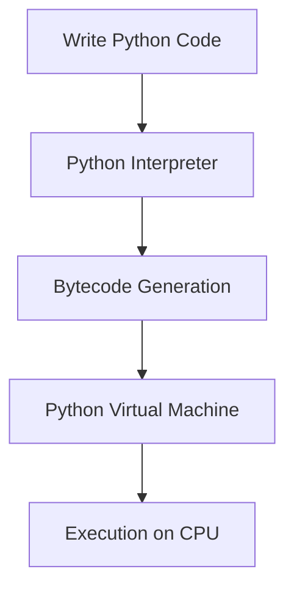

---

# Internal Working Deep Dive

## Step 1 → Source Code

You write:

```python
print("Hello")
```

Saved as:

```python
hello.py
```

---

## Step 2 → Compilation to Bytecode

Python converts code into:

```python
.pyc
```

This is intermediate bytecode.

NOT machine code.

---

## Step 3 → Python Virtual Machine (PVM)

The PVM executes bytecode instruction-by-instruction.

This is why Python is slower than C.

Because Python:

* interprets dynamically
* performs runtime checks
* manages objects automatically

---

# 5. Python Memory Model

Python uses automatic memory management.

You do NOT manually allocate/free memory like C.

Example:

```python
x = 10
```

Internally:

* integer object created in heap memory
* variable `x` stores reference
* reference counter increases

---

# Memory Visualization

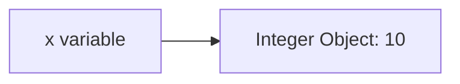

Python variables are NOT boxes.

They are references to objects.

This is one of the biggest beginner misunderstandings.

---

# 6. Variables in Python

## Example

```python
name = "Akshit"
age = 21
```

### Syntax Breakdown

| Part       | Meaning             |
| ---------- | ------------------- |
| `name`     | Variable name       |
| `=`        | Assignment operator |
| `"Akshit"` | String object       |

---

# Dynamic Typing

Python automatically detects types.

```python
x = 10
x = "hello"
```

Same variable can reference different object types.

Internally:

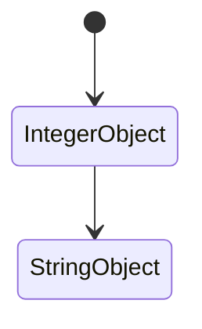

---

# 7. Python Data Types

## Primitive Types

| Type  | Example |
| ----- | ------- |
| int   | 10      |
| float | 10.5    |
| str   | "hello" |
| bool  | True    |

---

## Collection Types

| Type  | Purpose                      |
| ----- | ---------------------------- |
| list  | Ordered mutable collection   |
| tuple | Ordered immutable collection |
| set   | Unique unordered values      |
| dict  | Key-value mapping            |

---

# Dictionary Analogy

Dictionary works like:

```text
Phonebook Lookup System
```

Instead of searching linearly, Python uses hashing.

This makes lookup extremely fast.

---

# Dictionary Internal Working

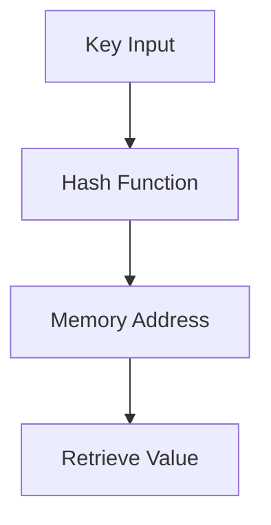

This is foundational in:

* databases
* caching
* ML preprocessing
* API systems

---

# 8. Python Syntax Basics

## Printing

```python
print("Hello World")
```

### Breakdown

| Component       | Purpose           |
| --------------- | ----------------- |
| `print()`       | Built-in function |
| `"Hello World"` | String literal    |

---

## Taking Input

```python
name = input("Enter name: ")
```

### Execution Flow

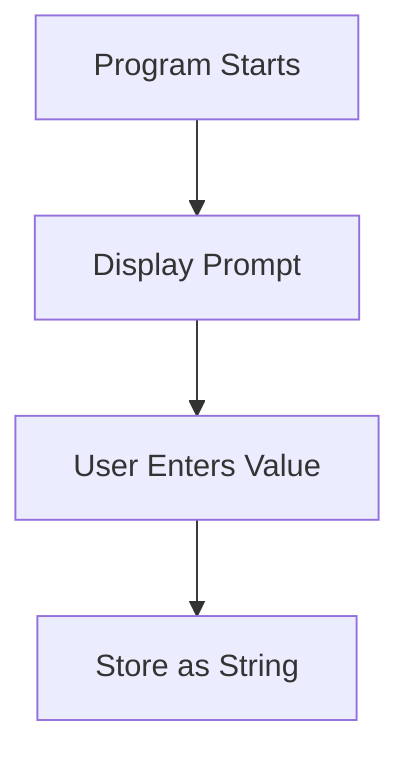

Important:

`input()` always returns string.

Beginners constantly forget this.

---

# 9. Conditional Statements

## Example

```python
age = 18

if age >= 18:
    print("Adult")
```

---

# Execution Flow

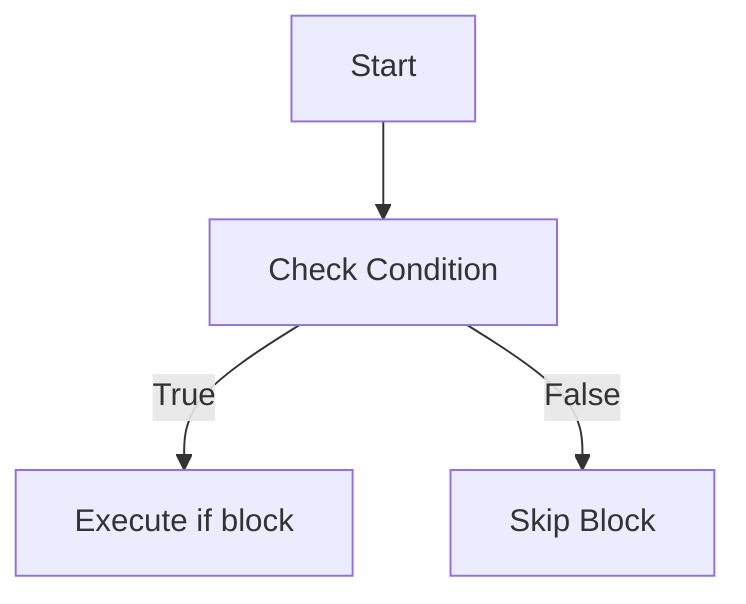

---

# 10. Loops

Loops automate repetition.

---

## For Loop Example

```python
for i in range(5):
    print(i)
```

---

# Syntax Breakdown

| Component  | Meaning            |
| ---------- | ------------------ |
| `for`      | Iteration keyword  |
| `i`        | Loop variable      |
| `range(5)` | Generates sequence |
| `:`        | Starts block       |

---

# Loop Execution Flow

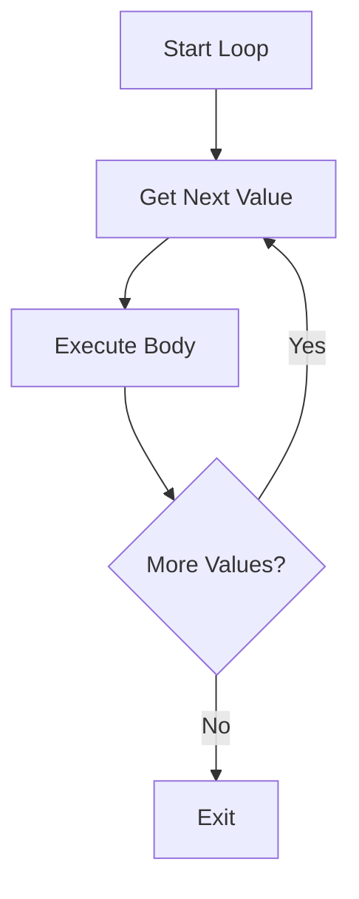

---

# 11. Functions

Functions are reusable logic blocks.

---

## Example

```python
def add(a, b):
    return a + b
```

---

# Function Analogy

Functions are like factory machines.

Input goes in → processing happens → output comes out.

---

# Function Execution Flow

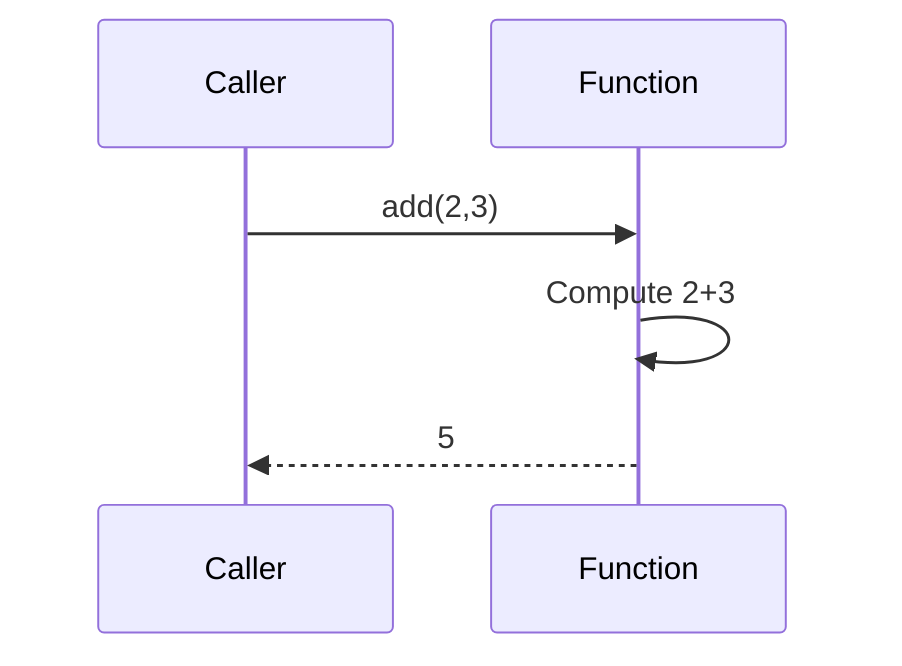

---

# 12. Object-Oriented Programming (OOP)

Python supports OOP heavily.

---

## Class Example

```python
class Car:
    
    def __init__(self, brand):
        self.brand = brand

car1 = Car("Tesla")
```

---

# OOP Analogy

A class is a blueprint.

An object is the actual product built from blueprint.

---

# OOP Internal Structure

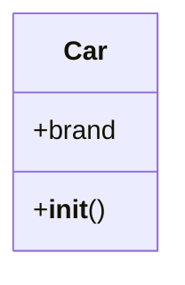

---

# 13. Python in Machine Learning

This is where Python dominates globally.

---

# Why ML Engineers Prefer Python

Because of ecosystem:

| Library      | Purpose             |
| ------------ | ------------------- |
| NumPy        | Numerical computing |
| Pandas       | Data manipulation   |
| Matplotlib   | Visualization       |
| TensorFlow   | Deep Learning       |
| PyTorch      | Neural Networks     |
| Scikit-learn | ML algorithms       |

---

# ML Pipeline Example

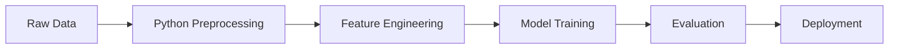

Python is the glue connecting every ML stage.

---

# 14. Industry Engineering Mindset

Beginners think:

> “Learning syntax = learning programming.”

Wrong.

Industry cares about:

* problem solving
* scalability
* debugging
* system design
* clean code
* performance

Python is just a tool.

Engineering mindset matters more.

---

# 15. Common Beginner Mistakes

| Mistake                  | Why Bad                             |
| ------------------------ | ----------------------------------- |
| Memorizing syntax only   | No logical thinking                 |
| Ignoring debugging       | Real engineering requires debugging |
| Writing huge scripts     | Hard to maintain                    |
| Not using functions      | Code duplication                    |
| Ignoring data structures | Poor performance                    |

---

# 16. Performance Reality

Python is slower than:

* C
* C++
* Rust

Why?

Because Python prioritizes:

* developer speed
* flexibility
* readability

NOT raw execution speed.

---

# Time Complexity Matters

Even in Python:

Bad algorithm + fast language = slow system.

Good algorithm + Python = often fast enough.

---

# Example

```python
# O(n²)
for i in arr:
    for j in arr:
        pass
```

This becomes dangerous on massive datasets.

---

# 17. Debugging Mindset

Professional engineers debug systematically.

---

# Debugging Flow

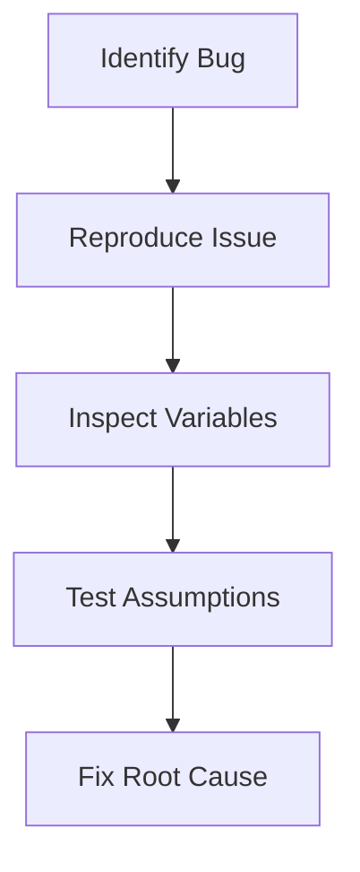

---

# 18. Best Practices

| Practice             | Why Important        |
| -------------------- | -------------------- |
| Use meaningful names | Improves readability |
| Write modular code   | Easier maintenance   |
| Keep functions small | Better debugging     |
| Follow PEP-8         | Industry standard    |
| Add comments wisely  | Helps collaboration  |

---

# 19. Mini Project Idea

## Student Result Analyzer

Build a Python system that:

* stores student marks
* calculates averages
* ranks students
* generates statistics

---

# Skills You’ll Learn

* variables
* loops
* functions
* dictionaries
* file handling
* data analysis basics

---

# 20. Interview Perspective

Common beginner interview questions:

| Question                           | Purpose                        |
| ---------------------------------- | ------------------------------ |
| Difference between list and tuple? | Mutability understanding       |
| Why is Python slow?                | Internal execution knowledge   |
| What is a dictionary hash table?   | Data structure understanding   |
| Difference between `is` and `==`?  | Memory/reference understanding |

---

# 21. Advanced Concepts You’ll Learn Later

After basics:

| Topic             | Importance                    |
| ----------------- | ----------------------------- |
| Generators        | Memory-efficient iteration    |
| Decorators        | Function modification         |
| Multithreading    | Concurrency                   |
| Async Programming | Scalable I/O                  |
| Context Managers  | Resource handling             |
| Metaclasses       | Advanced OOP                  |
| Vectorization     | High-performance ML computing |

---

# 22. Python Learning Roadmap for You

Since your goal is Data Science + ML engineering, your path should look like:

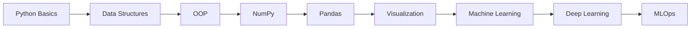

---

# 23. Summary Table

| Concept      | Purpose                | Industry Usage     |
| ------------ | ---------------------- | ------------------ |
| Variables    | Store references       | Data handling      |
| Functions    | Reusable logic         | Modular systems    |
| Loops        | Repetition             | Dataset traversal  |
| Dictionaries | Fast lookup            | APIs/databases     |
| Classes      | Object modeling        | Large applications |
| Libraries    | Prebuilt functionality | Faster development |

---

# 24. Key Takeaways

1. Python is designed for productivity and readability.
2. Python variables are references, not containers.
3. Python internally uses bytecode + virtual machine execution.
4. Data structures are foundational for performance.
5. Debugging and problem-solving matter more than syntax memorization.
6. Python dominates AI/ML because of ecosystem strength.
7. Real engineering starts after basic syntax.

---