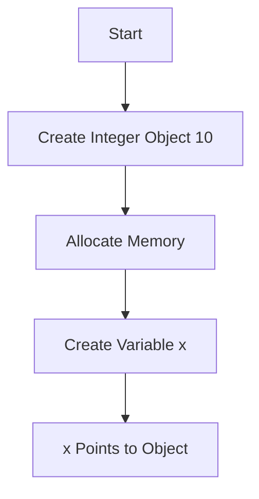
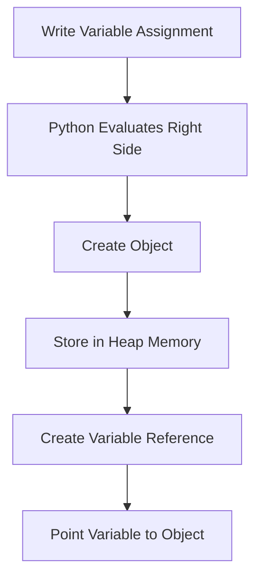
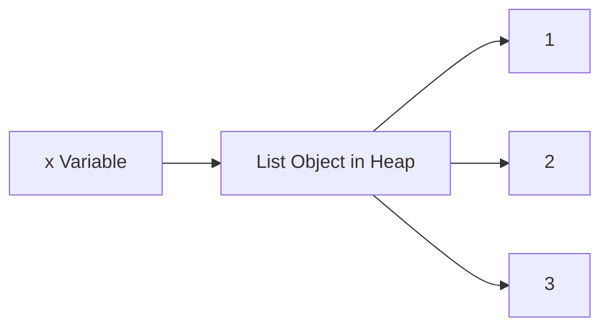
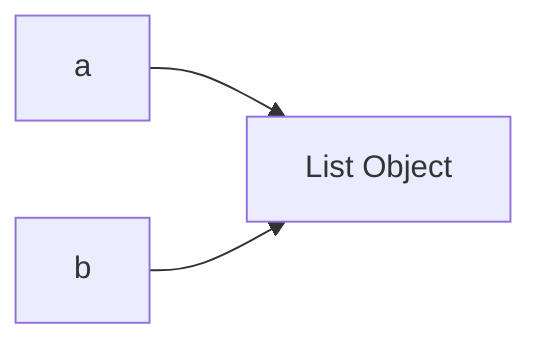

# Variables in Python

## 1. Introduction

A **variable** is a named container that stores data in memory.

Python variables exist because programs constantly need to store and reuse values:

* user input
* numbers
* model parameters
* datasets
* file paths
* predictions
* configurations

Without variables, programming would be impossible beyond tiny calculations.

Example:

```python
age = 21
```

Here:

* `age` → variable name
* `21` → value stored in memory

Engineers use variables to:

* track state
* process data
* build ML pipelines
* manage memory references
* create scalable systems

---

# 2. Real-World Analogy

Think of variables like **labeled storage boxes** in a warehouse.

```text
Box Label ---> Content
age      ---> 21
name     ---> "Akshit"
salary   ---> 50000
```

The label helps Python quickly locate the value.

But internally:

Python does NOT store the value directly inside the variable.

Instead:

```text
Variable name ---> Memory address ---> Actual object
```

This is extremely important.

Python variables are actually **references to objects**.

---

# 3. Core Theory

## Python is Object-Oriented Internally

Everything in Python is an object.

Examples:

```python
x = 10
name = "Akshit"
pi = 3.14
```

Internally:

* `10` → integer object
* `"Akshit"` → string object
* `3.14` → float object

Variable names only point to these objects.

---

# Internal Working

When Python sees:

```python
x = 10
```

It does:

1. Create integer object `10`
2. Allocate memory
3. Store object in heap memory
4. Create reference `x`
5. Point `x` to object

---

# Execution Flow



---

# 4. Syntax Breakdown

## Basic Syntax

```python
x = 10
```

### Line-by-line

| Part | Meaning             |
| ---- | ------------------- |
| `x`  | Variable name       |
| `=`  | Assignment operator |
| `10` | Value/object        |

---

# Another Example

```python
name = "Akshit"
```

### Breakdown

| Part       | Meaning            |
| ---------- | ------------------ |
| `name`     | Reference variable |
| `=`        | Assign             |
| `"Akshit"` | String object      |

---

# Multiple Variables

```python
a, b, c = 1, 2, 3
```

Python assigns values simultaneously.

---

# Dynamic Typing

Python automatically detects datatype.

```python
x = 10
x = "hello"
```

Same variable now points to different object.

---

# 5. Execution Flow Visualization

## Variable Assignment Lifecycle



---

# 6. Memory + Internal Working

# Stack vs Heap

## Heap Memory

Stores:

* objects
* lists
* dictionaries
* strings
* class instances

## Stack Memory

Stores:

* function calls
* local references
* execution frames

---

# Example

```python
x = [1, 2, 3]
```

Internally:



---

# Reference Behavior

```python
a = [1, 2]
b = a
```

Now BOTH variables point to SAME object.



---

# Mutation Problem

```python
b.append(3)
print(a)
```

Output:

```python
[1, 2, 3]
```

Why?

Because both references point to same memory object.

This confuses beginners heavily.

---

# Immutable vs Mutable

| Type   | Mutable? |
| ------ | -------- |
| int    | No       |
| float  | No       |
| string | No       |
| tuple  | No       |
| list   | Yes      |
| dict   | Yes      |
| set    | Yes      |

---

# 7. Practical Examples

# Beginner Example

```python
# storing age
age = 21

# printing value
print(age)
```

Output:

```python
21
```

---

# Intermediate Example

```python
# swapping variables
a = 5
b = 10

a, b = b, a

print(a)
print(b)
```

Output:

```python
10
5
```

Python does tuple unpacking internally.

---

# Real-World Example

```python
# ML dataset info
dataset_name = "customer_churn.csv"
rows = 50000
accuracy = 92.5

print(dataset_name)
print(rows)
print(accuracy)
```

---

# Industry Example

```python
# configuration variables

MODEL_PATH = "models/model.pkl"
BATCH_SIZE = 32
LEARNING_RATE = 0.001
```

Professionals use constants for configurations.

---

# 8. ML & Data Science Connection

Variables are everywhere in ML.

Examples:

| ML Usage      | Variable Example |
| ------------- | ---------------- |
| Dataset       | `data`           |
| Features      | `X`              |
| Labels        | `y`              |
| Learning Rate | `lr`             |
| Epoch Count   | `epochs`         |
| Predictions   | `preds`          |

---

# NumPy Example

```python
import numpy as np

X = np.array([1, 2, 3])
```

`X` stores reference to NumPy array object.

---

# Deep Learning Example

```python
weights = model.parameters()
```

Variables may hold:

* tensors
* GPU memory references
* gradients
* model states

---

# 9. Industry Engineering Mindset

Professionals care about:

* naming clarity
* memory efficiency
* avoiding unnecessary copies
* mutable bugs
* scalability

---

# Bad Naming

```python
x = 10
y = 20
z = x + y
```

Terrible in production.

---

# Good Naming

```python
price = 10
tax = 20
total_price = price + tax
```

Readable code scales.

---

# 10. Common Mistakes

# Mistake 1: Shared References

```python
a = [1, 2]
b = a
```

Fix:

```python
b = a.copy()
```

---

# Mistake 2: Using Undefined Variable

```python
print(age)
```

Error:

```python
NameError
```

Because variable not created.

---

# Mistake 3: Confusing `=` with equality

```python
x = 5
```

Assignment.

NOT comparison.

Comparison uses:

```python
x == 5
```

---

# 11. Interview Perspective

Common questions:

---

## Q1: Are variables containers?

Technically:
No.

They are references to objects.

---

## Q2: Difference between mutable and immutable?

Very common interview topic.

---

## Q3: What happens internally during assignment?

Expected answer:

* object creation
* reference binding
* memory allocation

---

# 12. Advanced Concepts

# Variable Scope

## Local Variable

```python
def test():
    x = 10
```

Exists only inside function.

---

## Global Variable

```python
x = 100
```

Accessible everywhere.

---

# Closures

Variables can survive after function execution.

```python
def outer():
    x = 10

    def inner():
        print(x)

    return inner
```

Advanced Python behavior.

---

# Object Identity

```python
x = 10
y = 10

print(id(x))
print(id(y))
```

Sometimes same memory due to integer caching.

---

# 13. Mini Project

# Student Marks System

```python
student_name = "Akshit"
physics = 85
maths = 92
chemistry = 88

average = (physics + maths + chemistry) / 3

print("Student:", student_name)
print("Average:", average)
```

---

# Scalable Extension

Convert into:

* dictionary-based system
* CSV reader
* Pandas dataframe
* ML performance tracker

---

# 14. Performance Considerations

# Time Complexity

Variable access in Python:

```python
O(1)
```

Very fast.

---

# Memory Efficiency

Bad:

```python
large_data_copy = large_data
```

May create shared reference issues.

---

# Better

Use:

* generators
* views
* vectorized operations

Especially in ML pipelines.

---

# 15. Debugging Mindset

# Check Variable Type

```python
print(type(x))
```

---

# Check Memory Identity

```python
print(id(x))
```

---

# Debug Shared References

```python
print(a is b)
```

Returns:

* `True`
* `False`

---

# 16. Best Practices

# Naming Rules

Good:

```python
student_name
total_salary
model_accuracy
```

Bad:

```python
a
b
temp2
```

---

# Constants

Use uppercase:

```python
PI = 3.14
MAX_USERS = 100
```

---

# PEP-8 Standards

Use:

* snake_case
* meaningful names
* readable variables

---

# 17. Summary Table

| Concept          | Purpose               | Industry Usage           |
| ---------------- | --------------------- | ------------------------ |
| Variable         | Store references      | All software             |
| Assignment       | Bind object to name   | Data processing          |
| Mutable Object   | Can change            | Lists, dicts             |
| Immutable Object | Cannot change         | Safer memory handling    |
| Scope            | Control accessibility | Large systems            |
| Reference        | Memory pointing       | Performance optimization |

---

# 18. Key Takeaways

* Variables are references, not boxes.
* Everything in Python is an object.
* Understanding memory behavior is critical for ML and backend engineering.
* Mutable vs immutable concepts prevent massive debugging pain.
* Good variable naming directly affects scalability and maintainability.
* Professional Python developers think about:

  * readability
  * memory
  * references
  * performance
  * debugging

---