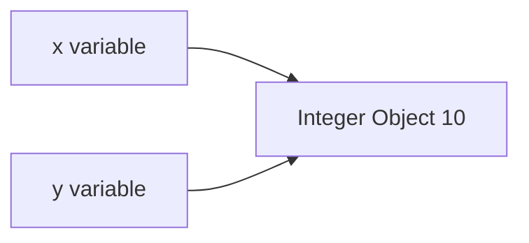
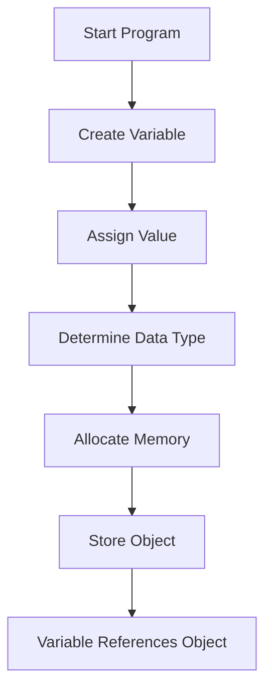
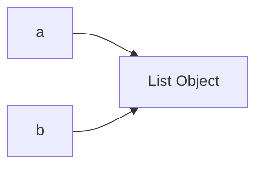
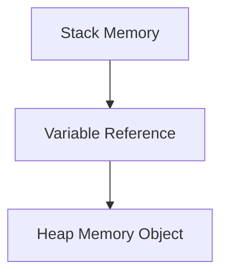
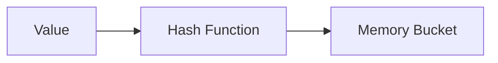

# Data Types in Python

## 1. Introduction

Data Types define:

* what kind of value a variable stores
* how memory is allocated
* what operations are allowed
* how Python internally handles the value

Without data types, Python cannot understand:

* whether `10 + 20` means numeric addition
* or `"10" + "20"` means string concatenation

Example:

```python
x = 10        # Integer
name = "Akshit"   # String
price = 99.5  # Float
```

Every value in Python is an **object with a type**.

---

# Why Data Types Exist

Imagine computer memory as a huge warehouse.

Different things need different storage methods:

| Real World Item | Storage Type      |
| --------------- | ----------------- |
| Numbers         | Numeric shelves   |
| Text            | Character storage |
| True/False      | Binary flags      |
| Collections     | Group containers  |

Python data types solve this storage and behavior problem.

---

# 2. Real-World Analogy

Think of a courier company.

Different packages need different handling:

| Package    | Handling        |
| ---------- | --------------- |
| Glass item | Fragile         |
| Food       | Refrigerated    |
| Documents  | Flat file       |
| Heavy box  | Large container |

Similarly:

| Python Data Type | Purpose            |
| ---------------- | ------------------ |
| int              | Whole numbers      |
| float            | Decimal numbers    |
| str              | Text               |
| bool             | True/False         |
| list             | Ordered collection |
| dict             | Key-value storage  |

---

# 3. Core Theory

Python is:

* dynamically typed
* strongly typed
* object-oriented internally

That means:

```python
x = 10
```

Python internally does:

1. Create integer object `10`
2. Store object in memory
3. Create reference variable `x`
4. Point `x` to that object

---

# Internal Working

```python
x = 10
y = x
```

Both variables reference same object initially.



---

# Python Built-in Data Types

| Category | Types               |
| -------- | ------------------- |
| Numeric  | int, float, complex |
| Sequence | list, tuple, range  |
| Text     | str                 |
| Set      | set, frozenset      |
| Mapping  | dict                |
| Boolean  | bool                |
| Binary   | bytes, bytearray    |

---

# 4. Syntax Breakdown

## Integer

```python
age = 21
```

### Breakdown

| Part | Meaning             |
| ---- | ------------------- |
| age  | Variable name       |
| =    | Assignment operator |
| 21   | Integer object      |

Python internally:

```python
type(21)
```

Output:

```python
<class 'int'>
```

---

# Float

```python
salary = 9999.99
```

Stores decimal numbers.

---

# String

```python
name = "Akshit"
```

Sequence of Unicode characters.

---

# Boolean

```python
is_student = True
```

Only two values:

* True
* False

Internally:

```python
True = 1
False = 0
```

---

# List

```python
numbers = [1, 2, 3]
```

Mutable ordered collection.

---

# Tuple

```python
coordinates = (10, 20)
```

Immutable ordered collection.

---

# Dictionary

```python
student = {
    "name": "Akshit",
    "age": 21
}
```

Key-value hash map structure.

---

# Set

```python
unique_numbers = {1, 2, 3}
```

Unordered unique values.

---

# 5. Execution Flow Visualization



---

# 6. Memory + Internal Working

# Important Concept

Variables DO NOT store actual values directly.

They store:

* references
* memory addresses of objects

Example:

```python
a = [1, 2]
b = a
```

Both point to same list.



---

# Mutable vs Immutable

## Immutable Types

Cannot change after creation.

Examples:

* int
* float
* str
* tuple

```python
x = 10
x = 20
```

New object created.

---

## Mutable Types

Can change internally.

Examples:

* list
* dict
* set

```python
nums = [1, 2]
nums.append(3)
```

Same object modified.

---

# Stack vs Heap Memory

## Stack

Stores:

* variable references
* function calls

## Heap

Stores:

* actual objects
* lists
* dictionaries
* strings



---

# 7. Practical Examples

# Beginner Example

```python
name = "Akshit"
age = 21

print(name)
print(age)
```

Output:

```python
Akshit
21
```

---

# Intermediate Example

```python
marks = [90, 85, 78]

# Add new mark
marks.append(95)

print(marks)
```

Output:

```python
[90, 85, 78, 95]
```

---

# Real-World Example

```python
student = {
    "name": "Akshit",
    "skills": ["Python", "ML"],
    "is_active": True
}

print(student["skills"])
```

Output:

```python
['Python', 'ML']
```

---

# Industry Example

ML dataset row:

```python
data = {
    "age": 25,
    "salary": 50000,
    "purchased": False
}
```

This is exactly how preprocessing pipelines represent structured data.

---

# 8. ML & Data Science Connection

Data types are MASSIVE in ML engineering.

---

# NumPy

NumPy uses fixed data types:

```python
import numpy as np

arr = np.array([1, 2, 3], dtype=np.int32)
```

Why?

Because fixed-size memory improves performance.

---

# Pandas

Pandas columns use data types:

| Column | Data Type     |
| ------ | ------------- |
| Age    | int64         |
| Salary | float64       |
| Name   | object/string |

Wrong data types cause:

* slow training
* memory waste
* preprocessing bugs

---

# TensorFlow / PyTorch

Neural networks heavily depend on:

```python
float32
float64
int64
```

Using wrong dtype can:

* slow GPU training
* increase memory
* crash models

---

# 9. Industry Engineering Mindset

Professionals care about:

* memory efficiency
* scalability
* performance
* serialization
* compatibility

---

# Common Beginner Mistake

```python
age = "21"
```

This is STRING not integer.

Then:

```python
age + 5
```

Error occurs.

---

# Production Practice

Always validate data types.

Example:

```python
if isinstance(age, int):
    print("Valid")
```

---

# 10. Common Mistakes

# Mistake 1

```python
"10" + "20"
```

Output:

```python
1020
```

Because both are strings.

---

# Mistake 2

```python
numbers = (1, 2, 3)
numbers.append(4)
```

Error because tuple is immutable.

---

# Mistake 3

Shared mutable references:

```python
a = [1, 2]
b = a

b.append(3)

print(a)
```

Output:

```python
[1, 2, 3]
```

Both point same object.

---

# Debugging Method

Use:

```python
print(type(variable))
```

Very common professional debugging step.

---

# 11. Interview Perspective

Common interview questions:

| Question                          | Purpose              |
| --------------------------------- | -------------------- |
| Difference between list and tuple | Mutability           |
| Mutable vs immutable              | Memory understanding |
| Why Python is dynamically typed   | Runtime behavior     |
| Difference between == and is      | Object identity      |

---

# Example

```python
a = [1, 2]
b = [1, 2]

print(a == b)
print(a is b)
```

Output:

```python
True
False
```

Explanation:

* `==` checks values
* `is` checks memory identity

---

# 12. Advanced Concepts

# Type Casting

```python
age = "21"

age = int(age)
```

---

# Dynamic Typing

```python
x = 10
x = "Hello"
```

Python allows type reassignment.

---

# Duck Typing

Python focuses on behavior instead of strict types.

```python
class Dog:
    def speak(self):
        print("Bark")
```

If object behaves correctly, Python accepts it.

---

# Type Hinting

Modern production Python:

```python
def add(a: int, b: int) -> int:
    return a + b
```

Used heavily in:

* FastAPI
* ML pipelines
* enterprise systems

---

# 13. Mini Project

# Student Management System

Use:

* dict
* list
* bool
* string
* integer

Features:

* add student
* update marks
* search student
* calculate average

---

# Scalable Extension

Convert into:

* database-backed system
* REST API
* ML prediction system

---

# 14. Performance Considerations

| Type  | Speed               | Memory |
| ----- | ------------------- | ------ |
| tuple | Faster              | Less   |
| list  | Flexible            | More   |
| set   | Very fast lookup    | Medium |
| dict  | O(1) average lookup | Higher |

---

# Time Complexity

| Operation   | Complexity |
| ----------- | ---------- |
| List Append | O(1)       |
| Dict Lookup | O(1)       |
| List Search | O(n)       |
| Set Lookup  | O(1)       |

---

# Why Sets Are Fast

Sets use:

# Hash Tables



This is core computer science.

---

# 15. Debugging Mindset

Professionals debug data types FIRST.

Steps:

1. Check `type()`
2. Print object
3. Check memory identity
4. Validate mutability
5. Inspect conversion issues

---

# Example

```python
data = input("Enter age: ")

print(type(data))
```

Output:

```python
<class 'str'>
```

`input()` ALWAYS returns string.

Very common beginner bug.

---

# 16. Best Practices

# Naming

Good:

```python
student_age
total_salary
```

Bad:

```python
a
x
temp123
```

---

# Use Correct Types

| Situation            | Preferred Type |
| -------------------- | -------------- |
| Fixed values         | tuple          |
| Unique items         | set            |
| Ordered mutable data | list           |
| Fast lookup          | dict           |

---

# Follow PEP-8

```python
student_name = "Akshit"
```

Not:

```python
StudentName="Akshit"
```

---

# 17. Summary Table

| Data Type | Mutable | Ordered | Use Case            |
| --------- | ------- | ------- | ------------------- |
| int       | No      | No      | Numbers             |
| float     | No      | No      | Decimal values      |
| str       | No      | Yes     | Text                |
| list      | Yes     | Yes     | Dynamic collections |
| tuple     | No      | Yes     | Fixed collections   |
| dict      | Yes     | Yes     | Key-value storage   |
| set       | Yes     | No      | Unique values       |
| bool      | No      | No      | Conditions          |

---

# 18. Key Takeaways

* Every value in Python is an object.
* Variables store references, not raw values.
* Mutable vs immutable is extremely important.
* Data types directly affect:

  * performance
  * memory
  * scalability
  * ML pipelines
* Understanding data types deeply makes debugging much easier.
* Strong understanding of data types is foundational for:

  * Data Science
  * Machine Learning
  * Backend Engineering
  * System Design

---