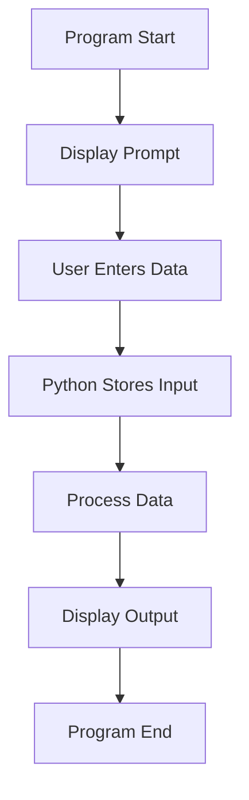
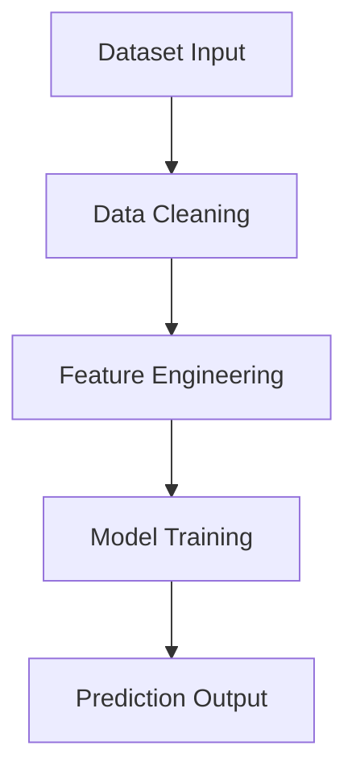

# Input / Output in Python

## 1. Introduction

Input and Output are the most basic building blocks of programming.

* **Input** means taking data from the user or another source.
* **Output** means showing results to the user.

Every software system works on this flow:

```text
Input → Processing → Output
```

Examples:

* Calculator takes numbers as input and gives results as output.
* Instagram takes messages as input and displays chats as output.
* Machine Learning models take datasets as input and produce predictions as output.

Without input and output, programs cannot interact with users or systems.

---

# 2. Real-World Analogy

Think of a restaurant.

```text
Customer Order → Kitchen Processing → Food Served
```

In programming:

```text
User Input → Program Logic → Output Display
```

Example:

```python
name = input("Enter your name: ")
print(name)
```

Here:

* User enters data
* Python stores it in memory
* `print()` displays it on the screen

---

# 3. Core Theory

## Output System

Python mainly uses:

```python
print()
```

for output.

Internally, `print()`:

1. Converts objects into strings
2. Sends them to standard output (`stdout`)
3. Displays them in the terminal

---

## Input System

Python uses:

```python
input()
```

to take input from the keyboard.

Important point:

⚠️ `input()` always returns a **string**.

Example:

```python
age = input("Enter age: ")
```

Even if the user enters:

```text
25
```

Python stores it as:

```python
"25"
```

which is a string, not an integer.

---

# 4. Syntax Breakdown

## Output Example

```python
print("Hello")
```

### Breakdown

| Part      | Meaning           |
| --------- | ----------------- |
| `print`   | Built-in function |
| `()`      | Function call     |
| `"Hello"` | String argument   |

---

## Input Example

```python
name = input("Enter name: ")
```

### Breakdown

| Part             | Meaning                 |
| ---------------- | ----------------------- |
| `input`          | Built-in input function |
| `"Enter name: "` | Prompt message          |
| `=`              | Assignment operator     |
| `name`           | Variable storing input  |

---

# 5. Execution Flow Visualization



---

# 6. Memory + Internal Working

## How Input Works Internally

Example:

```python
name = input()
```

Internally:

1. Keyboard characters go into the input buffer
2. Python creates a string object
3. The object is stored in heap memory
4. Variable stores the reference to that object

---

## Object Reference

```python
age = input()
```

Memory concept:

```text
age → "25"
```

Variable does not directly store the value.

It stores a reference pointing to the object in memory.

---

## Why Does `input()` Return a String?

Because keyboard input always comes as text.

Examples:

```text
"100"
"hello"
"3.14"
```

Python does not automatically guess the datatype because that can create ambiguity and errors.

So Python safely returns everything as a string.

---

# 7. Practical Examples

## Beginner Example

```python
# Taking user input
name = input("Enter your name: ")

# Printing output
print("Hello", name)
```

### Output

```text
Enter your name: Akshit
Hello Akshit
```

---

## Integer Input

```python
age = int(input("Enter your age: "))

print(age + 5)
```

### Why `int()`?

Because `input()` returns a string.

`int()` converts it into an integer.

---

## Float Input

```python
salary = float(input("Enter salary: "))

print(salary)
```

---

## Multiple Inputs

```python
a, b = input("Enter two values: ").split()

print(a)
print(b)
```

---

## Real-World Example

### Login System

```python
username = input("Username: ")
password = input("Password: ")

print("Login Successful")
```

---

# 8. ML & Data Science Connection

Input and Output are heavily used in ML pipelines.

---

## Dataset Input

```python
import pandas as pd

data = pd.read_csv("data.csv")
```

CSV file becomes input for the ML system.

---

## Prediction Output

```python
prediction = model.predict(data)

print(prediction)
```

Model prediction becomes output.

---

## ML Pipeline Flow



---

# 9. Industry Engineering Mindset

Professional engineers never trust raw user input directly.

Because users can enter:

* Invalid data
* Wrong formats
* Empty values
* Malicious input

Example:

```python
age = int(input())
```

If user enters:

```text
abc
```

Python throws:

```text
ValueError
```

Production systems always validate input before processing.

---

# 10. Common Mistakes

## Mistake 1: Forgetting Type Conversion

```python
age = input()

print(age + 5)
```

This causes:

```text
TypeError
```

Because Python cannot add string and integer together.

---

## Mistake 2: Incorrect Number of Inputs

```python
a, b = input().split()
```

If user enters 3 values, Python throws an error.

---

## Mistake 3: Unsafe Input Handling

Never assume user input is valid.

Always validate:

* datatype
* length
* range
* format

---

# 11. Interview Perspective

Common interview questions:

| Question                                   | What Interviewer Checks |
| ------------------------------------------ | ----------------------- |
| Why does `input()` return string?          | Python internals        |
| Difference between `print()` and `return`? | Function understanding  |
| How to take multiple inputs?               | Practical coding skills |
| How does input buffering work?             | System understanding    |

---

# 12. Advanced Concepts

## Fast Input

In competitive programming:

```python
import sys

data = sys.stdin.readline()
```

This is faster than `input()`.

Useful when processing huge datasets.

---

## Formatted Output

```python
name = "Akshit"
age = 21

print(f"My name is {name} and age is {age}")
```

This is called an **f-string**.

It is widely used in production code.

---

## File Input/Output

```python
with open("data.txt") as file:
    content = file.read()

print(content)
```

Used for datasets, logs, configuration files, etc.

---

# 13. Mini Project

## Student Grade Calculator

### Features

* Take student name as input
* Take marks as input
* Calculate percentage
* Display grade

### Concepts Used

* input
* output
* type conversion
* arithmetic operations
* conditional statements

### Scalable Extensions

* Store results in CSV
* Database integration
* GUI application
* ML-based performance prediction

---

# 14. Performance Considerations

| Method                 | Speed  |
| ---------------------- | ------ |
| `input()`              | Slower |
| `sys.stdin.readline()` | Faster |

Fast I/O becomes important in:

* Competitive programming
* Large-scale data processing
* High-performance systems

---

# 15. Debugging Mindset

## Check Datatypes

```python
age = input()

print(type(age))
```

Always verify what datatype you are working with.

---

## Test Edge Cases

Test inputs like:

* Empty input
* Large numbers
* Special characters
* Invalid values

Good engineers think about failure cases first.

---

# 16. Best Practices

## Use Meaningful Variable Names

Good:

```python
student_name
```

Bad:

```python
x
```

---

## Write Clear Prompt Messages

Good:

```python
input("Enter your age: ")
```

Bad:

```python
input()
```

---

## Validate Inputs

```python
age = input()

if age.isdigit():
    age = int(age)
```

---

# 17. Summary Table

| Concept   | Purpose                   | Industry Usage          |
| --------- | ------------------------- | ----------------------- |
| `input()` | Take user input           | Forms, APIs, CLI tools  |
| `print()` | Display output            | Logs, debugging         |
| `int()`   | Convert string to integer | Calculations            |
| `float()` | Decimal conversion        | ML/statistics           |
| `split()` | Multiple inputs           | Data parsing            |
| f-string  | Formatted output          | Production applications |

---

# 18. Key Takeaways

* Input and Output are the foundation of all software systems.
* `input()` always returns a string.
* Type conversion is extremely important.
* Production systems must validate user input.
* ML systems also follow the same structure:

```text
Input → Processing → Output
```

* Strong engineers always think about:

  * datatype handling
  * validation
  * debugging
  * scalability
  * performance optimization
