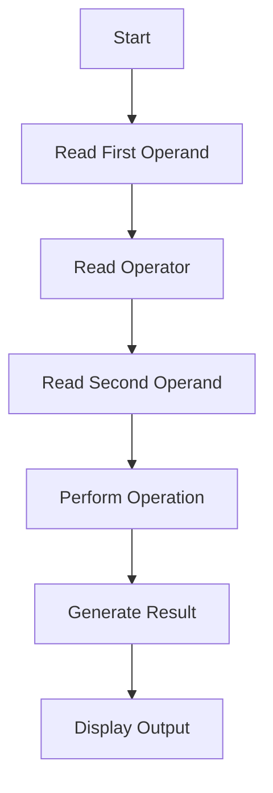
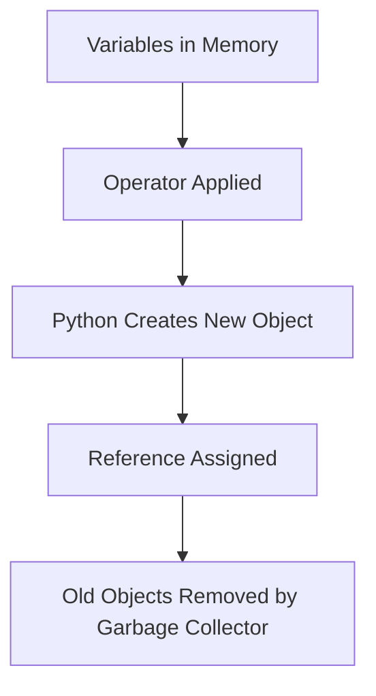

# Operators in Python

---

# 1. Introduction

Operators are special symbols in Python that perform operations on values and variables.

Example:

```python
a = 10
b = 5

print(a + b)
```

Here:

* `+` is an operator
* It performs addition

Without operators, programming would be impossible because:

* no calculations
* no comparisons
* no logical decisions
* no data manipulation

Operators are the foundation of:

* Data Science
* Machine Learning
* Web Development
* Automation
* Game Development

Every real software system heavily uses operators.

---

# 2. Real-World Analogy

Think of operators like tools in a workshop.

| Tool        | Purpose         |
| ----------- | --------------- |
| Hammer      | Hit nails       |
| Screwdriver | Tighten screws  |
| Operators   | Manipulate data |

Example:

```python
+   -> add values
-   -> subtract values
==  -> compare values
and -> combine conditions
```

Operators help Python process information logically.

---

# 3. Types of Operators in Python

| Operator Type        | Purpose                   |
| -------------------- | ------------------------- |
| Arithmetic Operators | Mathematical calculations |
| Assignment Operators | Store/update values       |
| Comparison Operators | Compare values            |
| Logical Operators    | Combine conditions        |
| Identity Operators   | Check object identity     |
| Membership Operators | Check existence           |
| Bitwise Operators    | Binary-level operations   |

---

# 4. Arithmetic Operators

Arithmetic operators are used for mathematical operations.

| Operator | Meaning        |
| -------- | -------------- |
| `+`      | Addition       |
| `-`      | Subtraction    |
| `*`      | Multiplication |
| `/`      | Division       |
| `//`     | Floor Division |
| `%`      | Modulus        |
| `**`     | Power          |

---

## Example

```python
a = 10
b = 3

print(a + b)   # Addition
print(a - b)   # Subtraction
print(a * b)   # Multiplication
print(a / b)   # Division
print(a // b)  # Floor division
print(a % b)   # Remainder
print(a ** b)  # Power
```

---

# 5. Syntax Breakdown

```python
print(a + b)
```

Breakdown:

| Part      | Meaning           |
| --------- | ----------------- |
| `print()` | Displays output   |
| `a`       | First operand     |
| `+`       | Addition operator |
| `b`       | Second operand    |

Python internally:

1. Reads value of `a`
2. Reads value of `b`
3. Applies operator
4. Creates result object
5. Prints output

---

# 6. Execution Flow Visualization



---

# 7. Assignment Operators

Used to assign values to variables.

| Operator | Example  | Meaning             |
| -------- | -------- | ------------------- |
| `=`      | `x = 5`  | Assign              |
| `+=`     | `x += 2` | Add and assign      |
| `-=`     | `x -= 2` | Subtract and assign |
| `*=`     | `x *= 2` | Multiply and assign |
| `/=`     | `x /= 2` | Divide and assign   |

---

## Example

```python
x = 10

x += 5
print(x)

x *= 2
print(x)
```

---

# 8. Comparison Operators

Used to compare values.

Result is always:

* `True`
* `False`

| Operator | Meaning          |
| -------- | ---------------- |
| `==`     | Equal            |
| `!=`     | Not equal        |
| `>`      | Greater than     |
| `<`      | Less than        |
| `>=`     | Greater or equal |
| `<=`     | Less or equal    |

---

## Example

```python
a = 10
b = 20

print(a == b)
print(a < b)
print(a != b)
```

---

# 9. Logical Operators

Used to combine conditions.

| Operator | Meaning                      |
| -------- | ---------------------------- |
| `and`    | Both conditions must be True |
| `or`     | At least one condition True  |
| `not`    | Reverses condition           |

---

## Example

```python
age = 20
has_id = True

print(age >= 18 and has_id)
```

---

# 10. Identity Operators

Check whether two variables point to the same object in memory.

| Operator | Meaning          |
| -------- | ---------------- |
| `is`     | Same object      |
| `is not` | Different object |

---

## Example

```python
a = [1, 2]
b = a

print(a is b)
```

---

# 11. Membership Operators

Check whether a value exists inside a sequence.

| Operator | Meaning        |
| -------- | -------------- |
| `in`     | Exists         |
| `not in` | Does not exist |

---

## Example

```python
numbers = [1, 2, 3, 4]

print(2 in numbers)
print(10 not in numbers)
```

---

# 12. Bitwise Operators

Work directly on binary values.

| Operator | Meaning     |
| -------- | ----------- |
| `&`      | AND         |
| `l`     | OR          |
| `^`      | XOR         |
| `~`      | NOT         |
| `<<`     | Left Shift  |
| `>>`     | Right Shift |

---

## Example

```python
a = 5
b = 3

print(a & b)
```

Binary:

```python
5  -> 101
3  -> 011
-------------
&  -> 001
```

Result:

```python
1
```

---

# 13. Memory + Internal Working

When operators execute:

1. Python fetches objects from memory
2. Calls internal special methods

Example:

```python
a + b
```

Internally:

```python
a.__add__(b)
```

Python operators are actually method calls.

This is why custom classes can define their own operator behavior.

---

# 14. Object Lifecycle During Operations



---

# 15. Practical Examples

---

## Beginner Example

```python
x = 5
y = 2

print(x + y)
```

Output:

```python
7
```

---

## Intermediate Example

```python
temperature = 35

print(temperature > 30)
```

Output:

```python
True
```

---

## Real-World Example

```python
salary = 50000
bonus = 10000

total_salary = salary + bonus

print(total_salary)
```

---

## Industry Example

```python
prediction_probability = 0.91

if prediction_probability >= 0.90:
    print("High confidence prediction")
```

Used in:

* AI systems
* Fraud detection
* Medical diagnosis

---

# 16. ML & Data Science Connection

Operators are everywhere in ML.

Example:

```python
import numpy as np

a = np.array([1, 2, 3])
b = np.array([4, 5, 6])

print(a + b)
```

Output:

```python
[5 7 9]
```

This is called vectorized computation.

ML libraries use operators for:

* matrix operations
* tensor calculations
* gradient computation
* neural network training

Frameworks:

* NumPy
* Pandas
* TensorFlow
* PyTorch

---

# 17. Industry Engineering Mindset

Professional engineers:

* avoid unnecessary operations
* optimize heavy computations
* use vectorized operations
* avoid loops when possible

Bad:

```python
result = result + 1
```

Better:

```python
result += 1
```

Why?

* cleaner
* faster
* more readable

---

# 18. Common Mistakes

| Mistake                   | Problem          |
| ------------------------- | ---------------- |
| Using `=` instead of `==` | Wrong comparison |
| Dividing by zero          | Runtime error    |
| Confusing `is` with `==`  | Logical bugs     |
| Wrong operator precedence | Incorrect result |

---

## Example Mistake

```python
a = 10

if a = 10:
    print("Hello")
```

Error because:

```python
=  -> assignment
== -> comparison
```

Correct:

```python
if a == 10:
    print("Hello")
```

---

# 19. Interview Perspective

Common interview questions:

1. Difference between `==` and `is`
2. Operator precedence
3. Short-circuit evaluation
4. Bitwise operator usage
5. How Python overloads operators

Example:

```python
print(True and False)
```

Python stops evaluation early when possible.

This is called:

* Short-circuit evaluation

---

# 20. Advanced Concepts

---

## Operator Overloading

Custom classes can define operators.

Example:

```python
class Number:
    
    def __init__(self, value):
        self.value = value

    def __add__(self, other):
        return self.value + other.value


a = Number(10)
b = Number(20)

print(a + b)
```

---

# 21. Mini Project

## Simple Calculator

```python
num1 = float(input("Enter first number: "))
num2 = float(input("Enter second number: "))

print("Addition:", num1 + num2)
print("Subtraction:", num1 - num2)
print("Multiplication:", num1 * num2)
print("Division:", num1 / num2)
```

---

# 22. Performance Considerations

| Operation          | Time Complexity |
| ------------------ | --------------- |
| Arithmetic         | O(1)            |
| Comparison         | O(1)            |
| Membership in List | O(n)            |
| Membership in Set  | O(1) average    |

Important:

```python
x in list
```

is slower than:

```python
x in set
```

for large datasets.

This matters heavily in ML preprocessing pipelines.

---

# 23. Debugging Mindset

When operators fail:

1. Check datatype
2. Check precedence
3. Check variable values
4. Print intermediate results

Example:

```python
print(type(a))
print(type(b))
```

---

# 24. Best Practices

| Practice                      | Reason             |
| ----------------------------- | ------------------ |
| Use meaningful variable names | Better readability |
| Avoid complex expressions     | Easier debugging   |
| Use parentheses               | Clear precedence   |
| Write clean conditions        | Maintainability    |

---

# 25. Summary Table

| Concept              | Purpose             | Industry Usage         |
| -------------------- | ------------------- | ---------------------- |
| Arithmetic Operators | Calculations        | ML math                |
| Comparison Operators | Decision making     | Model evaluation       |
| Logical Operators    | Combine conditions  | Validation systems     |
| Assignment Operators | Store/update values | Data pipelines         |
| Membership Operators | Search/check        | Dataset filtering      |
| Identity Operators   | Memory/object check | Optimization/debugging |
| Bitwise Operators    | Binary manipulation | Low-level optimization |

---

# 26. Key Takeaways

* Operators are the core action system of Python.
* Every calculation and condition depends on operators.
* ML and Data Science rely heavily on mathematical operators.
* Understanding operator behavior improves debugging ability.
* Professional engineers care about readability and performance.
* Small operator mistakes can create major logical bugs.