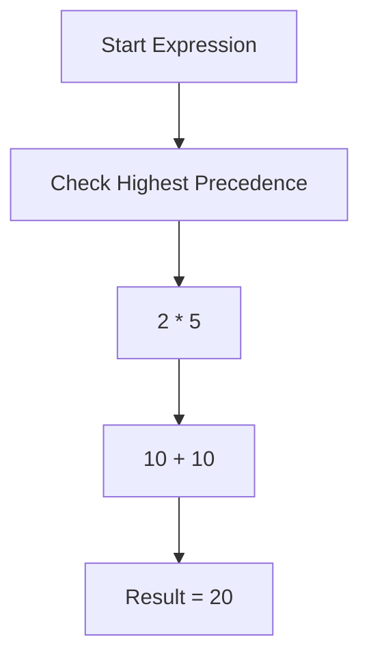
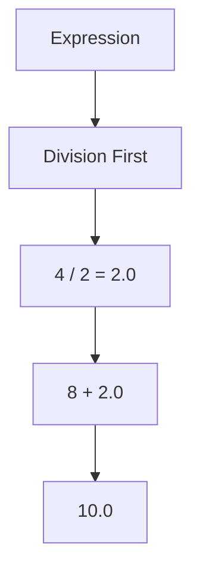
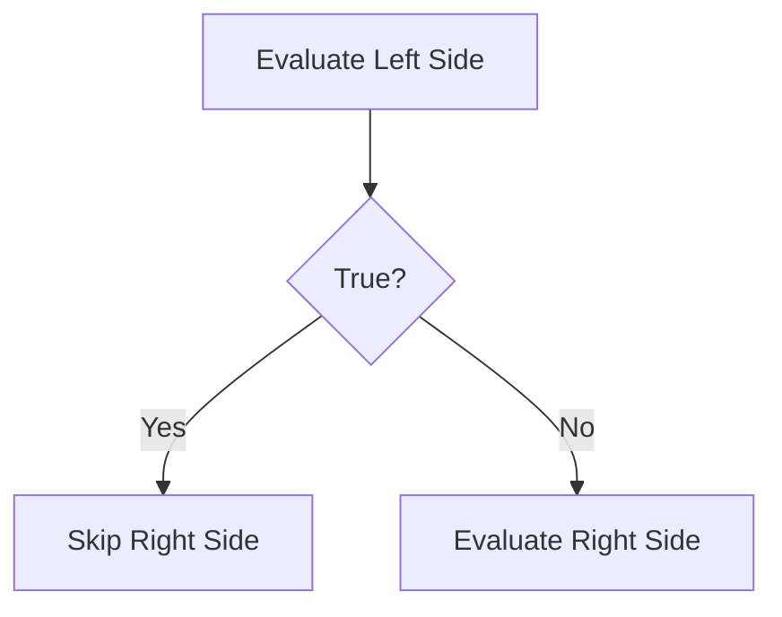

# Operator Precedence in Python

## 1. Introduction

Operator precedence means:

> **Which operation Python executes first when multiple operators exist in one expression.**

Python does **NOT** read expressions randomly.

It follows predefined priority rules.

Example:

```python
result = 10 + 5 * 2
```

Python does:

```python
5 * 2 = 10
10 + 10 = 20
```

NOT:

```python
10 + 5 = 15
15 * 2 = 30
```

Because:

```python
*  has higher precedence than +
```

Without precedence rules, calculations would become ambiguous and unreliable.

---

# 2. Real-World Analogy

Think about:

```text
School exam rules
```

First:

1. Solve brackets
2. Multiplication/division
3. Addition/subtraction

Same happens in Python.

Like traffic rules control vehicles, operator precedence controls expression execution.

---

# 3. Core Theory

Python evaluates expressions using:

## Priority Levels

Higher precedence executes first.

Example:

```python
2 + 3 * 4
```

Execution:

```python
3 * 4 = 12
2 + 12 = 14
```

---

## Associativity

When operators have SAME precedence:

Python uses associativity.

Example:

```python
10 - 5 - 2
```

Execution:

```python
(10 - 5) - 2
= 5 - 2
= 3
```

This is called:

```text
Left-to-right associativity
```

---

## Important Concept

Precedence only matters when:

```python
multiple operators exist in same expression
```

---

# 4. Python Operator Precedence Table

| Precedence | Operators            | Description              |
| ---------- | -------------------- | ------------------------ |
| Highest    | `()`                 | Parentheses              |
|            | `**`                 | Exponent                 |
|            | `+x`, `-x`           | Unary plus/minus         |
|            | `*`, `/`, `//`, `%`  | Multiplication operators |
|            | `+`, `-`             | Addition/subtraction     |
|            | `==`, `!=`, `>`, `<` | Comparison               |
|            | `not`                | Logical NOT              |
|            | `and`                | Logical AND              |
| Lowest     | `or`                 | Logical OR               |

---

# 5. Execution Flow Visualization

## Example

```python
10 + 2 * 5
```



---

# 6. Syntax Breakdown

## Example 1

```python
result = 5 + 2 * 3
```

### Line-by-line

```python
2 * 3
```

Runs first because `*` has higher precedence.

Then:

```python
5 + 6
```

Final result:

```python
11
```

---

## Example 2

```python
result = (5 + 2) * 3
```

Now brackets have highest precedence.

Execution:

```python
5 + 2 = 7
7 * 3 = 21
```

---

# 7. Execution Flow Internally

## Expression

```python
8 + 4 / 2
```



---

# 8. Memory + Internal Working

Python internally:

1. Parses expression
2. Creates evaluation tree
3. Executes high-priority operations first
4. Stores intermediate values in memory

---

## Internal Evaluation Example

```python
2 + 3 * 4
```

Python internally behaves conceptually like:

```python
temp = 3 * 4
result = 2 + temp
```

Memory stores:

| Variable | Value |
| -------- | ----- |
| temp     | 12    |
| result   | 14    |

---

# 9. Practical Examples

# Beginner Example

```python
x = 10 + 5 * 2

print(x)
```

## Output

```python
20
```

Because:

```python
5 * 2 = 10
10 + 10 = 20
```

---

# Intermediate Example

```python
x = 20 / 5 + 2 * 3

print(x)
```

## Execution

```python
20 / 5 = 4.0
2 * 3 = 6
4.0 + 6 = 10.0
```

---

# Real-World Example

## EMI Calculation

```python
principal = 100000
rate = 0.10
time = 2

simple_interest = principal * rate * time

print(simple_interest)
```

Financial systems heavily depend on correct precedence.

A small precedence mistake can create massive financial errors.

---

# 10. ML & Data Science Connection

Operator precedence is extremely important in:

* NumPy calculations
* TensorFlow expressions
* PyTorch tensor operations
* Feature engineering
* Loss functions
* Mathematical pipelines

---

## NumPy Example

```python
import numpy as np

arr = np.array([1, 2, 3])

result = arr + 2 * 5

print(result)
```

Execution:

```python
2 * 5 = 10

arr + 10
```

Output:

```python
[11 12 13]
```

---

# ML Formula Example

Linear Regression:

$$
y = mx + b
$$

Python evaluates multiplication before addition.

    genui{"math_block_widget_always_prefetch_v2":{"content":"y = mx + b"}}

Without precedence rules, ML equations would break completely.

---

# 11. Industry Engineering Mindset

Professional developers:

* use parentheses for readability
* never rely too much on implicit precedence
* write clean expressions
* avoid confusing calculations

---

## Bad Practice

```python
x = a + b * c - d / e + f
```

Hard to read.

---

## Better Practice

```python
x = (a + (b * c)) - (d / e) + f
```

Much safer and readable.

---

# 12. Common Mistakes

## Mistake 1

```python
10 / 2 * 5
```

Some beginners think:

```python
10 / (2 * 5)
```

Wrong.

Execution is left-to-right:

```python
10 / 2 = 5
5 * 5 = 25
```

---

## Mistake 2

Forgetting parentheses.

```python
2 + 3 * 4
```

Expected:

```python
20
```

Actual:

```python
14
```

---

## Mistake 3

Complex boolean expressions.

```python
True or False and False
```

Execution:

```python
False and False
True or False
True
```

Because:

```python
and > or
```

---

# 13. Interview Perspective

Common interview questions:

## Q1

Output?

```python
2 + 3 * 4 ** 2
```

Execution:

```python
4 ** 2 = 16
3 * 16 = 48
2 + 48 = 50
```

---

## Q2

Difference between:

```python
2 + 3 * 4
```

and

```python
(2 + 3) * 4
```

Tests precedence understanding.

---

# 14. Advanced Concepts

# Short-Circuit Evaluation

Logical operators sometimes stop early.

Example:

```python
True or print("Hello")
```

`print()` never runs.

Because:

```python
True or anything = True
```

---

## Flow



---

# 15. Mini Project

## Student Grade Calculator

```python
maths = 80
science = 70
english = 90

average = (maths + science + english) / 3

print("Average:", average)
```

---

## Scalable Extension

Add:

* subject weights
* percentage system
* ranking
* database storage
* dashboard visualization

---

# 16. Performance Considerations

Operator precedence itself is fast.

But:

## Complex Expressions

```python
x = a*b + c*d - e/f + g*h
```

Can reduce readability and debugging efficiency.

---

## Optimization Practice

Break expressions:

```python
part1 = a * b
part2 = c * d

x = part1 + part2
```

Better debugging.

Better maintainability.

---

# 17. Debugging Mindset

## Use Step-by-Step Prints

```python
a = 2 + 3 * 4

print(3 * 4)
print(a)
```

---

## Use Parentheses While Debugging

```python
a = 2 + (3 * 4)
```

Makes intent explicit.

---

# 18. Best Practices

## Always:

* use parentheses for clarity
* avoid overly complex expressions
* write readable math
* test logical conditions carefully

---

## Follow PEP-8

Good spacing:

```python
x = (a + b) * c
```

Bad:

```python
x=(a+b)*c
```

---

# 19. Summary Table

| Concept      | Purpose               | Industry Usage  |
| ------------ | --------------------- | --------------- |
| `()`         | Highest priority      | Formula control |
| `**`         | Power calculation     | ML mathematics  |
| `* / %`      | Arithmetic operations | Data processing |
| `+ -`        | Addition/subtraction  | Business logic  |
| Comparisons  | Decision making       | Filtering       |
| `and/or/not` | Boolean logic         | AI conditions   |

---

# 20. Key Takeaways

* Operator precedence decides execution order.
* Python follows strict mathematical rules.
* Parentheses override precedence.
* Readability matters more than clever expressions.
* In ML and data science, precedence mistakes can corrupt calculations.
* Professional engineers write explicit and maintainable expressions.
* Debugging becomes easier when expressions are broken into smaller parts.

---