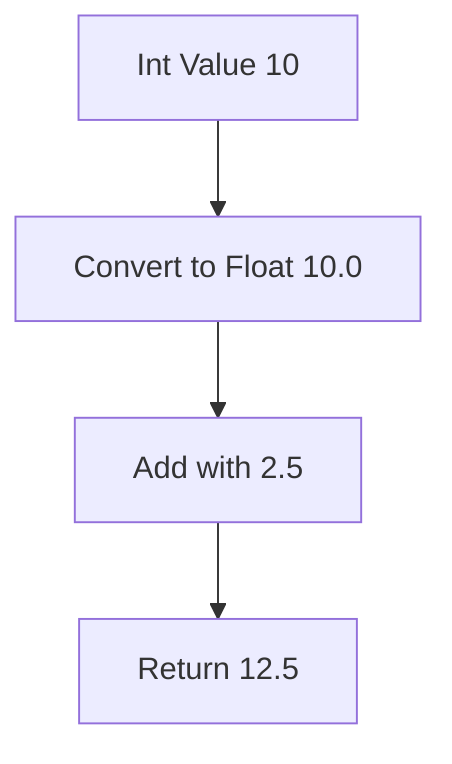
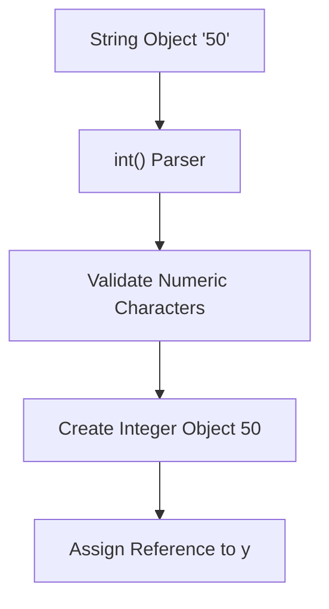
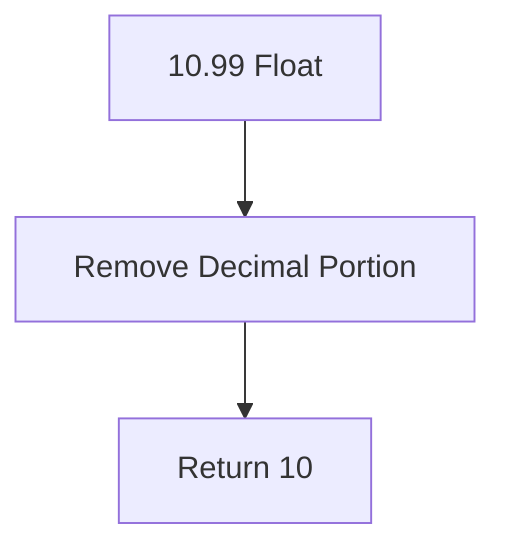
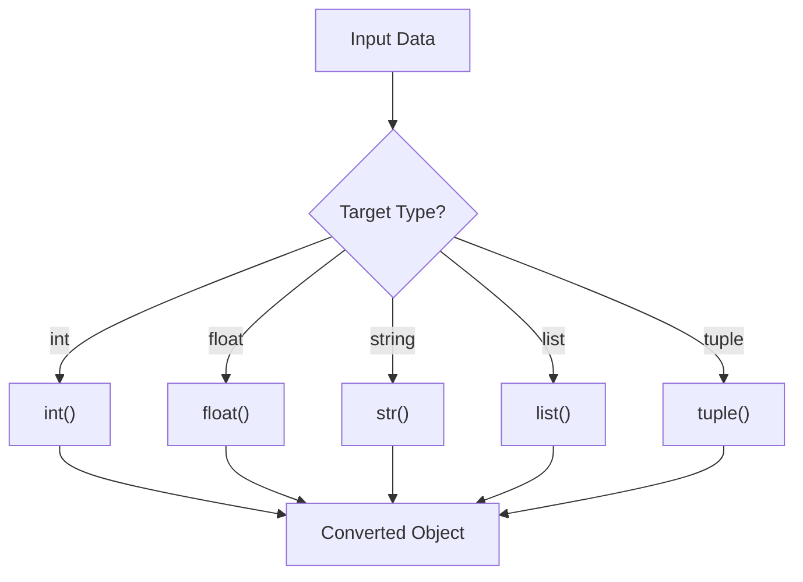

# Type Conversion in Python

## 1. Introduction

Type Conversion means:

> Converting one data type into another data type.

Example:

* `str` → `int`
* `int` → `float`
* `list` → `tuple`

Python is a dynamically typed language, so data types are handled during runtime. But in real-world programming, we often need to convert data from one type to another.

### Why does Type Conversion exist?

Because:

* User input always comes as a string
* Calculations require numeric types
* Machine Learning datasets contain mixed data types
* APIs usually send JSON/string data
* Database values often need conversion

---

# 2. Real-World Analogy

Imagine different containers:

* Bottle = String
* Glass = Integer
* Bucket = List

The content may be the same, but the container type changes.

Type conversion means:

> Moving the same data into a different format/container.

---

# 3. Core Theory

Python supports 2 main types of conversion:

| Type                | Meaning                       |
| ------------------- | ----------------------------- |
| Implicit Conversion | Python converts automatically |
| Explicit Conversion | Programmer converts manually  |

---

# 4. Implicit Type Conversion

Python automatically converts smaller/compatible types into safer types.

Example:

```python
a = 10       # int
b = 2.5      # float

result = a + b

print(result)
print(type(result))
```

## Output

```python
12.5
<class 'float'>
```

### Internal Working

Python internally converts:

```python
10 -> 10.0
```

Then it performs the addition.

---

## Execution Flow



---

# 5. Explicit Type Conversion

The programmer manually converts the type.

Example:

```python
age = "25"

converted_age = int(age)

print(converted_age)
print(type(converted_age))
```

---

# 6. Common Type Conversion Functions

| Function  | Converts To |
| --------- | ----------- |
| `int()`   | Integer     |
| `float()` | Float       |
| `str()`   | String      |
| `list()`  | List        |
| `tuple()` | Tuple       |
| `set()`   | Set         |
| `dict()`  | Dictionary  |
| `bool()`  | Boolean     |

---

# 7. Syntax Breakdown

## Example

```python
num = "100"

x = int(num)
```

---

## Line-by-Line Explanation

### Line 1

```python
num = "100"
```

* A string object is created
* `"100"` is stored in heap memory
* `num` stores the reference to that object

---

### Line 2

```python
x = int(num)
```

Python performs:

1. Reads the string `"100"`
2. Checks if it is a valid integer
3. Creates a new integer object
4. Assigns its reference to `x`

---

# 8. Memory + Internal Working

## String to Integer Conversion

```python
x = "50"
y = int(x)
```

---

## Internal Process



---

## Important Point

The original object does NOT change.

```python
x = "50"
```

still remains a string.

---

# 9. Integer Conversion

## Example

```python
x = 10.99

print(int(x))
```

## Output

```python
10
```

⚠ Important:

`int()` does NOT round the value.

It truncates the decimal part.

---

## Internal Behavior



---

# 10. Float Conversion

```python
x = "5.8"

y = float(x)

print(y)
```

## Output

```python
5.8
```

---

# 11. String Conversion

```python
salary = 50000

text = str(salary)

print(text)
```

Useful for:

* Logging
* Printing
* File handling
* API responses

---

# 12. Boolean Conversion

## Rules

| Value           | Boolean Result |
| --------------- | -------------- |
| `0`             | False          |
| `""`            | False          |
| `[]`            | False          |
| `{}`            | False          |
| `None`          | False          |
| Everything Else | True           |

---

## Example

```python
print(bool(0))
print(bool(100))
print(bool(""))
print(bool("Python"))
```

---

# 13. List Conversion

```python
text = "python"

chars = list(text)

print(chars)
```

## Output

```python
['p', 'y', 't', 'h', 'o', 'n']
```

---

# 14. Tuple Conversion

```python
numbers = [1, 2, 3]

t = tuple(numbers)

print(t)
```

---

# 15. Set Conversion

```python
nums = [1, 1, 2, 2, 3]

s = set(nums)

print(s)
```

## Output

```python
{1, 2, 3}
```

Sets automatically remove duplicates.

---

# 16. Dictionary Conversion

```python
pairs = [("name", "Akshit"), ("age", 21)]

d = dict(pairs)

print(d)
```

---

# 17. Execution Flow Visualization



---

# 18. Error Handling in Conversion

## Example

```python
x = "abc"

print(int(x))
```

## Error

```python
ValueError
```

---

## Why?

Because `"abc"` is not a numeric string.

---

# 19. Safe Conversion

```python
x = input("Enter number: ")

try:
    num = int(x)
    print(num)

except ValueError:
    print("Invalid Input")
```

---

# 20. ML & Data Science Connection

Type conversion is extremely important in Machine Learning.

## Example Areas

| Area          | Usage                       |
| ------------- | --------------------------- |
| Pandas        | String → Numeric conversion |
| NumPy         | dtype conversion            |
| TensorFlow    | Tensor casting              |
| PyTorch       | float32/int64 conversion    |
| Data Cleaning | Fixing invalid types        |

---

## Pandas Example

```python
import pandas as pd

data = {
    "age": ["20", "25", "30"]
}

df = pd.DataFrame(data)

df["age"] = df["age"].astype(int)

print(df.dtypes)
```

---

# 21. Industry Engineering Mindset

Professional engineers:

* Validate before conversion
* Handle exceptions properly
* Avoid unnecessary conversion
* Optimize large dataset casting

---

## Beginner Mistakes

| Mistake             | Problem          |
| ------------------- | ---------------- |
| `int("12.5")`       | Error            |
| Blind conversion    | Program crash    |
| Repeated conversion | Slow performance |
| Wrong dtype in ML   | Training issues  |

---

# 22. Performance Considerations

Repeated conversions on large datasets can become expensive.

Example:

```python
for value in data:
    int(value)
```

With millions of rows, this becomes slow.

---

## Better Approach

Use vectorized conversion.

```python
df["age"] = pd.to_numeric(df["age"])
```

---

# 23. Time Complexity

| Conversion | Complexity |
| ---------- | ---------- |
| `int()`    | O(n)       |
| `float()`  | O(n)       |
| `list()`   | O(n)       |
| `set()`    | O(n)       |

`n` = input size

---

# 24. Debugging Mindset

## Always Check Type

```python
print(type(variable))
```

---

## Common Debugging

```python
x = "50"

print(type(x))
print(x)
```

---

# 25. Interview Perspective

Common Questions:

1. Difference between implicit and explicit conversion?
2. Why does `int("12.5")` fail?
3. Difference between casting and parsing?
4. What is type coercion?
5. Mutable vs immutable conversion?

---

# 26. Advanced Concepts

## Type Casting in NumPy

```python
import numpy as np

arr = np.array([1, 2, 3])

float_arr = arr.astype(float)
```

---

## Tensor Conversion in PyTorch

```python
tensor.float()
tensor.int()
```

In deep learning, datatype heavily affects:

* Memory usage
* GPU speed
* Training performance

---

# 27. Mini Project

## User Input Calculator

### Features

* Takes input from user
* Converts input to numeric type
* Performs calculations
* Handles invalid input

---

## Example

```python
num1 = float(input("Enter first number: "))
num2 = float(input("Enter second number: "))

print(num1 + num2)
```

---

# 28. Best Practices

| Practice                   | Reason              |
| -------------------------- | ------------------- |
| Validate before conversion | Avoid crashes       |
| Use try-except             | Safer programs      |
| Avoid unnecessary casting  | Better performance  |
| Use vectorized conversion  | Faster ML pipelines |
| Maintain dtype consistency | Clean architecture  |

---

# 29. Summary Table

| Concept             | Purpose            | Industry Usage        |
| ------------------- | ------------------ | --------------------- |
| `int()`             | Convert to integer | Data preprocessing    |
| `float()`           | Convert to float   | ML calculations       |
| `str()`             | Convert to string  | Logging/API           |
| `list()`            | Convert sequence   | Data handling         |
| `set()`             | Remove duplicates  | Data cleaning         |
| Implicit Conversion | Automatic casting  | Arithmetic operations |
| Explicit Conversion | Manual casting     | Production systems    |

---

# 30. Key Takeaways

* Type conversion is a core Python concept
* ML/Data Science heavily depends on correct dtypes
* Wrong conversion creates bugs and crashes
* Safe conversion is mandatory in production systems
* Performance matters in large-scale data pipelines
* Professional engineers always validate and handle exceptions properly

---