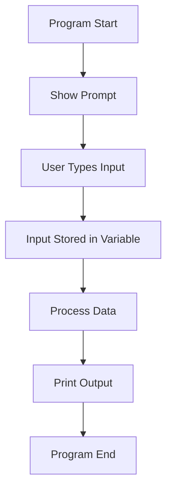
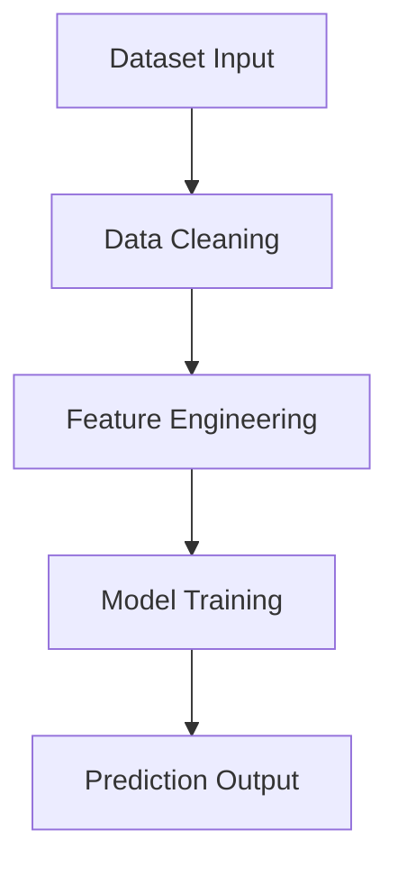

# Input / Output in Python

## 1. Introduction

Programming ma **Input** ane **Output** basic communication system chhe.

* **Input** = user/mathi data levu
* **Output** = screen par result batavvu

Computer program ek machine jevu chhe:

* Data andar aave → process thay → result bahar nikle

Aa concept vagar koi pan software possible nathi.

Examples:

* ATM → amount input
* Instagram → message input
* Calculator → numbers input
* ML Model → dataset input, prediction output

---

# 2. Real-World Analogy

Factory imagine karo.

```text
Raw Material → Machine → Finished Product
```

Programming ma:

```text
Input → Processing → Output
```

Example:

```python
name = input("Enter name: ")
print(name)
```

* User name ape chhe → Input
* Python memory ma store kare chhe
* Screen par display thay → Output

---

# 3. Core Theory

## Output System

Python ma output mate mainly:

```python
print()
```

use thay chhe.

`print()` internally:

1. Object ne string ma convert kare
2. Console/stdout taraf mokle
3. Terminal par display kare

---

## Input System

Python ma:

```python
input()
```

function keyboard thi data lese.

Important point:

⚠️ `input()` hamesha STRING return kare chhe.

Example:

```python
age = input("Enter age: ")
```

Jo user `25` lakhse to pn internally:

```python
"25"
```

string store thase.

---

# 4. Syntax Breakdown

## Output Example

```python
print("Hello")
```

Breakdown:

| Part      | Meaning           |
| --------- | ----------------- |
| `print`   | built-in function |
| `()`      | function call     |
| `"Hello"` | string argument   |

---

## Input Example

```python
name = input("Enter name: ")
```

Breakdown:

| Part             | Meaning                 |
| ---------------- | ----------------------- |
| `input`          | built-in input function |
| `"Enter name: "` | prompt message          |
| `=`              | assignment              |
| `name`           | variable storing input  |

---

# 5. Execution Flow Visualization



---

# 6. Memory + Internal Working

## Input Memory Behavior

Example:

```python
name = input()
```

Internally:

1. Keyboard buffer ma characters ave
2. Python string object create kare
3. Heap memory ma store thay
4. Variable reference hold kare

---

## Object Reference

```python
age = input()
```

Memory:

```python
age ---> "25"
```

`age` actual value nathi store kartu.

Reference store kare chhe.

---

## Why Input Returns String?

Python generic input system use kare chhe.

Keyboard thi badhu text form ma ave:

* `"25"`
* `"hello"`
* `"3.14"`

Therefore Python safe side par string return kare chhe.

---

# 7. Practical Examples

## Beginner Example

```python
# Taking name input
name = input("Enter your name: ")

# Printing output
print("Hello", name)
```

Output:

```text
Enter your name: Akshit
Hello Akshit
```

---

## Integer Input

```python
age = int(input("Enter age: "))

print(age + 5)
```

Why `int()`?

Because input returns string.

---

## Float Input

```python
salary = float(input("Enter salary: "))

print(salary)
```

---

## Multiple Inputs

```python
a, b = input("Enter two numbers: ").split()

print(a)
print(b)
```

---

## Real-World Example

### Login System

```python
username = input("Username: ")
password = input("Password: ")

print("Login Successful")
```

---

# 8. ML & Data Science Connection

Input/Output ML ma heavily use thay chhe.

## Dataset Input

```python
import pandas as pd

data = pd.read_csv("data.csv")
```

CSV file → Input

---

## Prediction Output

```python
prediction = model.predict(data)

print(prediction)
```

Model result → Output

---

## Deep Learning

Training pipeline:

```text
Dataset Input
↓
Preprocessing
↓
Model Training
↓
Prediction Output
```



---

# 9. Industry Engineering Mindset

Professionals direct raw input rarely use kare chhe.

Because:

* invalid data
* security risks
* crashes
* unexpected types

Example:

```python
age = int(input())
```

Jo user `"abc"` lakhse:

```python
ValueError
```

Production code ma validation compulsory hoy.

---

# 10. Common Mistakes

## Mistake 1: Forgetting Type Conversion

```python
age = input()

print(age + 5)
```

Error:

```python
TypeError
```

Because string + integer invalid chhe.

---

## Mistake 2: Wrong Split Count

```python
a, b = input().split()
```

User 3 values ape to error.

---

## Mistake 3: Unsafe Input

Never trust user input.

Production systems validate:

* type
* length
* format
* range

---

# 11. Interview Perspective

Common questions:

| Question                             | Purpose                |
| ------------------------------------ | ---------------------- |
| Why input returns string?            | Python internals       |
| Difference between print and return? | Function understanding |
| How to take multiple inputs?         | Practical coding       |
| How input buffer works?              | Internal behavior      |

---

# 12. Advanced Concepts

## Fast Input

Competitive programming ma:

```python
import sys

data = sys.stdin.readline()
```

`input()` karta faster chhe.

---

## Formatted Output

```python
name = "Akshit"
age = 21

print(f"My name is {name} and age is {age}")
```

Aa ne f-string kahe chhe.

Industry standard formatting.

---

## File Input/Output

```python
with open("data.txt") as file:
    content = file.read()

print(content)
```

---

# 13. Mini Project

## Student Grade Calculator

Features:

* student name input
* marks input
* percentage calculate
* grade output

Concepts used:

* input
* output
* type conversion
* arithmetic
* conditions

Scalable extension:

* CSV support
* database storage
* GUI version
* ML performance prediction

---

# 14. Performance Considerations

| Method                 | Speed  |
| ---------------------- | ------ |
| `input()`              | slower |
| `sys.stdin.readline()` | faster |

Competitive programming ma fast I/O important chhe.

---

# 15. Debugging Mindset

## Print Debugging

```python
age = input()

print(type(age))
```

Always verify data type.

---

## Edge Case Testing

Test karo:

* empty input
* special characters
* huge numbers
* invalid strings

---

# 16. Best Practices

## Good Naming

```python
student_name
```

instead of:

```python
x
```

---

## Clear Prompt Messages

```python
input("Enter your age: ")
```

not:

```python
input()
```

---

## Validate Inputs

```python
age = input()

if age.isdigit():
    age = int(age)
```

---

# 17. Summary Table

| Concept   | Purpose            | Industry Usage  |
| --------- | ------------------ | --------------- |
| `input()` | user thi data levu | forms, APIs     |
| `print()` | output display     | logs, debugging |
| `int()`   | type conversion    | calculations    |
| `float()` | decimal conversion | ML/statistics   |
| `split()` | multiple values    | dataset parsing |
| f-string  | formatted output   | production apps |

---

# 18. Key Takeaways

* Input/output programming nu foundation chhe
* `input()` always string return kare chhe
* Type conversion extremely important chhe
* Production systems ma validation compulsory chhe
* ML pipelines pan fundamentally input → processing → output system chhe
* Good engineers always think about:

  * data type
  * validation
  * scalability
  * performance
  * debugging
