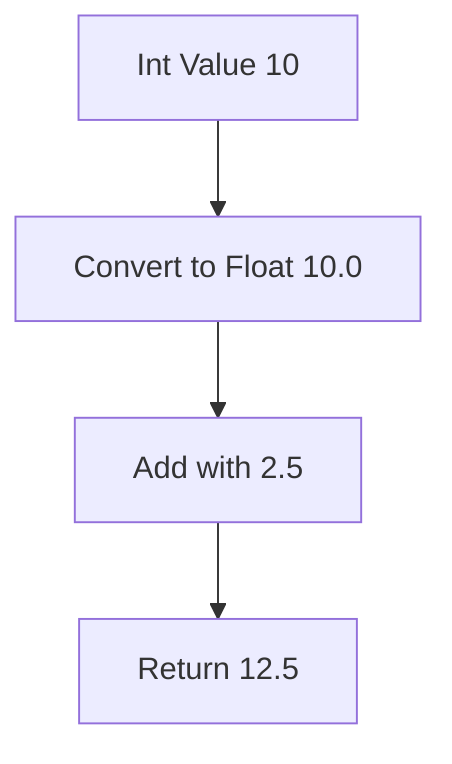
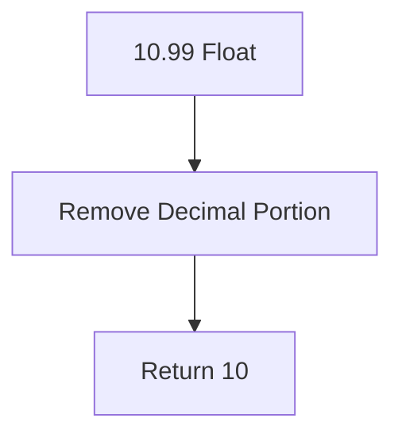

# Type Conversion in Python

## 1. Introduction

Type Conversion means:

> Ek data type ne bijaa data type ma convert karvu.

Example:

* `str` → `int`
* `int` → `float`
* `list` → `tuple`

Python dynamically typed language chhe, etle runtime par data types handle thay chhe. Pan real-world applications ma ghani vaar data type convert karvu jaruri bane chhe.

### Why it exists?

Karanke:

* User input always string hoy chhe
* Calculations mate numeric type joie
* ML datasets ma mixed types hoy
* APIs JSON/string data mokle
* Database values convert karvi pade

---

# 2. Real-World Analogy

Imagine:

Tamari pase different container chhe.

* Bottle = string
* Bucket = list
* Glass = integer

Water same chhe, pan container alag chhe.

Type conversion means:

> Same data ne bijaa format/container ma shift karvu.

---

# 3. Core Theory

Python ma mainly 2 type conversion hoy chhe:

| Type                | Meaning                   |
| ------------------- | ------------------------- |
| Implicit Conversion | Python automatically kare |
| Explicit Conversion | Programmer manually kare  |

---

# 4. Implicit Type Conversion

Python automatically safer type ma convert kare.

Example:

```python
a = 10       # int
b = 2.5      # float

result = a + b

print(result)
print(type(result))
```

## Output

```python
12.5
<class 'float'>
```

### Internal Working

Python internally:

```python
10 -> 10.0
```

pachi addition kare chhe.

---

## Execution Flow



---

# 5. Explicit Type Conversion

Programmer manually conversion kare.

Example:

```python
age = "25"

converted_age = int(age)

print(converted_age)
print(type(converted_age))
```

---

# 6. Common Type Conversion Functions

| Function  | Converts To |
| --------- | ----------- |
| `int()`   | Integer     |
| `float()` | Float       |
| `str()`   | String      |
| `list()`  | List        |
| `tuple()` | Tuple       |
| `set()`   | Set         |
| `dict()`  | Dictionary  |
| `bool()`  | Boolean     |

---

# 7. Syntax Breakdown

## Example

```python
num = "100"

x = int(num)
```

---

## Line-by-Line

### Line 1

```python
num = "100"
```

* String object create thay
* Heap memory ma `"100"` store thay
* `num` reference point kare chhe

---

### Line 2

```python
x = int(num)
```

Python:

1. `"100"` string read kare
2. Check kare valid integer chhe ke nai
3. New integer object create kare
4. `x` ne reference assign kare

---

# 8. Memory + Internal Working

## String to Integer Conversion

```python
x = "50"
y = int(x)
```

---

## Internal Process

```mermaid
flowchart TD
    A[String Object "50"] --> B[int() Parser]
    B --> C[Validate Numeric Characters]
    C --> D[Create Integer Object 50]
    D --> E[Assign Reference to y]
```

---

## Important Point

Original object modify nathi thatu.

```python
x = "50"
```

still string j rehse.

---

# 9. Integer Conversion

## Example

```python
x = 10.99

print(int(x))
```

## Output

```python
10
```

⚠ Important:

`int()` decimal ne round nathi kartu.

It truncates.

---

## Internal Behavior



---

# 10. Float Conversion

```python
x = "5.8"

y = float(x)

print(y)
```

## Output

```python
5.8
```

---

# 11. String Conversion

```python
salary = 50000

text = str(salary)

print(text)
```

Useful for:

* Logging
* Printing
* File handling
* API responses

---

# 12. Boolean Conversion

## Rules

| Value           | Boolean Result |
| --------------- | -------------- |
| `0`             | False          |
| `""`            | False          |
| `[]`            | False          |
| `{}`            | False          |
| `None`          | False          |
| Everything Else | True           |

---

## Example

```python
print(bool(0))
print(bool(100))
print(bool(""))
print(bool("Python"))
```

---

# 13. List Conversion

```python
text = "python"

chars = list(text)

print(chars)
```

## Output

```python
['p', 'y', 't', 'h', 'o', 'n']
```

---

# 14. Tuple Conversion

```python
numbers = [1, 2, 3]

t = tuple(numbers)

print(t)
```

---

# 15. Set Conversion

```python
nums = [1, 1, 2, 2, 3]

s = set(nums)

print(s)
```

## Output

```python
{1, 2, 3}
```

Set duplicates remove kare chhe.

---

# 16. Dictionary Conversion

```python
pairs = [("name", "Akshit"), ("age", 21)]

d = dict(pairs)

print(d)
```

---

# 17. Execution Flow Visualization

```mermaid
flowchart TD
    A[Input Data] --> B{Target Type?}

    B -->|int| C[int()]
    B -->|float| D[float()]
    B -->|string| E[str()]
    B -->|list| F[list()]
    B -->|tuple| G[tuple()]

    C --> H[Converted Object]
    D --> H
    E --> H
    F --> H
    G --> H
```

---

# 18. Error Handling in Conversion

## Example

```python
x = "abc"

print(int(x))
```

## Error

```python
ValueError
```

---

## Why?

Karanke `"abc"` numeric string nathi.

---

# 19. Safe Conversion

```python
x = input("Enter number: ")

try:
    num = int(x)
    print(num)

except ValueError:
    print("Invalid Input")
```

---

# 20. ML & Data Science Connection

Type conversion ML ma extremely important chhe.

## Example Areas

| Area          | Usage               |
| ------------- | ------------------- |
| Pandas        | String → numeric    |
| NumPy         | dtype conversion    |
| TensorFlow    | tensor casting      |
| PyTorch       | float32 conversion  |
| Data Cleaning | invalid type fixing |

---

## Pandas Example

```python
import pandas as pd

data = {
    "age": ["20", "25", "30"]
}

df = pd.DataFrame(data)

df["age"] = df["age"].astype(int)

print(df.dtypes)
```

---

# 21. Industry Engineering Mindset

Professional engineers:

* Validate before conversion
* Handle exceptions properly
* Avoid unnecessary conversion
* Optimize large dataset casting

---

## Beginner Mistakes

| Mistake             | Problem          |
| ------------------- | ---------------- |
| `int("12.5")`       | Error            |
| Blind conversion    | Crash            |
| Repeated conversion | Slow performance |
| Wrong dtype in ML   | Training issues  |

---

# 22. Performance Considerations

Large datasets ma repeated conversion expensive hoy.

Example:

```python
for value in data:
    int(value)
```

Millions rows ma slow bani shake.

---

## Better Approach

Vectorized conversion.

```python
df["age"] = pd.to_numeric(df["age"])
```

---

# 23. Time Complexity

| Conversion | Complexity |
| ---------- | ---------- |
| `int()`    | O(n)       |
| `float()`  | O(n)       |
| `list()`   | O(n)       |
| `set()`    | O(n)       |

`n` = input size

---

# 24. Debugging Mindset

## Always Check

```python
print(type(variable))
```

---

## Common Debugging

```python
x = "50"

print(type(x))
print(x)
```

---

# 25. Interview Perspective

Common Questions:

1. Difference between implicit and explicit conversion?
2. Why `int("12.5")` fails?
3. Difference between casting and parsing?
4. What is type coercion?
5. Mutable vs immutable conversion?

---

# 26. Advanced Concepts

## Type Casting in NumPy

```python
import numpy as np

arr = np.array([1, 2, 3])

float_arr = arr.astype(float)
```

---

## Tensor Conversion in PyTorch

```python
tensor.float()
tensor.int()
```

Deep learning ma datatype memory and speed heavily affect kare chhe.

---

# 27. Mini Project

## User Input Calculator

### Features

* Take input from user
* Convert to numeric type
* Perform operations
* Handle invalid input

---

## Example

```python
num1 = float(input("Enter first number: "))
num2 = float(input("Enter second number: "))

print(num1 + num2)
```

---

# 28. Best Practices

| Practice                   | Reason              |
| -------------------------- | ------------------- |
| Validate before conversion | Avoid crashes       |
| Use try-except             | Safe programs       |
| Avoid unnecessary casting  | Better performance  |
| Use vectorized conversion  | Faster ML pipelines |
| Maintain dtype consistency | Clean architecture  |

---

# 29. Summary Table

| Concept             | Purpose             | Industry Usage        |
| ------------------- | ------------------- | --------------------- |
| `int()`             | Convert to integer  | Data preprocessing    |
| `float()`           | Decimal conversion  | ML calculations       |
| `str()`             | Text conversion     | Logging/API           |
| `list()`            | Sequence conversion | Data handling         |
| `set()`             | Remove duplicates   | Data cleaning         |
| Implicit Conversion | Automatic casting   | Arithmetic operations |
| Explicit Conversion | Manual casting      | Production systems    |

---

# 30. Key Takeaways

* Type conversion Python no core concept chhe
* ML/Data Science ma dtype handling critical chhe
* Wrong conversion bugs create kare
* Safe conversion production systems ma mandatory chhe
* Performance large-scale data pipelines ma important bane chhe
* Engineers always validate and handle exceptions properly

---