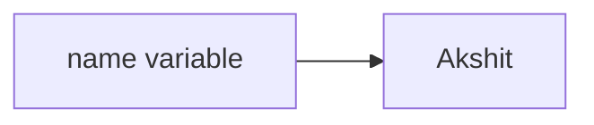
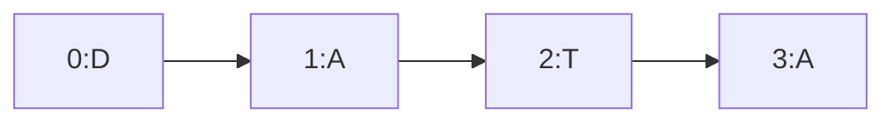
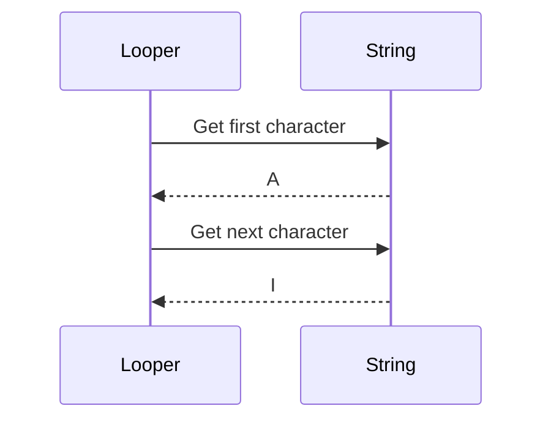
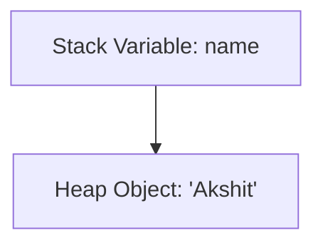
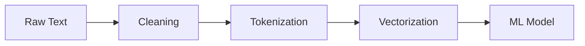

# STRINGS IN PYTHON

## 1. Intuitive Introduction

A **string** is text data.

Anything inside quotes:

```python
"name"
'hello'
"123"
```

is a string.

Strings exist because software constantly works with text:

* usernames
* passwords
* chat messages
* API responses
* logs
* file paths
* JSON data
* NLP datasets
* prompts in AI systems

Without strings:

* Google Search cannot work
* ChatGPT cannot work
* Instagram captions cannot exist
* ML text models cannot train

Strings are one of the MOST important data types in Python.

---

# Real-World Analogy

Think of a string like:

> A train made of characters.

Example:

```python
"PYTHON"
```

Internally:

| Position | Character |
| -------- | --------- |
| 0        | P         |
| 1        | Y         |
| 2        | T         |
| 3        | H         |
| 4        | O         |
| 5        | N         |

Each character has an index.

Python stores strings as an ordered sequence of characters.

---

# 3. Core Theory

## What is a String Internally?

A string is:

* an object
* immutable
* ordered
* iterable

Python internally stores strings as Unicode character sequences.

Example:

```python
name = "Akshit"
```

Python creates:

1. string object in memory
2. reference variable `name`
3. links variable → object

---

# Internal Memory Representation



---

# Strings are IMMUTABLE

This is extremely important.

You CANNOT directly change characters.

Example:

```python
name = "python"

name[0] = "P"
```

This gives:

```python
TypeError
```

Because Python strings are immutable.

Instead:

```python
name = "Python"
```

A NEW string object is created.

---

# Why Immutability Exists?

Because immutable objects are:

* safer
* hashable
* memory efficient
* faster for caching
* useful in dictionaries

Huge engineering reason.

---

# 4. Syntax Breakdown

## Creating Strings

```python
name = "Akshit"
```

### Breakdown

| Part       | Meaning       |
| ---------- | ------------- |
| `name`     | variable      |
| `=`        | assignment    |
| `"Akshit"` | string object |

---

# Single vs Double Quotes

Both are same:

```python
"a"
'a'
```

Use whichever improves readability.

Example:

```python
message = "I'm learning Python"
```

avoids escaping.

---

# Multi-Line Strings

```python
text = """
Hello
World
"""
```

Useful for:

* documentation
* SQL queries
* prompts
* templates

---

# 5. Visual Explanation

## String Traversal

```python
word = "DATA"
```



---

# Iteration Flow

```python
for char in "AI":
    print(char)
```



---

# 6. Memory + Internal Working

## String Object Creation

```python
a = "hello"
b = "hello"
```

Python may reuse memory internally.

Called:

# String Interning

Optimization technique.

---

# Mutable vs Immutable

| Type       | Mutable? |
| ---------- | -------- |
| list       | YES      |
| dictionary | YES      |
| string     | NO       |
| tuple      | NO       |

---

# Stack vs Heap

```python
name = "Akshit"
```

## Stack

Stores:

* variable reference

## Heap

Stores:

* actual string object

---



---

# 7. Practical Coding Examples

# Beginner Example

```python
name = "Akshit"

print(name)
print(type(name))
```

## Output

```python
Akshit
<class 'str'>
```

---

# Accessing Characters

```python
word = "Python"

print(word[0])   # First character
print(word[3])   # Fourth character
```

## Output

```python
P
h
```

---

# Negative Indexing

```python
word = "Python"

print(word[-1])
print(word[-2])
```

## Output

```python
n
o
```

---

# Slicing

```python
text = "MachineLearning"

print(text[0:7])
print(text[7:])
```

## Output

```python
Machine
Learning
```

---

# Slice Syntax

```python
text[start:end:step]
```

---

# Reverse String

```python
text = "Python"

print(text[::-1])
```

## Output

```python
nohtyP
```

---

# Real-World Example

## Email Validation

```python
email = "user@gmail.com"

if "@" in email:
    print("Valid Email")
```

---

# Production Example

## Cleaning User Input

```python
name = "   akshit   "

clean_name = name.strip().title()

print(clean_name)
```

## Output

```python
Akshit
```

Industry uses this constantly.

---

# 8. Important String Methods

| Method          | Purpose          |
| --------------- | ---------------- |
| `.lower()`      | lowercase        |
| `.upper()`      | uppercase        |
| `.strip()`      | remove spaces    |
| `.replace()`    | replace text     |
| `.split()`      | split string     |
| `.join()`       | combine strings  |
| `.find()`       | search substring |
| `.startswith()` | prefix check     |
| `.endswith()`   | suffix check     |

---

# Example

```python
text = "Python AI"

print(text.lower())
print(text.upper())
print(text.replace("AI", "ML"))
```

---

# Split and Join

## Split

```python
data = "apple,banana,mango"

fruits = data.split(",")

print(fruits)
```

Output:

```python
['apple', 'banana', 'mango']
```

---

## Join

```python
words = ["Machine", "Learning"]

result = " ".join(words)

print(result)
```

Output:

```python
Machine Learning
```

---

# 9. Industry Engineering Mindset

## Beginners Do This

```python
full = first + last + city + country
```

Bad for large-scale concatenation.

---

## Professionals Use

```python
" ".join(data)
```

Better memory efficiency.

---

# Why?

Because strings are immutable.

Every `+` creates NEW objects.

Huge performance issue in large systems.

---

# 10. String Formatting

# Old Style

```python
name = "Akshit"

print("Hello %s" % name)
```

---

# format()

```python
print("Hello {}".format(name))
```

---

# Modern Industry Standard → f-strings

```python
name = "Akshit"
age = 21

print(f"My name is {name} and age is {age}")
```

Fastest + cleanest.

---

# Internal Idea

Python evaluates variables inside `{}` dynamically.

---

# 11. Escape Characters

| Escape | Meaning      |
| ------ | ------------ |
| `\n`   | new line     |
| `\t`   | tab          |
| `\\`   | backslash    |
| `\"`   | double quote |

---

# Example

```python
print("Hello\nWorld")
```

Output:

```python
Hello
World
```

---

# Raw Strings

Useful in:

* file paths
* regex
* Windows paths

```python
path = r"C:\Users\Akshit"
```

---

# 12. ML & Data Science Connection

Strings are MASSIVE in ML.

Used in:

* NLP
* tokenization
* prompt engineering
* dataset cleaning
* label processing
* chatbots
* embeddings
* search systems

---

# Example in Pandas

```python
import pandas as pd

data = {
    "text": ["I love AI", "Python is amazing"]
}

df = pd.DataFrame(data)

df["lower"] = df["text"].str.lower()

print(df)
```

---

# NLP Pipeline



---

# 13. Common Mistakes

# Mistake 1

```python
name[0] = "A"
```

Strings immutable.

---

# Mistake 2

Confusing index positions.

```python
word[5]
```

May cause:

```python
IndexError
```

---

# Mistake 3

Using `+` repeatedly in loops.

Bad performance.

---

# Mistake 4

Forgetting string methods return NEW strings.

```python
text.upper()

print(text)
```

Original unchanged.

---

# 14. Performance Considerations

# Time Complexity

| Operation     | Complexity |
| ------------- | ---------- |
| Indexing      | O(1)       |
| Slicing       | O(n)       |
| Concatenation | O(n)       |
| Search        | O(n)       |

---

# Efficient Concatenation

Bad:

```python
result = ""

for word in words:
    result += word
```

Better:

```python
result = "".join(words)
```

---

# 15. Debugging Mindset

## Always Print Intermediate Values

```python
text = "Python"

print(len(text))
print(text[0])
print(text[-1])
```

---

# Trace String Transformations

```python
email = " USER@GMAIL.COM "

print(email)
print(email.strip())
print(email.lower())
```

---

# 16. Advanced Concepts

# String Encoding

Computers store text as numbers.

Example:

```python
ord("A")
```

Output:

```python
65
```

---

# Unicode

```python
print("नमस्ते")
print("你好")
```

Python supports Unicode.

Critical for global applications.

---

# Iterator Protocol

```python
text = "AI"

iterator = iter(text)

print(next(iterator))
print(next(iterator))
```

Strings are iterable objects.

---

# 17. Interview Preparation

# Beginner Questions

1. What is a string?
2. Why are strings immutable?
3. Difference between list and string?
4. What is slicing?
5. What is negative indexing?

---

# Intermediate Questions

6. Difference between `split()` and `join()`
7. Why are f-strings faster?
8. Explain string interning.
9. How does Python store Unicode?
10. Complexity of string concatenation?

---

# Advanced / FAANG-Level

11. Design a tokenizer.
12. Reverse words efficiently.
13. Detect palindrome.
14. Build substring search.
15. Explain memory impact of immutable strings.
16. Difference between bytes and strings.
17. Implement custom parser.
18. Optimize huge text-processing pipeline.
19. Explain UTF-8 vs UTF-16.
20. How do search engines process strings?

---

# Example Interview Problem

## Reverse Words

```python
text = "I love Python"

# Output:
# Python love I
```

---

# Hidden Trap

Many candidates reverse characters instead of words.

---

# 18. Mini Project

# Build Text Analyzer

Features:

* word count
* vowel count
* palindrome check
* frequency counter
* sentence cleaner
* email extractor

This project builds:

* loops
* conditions
* dictionaries
* string methods
* debugging

Very strong beginner project.

---

# 19. Best Practices

## Use Meaningful Names

Bad:

```python
s = "hello"
```

Better:

```python
username = "hello"
```

---

# Prefer f-strings

```python
print(f"Welcome {name}")
```

---

# Avoid Hardcoded Text

Bad:

```python
if role == "admin":
```

Better:

```python
ADMIN_ROLE = "admin"
```

---

# Use strip() on User Input

Very important.

---

# 20. Summary Table

| Concept  | Purpose           | Industry Usage       |
| -------- | ----------------- | -------------------- |
| String   | Text storage      | APIs, NLP            |
| Indexing | Access characters | Parsing              |
| Slicing  | Extract text      | Data cleaning        |
| split()  | Break text        | CSV parsing          |
| join()   | Combine text      | Efficient processing |
| f-string | Formatting        | Logging              |
| strip()  | Clean input       | User data            |
| Unicode  | Global text       | International apps   |

---

# 21. Key Takeaways

Most important lessons:

* Strings are immutable.
* Strings are sequences of characters.
* Slicing is extremely powerful.
* `join()` is better for large concatenation.
* f-strings are industry standard.
* Strings are foundational for AI and NLP.
* Understanding memory behavior separates beginners from engineers.

---