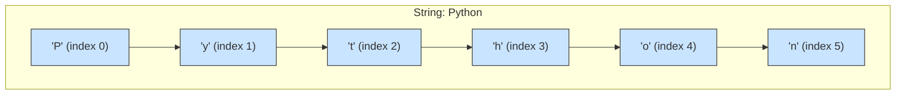
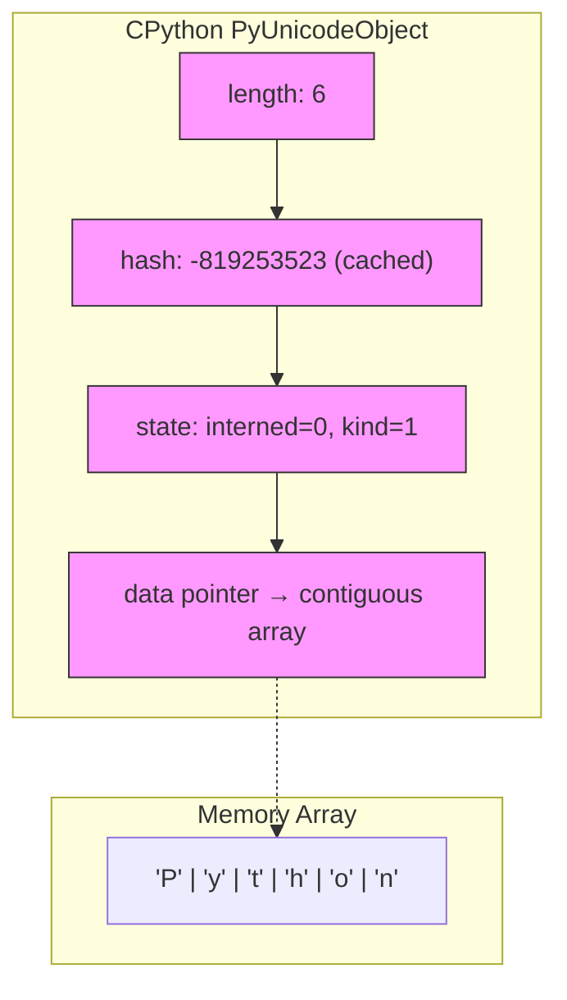

# Strings: The Immutable Sequence of Characters

## 1. Intuitive Introduction

Imagine you are writing a letter. The words you put on the paper are **strings** – a sequence of letters, spaces, and punctuation. Once you print the letter, you cannot erase a single character without leaving a smudge; you must rewrite the whole page if you want to change something. That’s exactly how strings work in Python.

**Why do strings exist?**  
Computers need to represent and manipulate text – user input, file contents, API responses, database records. Strings provide a clean, efficient, and safe way to handle textual data.

**Where are strings used in real software?**
- **Student project:** Checking if a password contains at least one uppercase letter and one digit.
- **Data science:** Cleaning messy CSV columns – removing extra spaces, converting to lowercase.
- **Web development:** Building dynamic HTML templates or parsing URL query parameters.
- **Machine learning:** Tokenizing sentences, extracting features from tweets, or preprocessing text for an LLM.

---

## 2. Real‑World Analogy

Think of a **string as a row of fixed lockers**, each holding a single character. The lockers are numbered from 0 (leftmost) to n‑1 (rightmost).  
- You can **look** into any locker (access by index) instantly.  
- But you cannot **change** a locker’s content – the whole row is sealed in resin. To “modify” a string, you must build a brand new row of lockers.

This immutability makes strings predictable, hashable (so they can be dictionary keys), and safe to share across multiple parts of a program without accidental changes.

---

## 3. Core Theory

Strings in Python are **immutable sequences of Unicode code points**.  
Key properties:

- **Ordered** – characters have a fixed position.
- **Immutable** – cannot be changed in‑place.
- **Iterable** – can loop over characters.
- **Indexable** – access by position: `s[0]`, `s[-1]`.
- **Hashable** – can be used as dictionary keys or set elements.
- **Supports concatenation and repetition** – `+` and `*`.

```python
# Demonstration of core properties
s = "Python"

# Ordered & indexable
print(s[0])     # 'P'
print(s[-1])    # 'n'

# Immutable – this will raise an error
try:
    s[0] = 'J'
except TypeError as e:
    print(f"Error: {e}")   # 'str' object does not support item assignment

# Hashable – works as dict key
d = {s: "awesome"}
print(d[s])     # awesome

# Iterable
for ch in "Hi":
    print(ch)   # H, i
```

---

## 4. Visual Explanation

The following Mermaid diagram shows how a string is a sequence of indexed characters.



Each box is a fixed, unchangeable character. Negative indices count from the end: `-1` → `'n'`.

---

## 5. Memory & Internal Working (CPython)

CPython stores a string as a contiguous array of characters in memory, using either 1, 2, or 4 bytes per character (depending on the maximum Unicode code point). The `PyUnicodeObject` contains:

- `length` – number of characters.
- `hash` – cached hash value (for fast dict/set lookups).
- `state` – flags for kind (1‑byte, 2‑byte, 4‑byte) and interned status.
- A pointer to the actual character array.

Because the array is fixed‑size and immutable, Python never needs to reallocate or copy it unless you explicitly create a new string. Small strings (usually < 4096 chars) are sometimes **interned** – reused to save memory.



**Why immutability helps performance:**  
- No need for locks when threads read the same string.
- Hashing is done once and cached.
- String concatenation in loops is slow – but that’s by design; use `join()` instead.

---

## 6. Creating Strings

### All possible creation ways

```python
# 1. Literals (most common)
s1 = 'hello'
s2 = "world"
s3 = """Multiline
string"""
s4 = '''Another multiline'''

# 2. Using str() constructor
s5 = str(123)          # "123"
s6 = str(3.14)         # "3.14"
s7 = str([1, 2, 3])    # "[1, 2, 3]"

# 3. From bytes with encoding
b = b'hello'
s8 = b.decode('utf-8') # "hello"

# 4. Comprehension (using join and generator)
s9 = ''.join(str(i) for i in range(5))  # "01234"

# 5. Using string multiplication
s10 = "ab" * 3         # "ababab"

# 6. Empty string
empty = ""
```

### Common mistakes

```python
# Mistake 1: mixing quotes incorrectly
# s = 'It's fine'   # SyntaxError
# Correct:
s = "It's fine"

# Mistake 2: forgetting that strings are immutable
# s = "hello"
# s[0] = "H"         # TypeError

# Mistake 3: using + in a loop (performance killer)
result = ""
for ch in ["a", "b", "c"]:
    result += ch      # O(n²) – creates many intermediate strings
# Better: ''.join(["a", "b", "c"])
```

---

## 7. Core Operations / Methods

| Method | Example | Output | Explanation | When to use |
|--------|---------|--------|-------------|--------------|
| `len()` | `len("abc")` | `3` | Returns number of characters | Any time you need string length |
| `upper()` / `lower()` | `"Hi".lower()` | `"hi"` | Case conversion | Case‑insensitive comparisons |
| `strip()` | `"  a  ".strip()` | `"a"` | Removes leading/trailing whitespace | Cleaning user input |
| `split()` | `"a,b,c".split(",")` | `["a","b","c"]` | Splits into list | Parsing CSV, log files |
| `join()` | `",".join(["a","b"])` | `"a,b"` | Joins iterable with separator | Efficient string building |
| `replace()` | `"hello".replace("l","x")` | `"hexxo"` | Replaces substrings | Simple text substitution |
| `find()` | `"abc".find("b")` | `1` | Returns lowest index or -1 | Searching without exceptions |
| `startswith()` | `"Py".startswith("P")` | `True` | Checks prefix | Filtering strings |
| `format()` / f‑string | `f"{name}"` | `"John"` | String interpolation | Dynamic string creation |

```python
# Demonstration with full examples
text = "  Python Programming  "

# strip + lower
cleaned = text.strip().lower()
print(cleaned)                     # "python programming"

# split into words
words = cleaned.split()
print(words)                       # ["python", "programming"]

# join with hyphen
hyphenated = "-".join(words)
print(hyphenated)                  # "python-programming"

# replace
replaced = hyphenated.replace("python", "java")
print(replaced)                    # "java-programming"

# find
pos = replaced.find("java")
print(pos)                         # 0
```

---

## 8. Advanced Concepts

### Slicing
`[start:stop:step]` – returns a **new** string.

```python
s = "0123456789"
print(s[2:7])      # "23456"  (stop exclusive)
print(s[:5])       # "01234"
print(s[5:])       # "56789"
print(s[::2])      # "02468"  (step 2)
print(s[::-1])     # "9876543210"  (reverse)
```

### Packing & Unpacking
```python
# Packing not special, but unpacking works
a, b, c = "XYZ"    # a='X', b='Y', c='Z'
first, *rest = "Python"  # first='P', rest=['y','t','h','o','n']
```

### String Comprehension (via generator)
```python
# Create a string from a comprehension using join
s = ''.join(str(x) for x in range(10) if x % 2 == 0)
print(s)          # "02468"
```

### Nested structures (list of strings, etc.)
```python
matrix_str = ["abc", "def", "ghi"]
# Accessing characters
print(matrix_str[1][2])   # 'f'
```

### Raw strings (escape sequences ignored)
```python
path = r"C:\Users\Name"   # no need to double backslashes
print(path)               # C:\Users\Name
```

### f‑strings with expressions
```python
a, b = 5, 3
print(f"{a} + {b} = {a + b}")   # "5 + 3 = 8"
print(f"{a:.2f}")               # "5.00"
```

---

## 9. Mathematical / Special Operations

Strings support only two mathematical‑like operators:

| Operation | Syntax | Example | Result |
|-----------|--------|---------|--------|
| Concatenation | `+` | `"Hi " + "there"` | `"Hi there"` |
| Repetition | `*` | `"Ha" * 3` | `"HaHaHa"` |

No subtraction, division, etc.

**Membership:** `in` and `not in`

```python
print("Py" in "Python")   # True
print("x" not in "Hi")    # True
```

**Comparison:** Lexicographic order based on Unicode code points.

```python
print("apple" < "banana")   # True (ord('a') < ord('b'))
print("Apple" < "apple")    # True (uppercase A = 65, lowercase a = 97)
```

---

## 10. Real Practical Examples

### Example 1: Log file parser – extract error codes
```python
log_lines = [
    "2024-01-15 ERROR 404 Not Found",
    "2024-01-15 INFO User login",
    "2024-01-15 ERROR 500 Internal Error"
]

error_codes = []
for line in log_lines:
    if "ERROR" in line:
        # Split and take the third element (code)
        parts = line.split()
        code = parts[2]  # "404" or "500"
        error_codes.append(code)

print(f"Error codes found: {error_codes}")  # ['404', '500']
```

### Example 2: Cleaning user‑submitted phone numbers
```python
def clean_phone(phone: str) -> str:
    # Remove all non‑digit characters
    cleaned = ''.join(ch for ch in phone if ch.isdigit())
    # Ensure 10 digits (US example)
    if len(cleaned) == 10:
        return f"({cleaned[:3]}) {cleaned[3:6]}-{cleaned[6:]}"
    return "Invalid number"

print(clean_phone("+1 (800) 555-1234"))  # (800) 555-1234
print(clean_phone("800.555.1234"))       # (800) 555-1234
```

---

## 11. ML & Data Science Connection

Strings are the foundation of **Natural Language Processing (NLP)**. Common pipelines:

- **Pandas:** Cleaning text columns with `.str` accessor
- **Scikit‑learn:** `CountVectorizer`, `TfidfVectorizer` convert strings to numerical features.
- **NLTK / spaCy:** Tokenization, stemming, lemmatization – all operate on strings.
- **TensorFlow / PyTorch:** Text data is tokenized into integers, but the original strings are needed for decoding predictions.

```python
import pandas as pd

# Pandas string operations – vectorized and fast
df = pd.DataFrame({'review': ["  Great movie!  ", "Not good", "Awesome!!"]})
df['clean'] = df['review'].str.strip().str.lower().str.replace('!', '')
print(df['clean'])
# 0    great movie
# 1       not good
# 2        awesome
```

```python
from sklearn.feature_extraction.text import CountVectorizer

corpus = ["Python is great", "I love Python", "Great language"]
vectorizer = CountVectorizer(lowercase=True)
X = vectorizer.fit_transform(corpus)
print(vectorizer.get_feature_names_out())
# ['great' 'is' 'language' 'love' 'python']
```

---

## 12. Common Mistakes & Pitfalls

| Mistake | Wrong code | Consequence | Correct way |
|---------|------------|-------------|--------------|
| Using `+` in a loop | `s = ""; for i in range(1000): s += str(i)` | O(n²) memory/time | `''.join(str(i) for i in range(1000))` |
| Assuming strings are mutable | `s = "hi"; s[0] = "H"` | `TypeError` | Create new string: `"H" + s[1:]` |
| Forgetting `str()` for non‑strings | `"value: " + 42` | `TypeError` | `"value: " + str(42)` or f‑string |
| Using `==` for case‑insensitive compare | `if user_input == "yes":` | Misses "Yes"/"YES" | `if user_input.lower() == "yes":` |
| Using `find()` instead of `in` | `if s.find("sub") != -1:` | Less readable | `if "sub" in s:` |

---

## 13. Performance Considerations

| Operation | Time Complexity | Why? |
|-----------|----------------|------|
| Indexing `s[i]` | O(1) | Direct array access |
| Length `len(s)` | O(1) | Length is stored as an attribute |
| Slicing `s[a:b]` | O(k) where k = b‑a | New string must be created and copied |
| Concatenation `s + t` | O(len(s) + len(t)) | New string allocated and both copied |
| Repetition `s * n` | O(n * len(s)) | Creates new string of length n*len(s) |
| `in` (substring search) | O(n*m) worst case (n = len(haystack), m = len(needle)) | Naive algorithm in CPython, but optimized with fast search (Two‑Way) |
| `join()` on list of k strings of length L | O(k * L) | Single pass, pre‑allocates total size |
| `split()` | O(n) | Scans once to build list |

**Golden rule:** For building large strings, always use `join()` over repeated `+`.

---

## 14. Interview Questions

### Beginner
1. How do you reverse a string in Python?  
   `s[::-1]`
2. What is the difference between `s.find('a')` and `'a' in s`?  
   `find` returns the index (or -1), `in` returns a boolean.
3. Why does `"hello".upper()` return a new string instead of changing the original?  
   Strings are immutable.
4. How can you get the last character of a string?  
   `s[-1]`
5. What does `len("")` return?  
   `0`

### Intermediate
1. Explain why `''.join(list_of_strings)` is faster than using `+` in a loop.  
   `join` pre‑computes total length and allocates once; repeated `+` creates many intermediate strings.
2. Write a function that checks if a string is a palindrome (ignoring case and spaces).  
   ```python
   def is_palindrome(s):
       clean = ''.join(ch.lower() for ch in s if ch.isalnum())
       return clean == clean[::-1]
   ```
3. What is string interning? When does CPython do it automatically?  
   Interning reuses immutable string objects to save memory. CPython interns short strings (often < 4096 chars) and some identifiers automatically.
4. How do f‑strings work internally?  
   They are evaluated at runtime: each `{}` expression is converted to `str()` and concatenated.
5. What is the difference between `s.replace("l", "x")` and `s.translate(...)`?  
   `replace` handles one‑to‑one substitution; `translate` uses a mapping table for many replacements efficiently.

### Advanced
1. Implement a function that finds the longest substring without repeating characters.  
   (Sliding window technique – tests understanding of string iteration and sets.)
2. Explain the internal memory layout of a Unicode string in CPython (compact vs legacy, kind 1/2/4).  
   (Flexible string representation – `PyUnicodeObject` stores either 1, 2, or 4 bytes per char based on max code point.)
3. How would you efficiently concatenate 10,000 strings without using `join`?  
   (You wouldn’t – but you could write to `io.StringIO`.)
4. Why does `s == s.lower()` sometimes cause surprising behavior with Unicode?  
   Because case folding is locale‑ and context‑sensitive (e.g., German "ß".upper() → "SS").
5. Write a generator that yields all substrings of a given string in O(n²) time without creating a list of them all.  
   ```python
   def substrings(s):
       n = len(s)
       for i in range(n):
           for j in range(i+1, n+1):
               yield s[i:j]
   ```

---

## 15. Mini Project Idea

**Project: Markdown to HTML snippet converter**  
Build a function that takes a multiline string containing basic Markdown (headings, bold, italic, lists) and returns an HTML string. Use only string methods, slicing, and loops – no external libraries.

**Core tasks:**
- Detect `# Heading` → `<h1>Heading</h1>`
- Detect `**bold**` → `<strong>bold</strong>`
- Detect `*italic*` → `<em>italic</em>`
- Detect `- item` → `<li>item</li>` wrapped in `<ul>`

**Why it strengthens understanding:**  
Parsing text with string methods teaches slicing, searching, splitting, and immutability – you’ll create many new strings from the original.

---

## 16. Best Practices

1. **Prefer f‑strings over `format()` or `%`** – they are faster and more readable.
2. **Use `join()` for concatenation in loops** – never `+=` inside a loop.
3. **Use raw strings for regular expressions and file paths** – `r"..."` to avoid escaping.
4. **Chain string methods** – `s.strip().lower().replace(...)` for clean pipelines.
5. **Use `str.startswith()` / `endswith()` with tuples** – `s.endswith(('.jpg', '.png'))`.
6. **Remember immutability** – if you need a “mutable string”, use `list` of chars and `''.join()` at the end.

---

## 17. Summary Table

| Concept | Key Characteristics | Purpose | Industry Usage |
|---------|---------------------|---------|----------------|
| **String** | Immutable, ordered, hashable | Text representation | Everywhere – logs, UI, files, APIs, NLP |
| **Indexing/Slicing** | O(1) access, O(k) slice | Extract substrings | Parsing, data cleaning |
| **Methods (split/join)** | Create/break strings | Parsing & serialization | CSV, JSON, URL processing |
| **f‑strings** | Runtime interpolation | Dynamic text generation | Logging, error messages, templating |
| **Raw strings** | Ignore escape sequences | Regex, file paths | `re` module, Windows paths |
| **Unicode support** | Any language character | Internationalization | Web apps, ML multilingual models |

---

## 18. Key Takeaways

- 🔤 Strings are **immutable sequences** – you never modify the original, only create new ones.
- 🧠 Use `join()` for concatenation, **never `+` in loops** – performance matters.
- 🧼 Clean user input with `strip()`, `lower()`, and `replace()` before processing.
- 🧪 Slicing with `[::-1]` is the simplest way to reverse a string.
- 🔎 `in` operator is more Pythonic than `find()` for presence checks.
- 📊 In data science, Pandas `.str` accessor vectorizes string operations on entire columns.
- 🧩 F‑strings (`f"{var}"`) are the modern, fast, readable formatting method.
- 🧠 Understanding string internals (immutability, caching) helps write efficient text processing code.