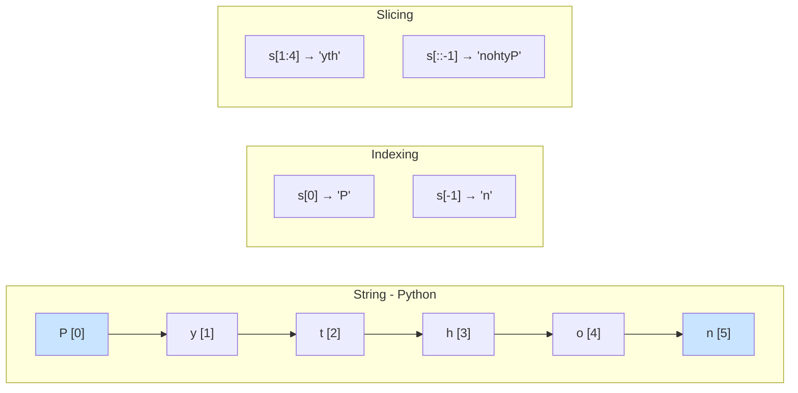
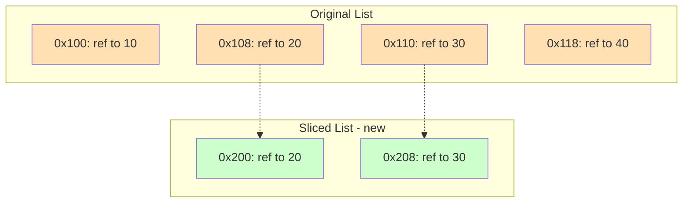

# Indexing & Slicing: The Art of Extracting Data from Sequences

## 1. Intuitive Introduction

Imagine you have a row of 10 boxes, each containing a different item. You need to grab:
- The **first** box → that's **indexing** (single box)
- Boxes **3 through 7** → that's **slicing** (a contiguous range)
- Every **second** box starting from box 2 → that's **slicing with a step**

In Python, almost every ordered data container – strings, lists, tuples, NumPy arrays, Pandas Series – supports indexing and slicing. Without these, extracting even a single element would require clumsy loops or manual counting.

**Why this concept exists:**  
Data is rarely needed as a whole. You often want a specific element (e.g., the last user in a list) or a subset (e.g., the first 100 rows of a dataset). Indexing and slicing provide a **concise, fast, and readable syntax** for these operations.

**Real‑world examples:**
- **Student:** Get the first character of a student ID to determine the campus code.
- **Backend dev:** Extract the file extension from a filename (`filename[-3:]`).
- **Data scientist:** Select the first 1000 rows of a DataFrame for a training batch.
- **NLP engineer:** Take the first 512 tokens from a text to fit a model's input limit.

---

## 2. Real‑World Analogy

Think of a **DVD or Blu‑ray menu** with numbered chapters. The disc itself is the **sequence** (ordered, fixed content).

- **Indexing** = typing a chapter number and pressing “Play” – you jump directly to that single chapter.
- **Positive indexing** (chapter 5) → straightforward.
- **Negative indexing** (chapter -1) → “last chapter” – you don’t need to know the total count.
- **Slicing** = selecting a range like “chapters 3 to 7” – the player plays exactly those chapters in order.
- **Step slicing** = “play every second chapter” – you skip some.

The original disc never changes; you just **view** or **extract** a portion. Similarly, slicing creates a **new** sequence (shallow copy) – the original remains intact.

---

## 3. Core Theory

### Definitions
- **Indexing** – accessing a single element via its integer position (0‑based in Python).  
  `seq[index]`
- **Slicing** – extracting a subsequence using a `start:stop:step` specification.  
  `seq[start:stop:step]`

### Properties of sequences that support indexing/slicing
- **Ordered** – elements have a defined position.
- **Indexable** – implements `__getitem__` with integers.
- **Iterable** – can be looped over.
- **Slicable** – implements `__getitem__` with slice objects.

### Python built‑in sequences that fully support indexing & slicing
| Type      | Mutable? | Supports slice assignment? |
|-----------|----------|----------------------------|
| `str`     | No       | No (creates new string)    |
| `list`    | Yes      | Yes (can replace slice)    |
| `tuple`   | No       | No                         |
| `range`   | No       | Yes (returns new `range`)  |
| `bytes`   | No       | Yes (returns new `bytes`)  |
| `bytearray`| Yes     | Yes                        |

### Syntax rules
- `start` – first index to include (default 0)
- `stop` – index **to stop before** (excluded, default = len(seq))
- `step` – increment between indices (default 1, cannot be 0)

```python
# Simple indexing
s = "Python"
print(s[0])      # 'P'
print(s[-1])     # 'n'

# Slicing
print(s[1:4])    # 'yth'  (indices 1,2,3)
print(s[:4])     # 'Pyth' (start omitted -> 0)
print(s[3:])     # 'hon'  (stop omitted -> end)
print(s[::2])    # 'Pto'  (step 2)
print(s[::-1])   # 'nohtyP' (reverse)
```

---

## 4. Visual Explanation – Indexing & Slicing in Action



**Key visual rule:** `stop` index is **never included** – think of it as a fence post: you take elements before the stop marker.

---

## 5. Memory & Internal Working (CPython)

### How indexing works
Every sequence object in CPython stores:
- A pointer to an array of **references** (or a contiguous array of characters for strings).
- The **length** (cached).

When you write `seq[i]`:
1. Python checks if `i` is within `-len(seq)` to `len(seq)-1`.
2. If negative, it computes `i = len(seq) + i`.
3. It then retrieves the element at that offset – **O(1)** operation.

### How slicing works
When you write `seq[start:stop:step]`:
1. Python creates a `slice` object with `start`, `stop`, `step`.
2. The sequence’s `__getitem__` method computes the **new length** and **allocates a new sequence**.
3. It loops from `start` to `stop` with `step`, copying references (or characters) into the new sequence.
4. Complexity: **O(k)** where `k` = number of elements in the slice.

For strings and tuples, the new sequence is **immutable**. For lists, the new list is **shallow** – it contains references to the same objects.

### Memory diagram (list slicing)



The slice references the **same objects** (20 and 30) but lives in a different memory region.

---

## 6. Creating Indexable/Slicable Objects (If needed)

You don't “create indexing” – you create sequences. But understanding creation helps:

```python
# Strings
s = "hello"

# Lists
lst = [10, 20, 30, 40]

# Tuples
tup = (1, 2, 3)

# Range (lazy, but supports slicing)
r = range(10)
sliced_range = r[2:8:2]   # range(2, 8, 2)

# NumPy array (requires NumPy)
import numpy as np
arr = np.array([1,2,3,4,5])
```

**Common mistake:** Trying to index a non‑sequence (e.g., integer, float) or a set (unordered).

```python
x = 123
print(x[0])   # TypeError: 'int' object is not subscriptable
```

---

## 7. Core Operations / Methods

Indexing and slicing are **operations**, not methods – but Python provides a built‑in `slice()` function and `slice` objects.

### Basic operations with examples

| Operation | Syntax | Example | Output | Explanation |
|-----------|--------|---------|--------|-------------|
| Index (positive) | `seq[i]` | `"abc"[1]` | `'b'` | Element at position 1 |
| Index (negative) | `seq[-i]` | `"abc"[-1]` | `'c'` | Element from the end |
| Slice (start:stop) | `seq[i:j]` | `[10,20,30,40][1:3]` | `[20,30]` | Indices 1,2 (stop=3 excluded) |
| Slice (omit start) | `seq[:j]` | `"hello"[:3]` | `'hel'` | From beginning to j-1 |
| Slice (omit stop) | `seq[i:]` | `"world"[2:]` | `'rld'` | From i to end |
| Slice with step | `seq[i:j:k]` | `"Python"[::2]` | `'Pto'` | Every 2nd character |
| Reverse | `seq[::-1]` | `(1,2,3)[::-1]` | `(3,2,1)` | Full reversal |
| Slice assignment (lists only) | `lst[i:j] = other` | see below | – | Replace slice with new values |

### Slice assignment (list mutability)

```python
nums = [0, 1, 2, 3, 4, 5]
nums[1:4] = [100, 200]   # replace indices 1,2,3 with two items
print(nums)              # [0, 100, 200, 4, 5]

# Delete a slice
nums[2:4] = []           # remove indices 2 and 3
print(nums)              # [0, 100, 5]
```

### Using `slice()` built‑in

```python
s = slice(1, 5, 2)   # start=1, stop=5, step=2
text = "abcdefgh"
print(text[s])       # 'bd' (indices 1 and 3)
```

---

## 8. Advanced Concepts

### Ellipsis slicing (`...`) – used in NumPy/TensorFlow for multi‑dimensional arrays

```python
import numpy as np
arr = np.arange(24).reshape(2,3,4)
print(arr[..., 1])   # all rows, all columns, only index 1 of last dimension
# Equivalent to arr[:, :, 1]
```

### Slice objects in custom classes
You can make your class slicable by implementing `__getitem__` that handles `slice` objects.

```python
class MySequence:
    def __init__(self, data):
        self.data = data
    def __getitem__(self, key):
        if isinstance(key, slice):
            return self.data[key.start:key.stop:key.step]
        else:
            return self.data[key]

seq = MySequence([10,20,30,40,50])
print(seq[1:4])   # [20,30,40]
```

### Named slices for readability

```python
FIRST_TEN = slice(0, 10)
MIDDLE = slice(10, -10)
data = list(range(100))
print(data[FIRST_TEN])   # [0..9]
```

### Step with negative values – moving backward

```python
s = "abcdef"
print(s[5:1:-1])   # 'fedc'  (start=5, stop=2 exclusive? Actually stop=1, step=-1)
# Explanation: start at index 5, move backwards, stop before index 1 → indices 5,4,3,2
```

### Slicing beyond bounds – safe

```python
text = "hello"
print(text[1:100])   # 'ello'  (no error, stops at end)
print(text[100])     # IndexError
```

---

## 9. Mathematical / Special Operations

While not mathematical per se, slicing with step can be seen as **arithmetic progression** of indices:

Indices = `start + k*step` for `k = 0,1,2,...` while `< stop` (if step>0) or `> stop` (if step<0).

- **Length of a slice:** `max(0, (stop - start + step - 1) // step)` when step>0.
- **Reversal** is essentially a step of -1 over the whole sequence.
- **Every nth element** is a common data‑sampling operation: `data[::n]`

```python
# Downsampling a signal
signal = [1,2,3,4,5,6,7,8,9,10]
downsampled = signal[::2]   # [1,3,5,7,9]
```

---

## 10. Real Practical Examples

### Example 1: Log file parser – extract timestamp and message

```python
log_line = "2025-01-15 08:34:22 ERROR Disk full"
timestamp = log_line[:19]        # fixed width
message = log_line[20:]          # from index 20 to end
print(f"Time: {timestamp}, Msg: {message}")
# Time: 2025-01-15 08:34:22, Msg: ERROR Disk full
```

### Example 2: Pagination in APIs

```python
def paginate(items, page, page_size=10):
    start = (page - 1) * page_size
    end = start + page_size
    return items[start:end]

users = [f"user_{i}" for i in range(1, 101)]
page_2 = paginate(users, 2, page_size=25)
print(len(page_2), page_2[0])   # 25, 'user_26'
```

---

## 11. ML & Data Science Connection

### NumPy – multi‑dimensional slicing
This is **the** most important feature for numeric data manipulation.

```python
import numpy as np
matrix = np.random.rand(100, 50)   # 100 rows, 50 cols
# First 30 rows, all columns
train_data = matrix[:30, :]
# Last 20 rows, every 2nd column
test_data = matrix[80:, ::2]
# Specific rows and columns
subset = matrix[[0,2,5], 10:20]
```

### Pandas – `iloc` and `loc` (indexing by position vs label)

```python
import pandas as pd
df = pd.DataFrame({'A': [1,2,3,4], 'B': [5,6,7,8]})
print(df.iloc[1:3, 0])   # rows 1 and 2, column A → 2,3
```

### TensorFlow / PyTorch – slicing tensors
```python
import torch
t = torch.tensor([[1,2,3],[4,5,6],[7,8,9]])
batch = t[:2, 1:]   # first 2 rows, columns 1 to end → [[2,3],[5,6]]
```

### NLP: Token slicing for BERT input

```python
tokens = ["[CLS]", "hello", "world", "[SEP]"]
input_ids = tokenizer.convert_tokens_to_ids(tokens)
# Take first 512 tokens (BERT limit)
truncated = input_ids[:512]
```

---

## 12. Common Mistakes & Pitfalls

| Mistake | Wrong code | Consequence | Correct way |
|---------|------------|-------------|--------------|
| Off‑by‑one with stop | `s[0:3]` expecting 3 elements, but string of length 3 works fine – confusion arises when using variables | Missing first or last element | Remember: `stop` is exclusive. `s[0:3]` gives indices 0,1,2 → length = 3. |
| Using slicing on mutable sequences when you meant copy | `a = b[:]` is a shallow copy – fine. But `a = b` makes them the same list. | Unintended mutation | Use `b[:]` or `b.copy()` for a shallow copy. |
| Negative step with default start/stop confusion | `s[::-1]` works. But `s[5:0:-1]` stops at index 1, not 0 | Missing the first element | Use `s[5::-1]` to include index 0. |
| Slicing a set or dict | `{"a","b"}[0]` | `TypeError` | Sets/dicts are unordered; convert to list first if needed. |
| Using slice in a loop repeatedly | `for i in range(len(data)): print(data[i:i+5])` | Creates many small slices, O(n*k) | Use a sliding window with indices if possible. |

---

## 13. Performance Considerations

| Operation | Time Complexity | Memory | Notes |
|-----------|----------------|--------|-------|
| Indexing `seq[i]` | O(1) | O(1) | Direct pointer arithmetic |
| Slicing `seq[i:j]` | O(k) where k = j-i | O(k) new sequence | Copies references for list/tuple; copies characters for string |
| Slicing with step `seq[i:j:s]` | O(k) | O(k) | Same as above, but k = number of elements in slice |
| Slice assignment (list) | O(len(new_slice)) | O(1) extra | Replaces in‑place, no extra list allocated for the slice itself? Actually needs to shift elements after. |
| `seq[::-1]` (reverse slice) | O(n) | O(n) | Creates a full reversed copy |
| `slice` object creation | O(1) | O(1) | Negligible |

**Why slicing copies:**  
Because sequences are **immutable** (str, tuple) or **mutable but copying prevents side effects**. If list slicing returned a view, modifying the view would affect the original – which is desirable in NumPy but not in Python built‑ins.

**Optimisation tip:**  
For large strings or lists, avoid repeated slicing in loops. Extract once and reuse.

```python
# Bad
for i in range(1000):
    process(data[i:i+100])

# Good
window = data[:100]
for i in range(0, len(data)-100, 10):
    process(window)   # but careful – need sliding window logic
```

---

## 14. Interview Questions

### Beginner
1. **What is the difference between indexing and slicing?**  
   Indexing returns a single element; slicing returns a subsequence (new sequence).
2. **What does `s[-1]` do?**  
   Returns the last element of sequence `s`.
3. **How do you reverse a string using slicing?**  
   `s[::-1]`
4. **What happens if you slice beyond the length?**  
   Python silently returns up to the end – no `IndexError`.
5. **Is `s[0:10]` the same as `s[:10]`?**  
   Yes, because start defaults to 0.

### Intermediate
6. **Explain the output: `"hello"[1:4:2]`**  
   `'el'` – start at index 1 (`'e'`), step 2 → index 3 (`'l'`), stop before 4.
7. **How does slice assignment work on a list? Provide an example.**  
   `lst[1:3] = [100,200,300]` replaces elements 1 and 2 with the three new items, changing list length.
8. **Why does `tup[:]` return a new tuple? Is it a shallow copy?**  
   Yes, it creates a new tuple with the same references. Since tuples are immutable, a shallow copy is fine.
9. **What is the time complexity of `lst[::-1]` for a list of length n?**  
   O(n) – creates a new list with n elements.
10. **Write a function that returns the first and last elements of a sequence using indexing.**  
    ```python
    def ends(seq):
        return seq[0], seq[-1] if len(seq) > 0 else None
    ```

### Advanced
11. **How does CPython implement slicing for strings without copying memory?**  
    It doesn’t – strings are immutable, but CPython's string slicing always creates a new string. However, memory is allocated and characters are copied.
12. **Explain the difference between a view and a copy in slicing, with examples from NumPy vs built‑in lists.**  
    NumPy slices are **views** (no copy, memory efficient). Built‑in list slices are **copies**.
13. **Implement your own version of slicing for a custom class that supports step and negative indices without using Python's built‑in slice.**  
    (Tests understanding of index normalisation and iteration)
14. **What happens if you assign a slice with a step (`lst[::2] = [1,2,3]`)?**  
    Requires the right‑hand side to have exactly the same number of elements as the slice – otherwise `ValueError`.
15. **How would you optimise repeated slicing of a large string in a loop?**  
    Convert to list of characters (mutable) and work with indices, or use `memoryview` for bytes.

---

## 15. Mini Project Idea

**Project: DNA Sequence Pattern Extractor**  
Given a string representing a DNA sequence (e.g., `"ATCGATCGATCG"`), write a program that:
- Extracts all codons (triplets) starting from position 0.
- Allows the user to specify a reading frame (start index 0, 1, or 2).
- Returns the reverse complement (replace A↔T, C↔G and reverse).
- Slices the sequence into overlapping windows of a given size (e.g., length 5) for k‑mer analysis.

**Skills covered:** Indexing, slicing with step, reverse slicing, creating new strings, handling edge cases.

```python
def codons(seq, frame=0):
    return [seq[i:i+3] for i in range(frame, len(seq)-2, 3)]

def reverse_complement(seq):
    comp = {'A':'T', 'T':'A', 'C':'G', 'G':'C'}
    return ''.join(comp[base] for base in seq[::-1])

dna = "ATCGATCGATCG"
print(codons(dna, frame=1))      # ['TCG', 'ATC', 'GAT']
print(reverse_complement(dna))   # 'CGATCGATCGAT'
```

---

## 16. Best Practices

| Practice | Why |
|----------|-----|
| Use negative indexing for last elements | `seq[-1]` is clearer than `seq[len(seq)-1]` |
| Prefer `seq[:]` to copy a list (shallow) | More Pythonic than `list(seq)` in some contexts |
| Avoid slicing with step when a simple loop is clearer | `for i in range(0, len(seq), 2):` can be more readable than `for x in seq[::2]` if you need indices |
| Document non‑trivial slices | `# take every 3rd element from index 2` |
| Use `slice` objects for repeated slices | Improves readability and maintainability |
| Be careful with slice assignment on lists – it changes length | Ensure the right‑hand side has correct number of elements when step ≠ 1 |

---

## 17. Summary Table

| Concept | Key Characteristics | Purpose | Industry Usage |
|---------|---------------------|---------|----------------|
| Positive indexing | `seq[i]`, 0 ≤ i < len(seq) | Access single element | All programming |
| Negative indexing | `seq[-i]`, counts from end | Access last, second last, etc. | Stack‑like access |
| Basic slicing | `seq[i:j]`, stop exclusive | Extract contiguous subsequence | Pagination, trimming |
| Step slicing | `seq[i:j:k]`, k > 0 or k < 0 | Extract every k‑th element, reverse | Downsampling, reversal |
| Slice assignment (list) | `lst[i:j] = other` | Replace subsequence in‑place | In‑place editing |
| Multi‑dimensional slicing (NumPy) | `arr[i:j, k:l]` | Subset arrays | ML training batches, image cropping |

---

## 18. Key Takeaways

- 🎯 **Indexing** = single element (`O(1)`), **slicing** = subsequence (`O(k)`).
- 🛑 The **stop index is always excluded** – think of it as “up to but not including”.
- 🔁 **Negative indices** let you count from the end without knowing the length.
- 🧬 **Step slicing** (`::step`) is powerful for skipping elements, reversing, and sampling.
- 🧠 **Strings and tuples** – slicing creates a new immutable object. **Lists** – slicing creates a new list, but slice assignment modifies in‑place.
- 📊 In **NumPy/Pandas**, slicing often creates **views** (memory efficient) – different from built‑in sequences.
- 🚫 Common pitfalls: off‑by‑one, mutability surprises, step sign confusion.
- 💼 **Real‑world usage**: pagination, log parsing, data batching, feature extraction, tokenisation.
- 🧪 **Mini project idea**: DNA k‑mer extractor or log time‑range slicer.
- 📖 Master slicing – it’s everywhere in Python data ecosystems (Pandas, NumPy, PyTorch, TensorFlow).

---