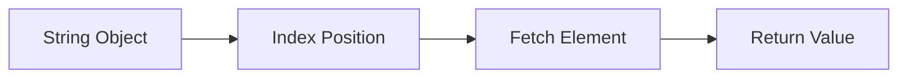
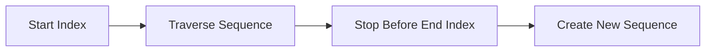
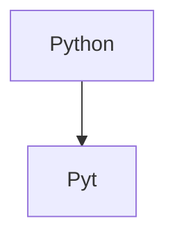

# Indexing & Slicing in Python

## 1. Intuitive Introduction

Strings, lists, tuples, and many Python data structures store data in sequence form.

Example:

```python
name = "Akshit"
```

Internally:

| Position | Character |
| -------- | --------- |
| 0        | A         |
| 1        | k         |
| 2        | s         |
| 3        | h         |
| 4        | i         |
| 5        | t         |

Sometimes you need:

* one specific item
* a range of items
* reverse data
* skip items
* extract patterns

That is exactly why **indexing** and **slicing** exist.

Without them:

* data extraction becomes painful
* ML preprocessing becomes harder
* text processing becomes slow
* dataset manipulation becomes messy

This is one of the MOST used concepts in:

* Python
* Data Science
* Machine Learning
* Backend Engineering
* APIs
* NLP
* Pandas
* NumPy

---

# 2. Real World Analogy

Imagine a train.

```text
[A][B][C][D][E]
```

Each coach has a number.

```text
 0  1  2  3  4
```

If you want only one coach:

→ indexing

If you want multiple coaches:

→ slicing

---

# 3. Core Theory

---

# What is Indexing?

Indexing means:

> accessing a single element using its position

Example:

```python
word = "Python"

print(word[0])
```

Output:

```python
P
```

---

# What is Slicing?

Slicing means:

> extracting a portion of a sequence

Example:

```python
word = "Python"

print(word[0:4])
```

Output:

```python
Pyth
```

---

# Python Sequence Types Supporting Indexing/Slicing

| Type          | Supports |
| ------------- | -------- |
| String        | ✅        |
| List          | ✅        |
| Tuple         | ✅        |
| NumPy Array   | ✅        |
| Pandas Series | ✅        |

---

# Internal Working

Python sequences internally store:

* ordered elements
* memory references
* positional access mapping

When you do:

```python
name[2]
```

Python:

1. locates sequence object
2. jumps to index position
3. returns object reference

Very fast operation.

Time Complexity:

| Operation | Complexity |
| --------- | ---------- |
| Indexing  | O(1)       |
| Slicing   | O(k)       |

Why slicing is slower:

Because Python creates a NEW object.

---

# 4. Visual Explanation

## Indexing Flow



---

# Positive Indexing

```python
word = "PYTHON"
```

```text
 P  Y  T  H  O  N
 0  1  2  3  4  5
```

---

# Negative Indexing

Python also supports reverse indexing.

```text
 P  Y  T  H  O  N
-6 -5 -4 -3 -2 -1
```

Useful when:

* accessing last element
* file extensions
* recent records
* stack operations

---

# Slicing Flow



---

# 5. Syntax Breakdown

# Basic Indexing

```python
name = "Akshit"

print(name[0])
```

Line-by-line:

```python
name = "Akshit"
```

Creates string object.

---

```python
name[0]
```

Access character at position 0.

---

```python
print(name[0])
```

Displays:

```python
A
```

---

# Negative Indexing

```python
name = "Akshit"

print(name[-1])
```

Output:

```python
t
```

Python starts counting from end.

---

# Basic Slicing

```python
word = "Python"

print(word[0:4])
```

Output:

```python
Pyth
```

IMPORTANT:

End index is EXCLUDED.

---

# Slice Syntax

```python
sequence[start:end:step]
```

| Part  | Meaning        |
| ----- | -------------- |
| start | where to begin |
| end   | where to stop  |
| step  | jump size      |

---

# Examples

---

## Example 1

```python
text = "MachineLearning"

print(text[0:7])
```

Output:

```python
Machine
```

---

## Example 2

```python
text = "MachineLearning"

print(text[:7])
```

If start omitted:

Python assumes 0.

---

## Example 3

```python
text = "MachineLearning"

print(text[7:])
```

If end omitted:

Python goes till end.

---

## Example 4

```python
text = "Python"

print(text[::2])
```

Output:

```python
Pto
```

Step = 2

Skips every second character.

---

## Example 5 (Reverse String)

```python
text = "Python"

print(text[::-1])
```

Output:

```python
nohtyP
```

This is VERY famous interview question.

---

# 6. Memory + Internal Working

# Strings are Immutable

```python
name = "Python"
```

You cannot do:

```python
name[0] = "J"
```

ERROR.

Because strings are immutable.

Python creates new objects instead.

---

# Slicing Creates New Object

```python
a = "Python"
b = a[0:3]
```

Memory behavior:



New object created.

This matters in:

* large datasets
* NLP pipelines
* big text processing

Too much slicing = memory overhead.

---

# Lists vs Strings

Lists are mutable.

```python
nums = [1, 2, 3]

nums[0] = 100
```

Allowed.

---

# 7. Practical Coding Examples

# Beginner Example

```python
name = "Akshit"

# First character
print(name[0])

# Last character
print(name[-1])
```

---

# Intermediate Example

```python
email = "user@gmail.com"

# Extract domain
domain = email[email.index("@") + 1:]

print(domain)
```

Output:

```python
gmail.com
```

Real-world backend usage.

---

# Production Example

## Extract File Extension

```python
filename = "model_weights.pkl"

extension = filename[-3:]

print(extension)
```

Used in:

* ML model loading
* APIs
* file validation

---

# Advanced Example

## Reverse Words

```python
sentence = "Machine Learning"

# Reverse entire string
print(sentence[::-1])
```

---

# 8. Industry Engineering Mindset

Professionals use slicing everywhere:

| Area          | Usage             |
| ------------- | ----------------- |
| NLP           | token extraction  |
| APIs          | URL parsing       |
| Data Science  | row selection     |
| Pandas        | dataframe slicing |
| NumPy         | tensor slicing    |
| Cybersecurity | packet parsing    |
| Backend       | log processing    |

---

# What Beginners Do Wrong

## Mistake 1

Confusing end index.

```python
text[0:4]
```

Does NOT include 4.

---

## Mistake 2

Using invalid index.

```python
text[100]
```

Causes:

```python
IndexError
```

---

## Mistake 3

Forgetting immutability.

Strings cannot be modified directly.

---

# 9. ML & Data Science Connection

VERY IMPORTANT.

---

# NumPy Slicing

```python
import numpy as np

arr = np.array([10, 20, 30, 40, 50])

print(arr[1:4])
```

Used heavily in:

* feature selection
* dataset batching
* tensor operations

---

# Pandas Slicing

```python
import pandas as pd

data = pd.Series([100, 200, 300, 400])

print(data[1:3])
```

Used in:

* EDA
* preprocessing
* filtering

---

# Deep Learning

Tensor slicing is everywhere:

```python
batch = images[0:32]
```

Extract batch for training.

---

# 10. Common Mistakes

| Mistake                   | Problem      |
| ------------------------- | ------------ |
| wrong end index           | missing data |
| invalid index             | crashes      |
| huge slicing              | memory waste |
| modifying strings         | TypeError    |
| forgetting negative index | logic bugs   |

---

# 11. Performance Considerations

# Indexing

```python
text[5]
```

Complexity:

```text
O(1)
```

Very fast.

---

# Slicing

```python
text[0:5000]
```

Complexity:

```text
O(k)
```

Because new object creation happens.

---

# Optimization Tip

Avoid repeated slicing inside loops.

BAD:

```python
for i in range(len(text)):
    print(text[:i])
```

Creates many new objects.

---

# Better Approach

Use indices intelligently.

---

# 12. Debugging Mindset

When debugging slicing:

Always check:

```python
print(start, end)
```

Print lengths:

```python
print(len(text))
```

Trace indices carefully.

---

# Debug Example

```python
text = "Python"

print(text[0:10])
```

No error.

Python safely stops at end.

But:

```python
print(text[10])
```

Raises error.

Important distinction.

---

# 13. Interview Preparation

# Beginner Questions

---

## Q1

What is indexing?

### Answer

Accessing a single element using position.

---

## Q2

Difference between indexing and slicing?

### Answer

| Indexing        | Slicing          |
| --------------- | ---------------- |
| single item     | multiple items   |
| returns element | returns sequence |

---

## Q3

What is negative indexing?

### Answer

Accessing elements from end.

---

# Intermediate Questions

---

## Q4

Output?

```python
text = "Python"

print(text[1:5])
```

Answer:

```python
ytho
```

---

## Q5

Output?

```python
text = "Python"

print(text[::-1])
```

Answer:

```python
nohtyP
```

---

## Q6

Why is slicing slower than indexing?

### Answer

Because slicing creates new object.

---

# Advanced Questions

---

## Q7

Time complexity of indexing?

Answer:

```text
O(1)
```

---

## Q8

Time complexity of slicing?

Answer:

```text
O(k)
```

---

## Q9

Why are strings immutable?

### Interviewer Wants

Understanding of:

* memory optimization
* hashability
* thread safety

---

## Q10

Difference between shallow copy and slicing copy in lists?

Example:

```python
a = [1, 2, 3]
b = a[:]
```

Creates shallow copy.

---

# FAANG-Level Thinking

Interviewers test:

* boundary handling
* reverse logic
* memory understanding
* complexity analysis
* edge cases

---

# 14. Advanced Concepts

# Slice Object

Python internally creates slice objects.

```python
s = slice(0, 5)

text = "Machine"

print(text[s])
```

Output:

```python
Machi
```

---

# Extended Slicing

```python
nums = [1,2,3,4,5,6]

print(nums[::2])
```

Output:

```python
[1,3,5]
```

---

# Multi-dimensional Slicing

Used heavily in ML.

```python
matrix[row_start:row_end, col_start:col_end]
```

Very important in NumPy.

---

# 15. Mini Project

# Mini Task: Email Parser

Build:

```python
Input:
john123@gmail.com
```

Extract:

* username
* domain
* company name

Expected Output:

```python
Username: john123
Domain: gmail.com
Company: gmail
```

Skills improved:

* indexing
* slicing
* string methods
* debugging

---

# 16. Best Practices

| Practice                                | Why               |
| --------------------------------------- | ----------------- |
| use meaningful indices                  | readability       |
| avoid magic numbers                     | maintainability   |
| validate lengths                        | prevent crashes   |
| use slicing carefully                   | memory efficiency |
| prefer negative indexing for end access | cleaner code      |

---

# 17. Summary Table

| Concept           | Purpose            | Industry Usage       |
| ----------------- | ------------------ | -------------------- |
| Indexing          | single item access | parsing              |
| Slicing           | partial extraction | preprocessing        |
| Negative Indexing | reverse access     | stack systems        |
| Step Slicing      | skipping elements  | signal/data sampling |
| Reverse Slicing   | reversing data     | NLP/text processing  |

---

# 18. Key Takeaways

* Indexing accesses ONE element.
* Slicing extracts MULTIPLE elements.
* End index is excluded.
* Negative indexing starts from end.
* Slicing creates new objects.
* Indexing is O(1).
* Slicing is O(k).
* Tensor slicing is foundational in ML/AI.
* Understanding slicing deeply helps in:

  * NumPy
  * Pandas
  * Deep Learning
  * NLP
  * APIs
  * Backend Engineering

---