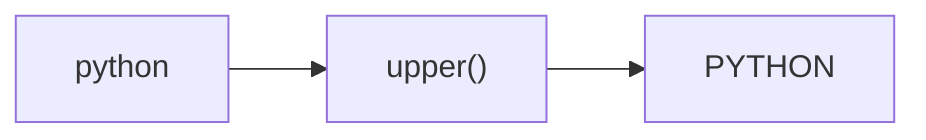
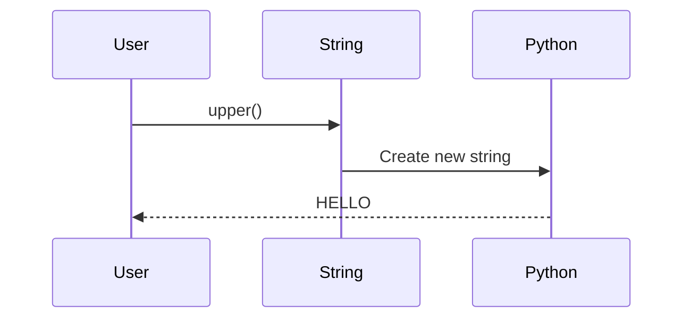
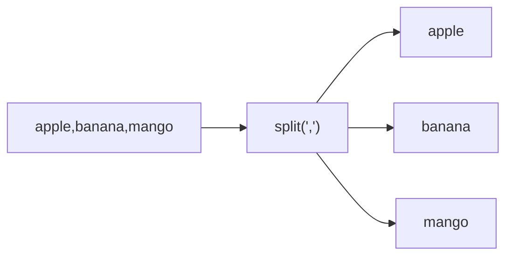
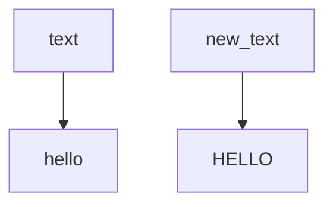
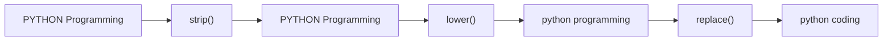

# String Methods in Python

## 1. Intuitive Introduction

A string is a sequence of characters.

```python
name = "Akshit"
```

But real-world applications rarely use strings exactly as users enter them.

Users may type:

```python
"  AKSHIT "
"akshit"
"AkShIt"
```

Before storing, searching, validating, or processing text, we usually need to **clean**, **modify**, **split**, **format**, or **analyze** strings.

This is why Python provides **String Methods**.

String methods are built-in tools attached to every string object.

Think of them as ready-made text-processing machines.

---

# 2. Real World Analogy

Imagine a document editor.

You can:

* convert text to uppercase
* convert text to lowercase
* find words
* replace words
* remove spaces
* split paragraphs

String methods do the same thing programmatically.

```python
text = "hello"

text.upper()
```

Becomes:

```python
HELLO
```

---

# 3. Core Theory

## Important Rule

Strings are **immutable**.

Meaning:

Once created, a string cannot be changed directly.

```python
name = "python"
```

This is impossible:

```python
name[0] = "P"
```

Output:

```python
TypeError
```

Instead, methods create a **new string**.

```python
name = "python"

new_name = name.upper()
```

Memory:



Original string remains unchanged.

---

# 4. Internal Working

Example:

```python
text = "hello"

result = text.upper()
```

Internally:



Python:

1. Reads each character
2. Converts it
3. Creates a new string
4. Returns new object

---

# 5. Most Important String Methods

---

## upper()

Converts everything to uppercase.

```python
text = "python"

print(text.upper())
```

Output:

```python
PYTHON
```

Used in:

* login systems
* case-insensitive comparisons
* data cleaning

---

## lower()

Converts everything to lowercase.

```python
text = "PYTHON"

print(text.lower())
```

Output:

```python
python
```

---

## title()

Capitalize each word.

```python
name = "akshit sonani"

print(name.title())
```

Output:

```python
Akshit Sonani
```

---

## capitalize()

Only first character becomes uppercase.

```python
text = "python is awesome"

print(text.capitalize())
```

Output:

```python
Python is awesome
```

---

## strip()

Removes spaces from both ends.

```python
text = "   hello   "

print(text.strip())
```

Output:

```python
hello
```

---

### lstrip()

Left spaces removed.

```python
text = "   hello"

print(text.lstrip())
```

---

### rstrip()

Right spaces removed.

```python
text = "hello   "

print(text.rstrip())
```

---

## replace()

Replace text.

```python
text = "I love Java"

print(text.replace("Java", "Python"))
```

Output:

```python
I love Python
```

---

## find()

Returns index of first occurrence.

```python
text = "machine learning"

print(text.find("learning"))
```

Output:

```python
8
```

If not found:

```python
-1
```

---

## count()

Counts occurrences.

```python
text = "banana"

print(text.count("a"))
```

Output:

```python
3
```

---

## startswith()

```python
email = "admin@gmail.com"

print(email.startswith("admin"))
```

Output:

```python
True
```

---

## endswith()

```python
file = "data.csv"

print(file.endswith(".csv"))
```

Output:

```python
True
```

---

## split()

Break string into list.

```python
text = "apple,banana,mango"

print(text.split(","))
```

Output:

```python
['apple', 'banana', 'mango']
```

Visualization:



---

## join()

Opposite of split.

```python
fruits = ["apple", "banana", "mango"]

result = "-".join(fruits)

print(result)
```

Output:

```python
apple-banana-mango
```

---

## isalpha()

Checks letters only.

```python
print("Python".isalpha())
```

Output:

```python
True
```

---

## isdigit()

Checks digits only.

```python
print("12345".isdigit())
```

Output:

```python
True
```

---

## isalnum()

Letters + numbers.

```python
print("Python123".isalnum())
```

Output:

```python
True
```

---

## islower()

```python
print("python".islower())
```

Output:

```python
True
```

---

## isupper()

```python
print("PYTHON".isupper())
```

Output:

```python
True
```

---

# 6. Memory Behavior

Example:

```python
text = "hello"

new_text = text.upper()
```

Memory:



Two different objects exist.

Original string still remains.

---

# 7. Practical Examples

## Example 1: Username Cleaning

```python
username = "   Akshit   "

clean_username = username.strip().lower()

print(clean_username)
```

Output:

```python
akshit
```

Industry Use:

* Login systems
* Registration forms

---

## Example 2: Email Validation

```python
email = "student@gmail.com"

if email.endswith("@gmail.com"):
    print("Valid Gmail")
```

---

## Example 3: Word Counter

```python
sentence = "AI will transform the world"

words = sentence.split()

print(len(words))
```

Output:

```python
5
```

---

# 8. Industry Engineering Mindset

Professionals use string methods everywhere:

### Data Cleaning

```python
df["name"] = df["name"].str.strip()
```

### Search Systems

```python
query.lower()
```

### Log Processing

```python
line.split(",")
```

### NLP

```python
text.lower()
text.replace()
text.split()
```

---

# 9. ML & Data Science Connection

Before training ML models:

Raw data:

```python
"  PYTHON "
"python"
"Python"
```

Cleaned:

```python
python
python
python
```

Common preprocessing:

```python
text.lower()
text.strip()
text.replace()
text.split()
```

Used in:

* NLP
* Chatbots
* Sentiment Analysis
* LLM preprocessing
* Data pipelines

Your chatbot project heavily depends on these methods.

Example:

```python
sentence.lower()
```

helps match user input with intents.

---

# 10. Common Mistakes

## Mistake 1

```python
text = "hello"

text.upper()

print(text)
```

Output:

```python
hello
```

Why?

Because strings are immutable.

Correct:

```python
text = text.upper()
```

---

## Mistake 2

```python
text.find("xyz")
```

Returns:

```python
-1
```

Many beginners expect an error.

---

## Mistake 3

```python
"123".isdigit()
```

Returns:

```python
True
```

But:

```python
"123.45".isdigit()
```

Returns:

```python
False
```

Because `.` is not a digit.

---

# 11. Performance Considerations

| Method    | Complexity |
| --------- | ---------- |
| upper()   | O(n)       |
| lower()   | O(n)       |
| replace() | O(n)       |
| count()   | O(n)       |
| split()   | O(n)       |
| strip()   | O(n)       |

Where:

```python
n = length of string
```

For large datasets:

```python
for text in millions_of_rows:
    text.lower()
```

can become expensive.

Data scientists often use vectorized Pandas string operations.

---

# 12. Debugging Mindset

Suppose:

```python
username = " Akshit "

if username == "Akshit":
    print("Matched")
```

No output.

Debug:

```python
print(repr(username))
```

Output:

```python
' Akshit '
```

Hidden spaces detected.

Fix:

```python
username = username.strip()
```

---

# 13. Interview Questions

## Beginner

### Q1

Difference between:

```python
upper()
lower()
```

### Q2

Why are strings immutable?

### Q3

Output?

```python
"python".upper()
```

### Q4

Difference:

```python
split()
join()
```

### Q5

What does find() return if not found?

Answer:

```python
-1
```

---

## Intermediate

### Q6

Output?

```python
text = "banana"
print(text.count("a"))
```

Answer:

```python
3
```

---

### Q7

Difference:

```python
isalpha()
isalnum()
isdigit()
```

---

### Q8

Which method removes spaces?

Answer:

```python
strip()
```

---

## Advanced

### Q9

Why is this wrong?

```python
text.upper()
print(text)
```

---

### Q10

Time complexity of:

```python
replace()
split()
lower()
```

Answer:

```python
O(n)
```

---

# 14. Advanced Concepts

## Method Chaining

Very common in production.

```python
text = "  PYTHON Programming  "

result = text.strip().lower().replace("programming", "coding")

print(result)
```

Output:

```python
python coding
```

---

Visualization:



---

# 15. Mini Project

Build a Text Analyzer.

Requirements:

1. Take sentence input
2. Total characters
3. Total words
4. Convert to uppercase
5. Convert to lowercase
6. Count vowels
7. Count occurrences of a word

Example:

```python
Enter text:
Python is amazing
```

Output:

```python
Characters: 17
Words: 3
Uppercase: PYTHON IS AMAZING
Lowercase: python is amazing
Vowels: 6
```

---

# 16. Best Practices

✅ Use meaningful variable names

```python
user_name
email_address
```

✅ Clean user input

```python
input().strip()
```

✅ Use lower() for comparisons

```python
if answer.lower() == "yes":
```

✅ Use method chaining carefully

```python
text.strip().lower()
```

---

# 17. Summary Table

| Method       | Purpose                | Example       |
| ------------ | ---------------------- | ------------- |
| upper()      | Uppercase              | PYTHON        |
| lower()      | Lowercase              | python        |
| title()      | Capitalize words       | Akshit Sonani |
| capitalize() | First letter uppercase | Python        |
| strip()      | Remove spaces          | hello         |
| replace()    | Replace text           | Java → Python |
| find()       | Search text            | index         |
| count()      | Count occurrences      | 3             |
| split()      | String → List          | ['a','b']     |
| join()       | List → String          | a-b           |
| startswith() | Prefix check           | True          |
| endswith()   | Suffix check           | True          |
| isalpha()    | Letters only           | True          |
| isdigit()    | Digits only            | True          |
| isalnum()    | Letters + numbers      | True          |

---

# 18. Key Takeaways

1. String methods are built-in text-processing tools.
2. Strings are **immutable**.
3. Methods return **new strings**, not modify existing ones.
4. Most-used methods in industry:

   * `lower()`
   * `upper()`
   * `strip()`
   * `replace()`
   * `split()`
   * `join()`
5. String methods are heavily used in:

   * Data Science
   * Machine Learning
   * Chatbots
   * NLP
   * Backend APIs
   * Data Cleaning Pipelines