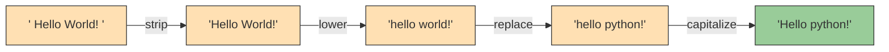
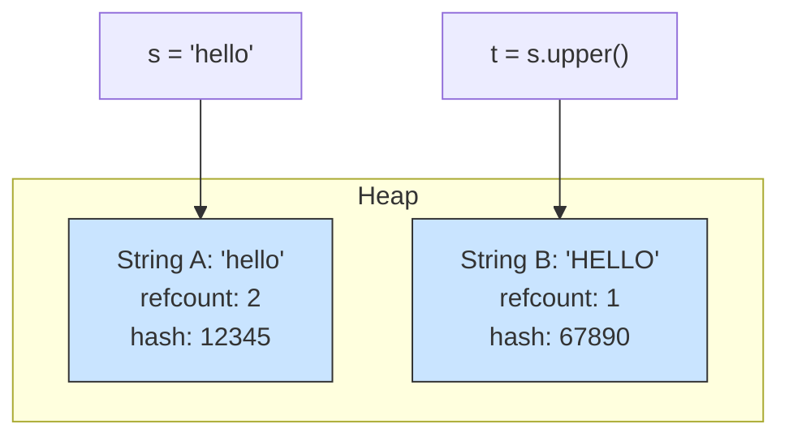

# Python String Methods: Mastering Text Transformation

## 1. Intuitive Introduction

Think of a string as a **block of clay** that you can shape, cut, combine, and polish – but every time you touch it, you create a brand‑new block. String methods are the **tools** in your workshop: `upper()` is like a stamp that makes every letter uppercase, `strip()` is a knife that shaves off extra spaces from the edges, `replace()` is like swapping one type of pebble for another throughout the block.

**Why do string methods exist?**  
Raw text almost never comes in the format you need. User input has extra spaces, log files contain inconsistent capitalization, CSV data uses different delimiters. String methods give you a clean, readable vocabulary to reshape text without writing low‑level loops.

**Real‑world examples:**
- **Student:** Validating a username – `username.isalnum()` checks if only letters/numbers.
- **Web dev:** Normalizing email addresses – `email.lower().strip()` before storing in DB.
- **Data science:** Cleaning tweets – `tweet.replace("RT ", "").split()` to remove retweet markers.
- **DevOps:** Parsing `key=value` pairs – `line.split('=', 1)` to separate config entries.

---

## 2. Real‑World Analogy

Imagine a **print shop** that receives a poster design as a long strip of paper (the string). The shop has a set of **machines** (methods):
- **Case‑changer machine** (`upper()`, `lower()`) – turns all letters to uppercase or lowercase.
- **Trimmer machine** (`strip()`) – cuts off blank margins from left and right.
- **Splitter machine** (`split()`) – slices the strip into smaller pieces at every comma or space.
- **Glue machine** (`join()`) – takes many small strips and fuses them into one, inserting a chosen adhesive between them.
- **Find‑and‑replace machine** (`replace()`) – scans the strip and swaps every occurrence of one pattern for another.

Each machine produces an **entirely new strip** – the original poster is never altered. This guarantees that other workers can read the original while you experiment.

---

## 3. Core Theory

String methods are **functions attached to the string object** (called via dot notation: `"hello".upper()`). They never modify the original string (immutability). Instead, they **return a new string** (or sometimes an integer, boolean, or list).

**Key properties of string methods:**
- **Immutable source** – original string stays unchanged.
- **Method chaining** – because each method returns a string, you can chain: `s.strip().lower().replace('a','b')`.
- **Case‑sensitive by default** – `'A'` and `'a'` are different unless you normalise.
- **Unicode‑aware** – they work correctly with accents, emojis, and non‑Latin scripts.

**Categories of methods:**
- **Case conversion** – `upper()`, `lower()`, `swapcase()`, `capitalize()`, `title()`
- **Trimming & padding** – `strip()`, `lstrip()`, `rstrip()`, `center()`, `ljust()`, `rjust()`, `zfill()`
- **Searching & testing** – `find()`, `index()`, `count()`, `startswith()`, `endswith()`, `in` (operator)
- **Boolean checks** – `isalpha()`, `isdigit()`, `isalnum()`, `isspace()`, `isupper()`, `islower()`
- **Splitting & joining** – `split()`, `rsplit()`, `splitlines()`, `partition()`, `join()`
- **Replacing** – `replace()`, `translate()`
- **Formatting** – `format()`, `format_map()`

---

## 4. Visual Explanation – Method Chaining Flow

The following diagram shows how method chaining transforms a string step by step, producing a new string at each stage.



Each method returns a new string, allowing a **pipeline** of transformations.

---

## 5. Memory & Internal Working

When you call a string method, CPython:
1. Reads the original string’s internal array of characters (Unicode code points).
2. Allocates a new `PyUnicodeObject` of the appropriate size.
3. Fills the new array based on the method’s logic (e.g., for `upper()`, it calls the Unicode case‑mapping table).
4. Returns a **new reference** to the newly created string.
5. The original string remains untouched – its reference count may drop, possibly leading to garbage collection later.

**Why no in‑place changes?**  
Strings are immutable by design. If methods modified the original, any other variable referencing the same string would see unexpected changes, breaking hashability (dict keys) and thread safety.

**Memory diagram** – two separate string objects in heap:



`s` and `t` point to different memory regions. No shared mutation.

---

## 6. Creating Strings to Use Methods

Since string methods are called **on** string objects, you first need a string. All creation methods from the previous note apply:

```python
# Different ways to get a string to call methods on
s1 = "   Python   "
s2 = str(3.14)          # "3.14"
s3 = ''.join(['a','b']) # "ab"
s4 = input("Enter text: ")  # user input
s5 = open('file.txt').read()  # from file

# Then call methods
print(s1.strip())       # "Python"
print(s2.isdigit())     # False
```

**Common mistake:** Forgetting that many methods (like `split()`) return a **list**, not a string, so chaining further string methods will fail.

```python
# Wrong
result = "a,b,c".split(',').upper()   # AttributeError: 'list' object has no attribute 'upper'

# Correct – apply upper before split, or after joining
result = "a,b,c".upper().split(',')   # ['A', 'B', 'C']
```

---

## 7. Core Operations / Methods (Detailed)

We’ll explore the most important methods with examples.

### 7.1 Case Conversion

```python
text = "  python IS fun  "

# Remove spaces and convert case
clean = text.strip()
print(clean.lower())      # "python is fun"
print(clean.upper())      # "PYTHON IS FUN"
print(clean.capitalize()) # "Python is fun"  (first word capital, rest lower)
print(clean.title())      # "Python Is Fun"  (every word capitalised)
print(clean.swapcase())   # "PYTHON is FUN"  (inverts case)
```

### 7.2 Trimming & Padding

```python
messy = "  hello  "
print(messy.strip())      # "hello"
print(messy.lstrip())     # "hello  "  (left only)
print(messy.rstrip())     # "  hello"

# Padding to fixed width
num = "42"
print(num.zfill(5))       # "00042"
print(num.rjust(5, '*'))  # "***42"
print(num.ljust(5, '-'))  # "42---"
print(num.center(7, '=')) # "===42==="
```

### 7.3 Searching & Boolean Checks

```python
sentence = "The quick brown fox jumps over the lazy dog."

# Search
print(sentence.find("fox"))     # 16 (index, or -1 if not found)
print(sentence.index("fox"))    # 16 (same but raises ValueError if missing)
print(sentence.count("o"))      # 4
print(sentence.startswith("The"))   # True
print(sentence.endswith("dog."))    # True

# Boolean checks
print("abc123".isalnum())   # True (letters+numbers)
print("123".isdigit())      # True
print("abc".isalpha())      # True
print("   ".isspace())      # True
print("Hello".isupper())    # False
print("hello".islower())    # True
```

### 7.4 Splitting & Joining

```python
data = "apple,banana,grape"
fruits = data.split(',')        # ['apple', 'banana', 'grape']
print(fruits)

# split with max splits
print(data.split(',', 1))       # ['apple', 'banana,grape']

# rsplit (from right)
path = "/home/user/file.txt"
print(path.rsplit('/', 1))      # ['/home/user', 'file.txt']

# partition – splits once into tuple (before, separator, after)
print(data.partition(','))      # ('apple', ',', 'banana,grape')

# join – opposite of split
restored = '-'.join(fruits)     # "apple-banana-grape"
print(restored)
```

### 7.5 Replacing & Translating

```python
quote = "I like cats. Cats are nice."
print(quote.replace("cats", "dogs"))      # "I like dogs. Cats are nice."
print(quote.replace("cats", "dogs", 1))   # only first occurrence

# translate – fast character‑by‑character replacement
trans_table = str.maketrans({'a':'@', 'e':'3'})
print("hello world".translate(trans_table))  # "h3llo world"
```

### 7.6 Formatting (f‑strings are modern, but `.format()` still useful)

```python
# Using .format()
template = "Name: {}, Age: {}"
print(template.format("Alice", 30))   # "Name: Alice, Age: 30"

# Positional and keyword
print("{1} is {0}".format("old", "this"))  # "this is old"
print("{name} = {value}".format(name="x", value=42))
```

---

## 8. Advanced Concepts

### Method Chaining (continued)
Chaining works left to right. Useful for cleaning pipelines:

```python
raw = "  !!  Hello   WORLD  !!  "
cleaned = raw.strip(' !').lower().replace('world', 'python').capitalize()
print(cleaned)  # "Hello python"
```

### Using `splitlines()` for cross‑platform line breaks

```python
multi = "Line1\nLine2\r\nLine3"
print(multi.splitlines())           # ['Line1', 'Line2', 'Line3']
print(multi.splitlines(keepends=True))  # ['Line1\n', 'Line2\r\n', 'Line3']
```

### `str.maketrans()` and `translate()` for bulk replacement

```python
# Remove punctuation from a string
import string
text = "Hello, world! How are you?"
translator = str.maketrans('', '', string.punctuation)
clean_text = text.translate(translator)
print(clean_text)  # "Hello world How are you"
```

### Using `partition()` to safely split on first occurrence

Unlike `split(maxsplit=1)`, `partition()` always returns a 3‑tuple, which is handy for unpacking:

```python
key, sep, value = "user=alice".partition('=')
print(key, value)   # user alice
```

---

## 9. Mathematical / Special Operations

String methods don’t do arithmetic, but some methods have “mathematical” logic:

- `count()` – counts occurrences (like frequency).
- `join()` – analogous to the cartesian product with a separator.
- `zfill()` – numeric‑style zero padding, useful for sorting numbers as strings.

```python
# Sorting string representations of numbers with zfill
nums = ["1", "10", "2"]
nums_sorted = sorted(nums)                       # ['1', '10', '2'] – lexicographic
nums_padded = sorted(n.zfill(2) for n in nums)   # ['01', '02', '10']
```

---

## 10. Real Practical Examples

### Example 1: Cleaning CSV data with inconsistent formatting

```python
raw_data = [
    "  John Doe , 25 , New York",
    "Jane Smith,30 , Chicago  ",
    "  Bob Johnson ,  40 ,  Los Angeles"
]

cleaned_rows = []
for row in raw_data:
    # Split by comma, strip each field, and convert age to int
    fields = [field.strip() for field in row.split(',')]
    name, age_str, city = fields
    age = int(age_str)
    cleaned_rows.append((name, age, city))

print(cleaned_rows[0])  # ('John Doe', 25, 'New York')
```

### Example 2: Building a simple slug generator for URLs

```python
import string

def slugify(text: str) -> str:
    # Convert to lowercase, strip leading/trailing spaces
    text = text.lower().strip()
    # Replace spaces with hyphens
    text = text.replace(' ', '-')
    # Remove punctuation
    translator = str.maketrans('', '', string.punctuation)
    text = text.translate(translator)
    # Collapse multiple hyphens
    while '--' in text:
        text = text.replace('--', '-')
    return text

print(slugify("  Hello, World!  "))      # "hello-world"
print(slugify("Python is   awesome!!"))  # "python-is-awesome"
```

---

## 11. ML & Data Science Connection

String methods are the **first line of defence** in text preprocessing for NLP and ML pipelines.

- **Pandas Series** have a `.str` accessor that vectorizes string methods across entire columns without explicit loops:
  ```python
  import pandas as pd
  df = pd.DataFrame({'text': ["  Hello  ", "WORLD", "Python 3"]})
  df['clean'] = df['text'].str.strip().str.lower()
  print(df['clean'])
  # 0     hello
  # 1     world
  # 2    python 3
  ```

- **Tokenization** – using `split()` or regex via `re` module (which relies on string methods internally).
- **Stopword removal** – joining with `' '.join()` after filtering.
- **Feature extraction** – `str.contains()` in Pandas to create binary flags (e.g., if tweet contains “sale”).
- **Log preprocessing** for training anomaly detection models – cleaning timestamps, error codes using `split()`, `find()`.

---

## 12. Common Mistakes & Pitfalls

| Mistake | Wrong Code | Consequence | Correct Way |
|---------|------------|-------------|--------------|
| Forgetting that methods return new strings | `s = "hi"; s.upper(); print(s)` | Prints `"hi"` unchanged | `s = s.upper()` |
| Chaining after `split()` | `"a,b".split(',').strip()` | `AttributeError` on list | Apply strip before split or after join |
| Using `find()` for membership when index irrelevant | `if s.find('x') != -1:` | Less readable | `if 'x' in s:` |
| Not handling missing substrings with `index()` | `s.index('z')` | `ValueError` | Use `find()` or try/except |
| Assuming `split()` without argument splits on spaces only | `"a  b".split()` vs `"a  b".split(' ')` | First gives `['a','b']` (collapses multiple spaces), second gives `['a','','b']` | Know the difference – usually want default `split()` |
| Using `replace()` in a loop to remove many characters | `for ch in bad: s = s.replace(ch, '')` | O(n*m) and creates many intermediates | Use `translate()` for many replacements |

---

## 13. Performance Considerations

| Operation / Method | Time Complexity | Notes |
|-------------------|----------------|-------|
| `len(s)` | O(1) | Stored attribute |
| `s.upper()` / `.lower()` | O(n) | New string allocated, each character mapped |
| `s.strip()` | O(n) | Scans from both ends, allocates new string |
| `s.split(delim)` | O(n) | Single scan to build list of substrings |
| `delim.join(list)` | O(total length of all strings) | Optimal – pre‑computes total size |
| `s.replace(old, new)` | O(n * (len(new)/len(old))) | Searches and builds new string |
| `s.find(sub)` | O(n * m) worst‑case | Fast in practice due to Two‑Way algorithm |
| `s.count(sub)` | O(n * m) | Similar to find |
| `s.isalpha()` / `.isdigit()` | O(n) | Checks each character until false or end |
| `s.translate(table)` | O(n) | Very fast – direct mapping per character |

**Key performance rule:** For building large strings, prefer `join()` over repeated concatenation. For many single‑character replacements, `translate()` beats a loop of `replace()`.

---

## 14. Interview Questions

### Beginner
1. What does `" hello ".strip()` return?  
   `"hello"`
2. How do you check if a string contains only digits?  
   `"123".isdigit()` → `True`
3. What is the difference between `find()` and `index()`?  
   `find()` returns `-1` if not found; `index()` raises `ValueError`.
4. Write an expression to split a comma‑separated string into a list.  
   `s.split(',')`
5. What does `"abc".upper().isupper()` return?  
   `True` (because `"ABC".isupper()` is `True`)

### Intermediate
1. Explain the output: `"Python".replace("p", "J")` → no change because `p` is lowercase. Correct way?  
   `"Python".lower().replace("p", "J")` or `"Python".replace("P", "J")`.
2. How would you remove all vowels from a string efficiently?  
   Use `str.maketrans` and `translate()`.
3. Given a string `s = "a,b,c,d"`, write code to get `['a', 'b,c,d']`.  
   `s.split(',', 1)`
4. What is the result of `"   ".isspace()`?  
   `True`
5. Write a function that capitalises the first letter of every word in a sentence, but leaves acronyms (all caps) untouched.  
   (Check if word.isupper() – if yes, leave; else word.capitalize())

### Advanced
1. Implement your own `split()` function without using built‑in split, handling multiple spaces correctly.  
   (Loop, accumulate chars, skip delimiters – tests understanding of string scanning.)
2. Why is `"".join(list_of_strings)` faster than `functools.reduce(operator.add, list_of_strings)`?  
   `join` pre‑allocates the exact memory needed; `reduce` with `+` creates many intermediate strings.
3. How does CPython implement `str.replace()` for overlapping patterns?  
   It scans left to right, skips overlapping matches (e.g., "aaa".replace("aa","b") → "ba").
4. Write a generator that yields all palindromic substrings of a given string using only string methods.  
   (Two pointers + slicing comparison.)
5. Explain how `str.translate()` works with a `dict` mapping vs. a table of length 256.  
   Dict mapping works for arbitrary Unicode; the 256‑length table is for bytes/ASCII optimisation.

---

## 15. Mini Project Idea

**Project: Text obfuscator / leet‑speak converter**  
Build a program that reads a plain text string and returns a “leet” version using string methods and translation.

**Features:**
- Replace characters: `a→4`, `e→3`, `i→1`, `o→0`, `t→7`, `s→5`.
- Optionally randomise case (alternating uppercase/lowercase).
- Use `str.maketrans()` for the replacements.
- Add a mode that reverses the string and then applies leet.

**Why it strengthens understanding:**  
You’ll use `translate()`, `join()`, `upper()/lower()`, slicing `[::-1]`, and method chaining – all while creating something fun.

```python
# Starter code
def to_leet(text: str) -> str:
    leet_map = str.maketrans({
        'a': '4', 'e': '3', 'i': '1', 'o': '0', 't': '7', 's': '5'
    })
    return text.lower().translate(leet_map)

print(to_leet("Python is fun"))  # "py7h0n 1s fun"
```

---

## 16. Best Practices

1. **Prefer f‑strings over `.format()`** for simple formatting – faster and cleaner.
2. **Use `in` operator for membership** instead of `find() != -1`.
3. **Chain methods for readability** but keep the chain short (max 3–4 transformations) unless documented.
4. **Use `str.join()` for concatenation** – never `+` in a loop.
5. **Use `str.translate()` for bulk character removal/replacement** – it’s the fastest method.
6. **Remember that `split()` with no arguments splits on **any** whitespace** and collapses consecutive whitespace; use `split(' ')` if you need explicit space‑only splitting.
7. **Normalise case before comparison** – `if user_input.lower() == "yes":`

---

## 17. Summary Table

| Method Category | Key Methods | Purpose | Real‑world Use |
|----------------|-------------|---------|----------------|
| Case conversion | `upper()`, `lower()`, `title()` | Standardise text | Login, search, sorting |
| Trimming | `strip()`, `lstrip()`, `rstrip()` | Remove unwanted spaces | Form input, file parsing |
| Splitting | `split()`, `rsplit()`, `partition()` | Parse structured text | CSV, logs, config files |
| Joining | `join()` | Build strings from parts | SQL queries, URL building |
| Searching | `find()`, `index()`, `count()` | Locate substrings | Keyword extraction |
| Boolean checks | `isalpha()`, `isdigit()`, `isspace()` | Validate content | Form validation |
| Replacement | `replace()`, `translate()` | Modify text | Data cleaning, censoring |
| Formatting | `format()`, f‑strings | Dynamic text | Templates, reports |

---

## 18. Key Takeaways

- 🛠️ String methods **never modify the original** – always return a new string or other type.
- 🔗 **Method chaining** allows elegant pipelines: `s.strip().lower().replace(...)`.
- ⚡ For bulk character replacement, `translate()` is king – much faster than looped `replace()`.
- 🧩 Use `partition()` when you need to split on the first occurrence and keep the separator.
- 🧼 Clean user input with `strip()` + `lower()` before storage or comparison.
- 📊 In data science, Pandas `.str` accessor brings all these methods to entire DataFrame columns.
- 🚫 Never use `+` in a loop to build strings – always `join()`.
- 🧪 Master `split()` and `join()` – they are the workhorses of text processing.

---