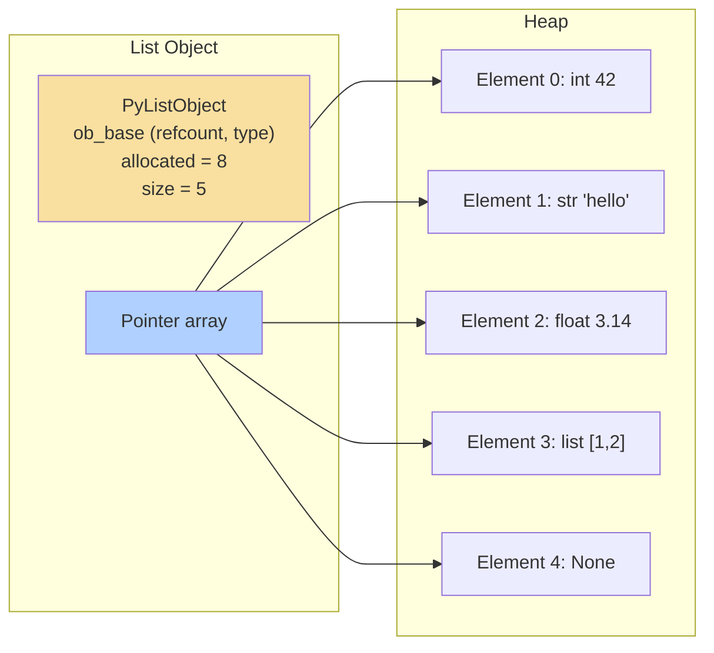
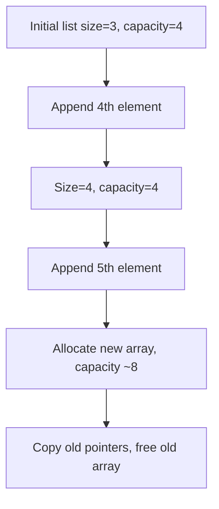

# Python Lists: The Versatile Dynamic Array

## 1. Intuitive Introduction

Imagine you are planning a road trip. You write down a **list** of cities to visit – in order. Throughout the journey, you might:
- **Add** a new stop (append).
- **Remove** a city you skip (delete).
- **Change** the order (sort).
- **Look up** what’s next at a specific position (index).

Python’s `list` is exactly that – an **ordered, mutable, dynamic collection** that can hold any mix of data types (numbers, strings, even other lists). Unlike strings (immutable), lists are designed for **change**: you can grow, shrink, or modify them without creating new objects each time.

**Why lists exist:**  
Real‑world data is rarely static. You need a container that can hold a sequence of items and support efficient insertion, deletion, and access. Lists provide that with a simple, flexible syntax.

**Where lists are used in real software:**
- **Student project:** Store grades, then compute average.
- **Web dev:** Keep a list of active user sessions; add/remove as they log in/out.
- **Data science:** Hold a batch of file paths, then process each.
- **ML engineering:** Manage a list of hyperparameter combinations to test.

---

## 2. Real‑World Analogy

Think of a **whiteboard with magnetic strips**. Each strip can hold any note (a number, a word, a drawing). You can:
- Place a strip at any position (**index assignment**).
- Add a new strip at the end (**append**).
- Insert a strip somewhere in the middle (**insert**).
- Remove a strip completely (**delete**).
- Slide strips around (**sort**, **reverse**).
- Erase all strips (**clear**).

The whiteboard itself is the **list object** – it keeps the strips in a specific order. You can have duplicate notes, and you can mix note types. The board can grow as you add more strips; it’s not fixed in size.

---

## 3. Core Theory

A **list** is a **mutable, ordered, heterogeneous, dynamic** collection of objects.  
Key properties:

- **Ordered** – elements have a defined position (index starting at 0).
- **Mutable** – you can change, add, or remove elements in‑place.
- **Heterogeneous** – can contain different types: `[1, "hello", 3.14, [2,3]]`.
- **Dynamic** – size can change automatically (no fixed capacity).
- **Indexable & slicable** – supports all indexing/slicing operations.
- **Iterable** – can be used in loops.
- **Allows duplicates** – multiple same values are fine.

```python
# Demonstrating properties
lst = [10, "Python", 3.14, True]
print(lst[1])        # 'Python' – ordered & indexable
lst[2] = 2.71        # mutable
print(lst)           # [10, 'Python', 2.71, True]
lst.append(100)      # dynamic
print(lst)           # [10, 'Python', 2.71, True, 100]
lst.append("hello")  # heterogeneous – no problem
print(len(lst))      # 6
```

---

## 4. Visual Explanation – List as Dynamic Array



The list stores **references** to objects, not the objects themselves. This makes lists memory‑efficient for large objects.

---

## 5. Memory & Internal Working (CPython)

CPython implements lists as **dynamic arrays** of pointers (`PyObject*`). The `PyListObject` structure (in `listobject.h`) contains:

- `ob_base` – standard object header (reference count, type pointer).
- `ob_size` – current number of elements (length).
- `allocated` – total capacity of the underlying array (≥ `ob_size`).

**Growth strategy:**  
When appending and the array is full, CPython **over‑allocates** to amortise future appends. The formula roughly:
- New `allocated` = `(ob_size >> 3) + (ob_size < 9 ? 3 : 6) + ob_size`
- This results in ~12.5% over‑allocation, giving **amortised O(1)** for append.

**Shrinkage:**  
When you `pop()` the last element, the capacity doesn’t shrink immediately. `clear()` sets `ob_size=0` but may keep the allocated memory (for future reuse). Use `del lst[:]` or `lst.clear()`.

**Memory diagram after append:**



This resizing is **expensive** (O(n) copy) but happens rarely, making overall appends cheap.

---

## 6. Creating Lists

### All possible creation ways

```python
# 1. Literal (most common)
empty = []
nums = [1, 2, 3]
mixed = [1, "two", 3.0]

# 2. list() constructor
from_str = list("abc")      # ['a','b','c']
from_tuple = list((1,2,3))  # [1,2,3]
from_range = list(range(5)) # [0,1,2,3,4]

# 3. List comprehension
squares = [x**2 for x in range(1,6)]  # [1,4,9,16,25]

# 4. Using multiplication (repetition)
zeros = [0] * 5              # [0,0,0,0,0]
matrix = [[0]*3 for _ in range(2)]  # [[0,0,0],[0,0,0]] – careful with nested!

# 5. Splitting a string
words = "hello world".split()  # ['hello','world']

# 6. Unpacking / star expressions (Python 3.5+)
combined = [1,2] + [3,4]       # [1,2,3,4]
```

### Common mistakes

```python
# Mistake 1: Using * for nested lists – creates shared references
bad_matrix = [[0]*3]*2
bad_matrix[0][0] = 99
print(bad_matrix)   # [[99,0,0], [99,0,0]] – both rows same inner list!

# Correct:
good_matrix = [[0]*3 for _ in range(2)]

# Mistake 2: Forgetting that list() needs an iterable
# list(123)   # TypeError
list(str(123))  # ['1','2','3']

# Mistake 3: Assuming list.copy() is deep
original = [[1,2], [3,4]]
shallow = original.copy()
shallow[0][0] = 99
print(original)   # [[99,2], [3,4]] – changed! Use copy.deepcopy()
```

---

## 7. Core Operations / Methods

| Operation / Method | Syntax | Example | Output | Explanation | When to use |
|-------------------|--------|---------|--------|-------------|-------------|
| Append | `lst.append(x)` | `[1,2].append(3)` | `[1,2,3]` | Adds to end | Building list incrementally |
| Extend | `lst.extend(iterable)` | `[1,2].extend([3,4])` | `[1,2,3,4]` | Adds multiple elements | Merging lists |
| Insert | `lst.insert(i, x)` | `[1,3].insert(1,2)` | `[1,2,3]` | Insert at index | Adding at specific position |
| Remove | `lst.remove(x)` | `[1,2,3].remove(2)` | `[1,3]` | Removes first occurrence | Deleting by value |
| Pop | `lst.pop(i=-1)` | `[1,2,3].pop(1)` | returns `2`, list `[1,3]` | Removes by index (default last) | Stack/LIFO, remove by index |
| Index | `lst.index(x)` | `['a','b'].index('b')` | `1` | Returns first index of value | Find position |
| Count | `lst.count(x)` | `[1,2,1].count(1)` | `2` | Count occurrences | Frequency |
| Sort | `lst.sort()` | `[3,1,2].sort()` | `[1,2,3]` | In‑place sort | Ordering |
| Reverse | `lst.reverse()` | `[1,2,3].reverse()` | `[3,2,1]` | In‑place reversal | Reverse order |
| Clear | `lst.clear()` | `[1,2].clear()` | `[]` | Removes all elements | Reset list |
| Copy | `lst.copy()` | `[1,2].copy()` | `[1,2]` | Shallow copy | Avoid mutating original |

```python
# Demonstration
tasks = ["code", "test", "deploy"]
tasks.append("monitor")
print(tasks)                # ['code', 'test', 'deploy', 'monitor']

tasks.insert(1, "review")
print(tasks)                # ['code', 'review', 'test', 'deploy', 'monitor']

done = tasks.pop()          # 'monitor'
print(tasks)                # ['code', 'review', 'test', 'deploy']

tasks.remove("review")
print(tasks)                # ['code', 'test', 'deploy']

tasks.sort()
print(tasks)                # ['code', 'deploy', 'test']

print(tasks.index("deploy")) # 1
```

---

## 8. Advanced Concepts

### List slicing (as learned earlier)
```python
nums = [0,1,2,3,4,5]
print(nums[1:4])      # [1,2,3]
print(nums[::2])      # [0,2,4]
print(nums[::-1])     # [5,4,3,2,1,0]
```

### Slice assignment (powerful mutation)
```python
lst = [1,2,3,4,5]
lst[1:4] = [20,30]    # replace indices 1,2,3 with two items
print(lst)            # [1,20,30,5]
lst[2:2] = [25,26]    # insert at position 2
print(lst)            # [1,20,25,26,30,5]
lst[::2] = [10,20,30] # replace every second element (must match length)
print(lst)            # [10,20,20,26,30,5]? Wait careful – need equal number.
```

### List comprehensions (fast, Pythonic)
```python
# Squares of even numbers
evens_sq = [x**2 for x in range(10) if x % 2 == 0]  # [0,4,16,36,64]

# Nested comprehension (flatten matrix)
matrix = [[1,2],[3,4]]
flat = [num for row in matrix for num in row]  # [1,2,3,4]
```

### Packing & unpacking
```python
a, b, c = [1,2,3]        # a=1,b=2,c=3
first, *rest = [10,20,30,40]  # first=10, rest=[20,30,40]
*head, last = [1,2,3]         # head=[1,2], last=3
```

### Nested lists (matrices, JSON‑like structures)
```python
matrix = [[1,2,3],[4,5,6],[7,8,9]]
print(matrix[1][2])   # 6
# Transpose
transpose = [[row[i] for row in matrix] for i in range(3)]
```

### Using `enumerate()` to get indices while iterating
```python
fruits = ["apple", "banana", "cherry"]
for i, fruit in enumerate(fruits):
    print(f"{i}: {fruit}")
```

### `zip()` – combine multiple lists
```python
names = ["Alice", "Bob"]
scores = [95, 87]
combined = list(zip(names, scores))  # [('Alice',95), ('Bob',87)]
```

---

## 9. Mathematical / Special Operations

Lists support **concatenation (`+`)** and **repetition (`*`)** like strings, but these create **new lists** (shallow copies).

| Operation | Example | Result | Complexity |
|-----------|---------|--------|------------|
| Concatenation | `[1,2] + [3,4]` | `[1,2,3,4]` | O(n+m) |
| Repetition | `[0]*5` | `[0,0,0,0,0]` | O(n*k) |
| `in` / `not in` | `2 in [1,2,3]` | `True` | O(n) (linear search) |
| `len()` | `len([1,2,3])` | `3` | O(1) |
| `min()` / `max()` | `min([3,1,2])` | `1` | O(n) |
| `sum()` (numeric) | `sum([1,2,3])` | `6` | O(n) |

No element‑wise arithmetic (use NumPy for that).

---

## 10. Real Practical Examples

### Example 1: Task manager (adding, removing, prioritising)

```python
class TaskManager:
    def __init__(self):
        self.tasks = []
    
    def add(self, task, priority=0):
        """Insert task at position priority (0 highest)"""
        self.tasks.insert(priority, task)
    
    def complete(self):
        """Remove and return highest priority task"""
        return self.tasks.pop(0) if self.tasks else None
    
    def list_all(self):
        return self.tasks.copy()

tm = TaskManager()
tm.add("Write report", 0)
tm.add("Check email", 1)
tm.add("Fix bug", 0)   # becomes highest
print(tm.list_all())   # ['Fix bug', 'Write report', 'Check email']
print(tm.complete())   # 'Fix bug'
```

### Example 2: Batch processing with pagination

```python
def process_in_batches(data, batch_size):
    results = []
    for i in range(0, len(data), batch_size):
        batch = data[i:i+batch_size]
        # simulate processing
        processed = [x * 2 for x in batch]
        results.extend(processed)
    return results

data = list(range(1, 11))
print(process_in_batches(data, 3))  # [2,4,6, 8,10,12, 14,16,18, 20]
```

---

## 11. ML & Data Science Connection

While NumPy arrays are preferred for numeric computations, Python lists are used as **building blocks** everywhere.

- **Data loading:** Reading CSV rows into list of dicts or list of lists.
- **Hyperparameter grids:** List of parameter combinations for grid search.
- **Batch generators:** List of file paths, yield batches as slices.
- **Scikit‑learn:** Many functions accept lists as inputs (e.g., `fit(X, y)` where X is list of lists).
- **TensorFlow / PyTorch:** Convert lists to tensors: `torch.tensor([1,2,3])`.
- **Pandas:** Creating Series/DataFrames from lists: `pd.Series([1,2,3])`.

```python
# Example: preparing dataset from lists
features = [[25, 50000], [30, 60000], [22, 45000]]
labels = [0, 1, 0]

# Convert to NumPy for ML
import numpy as np
X = np.array(features)
y = np.array(labels)

# Train/test split manually using slicing
split_idx = int(0.8 * len(X))
X_train, X_test = X[:split_idx], X[split_idx:]
```

---

## 12. Common Mistakes & Pitfalls

| Mistake | Wrong code | Consequence | Correct way |
|---------|------------|-------------|--------------|
| Using `*` for nested lists | `[[0]*3]*2` | Shared inner list, modifying one row affects all | List comprehension: `[[0]*3 for _ in range(2)]` |
| Modifying list while iterating | `for x in lst: if x<0: lst.remove(x)` | Skips elements after removal | Iterate over copy: `for x in lst[:]:` |
| Using `=` instead of `.copy()` | `b = a` then `b.append(1)` changes `a` | Unintended mutation | `b = a.copy()` or `list(a)` |
| Assuming `list.sort()` returns the list | `sorted = lst.sort()` then `print(sorted)` prints `None` | `sort()` returns `None` (in‑place) | Use `sorted(lst)` for a new sorted list |
| Out‑of‑range pop/insert | `lst.pop(100)` | `IndexError` | Check `len(lst)` first |
| Using `+` in a loop to accumulate | `res = []; for i in range(1000): res = res + [i]` | O(n²) quadratic | Use `res.append(i)` or `extend` |

---

## 13. Performance Considerations

| Operation | Time Complexity | Why? |
|-----------|----------------|------|
| Indexing `lst[i]` | O(1) | Direct pointer array access |
| Append `lst.append(x)` | Amortised O(1) | Over‑allocation makes occasional resizing cheap |
| Insert `lst.insert(0, x)` | O(n) | Shift all elements right |
| Pop from end `lst.pop()` | O(1) | Just decrement size |
| Pop from middle `lst.pop(i)` | O(n) | Shift elements left |
| Remove by value `lst.remove(x)` | O(n) | Linear search + shift after removal |
| Slice access `lst[i:j]` | O(k) | Creates new list copying k references |
| Slice assignment `lst[i:j] = other` | O(len(other) + shift) | Removes + inserts, shifting elements |
| Sort `lst.sort()` | O(n log n) | Timsort (adaptive, stable) |
| `in` operator | O(n) | Linear scan |
| `len(lst)` | O(1) | Stored attribute |

**Why list is good for stack (LIFO):** `append()` and `pop()` are O(1).  
**Why list is bad for queue (FIFO):** `pop(0)` is O(n). Use `collections.deque`.

---

## 14. Interview Questions

### Beginner
1. **How do you add an element to the end of a list?**  
   `lst.append(x)`
2. **What is the difference between `append` and `extend`?**  
   `append` adds a single element (which can be a list as one item); `extend` adds all elements from an iterable.
3. **How do you remove the last element and get its value?**  
   `lst.pop()`
4. **What does `[1,2,3] * 2` produce?**  
   `[1,2,3,1,2,3]`
5. **How to get a shallow copy of a list?**  
   `lst.copy()`, `lst[:]`, or `list(lst)`.

### Intermediate
6. **Explain the output: `x = [1,2,3]; y = x; y.append(4); print(x)`**  
   `[1,2,3,4]` because `y` references the same list.
7. **How do you remove all occurrences of a value from a list?**  
   `lst = [v for v in lst if v != target]` or a loop with `remove` in a copy.
8. **What is the time complexity of `list.insert(0, x)`?**  
   O(n) – shifts all elements.
9. **Write a function that returns a new list with duplicates removed, preserving order.**  
   ```python
   def unique_preserve(lst):
       seen = set()
       return [x for x in lst if not (x in seen or seen.add(x))]
   ```
10. **How would you reverse a list in‑place? Without using `reverse()` method?**  
    ```python
    lst[:] = lst[::-1]   # slice assignment with reversed slice
    ```

### Advanced
11. **Explain CPython’s list resizing strategy and why it gives amortised O(1) append.**  
    Over‑allocation by a factor that grows with size; the total cost of resizing across n appends is O(n).
12. **What is the difference between `list.clear()` and assigning `[]`?**  
    `clear()` modifies the original list in‑place; `lst = []` creates a new list and rebinds the variable (other references still see old list).
13. **How to efficiently implement a fixed‑size circular buffer using a list?**  
    Use a list pre‑allocated with `[None]*size` and track head/tail indices modulo size.
14. **Write a generator that flattens an arbitrarily nested list of lists.**  
    (Recursive yield or stack‑based – tests recursion/iteration skills.)
15. **Why is `lst += [x]` different from `lst = lst + [x]`?**  
    `lst += [x]` modifies in‑place (works for any sequence supporting `__iadd__`); `lst = lst + [x]` creates a new list and reassigns.

---

## 15. Mini Project Idea

**Project: Interactive Todo List with Undo/Redo**  
Build a command‑line todo manager that stores tasks in a list. Implement:
- Add task
- Remove task by index
- Mark task complete (remove or tag)
- **Undo** – revert last operation (use a second list as a stack of previous states – deep copy? careful!)
- **Redo** – reapply undone operations

**Why it strengthens understanding:**  
Teaches list mutation, stack behaviour, copying vs. referencing, and state management.

```python
# Starter structure
class TodoList:
    def __init__(self):
        self.tasks = []
        self.history = []   # stack of (action, backup)
    
    def add(self, task):
        self._save_state()
        self.tasks.append(task)
    
    def _save_state(self):
        self.history.append(('op', self.tasks.copy()))
    
    def undo(self):
        if self.history:
            last = self.history.pop()
            self.tasks = last[1]  # restore
```

---

## 16. Best Practices

| Practice | Why |
|----------|-----|
| Use list comprehensions instead of loops with `append` | Faster, more readable, less error‑prone |
| Prefer `.append()` and `.extend()` over `+` in loops | Avoids creating many intermediate lists |
| Use `if lst:` to check emptiness (not `if len(lst)==0:`) | Pythonic and faster |
| Copy lists explicitly with `.copy()` or `[:]` when you need a separate copy | Avoid unintended shared mutation |
| Use `collections.deque` for queue (FIFO) operations instead of list | `pop(0)` is O(n) on lists |
| Use `enumerate` when you need both index and value | Cleaner than `range(len(lst))` |
| For large numeric lists, consider `array.array` or `numpy.ndarray` | Memory efficiency, vectorised operations |

---

## 17. Summary Table

| Concept | Key Characteristics | Purpose | Industry Usage |
|---------|---------------------|---------|----------------|
| List literal `[a,b,c]` | Ordered, mutable, dynamic | General‑purpose collection | Almost all Python code |
| `append()` / `pop()` | O(1) amortised | Stack, dynamic collection | Building results, logs |
| List comprehension | Concise transformation + filtering | Data mapping/filtering | Data preprocessing |
| Slice assignment | Replace subsequence in‑place | Editing, insertion | Patching data structures |
| Sorting `sort()` / `sorted` | Timsort O(n log n) | Ordering data | Ranking, reports |
| Nested lists | Lists within lists | Matrices, tree‑like data | Game boards, CSV rows |

---

## 18. Key Takeaways

- 📋 **Lists are dynamic arrays** – mutable, ordered, can hold any types.
- ⚡ **Append and pop from end are fast (O(1) amortised)** – ideal for stacks.
- 🐌 **Insert and pop from beginning are slow (O(n))** – use `deque` for queues.
- 🧩 **List comprehensions** are Pythonic and faster than manual loops.
- ⚠️ **Beware of nested list multiplication** – it creates shared references.
- 📝 **Slicing creates shallow copies** – for deep copies of nested lists, use `copy.deepcopy`.
- 🔄 **List methods mostly modify in‑place** except `sorted()` which returns a new list.
- 🧪 **Real‑world uses:** task queues, data batching, configuration lists, matrix operations.
- 📊 **In ML/data science:** Lists feed into NumPy/Pandas; they are the first step before vectorisation.
- 🧠 **Mastering lists unlocks Python’s data model** – they are the foundation for many algorithms.