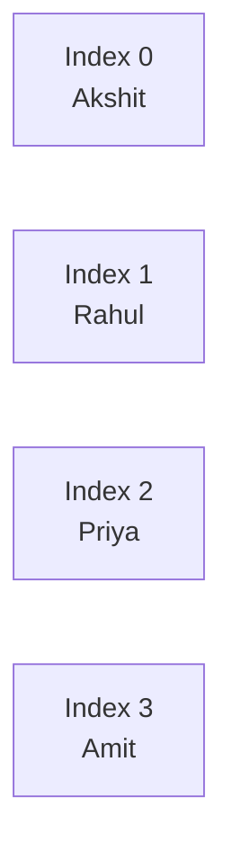
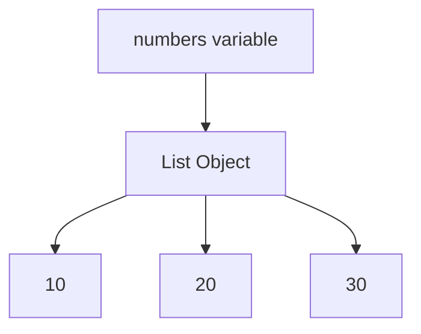

# Python Lists

## 1. Intuitive Introduction

A **List** is one of the most important data structures in Python.

Think about a situation where you need to store:

* Student names
* Product prices
* Employee records
* Machine Learning dataset rows

Instead of creating hundreds of variables:

```python
name1 = "Akshit"
name2 = "Rahul"
name3 = "Priya"
```

We store everything inside a single container:

```python
students = ["Akshit", "Rahul", "Priya"]
```

A list allows us to:

* Store multiple values
* Store different data types
* Access data quickly
* Modify data easily
* Process large datasets efficiently

Lists are everywhere in:

* Data Science
* Machine Learning
* Web Development
* Backend Systems
* Automation Scripts

---

# 2. Real-World Analogy

Imagine a train.

Each coach contains passengers.

```text
Coach 0 -> Akshit
Coach 1 -> Rahul
Coach 2 -> Priya
Coach 3 -> Amit
```

Python List:

```python
students = ["Akshit", "Rahul", "Priya", "Amit"]
```

Every item has a position called an **index**.

---

# 3. Core Theory

A List is:

* Ordered
* Mutable
* Dynamic
* Indexed

### Ordered

Items keep their position.

```python
numbers = [10, 20, 30]
```

Output:

```python
[10, 20, 30]
```

Order remains same.

---

### Mutable

Can be changed after creation.

```python
numbers = [10, 20, 30]

numbers[0] = 100

print(numbers)
```

Output:

```python
[100, 20, 30]
```

---

### Dynamic

Size can grow or shrink.

```python
numbers = [10, 20]

numbers.append(30)
```

Now:

```python
[10, 20, 30]
```

---

### Indexed

Every element gets an index.

```python
students = ["A", "B", "C"]
```

| Element | Index |
| ------- | ----- |
| A       | 0     |
| B       | 1     |
| C       | 2     |

---

# 4. Visual Explanation



---

# 5. Memory & Internal Working

When Python creates:

```python
numbers = [10, 20, 30]
```

Internally:



Important:

A list stores **references** to objects, not actual values.

---

# 6. Creating Lists

## Empty List

```python
items = []
```

or

```python
items = list()
```

---

## Integer List

```python
numbers = [1, 2, 3, 4]
```

---

## String List

```python
names = ["Akshit", "Rahul", "Priya"]
```

---

## Mixed List

```python
data = [1, "Akshit", 95.5, True]
```

Python allows mixed data types.

---

# 7. Accessing Elements

```python
fruits = ["Apple", "Mango", "Banana"]
```

## First Element

```python
print(fruits[0])
```

Output:

```python
Apple
```

---

## Second Element

```python
print(fruits[1])
```

Output:

```python
Mango
```

---

## Last Element

```python
print(fruits[-1])
```

Output:

```python
Banana
```

---

# 8. List Slicing

```python
numbers = [10, 20, 30, 40, 50]
```

### First Three

```python
print(numbers[0:3])
```

Output:

```python
[10, 20, 30]
```

---

### Last Two

```python
print(numbers[-2:])
```

Output:

```python
[40, 50]
```

---

# 9. Important List Methods

## append()

Add item at end.

```python
numbers = [10, 20]

numbers.append(30)

print(numbers)
```

Output:

```python
[10, 20, 30]
```

---

## insert()

Add item at specific position.

```python
numbers = [10, 30]

numbers.insert(1, 20)

print(numbers)
```

Output:

```python
[10, 20, 30]
```

---

## remove()

Remove value.

```python
numbers = [10, 20, 30]

numbers.remove(20)

print(numbers)
```

Output:

```python
[10, 30]
```

---

## pop()

Remove by index.

```python
numbers = [10, 20, 30]

numbers.pop(1)

print(numbers)
```

Output:

```python
[10, 30]
```

---

## sort()

```python
numbers = [5, 1, 4, 2]

numbers.sort()

print(numbers)
```

Output:

```python
[1, 2, 4, 5]
```

---

## reverse()

```python
numbers = [1, 2, 3]

numbers.reverse()

print(numbers)
```

Output:

```python
[3, 2, 1]
```

---

# 10. Looping Through Lists

```python
students = ["Akshit", "Rahul", "Priya"]

for student in students:
    print(student)
```

Output:

```python
Akshit
Rahul
Priya
```

---

# 11. Practical Examples

## Example 1: Student Marks

```python
marks = [85, 92, 78, 95]

print("Highest:", max(marks))
print("Lowest:", min(marks))
print("Total:", sum(marks))
```

Output:

```python
Highest: 95
Lowest: 78
Total: 350
```

---

## Example 2: Shopping Cart

```python
cart = []

cart.append("Laptop")
cart.append("Mouse")
cart.append("Keyboard")

print(cart)
```

Output:

```python
['Laptop', 'Mouse', 'Keyboard']
```

---

# 12. ML & Data Science Connection

Lists are often the starting point before using NumPy.

```python
data = [10, 20, 30, 40]
```

Convert to NumPy:

```python
import numpy as np

arr = np.array(data)
```

Machine Learning uses:

* Feature values
* Labels
* Dataset rows
* Batch data

Example:

```python
heights = [170, 180, 175, 165]
weights = [70, 85, 78, 60]
```

These eventually become NumPy arrays and Pandas DataFrames.

---

# 13. Common Mistakes

## Index Error

```python
numbers = [10, 20]

print(numbers[5])
```

Output:

```python
IndexError
```

---

## Confusing append with extend

```python
a = [1, 2]

a.append([3, 4])

print(a)
```

Output:

```python
[1, 2, [3, 4]]
```

---

```python
a = [1, 2]

a.extend([3, 4])

print(a)
```

Output:

```python
[1, 2, 3, 4]
```

---

# 14. Performance Considerations

| Operation        | Complexity |
| ---------------- | ---------- |
| Access           | O(1)       |
| Append           | O(1)       |
| Update           | O(1)       |
| Search           | O(n)       |
| Insert Beginning | O(n)       |
| Remove           | O(n)       |

### Why?

Python list internally behaves like a dynamic array.

Appending is usually very fast.

Searching requires scanning elements one by one.

---

# 15. Interview Questions

### Beginner

1. What is a List?
2. Why are lists mutable?
3. Difference between tuple and list?
4. What is indexing?
5. What is slicing?

---

### Intermediate

6. Difference between append() and extend()?
7. Difference between remove() and pop()?
8. Why is list access O(1)?
9. What happens internally during append()?
10. Explain negative indexing.

---

### Advanced

11. How are Python lists stored internally?
12. Why is insertion at beginning expensive?
13. List vs NumPy array?
14. List vs Set?
15. Explain shallow copy and deep copy.

---

# 16. Mini Project

Create a Student Management System.

Requirements:

```python
1. Add Student
2. Remove Student
3. Show Students
4. Search Student
5. Exit
```

Concepts Used:

* Lists
* Loops
* Conditions
* Input
* Functions

This project is excellent for interviews and strengthening list fundamentals.

---

# 17. Summary Table

| Concept  | Purpose               | Industry Usage     |
| -------- | --------------------- | ------------------ |
| List     | Store multiple values | Everywhere         |
| Indexing | Access data           | Data Processing    |
| Slicing  | Extract subsets       | Analytics          |
| append() | Add data              | Logging, Pipelines |
| remove() | Delete data           | CRUD Systems       |
| sort()   | Organize data         | Reporting          |
| Loops    | Process list items    | ML Pipelines       |

---

# 18. Key Takeaways

* Lists are the most used Python data structure.
* Lists are ordered, mutable, dynamic, and indexed.
* Python lists store references to objects.
* Access is O(1), search is O(n).
* Lists are foundational for NumPy, Pandas, and Machine Learning.
* Master lists before moving to Tuples, Sets, Dictionaries, List Comprehensions, and NumPy Arrays.
