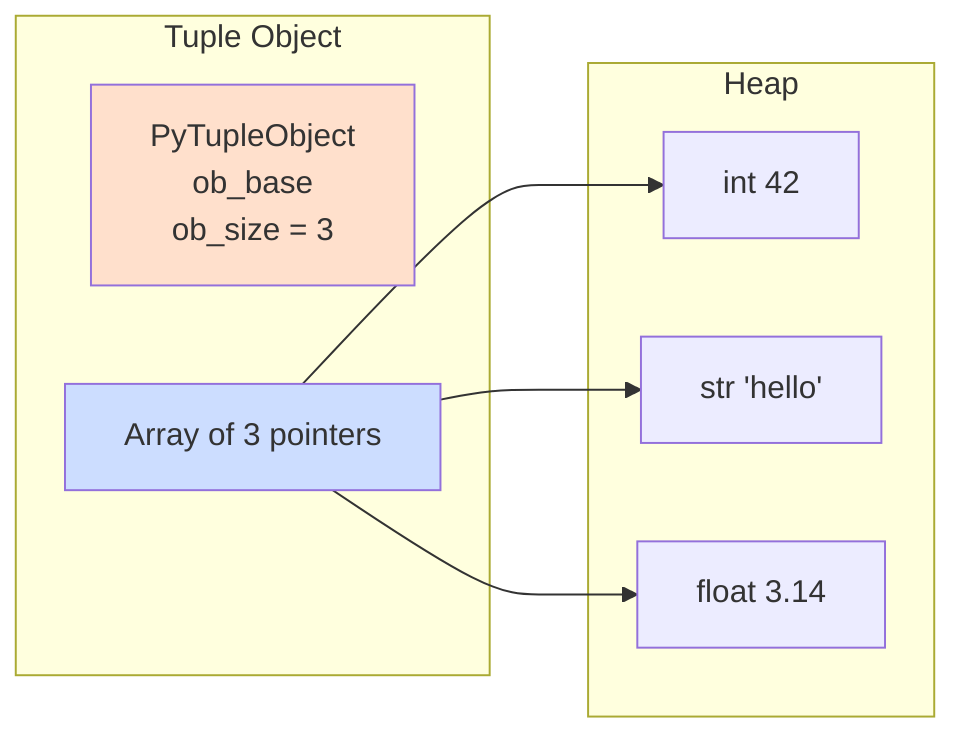
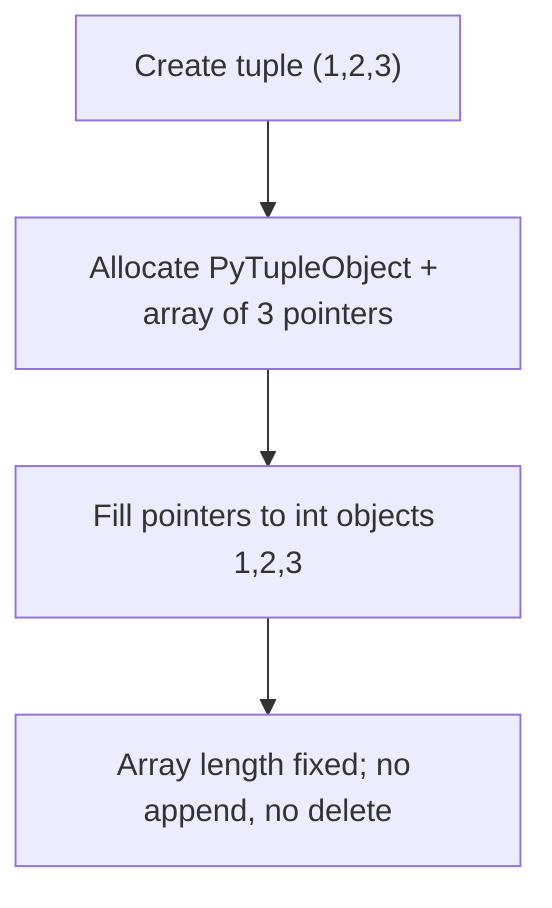

# Python Tuples: The Immutable Power of Ordered Collections

## 1. Intuitive Introduction

Imagine you receive a **printed certificate** with your name and a date. You can read it, frame it, and share it – but you cannot erase the name or change the date without invalidating the certificate. The information is **fixed forever**. That’s a Python tuple: an ordered collection that, once created, **cannot be changed**.

But why would you want an immutable list?  
- **Safety:** When you pass data to a function, you want guarantee it won’t be accidentally modified.  
- **Performance:** Python can optimise immutable objects better.  
- **Hashability:** Only immutable objects can be used as dictionary keys or set elements. Tuples can be keys; lists cannot.

**Where tuples are used in real software:**
- **Student:** Store coordinates `(x, y)` of points on a graph – these shouldn’t change.
- **Web dev:** Return multiple values from a function: `return (user_id, user_name)`.
- **Data science:** Represent a row from a database as a tuple of values (immutable record).
- **ML:** Store hyperparameter configurations as tuples of fixed parameters.

---

## 2. Real‑World Analogy

Think of a **vinyl record** (LP). The grooves are pressed at the factory – you cannot change the order of songs, add a new track, or delete one. You can only **read** them in order. Yet, you can have many copies of the same record, stack them, pass them around, and even use them as keys in a jukebox’s memory (because each record is uniquely identified by its content). That’s a tuple.

In contrast, a **playlist on your phone** is a list – you can reorder, add, remove songs at will.

---

## 3. Core Theory

A **tuple** is an **ordered, immutable, heterogeneous** sequence of objects.  
Key properties:

- **Ordered** – elements have fixed positions (indexing works).
- **Immutable** – cannot add, remove, or change elements after creation.
- **Heterogeneous** – can mix types: `(1, "hello", 3.14)`.
- **Hashable** – if all elements are hashable, the tuple itself can be used as a dict key or set element.
- **Indexable & slicable** – supports all indexing/slicing operations (returns new tuples).
- **Iterable** – can be looped over.
- **Allows duplicates** – `(1, 1, 2)` is fine.

```python
# Demonstrating properties
t = (10, "Python", 3.14)
print(t[1])          # 'Python' – ordered & indexable
# t[1] = "Java"      # TypeError: 'tuple' object does not support item assignment

# Hashable – can be dict key
d = { (1,2): "point" }
print(d[(1,2)])      # 'point'

# Immutability protects contents – but if an element is mutable (e.g., list), that list can be changed
t2 = (1, [2,3])
t2[1].append(4)      # works – but the tuple still contains the same list object (reference unchanged)
print(t2)            # (1, [2,3,4])
```

---

## 4. Visual Explanation – Tuple as Fixed Array of References



The tuple stores references, just like a list. But the array **cannot be resized** or reassigned. The references themselves are immutable – you cannot change which objects the tuple points to. However, the objects themselves might be mutable.

---

## 5. Memory & Internal Working (CPython)

CPython implements tuples as **fixed‑size arrays** of `PyObject*`. The `PyTupleObject` structure (in `tupleobject.h`) contains:

- `ob_base` – standard object header.
- `ob_size` – number of elements (fixed at creation).
- `ob_item[1]` – a placeholder for the array of pointers (actually allocated contiguously).

Unlike lists, tuples **never over‑allocate**. The exact number of elements is allocated once. This makes tuples **lighter** in memory (no `allocated` field). Creation is slightly faster than a list of the same size because no extra capacity is needed.

**Memory diagram:**



Because tuples are immutable, they are **cache‑friendly** and can be safely shared. Small integer tuples are often reused (interning of small tuples in CPython).

---

## 6. Creating Tuples

### All possible creation ways

```python
# 1. Literal (parentheses)
empty = ()
single = (5,)           # note comma! (5) is just integer 5
multi = (1, 2, 3)
mixed = ("a", 1, True)

# 2. tuple() constructor
from_str = tuple("abc")      # ('a','b','c')
from_list = tuple([1,2,3])   # (1,2,3)
from_range = tuple(range(5)) # (0,1,2,3,4)

# 3. Without parentheses – tuple packing
packed = 1, 2, 3             # (1,2,3)

# 4. Comprehension? Tuples don't have comprehension – use generator with tuple()
squares = tuple(x**2 for x in range(1,6))  # (1,4,9,16,25)

# 5. Using multiplication (repetition)
zeros = (0,) * 5             # (0,0,0,0,0)

# 6. Unpacking / star expressions
combined = (1,2) + (3,4)     # (1,2,3,4)
```

### Common mistakes

```python
# Mistake 1: Forgetting comma for single‑element tuple
t = (5)
print(type(t))    # <class 'int'> – not a tuple!
t_correct = (5,)

# Mistake 2: Trying to modify tuple
t = (1,2,3)
t[0] = 10         # TypeError

# Mistake 3: Using tuple comprehension (doesn't exist)
# t = (x for x in range(5)) – this creates a generator, not a tuple
t = tuple(x for x in range(5))  # correct
```

---

## 7. Core Operations / Methods

Tuples have **fewer methods** than lists – only two:

| Method | Syntax | Example | Output | Explanation | When to use |
|--------|--------|---------|--------|-------------|-------------|
| `count` | `t.count(x)` | `(1,2,1,3).count(1)` | `2` | Count occurrences | Frequency in fixed data |
| `index` | `t.index(x[, start[, end]])` | `('a','b','a').index('a',1)` | `2` | First index of value (raises ValueError if missing) | Find position |

```python
# Demonstration
t = (10, 20, 30, 20, 40)
print(t.count(20))     # 2
print(t.index(30))     # 2
print(t.index(20, 2))  # 3 – start searching from index 2
```

All other operations are inherited from sequence protocol:
- Indexing: `t[0]`
- Slicing: `t[1:3]` – returns new tuple
- Concatenation: `t1 + t2`
- Repetition: `t * 3`
- Membership: `x in t`
- Length: `len(t)`
- Iteration: `for item in t:`
- Unpacking: `a, b = t`

---

## 8. Advanced Concepts

### Tuple unpacking (very powerful)

```python
# Basic unpacking
a, b, c = (1, 2, 3)   # a=1,b=2,c=3

# Using * for rest
first, *rest = (10, 20, 30, 40)   # first=10, rest=[20,30,40] (list!)
*head, last = (1,2,3)             # head=[1,2], last=3

# Swapping variables (tuple packing/unpacking)
x, y = 5, 10
x, y = y, x          # swap – works because right side creates a tuple (10,5)

# Returning multiple values from function
def get_user():
    return (101, "Alice", "alice@example.com")
id, name, email = get_user()   # tuple unpacking
```

### Named tuples (from `collections` module)

Named tuples add **field names** to tuples for readability while keeping immutability.

```python
from collections import namedtuple
Point = namedtuple('Point', ['x', 'y'])
p = Point(10, 20)
print(p.x, p.y)      # 10 20
print(p[0])          # also 10 – still works as tuple
# p.x = 30           # AttributeError – immutable
```

### Tuples as dictionary keys

```python
# Represent grid coordinates
grid = {}
grid[(0,0)] = "origin"
grid[(1,2)] = "target"
print(grid[(1,2)])   # 'target'
```

### Tuples in `isinstance` checks

```python
def process(value):
    if isinstance(value, (int, float)):   # tuple of types
        print("numeric")
```

### Single‑element tuple gotcha

```python
t = (5,)   # correct
print(t[0])  # 5
```

---

## 9. Mathematical / Special Operations

Tuples support the same sequence operations as lists, but no element‑wise arithmetic. However, they are often used in **mathematical contexts** to represent fixed vectors, coordinates, or parameters.

- **Concatenation**: `(1,2) + (3,4) = (1,2,3,4)`
- **Repetition**: `(1,2) * 2 = (1,2,1,2)`
- **Comparison**: Lexicographic order: `(1,2) < (1,3)` → `True`

```python
print((1,2) < (2,1))    # True – compares element by element
print((1,2) == (1,2))   # True
```

### Using tuples for multiple assignment in loops

```python
pairs = [(1, 'a'), (2, 'b'), (3, 'c')]
for num, char in pairs:
    print(num, char)
```

---

## 10. Real Practical Examples

### Example 1: Function returning multiple values (database row)

```python
def fetch_user(user_id):
    # Simulate DB query
    if user_id == 1:
        return (1, "John Doe", "john@example.com", True)
    else:
        return None

user = fetch_user(1)
if user:
    uid, name, email, active = user
    print(f"{name} ({email}) is active: {active}")
```

### Example 2: Immutable configuration settings

```python
# Application settings – tuples prevent accidental changes
DB_CONFIG = ("localhost", 5432, "postgres", "secret")
API_KEYS = ("key1", "key2", "key3")

# Trying to modify would error – protects config at runtime
# DB_CONFIG[1] = 5433  # TypeError
```

### Example 3: Using tuple as a light‑weight struct

```python
# Representing RGB colors
colors = {
    "red": (255, 0, 0),
    "green": (0, 255, 0),
    "blue": (0, 0, 255)
}
def mix(color1, color2):
    return tuple((c1 + c2) // 2 for c1, c2 in zip(color1, color2))

print(mix(colors["red"], colors["blue"]))  # (127, 0, 127)
```

---

## 11. ML & Data Science Connection

- **Pandas:** A DataFrame row can be converted to a tuple (immutable) for use as a dictionary key or for hashing.
- **Scikit‑learn:** Parameter grids – `param_grid = {'C': [0.1, 1.0], 'kernel': ['linear', 'rbf']}` – the combinations are often iterated as tuples.
- **NumPy:** Shape of an array is a tuple: `arr.shape` returns `(rows, cols)`. This tuple is immutable.
- **TensorFlow / PyTorch:** Model input shapes are tuples: `input_shape = (28, 28, 1)`.
- **Data pipelines:** Tuples represent a single record (row) that is passed through multiple transformation functions without risk of mutation.

```python
import pandas as pd
df = pd.DataFrame({'A': [1,2,3], 'B': [4,5,6]})
# Convert row to tuple
row_tuple = tuple(df.iloc[0])   # (1,4)
print(row_tuple)
```

```python
# Scikit‑learn parameter grid using tuples
from sklearn.model_selection import ParameterGrid
params = {'C': [0.1, 1.0], 'gamma': ['auto', 'scale']}
for param_set in ParameterGrid(params):
    # param_set is a dict, but values often used as tuples
    print(param_set)
```

---

## 12. Common Mistakes & Pitfalls

| Mistake | Wrong code | Consequence | Correct way |
|---------|------------|-------------|--------------|
| Forgetting comma for single tuple | `t = (5)` | `t` is int, not tuple | `t = (5,)` |
| Trying to modify tuple | `t[0] = 10` | `TypeError` | Create new tuple: `(10,) + t[1:]` |
| Using list where tuple is required as dict key | `d[[1,2]] = "value"` | `TypeError: unhashable type: 'list'` | Use tuple: `d[(1,2)] = "value"` |
| Assuming tuple of mutable elements is fully immutable | `t = ([1,2], 3); t[0].append(3)` | Works, changing the inner list – tuple still contains same list reference | Understand shallow immutability; use deep copy if needed |
| Using `+` in a loop to build large tuple | `t = (); for i in range(1000): t += (i,)` | O(n²) many intermediate tuples | Use list to collect, then convert to tuple at the end |

---

## 13. Performance Considerations

| Operation | Time Complexity | Notes |
|-----------|----------------|-------|
| Indexing `t[i]` | O(1) | Same as list |
| Slicing `t[i:j]` | O(k) | Creates new tuple of k elements |
| Concatenation `t1 + t2` | O(len(t1)+len(t2)) | New tuple allocated |
| Repetition `t * n` | O(n * len(t)) | New tuple created |
| `count(x)` | O(n) | Linear scan |
| `index(x)` | O(n) | Linear scan |
| `len(t)` | O(1) | Stored attribute |
| Creation from iterable | O(n) | Allocates exact size, copies references |

**Why tuples can be faster than lists:**
- Less memory overhead (no `allocated` field).
- Creation is slightly faster (no extra capacity allocation).
- Iteration can be marginally faster due to cache locality (no potential resizing).
- They are hashable, allowing O(1) dictionary lookups when used as keys.

---

## 14. Interview Questions

### Beginner
1. **What is the main difference between a list and a tuple?**  
   Lists are mutable; tuples are immutable.
2. **How do you create a tuple with a single element 5?**  
   `(5,)` – the comma is essential.
3. **Can a tuple be used as a dictionary key? Why?**  
   Yes, because it is immutable and hashable (if all its elements are hashable).
4. **What happens when you try `t[0] = 10` on a tuple?**  
   `TypeError: 'tuple' object does not support item assignment`.
5. **What does `(1, 2) * 3` produce?**  
   `(1, 2, 1, 2, 1, 2)`.

### Intermediate
6. **Explain the output: `t = (1, 2, [3, 4]); t[2].append(5); print(t)`**  
   `(1, 2, [3, 4, 5])` – the tuple’s reference to the list is unchanged; the list itself is mutated.
7. **How can you convert a list to a tuple?**  
   `tuple(lst)`
8. **What is tuple packing and unpacking? Provide an example.**  
   Packing: `t = 1, 2` creates tuple `(1,2)`. Unpacking: `a, b = t`.
9. **Why is `(1)` not a tuple?**  
   Parentheses are used for grouping. `(1)` is just integer 1. Comma creates tuple.
10. **Write a function that returns multiple values using a tuple and then unpacks them.**  
    ```python
    def stats(numbers):
        return (min(numbers), max(numbers), sum(numbers)/len(numbers))
    mn, mx, avg = stats([1,2,3,4,5])
    ```

### Advanced
11. **How does CPython implement tuple immutability in C?**  
    The `PyTupleObject` has no `ob_allocated` field; `ob_size` is fixed. The array of pointers is allocated exactly to size, and no `__setitem__` slot is provided.
12. **Compare memory usage of a tuple vs list of same length containing the same integers.**  
    Tuple uses less memory because it lacks the `allocated` field and the overhead for resizing. Typically ~8 bytes less per tuple object plus no empty capacity.
13. **Explain why `hash((1,2))` works but `hash([1,2])` doesn’t.**  
    Tuples are immutable, so their hash can be computed once and cached. Lists are mutable, so if a list’s hash were used as a key, its value could change, breaking the dict invariant.
14. **How would you create a tuple of 10 million zeros efficiently?**  
    `(0,) * 10_000_000` – because `*` creates the tuple in one allocation, avoiding a loop.
15. **What is the purpose of `collections.namedtuple`? When would you prefer it over a regular tuple or a dataclass?**  
    Adds field names for readability while keeping immutability and low memory overhead. Prefer when you need a simple immutable data container with named fields but don’t want the complexity of a class.

---

## 15. Mini Project Idea

**Project: Immutable ledger / transaction log**  
Build a simple ledger that records transactions as tuples: `(timestamp, amount, description)`. The ledger is a list of tuples (each transaction immutable). Provide functions to:
- Add a transaction (append new tuple).
- Compute total balance.
- Filter transactions by amount range (return new list of tuples).
- Convert a transaction to a dictionary (e.g., for JSON export).

**Why it strengthens understanding:**  
You’ll work with tuple creation, unpacking, immutability, and use tuples as records. You’ll also understand why immutability helps in logs (no one can alter past transactions).

```python
import time
ledger = []

def add_transaction(amount, desc):
    txn = (time.time(), amount, desc)
    ledger.append(txn)

def balance():
    return sum(txn[1] for txn in ledger)

def filter_by_amount(min_amt, max_amt):
    return [txn for txn in ledger if min_amt <= txn[1] <= max_amt]

add_transaction(100.0, "Salary")
add_transaction(-25.0, "Lunch")
print(balance())                 # 75.0
```

---

## 16. Best Practices

| Practice | Why |
|----------|-----|
| Use tuples for **fixed data** that should never change (coordinates, RGB colors, configuration constants) | Clarifies intent and prevents accidental mutation |
| Prefer `namedtuple` for **tuples with many fields** | Improves readability (field names) while keeping immutability |
| Use `(value,)` syntax for **single‑element tuples** – never forget the comma | Avoids subtle bugs where `(value)` is not a tuple |
| Return multiple values from functions as a **tuple implicitly** (`return a, b`) | Cleaner than explicit parentheses |
| Use tuple **unpacking** instead of indexing for readability | `name, age = get_user()` is clearer than `name = user[0]` |
| For **dictionary keys** that need multiple components, always use a tuple (never list) | Lists are unhashable |

---

## 17. Summary Table

| Concept | Key Characteristics | Purpose | Industry Usage |
|---------|---------------------|---------|----------------|
| Tuple literal `(a,b,c)` | Immutable, ordered, hashable | Fixed collections, records | DB rows, coordinates, config |
| Single‑element tuple `(x,)` | Must have comma | Distinguish from grouping | APIs, function arguments |
| Tuple unpacking | `a,b = (1,2)` | Multi‑return, swapping | All Python code |
| Named tuple | Field names + immutability | Lightweight data class | Parsing records, ML configs |
| Tuple as dict key | Hashable | Composite keys | Caching, memoization, grids |

---

## 18. Key Takeaways

- 🔒 **Tuples are immutable** – once created, you cannot add, remove, or change elements.
- ⚡ **Faster and lighter** than lists – no over‑allocation, smaller memory footprint.
- 🧮 **Hashable** – can be used as dictionary keys and set elements (if all elements hashable).
- 📦 **Tuple packing / unpacking** is elegant for multiple assignment and function returns.
- ⚠️ **Single‑element tuple needs a comma** – `(5,)` not `(5)`.
- 🛡️ **Use tuples for data that should not change** – coordinates, RGB values, database rows, configuration constants.
- 🔄 **Tuples are shallowly immutable** – if they contain a list, the list can still change (the tuple’s reference to it stays).
- 🧪 **Real‑world use:** Database cursors return rows as tuples; `namedtuple` elevates them.
- 📈 **In ML/DS:** Shape tuples, parameter grids, immutable records in data pipelines.
- 🧠 **Master tuples** to write safer, more intention‑revealing code.

---