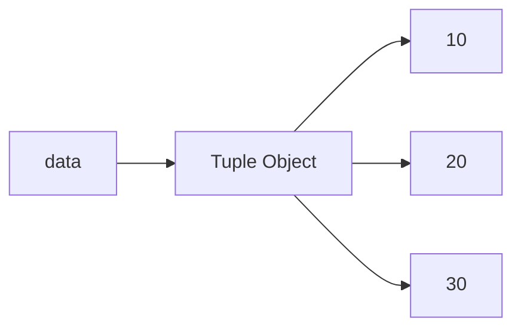
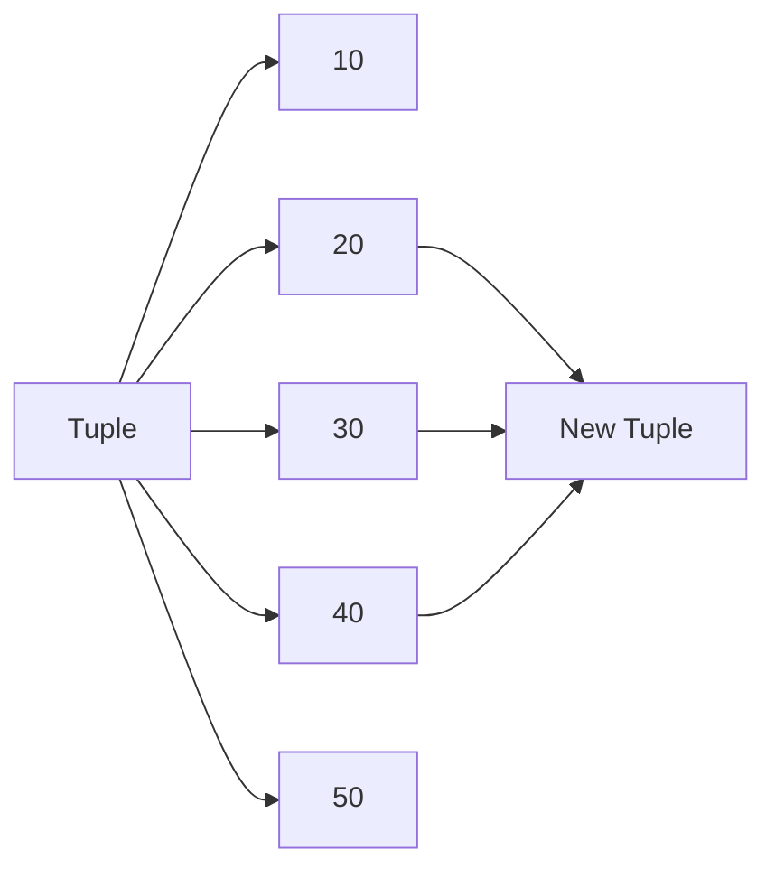
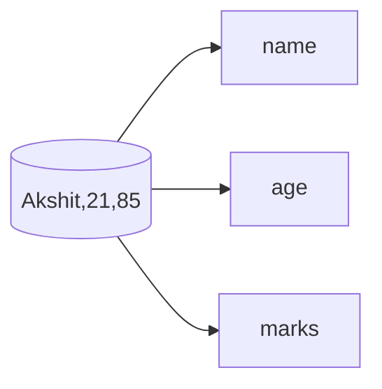

# Tuples in Python

## 1. Intuitive Introduction

A **Tuple** is a collection of multiple values stored together, just like a list.

The major difference is:

* **List = Mutable (can change)**
* **Tuple = Immutable (cannot change after creation)**

Engineers use tuples when data should remain fixed and protected from accidental modification.

Examples:

* GPS coordinates `(23.0225, 72.5714)`
* RGB color `(255, 0, 0)`
* Database records
* Function return values

---

## 2. Real-World Analogy

Imagine:

### List = Whiteboard

You can erase and rewrite anything.

### Tuple = Printed Certificate

Once printed, you cannot change the content.

```python
student = ["Akshit", 21]
student[0] = "Rahul"  # Allowed
```

```python
student = ("Akshit", 21)
student[0] = "Rahul"  # Error
```

---

## 3. Why Tuples Exist

Without tuples:

* Important data could be changed accidentally.
* Programs become less predictable.
* Bugs become more common.

Tuples provide:

* Safety
* Faster access
* Less memory usage
* Hashability (usable as dictionary keys)

---

## 4. Creating Tuples

### Empty Tuple

```python
empty_tuple = ()
```

---

### Tuple with Values

```python
student = ("Akshit", 21, 85.5)
```

Output:

```python
('Akshit', 21, 85.5)
```

---

### Tuple Without Parentheses

Python automatically creates a tuple.

```python
student = "Akshit", 21, 85.5

print(type(student))
```

Output:

```python
<class 'tuple'>
```

---

## 5. Single Element Tuple

Common Interview Question

Wrong:

```python
x = (5)

print(type(x))
```

Output:

```python
<class 'int'>
```

Because Python treats it as a number.

---

Correct:

```python
x = (5,)

print(type(x))
```

Output:

```python
<class 'tuple'>
```

The comma creates the tuple.

---

## 6. Internal Working

When Python creates a tuple:

```python
data = (10, 20, 30)
```

Memory:



Tuple object stores references to values.

Since tuple is immutable:

* Size cannot change
* Elements cannot be reassigned
* Python can optimize memory

---

## 7. Accessing Tuple Elements

### Indexing

```python
colors = ("red", "green", "blue")

print(colors[0])
```

Output:

```python
red
```

---

### Negative Indexing

```python
colors = ("red", "green", "blue")

print(colors[-1])
```

Output:

```python
blue
```

---

## 8. Slicing

```python
numbers = (10, 20, 30, 40, 50)

print(numbers[1:4])
```

Output:

```python
(20, 30, 40)
```

---

### Internal Slice Process



A new tuple is created.

---

## 9. Tuple Immutability

```python
numbers = (10, 20, 30)

numbers[0] = 100
```

Output:

```python
TypeError
```

Because tuple elements cannot be reassigned.

---

## 10. Tuple Methods

Tuples have only two methods.

### count()

Counts occurrences.

```python
data = (1, 2, 2, 2, 3)

print(data.count(2))
```

Output:

```python
3
```

---

### index()

Returns position.

```python
data = (10, 20, 30)

print(data.index(20))
```

Output:

```python
1
```

---

## 11. Tuple Packing

Python automatically packs values into a tuple.

```python
student = "Akshit", 21, 85
```

Equivalent to:

```python
student = ("Akshit", 21, 85)
```

---

## 12. Tuple Unpacking

Very important in interviews.

```python
name, age, marks = ("Akshit", 21, 85)

print(name)
print(age)
print(marks)
```

Output:

```python
Akshit
21
85
```

---

### Internal Flow



---

## 13. Multiple Return Values

Python actually returns tuples.

```python
def get_student():
    return "Akshit", 21

data = get_student()

print(data)
```

Output:

```python
('Akshit', 21)
```

---

### Unpacking Return Values

```python
name, age = get_student()

print(name)
print(age)
```

---

## 14. Memory Behavior

Compare:

```python
my_list = [1, 2, 3]
my_tuple = (1, 2, 3)
```

Tuple:

* Smaller memory footprint
* Faster iteration
* Immutable

List:

* More memory
* Supports modifications

---

## 15. Tuple vs List

| Feature          | List | Tuple |
| ---------------- | ---- | ----- |
| Mutable          | ✅    | ❌     |
| Ordered          | ✅    | ✅     |
| Indexing         | ✅    | ✅     |
| Slicing          | ✅    | ✅     |
| Memory Efficient | ❌    | ✅     |
| Faster           | ❌    | ✅     |
| Dictionary Key   | ❌    | ✅     |

---

## 16. ML & Data Science Connection

### Dataset Shape

```python
shape = (1000, 50)
```

Used everywhere in NumPy.

Meaning:

* 1000 rows
* 50 columns

---

### RGB Colors

```python
red = (255, 0, 0)
```

Computer Vision uses tuples heavily.

---

### Coordinates

```python
point = (10, 20)
```

Used in:

* OpenCV
* Image Processing
* Robotics
* GIS Systems

---

## 17. Common Mistakes

### Mistake 1

```python
x = (5)
```

Not a tuple.

Correct:

```python
x = (5,)
```

---

### Mistake 2

Trying to modify tuple.

```python
data = (1, 2, 3)

data[0] = 100
```

Error.

---

### Mistake 3

Confusing tuple with list.

```python
(1, 2, 3)
```

Tuple

```python
[1, 2, 3]
```

List

---

## 18. Performance Considerations

### Access

```python
data[5]
```

Time Complexity:

$$O(1)$$

---

### Search

```python
5 in data
```

Time Complexity:

$$O(n)$$

---

### Iteration

```python
for item in data:
    pass
```

Time Complexity:

$$O(n)$$

---

## 19. Interview Questions

### Beginner

1. What is a tuple?
2. Difference between tuple and list?
3. Why are tuples immutable?
4. How do you create a single-element tuple?
5. Can tuples contain different data types?

### Intermediate

6. What is tuple packing?
7. What is tuple unpacking?
8. Why are tuples faster than lists?
9. Can a tuple contain a list?
10. Can tuples be dictionary keys?

### Advanced

11. Explain tuple memory optimization.
12. Why are tuples hashable?
13. How does Python store tuple references?
14. What happens during tuple slicing?
15. Why does function return multiple values using tuples?

---

## 20. Mini Project

### Student Record System

```python
student = (
    "Akshit",
    21,
    "Data Science",
    85.5
)

print("Name:", student[0])
print("Age:", student[1])
print("Course:", student[2])
print("Marks:", student[3])
```

Engineering Benefit:

* Record remains unchanged.
* Prevents accidental modification.

---

## 21. Best Practices

✅ Use tuples for fixed data.

```python
DAYS = (
    "Mon",
    "Tue",
    "Wed",
    "Thu",
    "Fri"
)
```

✅ Use unpacking when possible.

```python
x, y = (10, 20)
```

✅ Use tuples for coordinates and configurations.

---

## 22. Summary Table

| Concept   | Purpose              | Industry Usage     |
| --------- | -------------------- | ------------------ |
| Tuple     | Immutable collection | Fixed records      |
| Indexing  | Access element       | Data retrieval     |
| Slicing   | Extract part         | Data processing    |
| Packing   | Create tuple         | Function returns   |
| Unpacking | Split values         | Clean code         |
| count()   | Frequency            | Analytics          |
| index()   | Position lookup      | Searching          |
| Immutable | Safety               | Production systems |

---

# Key Takeaways

1. Tuples are **ordered and immutable collections**.
2. They use **less memory** than lists.
3. They are commonly used for **coordinates, shapes, RGB values, and function returns**.
4. Tuple unpacking is a very important Python feature.
5. In Data Science and ML, tuples are used extensively for **dimensions, shapes, and fixed configurations**.
6. A single-element tuple must contain a comma: `(5,)`.
7. Choose **tuple when data should never change**, and **list when data needs modification**.
