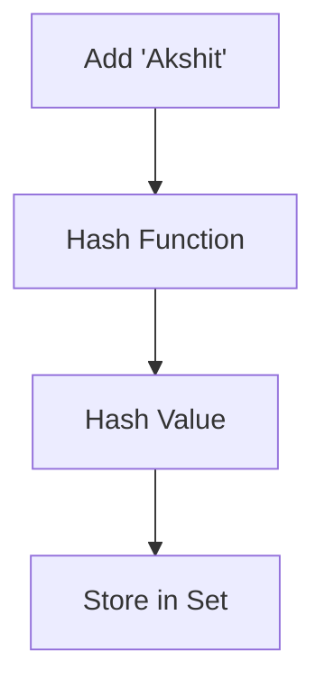
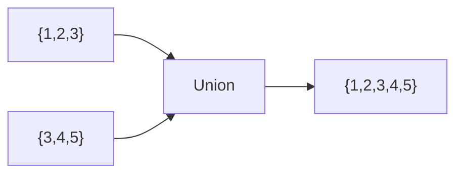
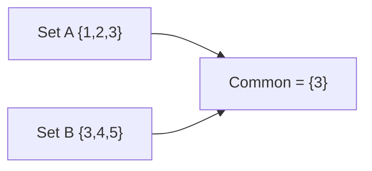
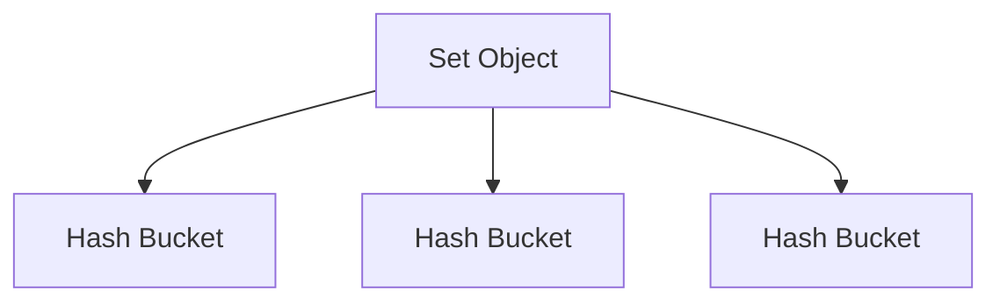

# Sets in Python

## 1. Intuitive Introduction

A **Set** is an unordered collection of **unique values**.

Think about a classroom attendance list:

```text
Akshit
Rahul
Akshit
Jay
Rahul
```

If you only want unique student names:

```text
Akshit
Rahul
Jay
```

That's exactly what a Set does.

Engineers use sets when they need:

* Remove duplicates
* Fast searching
* Membership checking
* Mathematical set operations

Examples:

* Unique website visitors
* Unique user IDs
* Unique product codes
* Removing duplicate records from datasets

---

# 2. Real-World Analogy

Imagine a security gate.

People entering:

```text
Akshit
Rahul
Akshit
Rahul
Jay
```

Security system stores:

```text
Akshit
Rahul
Jay
```

Duplicates are automatically ignored.

---

# 3. Why Sets Exist

Without sets:

```python
names = ["Akshit", "Rahul", "Akshit", "Jay"]
```

Finding duplicates becomes difficult.

With sets:

```python
names = {"Akshit", "Rahul", "Akshit", "Jay"}

print(names)
```

Output:

```python
{'Akshit', 'Rahul', 'Jay'}
```

Duplicate values automatically disappear.

---

# 4. Creating Sets

## Method 1

```python
fruits = {"apple", "banana", "orange"}
```

---

## Method 2

Using `set()`

```python
fruits = set(["apple", "banana", "orange"])
```

---

## Empty Set

Wrong:

```python
data = {}
```

Output:

```python
<class 'dict'>
```

Python creates a dictionary.

---

Correct:

```python
data = set()

print(type(data))
```

Output:

```python
<class 'set'>
```

---

# 5. Internal Working

Sets use a **Hash Table** internally.

When a value is inserted:

1. Python computes a hash value.
2. Hash determines storage location.
3. Value is stored.
4. Duplicate hashes are checked.



This makes searching extremely fast.

---

# 6. Characteristics of Sets

## Unique Values

```python
numbers = {1, 2, 2, 3, 3, 3}

print(numbers)
```

Output:

```python
{1, 2, 3}
```

---

## Unordered

```python
numbers = {10, 20, 30}
```

Python does not guarantee indexing order.

---

## Mutable

You can add and remove items.

```python
numbers = {1, 2, 3}

numbers.add(4)
```

---

## No Indexing

Wrong:

```python
numbers = {1, 2, 3}

print(numbers[0])
```

Output:

```python
TypeError
```

Because sets do not support indexes.

---

# 7. Adding Elements

## add()

```python
numbers = {1, 2, 3}

numbers.add(4)

print(numbers)
```

Output:

```python
{1, 2, 3, 4}
```

---

# 8. Adding Multiple Elements

## update()

```python
numbers = {1, 2, 3}

numbers.update([4, 5, 6])

print(numbers)
```

Output:

```python
{1, 2, 3, 4, 5, 6}
```

---

# 9. Removing Elements

## remove()

```python
numbers = {1, 2, 3}

numbers.remove(2)
```

Result:

```python
{1, 3}
```

---

If value does not exist:

```python
numbers.remove(10)
```

Output:

```python
KeyError
```

---

## discard()

Safer version.

```python
numbers.discard(10)
```

No error.

---

## pop()

```python
numbers = {1, 2, 3}

numbers.pop()
```

Removes a random element.

---

## clear()

```python
numbers.clear()
```

Removes everything.

---

# 10. Membership Testing

One of the biggest advantages.

```python
users = {"Akshit", "Rahul", "Jay"}

print("Rahul" in users)
```

Output:

```python
True
```

Average complexity:

$$O(1)$$

Very fast.

---

# 11. Set Operations

Suppose:

```python
A = {1, 2, 3}
B = {3, 4, 5}
```

---

## Union

Combines both sets.

```python
print(A | B)
```

Output:

```python
{1, 2, 3, 4, 5}
```



---

## Intersection

Common values.

```python
print(A & B)
```

Output:

```python
{3}
```

---

## Difference

Values in A not in B.

```python
print(A - B)
```

Output:

```python
{1, 2}
```

---

## Symmetric Difference

Values not common.

```python
print(A ^ B)
```

Output:

```python
{1, 2, 4, 5}
```

---

# 12. Visual Explanation



---

# 13. Frozen Sets

Normal sets are mutable.

Sometimes we need immutable sets.

```python
data = frozenset([1, 2, 3])
```

Cannot modify.

Useful for:

* Dictionary keys
* Caching
* Configuration values

---

# 14. Memory Behavior

```python
numbers = {10, 20, 30}
```

Python creates:



Internally uses hash buckets instead of sequential storage like lists.

---

# 15. Practical Examples

## Remove Duplicates

```python
data = [1, 2, 2, 3, 3, 4]

unique = set(data)

print(unique)
```

Output:

```python
{1, 2, 3, 4}
```

---

## Unique Visitors

```python
visitors = set()

visitors.add("user1")
visitors.add("user2")
visitors.add("user1")

print(visitors)
```

Output:

```python
{'user1', 'user2'}
```

---

# 16. ML & Data Science Connection

## Unique Categories

```python
cities = [
    "Ahmedabad",
    "Surat",
    "Ahmedabad",
    "Rajkot"
]

unique_cities = set(cities)
```

Output:

```python
{'Ahmedabad', 'Surat', 'Rajkot'}
```

Used in:

* Data Cleaning
* Feature Engineering
* EDA

---

## Vocabulary Creation in NLP

```python
words = [
    "python",
    "ai",
    "python",
    "ml"
]

vocab = set(words)
```

Output:

```python
{'python', 'ai', 'ml'}
```

Used in:

* Text preprocessing
* NLP pipelines
* Token analysis

---

# 17. Common Mistakes

## Mistake 1

```python
data = {}
```

Creates dictionary.

Correct:

```python
data = set()
```

---

## Mistake 2

Trying indexing.

```python
numbers = {1, 2, 3}

numbers[0]
```

Error.

---

## Mistake 3

Adding list inside set.

```python
data = {1, 2}

data.add([3, 4])
```

Output:

```python
TypeError
```

Lists are mutable and unhashable.

---

Correct:

```python
data.add((3, 4))
```

Tuple is hashable.

---

# 18. Performance Considerations

| Operation        | Complexity |
| ---------------- | ---------- |
| Add              | O(1)       |
| Remove           | O(1)       |
| Search           | O(1)       |
| Membership Check | O(1)       |
| Iteration        | O(n)       |

---

## Why Sets Are Fast

List search:

```python
1000 in my_list
```

Complexity:

$$O(n)$$

---

Set search:

```python
1000 in my_set
```

Complexity:

$$O(1)$$

Much faster for large datasets.

---

# 19. Industry Engineering Mindset

Professionals use sets for:

* Authentication systems
* Duplicate detection
* Data cleaning
* Graph algorithms
* Recommendation engines
* Large-scale analytics

Example:

Checking if a user ID already exists.

```python
if user_id in registered_users:
    print("Already Registered")
```

Fast even with millions of users.

---

# 20. Interview Questions

### Beginner

1. What is a set?
2. Why are duplicates removed?
3. Difference between list and set?
4. How do you create an empty set?
5. Why is indexing not supported?

### Intermediate

6. How does a set achieve O(1) lookup?
7. Difference between `remove()` and `discard()`?
8. What is a frozen set?
9. Can a set contain tuples?
10. Can a set contain lists?

### Advanced

11. Explain hashing in sets.
12. Why are sets unordered?
13. How are collisions handled internally?
14. Why must elements be hashable?
15. When should you prefer a set over a list?

### Output Prediction

16.

```python
data = {1, 2, 2, 3}
print(data)
```

Answer:

```python
{1, 2, 3}
```

17.

```python
data = set()
data.add((1, 2))
print(data)
```

Output:

```python
{(1, 2)}
```

---

# 21. Mini Project

## Student Attendance System

```python
# Store unique students

attendance = set()

attendance.add("Akshit")
attendance.add("Rahul")
attendance.add("Akshit")

print("Present Students:")
print(attendance)

print("Total Unique Students:")
print(len(attendance))
```

Output:

```python
Present Students:
{'Akshit', 'Rahul'}

Total Unique Students:
2
```

---

# 22. Best Practices

✅ Use sets for fast membership checking.

```python
allowed_users = {"admin", "manager"}
```

✅ Use sets to remove duplicates.

```python
unique_values = set(data)
```

✅ Use frozenset when immutability is needed.

```python
permissions = frozenset({"read", "write"})
```

❌ Do not rely on set order.

❌ Do not use indexing.

❌ Do not store mutable objects like lists inside sets.

---

# 23. Summary Table

| Concept      | Purpose           | Industry Usage    |
| ------------ | ----------------- | ----------------- |
| Set          | Unique collection | Data cleaning     |
| add()        | Insert value      | User tracking     |
| remove()     | Delete value      | Record management |
| discard()    | Safe delete       | Robust systems    |
| Union        | Combine sets      | Analytics         |
| Intersection | Common values     | Recommendations   |
| Difference   | Unique values     | Comparisons       |
| Membership   | Fast lookup       | Authentication    |
| frozenset    | Immutable set     | Caching           |

---

# Key Takeaways

1. Sets store **unique values only**.
2. Sets are **unordered** and **mutable**.
3. They use **hash tables internally**.
4. Membership checking is usually **O(1)**.
5. Sets are ideal for **duplicate removal** and **fast lookups**.
6. Elements must be **hashable**.
7. Sets are heavily used in **Data Science, NLP, ML preprocessing, analytics, and backend systems**.
