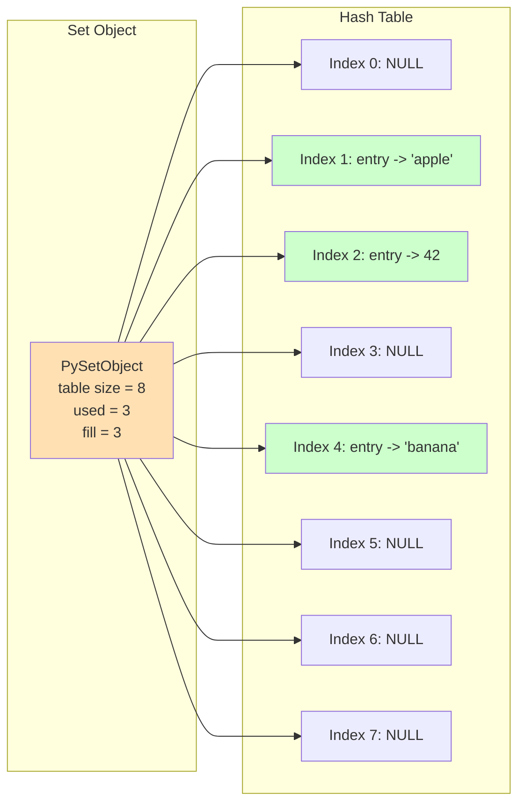
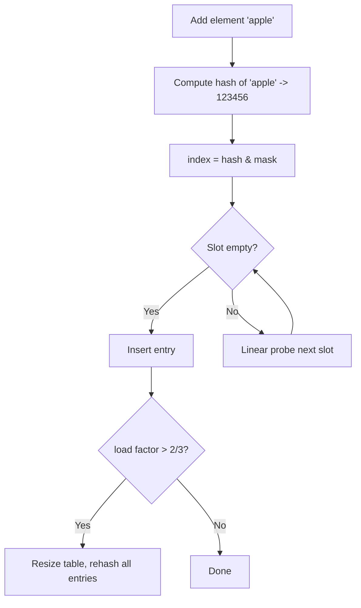

# Python Sets: The Unordered Collection of Unique Elements

## 1. Intuitive Introduction

Imagine you have a **bowl of fruit** where each type of fruit can appear only once – no duplicates allowed. You can add an apple, then a banana, then try to add another apple – but the bowl already contains an apple, so nothing changes. You can check if an orange is in the bowl instantly (without looking through every piece). You can also combine two bowls: fruits that are in either bowl, fruits in both, or fruits in one but not the other.

That’s exactly a Python **set**: an **unordered collection of unique, hashable** objects. Sets are optimised for **membership testing** (`in`), **deduplication**, and **mathematical set operations** (union, intersection, difference).

**Why sets exist:**  
Real problems often involve unique elements: unique visitors to a website, unique words in a document, tags on a blog post, or relationships between groups of users. Sets provide the most efficient way to handle uniqueness and set algebra.

**Where sets are used in real software:**
- **Student:** Remove duplicate numbers from a list: `unique = set([1,2,2,3])` → `{1,2,3}`.
- **Web dev:** Track unique IP addresses that accessed an endpoint.
- **Data science:** Find common categories between two datasets (intersection).
- **ML:** Compute Jaccard similarity between two sets of features (e.g., tags on products).

---

## 2. Real‑World Analogy

Think of a **bouncer at a club** with a **guest list on a clipboard**. The list is **unordered** – the bouncer doesn’t care about the order, only whether a name is present. Each name appears **only once** (no duplicates). The bouncer can:
- **Check** if a person is on the list (`in` operation) – extremely fast, doesn’t need to scan the whole list.
- **Add** a new guest (if not already present).
- **Remove** a guest.
- Compare two clubs’ guest lists: who is on **both** (intersection), who is on **either** (union), who is on one but not the other (difference).

That’s the essence of a set: fast membership, no duplicates, and powerful set algebra.

---

## 3. Core Theory

A **set** is an **unordered, mutable, iterable collection of unique, hashable objects**.  
Key properties:

- **Unordered** – elements have no index; you cannot access `s[0]`.
- **Mutable** – you can add and remove elements.
- **Unique** – duplicates are automatically eliminated.
- **Hashable elements** – every element must be immutable and hashable (strings, numbers, tuples of hashables, but not lists or dicts or other sets).
- **Fast membership** – `x in s` is O(1) average.
- **Iterable** – can loop over elements (order is arbitrary but deterministic within a run).
- **Not indexable or slicable** – because there is no order.

```python
# Demonstrating properties
s = {1, 2, 2, 3}        # {1, 2, 3} – duplicates removed
print(s)                # {1, 2, 3} (order may vary)
s.add(4)
print(s)                # {1, 2, 3, 4}
# print(s[0])           # TypeError: 'set' object is not subscriptable
print(2 in s)           # True – fast membership
```

---

## 4. Visual Explanation – Set as Hash Table



The set uses a **hash table** where each element is stored in a slot based on its hash. The table has empty slots (NULL). When you add an element, it is hashed and placed; duplicates are detected via hash and equality. The order you see when iterating is the order of the hash table entries, which is not the same as insertion order (before Python 3.7, it was arbitrary; from 3.7+, it preserves insertion order as an implementation detail, but sets are still conceptually unordered – don’t rely on it).

---

## 5. Memory & Internal Working (CPython)

CPython implements sets using a **hash table** defined in `setobject.h` (the `PySetObject`). The table contains **entries** (`PySetEntry`) with a hash, a key pointer, and a dummy marker for deleted entries.

Key structures:
- `table` – array of entries.
- `mask` – size of table minus one (used for hashing).
- `used` – number of active elements.
- `fill` – used + dummy entries.

**Adding an element:**
1. Compute hash of the element: `hash = PyObject_Hash(obj)`.
2. Use hash and mask to find initial index.
3. Linear probing (with perturb) to resolve collisions.
4. If found, nothing changes; if not found, insert new entry.
5. If the table is too full (2/3 occupancy), **rehash** to a larger table (roughly 4x growth pattern).

**Removing an element:**
- Mark entry as "dummy" (not NULL, but a special value) – this helps probing continue. Over time, if many deletions, sets may shrink on rehash.

**Memory overhead:** Sets use more memory than lists or tuples because of the hash table (many empty slots). Typically ~2–3x more than a list of the same number of elements.



---

## 6. Creating Sets

### All possible creation ways

```python
# 1. Set literal (most common)
empty = set()           # {} is empty dict, not empty set!
numbers = {1, 2, 3}
mixed = {1, "hello", 3.14}

# 2. set() constructor from iterable
from_list = set([1,2,2,3,3])   # {1,2,3}
from_string = set("abracadabra")  # {'a','b','c','d','r'}
from_range = set(range(5))        # {0,1,2,3,4}

# 3. Set comprehension
squares = {x**2 for x in range(1,6)}  # {1,4,9,16,25}
even_squares = {x**2 for x in range(10) if x % 2 == 0}  # {0,4,16,36,64}

# 4. Using set() on a generator
unique_chars = set(ch for ch in "hello" if ch.isalpha())

# 5. From dictionary keys
d = {'a':1, 'b':2, 'c':3}
keys_set = set(d)   # {'a','b','c'}
```

### Common mistakes

```python
# Mistake 1: Using {} for empty set – creates empty dict
empty_set = {}      # type: dict, not set
correct_empty = set()

# Mistake 2: Including mutable elements
s = {[1,2], 3}      # TypeError: unhashable type: 'list'
# Use tuple instead: {(1,2), 3}

# Mistake 3: Forgetting that sets are unordered
s = {3,1,2}
print(s)            # might be {1,2,3} or {3,1,2} – don't assume order
# If order matters, use list or sorted(s)

# Mistake 4: Trying to index or slice
s = {1,2,3}
# s[0]  # TypeError
```

---

## 7. Core Operations / Methods

| Operation / Method | Syntax | Example | Output | Explanation | When to use |
|-------------------|--------|---------|--------|-------------|-------------|
| Add | `s.add(x)` | `{1,2}.add(3)` | `{1,2,3}` | Adds element if not present | Building sets incrementally |
| Remove | `s.remove(x)` | `{1,2,3}.remove(2)` | `{1,3}` | Removes; raises KeyError if missing | Deleting known element |
| Discard | `s.discard(x)` | `{1,2}.discard(3)` | `{1,2}` | Removes if present, no error | Safe removal |
| Pop | `s.pop()` | `{1,2}.pop()` | returns e.g., 1, set becomes {2} | Removes and returns arbitrary element | Consume set items |
| Clear | `s.clear()` | `{1,2}.clear()` | `set()` | Removes all elements | Reset set |
| Copy | `s.copy()` | `{1,2}.copy()` | `{1,2}` | Shallow copy | Avoid mutating original |
| Union | `s1 \| s2` or `s1.union(s2)` | `{1,2} \| {2,3}` | `{1,2,3}` | All elements from both | Combine sets |
| Intersection | `s1 & s2` or `s1.intersection(s2)` | `{1,2} & {2,3}` | `{2}` | Common elements | Find overlaps |
| Difference | `s1 - s2` or `s1.difference(s2)` | `{1,2} - {2,3}` | `{1}` | Elements in s1 but not s2 | Exclude elements |
| Symmetric Difference | `s1 ^ s2` or `s1.symmetric_difference(s2)` | `{1,2} ^ {2,3}` | `{1,3}` | Elements in exactly one set | Find unique to each |
| Subset check | `s1 <= s2` or `s1.issubset(s2)` | `{1,2} <= {1,2,3}` | `True` | All elements of s1 in s2 | Test containment |
| Superset check | `s1 >= s2` or `s1.issuperset(s2)` | `{1,2,3} >= {1,2}` | `True` | s2 is subset of s1 | Test containment |
| Disjoint | `s1.isdisjoint(s2)` | `{1,2}.isdisjoint({3,4})` | `True` | No common elements | Check separation |

```python
# Demonstration
s1 = {1,2,3}
s2 = {3,4,5}
print(s1 | s2)          # {1,2,3,4,5}
print(s1 & s2)          # {3}
print(s1 - s2)          # {1,2}
print(s1 ^ s2)          # {1,2,4,5}
s1.add(6)
print(s1)               # {1,2,3,6}
s1.remove(2)
print(s1)               # {1,3,6}
s1.discard(10)          # no error
```

---

## 8. Advanced Concepts

### Frozenset – immutable set

Frozensets are hashable and can be used as dictionary keys or elements of another set.

```python
fs = frozenset([1,2,3])
# fs.add(4)            # AttributeError: 'frozenset' object has no attribute 'add'
d = {fs: "value"}      # valid
s = {frozenset([1,2]), frozenset([3,4])}  # set of frozensets
```

### Set comprehensions with conditions

```python
words = ["hello", "world", "python", "set"]
unique_lengths = {len(w) for w in words}   # {5,6}
long_words = {w for w in words if len(w) > 4}  # {'hello','world','python'}
```

### Updating sets in‑place with operations

```python
s = {1,2}
s |= {2,3,4}          # s = s | {2,3,4} -> {1,2,3,4}
s &= {2,3,4}          # s = s & {2,3,4} -> {2,3,4}
s -= {3}              # s = s - {3} -> {2,4}
s ^= {4,5}            # s = s ^ {4,5} -> {2,5}
```

### Using `update`, `intersection_update`, etc.

```python
s1 = {1,2,3}
s1.update([3,4,5])    # adds 4,5 -> {1,2,3,4,5}
s1.intersection_update({2,3,6})  # keep only 2,3 -> {2,3}
```

### Set as a fast membership test in loops

```python
allowed = {"read", "write", "execute"}
user_perms = ["read", "delete", "write"]
for perm in user_perms:
    if perm in allowed:   # O(1)
        print(f"{perm} is allowed")
```

---

## 9. Mathematical / Special Operations

Sets directly implement **set algebra** operations:

| Operation | Python | Mathematical notation |
|-----------|--------|----------------------|
| Union | `s1 \| s2` | A ∪ B |
| Intersection | `s1 & s2` | A ∩ B |
| Difference | `s1 - s2` | A \ B |
| Symmetric difference | `s1 ^ s2` | A Δ B |
| Subset | `s1 <= s2` | A ⊆ B |
| Proper subset | `s1 < s2` | A ⊂ B |
| Superset | `s1 >= s2` | A ⊇ B |
| Proper superset | `s1 > s2` | A ⊃ B |

These allow you to compute **Jaccard similarity**: `|A ∩ B| / |A ∪ B|`

```python
def jaccard(A, B):
    return len(A & B) / len(A | B)

A = {1,2,3,4}
B = {3,4,5,6}
print(jaccard(A, B))   # 2 / 6 = 0.333...
```

---

## 10. Real Practical Examples

### Example 1: Finding unique visitors from logs

```python
log_ips = [
    "192.168.1.1", "10.0.0.2", "192.168.1.1", "172.16.0.1", "10.0.0.2"
]
unique_ips = set(log_ips)
print(unique_ips)                 # {'192.168.1.1', '10.0.0.2', '172.16.0.1'}
print(f"Unique visitors: {len(unique_ips)}")
```

### Example 2: Tag intersection for content recommendation

```python
user_interests = {"python", "data science", "machine learning", "sql"}
article_tags = {"machine learning", "deep learning", "python", "nlp"}

common = user_interests & article_tags
print(f"Recommended because of: {common}")  # {'python', 'machine learning'}

# Suggest tags from article not in user interests
new_tags = article_tags - user_interests
print(f"New topics to explore: {new_tags}")  # {'deep learning', 'nlp'}
```

### Example 3: Deduplicating a list while preserving order (Python 3.7+)

```python
def unique_preserve_order(seq):
    seen = set()
    return [x for x in seq if not (x in seen or seen.add(x))]

items = [3,1,2,1,2,3,4]
print(unique_preserve_order(items))  # [3,1,2,4]
```

---

## 11. ML & Data Science Connection

- **Feature selection:** Find common features between two datasets using intersection.
- **Customer segmentation:** Use set of purchased product IDs to compute Jaccard similarity between users (collaborative filtering).
- **Data cleaning:** Remove duplicate rows after converting to tuple and using set.
- **Pandas:** Convert a column to set to see unique values: `set(df['column'])`.
- **NLP:** Find unique words in documents, intersection of vocabularies for similarity.
- **Scikit‑learn:** `sklearn.metrics.jaccard_score` uses set operations.

```python
import pandas as pd
df = pd.DataFrame({'user': ['alice', 'bob', 'alice', 'charlie']})
unique_users = set(df['user'])
print(unique_users)   # {'alice', 'bob', 'charlie'}
```

```python
# Jaccard similarity between two sets of product purchases
user1 = {"laptop", "mouse", "keyboard"}
user2 = {"laptop", "monitor", "mouse"}
jaccard = len(user1 & user2) / len(user1 | user2)
print(jaccard)   # 2/4 = 0.5
```

---

## 12. Common Mistakes & Pitfalls

| Mistake | Wrong code | Consequence | Correct way |
|---------|------------|-------------|--------------|
| Using `{}` for empty set | `s = {}` | `s` is a dict, not set | `s = set()` |
| Adding mutable elements | `s.add([1,2])` | `TypeError: unhashable type: 'list'` | Use tuple: `s.add((1,2))` |
| Assuming set order | `for x in {3,1,2}: print(x)` | Order not guaranteed (pre‑3.7) or stable but unreliable | Use `sorted(s)` if order matters |
| Using `remove` on missing element | `s.remove(99)` | `KeyError` | Use `discard` or check `if 99 in s:` |
| Modifying set while iterating | `s = {1,2,3}; for x in s: s.add(x*10)` | May raise `RuntimeError: Set changed size during iteration` | Iterate over copy: `for x in s.copy():` |
| Confusing `union` vs `update` | `s = s.union(t)` works, but `s.union(t)` alone doesn’t modify | Expecting in‑place change | Use `s |= t` for in‑place union |

---

## 13. Performance Considerations

| Operation | Average Case | Worst Case | Notes |
|-----------|--------------|------------|-------|
| `x in s` | O(1) | O(n) | Hash collision can degrade to O(n) but rare |
| `s.add(x)` | O(1) | O(n) | May cause rehash (amortised O(1)) |
| `s.remove(x)` | O(1) | O(n) | Same as membership + deletion |
| `s \| t` (union) | O(len(s) + len(t)) | O(len(s)+len(t)) | Creates new set |
| `s & t` (intersection) | O(min(len(s), len(t))) | O(len(s)*len(t)) if naive, but Python uses smaller set for iteration | Efficient |
| `s - t` (difference) | O(len(s)) | O(len(s)*len(t)) | Iterates over s, checks in t |
| `s ^ t` (symmetric diff) | O(len(s)+len(t)) | O(n*m) | Creates new set |
| `s <= t` (subset) | O(len(s)) | O(len(s)*len(t)) | Checks each element of s in t |

**Why sets are fast for membership:**  
Hash table lookup is O(1) on average, much faster than list’s O(n). Use sets when you need to check membership repeatedly.

**Memory trade‑off:** Sets use more memory than lists (hash table overhead). For small collections, list may be fine; for large and frequent `in` checks, set wins.

---

## 14. Interview Questions

### Beginner
1. **How do you create an empty set?**  
   `set()`, not `{}`.
2. **What is the difference between `s.remove(x)` and `s.discard(x)`?**  
   `remove` raises `KeyError` if `x` not found; `discard` does nothing.
3. **Can a set contain a list? Why?**  
   No, because lists are unhashable (mutable). Use tuple instead.
4. **How do you find the number of unique elements in a list?**  
   `len(set(lst))`
5. **What does `{1,2,3} | {3,4,5}` return?**  
   `{1,2,3,4,5}`

### Intermediate
6. **Explain the output: `s = {1,2,3}; s.add(2); print(s)`**  
   `{1,2,3}` – duplicates are ignored.
7. **Write a one‑liner to remove duplicates from a list while preserving order (Python 3.7+).**  
   `list(dict.fromkeys(lst))` or the set+list comprehension in example.
8. **What is the time complexity of `x in s` for a set vs a list?**  
   Set: O(1) average; list: O(n).
9. **How can you convert a set to a sorted list?**  
   `sorted(s)`
10. **What is a frozenset? Give a use case.**  
    Immutable set; can be used as a dictionary key or element of another set.

### Advanced
11. **How does Python handle hash collisions in sets?**  
    Using open addressing with linear probing and a perturb mechanism to reduce clustering.
12. **Explain the load factor and resizing strategy of CPython sets.**  
    When table is 2/3 full, resize to roughly 4 times the previous size (or more). Load factor kept low for performance.
13. **Why are sets unordered? How does insertion order preservation in Python 3.7+ work?**  
    Sets use hash tables; iteration order follows the order of the hash table entries. Since 3.7, the hash table implementation preserves insertion order as a side effect, but it's not guaranteed by the language spec – don't rely on it.
14. **Compare memory usage of a set vs a list of 10,000 integers.**  
    Set uses ~2-3x more memory due to hash table overhead (pointers + empty slots).
15. **Implement a function that finds the intersection of multiple sets without using `&` or `intersection`.**  
    Use `functools.reduce` or loop: `result = sets[0]; for s in sets[1:]: result &= s`.

---

## 15. Mini Project Idea

**Project: Social network friend recommender using Jaccard similarity**  
Build a system that suggests friends based on common interests. Represent each user’s interests as a set of strings (e.g., `{"python", "music", "gaming"}`). For a given user, compute Jaccard similarity with all other users and recommend the top‑N most similar users (excluding the user themselves).

```python
users = {
    "alice": {"python", "music", "hiking"},
    "bob": {"python", "gaming", "hiking"},
    "charlie": {"music", "reading", "gaming"},
    "diana": {"python", "music", "reading"}
}

def recommend(user_name, users, top_n=2):
    if user_name not in users:
        return []
    target_set = users[user_name]
    scores = []
    for other, interests in users.items():
        if other == user_name:
            continue
        jaccard = len(target_set & interests) / len(target_set | interests)
        scores.append((other, jaccard))
    scores.sort(key=lambda x: x[1], reverse=True)
    return [name for name, score in scores[:top_n]]

print(recommend("alice", users))  # e.g., ['bob', 'diana']
```

**Why it strengthens understanding:**  
You’ll use set operations (intersection, union), iteration, and similarity metrics – core for many ML recommendation systems.

---

## 16. Best Practices

| Practice | Why |
|----------|-----|
| Use `set()` to create empty set, not `{}` | `{}` is dict; confusion leads to bugs |
| Prefer `discard` over `remove` unless you expect the element to exist | Avoids unhandled `KeyError` |
| Use `in` for membership – it’s O(1) | Much faster than list search |
| Use set comprehensions for simple transformations | More readable and efficient than loop+add |
| For order‑preserving deduplication, use `dict.fromkeys(seq)` (Python 3.7+) or the set+list comprehension pattern | Maintains first occurrence order |
| Use frozenset when you need an immutable set (e.g., dict key) | Avoids accidental mutation and allows hashing |

---

## 17. Summary Table

| Concept | Key Characteristics | Purpose | Industry Usage |
|---------|---------------------|---------|----------------|
| Set `{a,b,c}` | Unordered, mutable, unique | Deduplication, membership | Unique visitors, tags |
| Frozenset | Immutable, hashable | Dict keys, set of sets | Caching, config |
| Union `\|` | All elements from both | Combine groups | Merging user groups |
| Intersection `&` | Common elements | Find overlaps | Common friends, shared interests |
| Difference `-` | Elements in one but not other | Exclusion | Blacklisting |
| Symmetric diff `^` | Elements in exactly one | Unique to each | Comparing changes |

---

## 18. Key Takeaways

- 🧩 **Sets store unique, unordered, hashable elements** – duplicates automatically removed.
- ⚡ **Membership testing (`in`) is O(1) on average** – much faster than lists for large collections.
- 🧮 **Set algebra** (union, intersection, difference) is both intuitive and powerful.
- 🚫 **Cannot index, slice, or contain mutable elements** like lists or dicts.
- 🔄 **Mutable** – you can add and remove, but iteration order is not guaranteed (though Python 3.7+ preserves insertion order as a side effect – don’t rely on it).
- 🧊 **Frozenset** provides immutability and hashability for use as dict keys.
- 📊 **Real‑world uses:** deduplication, fast membership, similarity (Jaccard), unique user tracking.
- 🧪 **ML/DS:** Jaccard similarity, unique value extraction, set operations on Pandas columns.
- 📦 **Memory overhead** – sets use more memory than lists; use lists for small, order‑sensitive, duplicate‑allowed collections.
- 🎯 **Mini project:** Friend recommender using Jaccard similarity – a real collaborative filtering primitive.

---