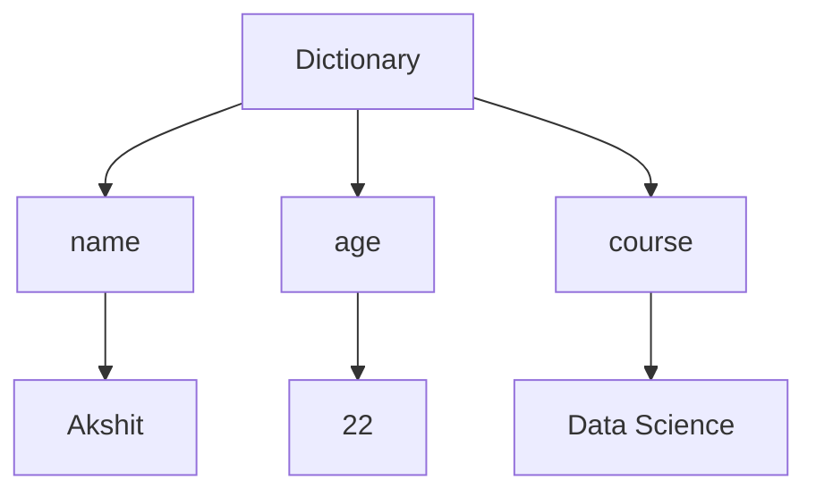
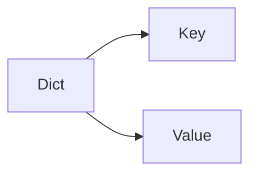

# Dictionaries in Python

## 1. Intuitive Introduction

A **Dictionary** is a data structure that stores data in **key-value pairs**.

Think about a real dictionary:
--
```text
Word → Meaning
```

Example:

```text
Apple → A fruit
Python → Programming Language
India → Country
```

Python dictionaries work exactly the same way:

```python
student = {
    "name": "Akshit",
    "age": 22,
    "course": "Data Science"
}
```

Here:

```text
"name"   → "Akshit"
"age"    → 22
"course" → "Data Science"
```

---

## Why Do Dictionaries Exist?

Imagine storing student information using a list:

```python
student = ["Akshit", 22, "Data Science"]
```

Problem:

```python
student[0]  # Name
student[1]  # Age
student[2]  # Course
```

You must remember positions.

Dictionary solves this:

```python
student["name"]
student["age"]
student["course"]
```

Much easier and readable.

---

## 2. Real-World Analogy

Think of a locker system.

```text
Locker Number → Item
```

Example:

```text
101 → Books
102 → Laptop
103 → Clothes
```

When you know locker number, retrieval is instant.

Dictionary:

```python
locker = {
    101: "Books",
    102: "Laptop",
    103: "Clothes"
}
```

Access:

```python
locker[102]
```

Output:

```python
Laptop
```

---

# 3. Core Theory

Dictionary stores:

```python
key : value
```

Example:

```python
car = {
    "brand": "Tesla",
    "model": "Model Y",
    "year": 2025
}
```

Internally Python uses a **Hash Table**.

This is why lookup is extremely fast.

Instead of searching one by one:

```text
List:
A → B → C → D → E
```

Dictionary directly jumps to the location using hashing.

---

## Internal Working


Steps:

1. Key entered
2. Hash calculated
3. Memory location found
4. Value returned

Example:

```python
student["name"]
```

Python:

```text
1. Hash("name")
2. Find memory slot
3. Return value
```

---

# 4. Syntax Breakdown

## Creating Dictionary

```python
student = {
    "name": "Akshit",
    "age": 22
}
```

Explanation:

```python
{
```

Start dictionary.

```python
"name": "Akshit"
```

Key → Value

```python
"age": 22
```

Another pair.

```python
}
```

End dictionary.

---

## Empty Dictionary

```python
student = {}
```

or

```python
student = dict()
```

---

# 5. Visual Explanation



---

# 6. Memory & Internal Working

Dictionary stores references.

```python
student = {
    "name": "Akshit"
}
```

Memory:



Dictionary object exists in memory.

Keys and values are separate objects.

---

## Mutable Object

Dictionary is mutable.

You can change values.

```python
student = {"name": "Akshit"}

student["name"] = "Rahul"
```

Output:

```python
{'name': 'Rahul'}
```

Memory address of dictionary remains same.

---

# 7. Practical Coding Examples

## Beginner Example

```python
student = {
    "name": "Akshit",
    "age": 22
}

print(student)
```

Output:

```python
{'name': 'Akshit', 'age': 22}
```

---

## Accessing Values

```python
student = {
    "name": "Akshit",
    "age": 22
}

print(student["name"])
```

Output:

```python
Akshit
```

---

## Adding New Data

```python
student = {
    "name": "Akshit"
}

student["city"] = "Ahmedabad"

print(student)
```

Output:

```python
{
'name': 'Akshit',
'city': 'Ahmedabad'
}
```

---

## Updating Data

```python
student["city"] = "Surat"
```

---

## Removing Data

```python
student.pop("city")
```

---

## Real-World Example

```python
employee = {
    "id": 101,
    "name": "Akshit",
    "salary": 50000
}

print(employee["salary"])
```

Used in HR systems, payroll systems, databases.

---

# 8. Industry Engineering Mindset

Professionals use dictionaries everywhere:

### API Response

```python
user = {
    "id": 1,
    "name": "Akshit",
    "email": "abc@gmail.com"
}
```

---

### Configuration Files

```python
config = {
    "host": "localhost",
    "port": 5000
}
```

---

### JSON Data

Most JSON data becomes Python dictionaries.

```python
{
  "name": "Akshit",
  "age": 22
}
```

---

# 9. ML & Data Science Connection

Dictionaries are heavily used in ML.

### Dataset Metadata

```python
dataset = {
    "rows": 10000,
    "columns": 20
}
```

---

### Model Parameters

```python
params = {
    "learning_rate": 0.01,
    "epochs": 100
}
```

---

### Feature Mapping

```python
encoding = {
    "Male": 0,
    "Female": 1
}
```

Used constantly in:

* NumPy
* Pandas
* Scikit-Learn
* TensorFlow
* PyTorch

---

# 10. Common Mistakes

## Mistake 1

```python
student["city"]
```

When key doesn't exist:

```python
KeyError
```

Solution:

```python
student.get("city")
```

---

## Mistake 2

Duplicate Keys

```python
student = {
    "name": "Akshit",
    "name": "Rahul"
}
```

Output:

```python
{'name': 'Rahul'}
```

Latest value overwrites previous.

---

## Mistake 3

Using Mutable Key

Wrong:

```python
d = {
    [1, 2]: "value"
}
```

Error because list is mutable.

Valid keys:

```python
str
int
float
tuple
bool
```

---

# 11. Performance Considerations

| Operation  | Complexity |
| ---------- | ---------- |
| Access     | O(1)       |
| Insert     | O(1)       |
| Update     | O(1)       |
| Delete     | O(1)       |
| Search Key | O(1)       |

Dictionary is much faster than list lookup.

Example:

```python
student["name"]
```

Fast because of hashing.

---

# 12. Debugging Mindset

Check keys before accessing:

```python
if "name" in student:
    print(student["name"])
```

Safe approach.

---

Use:

```python
print(student.keys())
```

to inspect available keys.

---

# 13. Interview Preparation

### Beginner

**1. What is a dictionary?**

Answer:
Collection of key-value pairs.

---

**2. Are dictionaries ordered?**

Answer:

Python 3.7+ preserves insertion order.

---

**3. Can dictionary keys be duplicated?**

Answer:

No.

---

**4. Are dictionaries mutable?**

Answer:

Yes.

---

**5. Difference between list and dictionary?**

Answer:

List uses indexes.

Dictionary uses keys.

---

### Intermediate

**6. What is hashing?**

Answer:

Converting a key into a hash value used to locate data quickly.

---

**7. Why are dictionaries fast?**

Answer:

Hash table implementation.

---

**8. Difference between `get()` and `[]`?**

Answer:

```python
d["x"]
```

Raises error.

```python
d.get("x")
```

Returns None.

---

### Advanced

**9. Can a tuple be a dictionary key?**

Answer:

Yes, if all elements inside tuple are hashable.

---

**10. Average lookup complexity?**

Answer:

O(1)

---

# 14. Advanced Concepts

## Dictionary Comprehension

```python
squares = {
    x: x*x
    for x in range(5)
}
```

Output:

```python
{
0:0,
1:1,
2:4,
3:9,
4:16
}
```

---

## Nested Dictionary

```python
student = {
    "name": "Akshit",
    "marks": {
        "math": 90,
        "science": 95
    }
}
```

Access:

```python
student["marks"]["math"]
```

---

# 15. Mini Project

### Student Management System

```python
students = {}

students["101"] = "Akshit"
students["102"] = "Rahul"

for roll, name in students.items():
    print(roll, name)
```

Features:

* Add student
* Remove student
* Search student
* Update student

Excellent beginner dictionary project.

---

# 16. Best Practices

✅ Use meaningful keys

```python
student_name
```

not

```python
n
```

---

✅ Use `get()`

```python
student.get("name")
```

---

✅ Use dictionary comprehensions when needed.

---

✅ Avoid deeply nested dictionaries.

---

# 17. Summary Table

| Concept            | Purpose           | Industry Usage  |
| ------------------ | ----------------- | --------------- |
| Dictionary         | Key-Value Storage | APIs            |
| get()              | Safe Lookup       | Backend         |
| items()            | Iteration         | Data Processing |
| keys()             | View Keys         | Debugging       |
| values()           | View Values       | Analytics       |
| Hashing            | Fast Search       | Databases       |
| Nested Dict        | Structured Data   | JSON            |
| Dict Comprehension | Quick Creation    | Data Pipelines  |

---

# 18. Key Takeaways

1. Dictionary stores data as **key → value** pairs.
2. Internally implemented using **hash tables**.
3. Lookup, insertion, and deletion are usually **O(1)**.
4. Dictionaries are one of the most important data structures in Python, Data Science, Backend Engineering, and Machine Learning.
5. Master:

   * `get()`
   * `keys()`
   * `values()`
   * `items()`
   * dictionary comprehension
   * nested dictionaries
6. In ML and Data Science, dictionaries are used for configurations, feature mappings, model parameters, JSON data, and API responses.

### Next Topic in Your Roadmap

**Sets → Hashing → Set Operations → Frozen Sets → Industry Use Cases → Interview Questions**.
