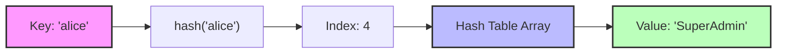
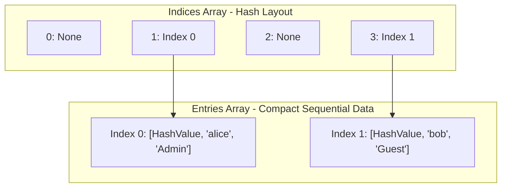

# Dictionaries in Python: The Definitive Architectural Guide

---

# 1. Intuitive Introduction

In computing, data is only as valuable as your ability to find it.

Imagine you are managing a massive user base for a web application. If you store your users in a standard ordered sequence like a list, finding a specific user profile requires scanning through the items one by one. If you have 10 million users, and the person you are looking for is at the end of the list, your application must perform 10 million comparisons just to retrieve a single profile. In computer science, we call this linear time complexity, or $O(n)$. As your data grows, your system slows down proportionally.

Python **dictionaries** (`dict`) were introduced to completely eliminate this performance bottleneck. A dictionary is an unordered, mutable collection of **key-value pairs** that provides near-instantaneous data retrieval, insertion, and deletion—regardless of whether your collection contains 10 elements or 10 million. It achieves this using a computer science marvel known as a **Hash Table**, reducing search times from linear $O(n)$ to constant time $O(1)$.

### Real-World Footprints Across Industries

Dictionaries are the backbone of modern software engineering:

* **Web Development & APIs:** Modern web communication relies heavily on JSON (JavaScript Object Notation). Python dictionaries map natively to JSON, allowing backend frameworks like FastAPI or Django to parse network requests into native Python objects instantly.
* **Database Caching:** High-speed in-memory caches like Redis store data as key-value pairs. Python applications mirror this architecture using dictionaries to temporarily hold computationally expensive database query results.
* **Data Science & Machine Learning:** When working with tabular data in Pandas or training models in PyTorch, configuration profiles, hyperparameter sets, and categorical mappings are structurally managed via Python dictionaries.

---

# 2. Real-World Analogy

To master the dictionary, visualize a **Gym Locker System**.

If you want to store your gym bag in a traditional sequence (like a list), you would have to walk down a long hallway of identical lockers, counting them one by one until you reach your assigned index (e.g., "Locker number 45"). If you forget the number, you have to open every single locker from the beginning until you find your bag.

A Python dictionary changes the rules. When you check in, the system uses a special mechanism: it takes an identifier unique to you—such as your **Fingerprint (The Key)**—and applies a deterministic rule to point you directly to a specific **Locker (The Value)**.

* You do not search through the room.
* You do not look at anyone else's locker.
* You present your key, and you are instantly routed to your designated locker.

Whether the gym has 5 lockers or 50,000, the time it takes to walk directly to your locker remains exactly the same.

---

# 3. Core Theory

A Python dictionary is a collection that maps **hashable keys** to arbitrary values. To write reliable Python software, you must understand the explicit constraints and rules governing these two components.

### 1. The Key Must Be Hashable (Immutable)

A key must be an object whose value never changes during its lifetime. This is because Python converts the key into an integer hash value to look up its memory location. If the object's value could change, its hash would change, and Python would permanently lose track of where the data is stored.

* **Allowed as keys:** `str`, `int`, `float`, `tuple` (if all elements inside the tuple are also immutable), `frozenset`.
* **Banned as keys:** `list`, `dict`, `set`.

```python
# Valid usage: Using a tuple as a composite key (e.g., GPS Coordinates)
locations = {(40.7128, -74.0060): "New York", (34.0522, -118.2437): "Los Angeles"}
print(locations[(40.7128, -74.0060)]) 
# Output: New York

# Invalid usage: Attempting to use a list as a key
try:
    bad_dict = {[1, 2]: "Invalid"}
except TypeError as e:
    print(f"Error: {e}")
# Output: Error: unhashable type: 'list'

```

### 2. Keys Must Be Unique

A dictionary cannot contain duplicate keys. If you assign a value to a key that already exists, Python overwrites the old value.

```python
user_roles = {"alice": "Admin", "bob": "Guest", "alice": "SuperAdmin"}
print(user_roles)
# Output: {'alice': 'SuperAdmin', 'bob': 'Guest'}

```

*What happened:* Python processed the keys sequentially. When it encountered the second `"alice"`, it updated the existing entry rather than creating a duplicate bucket.

### 3. Values Can Be Anything

Unlike keys, values have absolutely no restrictions. They can be mutable, immutable, primitives, deeply nested structures, functions, or even other dictionaries.

---

# 4. Concept Comparison

To understand when to use a dictionary, it helps to compare it directly against Python's other core collection types.

| Feature | Dictionary (`dict`) | List (`list`) | Set (`set`) | Tuple (`tuple`) |
| --- | --- | --- | --- | --- |
| **Data Structure** | Key-Value Pairs | Ordered Sequence | Unique Elements Only | Immutable Sequence |
| **Search Time** | $O(1)$ (Constant) | $O(n)$ (Linear) | $O(1)$ (Constant) | $O(n)$ (Linear) |
| **Duplicates** | Keys: No / Values: Yes | Yes | No | Yes |
| **Mutability** | Mutable | Mutable | Mutable | Immutable |
| **Primary Use Case** | Fast lookups via associations | Ordered, index-based tracking | Uniqueness, math set operations | Fixed records, data integrity |

---

# 5. Visual Explanation

Let's look at how Python structurally interprets a dictionary look-up. When you request a value using a key, Python does not step through the collection. It processes the key through a mathematical engine called a **Hash Function**, which outputs an array index instantly.



---

# 6. Memory & Internal Working

The internal architecture of Python's dictionary is a masterpiece of optimization.

### Level 1: The Modern Structure (Python 3.6+)

Historically, dictionaries consumed immense amounts of memory because they maintained a sparse hash table array containing keys, hashes, and values directly.

Since Python 3.6+, dictionaries are **compact and ordered by insertion**. Python separates this into two arrays:

1. **An Indices Array:** A small, sparse array containing only index numbers.
2. **An Entries Array:** A highly compact array containing the actual data (`[hash, key, value]`) in the exact order items were added.

### Level 2: Memory Visualization



### Level 3: Handling Collisions

Sometimes, two completely different keys produce the exact same hash index. This is known as a **Hash Collision**. Python resolves this using **Open Addressing with Perturbation**. If an index is already filled by another key, Python uses a deterministic formula to probe alternative indices in the array until it finds an empty slot (during insertion) or matches the exact key object identity/equality (during retrieval).

---

# 7. Creating the Object

Python offers multiple ways to construct dictionaries depending on your structural needs.

```python
# 1. Literal Syntax (Most common and highly performant)
profile = {"name": "Elena", "age": 28}

# 2. The dict() Constructor (Uses keyword arguments)
config = dict(host="localhost", port=8080)

# 3. Conversion from Iterables (List of tuples/pairs)
pairs = [("status", 200), ("message", "Success")]
api_response = dict(pairs)

# 4. Dictionary Comprehension (Dynamically building collections)
squares = {x: x**2 for x in range(1, 5)}
print(squares) # Output: {1: 1, 2: 4, 3: 9, 4: 16}

# 5. Creating with default values from an iterable
keys = ['cpu', 'memory', 'disk']
metrics = dict.fromkeys(keys, 0)
print(metrics) # Output: {'cpu': 0, 'memory': 0, 'disk': 0}

```

---

# 8. Core Operations & Methods

Here are the essential operations required to manage dictionaries in production systems.

### 1. Safe Access (`get()`)

* **Purpose:** Avoids throwing a `KeyError` if a key does not exist.
* **Time Complexity:** $O(1)$

```python
user = {"name": "Carlos"}
# Fallback smoothly to a default value if key isn't present
role = user.get("role", "Standard User")
print(role) # Output: Standard User

```

### 2. Modifying and Merging (`update()`)

* **Purpose:** Updates the dictionary with key-value pairs from another dictionary or iterable.
* **Time Complexity:** $O(k)$ where $k$ is the number of elements being added.

```python
settings = {"theme": "light", "notifications": True}
settings.update({"theme": "dark", "fontSize": 14})
print(settings) # Output: {'theme': 'dark', 'notifications': True, 'fontSize': 14}

```

### 3. Safe Extraction (`pop()`)

* **Purpose:** Removes a key and returns its value. If the key isn't found, it returns a default value rather than crashing.

```python
inventory = {"apples": 10, "oranges": 5}
item_count = inventory.pop("bananas", 0)
print(item_count) # Output: 0

```

---

# 9. Advanced Concepts

### The Power of `defaultdict`

When building analytics tools, you frequently need to group data. A standard dictionary throws a `KeyError` if you try to mutate a key that hasn't been instantiated yet. `collections.defaultdict` solves this cleanly.

```python
from collections import defaultdict

# Automatically creates a list if the key is missing
user_actions = defaultdict(list)

user_actions["user_1"].append("click_login")
user_actions["user_2"].append("view_homepage")
user_actions["user_1"].append("click_checkout")

print(dict(user_actions))
# Output: {'user_1': ['click_login', 'click_checkout'], 'user_2': ['view_homepage']}

```

---

# 10. Mathematical / Special Operations

Python 3.9 introduced the **Merge (`|`)** and **Update (`|=`)** dictionary operators, providing a highly expressive syntax for combining mappings.

```python
default_config = {"host": "127.0.0.1", "port": 8000, "debug": True}
user_overrides = {"port": 9000, "debug": False}

# The pipe operator merges and prefers values from the right-hand operand
final_config = default_config | user_overrides
print(final_config)
# Output: {'host': '127.0.0.1', 'port': 9000, 'debug': False}

```

---

# 11. Real Practical Examples

### Example 1: Simple Frequency Tracker (Basic)

```python
def count_words(text: str) -> dict:
    words = text.lower().split()
    counter = {}
    for word in words:
        counter[word] = counter.get(word, 0) + 1
    return counter

print(count_words("Data science uses data to build systems"))
# Output: {'data': 2, 'science': 1, 'uses': 1, 'to': 1, 'build': 1, 'systems': 1}

```

### Example 2: Nested Configuration Hydration (Intermediate Software Engineering)

```python
def deep_merge(base: dict, overrides: dict) -> dict:
    """Recursively merges nested dictionaries."""
    for key, value in overrides.items():
        if isinstance(value, dict) and key in base and isinstance(base[key], dict):
            deep_merge(base[key], value)
        else:
            base[key] = value
    return base

app_config = {"db": {"host": "localhost", "pool": 5}, "logging": "INFO"}
prod_patch = {"db": {"pool": 20}, "logging": "WARNING"}

print(deep_merge(app_config, prod_patch))
# Output: {'db': {'host': 'localhost', 'pool': 20}, 'logging': 'WARNING'}

```

### Example 3: In-Memory Token Bucket Rate Limiter (Production Quality)

```python
import time

class RateLimiter:
    """Tracks API client requests using an in-memory dictionary."""
    def __init__(self, max_requests: int, window_seconds: int):
        self.max_requests = max_requests
        self.window_seconds = window_seconds
        self.client_records = {} # Format: {client_ip: [timestamps]}

    def is_allowed(self, client_ip: str) -> bool:
        current_time = time.time()
        
        if client_ip not in self.client_records:
            self.client_records[client_ip] = [current_time]
            return True
            
        # Filter out timestamps outside our moving history window
        timestamps = [t for t in self.client_records[client_ip] if current_time - t < self.window_seconds]
        self.client_records[client_ip] = timestamps
        
        if len(timestamps) < self.max_requests:
            self.client_records[client_ip].append(current_time)
            return True
        return False

# Execution simulation
limiter = RateLimiter(max_requests=2, window_seconds=60)
print(limiter.is_allowed("192.168.1.1")) # Output: True
print(limiter.is_allowed("192.168.1.1")) # Output: True
print(limiter.is_allowed("192.168.1.1")) # Output: False (Rate limited)

```

---

# 12. Machine Learning & Data Science Connection

In modern AI workflows, dictionaries serve as the data-binding layer between raw Python environments and low-level C++ tensor engines.

### 1. Token Mappings in NLP (Hugging Face / PyTorch Style)

Before text can be processed by large language models, strings must be mapped to specific matrix index IDs using tokenization dictionaries.

```python
# Mappings constructed during training
vocab = {"<PAD>": 0, "<UNK>": 1, "machine": 2, "learning": 3}

def tokenize(sentence: list[str]) -> list[int]:
    # Translate raw tokens into tensor array coordinate IDs efficiently via O(1) lookups
    return [vocab.get(token, vocab["<UNK>"]) for token in sentence]

print(tokenize(["machine", "intelligence"])) 
# Output: [2, 1] ("intelligence" falls back smoothly to <UNK>)

```

### 2. Hyperparameter Optimization & Model Loading

Training frameworks use dictionaries to cleanly group variables, parse logs, and serialize architecture weights.

```python
# Model Configurations passed to optimizers
hyperparameters = {
    "learning_rate": 0.001,
    "batch_size": 64,
    "architecture": "Transformer",
    "layers": [512, 256, 128]
}

```

---

# 13. Common Mistakes & Pitfalls

### 1. Mutating a Dictionary While Iterating Over It

* **Wrong Code:**
```python
metrics = {"cpu": 90, "memory": 40, "disk": 15}
for key, value in metrics.items():
    if value < 50:
        del metrics[key]  # Raises RuntimeError

```


* **Why it happens:** Python's internal iterator structure gets broken if you change the internal keys array size while looping through it.
* **Correction:** Loop over a static copy of the keys instead.
```python
for key in list(metrics.keys()):
    if metrics[key] < 50:
        del metrics[key]

```


### 2. Using Dangerous Mutable Defaults (e.g., `[]`) with `dict.fromkeys`

* **Wrong Code:**
```python
groups = dict.fromkeys(["group_A", "group_B"], [])
groups["group_A"].append("User1")
print(groups) 
# Output: {'group_A': ['User1'], 'group_B': ['User1']} -> Both groups updated!

```


* **Why it happens:** Python references the *exact same memory address* for the list `[]` across all keys. Modifying one updates all of them.
* **Correction:** Use a dictionary comprehension to construct unique list allocations in memory.
```python
groups = {key: [] for key in ["group_A", "group_B"]}

```


---

# 14. Performance Considerations

| Operation | Average Case | Worst Case | Technical Explanation |
| --- | --- | --- | --- |
| **Lookup (`dict[key]`)** | $O(1)$ | $O(n)$ | Worst case occurs if the hash function is poor, causing massive internal collisions. |
| **Insertion (`dict[key] = val`)** | $O(1)$ | $O(n)$ | Amortized constant time. Occasional $O(n)$ overhead happens when the internal array resizes. |
| **Deletion (`del dict[key]`)** | $O(1)$ | $O(n)$ | Direct address indexing via key hash. |

> **Memory Warning:** Dictionaries trade memory efficiency for computational speed. Because they use a sparse index layout to avoid hash collisions, dictionaries consume significantly more RAM than compact arrays or tuples. If memory is highly constrained, store data structures using alternative models.

---

# 15. When NOT to Use This Concept

1. **Strict Order Requirements (Prior to Index Needs):** If your primary goal is to retain an ordered list of items that change position frequently (e.g., a priority queue), a `list` or `collections.deque` is much better suited.
2. **Memory-Constrained Hardware Arrays:** When storing millions of raw numbers (e.g., matrix processing), a `dict` introduces heavy object wrapper overhead. Use a **NumPy array** instead, which stores raw unboxed values adjacent to each other in memory.
3. **Static Multi-field Data Records:** If you are defining an unchanging record schema (e.g., a database row with `first_name`, `last_name`), a `dataclass` or a `NamedTuple` reduces memory use and provides cleaner code autocompletion.

---

# 16. Interview Questions

### Beginner Level

1. **What happens if you use a mutable object (like a list) as a key in a dictionary?**
* *Answer:* Python raises a `TypeError: unhashable type: 'list'`. Keys must implement the `__hash__` method to generate a deterministic memory pointer. Because a list can change size or values, its hash value would change, breaking the lookup engine.


2. **How does `dict.get('key')` differ from using bracket notation `dict['key']`?**
* *Answer:* Bracket notation raises a `KeyError` if the key isn't in the dictionary. `get()` handles missing keys gracefully by returning `None` (or a fallback value you specify) instead of crashing the program.


3. **Are dictionaries ordered in Python?**
* *Answer:* Yes, since Python 3.7+, dictionaries preserve insertion order as part of the official language specification.


4. **How do you merge two dictionaries in Python 3.9+ without modifying either original object?**
* *Answer:* Use the merge pipe operator: `merged_dict = dict1 | dict2`.


5. **How can you check if a key exists within a dictionary?**
* *Answer:* Use the `in` operator: `if "target_key" in my_dict:`. This runs in optimal constant time ($O(1)$).


---

### Intermediate Level

6. **Explain the memory optimization strategy introduced to dictionaries in Python 3.6/3.7.**
* *Answer:* Previously, dictionaries stored data in a single large sparse table, which left empty gaps of memory between rows. Modern Python decouples this into two arrays: a sparse array of small integers (`indices`) and a dense array containing the actual key-value-hash packets sequential to how they were added. This reduces memory usage by up to 20% to 25%.


7. **What is a Hash Collision, and how does CPython handle it?**
* *Answer:* A hash collision occurs when two distinct keys generate the exact same index location. CPython resolves this using open addressing with a specific pseudo-random probing formula that checks alternative indices until an empty index slot or a key match is found.


8. **What is the difference between `dict.pop('key')` and `del dict['key']`?**
* *Answer:* Both remove the entry from memory. However, `pop()` isolates and returns the value of the removed key, and lets you specify a fallback return value if the key is missing. `del` is a keyword command that deletes the item in place and throws a `KeyError` if the key doesn't exist.


9. **Why can a tuple containing a list not be used as a dictionary key?**
* *Answer:* A tuple is immutable on its own, but hashability requires *deep immutability*. If a tuple contains a mutable list, changes to that list change the tuple's structural equality, which invalidates its hash state.


10. **How does `collections.defaultdict` optimize value instantiation?**
* *Answer:* It accepts a factory function (like `list`, `int`, `set`) upon initialization. If a requested key doesn't exist, it implicitly runs the factory function to assign a default value to the key, avoiding manual `if key not in dict:` validation checks.


---

### Advanced Level

11. **Explain the relationship between the `__eq__` method and the `__hash__` method when creating a custom object to be used as a dictionary key.**
* *Answer:* For an object to safely act as a key, if `obj1 == obj2` (evaluated via `__eq__`), then `hash(obj1) == hash(obj2)` *must* evaluate to true. If two equal objects produced different hashes, Python would route them to different buckets, creating duplicate logical entries.


12. **What is the time complexity of dictionary adjustments when a dictionary triggers an internal resize operation?**
* *Answer:* Normally, insertions run in $O(1)$. However, when the dictionary fills to roughly 2/3 of its current capacity, CPython allocates a larger table and rehashes the existing keys into the new layout. This isolated event takes $O(n)$ time, but amortizes down to $O(1)$ over the lifecycle of the application.


13. **How would you implement a custom class that allows instance variables to be queried dynamically like a dictionary?**
* *Answer:* Implement the magic method `__getitem__(self, key)`. This allows you to route square-bracket string calls directly into internal properties or lookups.


14. **Given a dictionary containing thousands of elements, what is the most memory-efficient way to iterate over its values without instantiating a new list container?**
* *Answer:* Use `.values()` or `.items()`. In Python 3, these methods return dynamic **view objects** that read directly from the dictionary's internal memory buffer without copying the elements into a new list container.


15. **How can you leverage `dict` properties to efficiently implement a thread-safe object cache with an execution timeout?**
* *Answer:* Wrap the dictionary operations inside a thread lock using `threading.Lock()`. Pair the primary value tuple with an expiration timestamp: `cache[key] = (value, expire_time)`. When reading, compare the timestamp against `time.time()` to determine whether to return the value or drop it.


---

# 17. Mini Project: Transaction Fraud Detection Engine

This production-inspired analytics engine tracks credit card transactions by account ID using a rolling time window to flag rapid duplicate actions.

```python
import time
from collections import defaultdict

class FraudEngine:
    def __init__(self, velocity_threshold_secs: int = 5):
        # Maps account numbers to a list of historical transaction timestamps
        self.history = defaultdict(list)
        self.velocity_threshold = velocity_threshold_secs

    def process_transaction(self, account_id: str, amount: float) -> dict:
        """Processes a transaction and flags potential fraud based on transaction speed."""
        current_time = time.time()
        timestamps = self.history[account_id]
        
        # Filter down to transactions within our recent analysis window
        active_window = [t for t in timestamps if current_time - t < self.velocity_threshold]
        self.history[account_id] = active_window
        
        is_flagged = False
        reason = "Clear"
        
        if len(active_window) >= 3:
            is_flagged = True
            reason = f"High Velocity Warning: {len(active_window)} transactions within {self.velocity_threshold} seconds."
            
        # Log the current valid entry
        self.history[account_id].append(current_time)
        
        return {
            "account_id": account_id,
            "amount": amount,
            "fraud_alert": is_flagged,
            "reason": reason
        }

# Execution Pipeline Test
engine = FraudEngine(velocity_threshold_secs=3)

# Simulating rapid user card swipes
print(engine.process_transaction("acc_8891", 45.00))
print(engine.process_transaction("acc_8891", 12.50))
print(engine.process_transaction("acc_8891", 900.00))
# The 4th rapid transaction triggers the safety flag
print(engine.process_transaction("acc_8891", 5.00)) 

```

---

# 18. Best Practices

1. **Prefer `.get()` Over Manual Validation Checks:** Instead of writing `if 'key' in d: val = d['key'] else: val = 0`, write `val = d.get('key', 0)`. It is cleaner, faster, and idiomatic.
2. **Leverage Dictionary Comprehensions:** Use comprehensions instead of manually looping to transform values. This shifts processing logic into CPython's optimized underlying runtime.
3. **Ensure Keys Are Deeply Immutable:** Never use tuples containing internal lists as keys. If a nested element is mutated, the lookup logic breaks.
4. **Avoid Over-nesting:** If your values are dictionaries containing other dictionaries three or four levels deep, move that data into clean structural definitions like `dataclasses` or defined system objects.
5. **Use `KeyError` Catching for High-Performance Paths:** If you expect a key to be present 99% of the time, wrapping access in a `try/except KeyError` block runs faster than checking with `in` or `.get()` every single time.

---

# 19. Summary Table

| Concept Component | Core Purpose | Core Mechanics | Primary Advantage | Major Limitation |
| --- | --- | --- | --- | --- |
| **Dictionary (`dict`)** | Fast key-value association mapping | Hash tables with decoupled indexing | Instantaneous $O(1)$ lookups | Consumes significant memory footprint |
| **`defaultdict`** | Grouping datasets without key checks | Automated factory default constructor | Eliminates manual value initialization | Requires initializing factory functions |
| **View Objects (`.items()`)** | Dynamic dictionary stream tracking | Direct reference mapping | Zero memory overhead overhead | Cannot mutate size during loops |

---

# 20. Key Takeaways

* **Speed Isolation:** Dictionaries perform lookups, updates, and deletes in constant time ($O(1)$) regardless of size.
* **The Hashing Anchor:** Keys must be immutable and hashable to ensure they map to a stable, reliable index location.
* **Order Preservation:** Modern Python versions retain the exact order items were added.
* **Memory Overhead Trade-off:** Dictionaries use more memory than lists to keep lookup speeds high.
* **Safe Defaults:** Use `.get()` and `.pop()` to provide graceful fallback values and prevent unhandled application errors.
* **Machine Learning Foundation:** Dictionaries act as the configuration layer that translates real-world text and data into tensor formats.

---