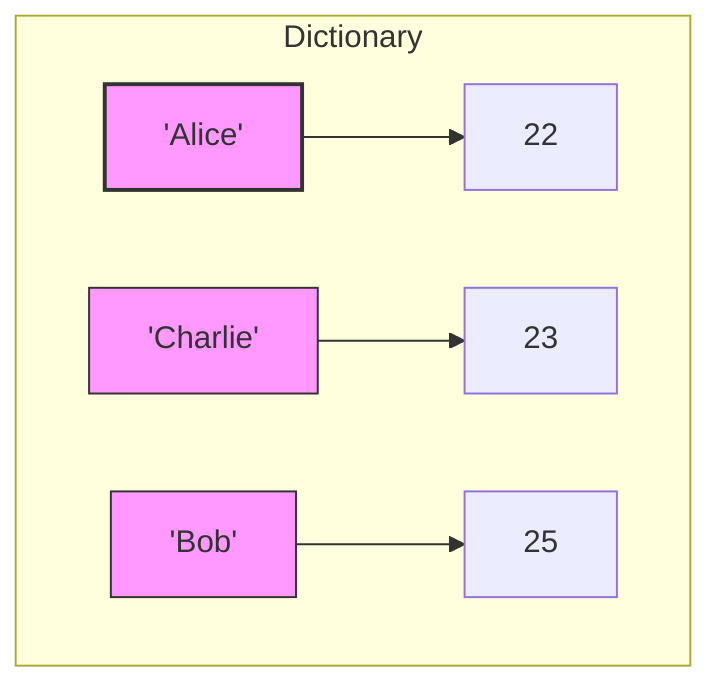
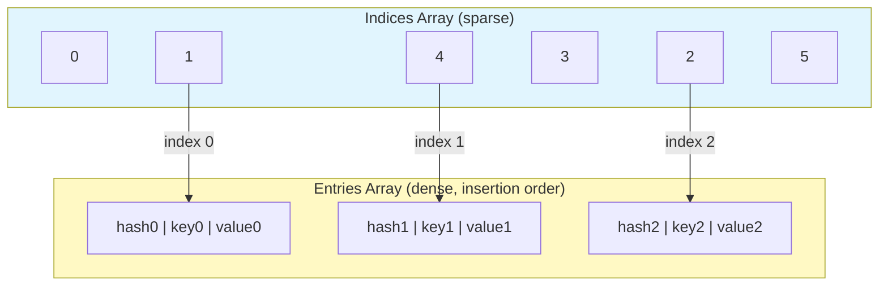

# 📘 Python Dictionaries: The Ultimate Key–Value Powerhouse

## 1. Intuitive Introduction

Imagine you have a real‑life **contacts book** – you look up a person’s name (the *key*) and instantly find their phone number (the *value*). You don’t need to scan every page; the name directly points to the number.

In Python, a **dictionary** does exactly that: it stores **key‑value pairs** and provides lightning‑fast lookup by key. Dictionaries are everywhere in real software development:

- **Student project** – storing grades: `{"Alice": 85, "Bob": 92}`
- **Data science** – mapping category names to numeric codes for machine learning
- **Web dev** – JSON responses from APIs are essentially nested dictionaries
- **Caching/memoization** – remembering expensive function results based on input arguments

Why do we need dictionaries? Because lists and tuples use *position* (0,1,2…) to access data, which is meaningless when we want to retrieve data by a *name*, *ID*, or any meaningful label. Dictionaries bring **human‑readable indexing**.

---

## 2. Real‑World Analogy

**The Hotel Locker System** 🗄️

A hotel has a wall of lockers, each with a unique **key tag** (e.g., "Room 204", "VIP Guest", "Basketball Team").  
- You give the receptionist a key tag, and they instantly hand you the correct locker (O(1) time).  
- You can put any item inside – numbers, strings, even another locker (nested dict).  
- You can change the contents without changing the key tag.  
- But you cannot have two lockers with the same key tag – keys must be unique.  
- And you can’t use a wet, crumpled paper as a key tag – keys must be *hashable* (immutable and stable).

That’s Python dict: a collection of **unique keys** (hashable) each mapping to **any value** (mutable allowed).

---

## 3. Core Theory

A dictionary is an **unordered** (historically) but **ordered** (since Python 3.7+) collection of key‑value pairs.  
**Properties:**

| Property | Meaning | Example |
|----------|---------|---------|
| **Ordered** | Iteration preserves insertion order | `{"a":1, "b":2}` → always yields `'a'` then `'b'` |
| **Mutable** | Can add, remove, change values | `d["key"] = "new value"` |
| **Keys must be hashable** | Immutable types: `int`, `float`, `str`, `tuple`, `frozenset`; not `list`, `dict`, `set` | `{(1,2): "ok"}` works; `{[1,2]: "no"}` raises `TypeError` |
| **Values can be anything** | Any Python object, mutable or not | `d["func"] = lambda x: x**2` |
| **Unique keys** | If same key assigned twice, last overwrites | `{"x":1, "x":2}` → `{"x":2}` |
| **Dynamic sizing** | Grows and shrinks automatically | no need to pre‑allocate size |

**Code demonstration of properties:**

```python
# Ordered insertion (Python 3.7+)
d = {}
d["first"] = 1
d["second"] = 2
d["third"] = 3
print(list(d.keys()))   # ['first', 'second', 'third']

# Mutable
d["first"] = 100        # change
d["new"] = 400          # add
del d["second"]         # delete
print(d)                # {'first': 100, 'third': 3, 'new': 400}

# Hashable keys – tuple works
d[(1, 2)] = "coordinate"
print(d[(1, 2)])        # 'coordinate'

# Unhashable key – fails
try:
    d[[1, 2]] = "list key"
except TypeError as e:
    print("Error:", e)   # unhashable type: 'list'
```

---

## 4. Visual Explanation – How a Dictionary Looks

The diagram below shows a dictionary mapping student names to ages. Each key points to a value, and the order is preserved.



In reality, the dictionary is a **hash table** – the keys are not stored as a simple linked list but scattered in an array based on their hash.

---

## 5. Memory & Internal Working (CPython)

CPython’s dictionary uses a **combined table** (since Python 3.6) consisting of:

- **Indices array** – sparse array of integers (each is an index into the entries array)
- **Entries array** – stores `(hash, key, value)` in insertion order

When you look up `d["name"]`:
1. Compute hash of `"name"` → `h`
2. Use `h % len(indices)` to find a starting position
3. Probe (linear probing with pseudo‑random perturbation) until matching key found or empty slot
4. Return the value

**Resizing:** When the dictionary is about 2/3 full (`load factor > 0.66`), it grows by roughly 4× (for small dicts) or 2× (for large), rehashing all entries.

Below is a conceptual diagram of the internal structure:



**Key memory takeaway:** The sparse indices array gives O(1) average lookup, while the dense entries array preserves insertion order for iteration.

---

## 6. Creating Dictionaries

| Method | Code | Result |
|--------|------|--------|
| Empty dict | `d = {}` | `{}` |
| `dict()` constructor | `d = dict()` | `{}` |
| Key‑value literals | `d = {"a":1, "b":2}` | `{'a':1, 'b':2}` |
| From list of tuples | `d = dict([("a",1), ("b",2)])` | same |
| Using `zip` | `d = dict(zip(["a","b"],[1,2]))` | same |
| `fromkeys()` | `d = dict.fromkeys(["x","y"], 0)` | `{'x':0, 'y':0}` |
| Dict comprehension | `d = {x: x**2 for x in range(3)}` | `{0:0, 1:1, 2:4}` |

**Common mistakes:**

```python
# ❌ Mistake 1: Using a list as key
d = {[1,2]: "value"}   # TypeError

# ❌ Mistake 2: Forgetting that fromkeys shares same mutable object
d = dict.fromkeys([1,2,3], [])   # all keys point to the SAME list
d[1].append("oops")
print(d[2])   # ['oops'] – unintended!

# ✅ Correct: use comprehension for unique copies
d = {k: [] for k in [1,2,3]}

# ❌ Mistake 3: Confusing dict() keyword argument form (keys must be valid identifiers)
d = dict(1="one")     # SyntaxError
d = dict(one=1)       # OK, but key is string 'one'
```

---

## 7. Core Operations & Methods

### Access and Assignment

```python
d = {"apple": 5, "banana": 7}

# Direct access – raises KeyError if missing
print(d["apple"])          # 5

# Safe access with get()
print(d.get("orange"))     # None
print(d.get("orange", 0))  # 0

# Assignment – adds or updates
d["orange"] = 12
d["apple"] = 10
```

### Removal

```python
# pop() – removes and returns value, with optional default
val = d.pop("banana")      # returns 7, key removed
val = d.pop("grape", 0)    # returns 0, no error

# popitem() – removes and returns last inserted (LIFO order)
last = d.popitem()         # returns ('orange', 12)

# del statement
del d["apple"]              # if key missing → KeyError

# clear() – remove all items
d.clear()                   # {}
```

### View Objects (dynamic)

```python
d = {"a": 1, "b": 2}
keys = d.keys()        # dict_keys(['a', 'b'])
values = d.values()    # dict_values([1, 2])
items = d.items()      # dict_items([('a',1), ('b',2)])

# views update when dict changes
d["c"] = 3
print(list(keys))      # ['a', 'b', 'c']  – live view
```

### Iteration

```python
# over keys (default)
for k in d:
    print(k)

# over values
for v in d.values():
    print(v)

# over key‑value pairs
for k, v in d.items():
    print(f"{k} -> {v}")
```

### Updating / Merging

```python
d1 = {"a": 1, "b": 2}
d2 = {"b": 3, "c": 4}

# update() – modifies d1 in place
d1.update(d2)          # d1 becomes {'a':1, 'b':3, 'c':4}

# Python 3.9+ merging |
merged = d1 | d2       # new dict, rightmost wins
d1 |= d2               # in‑place update (like update)
```

### setdefault – atomic get + set

```python
d = {}
# If 'count' missing, set to 0 and return 0
val = d.setdefault('count', 0)   # val=0, d={'count':0}
val = d.setdefault('count', 10)  # val=0 (existing), d unchanged
```

---

## 8. Advanced Concepts

### Dictionary Comprehensions

```python
# Square numbers
squares = {x: x*x for x in range(5)}
# {0:0, 1:1, 2:4, 3:9, 4:16}

# Filtering
even_squares = {x: x*x for x in range(10) if x % 2 == 0}
```

### Nested Dictionaries

```python
students = {
    "Alice": {"age": 22, "major": "CS", "grades": [88, 92]},
    "Bob":   {"age": 21, "major": "Math", "grades": [85, 89]}
}
print(students["Alice"]["grades"][1])   # 92
```

### Unpacking and Packing

```python
# Merge dictionaries with ** (Python 3.5+)
base = {"x": 1, "y": 2}
extra = {"y": 3, "z": 4}
merged = {**base, **extra}   # {'x':1, 'y':3, 'z':4}

# Function keyword arguments
def greet(name, age):
    print(f"{name} is {age}")
data = {"name": "John", "age": 30}
greet(**data)                # unpack dict as keyword args
```

### Using `defaultdict` for automatic missing keys

```python
from collections import defaultdict

# Auto‑initialize with list
dd = defaultdict(list)
dd["fruits"].append("apple")  # no KeyError
print(dd)   # {'fruits': ['apple']}

# With int for counting
counts = defaultdict(int)
for letter in "abracadabra":
    counts[letter] += 1
```

### Using `Counter` for frequency counting

```python
from collections import Counter
word = "mississippi"
freq = Counter(word)
print(freq)          # Counter({'i':4, 's':4, 'p':2, 'm':1})
print(freq.most_common(2))  # [('i',4), ('s',4)]
```

---

## 9. Mathematical / Special Operations

While dictionaries themselves don’t support arithmetic, their **keys** and **views** support set‑like operations:

```python
d1 = {"a":1, "b":2, "c":3}
d2 = {"b":20, "c":30, "d":40}

# Keys as sets
common_keys = d1.keys() & d2.keys()        # {'b','c'}
keys_only_in_d1 = d1.keys() - d2.keys()    # {'a'}
union_keys = d1.keys() | d2.keys()         # {'a','b','c','d'}

# Items (key‑value pairs) can be intersected (Python 3.10+)
common_items = d1.items() & d2.items()     # set() because values differ
```

**Dictionary union (`|`)** – new in 3.9 – acts like mathematical union with last‑seen wins.

```python
merged = d1 | d2   # {'a':1, 'b':20, 'c':30, 'd':40}
```

---

## 10. Real Practical Examples

### Example 1: Word Frequency Counter

```python
def word_frequencies(text):
    """Return dict of word -> count, ignoring case and punctuation."""
    # Clean text
    for punc in ".,!?;:":
        text = text.replace(punc, "")
    words = text.lower().split()
    
    freq = {}
    for word in words:
        freq[word] = freq.get(word, 0) + 1
    return freq

sample = "To be or not to be, that is the question."
print(word_frequencies(sample))
# {'to':2, 'be':2, 'or':1, 'not':1, 'that':1, 'is':1, 'the':1, 'question':1}
```

### Example 2: LRU‑like Caching with Dictionary (Memoization)

```python
def memoize_fib():
    """Return fibonacci function with cache."""
    cache = {0: 0, 1: 1}
    
    def fib(n):
        if n not in cache:
            cache[n] = fib(n-1) + fib(n-2)
        return cache[n]
    return fib

fib = memoize_fib()
print(fib(40))  # 102334155 – computes instantly after caching
```

---

## 11. ML & Data Science Connection

Dictionaries are the **backbone of data representation** in Python’s scientific ecosystem.

### NumPy – Structured arrays with field names (dict-like)

```python
import numpy as np
dt = np.dtype([('name', 'U10'), ('score', 'f4')])
data = np.array([('Alice', 85.5), ('Bob', 92.0)], dtype=dt)
# Access by field name: data['score']
```

### Pandas – Dictionaries to create DataFrames

```python
import pandas as pd
df = pd.DataFrame({
    'Name': ['Alice', 'Bob', 'Charlie'],
    'Age': [25, 30, 35],
    'Salary': [50000, 60000, 70000]
})
# Each column name is a key mapping to a Series
```

### Scikit‑learn – Hyperparameter dictionaries

```python
from sklearn.ensemble import RandomForestClassifier
params = {
    'n_estimators': 100,
    'max_depth': 5,
    'random_state': 42
}
model = RandomForestClassifier(**params)   # unpack dict to kwargs
```

### TensorFlow / PyTorch – Configuration and state dicts

```python
# PyTorch model state (weights) is a dict
import torch
model = torch.nn.Linear(10, 2)
state = model.state_dict()   # dict of parameter names -> tensors
```

### Data pipelines – Mapping categorical features

```python
# Encode city names to integers for ML
city_mapping = {"New York": 0, "London": 1, "Tokyo": 2}
df['city_code'] = df['city'].map(city_mapping)
```

---

## 12. Common Mistakes & Pitfalls

| Mistake | Wrong Code | Consequence | Fix |
|---------|------------|-------------|-----|
| **Using mutable default argument** | `def add(d={}): d['x']=1` | Dictionary persists across calls | Use `None` and create new inside |
| **Modifying dict while iterating** | `for k in d: if cond: del d[k]` | `RuntimeError` or skipped items | Iterate over `list(d.keys())` |
| **Assuming order before 3.7** | Relying on insertion order | Undefined behavior in older Python | Use `OrderedDict` for compatibility |
| **Using `= {}` to copy** | `d2 = d1` changes both | Accidental mutation | Use `d2 = d1.copy()` or `dict(d1)` |
| **KeyError on missing key** | `value = d["missing"]` | Program crashes | Use `d.get("missing", default)` |
| **Hashable misunderstanding** | `d[[1,2]] = 3` | `TypeError` | Convert to tuple: `d[(1,2)] = 3` |

**Example of iteration mistake and fix:**

```python
d = {"a":1, "b":2, "c":3}
# ❌ WRONG – RuntimeError: dictionary changed size during iteration
for k in d:
    if k == "b":
        del d[k]

# ✅ CORRECT – iterate over a copy of keys
for k in list(d.keys()):
    if k == "b":
        del d[k]
print(d)   # {'a':1, 'c':3}
```

---

## 13. Performance Considerations

Time complexity for common operations (average case):

| Operation | Big O | Explanation |
|-----------|-------|-------------|
| `d[key]` (get/set) | **O(1)** | Hash + probe; constant time |
| `del d[key]` | O(1) | Similar to lookup |
| `key in d` | O(1) | Hash lookup |
| Iteration (keys/values/items) | O(n) | Visits every entry |
| `d.copy()` | O(n) | Copies all entries |
| `d.update(other)` | O(len(other)) | Inserts each item |
| `d.popitem()` | O(1) | Removes last entry (compact) |

**Worst‑case** (hash collisions, e.g., many keys with same hash): O(n).  
But Python’s hash randomization and probing make worst‑case extremely rare.

**Space complexity:** Approximately 2–3× overhead per entry (indices + entries).  
For 1 million items, ~50–80 MB depending on key/value sizes.

**When to avoid dictionaries:**
- Need numeric indexing (use list/array)
- Very large data requiring compact memory (use `array` or `pandas`)
- Keys are sequential integers (list is faster)

---

## 14. Interview Questions

### Beginner (5 questions)

1. **Q:** How do you safely get a value from a dict without risking a KeyError?  
   **A:** Use `d.get(key, default)`.

2. **Q:** Can a dictionary have two identical keys?  
   **A:** No, later assignment overwrites the earlier one.

3. **Q:** What types can be used as dictionary keys?  
   **A:** Any hashable (immutable) type: int, float, str, tuple, frozenset. Not list, set, dict.

4. **Q:** Write a one‑liner to invert a dictionary `{1:'a',2:'b'}` to `{'a':1,'b':2}` (assume unique values).  
   **A:** `{v: k for k, v in d.items()}`.

5. **Q:** How to check if a key exists without accessing it?  
   **A:** Use `key in d` (returns `True`/`False`).

### Intermediate (5 questions)

1. **Q:** Why does `dict.fromkeys([1,2], [])` cause all keys to share the same list? How to fix?  
   **A:** The second argument is evaluated once. Fix with dict comprehension: `{k: [] for k in [1,2]}`.

2. **Q:** Explain the difference between `d1.update(d2)` and `d1 = {**d1, **d2}`.  
   **A:** `update()` modifies `d1` in place. `{**d1, **d2}` creates a new dict.

3. **Q:** What is the time complexity of `d[key]` and why?  
   **A:** Average O(1) due to hash table; worst-case O(n) if many hash collisions.

4. **Q:** How does Python guarantee insertion order since 3.7?  
   **A:** The internal entries array stores items in insertion order; the indices array points into it.

5. **Q:** Write a function to merge two dicts, summing values for common keys.  
   **A:** `{k: d1.get(k,0) + d2.get(k,0) for k in set(d1) | set(d2)}`

### Advanced (5 questions)

1. **Q:** Implement a thread‑safe dictionary with read‑write lock using `threading.RLock`.  
   **A:** (Outline) Use `RLock` to protect all operations; or use `concurrent.futures`.

2. **Q:** How does CPython handle hash collisions in dict?  
   **A:** Open addressing with pseudo‑random probing (perturb). Each slot has a `dk_inde`; if occupied, compute next index with `perturb >>= 5` and `j = (5*j + 1 + perturb) & mask`.

3. **Q:** Why are dictionary keys required to be hashable? Give a scenario where unhashable keys would break.  
   **A:** Hash table relies on hash value to locate slot. If a key’s hash changes after insertion (e.g., mutating a list key), the dict can no longer find it.

4. **Q:** Design a custom class that can be used as a dict key, overriding `__hash__` and `__eq__`.  
   **A:** Immutable class with frozen attributes; implement `__hash__` using `hash((attr1, attr2))`.

5. **Q:** Explain the internal difference between Python dict and `collections.OrderedDict` before 3.7.  
   **A:** Before 3.7, dict was unordered (hash table iteration). OrderedDict used a doubly linked list to remember order, costing more memory. Now dict natively ordered, but OrderedDict still offers extra methods like `move_to_end`.

---

## 15. Mini Project Idea

**Project: In‑Memory Key‑Value Store with TTL (Time‑To‑Live)**

Build a simple Redis‑like store that supports:
- `set(key, value, ttl_seconds=None)` – store value, optionally with expiration
- `get(key)` – return value if not expired, else None
- `delete(key)`
- Automatic cleanup of expired keys on access or periodic sweep

**Concepts practiced:** dictionaries, storing tuples `(value, expiry_time)`, `time.time()`, lazy deletion.

**Sample skeleton:**

```python
import time

class TTLCache:
    def __init__(self):
        self._store = {}
    
    def set(self, key, value, ttl=None):
        expiry = time.time() + ttl if ttl is not None else float('inf')
        self._store[key] = (value, expiry)
    
    def get(self, key):
        if key not in self._store:
            return None
        value, expiry = self._store[key]
        if time.time() > expiry:
            del self._store[key]
            return None
        return value
```

**Extension:** Add `cleanup()` method that removes all expired keys; implement `__len__` and iteration over alive keys.

---

## 16. Best Practices

1. **Use `get()` for safe access** instead of catching `KeyError` – it’s clearer and faster.
2. **Prefer `defaultdict` or `setdefault`** when accumulating values (e.g., lists, counts).
3. **Iterate over `items()`** when you need both key and value – avoid looking up by key again.
4. **Use dictionary comprehensions** for readable transformations instead of manual loops.
5. **Be careful with mutable default arguments** – use `None` and initialize inside function.
6. **Copy with `copy()` or `dict()`** – not assignment – when you need an independent copy.

```python
# Good pattern for function with mutable default
def process(data, cache=None):
    if cache is None:
        cache = {}
    # ... use cache
```

---

## 17. Summary Table

| Concept | Key Points | Use Cases | Industry Usage |
|---------|------------|-----------|----------------|
| **Dictionary** | Key‑value store, O(1) lookup, ordered, mutable | Caching, configuration, counting, lookup tables | Web frameworks (Django, Flask), data pipelines, ML hyperparams |
| **`defaultdict`** | Auto‑creates missing keys with factory | Grouping, counting, adjacency lists | Graph algorithms, log processing |
| **`Counter`** | Subclass for counting hashable objects | Frequency analysis, voting, inventory | Text mining, sales analytics |
| **`OrderedDict`** | Remembers insertion order (pre‑3.7) | Legacy code, order‑sensitive equality | Serialization, migration |
| **Dictionary views** | Dynamic, set‑like operations | Intersection of keys, diffing | Data validation, schema diff |
| **Dict merging (`\|`)** | Concise union (3.9+) | Combining configurations, defaults | API response enrichment |

---

## 18. Key Takeaways

- ✅ Dictionaries map **hashable keys** to **any values** with blazing‑fast **O(1)** average access.
- ✅ Since Python 3.7, dictionaries **preserve insertion order** – no need for `OrderedDict` in most cases.
- ✅ Use `d.get(key, default)` to avoid ugly `KeyError` handling.
- ✅ Dictionary comprehensions and views (`keys()`, `values()`, `items()`) make code both efficient and readable.
- ✅ Internally, CPython uses a **combined hash table** – indices array + dense entries array – balancing speed and order.
- ✅ For automatic missing keys, `defaultdict` or `Counter` are cleaner than manual checks.
- ✅ Be mindful of **mutable default arguments** and **modifying dict while iterating** – two classic traps.
- ✅ Dictionaries are the **duct tape of Python data structures** – they appear in nearly every real‑world script, from web APIs to AI model configuration.

---