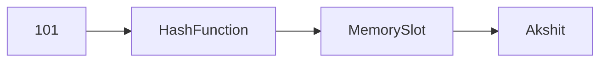
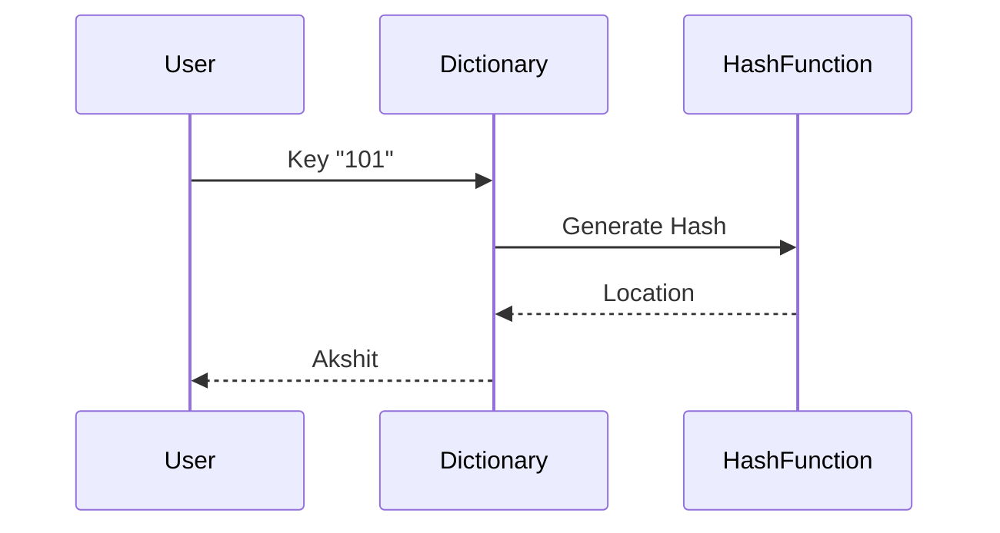
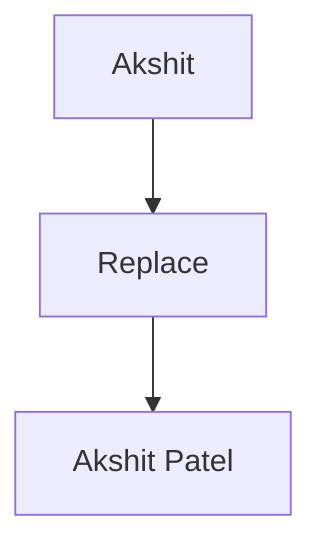
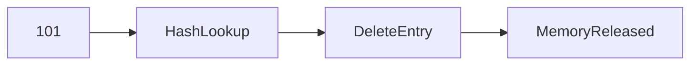
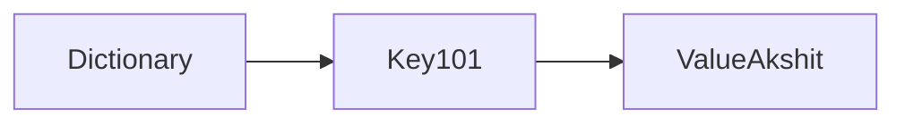
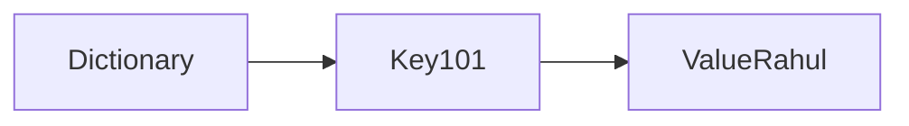

# CRUD Operations in Python Dictionaries

Before learning databases, APIs, Django, Flask, or Machine Learning pipelines, you must understand **CRUD Operations**.

CRUD is one of the most important concepts in software engineering.

---

# 1. Intuitive Introduction

CRUD stands for:

| Letter | Meaning |
| ------ | ------- |
| C      | Create  |
| R      | Read    |
| U      | Update  |
| D      | Delete  |

These are the four basic operations performed on data.

Imagine Instagram:

* Create Post
* Read Post
* Update Caption
* Delete Post

All applications use CRUD.

Examples:

* Banking System
* Student Management System
* Hospital Software
* E-commerce Website
* Machine Learning Data Pipeline

---

# 2. Real-World Analogy

Think about a student register.

### Create

Add new student.

```text
101 → Akshit
```

### Read

Find student details.

```text
101 → Akshit
```

### Update

Change name.

```text
101 → Akshit Patel
```

### Delete

Remove student.

```text
101 removed
```

This is CRUD.

---

# 3. CRUD Using Dictionary

Dictionary is perfect for understanding CRUD.

```python
students = {}
```

Empty database.

---

# CREATE

## What is Create?

Adding new data.

---

### Example

```python
students = {}

students["101"] = "Akshit"

print(students)
```

Output:

```python
{'101': 'Akshit'}
```

---

### Internal Working



Python:

1. Hashes key
2. Finds location
3. Stores value

---

# Multiple Creates

```python
students = {}

students["101"] = "Akshit"
students["102"] = "Rahul"
students["103"] = "Priya"

print(students)
```

Output:

```python
{
'101':'Akshit',
'102':'Rahul',
'103':'Priya'
}
```

---

# READ

## What is Read?

Fetching data.

---

### Example

```python
students = {
    "101": "Akshit",
    "102": "Rahul"
}

print(students["101"])
```

Output:

```python
Akshit
```

---

### Read Safely

Wrong:

```python
print(students["999"])
```

Output:

```python
KeyError
```

---

Correct:

```python
print(students.get("999"))
```

Output:

```python
None
```

---

### Internal Working



---

# UPDATE

## What is Update?

Modify existing data.

---

### Example

```python
students = {
    "101": "Akshit"
}

students["101"] = "Akshit Patel"

print(students)
```

Output:

```python
{'101': 'Akshit Patel'}
```

---

### Internal Working



Python replaces old value reference.

---

### Real Example

```python
employee = {
    "salary": 50000
}

employee["salary"] = 70000
```

Salary updated.

---

# DELETE

## What is Delete?

Removing data.

---

### Using del

```python
students = {
    "101": "Akshit",
    "102": "Rahul"
}

del students["101"]

print(students)
```

Output:

```python
{'102': 'Rahul'}
```

---

### Using pop()

```python
students = {
    "101": "Akshit",
    "102": "Rahul"
}

removed = students.pop("101")

print(removed)
```

Output:

```python
Akshit
```

---

### Internal Working



---

# Complete CRUD Example

```python
students = {}

# CREATE
students["101"] = "Akshit"
students["102"] = "Rahul"

print("After Create:")
print(students)

# READ
print("\nRead:")
print(students["101"])

# UPDATE
students["101"] = "Akshit Patel"

print("\nAfter Update:")
print(students)

# DELETE
del students["102"]

print("\nAfter Delete:")
print(students)
```

Output:

```python
After Create:
{'101': 'Akshit', '102': 'Rahul'}

Read:
Akshit

After Update:
{'101': 'Akshit Patel', '102': 'Rahul'}

After Delete:
{'101': 'Akshit Patel'}
```

---

# Memory Perspective

```python
students = {
    "101": "Akshit"
}
```

Memory:



After update:

```python
students["101"] = "Rahul"
```

Memory:



Old reference removed.

---

# Industry Engineering Mindset

CRUD exists everywhere.

---

## Database

```sql
INSERT
SELECT
UPDATE
DELETE
```

Equivalent to CRUD.

---

## REST API

| CRUD   | HTTP Method |
| ------ | ----------- |
| Create | POST        |
| Read   | GET         |
| Update | PUT / PATCH |
| Delete | DELETE      |

Example:

```http
POST /users
GET /users/101
PUT /users/101
DELETE /users/101
```

---

## Django

```python
Student.objects.create()
Student.objects.get()
Student.objects.update()
Student.objects.delete()
```

---

## Flask APIs

```python
@app.post("/student")
```

Create.

```python
@app.get("/student")
```

Read.

```python
@app.put("/student")
```

Update.

```python
@app.delete("/student")
```

Delete.

---

# ML & Data Science Connection

CRUD is heavily used in ML.

---

### Dataset Metadata

```python
dataset = {}

# Create
dataset["rows"] = 10000

# Read
print(dataset["rows"])

# Update
dataset["rows"] = 12000

# Delete
del dataset["rows"]
```

---

### Model Configuration

```python
config = {
    "epochs": 50
}

config["epochs"] = 100
```

Updating hyperparameters.

---

### Feature Mapping

```python
encoding = {
    "Male": 0
}

encoding["Female"] = 1
```

Creating new mappings.

---

# Common Mistakes

## Mistake 1

```python
students["999"]
```

Key doesn't exist.

Use:

```python
students.get("999")
```

---

## Mistake 2

Accidental overwrite.

```python
students["101"] = "Akshit"
students["101"] = "Rahul"
```

Output:

```python
{'101': 'Rahul'}
```

---

## Mistake 3

Delete non-existing key.

```python
del students["999"]
```

Error:

```python
KeyError
```

Safe:

```python
students.pop("999", None)
```

---

# Performance Considerations

Dictionary CRUD Operations:

| Operation | Complexity |
| --------- | ---------- |
| Create    | O(1)       |
| Read      | O(1)       |
| Update    | O(1)       |
| Delete    | O(1)       |

Because dictionaries use hash tables.

---

# Interview Questions

## Beginner

### 1. What does CRUD stand for?

Answer:

Create, Read, Update, Delete.

---

### 2. Which dictionary operation performs Create?

```python
d["name"] = "Akshit"
```

---

### 3. Difference between Read and Update?

Read fetches data.

Update modifies data.

---

### 4. Difference between del and pop()?

`del`

* Removes item
* Returns nothing

`pop()`

* Removes item
* Returns removed value

---

### 5. Why use get()?

Avoids KeyError.

---

## Intermediate

### 6. Average complexity of CRUD in dictionary?

Answer:

O(1)

---

### 7. Why is dictionary lookup fast?

Answer:

Hash table implementation.

---

### 8. What happens if key already exists during Create?

Answer:

Value gets overwritten.

---

### 9. Which is safer?

```python
d["x"]
```

or

```python
d.get("x")
```

Answer:

`get()`

---

### 10. Explain CRUD in REST APIs.

POST → Create

GET → Read

PUT/PATCH → Update

DELETE → Delete

---

# Mini Project

## Student Management System

```python
students = {}

# CREATE
students["101"] = "Akshit"
students["102"] = "Rahul"

# READ
for roll, name in students.items():
    print(roll, name)

# UPDATE
students["101"] = "Akshit Patel"

# DELETE
students.pop("102")
```

### Challenge

Build a menu-driven system:

```text
1. Add Student
2. View Student
3. Update Student
4. Delete Student
5. Exit
```

This single project teaches:

* Dictionaries
* CRUD
* Loops
* Conditions
* User Input
* Functions

and is a very common beginner interview task.

---

# Summary Table

| CRUD        | Dictionary Operation | Example             |
| ----------- | -------------------- | ------------------- |
| Create      | Add Data             | `d["id"]="Akshit"`  |
| Read        | Access Data          | `d["id"]`           |
| Update      | Modify Data          | `d["id"]="Rahul"`   |
| Delete      | Remove Data          | `del d["id"]`       |
| Safe Read   | get()                | `d.get("id")`       |
| Safe Delete | pop()                | `d.pop("id", None)` |

# Key Takeaways

1. CRUD = Create, Read, Update, Delete.
2. CRUD is the foundation of databases, APIs, Django, Flask, and backend engineering.
3. Python dictionaries are the easiest way to learn CRUD.
4. Dictionary CRUD operations are typically **O(1)** because of hashing.
5. Master CRUD now because you will use the same concept later in:

   * SQL Databases
   * MongoDB
   * Django ORM
   * Flask APIs
   * FastAPI
   * Machine Learning Data Pipelines
   * Real-world Software Systems

### Next Dictionary Topics

1. `keys()`
2. `values()`
3. `items()`
4. Dictionary Iteration
5. Nested Dictionaries
6. Dictionary Comprehension
7. Hash Tables (Deep Dive)
8. Interview Questions on Dictionaries and Hashing
