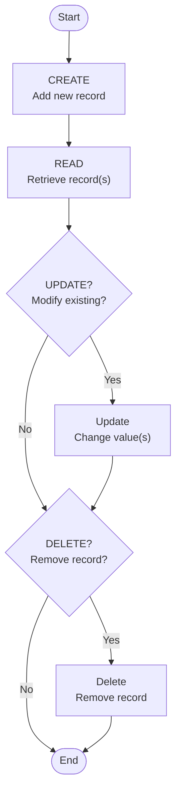
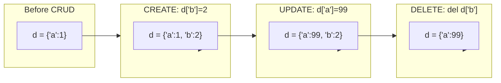

# 📘 CRUD Operations in Python: The Four Fundamental Data Actions

## 1. Intuitive Introduction

Think of a **to‑do list app**. You can:
- **Create** a new task ("Buy milk")
- **Read** (view) the list of tasks
- **Update** a task (change "Buy milk" to "Buy almond milk")
- **Delete** a task when it's done

This simple cycle – **C**reate, **R**ead, **U**pdate, **D**elete – is called **CRUD**. It’s the backbone of almost every software system: databases, file systems, cloud storage, REST APIs, and even Python’s own data structures.

Where CRUD appears in real development:
- **Web dev** – Django/Flask REST APIs: `POST` (Create), `GET` (Read), `PUT/PATCH` (Update), `DELETE` (Delete)
- **Data science** – Loading a CSV, cleaning (Update), filtering (Read), removing outliers (Delete)
- **Database programming** – SQL: `INSERT`, `SELECT`, `UPDATE`, `DELETE`
- **File handling** – Writing to a file (Create), reading (Read), appending (Update), removing (Delete)

Why learn CRUD in Python? Because Python’s built‑in data structures (lists, dicts, sets) and libraries (sqlite3, file I/O) use exactly these four operations. Mastering CRUD gives you a mental framework that works across all data handling.

---

## 2. Real‑World Analogy

**The Library System** 📚

Imagine you are a librarian managing a physical library:
- **Create** – Add a new book to the catalogue (record its title, author, shelf number)
- **Read** – Look up a book by its title to see if it’s available
- **Update** – Change the shelf number or mark it as borrowed
- **Delete** – Remove a book that’s been permanently discarded

Each operation is distinct, and the library’s efficiency depends on doing them correctly. The same goes for Python: whether you’re working with a dictionary of user profiles or a database table, CRUD operations are your toolkit.

---

## 3. Core Theory

CRUD is not a Python feature – it’s a **design pattern**. In Python, different data structures and systems implement CRUD with their own syntax.

| Operation | Purpose | In Python Lists | In Python Dicts | In SQLite |
|-----------|---------|----------------|-----------------|-----------|
| **Create** | Add new data | `.append()`, `.insert()` | `d[key] = value` | `INSERT` |
| **Read** | Retrieve data | indexing `lst[i]`, slicing | `d[key]`, `.get()` | `SELECT` |
| **Update** | Modify existing | `lst[i] = new` | `d[key] = new` | `UPDATE` |
| **Delete** | Remove data | `.pop()`, `.remove()`, `del` | `del d[key]`, `.pop()` | `DELETE` |

**Important properties:**
- **Mutability** – CRUD is only meaningful for mutable data structures (lists, dicts, sets). Strings and tuples are immutable – you can Read but not Create/Update/Delete in place.
- **Idempotence** – Read operations are safe to repeat; Create/Update/Delete change state.
- **Transactions** – In databases, CRUD operations can be grouped into atomic transactions (ACID).

---

## 4. Visual Explanation – CRUD Flow

The diagram below shows the generic CRUD cycle applied to a data collection (e.g., a dictionary of users).



In software, these operations often correspond to HTTP methods in REST APIs:

| HTTP Method | CRUD Operation |
|-------------|----------------|
| `POST` | Create |
| `GET` | Read |
| `PUT` / `PATCH` | Update |
| `DELETE` | Delete |

---

## 5. Memory & Internal Working

CRUD operations on Python’s built‑in structures map directly to their internal mechanics:

- **List CRUD** – Underlying dynamic array. Create (append) may cause reallocation (amortized O(1)). Insert at arbitrary position shifts elements (O(n)). Delete by index shifts elements left (O(n)).
- **Dict CRUD** – Hash table. Create/Update/Delete are O(1) average, based on hashing and probing.
- **File CRUD** – Buffered I/O. Create/Write involves kernel buffers; Read pulls from cache or disk.
- **SQLite CRUD** – B‑tree structure. Each operation is a transaction with rollback journal or WAL.

Below is a conceptual memory diagram for CRUD on a Python dictionary:



---

## 6. Creating (C) – Different Ways in Python

### On Lists
```python
# Empty then add
lst = []
lst.append(10)          # [10]
lst.insert(0, 5)        # [5, 10]

# Literal
lst = [1, 2, 3]

# From iterable
lst = list(range(5))    # [0,1,2,3,4]

# List comprehension
lst = [x**2 for x in range(3)]  # [0,1,4]
```

### On Dictionaries
```python
# Empty then add
d = {}
d["name"] = "Alice"     # {'name':'Alice'}

# Literal
d = {"age": 25}

# From keys with default
d = dict.fromkeys(["x","y"], 0)  # {'x':0,'y':0}

# Comprehension
d = {i: i*2 for i in range(3)}   # {0:0,1:2,2:4}
```

### On Files (Create/Write)
```python
# Write mode – creates new file (overwrites if exists)
with open("data.txt", "w") as f:
    f.write("Hello, world!")

# Append mode – creates if missing, then adds
with open("log.txt", "a") as f:
    f.write("New log entry\n")
```

### On SQLite (Create Table + Insert)
```python
import sqlite3
conn = sqlite3.connect("mydb.db")
cursor = conn.cursor()
cursor.execute("CREATE TABLE IF NOT EXISTS users (id INTEGER PRIMARY KEY, name TEXT)")
cursor.execute("INSERT INTO users (name) VALUES (?)", ("Alice",))
conn.commit()
```

**Common mistakes while creating:**
```python
# ❌ Mistake: Using mutable default for file/sql
def add_user(user, db=[]):   # shared list across calls!
    db.append(user)

# ✅ Fix
def add_user(user, db=None):
    if db is None:
        db = []
    db.append(user)

# ❌ Mistake: Forgetting commit() in sqlite
cursor.execute("INSERT ...")  # no conn.commit() → no data saved
```

---

## 7. Core Operations / Methods

We’ll cover CRUD for the most common Python data structures.

### 7.1 List CRUD

```python
fruits = ["apple", "banana"]

# CREATE
fruits.append("cherry")        # ['apple','banana','cherry']
fruits.insert(1, "blueberry")  # ['apple','blueberry','banana','cherry']

# READ
print(fruits[0])               # 'apple'
print(fruits[-1])              # 'cherry'
print(fruits[1:3])             # ['blueberry','banana']

# UPDATE
fruits[2] = "blackberry"       # ['apple','blueberry','blackberry','cherry']

# DELETE
fruits.remove("blueberry")     # remove by value
last = fruits.pop()            # removes 'cherry', returns it
del fruits[0]                  # removes 'apple'
fruits.clear()                 # []
```

### 7.2 Dictionary CRUD

```python
user = {"id": 1, "name": "Bob"}

# CREATE
user["email"] = "bob@example.com"   # add new key

# READ
print(user.get("name"))              # 'Bob' (safe)
print(user.get("age", "unknown"))    # 'unknown'
# all keys/values/items
for k, v in user.items():
    print(k, v)

# UPDATE
user["name"] = "Robert"              # modify existing

# DELETE
del user["email"]                    # removes key
age = user.pop("age", None)          # safe delete with default
user.popitem()                       # removes last inserted (Python 3.7+)
```

### 7.3 Set CRUD (C=add, R=membership test, U=remove/add, D=remove/discard)

```python
s = {1, 2, 3}

# CREATE (add)
s.add(4)                # {1,2,3,4}
s.update([5, 6])        # add multiple

# READ (membership)
print(3 in s)           # True

# UPDATE (no direct update – remove + add)
s.remove(2)             # {1,3,4,5,6}
s.add(10)               # {1,3,4,5,6,10}

# DELETE
s.discard(99)           # no error if missing
s.pop()                 # removes arbitrary element
s.clear()               # empty set
```

### 7.4 File CRUD

```python
# CREATE (write)
with open("notes.txt", "w") as f:
    f.write("First line\n")

# READ
with open("notes.txt", "r") as f:
    content = f.read()          # whole file as string
    # or iterate line by line
    f.seek(0)                   # reset cursor
    for line in f:
        print(line.strip())

# UPDATE (append or rewrite)
with open("notes.txt", "a") as f:
    f.write("Second line\n")    # appends
# To update in the middle: read all, modify, write back
with open("notes.txt", "r") as f:
    lines = f.readlines()
lines.insert(1, "Middle line\n")
with open("notes.txt", "w") as f:
    f.writelines(lines)

# DELETE (remove file)
import os
os.remove("notes.txt")
```

### 7.5 SQLite CRUD

```python
import sqlite3

conn = sqlite3.connect("school.db")
cursor = conn.cursor()
cursor.execute("CREATE TABLE IF NOT EXISTS students (id INTEGER PRIMARY KEY, name TEXT, grade INTEGER)")

# CREATE (INSERT)
cursor.execute("INSERT INTO students (name, grade) VALUES (?, ?)", ("Alice", 85))
conn.commit()

# READ (SELECT)
cursor.execute("SELECT * FROM students WHERE grade > ?", (80,))
rows = cursor.fetchall()
for row in rows:
    print(row)

# UPDATE
cursor.execute("UPDATE students SET grade = ? WHERE name = ?", (90, "Alice"))
conn.commit()

# DELETE
cursor.execute("DELETE FROM students WHERE name = ?", ("Alice",))
conn.commit()

conn.close()
```

---

## 8. Advanced Concepts

### Bulk CRUD with Comprehensions and Slicing

```python
# Bulk create with comprehension
squares = [x**2 for x in range(10)]          # list
even_squares = {x: x**2 for x in range(10) if x%2==0}  # dict

# Bulk update using slice assignment (list)
nums = [1,2,3,4,5]
nums[1:4] = [20,30,40]      # replaces indices 1,2,3 → [1,20,30,40,5]

# Bulk delete with slice deletion
del nums[1:3]               # [1,40,5]
```

### Transactional CRUD (Database / Custom)

```python
# SQLite transaction – all succeed or none
try:
    cursor.execute("INSERT INTO accounts (user, balance) VALUES (?,?)", ("Alice", 100))
    cursor.execute("UPDATE accounts SET balance = balance - 50 WHERE user = 'Bob'")
    conn.commit()
except Exception:
    conn.rollback()
```

### CRUD with Class Encapsulation

```python
class ToDoList:
    def __init__(self):
        self._items = []
    
    def create(self, task):
        self._items.append({"task": task, "done": False})
    
    def read(self, index=None):
        if index is None:
            return self._items.copy()
        return self._items[index]
    
    def update(self, index, task=None, done=None):
        if task:
            self._items[index]["task"] = task
        if done is not None:
            self._items[index]["done"] = done
    
    def delete(self, index):
        self._items.pop(index)
```

---

## 9. Mathematical / Special Operations

CRUD operations themselves aren't mathematical, but they relate to set theory when applied to sets:

- **Create** = `add` element → set union `{x} ∪ S`
- **Read** = membership test `x ∈ S`
- **Update** = `remove` then `add` = `(S \ {x}) ∪ {y}`
- **Delete** = set difference `S \ {x}`

For dictionaries, update can be seen as function override: `f` updated at key `k` to value `v` → new mapping `{(k,v)} ∪ (f \ {k})`.

---

## 10. Real Practical Examples

### Example 1: Student Grade Manager (Console CRUD)

```python
def grade_manager():
    grades = {}  # name -> list of scores
    while True:
        print("\n1.Create 2.Read 3.Update 4.Delete 5.Exit")
        choice = input("Choose: ")
        if choice == "1":
            name = input("Student name: ")
            score = int(input("Score: "))
            grades.setdefault(name, []).append(score)
            print(f"Added {score} for {name}")
        elif choice == "2":
            name = input("Student name: ")
            scores = grades.get(name)
            if scores:
                print(f"{name}: {scores} (avg: {sum(scores)/len(scores):.1f})")
            else:
                print("Not found")
        elif choice == "3":
            name = input("Student name: ")
            if name in grades:
                idx = int(input("Score index to update: "))
                new_score = int(input("New score: "))
                grades[name][idx] = new_score
                print("Updated")
            else:
                print("Not found")
        elif choice == "4":
            name = input("Student name: ")
            if grades.pop(name, None):
                print("Deleted")
            else:
                print("Not found")
        else:
            break

# grade_manager()  # uncomment to run
```

### Example 2: CSV File CRUD with Pandas-like operations

```python
import csv
import os

def csv_crud(filepath):
    """Simple CRUD on CSV file with header"""
    if not os.path.exists(filepath):
        with open(filepath, 'w', newline='') as f:
            writer = csv.writer(f)
            writer.writerow(["id", "name", "age"])
    
    # CREATE (add row)
    def create(name, age):
        with open(filepath, 'r') as f:
            rows = list(csv.DictReader(f))
        new_id = max((int(r['id']) for r in rows), default=0) + 1
        rows.append({"id": str(new_id), "name": name, "age": str(age)})
        with open(filepath, 'w', newline='') as f:
            writer = csv.DictWriter(f, fieldnames=["id","name","age"])
            writer.writeheader()
            writer.writerows(rows)
        return new_id
    
    # READ (get by id)
    def read(row_id):
        with open(filepath, 'r') as f:
            for row in csv.DictReader(f):
                if int(row['id']) == row_id:
                    return row
        return None
    
    # UPDATE
    def update(row_id, name=None, age=None):
        with open(filepath, 'r') as f:
            rows = list(csv.DictReader(f))
        updated = False
        for row in rows:
            if int(row['id']) == row_id:
                if name: row['name'] = name
                if age: row['age'] = str(age)
                updated = True
        if updated:
            with open(filepath, 'w', newline='') as f:
                writer = csv.DictWriter(f, fieldnames=["id","name","age"])
                writer.writeheader()
                writer.writerows(rows)
        return updated
    
    # DELETE
    def delete(row_id):
        with open(filepath, 'r') as f:
            rows = list(csv.DictReader(f))
        new_rows = [r for r in rows if int(r['id']) != row_id]
        if len(new_rows) == len(rows):
            return False
        with open(filepath, 'w', newline='') as f:
            writer = csv.DictWriter(f, fieldnames=["id","name","age"])
            writer.writeheader()
            writer.writerows(new_rows)
        return True
    
    return create, read, update, delete

# Usage
create, read, update, delete = csv_crud("people.csv")
create("Alice", 30)
print(read(1))
update(1, age=31)
delete(1)
```

---

## 11. ML & Data Science Connection

CRUD operations are essential in data preprocessing and model lifecycle.

### Pandas DataFrame CRUD

```python
import pandas as pd

df = pd.DataFrame({"A": [1,2,3], "B": [4,5,6]})

# CREATE (add column)
df["C"] = df["A"] + df["B"]          # new column

# CREATE (add row)
df.loc[len(df)] = [7,8,9]            # append row

# READ
print(df.loc[0, "A"])                # 1
print(df[df["A"] > 1])               # filter rows

# UPDATE
df.loc[0, "A"] = 99                  # change cell
df["B"] = df["B"] * 2                # update entire column

# DELETE
df.drop(columns=["C"], inplace=True) # drop column
df.drop(index=1, inplace=True)       # drop row
```

### NumPy Array CRUD (but arrays have fixed size – workarounds)

```python
import numpy as np
arr = np.array([1,2,3])

# CREATE (append – returns new array)
arr = np.append(arr, 4)              # [1,2,3,4]

# READ
print(arr[1])                        # 2

# UPDATE (element)
arr[0] = 99

# DELETE (remove element – new array)
arr = np.delete(arr, 2)              # removes index 2 → [99,2,4]
```

### ML Model CRUD (persistence)

```python
from sklearn.linear_model import LinearRegression
import joblib

# CREATE (train model)
model = LinearRegression()
model.fit(X_train, y_train)

# READ (load saved model)
model = joblib.load("model.pkl")

# UPDATE (retrain or partial fit)
model.partial_fit(X_new, y_new)    # some models support online learning

# DELETE (remove from memory or disk)
del model
os.remove("model.pkl")
```

### Data Pipeline CRUD

In ETL pipelines:
- **Create** – ingest raw data → staging table
- **Read** – query from warehouse
- **Update** – apply transformations, feature engineering
- **Delete** – drop duplicates, remove outliers, delete old partitions

---

## 12. Common Mistakes & Pitfalls

| Mistake | Wrong Code | Consequence | Fix |
|---------|------------|-------------|-----|
| **Modifying list while iterating** | `for x in lst: if cond: lst.remove(x)` | Skips elements or `RuntimeError` | Iterate over copy: `for x in lst[:]:` |
| **Using `=` instead of `.copy()` for dict/list** | `d2 = d1; d2["x"]=5` | Both variables change | `d2 = d1.copy()` |
| **Forgetting `commit()` in sqlite** | `cursor.execute("INSERT...")` | No data saved | Always `conn.commit()` after writes |
| **Deleting from dict during iteration** | `for k in d: if k==bad: del d[k]` | `RuntimeError` | `for k in list(d.keys()):` |
| **Assuming file write modes** | `open("f.txt", "w")` then later appending | Overwrites previous content | Use `"a"` for append |
| **Not handling KeyError/IndexError** | `value = d["missing"]` | Program crash | Use `.get()` or `try/except` |

**Example of iteration mistake and fix:**

```python
# ❌ BAD – skipping elements
nums = [1,2,3,4,5]
for n in nums:
    if n % 2 == 0:
        nums.remove(n)   # after removing 2, list shifts, 3 is skipped
print(nums)  # [1,3,5]?? Actually [1,3,5] works here but unpredictable

# ✅ GOOD
nums = [1,2,3,4,5]
nums = [n for n in nums if n % 2 != 0]   # list comprehension creates new
# or iterate backwards
for i in range(len(nums)-1, -1, -1):
    if nums[i] % 2 == 0:
        del nums[i]
```

---

## 13. Performance Considerations

### Time Complexity for CRUD on Different Structures

| Structure | Create (append/insert) | Read (by index/key) | Update (by index/key) | Delete (by index/key) |
|-----------|------------------------|---------------------|-----------------------|-----------------------|
| **List** | O(1) amortized for append; O(n) for insert | O(1) | O(1) | O(n) for pop(i) or remove; O(1) for pop() |
| **Dict** | O(1) average | O(1) average | O(1) average | O(1) average |
| **Set** | O(1) average for add | O(1) membership | N/A (remove+add) | O(1) average for remove/discard |
| **File (sequential)** | O(1) for append; O(n) for insert | O(n) for search | O(n) for rewrite | O(n) for rewrite |
| **SQLite (indexed)** | O(log n) for insert | O(log n) for indexed search | O(log n) for indexed update | O(log n) for indexed delete |

### Why These Complexities?

- **List** – dynamic array: indexing is O(1). Insert/delete at end is O(1) amortized; in middle requires shifting O(n).
- **Dict/Set** – hash table: hash + probe gives O(1) average. Worst-case O(n) if many collisions.
- **SQLite** – B‑tree indexes give O(log n). Full table scan is O(n).

### Space Overhead

- List: ~8 bytes per element + overhead
- Dict: ~72 bytes per entry (key+value+hash)
- SQLite: depends on page size, typically ~1KB per row overhead

**When to choose which for CRUD-heavy apps:**
- Many reads + writes by key → **dict**
- Ordered data with index access → **list**
- Uniqueness with fast membership → **set**
- Persistence and complex queries → **SQLite**
- Very large data → **pandas** or **database**

---

## 14. Interview Questions

### Beginner (5 questions)

1. **Q:** What does CRUD stand for? Give an example of each using a Python dictionary.  
   **A:** Create: `d["key"] = value`; Read: `d["key"]`; Update: `d["key"] = new_value`; Delete: `del d["key"]`.

2. **Q:** Why can’t you perform all CRUD operations on a tuple?  
   **A:** Tuples are immutable – you can only Read (indexing). No Create, Update, or Delete in place.

3. **Q:** How do you safely read a value from a dict that might not have the key?  
   **A:** Use `d.get(key, default)` which returns `default` instead of raising KeyError.

4. **Q:** Write code to append to a file without erasing existing content.  
   **A:** `with open("file.txt", "a") as f: f.write("new line")`

5. **Q:** What happens if you try to delete an element from a list using an index that doesn’t exist?  
   **A:** `IndexError` is raised.

### Intermediate (5 questions)

1. **Q:** Explain the difference between `list.remove(x)`, `list.pop(i)`, and `del list[i]`.  
   **A:** `remove(x)` deletes first occurrence by value (O(n)); `pop(i)` deletes by index and returns the value (O(n) for arbitrary i); `del list[i]` deletes by index without returning.

2. **Q:** How would you implement an atomic “create or update” operation in SQLite?  
   **A:** Use `INSERT OR REPLACE` or `INSERT ... ON CONFLICT DO UPDATE` (UPSERT).

3. **Q:** Given a list of dictionaries (each representing a record), write a function to update a specific field for all records matching a condition.  
   **A:** `for record in records: if record['status'] == 'pending': record['status'] = 'processed'`

4. **Q:** What’s the time complexity of appending to a list and why does it sometimes take longer?  
   **A:** Amortized O(1). When the underlying array is full, Python reallocates (usually 1.125× growth) and copies all elements (O(n)), but this happens rarely.

5. **Q:** How do you delete multiple keys from a dictionary in one line?  
   **A:** `for k in list_of_keys: d.pop(k, None)` or `{k: d[k] for k in d if k not in keys_to_remove}`

### Advanced (5 questions)

1. **Q:** Design a thread‑safe CRUD interface for a shared dictionary using `threading.RLock`.  
   **A:** Wrap all operations with lock acquisition/release; use `with self.lock:`.

2. **Q:** Explain how SQLite ensures atomicity for CRUD operations.  
   **A:** Uses rollback journal or Write‑Ahead Logging (WAL). Before changes, original pages are written to journal; commit writes the WAL to the main DB; rollback restores from journal.

3. **Q:** Implement a custom mutable sequence that logs every CRUD operation.  
   **A:** Subclass `collections.abc.MutableSequence` and override `__getitem__`, `__setitem__`, `__delitem__`, `insert`, `__len__`.

4. **Q:** How does pandas’ `df.loc` indexing achieve O(1) for label‑based CRUD?  
   **A:** Uses two underlying structures: an index (hash table for labels to positions) and a BlockManager for data. `loc` maps label to position via hash, then integer indexing.

5. **Q:** Write a context manager that temporarily allows or blocks CRUD operations on a data structure based on a permission flag.  
   **A:** Implement `__enter__` and `__exit__`; store a reference to the data structure and modify its methods or use a proxy.

---

## 15. Mini Project Idea

**Project: Personal Library Manager (File‑Based CRUD)**

Build a console app that manages a collection of books using a JSON file for persistence. Implement full CRUD:

- **Create** – add a book (title, author, year, read status)
- **Read** – list all books, search by title/author, show statistics
- **Update** – mark a book as read/unread, edit details
- **Delete** – remove a book by ID or title

**Sample structure:**

```python
import json
import os

DATA_FILE = "library.json"

def load():
    if not os.path.exists(DATA_FILE):
        return []
    with open(DATA_FILE, "r") as f:
        return json.load(f)

def save(books):
    with open(DATA_FILE, "w") as f:
        json.dump(books, f, indent=2)

def create(title, author, year):
    books = load()
    new_id = max((b["id"] for b in books), default=0) + 1
    books.append({"id": new_id, "title": title, "author": author, 
                  "year": year, "read": False})
    save(books)

def read(search=None):
    books = load()
    if search:
        results = [b for b in books if search.lower() in b["title"].lower() 
                   or search.lower() in b["author"].lower()]
    else:
        results = books
    for b in results:
        print(f"{b['id']}: {b['title']} by {b['author']} ({b['year']}) - {'Read' if b['read'] else 'Unread'}")

def update(book_id, **kwargs):
    books = load()
    for b in books:
        if b["id"] == book_id:
            b.update(kwargs)
            save(books)
            return True
    return False

def delete(book_id):
    books = load()
    new_books = [b for b in books if b["id"] != book_id]
    if len(new_books) < len(books):
        save(new_books)
        return True
    return False

# CLI loop (omitted for brevity)
```

**Extensions:** Add CSV export/import, due dates, tags, or a web interface using Flask.

---

## 16. Best Practices

1. **Prefer `with` statements for file/database CRUD** – ensures automatic closing and commit (for SQLite, commit manually inside).
2. **Use `.get()` and `.setdefault()` for dict reads/creates** – avoid unnecessary KeyError handling.
3. **Never modify a collection while iterating over it directly** – iterate over a copy (`list(d.items())`) or use comprehension to create a new collection.
4. **For SQLite, use parameterized queries** – never f‑string or `%` formatting to prevent SQL injection.
5. **Batch CRUD operations when possible** – `writelines`, `executemany`, list comprehensions – to reduce overhead.
6. **Validate data before create/update** – check types, ranges, existence to maintain integrity.

```python
# Good practice: validation before update
def update_user(user_id, age=None):
    if age is not None and (age < 0 or age > 150):
        raise ValueError("Invalid age")
    # proceed with update
```

---

## 17. Summary Table

| Structure/System | Create | Read | Update | Delete | Best Use Case |
|------------------|--------|------|--------|--------|----------------|
| **Python List** | `.append()`, `.insert()` | `lst[i]`, slicing | `lst[i]=val` | `.pop()`, `del`, `.remove()` | Ordered, index‑based data |
| **Python Dict** | `d[k]=v` | `d[k]`, `.get()` | `d[k]=new` | `del d[k]`, `.pop()` | Key‑value lookups, fast by key |
| **Python Set** | `.add()`, `.update()` | `elem in s` | N/A (remove+add) | `.remove()`, `.discard()` | Unique elements, membership tests |
| **File (text)** | `open("w")`, `open("a")` | `.read()`, `.readlines()` | rewrite entire file | `os.remove()` | Persistence, configuration |
| **SQLite** | `INSERT` | `SELECT` | `UPDATE` | `DELETE` | Structured data, concurrent access, complex queries |
| **Pandas DF** | `df[new_col]=...`, `df.loc[len(df)]=...` | `df.loc[]`, `df.iloc[]`, boolean indexing | `df.loc[row,col]=val` | `df.drop()` | Tabular data, analytics |

---

## 18. Key Takeaways

- ✅ CRUD is a universal pattern – once you learn it for lists, you can apply it to databases, files, and APIs.
- ✅ Python’s mutable built‑ins (list, dict, set) directly support all four operations.
- ✅ **Read** operations are safe and repeatable; **Create/Update/Delete** change state – be mindful of side effects.
- ✅ Always handle missing keys/indexes gracefully (`.get()`, `try/except`, `if key in dict`).
- ✅ File CRUD requires correct modes (`'r'`, `'w'`, `'a'`) and `with` blocks to avoid leaks.
- ✅ SQLite CRUD needs explicit `commit()`; use parameterized queries for security.
- ✅ Performance varies: O(1) for dict/set, O(n) for list insert/delete in middle, O(log n) for indexed database.
- ✅ Real‑world applications (Pandas, ML pipelines) are built on CRUD – master it and you master data handling.

---