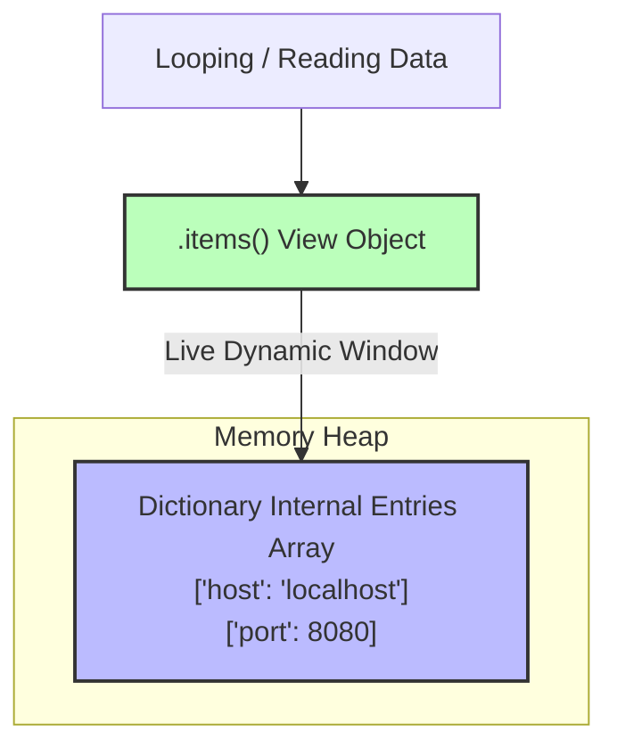
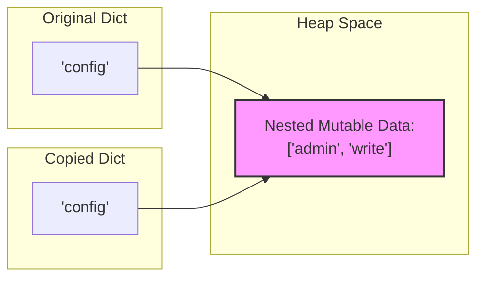

# Python Dictionary Methods: The Deep-Dive Architectural Guide

---

# 1. Intuitive Introduction

In the previous masterclass, we discovered that Python dictionaries use an ultra-fast hash table system to map keys to values in constant time, $O(1)$. However, in a real-world production environment, raw data is rarely perfect. Keys might be missing, configurations need to be dynamically updated, and memory must be cleaned up efficiently without crashing your application.

This is where **dictionary methods** come in. They are the built-in control interface for your hash table. Without these methods, you would have to write complex, error-prone loops and conditional checks for simple tasks like merging profiles, safely fetching deep nested values, or evicting cache items.

### Real-World Footprints Across Industries

* **Backend Engineering & APIs:** Processing incoming payload variations cleanly, falling back to system defaults when optional client parameters are missing.
* **Data Pipelines & ETL:** Clearing out corrupted or empty key-value rows, extracting structured fields, and converting data shapes before loading them into databases.
* **Machine Learning Pipelines:** Extracting metrics, splitting hyperparameter options, and tracking dynamic logging data during neural network training iterations.

---

# 2. Real-World Analogy

Think of dictionary methods as the **automated systems inside a massive library card catalog**.

Instead of manually flipping through thousands of paper index cards, trying to guess if a book exists, or accidentally tearing a card out when you want to update it, the catalog comes with built-in mechanisms:

* **The Safe Retrieval Drawer (`.get()`):** You ask the system for a book title. If it’s not there, instead of setting off an alarm (`KeyError`), it smoothly hands you a placeholder note saying "Not Found".
* **The Bulk Update Stamper (`.update()`):** Instead of manually copying details card by card, you drop a stack of new records into a machine that instantly overwrites old entries and adds new ones in one sweep.
* **The Dynamic View Windows (`.keys()`, `.values()`, `.items()`):** Imagine a glass window over the drawer that lets you look at *only* the book titles, *only* the descriptions, or *both* simultaneously without physically removing or cloning the cards.

---

# 3. Core Theory & Method Taxonomy

Python dictionary methods are not just a collection of utilities; they are intentionally designed around performance, memory safety, and state mutability.

We can classify all core dictionary methods into **three foundational engineering categories**:

1. **Retrieval & View Methods:** Safely reading data or creating live streams of the underlying dictionary memory without duplication.
2. **Mutation & Insertion Methods:** Modifying the internal hash arrays, adding pairs, or handling updates.
3. **Removal & Cleanup Methods:** Evicting entries cleanly while managing memory and handling missing keys.

---

# 4. Comprehensive Method Blueprint & Comparison

Here is the complete blueprint of essential dictionary methods utilized in professional software engineering:

| Method | Primary Purpose | Return Type | Mutates Original? | Time Complexity |
| --- | --- | --- | --- | --- |
| `.get(key, default)` | Safely fetches a value without risking a crash. | Value or Default | No | $O(1)$ |
| `.setdefault(key, default)` | Fetches a value; if missing, inserts the key with the default. | Value | Yes | $O(1)$ |
| `.update(iterable)` | Merges another dictionary or key-value pairs in-place. | `None` | Yes | $O(k)$ |
| `.pop(key, default)` | Removes a specific key and returns its value. | Value | Yes | $O(1)$ |
| `.popitem()` | Removes and returns the last inserted key-value pair. | `Tuple[Key, Value]` | Yes | $O(1)$ |
| `.clear()` | Removes all elements, wiping the internal arrays clean. | `None` | Yes | $O(n)$ |
| `.keys()` | Returns a dynamic view object of all keys. | `dict_keys` | No | $O(1)$ |
| `.values()` | Returns a dynamic view object of all values. | `dict_values` | No | $O(1)$ |
| `.items()` | Returns a dynamic view object of all `(key, value)` pairs. | `dict_items` | No | $O(1)$ |
| `.copy()` | Creates a shallow copy of the dictionary. | `dict` | No | $O(n)$ |

---

# 5. Visual Explanation of View Objects

One of the most common misunderstandings is how `.keys()`, `.values()`, and `.items()` operate. They do **not** create lists or copies of your data. Instead, they provide a **live view window** pointing directly to the underlying entries array.



If the underlying dictionary drops or adds an entry, the view object reflects that change **instantly** without consuming any extra memory.

---

# 6. Memory & Internal Working of Deep vs. Shallow Copies

When you use the `.copy()` method, Python allocates a new dictionary in memory. However, it performs a **Shallow Copy**. This means it copies the top-level keys and references, but if your values are mutable structures (like lists or other dictionaries), both the original and copied dictionaries will point to the *exact same nested objects in memory*.

### Shallow Copy Memory Mapping Visualized



Let's look at this behavior in code:

```python
original = {"user": "Alpha", "permissions": ["read", "execute"]}
copied = original.copy()

# Mutating the top-level immutable key on the copy
copied["user"] = "Beta"
print(original["user"]) # Output: Alpha (Safe!)

# Mutating the nested mutable list on the copy
copied["permissions"].append("write")
print(original["permissions"]) # Output: ['read', 'execute', 'write'] (Leaked!)

```

> **Engineering Rule:** If your dictionary contains nested lists, dicts, or objects, and you need a completely isolated copy, bypass `.copy()` and use `copy.deepcopy()`.

---

# 7. Deep Dive: Core Operations & Code Implementations

Let's master the behavioral nuances of these methods with precise, functional code blocks.

### 1. The Retrieval Heavyweights: `.get()` vs. `.setdefault()`

`.get()` simply reads data cleanly. `.setdefault()` goes a step further: it acts like a defensive guard that ensures a key exists by inserting it if it is missing.

```python
# System analytics log tracking
server_status = {"host": "10.0.0.1", "uptime": 3600}

# 1. Using .get() safely
region = server_status.get("region", "us-east-1")
print(region)        # Output: us-east-1
print(server_status) # Output: {'host': '10.0.0.1', 'uptime': 3600} (Unchanged)

# 2. Using .setdefault() to ensure configuration keys exist
active_connections = server_status.setdefault("connections", 0)
print(active_connections) # Output: 0
print(server_status)      # Output: {'host': '10.0.0.1', 'uptime': 3600, 'connections': 0} (Mutated!)

```

### 2. The Dynamic Views: `.items()`, `.keys()`, `.values()`

These methods allow you to loop through your data efficiently. Because they are view objects, they support set operations like intersections if the keys are hashable.

```python
inventory = {"apples": 50, "bananas": 30, "oranges": 20}

# Fetching the live views
all_keys = inventory.keys()
print(all_keys) # Output: dict_keys(['apples', 'bananas', 'oranges'])

# Modifying the original dict changes the view instantly
inventory["grapes"] = 15
print(all_keys) # Output: dict_keys(['apples', 'bananas', 'oranges', 'grapes'])

```

### 3. Eviction Mechanics: `.pop()` vs. `.popitem()`

* Use `.pop(key)` to extract a *specific* targeted record.
* Use `.popitem()` to pull the *most recently added* record (ideal for LIFO stacks).

```python
session_tokens = {"user_1": "token_abc", "user_2": "token_xyz"}

# Specific eviction
removed_token = session_tokens.pop("user_1", "expired")
print(removed_token) # Output: token_abc

# Last-In, First-Out (LIFO) eviction
last_entry = session_tokens.popitem()
print(last_entry)    # Output: ('user_2', 'token_xyz')

```

---

# 8. Real Practical Examples

### Example 1: Streamlined Frequency Map (Basic)

Building on basic loops, `.get()` allows you to count occurrences cleanly without checking if the key exists first.

```python
def build_frequency_map(items: list) -> dict:
    frequencies = {}
    for item in items:
        # If item doesn't exist, defaults to 0, then adds 1
        frequencies[item] = frequencies.get(item, 0) + 1
    return frequencies

data = ["click", "view", "click", "purchase", "view", "click"]
print(build_frequency_map(data))
# Output: {'click': 3, 'view': 2, 'purchase': 1}

```

### Example 2: API Gateway Parameter Normalizer (Intermediate)

Web backends frequently need to merge default configurations, global settings, and active user requests into a single environment profile.

```python
def build_runtime_config(user_requests: dict) -> dict:
    system_defaults = {"timeout": 30, "retry_count": 3, "env": "production"}
    developer_overrides = {"timeout": 60, "debug_mode": True}
    
    # 1. Duplicate base layer safely
    runtime_config = system_defaults.copy()
    
    # 2. Batch override settings using .update()
    runtime_config.update(developer_overrides)
    runtime_config.update(user_requests)
    
    return runtime_config

user_payload = {"retry_count": 5, "env": "staging"}
print(build_runtime_config(user_payload))
# Output: {'timeout': 60, 'retry_count': 5, 'env': 'staging', 'debug_mode': True}

```

### Example 3: LRU Cache Eviction Simulator (Production Quality)

A Least Recently Used (LRU) cache drops older items when it hits its capacity limit to keep its memory footprint predictable. We can leverage standard dictionary insertion ordering alongside `.popitem(last=False)` from `collections.OrderedDict` (or using native keys extraction) to manage an active cache pool.

```python
class SimpleCache:
    """A bounded capacity memory cache tracking element retention."""
    def __init__(self, capacity: int):
        self.capacity = capacity
        self.cache = {}

    def get_data(self, key: str) -> str | None:
        if key not in self.cache:
            return None
        # Refresh access order: pop and re-insert at the end
        value = self.cache.pop(key)
        self.cache[key] = value
        return value

    def put_data(self, key: str, value: str) -> None:
        if key in self.cache:
            self.cache.pop(key)
        elif len(self.cache) >= self.capacity:
            # Evict the oldest item (first item in insertion order)
            oldest_key = next(iter(self.cache.keys()))
            self.cache.pop(oldest_key)
            print(f"[CACHE EVICTION] Removed oldest record: {oldest_key}")
            
        self.cache[key] = value

# Production Validation Testing
my_cache = SimpleCache(capacity=3)
my_cache.put_data("session_A", "data_A")
my_cache.put_data("session_B", "data_B")
my_cache.put_data("session_C", "data_C")

# Access session_A to make it active, moving session_B to the oldest slot
my_cache.get_data("session_A")

# Inserting a new item triggers eviction of session_B
my_cache.put_data("session_D", "data_D") 
print(my_cache.cache)
# Output: {'session_C': 'data_C', 'session_A': 'data_A', 'session_D': 'data_D'}

```

---

# 9. Machine Learning & Data Science Connection

In modern AI platforms like PyTorch and Scikit-Learn, models communicate using dictionary state configurations.

### 1. PyTorch Model State Saving & Loading (`state_dict`)

In PyTorch, a model's weights and architecture biases are tracked in a central structure called the `state_dict`. When saving a model checkpoint or setting up transfer learning, you use dictionary methods to inspect, extract, or filter out specific weight layers.

```python
# Simulated PyTorch model state_dict
model_state = {
    "encoder.weight": [0.25, -0.11, 0.89],
    "encoder.bias": [0.0, 0.1, 0.0],
    "decoder.weight": [0.55, 0.34, -0.22],
    "decoder.bias": [1.0, 1.0, 1.0]
}

# Real-world use case: Freezing the encoder and extracting only decoder weights for training
decoder_updates = {}
for layer_name, tensor_weights in model_state.items():
    if layer_name.startswith("decoder"):
        decoder_updates[layer_name] = tensor_weights

print(decoder_updates)
# Output: {'decoder.weight': [0.55, 0.34, -0.22], 'decoder.bias': [1.0, 1.0, 1.0]}

```

### 2. Hyperparameter Grid Parsing

When setting up hyperparameter searches for models, systems use dictionary operations to extract runtime options safely.

```python
model_run_params = {"learning_rate": 0.01, "epochs": 50}

# Ensure critical options are defined using .setdefault()
model_run_params.setdefault("batch_size", 32)
model_run_params.setdefault("optimizer", "Adam")

print(model_run_params)
# Output: {'learning_rate': 0.01, 'epochs': 50, 'batch_size': 32, 'optimizer': 'Adam'}

```

---

# 10. Common Mistakes & Pitfalls

### 1. Expecting `.update()` or `.clear()` to Return a New Dictionary

* **Wrong Code:**
```python
base_config = {"timeout": 30}
updated_config = base_config.update({"retry": 3})
print(updated_config) # Output: None

```


* **Why it happens:** Most dictionary mutation methods operate **in-place** to optimize performance. They modify the existing object in memory and return `None`.
* **Correction:** Run the mutation step first, then work with your updated dictionary object directly.
```python
base_config.update({"retry": 3})
# base_config now safely holds the updated values

```


### 2. Mutating Dictionary Structures While Iterating Over Dynamic View Objects

* **Wrong Code:**
```python
active_users = {"id_1": "active", "id_2": "idle", "id_3": "active"}
for user_id, status in active_users.items():
    if status == "idle":
        active_users.pop(user_id) # Raises RuntimeError

```


* **Why it happens:** Because view objects are live windows into the active dictionary structure, altering the hash array footprint while iterating through it breaks Python's tracking loop.
* **Correction:** Cast the view keys to a static `list` to create an isolated iteration snapshot.
```python
for user_id in list(active_users.keys()):
    if active_users[user_id] == "idle":
        active_users.pop(user_id)

```


---

# 11. Interview Questions

### Beginner Level

1. **What is the default return value of `.get('missing_key')` if no custom fallback is specified?**
* *Answer:* It returns `None`.


2. **How does `.pop()` behave differently if you do not supply a default fallback value for a missing key?**
* *Answer:* It will raise a `KeyError`. Providing a default fallback (e.g., `.pop('key', None)`) prevents the error and safely returns the default value instead.


3. **What is the fastest way to clear out all the entries inside a dictionary without creating a new object?**
* *Answer:* Use the `.clear()` method. It resets the internal indices and entries arrays in place, keeping the same memory address.


4. **Does `.copy()` perform a deep copy or a shallow copy?**
* *Answer:* It performs a shallow copy. It copies the top-level keys, but any nested mutable collections (like lists) are still shared by reference between the old and new dictionaries.


5. **How can you extract both the keys and values from a dictionary at the same time inside a loop?**
* *Answer:* Use the `.items()` view method, typically paired with unpacking: `for key, value in dict.items():`.


---

### Intermediate Level

6. **Why are the returns of `.keys()` referred to as "view objects" instead of lists?**
* *Answer:* View objects do not copy data into new memory allocations. They are live, lightweight windows pointing directly to the dictionary's internal entries array. Any changes to the underlying dictionary are instantly reflected in the view object.


7. **Explain the functional difference between `d['key'] = value` and `d.setdefault('key', value)`.**
* *Answer:* The assignment `d['key'] = value` will write the value to the key regardless of whether it already exists, overwriting any previous data. `.setdefault()` will only write the value if the key *does not* exist. If the key is already present, it leaves the existing data untouched and simply returns the current value.


8. **How can you perform set operations like intersections or unions directly on dictionary keys?**
* *Answer:* In Python 3, the view object returned by `.keys()` behaves like a set. You can use standard set operators directly on it, such as `dict1.keys() & dict2.keys()` to find common keys across both dictionaries.


9. **What happens under the hood when you use `.update()` to merge one dictionary into another?**
* *Answer:* Python loops through the incoming elements. For each key, it runs its hash function, finds the target index in the destination dictionary, and either inserts the new pair or overwrites the existing value. This runs in $O(k)$ time, where $k$ is the size of the incoming collection.


10. **Why does `.popitem()` not accept any arguments in modern Python?**
* *Answer:* Since dictionaries are officially ordered by insertion, `.popitem()` is designed specifically to remove and return the *most recently added* key-value pair (following a Last-In, First-Out sequence). If you need to remove a specific key, you should use `.pop(key)` instead.


---

### Advanced Level

11. **Compare the performance and memory overhead of iterating over a dictionary using `for k in d.keys():` versus `for k in d:`.**
* *Answer:* Both operate in $O(1)$ space and $O(n)$ time. However, `for k in d:` is slightly faster and more idiomatic because it calls the dictionary's direct internal iterator (`__iter__`), skipping the extra step of resolving the `.keys()` view wrapper object.


12. **How does CPython optimize memory recovery when you run the `.clear()` method on a massive dictionary?**
* *Answer:* When `.clear()` is called, CPython deallocates the items in the compact entries array and resets the lookup indices table back to a clean, empty state. It keeps the core dictionary object header in memory to save setup time, but drops the large underlying storage arrays to free up memory for the system.


13. **Write a code snippet demonstrating how to intercept dictionary method mutation requests to enforce custom validation using standard class expansion.**
* *Answer:* You can subclass `dict` and override methods like `__setitem__` or `update` to validate keys before they are saved to the dictionary.


```python
class CleanDict(dict):
    def __setitem__(self, key, value):
        if not isinstance(key, str):
            raise TypeError("Key handles must be strings!")
        super().__setitem__(key, value)

```


14. **Explain how using `try...except KeyError` can outperform `.get()` inside tight processing loops when reading keys.**
* *Answer:* `.get()` checks if a key exists on every single call. If you expect a key to be present almost all the time (e.g., 99% of requests), using a standard lookup inside a `try...except KeyError` block bypasses that constant safety check. If the key is missing, it jumps to the exception handler, making the happy path slightly faster.


15. **How does the view object returned by `.items()` handle equality checks against standard sets?**
* *Answer:* If a dictionary's keys and values are all hashable, its `.items()` view object acts like a mathematical set. You can compare it directly with a standard set using equality operators, like `dict.items() == {('a', 1), ('b', 2)}`.


---

# 12. Mini Project: Real-Time DevOps Metrics Aggregator

This system aggregates raw infrastructure telemetry reports coming from multiple servers, normalizes the metric values, updates historical status structures, and automatically evicts dead system nodes using core dictionary methods.

```python
import time

class MetricsAggregator:
    def __init__(self):
        # Maps node IDs to their telemetry profiles
        self.node_registry = {}

    def report_telemetry(self, node_id: str, new_metrics: dict) -> None:
        """Registers a node or merges incoming metrics updates using dictionary methods."""
        # Ensure a base schema exists for new nodes using .setdefault()
        node_profile = self.node_registry.setdefault(node_id, {
            "connected_at": time.time(),
            "metrics_count": 0,
            "status": "INITIALIZING"
        })
        
        # Merge new metrics directly into the node profile using .update()
        node_profile.update(new_metrics)
        node_profile["last_seen"] = time.time()
        node_profile["metrics_count"] += len(new_metrics)
        node_profile["status"] = "ACTIVE"

    def purge_inactive_nodes(self, timeout_seconds: int = 5) -> list[str]:
        """Evicts dead nodes from the registry using .pop() while iterating over keys."""
        current_time = time.time()
        purged_nodes = []
        
        # Avoid RuntimeError: create a static list copy of keys before mutating the dict
        for node_id in list(self.node_registry.keys()):
            profile = self.node_registry[node_id]
            if current_time - profile.get("last_seen", 0) > timeout_seconds:
                # Evict the node and extract its data cleanly
                evicted_data = self.node_registry.pop(node_id)
                purged_nodes.append(node_id)
                print(f"[SYSTEM ALERT] Purged inactive node: {node_id} (Tracked updates: {evicted_data['metrics_count']})")
                
        return purged_nodes

# System Simulation Execution
aggregator = MetricsAggregator()

# 1. First cluster update
aggregator.report_telemetry("node_alpha", {"cpu_load": 42.5, "ram_usage": 68.1})
# 2. Subsequent incremental updates
aggregator.report_telemetry("node_alpha", {"disk_io": 12.4, "cpu_load": 48.0})
aggregator.report_telemetry("node_beta", {"cpu_load": 89.2})

print("Current active registry status:")
for node, details in aggregator.node_registry.items():
    print(f" -> {node}: {details}")

# 3. Simulate latency timeout and trigger cleanup
print("\n... Waiting for timeout simulation ...")
time.sleep(6)
aggregator.purge_inactive_nodes(timeout_seconds=5)

```

---

# 13. Summary Table

| Method Interface | Core Architectural Purpose | Performance | Return Handling Behavior | Common Pitfall |
| --- | --- | --- | --- | --- |
| `.get()` | Safe read access | $O(1)$ | Returns value or specified default | Forgetting it doesn't save missing keys |
| `.setdefault()` | Conditional insertion guard | $O(1)$ | Returns existing or newly set value | Passing heavy object creations as defaults |
| `.update()` | Batch merging / overrides | $O(k)$ | Returns `None` (modifies in-place) | Expecting it to return a new dictionary object |
| `.items()` | Dynamic dataset streaming | $O(1)$ | Returns an uncopied live view window | Mutating dict size during active loops |

---

# 14. Key Takeaways

* **In-Place Mutations:** Methods that modify dictionaries (like `.update()`, `.clear()`, and `.setdefault()`) perform their operations **in-place** and return `None`.
* **Dynamic, Zero-Copy Views:** `.keys()`, `.values()`, and `.items()` do not copy your data. They provide lightweight, live views over the existing dictionary structure.
* **Safe Reads with `.get()`:** Use `.get()` to query optional fields safely and keep your application from crashing on missing keys.
* **Conditional Initialization:** `.setdefault()` is a highly efficient way to fetch a key while ensuring it is populated with a default value if missing.
* **Safe Mutating Loops:** Never add or remove keys while iterating directly over a dictionary's live views. Always wrap the keys in a static `list()` first to create a safe iteration snapshot.

---