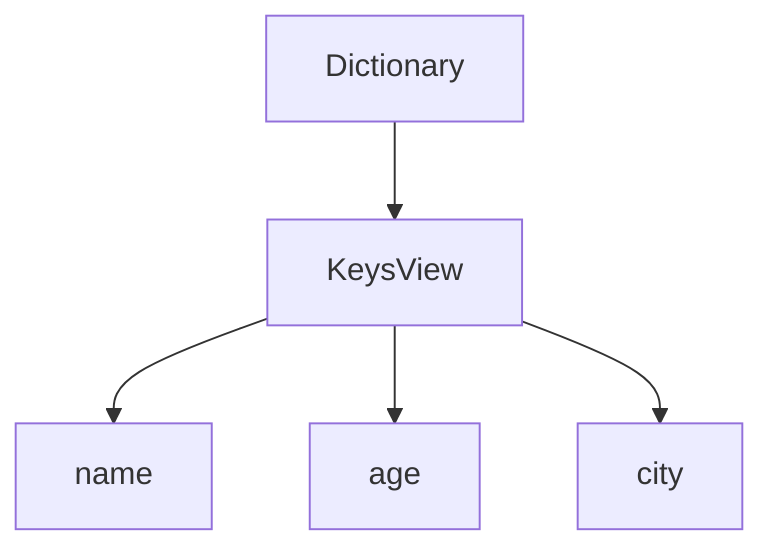
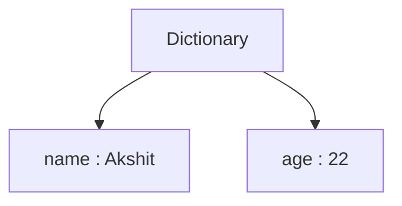
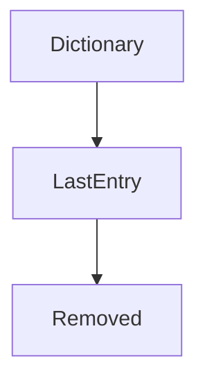
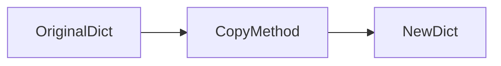
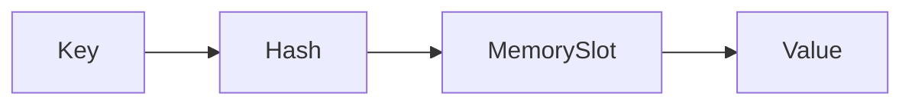

# Dictionary Methods in Python

Dictionary methods are built-in functions that help us perform operations on dictionaries efficiently.

Without methods, working with dictionaries would be slow and complicated.

---

# 1. Intuitive Introduction

Imagine a student database:

```python
students = {
    "101": "Akshit",
    "102": "Rahul",
    "103": "Priya"
}
```

You may want to:

* Get all student IDs
* Get all student names
* Update data
* Remove data
* Copy data
* Clear data

Dictionary methods make these tasks easy.

---

# 2. Real-World Analogy

Think of a school register.

| Requirement           | Dictionary Method |
| --------------------- | ----------------- |
| Show all roll numbers | keys()            |
| Show all names        | values()          |
| Show complete records | items()           |
| Find student safely   | get()             |
| Remove student        | pop()             |
| Empty register        | clear()           |

---

# 3. Common Dictionary Methods

```python
d.keys()
d.values()
d.items()
d.get()
d.update()
d.pop()
d.popitem()
d.clear()
d.copy()
d.setdefault()
```

---

# 4. keys()

Returns all keys.

```python
student = {
    "name": "Akshit",
    "age": 22,
    "city": "Ahmedabad"
}

print(student.keys())
```

Output:

```python
dict_keys(['name', 'age', 'city'])
```

---

## Internal Working



---

## Convert to List

```python
print(list(student.keys()))
```

Output:

```python
['name', 'age', 'city']
```

---

# 5. values()

Returns all values.

```python
student = {
    "name": "Akshit",
    "age": 22,
    "city": "Ahmedabad"
}

print(student.values())
```

Output:

```python
dict_values(['Akshit', 22, 'Ahmedabad'])
```

---

## Convert to List

```python
print(list(student.values()))
```

Output:

```python
['Akshit', 22, 'Ahmedabad']
```

---

# 6. items()

Returns both keys and values.

```python
student = {
    "name": "Akshit",
    "age": 22
}

print(student.items())
```

Output:

```python
dict_items([
('name', 'Akshit'),
('age', 22)
])
```

---

## Internal Structure



---

# 7. Iterating with items()

Most common industry usage.

```python
student = {
    "name": "Akshit",
    "age": 22
}

for key, value in student.items():
    print(key, value)
```

Output:

```python
name Akshit
age 22
```

---

# 8. get()

Safely retrieves a value.

---

### Problem

```python
student = {
    "name": "Akshit"
}

print(student["age"])
```

Output:

```python
KeyError
```

---

### Solution

```python
print(student.get("age"))
```

Output:

```python
None
```

---

### Default Value

```python
print(student.get("age", "Not Found"))
```

Output:

```python
Not Found
```

---

# Why Professionals Prefer get()

```python
user = api_response.get("username")
```

Safer than:

```python
user = api_response["username"]
```

APIs often have missing fields.

---

# 9. update()

Updates existing keys or adds new ones.

```python
student = {
    "name": "Akshit"
}

student.update({
    "age": 22
})

print(student)
```

Output:

```python
{
'name': 'Akshit',
'age': 22
}
```

---

### Multiple Updates

```python
student.update({
    "city": "Ahmedabad",
    "course": "Data Science"
})
```

---

# Internal Working


---

# 10. pop()

Removes a key and returns its value.

```python
student = {
    "name": "Akshit",
    "age": 22
}

removed = student.pop("age")

print(removed)
```

Output:

```python
22
```

Dictionary becomes:

```python
{'name': 'Akshit'}
```

---

# Safe pop()

```python
student.pop("salary", None)
```

No error.

---

# 11. popitem()

Removes last inserted item.

```python
student = {
    "name": "Akshit",
    "age": 22
}

print(student.popitem())
```

Output:

```python
('age', 22)
```

---

# Internal Working



---

# 12. clear()

Removes everything.

```python
student = {
    "name": "Akshit",
    "age": 22
}

student.clear()

print(student)
```

Output:

```python
{}
```

---

# 13. copy()

Creates a shallow copy.

```python
student = {
    "name": "Akshit"
}

new_student = student.copy()
```

---

## Memory View



---

### Verify

```python
print(id(student))
print(id(new_student))
```

Different memory locations.

---

# 14. setdefault()

Returns value if key exists.

If not, creates key.

```python
student = {
    "name": "Akshit"
}

student.setdefault("age", 22)

print(student)
```

Output:

```python
{
'name': 'Akshit',
'age': 22
}
```

---

### Existing Key

```python
student.setdefault("name", "Rahul")
```

Nothing changes.

---

# 15. Practical Industry Example

API Response:

```python
response = {
    "username": "akshit123",
    "email": "abc@gmail.com"
}
```

Safe access:

```python
username = response.get("username")
phone = response.get("phone", "Not Available")
```

---

# 16. Memory and Internal Working

Dictionary stores:

```python
{
    key: value
}
```

using a hash table.



Methods operate on this structure.

---

# 17. ML & Data Science Connection

Model Parameters:

```python
params = {
    "learning_rate": 0.01,
    "epochs": 100
}
```

Read parameter:

```python
params.get("epochs")
```

---

Update parameter:

```python
params.update({
    "batch_size": 32
})
```

---

Feature Mapping:

```python
encoding = {
    "Male": 0,
    "Female": 1
}
```

Retrieve safely:

```python
encoding.get("Male")
```

---

# 18. Common Mistakes

## Mistake 1

```python
d["missing"]
```

Raises:

```python
KeyError
```

Use:

```python
d.get("missing")
```

---

## Mistake 2

Thinking copy() is Deep Copy

```python
new_d = d.copy()
```

Only shallow copy.

Nested objects are shared.

---

## Mistake 3

Using pop() without checking.

```python
d.pop("x")
```

May fail.

Safe:

```python
d.pop("x", None)
```

---

# 19. Performance Considerations

| Method   | Complexity         |
| -------- | ------------------ |
| get()    | O(1)               |
| update() | O(1)               |
| pop()    | O(1)               |
| keys()   | O(1) View Creation |
| values() | O(1) View Creation |
| items()  | O(1) View Creation |
| clear()  | O(n)               |
| copy()   | O(n)               |

---

# 20. Interview Questions

## Beginner

### 1. Difference between keys() and values()?

**Answer:**

```python
keys()    → Returns keys
values()  → Returns values
```

---

### 2. Difference between get() and []?

```python
d["x"]
```

Raises error.

```python
d.get("x")
```

Returns None.

---

### 3. What does items() return?

Answer:

```python
(key, value)
```

pairs.

---

### 4. What does pop() return?

Removed value.

---

### 5. What does clear() do?

Removes all items.

---

## Intermediate

### 6. Difference between pop() and popitem()?

**pop(key)**

Removes specific key.

**popitem()**

Removes last inserted item.

---

### 7. Why is get() preferred in APIs?

Avoids KeyError.

---

### 8. What is setdefault()?

Creates key only if missing.

---

### 9. Is copy() deep copy?

No.

It is shallow copy.

---

### 10. Time complexity of get()?

O(1)

---

# Mini Project

## Student Record Manager

```python
students = {
    "101": "Akshit",
    "102": "Rahul"
}

# Display keys
print(students.keys())

# Display values
print(students.values())

# Update
students.update({
    "103": "Priya"
})

# Remove
students.pop("102")

# Show all records
for roll, name in students.items():
    print(roll, name)
```

---

# Summary Table

| Method       | Purpose             | Example        |
| ------------ | ------------------- | -------------- |
| keys()       | Get all keys        | d.keys()       |
| values()     | Get all values      | d.values()     |
| items()      | Get key-value pairs | d.items()      |
| get()        | Safe lookup         | d.get("x")     |
| update()     | Update/Add data     | d.update()     |
| pop()        | Remove key          | d.pop("x")     |
| popitem()    | Remove last item    | d.popitem()    |
| clear()      | Remove all data     | d.clear()      |
| copy()       | Shallow copy        | d.copy()       |
| setdefault() | Add if missing      | d.setdefault() |

# Key Takeaways

* `get()` is one of the most used dictionary methods in production code.
* `items()` is the preferred way to iterate through dictionaries.
* `update()` can add and modify data.
* `pop()` and `popitem()` remove data.
* `copy()` creates a shallow copy, not a deep copy.
* These methods are used heavily in APIs, JSON processing, backend systems, data engineering, and machine learning pipelines.

### Next Topic

**Dictionary Iteration → Nested Dictionaries → Dictionary Comprehension → Hash Tables (Deep Dive) → Advanced Interview Questions**.
