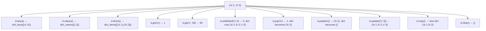
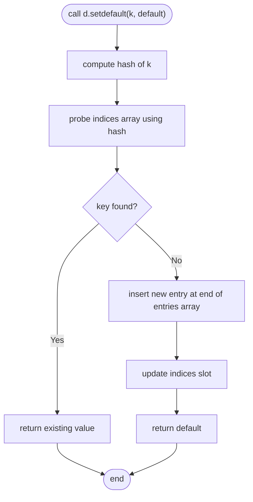

# 📘 Dictionary Methods: Mastering Python's Key‑Value Toolbox

> *A complete, deep‑dive learning note focused exclusively on dictionary methods – from basics to advanced patterns*

---

## 1. Intuitive Introduction

Imagine you have a **smartphone contact list**. You don’t just store names and numbers – you need to:
- Look up a number by name (`.get()`)
- Add a new contact or update an existing one (assignment, `.update()`)
- Remove a contact (`.pop()`)
- List all names (`.keys()`), all numbers (`.values()`), or both (`.items()`)
- Copy your contacts to another phone (`.copy()`)
- Clear the entire list (`.clear()`)

Each of these actions is a **method** – a function attached to the dictionary object. Python dictionaries come with a rich set of built‑in methods that make CRUD operations elegant, safe, and efficient.

Why focus on dictionary methods?
- **Real software** – Web frameworks (Django/Flask) use `request.GET.get()`, data pipelines use `.items()`, configuration merging uses `update()`.
- **Data science** – Pandas Series/DataFrames borrow dict‑like methods; feature encodings use `.get()` for safe mapping.
- **System programming** – Environment variables (`os.environ`) behave like a dict with `.get()`, `.pop()`.
- **Everyday scripting** – Counting words, caching, grouping, deduplication – all rely on dict methods.

---

## 2. Real‑World Analogy

**The Library Catalogue Card System** 📇

A physical library has a card catalogue:
- **`.keys()`** – A drawer of all title cards (just the titles)
- **`.values()`** – The actual book locations (shelf numbers) for each title
- **`.items()`** – Pairs of (title, shelf number) on a single card
- **`.get()`** – A librarian who, when asked for a title, either gives you the shelf number or politely says “Not found” (returns `None`)
- **`.setdefault()`** – “If the book isn’t catalogued, add it with a default shelf number and give me that”
- **`.pop()`** – Remove a title card and hand you the shelf number
- **`.popitem()`** – Remove the last added card (like returning a recently borrowed book)
- **`.update()`** – Merge new cards into the catalogue, overwriting old ones
- **`.copy()`** – Make a photocopy of the entire drawer
- **`.clear()`** – Empty the drawer

Each method is a specific operation you request from the library system.

---

## 3. Core Theory

A dictionary method is a function that belongs to a `dict` object and operates on its key‑value pairs. Methods either:
- **Return views or values** (non‑mutating) – e.g., `.keys()`, `.values()`, `.items()`, `.get()`, `.copy()`
- **Modify the dictionary in place** (mutating) – e.g., `.update()`, `.pop()`, `.popitem()`, `.setdefault()`, `.clear()`

**Important properties of dictionary methods:**
- **View objects** (`.keys()`, `.values()`, `.items()`) are **dynamic** – they reflect changes to the dict.
- **Most mutating methods return `None`** except `.pop()`, `.popitem()`, `.setdefault()` which return a value.
- **Key‑based methods** (`.get()`, `.setdefault()`, `.pop()`) allow a default value to avoid `KeyError`.
- **Since Python 3.7**, all methods respect insertion order – `.popitem()` removes LIFO, iteration order matches insertion.

---

## 4. Visual Explanation – Dictionary Methods at a Glance

The diagram shows a dictionary `d = {"a": 1, "b": 2}` and the results of calling various methods.



All these methods are accessed via dot notation: `d.method()`.

---

## 5. Memory & Internal Working

Dictionary methods directly interact with the internal **hash table** (indices array + entries array). Here’s how key methods operate at CPython level:

- **`.keys()`** – Returns a view that references the same `dk_entries` array. No copying; iteration walks the dense entries array.
- **`.values()`** – Similar view, but yields the `me_value` field from each entry.
- **`.items()`** – View yielding `(key, value)` pairs from entries.
- **`.get(key, default)`** – Computes hash of key, probes indices array. If found, returns `entry->me_value`; else returns default (no exception).
- **`.setdefault(key, default)`** – Performs lookup. If found, returns value. If not, inserts new entry (with default value) into entries array and updates indices array. Returns new value.
- **`.pop(key, default)`** – Lookup + removal. If found, deletes entry (marks as dummy), returns value. If not, returns default or raises `KeyError`.
- **`.popitem()`** – Removes the last entry in the dense entries array (LIFO). Returns `(key, value)`.
- **`.update(other)`** – Iterates over `other`’s items; for each, performs `__setitem__` (hash lookup + insert/overwrite).
- **`.copy()`** – Creates a new dictionary and inserts all entries using same hashing (shallow copy).
- **`.clear()`** – Resets indices array to all `-1` (empty), and truncates entries array.

**Diagram of `.setdefault()` internal flow:**



---

## 6. Creating Dictionaries for Method Practice

While dictionary creation was covered earlier, here’s a quick refresher with methods in mind:

```python
# Empty dict – ready for .update(), .setdefault()
d = {}
d.update({"a": 1, "b": 2})          # populated via method

# Using dict() constructor with keyword args
d = dict(a=1, b=2)                  # keys become strings

# From list of pairs
d = dict([("a", 1), ("b", 2)])

# Using zip
keys = ["a", "b"]
values = [1, 2]
d = dict(zip(keys, values))

# Class method: fromkeys()
d = dict.fromkeys(["a", "b"], 0)    # {'a':0, 'b':0}

# Dict comprehension
d = {x: x**2 for x in range(3)}     # {0:0, 1:1, 2:4}
```

**Common creation mistake with methods:**  
Using `fromkeys()` with a mutable default leads to shared reference – `.update()` on one key affects all.

```python
# ❌ Wrong
d = dict.fromkeys([1,2,3], [])
d[1].append(99)
print(d[2])  # [99] – unexpected!

# ✅ Correct
d = {k: [] for k in [1,2,3]}
```

---

## 7. Core Operations / Methods

This section lists all important dictionary methods with examples, outputs, explanations, and use cases.

### 7.1 `keys()`, `values()`, `items()` – View Methods

```python
d = {"apple": 5, "banana": 7, "cherry": 12}

# keys() – dynamic view of keys
keys_view = d.keys()
print(keys_view)                # dict_keys(['apple', 'banana', 'cherry'])
print(list(keys_view))          # ['apple', 'banana', 'cherry']

# values() – dynamic view of values
values_view = d.values()
print(values_view)              # dict_values([5, 7, 12])

# items() – dynamic view of (key, value) pairs
items_view = d.items()
print(items_view)               # dict_items([('apple',5), ('banana',7), ('cherry',12)])

# Dynamic nature
d["date"] = 20
print(list(keys_view))          # ['apple', 'banana', 'cherry', 'date'] – updated!

# When to use: iteration, membership testing, set operations (keys/items)
if "banana" in keys_view:       # O(1) membership
    print("Found")
```

### 7.2 `get(key[, default])` – Safe Access

```python
d = {"name": "Alice", "age": 30}

# Normal access – may raise KeyError
# print(d["city"])  # KeyError

# .get() – returns None if missing
print(d.get("city"))            # None
print(d.get("city", "Unknown")) # 'Unknown'

# Existing key works like normal
print(d.get("name"))            # 'Alice'

# Use case: providing defaults without try/except
counts = {}
word = "apple"
counts[word] = counts.get(word, 0) + 1   # classic counter pattern
```

### 7.3 `setdefault(key[, default])` – Atomic Get or Set

```python
d = {}

# If key missing: set to default and return default
val = d.setdefault("counter", 0)
print(val)                      # 0
print(d)                        # {'counter': 0}

# If key exists: return existing value (does not overwrite)
val = d.setdefault("counter", 100)
print(val)                      # 0 (not 100)
print(d)                        # still {'counter': 0}

# Powerful for grouping
grouped = {}
for fruit in ["apple", "banana", "apple", "cherry", "banana"]:
    grouped.setdefault(fruit, []).append(len(fruit))
print(grouped)
# {'apple': [5,5], 'banana':[6,6], 'cherry':[6]}
```

### 7.4 `pop(key[, default])` – Remove and Return

```python
d = {"a": 1, "b": 2, "c": 3}

# Remove existing key
val = d.pop("b")
print(val)                      # 2
print(d)                        # {'a':1, 'c':3}

# Remove missing key with default – safe
val = d.pop("x", None)
print(val)                      # None
print(d)                        # unchanged

# Remove missing without default – raises KeyError
# d.pop("y")  # KeyError: 'y'

# Use case: consuming items one by one
remaining = {"x":10, "y":20}
while remaining:
    key = remaining.popitem()[0]  # or pop with some logic
    print(f"Processing {key}")
```

### 7.5 `popitem()` – Remove Last Inserted (LIFO)

```python
d = {"first": 1, "second": 2, "third": 3}

# Removes and returns the last inserted key‑value pair
item = d.popitem()
print(item)                     # ('third', 3)
print(d)                        # {'first':1, 'second':2}

# When dict empty: raises KeyError
# {} .popitem() → KeyError: 'popitem(): dictionary is empty'

# Use case: stack‑like behavior, processing recent items
cache = {"user1": "data1", "user2": "data2"}
last = cache.popitem()          # ('user2', 'data2')
```

### 7.6 `update([other])` – Merge Dictionary

```python
d1 = {"a": 1, "b": 2}
d2 = {"b": 3, "c": 4}

# Merge d2 into d1 (modifies d1)
d1.update(d2)
print(d1)                       # {'a':1, 'b':3, 'c':4}

# Also accepts iterable of pairs
d1.update([("d", 5), ("e", 6)])
print(d1)                       # {'a':1, 'b':3, 'c':4, 'd':5, 'e':6}

# Or keyword arguments
d1.update(f=7, g=8)
print(d1)                       # ... 'f':7, 'g':8

# Use case: merging configurations, updating defaults
defaults = {"theme": "light", "font": "Arial"}
user_prefs = {"theme": "dark"}
defaults.update(user_prefs)
print(defaults)                 # {'theme':'dark', 'font':'Arial'}
```

### 7.7 `copy()` – Shallow Copy

```python
original = {"a": [1,2,3], "b": {"x":10}}
shallow = original.copy()

# Changes to mutable values affect both
shallow["a"].append(4)
print(original["a"])            # [1,2,3,4] – changed!

# But replacing a key in shallow does not affect original
shallow["b"] = "new"
print(original["b"])            # {'x':10} – unchanged

# Use case: when you need a new dict that initially mirrors original,
# but you only modify top‑level keys independently.
```

### 7.8 `clear()` – Empty Dictionary

```python
d = {"a": 1, "b": 2}
d.clear()
print(d)                        # {}
# Equivalent to: d = {} but clear() modifies in place.
```

### 7.9 `fromkeys(iterable[, value])` – Class Method

```python
# Creates new dict from keys, all same value
keys = ["name", "age", "city"]
d = dict.fromkeys(keys, "unknown")
print(d)                        # {'name':'unknown', 'age':'unknown', 'city':'unknown'}

# Without value, defaults to None
d = dict.fromkeys([1,2,3])
print(d)                        # {1:None, 2:None, 3:None}
```

### 7.10 Python 3.9+ Dictionary Union Operators (`|`, `|=`)

```python
d1 = {"a": 1, "b": 2}
d2 = {"b": 3, "c": 4}

# Merge into new dict (non‑destructive)
merged = d1 | d2
print(merged)                   # {'a':1, 'b':3, 'c':4}
print(d1)                       # unchanged

# In‑place merge (like .update())
d1 |= d2
print(d1)                       # {'a':1, 'b':3, 'c':4}
```

---

## 8. Advanced Concepts

### Chaining Methods (Be Careful)

Most mutating methods return `None`, so you cannot chain them like `d.update(...).keys()`. However, `.setdefault()` returns a value, allowing patterns:

```python
d = {}
# Create nested dict on the fly
d.setdefault("users", {}).setdefault("alice", {}).setdefault("age", 30)
print(d)   # {'users': {'alice': {'age': 30}}}
```

### View Methods as Set‑Like

- `dict_keys` and `dict_items` support set operations (`&`, `|`, `-`, `^`) **if items are hashable**.
- `dict_values` does not support set operations (values may be unhashable).

```python
d1 = {"a":1, "b":2, "c":3}
d2 = {"b":20, "c":30, "d":40}

common_keys = d1.keys() & d2.keys()        # {'b','c'}
keys_only_in_d1 = d1.keys() - d2.keys()    # {'a'}
union_keys = d1.keys() | d2.keys()         # {'a','b','c','d'}

# Intersection of items (both key and value equal)
common_items = d1.items() & d2.items()     # set()
```

### Using `defaultdict` vs `setdefault`

`collections.defaultdict` is often cleaner than repeated `setdefault`:

```python
from collections import defaultdict

# Using setdefault
d = {}
for word in ["apple", "banana", "apple"]:
    d.setdefault(word, 0)
    d[word] += 1

# Using defaultdict
d = defaultdict(int)
for word in ["apple", "banana", "apple"]:
    d[word] += 1          # no setdefault needed
```

### Dictionary Methods with Lambda / Custom Logic

```python
# Using get to provide computed default
import math
d = {"radius": 5}
area = d.get("radius", 0) ** 2 * math.pi

# Using setdefault with factory
def make_list():
    return []
d = {}
d.setdefault("items", make_list()).append(42)
```

---

## 9. Mathematical / Special Operations

While methods themselves aren’t mathematical, the set‑like behavior of `keys()` and `items()` allows mathematical set operations:

```python
d1 = {1: 'a', 2: 'b', 3: 'c'}
d2 = {2: 'b', 3: 'x', 4: 'd'}

# Intersection of keys (AND)
common = d1.keys() & d2.keys()          # {2,3}

# Union of keys (OR)
all_keys = d1.keys() | d2.keys()        # {1,2,3,4}

# Difference (keys in d1 but not d2)
diff = d1.keys() - d2.keys()            # {1}

# Symmetric difference (keys in exactly one)
sym_diff = d1.keys() ^ d2.keys()        # {1,4}
```

These set operations return a `set`, not a view. They are O(min(len(d1), len(d2))) when using `&` on keys views.

---

## 10. Real Practical Examples

### Example 1: Caching with Expiration using `.get()` and `.pop()`

```python
import time

class TTLCache:
    def __init__(self):
        self._cache = {}      # key -> (value, expiry_time)
    
    def set(self, key, value, ttl_seconds=60):
        expiry = time.time() + ttl_seconds
        self._cache[key] = (value, expiry)
    
    def get(self, key):
        entry = self._cache.get(key)      # .get() safe access
        if entry is None:
            return None
        value, expiry = entry
        if time.time() > expiry:
            self._cache.pop(key, None)    # .pop() with default
            return None
        return value

cache = TTLCache()
cache.set("user:123", "Alice", 2)
print(cache.get("user:123"))   # Alice
time.sleep(3)
print(cache.get("user:123"))   # None (expired and auto-removed)
```

### Example 2: Grouping and Aggregating with `.setdefault()`

```python
# Sales data: (category, amount)
sales = [
    ("Electronics", 1200),
    ("Clothing", 350),
    ("Electronics", 800),
    ("Books", 45),
    ("Clothing", 200),
]

# Group by category and sum amounts
summary = {}
for category, amount in sales:
    summary.setdefault(category, 0)   # ensure key exists
    summary[category] += amount       # update

print(summary)  # {'Electronics':2000, 'Clothing':550, 'Books':45}

# Alternatively using .get() for summing
summary2 = {}
for category, amount in sales:
    summary2[category] = summary2.get(category, 0) + amount
print(summary2)  # same
```

### Example 3: Merging Nested Configurations with `.update()`

```python
def merge_config(base, override):
    """Deep merge dictionaries (simple version)."""
    result = base.copy()
    for key, value in override.items():
        if key in result and isinstance(result[key], dict) and isinstance(value, dict):
            result[key] = merge_config(result[key], value)
        else:
            result[key] = value
    return result

default = {"server": {"host": "localhost", "port": 8080}, "debug": False}
user = {"server": {"port": 9090}, "debug": True}
merged = merge_config(default, user)
print(merged)
# {'server': {'host': 'localhost', 'port': 9090}, 'debug': True}
```

---

## 11. ML & Data Science Connection

Dictionary methods are indispensable in data science workflows.

### Pandas – Accessing Series/DataFrame as Dict‑Like

```python
import pandas as pd

df = pd.DataFrame({"name": ["Alice","Bob"], "score": [85,92]})
# Series behaves like a dict mapping index to value
s = df["score"]
print(s.get(0))          # 85 (like dict.get)
print(s.get(99, "N/A"))  # 'N/A'

# df.to_dict() uses dict methods internally
records = df.to_dict(orient="records")  # list of dicts
```

### Feature Engineering – Encoding Categorical Variables

```python
# Map cities to codes using .get() for unseen categories
city_to_code = {"New York": 0, "London": 1, "Tokyo": 2}
cities = ["New York", "Paris", "London", "Tokyo"]
codes = [city_to_code.get(city, -1) for city in cities]
print(codes)  # [0, -1, 1, 2]
```

### Hyperparameter Tuning – Merging Defaults with User Params

```python
default_params = {"learning_rate": 0.01, "batch_size": 32, "epochs": 10}
user_params = {"epochs": 20, "dropout": 0.5}
final_params = default_params.copy()
final_params.update(user_params)   # .update() merges
print(final_params)
# {'learning_rate':0.01, 'batch_size':32, 'epochs':20, 'dropout':0.5}
```

### Scikit‑learn – Accessing Model Parameters

```python
from sklearn.ensemble import RandomForestClassifier
model = RandomForestClassifier(n_estimators=100, max_depth=5)
params = model.get_params()          # returns dict
params["max_depth"] = 10
model.set_params(**params)           # unpack dict as kwargs
```

### TensorFlow / PyTorch – State Dictionaries

```python
import torch
model = torch.nn.Linear(10, 2)
# state_dict is an OrderedDict (dict-like) of parameter names -> tensors
state = model.state_dict()
# Update only certain layers
new_state = {k: v for k, v in state.items() if "weight" in k}
model.load_state_dict(new_state, strict=False)
```

### Data Pipelines – Using `.pop()` to Separate Fields

```python
raw_data = {"id": 123, "name": "Alice", "timestamp": "2025-01-01", "value": 99}
# Extract metadata and clean
metadata = {"id": raw_data.pop("id"), "timestamp": raw_data.pop("timestamp")}
print(metadata)   # {'id':123, 'timestamp':'2025-01-01'}
print(raw_data)   # {'name':'Alice', 'value':99}
```

---

## 12. Common Mistakes & Pitfalls

| Mistake | Wrong Code | Consequence | Fix |
|---------|------------|-------------|-----|
| **Using `.keys()` to modify dict** | `for k in d.keys(): if cond: del d[k]` | `RuntimeError` | Convert view to list: `list(d.keys())` |
| **Assuming `.values()` is a list** | `d.values().sort()` | `AttributeError` (view has no `.sort()`) | Use `sorted(d.values())` |
| **Forgetting `.copy()` is shallow** | `d2 = d1.copy(); d2["nested"]["x"]=5` | Modifies `d1["nested"]` | Use `copy.deepcopy()` for nested |
| **Using `.setdefault()` when value is expensive** | `d.setdefault(k, expensive_func())` | Always calls `expensive_func()` even if key exists | Use `if k not in d: d[k]=expensive_func()` |
| **Misplacing default in `.pop()`** | `d.pop(key)` without default | `KeyError` on missing | Use `d.pop(key, None)` |
| **Using `.update()` with too many items** | `d.update(huge_dict)` inside loop | Repeated rehashing | Consider `|` operator or `collections.ChainMap` |

**Detailed example of `.setdefault()` inefficiency:**

```python
# ❌ Expensive function called even when key exists
def compute():
    print("Computing...")
    return 42

d = {"a": 1}
d.setdefault("a", compute())   # prints "Computing..." unnecessarily

# ✅ Lazy check
if "a" not in d:
    d["a"] = compute()
```

---

## 13. Performance Considerations

| Method | Time Complexity | Why |
|--------|----------------|-----|
| `d.keys()`, `.values()`, `.items()` | O(1) to create view | Just returns a wrapper, no copying |
| Iterating over view | O(n) | Visits each entry in dense array |
| `d.get(k)`, `d.setdefault(k, v)` | O(1) average | Hash lookup + optional insert |
| `d.pop(k)` | O(1) average | Hash lookup + remove entry (mark dummy) |
| `d.popitem()` | O(1) | Removes last entry from dense array |
| `d.update(other)` | O(len(other)) | Iterates over `other` and does O(1) inserts |
| `d.copy()` | O(n) | Copies all entries (shallow) |
| `d.clear()` | O(1) | Resets indices array, truncates entries |
| `d \| other` (merge) | O(len(d) + len(other)) | Creates new dict and inserts all items |
| Set ops on views (`&`, `\|`, etc.) | O(min(len(a), len(b))) | Converts to set or uses intersection algorithm |

**Important notes:**
- `.popitem()` is O(1) because it always removes the last entry – no hash probe needed.
- Views themselves are cheap to create; iteration over them is as fast as iterating the dict directly.
- Converting a view to a list (`list(d.keys())`) costs O(n) memory and time.

---

## 14. Interview Questions

### Beginner (5 questions)

1. **Q:** What is the difference between `d.get(key)` and `d[key]`?  
   **A:** `d[key]` raises `KeyError` if key missing; `d.get(key)` returns `None` (or a default) without error.

2. **Q:** How do you remove a key from a dictionary and get its value in one operation?  
   **A:** Use `d.pop(key)` – removes and returns the value.

3. **Q:** What does `d.items()` return?  
   **A:** A view object (`dict_items`) containing key‑value pairs as tuples, reflecting the current dictionary.

4. **Q:** Write code to merge two dictionaries `d1` and `d2` into a new dictionary, with `d2` taking precedence.  
   **A:** `merged = {**d1, **d2}` or `merged = d1 | d2` (Python 3.9+).

5. **Q:** Does `d.clear()` delete the dictionary object?  
   **A:** No, it removes all items but the dictionary variable still exists as an empty dict.

### Intermediate (5 questions)

1. **Q:** Explain the difference between `d.update(d2)` and `d = {**d, **d2}`.  
   **A:** `d.update(d2)` modifies `d` in place; `d = {**d, **d2}` creates a new dictionary and reassigns `d`. The latter does not affect other references to the original `d`.

2. **Q:** What is the output of `list({"a":1, "b":2}.items())` and why is the order stable?  
   **A:** `[('a',1), ('b',2)]` – since Python 3.7, dictionaries maintain insertion order, and `.items()` preserves that order.

3. **Q:** How would you use `setdefault` to build a mapping from word to list of line numbers where it appears?  
   **A:**  
   ```python
   index = {}
   for line_no, line in enumerate(lines):
       for word in line.split():
           index.setdefault(word, []).append(line_no)
   ```

4. **Q:** Why does `d.popitem()` raise `KeyError` on an empty dictionary?  
   **A:** By design, to signal that there is no item to pop. You can catch it or check `len(d)` first.

5. **Q:** What is the performance difference between `if key in d: v = d[key]` and `v = d.get(key)`?  
   **A:** Both are O(1), but `d.get(key)` performs one hash lookup, while `in` + `d[key]` performs two lookups. For most code, the difference is negligible; use `.get()` for brevity.

### Advanced (5 questions)

1. **Q:** Implement a `defaultdict`-like behavior using only `setdefault`.  
   **A:**  
   ```python
   class MyDefaultDict:
       def __init__(self, default_factory):
           self._dict = {}
           self._factory = default_factory
       def __getitem__(self, key):
           return self._dict.setdefault(key, self._factory())
   ```

2. **Q:** How does CPython implement `dict_items` set operations efficiently without constructing full sets?  
   **A:** It uses a specialised algorithm that iterates over the smaller view and checks membership in the larger view using O(1) hash lookups, avoiding O(n) conversions.

3. **Q:** Explain why `d.keys() & d2.keys()` returns a `set` rather than a `dict_keys` view.  
   **A:** Set operations produce a new set because the result is not necessarily a view of any existing dictionary – it’s a new collection of keys.

4. **Q:** Write a thread‑safe dictionary wrapper that logs every method call (get, set, pop, etc.) using decorators.  
   **A:** (Outline) Use `threading.RLock` and override `__getitem__`, `__setitem__`, `__delitem__`, plus explicit methods; log before/after.

5. **Q:** What happens internally when you call `d.popitem()` on a dict with thousands of entries? Why is it O(1)?  
   **A:** The dense entries array stores items in insertion order. `popitem()` decrements the `dk_used` count and returns the last entry. No probing or resizing occurs, so it’s constant time.

---

## 15. Mini Project Idea

**Project: Interactive Address Book with Full Method Showcase**

Build a command‑line address book that uses every major dictionary method. Features:

- **Add contact** – uses `setdefault` to initialise nested info (phone, email)
- **Search** – uses `.get()` with default "Not found"
- **Delete** – uses `.pop()` with confirmation
- **List all** – uses `.items()` to display
- **Merge contacts** – uses `.update()` to import from another dict
- **Last added** – uses `.popitem()` to show most recent
- **Reset** – uses `.clear()`
- **Backup** – uses `.copy()` to save a snapshot

**Sample code skeleton:**

```python
def address_book():
    contacts = {}
    while True:
        print("\n1.Add 2.Search 3.Delete 4.List 5.Merge 6.Last 7.Reset 8.Exit")
        choice = input("Choose: ")
        if choice == "1":
            name = input("Name: ")
            phone = input("Phone: ")
            email = input("Email: ")
            # Use setdefault to create empty dict if new
            contacts.setdefault(name, {})["phone"] = phone
            contacts[name]["email"] = email
            print(f"Added {name}")
        elif choice == "2":
            name = input("Name: ")
            info = contacts.get(name)
            if info:
                print(f"Phone: {info.get('phone','N/A')}, Email: {info.get('email','N/A')}")
            else:
                print("Not found")
        elif choice == "3":
            name = input("Name: ")
            removed = contacts.pop(name, None)
            print(f"Removed {name}" if removed else "Not found")
        elif choice == "4":
            for name, info in contacts.items():
                print(f"{name}: {info}")
        elif choice == "5":
            other = eval(input("Enter dict to merge: "))  # careful in real code
            contacts.update(other)
        elif choice == "6":
            if contacts:
                last_name, last_info = contacts.popitem()
                print(f"Last added: {last_name} -> {last_info}")
                # Reinsert if needed?
            else:
                print("Empty")
        elif choice == "7":
            contacts.clear()
            print("Cleared")
        else:
            break
```

---

## 16. Best Practices

1. **Prefer `.get()` over `try/except KeyError`** for simple default values – it’s clearer and faster.
2. **Use `.setdefault()` only when you need both get and set** – otherwise, `defaultdict` is often cleaner.
3. **Iterate over `.items()` instead of `.keys()` and then looking up value** – avoids extra hash lookups.
4. **Convert views to list when you need a snapshot** – especially if the dictionary might change during iteration.
5. **Use `.copy()` for shallow copies; use `copy.deepcopy()` for nested structures** – don’t assume `.copy()` is sufficient.
6. **Leverage set operations on `.keys()` and `.items()`** for concise logic (common keys, differences, etc.).
7. **Avoid modifying a dictionary while iterating over its view** – iterate over `list(d.items())` instead.
8. **Use `popitem()` when you need LIFO behavior** – more efficient than iterating and popping arbitrary keys.

---

## 17. Summary Table

| Method | Returns | Mutating? | Use Case | Time Complexity |
|--------|---------|-----------|----------|-----------------|
| `keys()` | `dict_keys` view | No | Iterate/check keys, set operations | O(1) view creation |
| `values()` | `dict_values` view | No | Iterate values | O(1) |
| `items()` | `dict_items` view | No | Iterate pairs, set ops on items | O(1) |
| `get(k, d)` | value or `d` | No | Safe access with default | O(1) avg |
| `setdefault(k, d)` | value | Yes (if missing) | Atomic get‑or‑insert | O(1) avg |
| `pop(k, d)` | value or `d` | Yes | Remove and return | O(1) avg |
| `popitem()` | (k, v) pair | Yes | Remove last inserted (LIFO) | O(1) |
| `update(other)` | `None` | Yes | Merge another mapping | O(len(other)) |
| `copy()` | new dict | No | Shallow copy | O(n) |
| `clear()` | `None` | Yes | Remove all items | O(1) (resets) |
| `fromkeys(seq, v)` | new dict | No (class method) | Create dict from keys | O(len(seq)) |
| `\|` (union) | new dict | No | Merge into new dict (3.9+) | O(n+m) |
| `\|=` (update) | `None` | Yes | In‑place merge (3.9+) | O(len(other)) |

---

## 18. Key Takeaways

- ✅ Dictionary methods give you precise control over key‑value data – from safe access (`.get()`) to atomic insertion (`.setdefault()`).
- ✅ Views (`.keys()`, `.values()`, `.items()`) are **live** and efficient – they don’t copy data.
- ✅ `.popitem()` removes **last inserted** (LIFO) – useful for stacks or processing recent items.
- ✅ Use `.update()` or the `|` operator to merge dictionaries, but be aware of in‑place vs. new dict.
- ✅ `.copy()` is shallow – for nested dicts, use `copy.deepcopy()`.
- ✅ Set operations on views (e.g., `d1.keys() & d2.keys()`) are powerful for comparing dictionaries.
- ✅ Performance is hash‑table driven: most methods are O(1) average, but iteration and copying are O(n).
- ✅ Master these methods and you’ll write cleaner, more Pythonic code – from web APIs to ML pipelines.

---