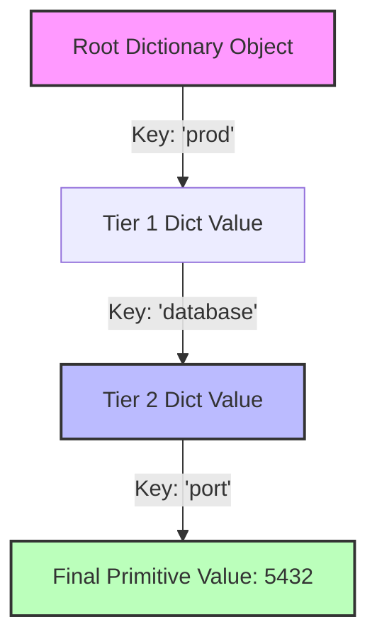
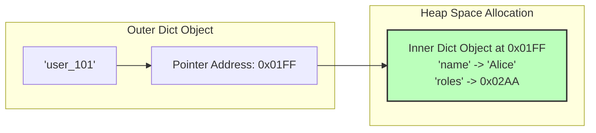

# Nested Dictionaries in Python: The Hierarchical Data Guide

---

# 1. Intuitive Introduction

In production applications, data is rarely flat. A single user profile doesn't just contain a name and an ID; it contains a cluster of security permissions, a history of login locations, and UI preferences. If you were to store this information using simple, flat key-value pairs, your keys would quickly become messy and hard to manage (e.g., `"user_101_home_address_city"`, `"user_101_home_address_zip"`).

A **nested dictionary** is a dictionary that contains other dictionaries as its values. It allows you to model complex, multi-layered data structures natively in Python.

### Real-World Footprints Across Industries

* **Web Engineering (JSON Parsing):** Modern APIs communicate via JSON payloads. When a Python framework like FastAPI handles an incoming request, it maps the nested JSON structure directly into a nested Python dictionary.
* **DevOps & Cloud Infrastructure:** Infrastructure configuration platforms (like AWS CloudFormation, Kubernetes YAML, or Docker Compose) translate complex, multi-tiered infrastructure state definitions directly into nested key-value objects.
* **Machine Learning & Deep Learning:** When saving advanced model architectures, the configuration states, optimization checkpoints, and layered hyperparameter weights are naturally stored as nested structures.

---

# 2. Real-World Analogy

Think of a nested dictionary as a **High-Security Corporate Filing Cabinet**.

If you want to find a specific financial transaction record, you don't just open the cabinet door and see millions of unorganized pages scattered everywhere. Instead, you follow a **structured path**:

1. First, you open a specific **Drawer (The Top-Level Key)** labeled `"Accounting"`.
2. Inside that drawer, you locate a specific **Folder (The Second-Level Key)** labeled `"Invoices_2026"`.
3. Inside that folder, you pull out a **Document (The Deepest Value)** labeled `"Invoice_04"`.

Each level acts as a map leading you to the next room or container. To get to the final document, you must specify the exact path of keys needed to unlock each container in sequence.

---

# 3. Core Theory

A nested dictionary is built on a simple rule: **The value associated with a key can be any valid Python object, including another dictionary.**

### 1. The Chained Lookup Engine

To access values deep inside a nested structure, you chain square bracket selectors `[key]` sequentially from left to right, moving down one structural tier at a time.

```python
# A structured configuration profile
cluster_config = {
    "network": {
        "ingress": {"port": 443, "protocol": "HTTPS"},
        "egress": {"port": 80, "protocol": "HTTP"}
    }
}

# Accessing the deep inner value
ingress_port = cluster_config["network"]["ingress"]["port"]
print(ingress_port) 
# Output: 443

```

### 2. Resolution Mechanics

Under the hood, Python resolves `cluster_config["network"]["ingress"]["port"]` in steps:

* Step 1: `cluster_config["network"]` runs a lookup and returns the intermediate dictionary: `{"ingress": {...}, "egress": {...}}`.
* Step 2: `["ingress"]` is called on that *returned intermediate object*, producing `{"port": 443, "protocol": "HTTPS"}`.
* Step 3: `["port"]` queries the final dictionary layer, returning `443`.

---

# 4. Concept Comparison

When managing complex, multi-field data structures, software architects often choose between nested dictionaries and Structured Objects (`dataclasses`).

| Metric | Nested Dictionary (`dict`) | Data Class (`dataclass`) |
| --- | --- | --- |
| **Schema Flexibility** | Dynamic. Fields can be added or deleted at runtime. | Strict. Fields must match the predefined type schema. |
| **Serialization** | Trivial. Converts natively to JSON via `json.dumps()`. | Requires validation helper frameworks. |
| **IDE Autocomplete** | Poor. Keys are strings, which IDEs can't predict. | Excellent. Fields act as standard dot-notation attributes. |
| **Memory Blueprint** | High. Each internal nested layer allocates its own hash map. | Optimized. Instances use less memory footprint overhead. |

---

# 5. Visual Explanation

Let's look at how Python maps out the internal lookup path for a multi-layered configuration profile.



---

# 6. Memory & Internal Working

When you nest dictionaries, Python does **not** create a single, unified block of memory. Instead, it creates independent dictionary objects in the heap space, and the outer dictionary simply stores references (pointers) to those inner dictionary memory addresses.

### Memory Layout Architecture



Because these are independent objects linked by references, a shallow copy (`.copy()`) only duplicates the top-level references. The inner dictionaries continue to point to the exact same memory locations, which can lead to accidental data updates across copies.

---

# 7. Creating the Object

Nested structures can be initialized using literals, step-by-step additions, or dynamically generated using nested comprehensions.

```python
# 1. Direct Literal Initialization (Highly readable)
system_nodes = {
    "node_01": {"ip": "192.168.1.10", "status": "ONLINE"},
    "node_02": {"ip": "192.168.1.11", "status": "OFFLINE"}
}

# 2. Dynamic Incremental Assignment
database_pool = {}
database_pool["primary"] = {}
database_pool["primary"]["host"] = "db.local"
database_pool["primary"]["max_conns"] = 100

# 3. Nested Dictionary Comprehension
# Example: Creating an identity coordinate matrix map
matrix = {f"row_{i}": {f"col_{j}": 0 for j in range(3)} for i in range(3)}
print(matrix["row_0"])
# Output: {'col_0': 0, 'col_1': 0, 'col_2': 0}

```

---

# 8. Core Operations & Deep Methods

Working with nested dictionaries requires extra care to prevent runtime errors when keys are missing.

### 1. Deep Safe Access via Chained `.get()`

If any intermediate key in a nested chain is missing, standard bracket notation crashes with a `KeyError`. You can handle this safely by chaining `.get()` statements and providing an empty dictionary `{}` as a fallback.

```python
user_profile = {"id": "usr_99", "settings": {"theme": "dark"}}

# Safe execution path even if 'settings' or 'notifications' is missing
email_alerts = user_profile.get("settings", {}).get("notifications", {}).get("email", False)
print(email_alerts) # Output: False

```

### 2. Automated Deep Tree Building via `collections.defaultdict`

To generate deeply nested branches on the fly without manually initializing empty dictionaries at every level, you can build a recursive `defaultdict`.

```python
from collections import defaultdict

# A recursive factory that returns a new defaultdict instance
def recursive_tree():
    return defaultdict(recursive_tree)

filesystem = recursive_tree()

# Instantly create nested branches without manual step-by-step initialization
filesystem["usr"]["local"]["bin"]["python3"] = "/usr/bin/python3"

# Cast back to a standard dict to inspect the output structure
import json
print(json.dumps(filesystem, indent=2))

```

---

# 9. Real Practical Examples

### Example 1: Extracting Mappings Safely (Basic)

```python
def extract_nested_metric(metrics: dict, target_service: str, target_key: str) -> float:
    """Safely extracts a target metric value from a nested system report."""
    return metrics.get(target_service, {}).get("performance", {}).get(target_key, 0.0)

raw_report = {
    "auth_service": {"performance": {"cpu": 12.5, "latency_ms": 150}},
    "payment_service": {"performance": {"cpu": 45.2}}
}
print(extract_nested_metric(raw_report, "auth_service", "latency_ms")) # Output: 150
print(extract_nested_metric(raw_report, "payment_service", "latency_ms")) # Output: 0.0

```

### Example 2: Recursive Configuration Merging (Intermediate)

When combining hierarchical settings, a standard `.update()` replaces entire nested blocks. This function recursively merges deep settings down to the individual keys instead.

```python
def deep_merge_configs(base: dict, patch: dict) -> dict:
    """Recursively merges dictionary values to preserve nested structures."""
    for key, value in patch.items():
        if isinstance(value, dict) and key in base and isinstance(base[key], dict):
            deep_merge_configs(base[key], value)
        else:
            base[key] = value
    return base

global_rules = {"security": {"ssl": True, "cipher": "ECDH"}, "timeout": 30}
local_overrides = {"security": {"cipher": "AES_GCM"}}

print(deep_merge_configs(global_rules, local_overrides))
# Output: {'security': {'ssl': True, 'cipher': 'AES_GCM'}, 'timeout': 30}

```

### Example 3: Thread-Safe Telemetry Cache with Auto-Eviction (Production Quality)

This production-ready monitor aggregates metric streams from distributed systems, organizing data by node and subsystem while preventing thread conflict issues.

```python
import threading
import time

class TelemetryAggregator:
    def __init__(self):
        self._storage = {}
        self._lock = threading.Lock()

    def submit_metric(self, node_id: str, subsystem: str, metric_name: str, value: float) -> None:
        """Thread-safe write into a multi-tiered tracking data layout."""
        with self._lock:
            # Step 1: Initialize node level if missing
            if node_id not in self._storage:
                self._storage[node_id] = {}
                
            # Step 2: Initialize subsystem level if missing
            if subsystem not in self._storage[node_id]:
                self._storage[node_id][subsystem] = {}
                
            # Step 3: Write data point
            self._storage[node_id][subsystem][metric_name] = {
                "value": value,
                "timestamp": time.time()
            }

    def fetch_snapshot(self) -> dict:
        """Returns an isolated copy of the telemetry state."""
        import copy
        with self._lock:
            return copy.deepcopy(self._storage)

# Production System Simulation Run
monitor = TelemetryAggregator()
monitor.submit_metric("compute_node_alpha", "engine_room", "core_temp", 74.8)
monitor.submit_metric("compute_node_alpha", "memory_bank", "swap_used_gb", 2.4)

print(monitor.fetch_snapshot()["compute_node_alpha"]["engine_room"]["core_temp"]["value"])
# Output: 74.8

```

---

# 10. Machine Learning & Data Science Connection

In modern machine learning pipelines, deep nested dictionaries are used to organize models, manage features, and store pipeline metadata.

### 1. Hierarchical Feature Extraction

When handling natural language processing or multimodal inputs, datasets often come organized as hierarchical records.

```python
# High-dimensional sample profile representation inside a data loader
ml_sample = {
    "features": {
        "dense_embeddings": [0.125, -0.998, 0.441, 0.002],
        "categorical_labels": {"country": 12, "device_type": 2}
    },
    "metadata": {"batch_index": 2048, "partition_date": "2026-07-03"}
}

# Pulling specific values for model inputs
embedding_vector = ml_sample["features"]["dense_embeddings"]

```

### 2. Managing Deep Learning Training States

Frameworks like PyTorch use nested structures to hold configurations, check-pointed network layer configurations, and optimization hyperparameters.

```python
training_checkpoint = {
    "epoch": 45,
    "model_state_dict": {
        "layer_1.weights": [0.1, 0.5],
        "layer_2.weights": [[-0.1, 0.2], [0.4, 0.8]]
    },
    "optimizer_state_dict": {
        "param_groups": [{"lr": 0.001, "weight_decay": 0.01}]
    }
}

```

---

# 11. Common Mistakes & Pitfalls

### 1. Blind Chaining Leading to `KeyError` Failures

* **Wrong Code:**
```python
response = {"status": "Success", "data": {}}
user_city = response["data"]["location"]["city"] # Raises KeyError: 'location'

```


* **Why it happens:** If any intermediate key along the lookup path is missing or empty, the entire application crashes.
* **Correction:** Use defensive checks or chain `.get()` statements with fallback options.
```python
user_city = response.get("data", {}).get("location", {}).get("city", "Unknown")

```


### 2. Accidental Value Sharing via Shallow Copying

* **Wrong Code:**
```python
default_profile = {"meta": {"role": "Guest"}}
user_A = default_profile.copy()
user_B = default_profile.copy()

user_A["meta"]["role"] = "Admin"
print(user_B["meta"]["role"]) # Output: Admin -> User B was accidentally altered!

```


* **Why it happens:** `.copy()` only duplicates the top-level references. The inner dictionary reference still points to the exact same object in memory for both users.
* **Correction:** Use `copy.deepcopy()` to create completely independent objects.
```python
import copy
user_A = copy.deepcopy(default_profile)

```


---

# 12. Performance Considerations

| Operation Type | Time Complexity | Memory Cost | Technical Explanation |
| --- | --- | --- | --- |
| **Chained Read Access** | $O(d)$ where $d$ is depth | $O(1)$ | Python performs $d$ sequential hash lookups, moving down one level at a time. |
| **Deep Struct Duplication** | $O(n)$ where $n$ is total keys | $O(n)$ | `deepcopy` must recursively duplicate every sub-dictionary object in memory. |

> **Architectural Performance Tip:** While lookups remain fast, deeply nested structures can hurt performance if you frequently perform deep copies. If you need to search across multiple levels regularly, consider flattening the keys or using a relational storage model instead.

---

# 13. When NOT to Use This Concept

1. **Tabular or Matrix Operations:** If your nested data forms a clean grid or matrix (e.g., rows and columns of numerical data), avoid nested dictionaries. Use a **NumPy array** or a **Pandas DataFrame** instead, which are optimized for performance and run up to 100x faster.
2. **Complex Object Relationships:** If your data requires entities to link to each other in complex ways (e.g., many-to-many networks), nested dictionaries quickly become difficult to maintain. Use an explicit object model or a dedicated database graph instead.

---

# 14. Interview Questions

### Beginner Level

1. **How do you access the value associated with the key `'target'` inside `d = {'a': {'b': {'target': 42}}}`?**
* *Answer:* `d['a']['b']['target']`.


2. **What exception is raised if an intermediate key in a nested dictionary chain does not exist?**
* *Answer:* A `KeyError`.


3. **How can you add a new nested key-value pair `{'status': 'active'}` under an existing key `'session'` inside a dictionary?**
* *Answer:* `d['session']['status'] = 'active'`.


4. **Why does `json.dumps()` work so well with nested dictionaries?**
* *Answer:* The syntax rules of a Python dictionary closely mirror the JSON standard. This allows Python's built-in `json` library to easily serialize nested dictionaries into valid JSON strings.


5. **How can you clear all the elements inside a nested dictionary without losing the top-level container?**
* *Answer:* Target the nested dictionary directly and call its clear method: `d['nested_key'].clear()`.


---

### Intermediate Level

6. **Explain the risks of using a shallow copy (`.copy()`) on a nested dictionary structure.**
* *Answer:* A shallow copy only creates a new container for the top-level keys. Any nested dictionaries inside it are copied by reference, meaning the new dictionary still points to the original nested objects. Modifying an inner dictionary in the copy will accidentally update the original dictionary as well.


7. **How does chaining multiple `.get()` methods prevent application crashes during deep nested lookups?**
* *Answer:* By providing an empty dictionary `{}` as a fallback for intermediate missing keys (e.g., `d.get('k1', {}).get('k2')`), you ensure that subsequent `.get()` calls always execute against a valid dictionary object instead of raising a `KeyError`.


8. **Write a quick snippet to convert `{'a_b': 1}` into a nested structure `{'a': {'b': 1}}`.**
* *Answer:*
```python
flat = {'a_b': 1}
nested = {}
for k, v in flat.items():
    p1, p2 = k.split('_')
    nested.setdefault(p1, {})[p2] = v

```


9. **What is the advantage of using a recursive `defaultdict` over a standard dictionary?**
* *Answer:* A recursive `defaultdict` automatically instantiates missing nested levels on the fly. This lets you write to deeply nested paths (like `d['a']['b']['c'] = 1`) instantly, without needing to manually check and initialize empty dictionaries at each level.


10. **How can you safely iterate over all the second-level keys within a nested dictionary?**
* *Answer:* Loop through the top-level values (which are the inner dictionaries) and iterate over their keys:
```python
for outer_key, inner_dict in d.items():
    if isinstance(inner_dict, dict):
        for inner_key in inner_dict.keys():
            # Process inner_key safely here

```


---

### Advanced Level

11. **Write a recursive function that flattens a nested dictionary into a single-level dictionary, using dots to join the keys (e.g., `{'a': {'b': 1}}` becomes `{'a.b': 1}`).**
* *Answer:*
```python
def flatten_dict(nested_dict: dict, parent_key: str = '', separator: str = '.') -> dict:
    items = {}
    for key, value in nested_dict.items():
        new_key = f"{parent_key}{separator}{key}" if parent_key else key
        if isinstance(value, dict):
            items.update(flatten_dict(value, new_key, separator=separator))
        else:
            items[new_key] = value
    return items

```


12. **How does CPython handle memory allocation and object tracking when a nested sub-dictionary is removed using the `del` keyword?**
* *Answer:* When you delete a nested sub-dictionary reference using `del outer['inner']`, CPython removes that pointer from the outer dictionary's entries array and decrements the inner dictionary object's reference count. If that reference count hits zero, CPython's garbage collector immediately deallocates its memory slots.


13. **Explain the architectural trade-offs between storing system states in a deep nested dictionary versus flattening the keys using composite tuple keys.**
* *Answer:* A nested dictionary provides a clean, hierarchical view that maps well to formats like JSON, but it requires multiple lookups and creates more object overhead in memory. A flat dictionary with composite tuple keys (e.g., `d[(level1, level2)]`) uses less memory and offers faster $O(1)$ lookups, but it loses structural grouping features and is harder to serialize directly to JSON.


14. **How would you handle a `RecursionError` when writing an analytics engine designed to process deep nested dictionary payloads?**
* *Answer:* A `RecursionError` happens if the nesting depth exceeds Python's execution stack limit. To prevent this, replace the recursive processing logic with a custom iterative loop that uses a list as an explicit stack to trace and manage the remaining dictionary nodes.


15. **Why can `copy.deepcopy()` significantly slow down your application when working with large nested dictionaries that contain shared reference values?**
* *Answer:* To preserve data integrity, `deepcopy` maintains an internal memoization map to track every object identity it encounters. This prevents infinite loops when handling circular references, but checking and updating this map adds computational overhead, making it much slower than direct memory copies.


---

# 15. Mini Project: Dynamic Hierarchical Permissions System

This production-inspired access control engine parses multi-tiered roles and securely checks user permissions across complex resource structures.

```python
class AuthorizationEngine:
    def __init__(self, policy_blueprint: dict):
        # Stores the nested security rule mappings
        self.policies = policy_blueprint

    def evaluate_access(self, role: str, resource: str, action: str) -> bool:
        """Evaluates access permissions using a safe, nested lookup path."""
        role_rules = self.policies.get(role, {})
        resource_rules = role_rules.get(resource, {})
        
        # Check explicit permission rules
        if action in resource_rules:
            return resource_rules[action]
            
        # Fallback check: Look for a wildcard '*' rule that covers all actions
        return resource_rules.get("*", False)

# Security Blueprint Definition
company_policy = {
    "engineer": {
        "source_code": {"read": True, "write": True, "delete": False},
        "prod_database": {"read": True, "write": False}
    },
    "admin": {
        "source_code": {"*": True},
        "prod_database": {"*": True}
    }
}

# System Authorization Test
auth_system = AuthorizationEngine(company_policy)

print(auth_system.evaluate_access("engineer", "source_code", "write"))   # Output: True
print(auth_system.evaluate_access("engineer", "source_code", "delete"))  # Output: False
print(auth_system.evaluate_access("admin", "prod_database", "delete"))   # Output: True (via Wildcard)

```

---

# 16. Best Practices

1. **Enforce Safe Lookups:** Avoid direct bracket chaining like `d['a']['b']` unless you are certain the keys exist. Use `.get()` defaults or `try/except` blocks instead.
2. **Use Deep Copies for Isolation:** Always use `copy.deepcopy()` when duplicating a nested dictionary to prevent accidental data changes across instances.
3. **Limit Nesting Depth:** As a rule of thumb, keep your nesting to three levels or fewer. If your data requires more layers, move it into clean `dataclasses` or custom objects.
4. **Leverage Native Serialization:** Keep your nested dictionary keys as basic strings or numbers. This guarantees they can be safely serialized to JSON without requiring custom conversion steps.
5. **Document Layout Schemas:** Because Python doesn't enforce strict types on dictionaries, always include a code comment or documentation snippet showing a sample layout of your nested dictionary schema.

---

# 17. Summary Table

| Concept Layer | Key Purpose | Primary Lookup Tool | Major Operational Benefit | Critical Hazard |
| --- | --- | --- | --- | --- |
| **Nested Dictionary** | Hierarchical data modeling | Chained selectors `d[k1][k2]` | Maps natively to JSON formats | Vulnerable to `KeyError` crashes |
| **Recursive Tree** | Dynamic node creation | `collections.defaultdict` | Automatically builds missing sub-levels | Can mask data entry errors |
| **Deep Copying** | Complete object isolation | `copy.deepcopy()` | Prevents shared reference issues | High processing overhead on large datasets |

---

# 18. Key Takeaways

* **Hierarchical Layouts:** Nested dictionaries are ideal for modeling multi-tiered data structures like JSON payloads or configuration files.
* **Reference Linkages:** Inner dictionaries are independent objects stored in memory and linked to the outer dictionary by reference pointers.
* **Defensive Access:** Use chained `.get()` statements with an empty dictionary fallback `{}` to read deep values without risking a application crash.
* **Isolation Control:** Standard shallow copies do not isolate nested objects. Use `copy.deepcopy()` to completely decouple multi-layered data structures.
* **Schema Evolution:** While flexible, deeply nested dictionaries lack strict schema enforcement and IDE autocompletion features compared to custom class definitions.

---

# Next Topic Suggestion: Sets (`set`)

**Why learn this next?** Now that you've mastered Python's core key-value structures, the next logical step is to explore **Sets**. Sets use the exact same high-speed hashing mechanics as dictionaries, but store unique keys without values, making them the ultimate tool for fast duplicate filtration and mathematical set operations.