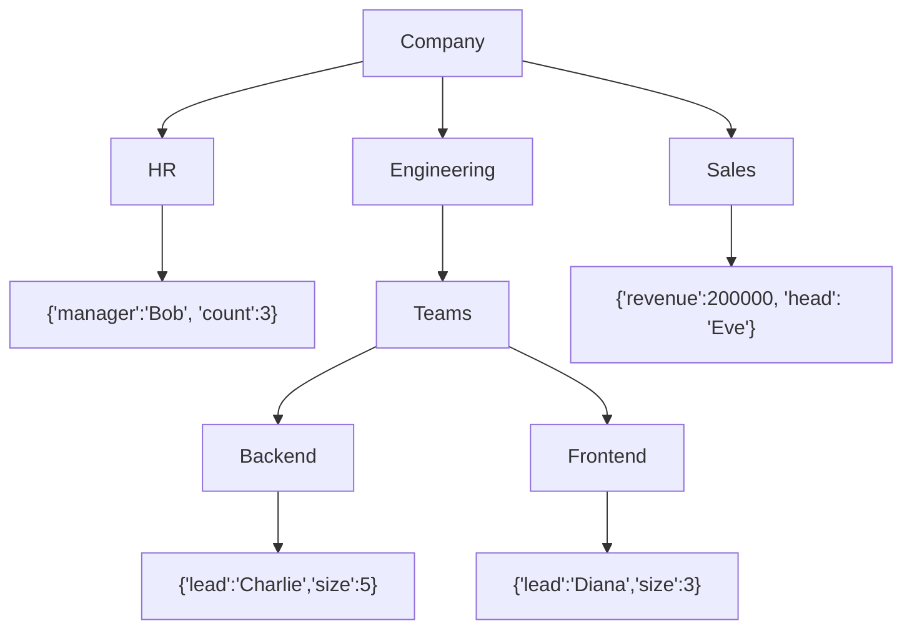
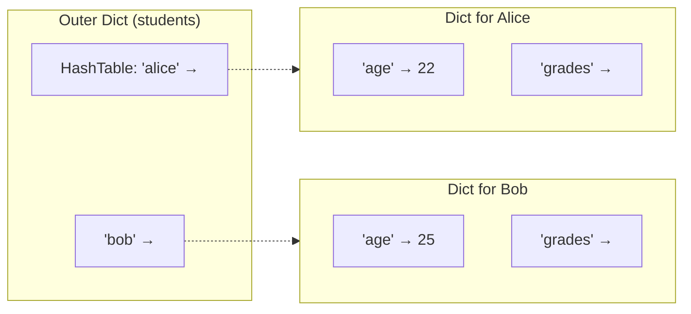

# 📘 Nested Dictionary: Hierarchical Data Mastery

> *A complete, deep‑dive learning note on dictionaries within dictionaries – for complex, real‑world data structures*

---

## 1. Intuitive Introduction

Imagine you’re organizing a **university database**. Each student has a name, but also an address (which itself has street, city, zip), grades per subject (subject → list of scores), and contact info (phone, email). A flat dictionary with simple key‑value pairs can’t capture this richness. You need a **nested dictionary** – a dictionary where values can themselves be dictionaries (or lists, etc.).

In Python, a nested dictionary is simply a dictionary whose values are other dictionaries. This mirrors **JSON**, **YAML**, and most real‑world data formats.

Where nested dictionaries shine:
- **Web development** – API responses (JSON) are deeply nested: `user["address"]["city"]`
- **Data science** – Configuration files, hyperparameter grids, nested experiment results
- **Machine learning** – Model architectures (layers with parameters), nested cross‑validation results
- **Gaming** – Game state: `players["Alice"]["inventory"]["weapons"]`
- **System administration** – Nested configs: `config["database"]["credentials"]["password"]`

Why nested dictionaries? Because reality is hierarchical. A flat structure forces you to concatenate keys (`"user_address_city"`), which is clumsy, error‑prone, and hard to query.

---

## 2. Real‑World Analogy

**The Filing Cabinet with Drawers and Folders** 🗄️

Think of a filing cabinet:
- The **outer dictionary** is the cabinet itself – each drawer label is a key.
- Each **drawer** (value) is another dictionary containing folders.
- Folders can contain documents (final values) or even more folders.

Example: Cabinet `"HR"` → Drawer `"Employees"` → Folder `"Alice"` → Document `"salary"`. To get Alice’s salary, you open the HR cabinet, pull the Employees drawer, find the Alice folder, and read the salary document.

In Python: `cabinet["HR"]["Employees"]["Alice"]["salary"]`

This is natural because we think in hierarchies: company → department → employee → attribute.

---

## 3. Core Theory

A **nested dictionary** is a dictionary where at least one value is another dictionary. The nesting can be arbitrarily deep. Keys at any level must be hashable (as usual), and values can be any mix of dictionaries, lists, scalars, or other containers.

**Properties:**
- **Hierarchical** – natural for tree‑like or graph data.
- **Mutable at any level** – you can add, update, delete nested sub‑dicts.
- **Access via chained indexing** – `d[outer_key][inner_key]`.
- **Not automatically recursive** – operations like `.copy()` are shallow; deep nesting requires `deepcopy`.
- **Ordered** – since Python 3.7, insertion order is preserved at every level.
- **Can contain mixed types** – a value can be a dict, list, int, string, etc.

**Simple example:**
```python
student = {
    "name": "Alice",
    "grades": {"math": 95, "physics": 88},
    "contact": {"email": "alice@example.com", "phone": "555-1234"}
}
print(student["grades"]["math"])   # 95
```

**Important concept:** Accessing a deep key requires that every intermediate key exists. Missing any key raises `KeyError`. Use `.get()` recursively or libraries like `glom` for safe access.

---

## 4. Visual Explanation – Structure of a Nested Dictionary

Below is a Mermaid diagram representing a nested dictionary for a company:



In Python:
```python
company = {
    "HR": {"manager": "Bob", "count": 3},
    "Engineering": {
        "Teams": {
            "Backend": {"lead": "Charlie", "size": 5},
            "Frontend": {"lead": "Diana", "size": 3}
        }
    },
    "Sales": {"revenue": 200000, "head": "Eve"}
}
```

---

## 5. Memory & Internal Working

A nested dictionary is simply a regular `dict` object where some values point to **other `dict` objects**. Each dictionary has its own hash table (indices + entries). Nesting means one dict’s entry contains a reference (pointer) to another dict’s memory address.

**Memory diagram:**



**Key points:**
- Each dictionary has its own resizing policy – a deeply nested structure may cause many independent hash tables.
- Changing a nested value does **not** require rehashing outer dictionaries.
- `copy()` on the outer dict copies references to inner dicts – both outer and copy share the same inner dicts (shallow).
- `deepcopy()` recursively creates new inner dicts.

---

## 6. Creating Nested Dictionaries

### 6.1 Manual Literal Creation

```python
# Direct nesting
person = {
    "name": "Alice",
    "address": {
        "street": "123 Main St",
        "city": "Springfield",
        "zip": "12345"
    }
}
```

### 6.2 Step‑by‑Step Building

```python
data = {}
data["user"] = {}
data["user"]["name"] = "Bob"
data["user"]["age"] = 30
# Or nested assignment directly
data["settings"]["theme"] = "dark"  # KeyError: 'settings' missing first!
# Must create intermediate dicts first:
data["settings"] = {}
data["settings"]["theme"] = "dark"
```

### 6.3 Using `setdefault` for Deep Nesting

```python
data = {}
data.setdefault("user", {}).setdefault("profile", {})["nickname"] = "bobby"
print(data)  # {'user': {'profile': {'nickname': 'bobby'}}}
```

### 6.4 Using `defaultdict` for Recursive Nesting

```python
from collections import defaultdict

def nested_dict():
    return defaultdict(nested_dict)

nd = nested_dict()
nd["a"]["b"]["c"] = 42
print(nd["a"]["b"]["c"])  # 42
# nd is an infinitely nestable structure
```

### 6.5 From JSON String

```python
import json
json_str = '{"name":"Alice", "address":{"city":"NYC"}}'
d = json.loads(json_str)
print(d["address"]["city"])  # NYC
```

### 6.6 Dict Comprehension with Nesting

```python
# Create a matrix as nested dict: {row: {col: value}}
matrix = {i: {j: i*j for j in range(3)} for i in range(3)}
print(matrix)
# {0: {0:0,1:0,2:0}, 1:{0:0,1:1,2:2}, 2:{0:0,1:2,2:4}}
```

**Common mistakes while creating:**
- Forgetting to create intermediate dictionaries → `KeyError`.
- Using `copy()` expecting deep copy → unexpected sharing.
- Over‑nesting when a flat structure or class would be clearer.

---

## 7. Core Operations / Methods on Nested Dicts

The same dictionary methods apply, but they operate at the level they are called. For nested access, you chain calls.

### 7.1 Accessing Nested Values (Reading)

```python
d = {"a": {"b": {"c": 42}}}
# Direct chaining
print(d["a"]["b"]["c"])      # 42

# Using .get() at each level to avoid KeyError
val = d.get("a", {}).get("b", {}).get("c")
print(val)                   # 42

# Safe with default
val = d.get("x", {}).get("y", {}).get("z", "not found")
print(val)                   # 'not found'
```

### 7.2 Updating Nested Values

```python
d = {"user": {"name": "Alice", "age": 25}}
d["user"]["age"] = 26        # update
d["user"]["city"] = "Paris"  # add new nested key
print(d)  # {'user': {'name': 'Alice', 'age': 26, 'city': 'Paris'}}
```

### 7.3 Deleting Nested Keys

```python
d = {"a": {"b": 1, "c": 2}}
del d["a"]["b"]              # removes b
print(d)                     # {'a': {'c': 2}}

# To delete an entire nested dict:
del d["a"]                   # removes the whole inner dict
```

### 7.4 Iterating Over Nested Dicts

```python
d = {"alice": {"age": 25, "city": "NYC"}, "bob": {"age": 30, "city": "LA"}}

# Iterate outer keys, then inner items
for name, info in d.items():
    print(f"{name}:")
    for key, value in info.items():
        print(f"  {key} -> {value}")
```

### 7.5 Merging Nested Dicts (Shallow vs Deep)

```python
# Shallow merge – inner dicts are replaced, not merged
d1 = {"a": {"x": 1, "y": 2}}
d2 = {"a": {"z": 3}}
d1.update(d2)                # d1 becomes {'a': {'z': 3}} – 'x','y' lost!

# Deep merge requires custom recursion
def deep_merge(a, b):
    for key in b:
        if key in a and isinstance(a[key], dict) and isinstance(b[key], dict):
            deep_merge(a[key], b[key])
        else:
            a[key] = b[key]
    return a

d1 = {"a": {"x": 1, "y": 2}}
d2 = {"a": {"z": 3}, "b": 5}
merged = deep_merge(d1, d2)
print(merged)  # {'a': {'x':1, 'y':2, 'z':3}, 'b':5}
```

### 7.6 Copying Nested Dicts

```python
import copy
original = {"a": {"b": [1,2,3]}}
shallow = original.copy()
deep = copy.deepcopy(original)

shallow["a"]["b"].append(4)
deep["a"]["b"].append(5)
print(original["a"]["b"])  # [1,2,3,4] – changed via shallow
print(original["a"]["b"])  # still [1,2,3,4] (deep unchanged)
```

---

## 8. Advanced Concepts

### 8.1 Recursive Traversal and Search

```python
def find_key(d, target_key):
    """Recursively search for a key in nested dict, return first value."""
    for k, v in d.items():
        if k == target_key:
            return v
        if isinstance(v, dict):
            result = find_key(v, target_key)
            if result is not None:
                return result
    return None

d = {"a": {"b": {"c": 42, "d": 100}}}
print(find_key(d, "c"))  # 42
```

### 8.2 Flattening a Nested Dictionary

```python
def flatten_dict(d, parent_key='', sep='.'):
    items = []
    for k, v in d.items():
        new_key = f"{parent_key}{sep}{k}" if parent_key else k
        if isinstance(v, dict):
            items.extend(flatten_dict(v, new_key, sep=sep).items())
        else:
            items.append((new_key, v))
    return dict(items)

nested = {"a": 1, "b": {"c": 2, "d": {"e": 3}}}
flat = flatten_dict(nested)
print(flat)  # {'a':1, 'b.c':2, 'b.d.e':3}
```

### 8.3 Using `collections.ChainMap` for Multiple Nested Sources

```python
from collections import ChainMap
defaults = {"theme": "light", "font": "Arial"}
user = {"theme": "dark"}
site = {"font": "Roboto"}
# ChainMap simulates nested lookup without mutating
combined = ChainMap(user, site, defaults)
print(combined["theme"])  # 'dark' (first found)
print(combined["font"])   # 'Roboto'
```

### 8.4 Safe Nested Access with `glom` Library

```python
# pip install glom
from glom import glom

d = {"user": {"profile": {"name": "Alice"}}}
name = glom(d, "user.profile.name", default="Unknown")
print(name)  # 'Alice'
```

### 8.5 Nested Dictionaries as Trees (File System Simulation)

```python
fs = {}
def mkdir(path, fs=fs):
    parts = path.strip('/').split('/')
    current = fs
    for part in parts:
        current = current.setdefault(part, {})

mkdir("/home/user/docs")
mkdir("/home/user/pics")
mkdir("/var/log")
print(fs)  # {'home': {'user': {'docs': {}, 'pics': {}}}, 'var': {'log': {}}}
```

---

## 9. Mathematical / Special Operations

Nested dictionaries themselves don’t have algebraic operations, but you can perform set operations on paths or use recursion for mathematical merging (e.g., sum of values at certain paths).

Example: Sum all leaf integers in a nested dict:

```python
def sum_leaves(d):
    total = 0
    for v in d.values():
        if isinstance(v, dict):
            total += sum_leaves(v)
        elif isinstance(v, (int, float)):
            total += v
    return total

d = {"a": 1, "b": {"c": 2, "d": {"e": 3}}}
print(sum_leaves(d))  # 6
```

---

## 10. Real Practical Examples

### Example 1: Configuration Management with Environment Overrides

```python
# Base config
config = {
    "database": {
        "host": "localhost",
        "port": 5432,
        "credentials": {
            "user": "admin",
            "password": "secret"
        }
    },
    "logging": {"level": "INFO"}
}

# Environment overrides (e.g., from JSON)
env_config = {
    "database": {
        "host": "prod.db.com",
        "credentials": {"password": "prod_secret"}
    },
    "logging": {"level": "DEBUG"}
}

def deep_update(base, updates):
    for k, v in updates.items():
        if k in base and isinstance(base[k], dict) and isinstance(v, dict):
            deep_update(base[k], v)
        else:
            base[k] = v
    return base

final = deep_update(config, env_config)
print(final["database"]["host"])       # 'prod.db.com'
print(final["database"]["credentials"]["password"])  # 'prod_secret'
print(final["database"]["port"])       # 5432 (unchanged)
```

### Example 2: Building a Family Tree

```python
family = {
    "John": {
        "spouse": "Jane",
        "children": {
            "Alice": {"birth_year": 2000},
            "Bob": {"birth_year": 2002}
        }
    },
    "Mary": {
        "spouse": "Mike",
        "children": {}
    }
}

def add_child(parent, child_name, birth_year):
    if parent not in family:
        family[parent] = {"spouse": None, "children": {}}
    family[parent]["children"][child_name] = {"birth_year": birth_year}

add_child("John", "Charlie", 2005)
print(family["John"]["children"]["Charlie"])  # {'birth_year':2005}
```

---

## 11. ML & Data Science Connection

Nested dictionaries are the workhorse for complex configuration, hyperparameter search, and nested data in ML.

### Pandas – MultiIndex from Nested Dict

```python
import pandas as pd
# Nested dict becomes DataFrame with MultiIndex
data = {
    "2019": {"Alice": 85, "Bob": 90},
    "2020": {"Alice": 88, "Bob": 92}
}
df = pd.DataFrame(data).T  # years as rows, names as columns
print(df)
```

### Hyperparameter Grids for Scikit‑learn

```python
param_grid = {
    "classifier": {
        "name": "RandomForest",
        "params": {
            "n_estimators": [100, 200],
            "max_depth": [10, 20, None]
        }
    },
    "preprocessing": {
        "scaler": ["standard", "minmax"],
        "imputer": {"strategy": ["mean", "median"]}
    }
}
# Use recursion to generate all combinations (product of nested lists)
```

### TensorFlow / PyTorch – Model Configuration

```python
model_config = {
    "layers": [
        {"type": "conv2d", "filters": 32, "kernel_size": 3},
        {"type": "pool", "pool_size": 2},
        {"type": "dense", "units": 128}
    ],
    "optimizer": {"name": "adam", "lr": 0.001},
    "loss": "sparse_categorical_crossentropy"
}
```

### JSON Data from APIs (typical ML data pipeline)

```python
import requests
response = requests.get("https://api.example.com/user/123")
data = response.json()  # nested dict
user_city = data.get("address", {}).get("city", "Unknown")
```

### Experiment Tracking (e.g., MLflow)

```python
experiment = {
    "run_id": "abc123",
    "metrics": {"accuracy": 0.92, "loss": 0.23},
    "params": {"learning_rate": 0.01, "batch_size": 32},
    "artifacts": {"model_path": "s3://bucket/model.pkl"}
}
```

---

## 12. Common Mistakes & Pitfalls

| Mistake | Wrong Code | Consequence | Fix |
|---------|------------|-------------|-----|
| **Assuming intermediate dicts exist** | `d["a"]["b"] = 1` without creating `d["a"]` first | `KeyError: 'a'` | Use `d.setdefault("a", {})["b"] = 1` or check existence |
| **Shallow copy of nested dict** | `d2 = d1.copy(); d2["a"]["b"]=5` | Modifies `d1["a"]["b"]` as well | Use `copy.deepcopy()` |
| **Using `update()` expecting deep merge** | `d1.update(d2)` where values are dicts | Overwrites nested dicts instead of merging | Write recursive `deep_merge` |
| **Over‑nesting without necessity** | `config["server"]["settings"]["advanced"]["timeout"]` | Hard to read, maintain, and debug | Consider flattening or using classes |
| **Performance trap: deep recursion on large dicts** | Recursive traversal without tail recursion | Stack overflow or slowness | Use iterative stack (list) for deep trees |
| **Modifying while iterating** | `for k in d: d[k]["new"] = val` inside loop that adds keys | RuntimeError or infinite loop | Iterate over `list(d.keys())` |

**Example of safe nested assignment:**

```python
# Bad
d = {}
d["user"]["name"] = "Alice"   # KeyError

# Good – with setdefault
d.setdefault("user", {})["name"] = "Alice"

# Better – using defaultdict
from collections import defaultdict
d = defaultdict(dict)
d["user"]["name"] = "Alice"   # works because defaultdict creates missing dict
```

---

## 13. Performance Considerations

| Operation | Time Complexity | Notes |
|-----------|----------------|-------|
| Access nested value (`d[a][b]`) | O(k) where k = number of levels | Each level is O(1) lookup |
| Update nested value | O(k) | Same as access |
| Delete nested key | O(k) | + removal O(1) at deepest dict |
| Iterate over all leaf values | O(total number of key‑value pairs across all dicts) | Recursive traversal |
| Deep copy (`deepcopy`) | O(total size of structure) | Copies every object recursively |
| Shallow copy | O(number of top‑level keys) | Only copies references |
| Recursive merge | O(total keys) | Depends on depth and breadth |

**Memory overhead:** Each nested dictionary has its own hash table overhead (~72 bytes per entry plus table overhead). Deep nesting multiplies this overhead. For huge hierarchical data, consider **tree libraries** (`anytree`) or **databases**.

**When to avoid deep nesting:**
- Very large flat data – use pandas or NumPy.
- Frequent deep copies – expensive.
- Need to serialize often – JSON handles it, but deep nesting increases size.

---

## 14. Interview Questions

### Beginner (5 questions)

1. **Q:** What is a nested dictionary?  
   **A:** A dictionary where one or more values are themselves dictionaries, allowing hierarchical data representation.

2. **Q:** How do you access `"city"` from `person = {"name":"Alice","address":{"city":"NYC"}}`?  
   **A:** `person["address"]["city"]`.

3. **Q:** What happens if you try `d["a"]["b"]` when `d["a"]` doesn’t exist?  
   **A:** `KeyError: 'a'`. You must ensure the outer key exists first.

4. **Q:** How can you safely get a deeply nested value without raising KeyError?  
   **A:** Chain `.get()`: `d.get("a", {}).get("b", {}).get("c")`.

5. **Q:** Does `d.copy()` create a fully independent copy if `d` contains nested dicts?  
   **A:** No, it’s shallow. Inner dicts are shared. Use `copy.deepcopy(d)` for full independence.

### Intermediate (5 questions)

1. **Q:** Write a function to recursively print all keys and values in a nested dict with indentation.  
   **A:**  
   ```python
   def print_nested(d, indent=0):
       for k, v in d.items():
           print("  " * indent + str(k))
           if isinstance(v, dict):
               print_nested(v, indent+1)
           else:
               print("  " * (indent+1) + str(v))
   ```

2. **Q:** How would you merge two nested dicts where values for the same key are combined recursively instead of overwritten?  
   **A:** Use a recursive function that, when both values are dicts, recurses; otherwise, overwrites or combines (e.g., sums lists).

3. **Q:** Explain the output:  
   ```python
   d = {"a": {"b": 1}}
   e = d
   e["a"]["b"] = 2
   print(d["a"]["b"])
   ```  
   **A:** 2. `e` references the same dict as `d`, so modifying nested value affects both.

4. **Q:** How can you count the total number of leaf nodes (non‑dict values) in a nested dict?  
   **A:** Recursively traverse, count when `not isinstance(v, dict)`.

5. **Q:** What is the advantage of using `defaultdict` for building nested dicts dynamically?  
   **A:** It automatically creates missing intermediate dicts, avoiding `setdefault` boilerplate.

### Advanced (5 questions)

1. **Q:** Implement a `NestedDict` class that allows attribute‑style access: `nd.a.b.c = 42`.  
   **A:** Subclass `dict` and override `__getattr__` and `__setattr__` to convert keys to attributes, recursively wrapping nested dicts.

2. **Q:** How does Python’s `json` module handle circular references in nested dicts?  
   **A:** It raises `ValueError: Circular reference detected` because JSON cannot represent cycles. Use custom encoders or libraries like `pickle`.

3. **Q:** Write a generator that yields all paths (as tuples of keys) to leaf values in a nested dict.  
   **A:**  
   ```python
   def paths(d, prefix=()):
       for k, v in d.items():
           if isinstance(v, dict):
               yield from paths(v, prefix + (k,))
           else:
               yield prefix + (k,)
   ```

4. **Q:** Compare the performance of nested dict vs. flattening with dot‑separated keys for lookups and updates.  
   **A:** Nested dict is faster for deep access (multiple hash lookups) vs. flattening requires parsing string keys or multiple splits. Flattening uses less memory overhead (one dict instead of many). Choose based on access pattern.

5. **Q:** Design a memory‑efficient nested dictionary for a 10‑level deep tree with 1 million leaves. How would you avoid overhead?  
   **A:** Use a single dict with composite keys (`(level1, level2, ...)`) or a trie structure. Alternatively, use `sqlite3` with recursive queries or `pandas` MultiIndex.

---

## 15. Mini Project Idea

**Project: File System Explorer – Simulate Directory Tree with Nested Dict**

Build a CLI tool that represents a file system as a nested dictionary. Support:
- `cd path` – change current directory (maintain a stack/list of keys)
- `ls` – list contents of current directory
- `mkdir dirname` – create a new nested dict at current path
- `touch filename` – create a file (store empty dict or file metadata)
- `tree` – recursive print of entire structure with indentation

**Sample code structure:**

```python
class FileSystem:
    def __init__(self):
        self.root = {}
        self.cwd = []  # stack of keys to current directory
    
    def _get_cwd_dict(self):
        d = self.root
        for part in self.cwd:
            d = d[part]
        return d
    
    def mkdir(self, name):
        d = self._get_cwd_dict()
        if name not in d:
            d[name] = {}
        else:
            print("Already exists")
    
    def touch(self, name):
        d = self._get_cwd_dict()
        d[name] = None  # file represented by None (or metadata dict)
    
    def ls(self):
        print(list(self._get_cwd_dict().keys()))
    
    def cd(self, path):
        if path == "..":
            if self.cwd:
                self.cwd.pop()
        else:
            d = self._get_cwd_dict()
            if path in d and isinstance(d[path], dict):
                self.cwd.append(path)
            else:
                print("Not a directory")
    
    def tree(self, d=None, indent=0):
        if d is None:
            d = self.root
        for name, content in d.items():
            print("  " * indent + name)
            if isinstance(content, dict):
                self.tree(content, indent + 1)
```

**Extend with file metadata (size, permissions), save/load using JSON.**

---

## 16. Best Practices

1. **Check existence before deep access** – Use `.get()` chaining or `try/except` for optional paths.
2. **Use `defaultdict` or `setdefault`** for dynamic building to avoid `KeyError` when creating nested structures.
3. **Deep copy when necessary** – If you need independent nested structures, use `copy.deepcopy()`, not `.copy()`.
4. **Avoid excessive nesting** – More than 3–4 levels becomes hard to read. Consider flattening or using classes.
5. **Write recursive helpers for common operations** – Traversal, merge, search – to keep code DRY.
6. **Document the expected structure** – Use type hints or comments: `# expected nested dict: {str: {"age": int, "city": str}}`
7. **Prefer `path` libraries for deep access in production** – `glom` or `jmespath` make nested access safer and more expressive.

---

## 17. Summary Table

| Concept | Key Points | Use Cases | Industry Usage |
|---------|------------|-----------|----------------|
| **Nested Dictionary** | Dict values are dicts; hierarchical; mutable at any level | Configuration, JSON APIs, game state, tree structures | Web (Flask/Django settings), data pipelines, ML hyperparams |
| **Deep vs Shallow Copy** | `.copy()` shallow; `deepcopy()` recursive | When you need independent nested data | Cloning configurations, undo systems |
| **Recursive Traversal** | Functions that call themselves on sub‑dicts | Searching, flattening, summing leaves | Data validation, serialization |
| **Safe Access** | Chain `.get()` or use `glom` | Avoiding KeyError in dynamic data | API response parsing |
| **DefaultDict Nesting** | `defaultdict(defaultdict(...))` | Automatic intermediate creation | Building trees, caching |
| **Deep Merge** | Custom recursive `update` | Merging configs with hierarchy | Environment overrides, user defaults |

---

## 18. Key Takeaways

- ✅ Nested dictionaries mirror **real‑world hierarchies** – they’re the Python equivalent of JSON and YAML.
- ✅ Access is **chained indexing** – each level is a separate dictionary lookup.
- ✅ Always ensure intermediate keys exist – use `setdefault`, `defaultdict`, or `.get()` chains for safety.
- ✅ **Shallow copy** is a trap – for full independence, use `copy.deepcopy()`.
- ✅ **Recursive functions** are your best friend for traversing, merging, or searching nested data.
- ✅ Performance is O(depth) for access – fine for typical depths (<10), but avoid millions of nested levels.
- ✅ For very complex nesting, consider dedicated libraries (`glom`, `jmespath`) or data structures (trees, trie).
- ✅ Master nested dicts and you’ll handle any **configuration, API response, or hierarchical dataset** with ease.