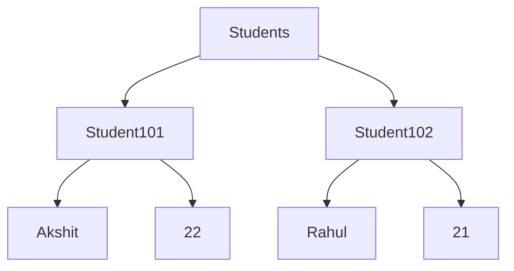
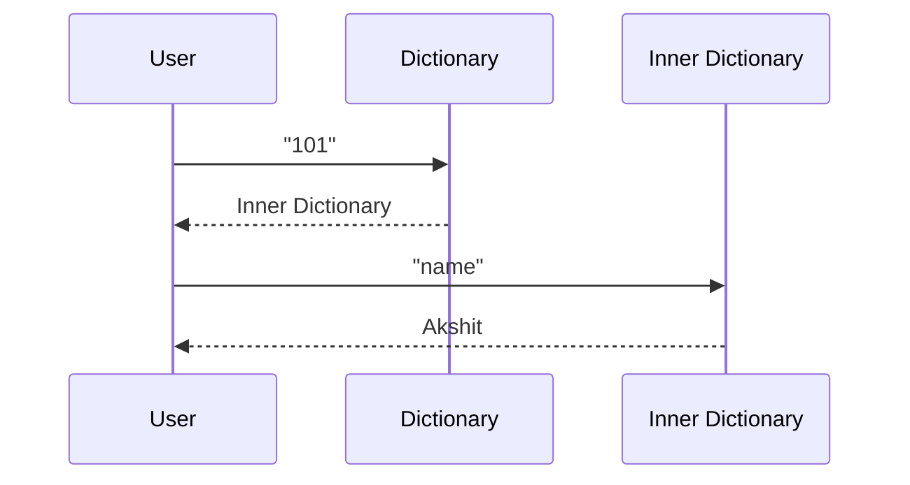
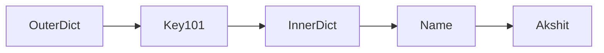

# Nested Dictionaries in Python

## 1. Intuitive Introduction

A **Nested Dictionary** is simply:

> A dictionary inside another dictionary.

Instead of storing a single value:

```python
student = {
    "name": "Akshit"
}
```

we can store an entire dictionary as a value:

```python
students = {
    "101": {
        "name": "Akshit",
        "age": 22
    }
}
```

This allows us to represent **real-world structured data**.

---

## Why Do Nested Dictionaries Exist?

Imagine a college has 10,000 students.

Using a normal dictionary:

```python
student = {
    "name": "Akshit",
    "age": 22,
    "course": "Data Science"
}
```

works for one student.

But for many students:

```python
students = {
    "101": {
        "name": "Akshit",
        "age": 22
    },
    "102": {
        "name": "Rahul",
        "age": 21
    }
}
```

Now each student has their own record.

---

# 2. Real-World Analogy

Think of a company.

```text
Company
│
├── Employee 101
│   ├── Name
│   ├── Salary
│   └── Department
│
├── Employee 102
│   ├── Name
│   ├── Salary
│   └── Department
```

Each employee is a dictionary.

The company database is a dictionary containing employee dictionaries.

---

# 3. Core Theory

Basic Structure:

```python
dictionary = {
    key1: {
        nested_key1: value,
        nested_key2: value
    },

    key2: {
        nested_key1: value,
        nested_key2: value
    }
}
```

Example:

```python
students = {
    "101": {
        "name": "Akshit",
        "age": 22
    },

    "102": {
        "name": "Rahul",
        "age": 21
    }
}
```

---

# 4. Visual Explanation



---

# 5. Syntax Breakdown

```python
students = {
    "101": {
        "name": "Akshit",
        "age": 22
    }
}
```

### Line-by-Line

```python
"101"
```

Outer key.

---

```python
{
    "name": "Akshit",
    "age": 22
}
```

Inner dictionary.

---

```python
students["101"]
```

Returns:

```python
{
    "name": "Akshit",
    "age": 22
}
```

---

# 6. Accessing Nested Values

## Example

```python
students = {
    "101": {
        "name": "Akshit",
        "age": 22
    }
}
```

Access student:

```python
print(students["101"])
```

Output:

```python
{
'name': 'Akshit',
'age': 22
}
```

---

Access specific field:

```python
print(students["101"]["name"])
```

Output:

```python
Akshit
```

---

### Internal Lookup



Two lookups occur.

---

# 7. Adding Data

## Add New Student

```python
students = {}

students["101"] = {
    "name": "Akshit",
    "age": 22
}
```

Output:

```python
{
    "101": {
        "name": "Akshit",
        "age": 22
    }
}
```

---

## Add New Field

```python
students["101"]["course"] = "Data Science"
```

Output:

```python
{
    "101": {
        "name": "Akshit",
        "age": 22,
        "course": "Data Science"
    }
}
```

---

# 8. Updating Nested Values

```python
students = {
    "101": {
        "name": "Akshit",
        "age": 22
    }
}
```

Update age:

```python
students["101"]["age"] = 23
```

Output:

```python
{
    "101": {
        "name": "Akshit",
        "age": 23
    }
}
```

---

# 9. Deleting Nested Values

Delete field:

```python
del students["101"]["age"]
```

Result:

```python
{
    "101": {
        "name": "Akshit"
    }
}
```

---

Delete entire student:

```python
del students["101"]
```

Result:

```python
{}
```

---

# 10. Iterating Through Nested Dictionaries

## Example

```python
students = {
    "101": {
        "name": "Akshit",
        "age": 22
    },

    "102": {
        "name": "Rahul",
        "age": 21
    }
}
```

---

### Outer Loop

```python
for roll, details in students.items():
    print(roll, details)
```

Output:

```python
101 {'name': 'Akshit', 'age': 22}
102 {'name': 'Rahul', 'age': 21}
```

---

### Inner Loop

```python
for roll, details in students.items():

    print("Student:", roll)

    for key, value in details.items():
        print(key, value)
```

Output:

```python
Student: 101
name Akshit
age 22

Student: 102
name Rahul
age 21
```

---

# 11. Memory & Internal Working

Nested dictionaries create multiple dictionary objects.

```python
students = {
    "101": {
        "name": "Akshit"
    }
}
```

Memory:



The outer dictionary stores a reference to the inner dictionary.

---

# 12. Practical Examples

## Employee Database

```python
employees = {
    101: {
        "name": "Akshit",
        "salary": 50000
    },

    102: {
        "name": "Rahul",
        "salary": 60000
    }
}
```

Access salary:

```python
print(employees[102]["salary"])
```

Output:

```python
60000
```

---

## Product Catalog

```python
products = {
    "P101": {
        "name": "Laptop",
        "price": 50000
    },

    "P102": {
        "name": "Phone",
        "price": 20000
    }
}
```

---

# 13. Industry Engineering Mindset

Nested dictionaries are everywhere.

### JSON Response

```python
response = {
    "user": {
        "id": 1,
        "name": "Akshit"
    }
}
```

Access:

```python
response["user"]["name"]
```

---

### API Data

Most APIs return nested JSON.

Example:

```json
{
  "user": {
      "profile": {
          "name": "Akshit"
      }
  }
}
```

Equivalent Python:

```python
response["user"]["profile"]["name"]
```

---

# 14. ML & Data Science Connection

## Model Configuration

```python
config = {
    "model": {
        "learning_rate": 0.01,
        "epochs": 100
    }
}
```

Access:

```python
config["model"]["epochs"]
```

---

## Dataset Metadata

```python
dataset = {
    "train": {
        "rows": 10000
    },

    "test": {
        "rows": 2000
    }
}
```

Used in:

* Scikit-Learn
* TensorFlow
* PyTorch
* MLflow
* Data Pipelines

---

# 15. Common Mistakes

## Mistake 1

```python
students["999"]["name"]
```

Error:

```python
KeyError
```

Use:

```python
students.get("999")
```

---

## Mistake 2

Forgetting nesting level.

Wrong:

```python
students["name"]
```

Correct:

```python
students["101"]["name"]
```

---

## Mistake 3

Deep nesting.

Bad:

```python
a["b"]["c"]["d"]["e"]
```

Hard to maintain.

---

# 16. Performance Considerations

Dictionary lookup:

```python
students["101"]
```

Average:

```text
O(1)
```

Nested lookup:

```python
students["101"]["name"]
```

Two lookups:

```text
O(1) + O(1)
```

Still extremely fast.

---

# 17. Interview Questions

## Beginner

### 1. What is a nested dictionary?

A dictionary containing another dictionary.

---

### 2. How do you access nested values?

```python
d["outer"]["inner"]
```

---

### 3. Can a dictionary contain multiple dictionaries?

Yes.

---

### 4. How do you add a nested key?

```python
d["101"]["course"] = "DS"
```

---

### 5. How do you delete a nested key?

```python
del d["101"]["course"]
```

---

## Intermediate

### 6. Difference between normal and nested dictionary?

Nested dictionary stores dictionaries as values.

---

### 7. How do you iterate through nested dictionaries?

Using nested loops.

---

### 8. What happens internally during:

```python
students["101"]["name"]
```

Answer:

Two hash lookups.

---

### 9. Time complexity?

Average:

```text
O(1)
```

per lookup.

---

### 10. Where are nested dictionaries used?

* APIs
* JSON
* Backend Systems
* ML Configurations
* Data Pipelines

---

# 18. Mini Project

## Student Management System

```python
students = {
    "101": {
        "name": "Akshit",
        "age": 22,
        "course": "Data Science"
    },

    "102": {
        "name": "Rahul",
        "age": 21,
        "course": "Python"
    }
}

for roll, details in students.items():

    print(f"\nRoll: {roll}")

    for key, value in details.items():
        print(f"{key}: {value}")
```

### Output

```text
Roll: 101
name: Akshit
age: 22
course: Data Science

Roll: 102
name: Rahul
age: 21
course: Python
```

This project combines:

* Dictionaries
* Nested Dictionaries
* Loops
* CRUD Operations
* Data Organization

---

# 19. Summary Table

| Concept           | Purpose               | Example                     |
| ----------------- | --------------------- | --------------------------- |
| Nested Dictionary | Store structured data | `{"101":{"name":"Akshit"}}` |
| Access Value      | Retrieve data         | `d["101"]["name"]`          |
| Add Field         | Insert data           | `d["101"]["course"]="DS"`   |
| Update Field      | Modify data           | `d["101"]["age"]=23`        |
| Delete Field      | Remove data           | `del d["101"]["age"]`       |
| Iteration         | Traverse records      | `for k,v in d.items()`      |
| JSON Mapping      | API handling          | `response["user"]["name"]`  |

# 20. Key Takeaways

1. A nested dictionary is a dictionary inside another dictionary.
2. It is one of the most important structures for handling real-world data.
3. Most JSON, APIs, databases, and ML configurations use nested structures.
4. Access nested values using:

```python
dict["outer"]["inner"]
```

5. Nested dictionaries are heavily used in:

   * Backend Development
   * Django
   * Flask
   * FastAPI
   * Data Engineering
   * Machine Learning
   * Cloud Applications

### Next Topic

**Dictionary Comprehension → Hash Tables (Deep Dive) → Sets → Set Operations → Advanced Dictionary Interview Questions**.
