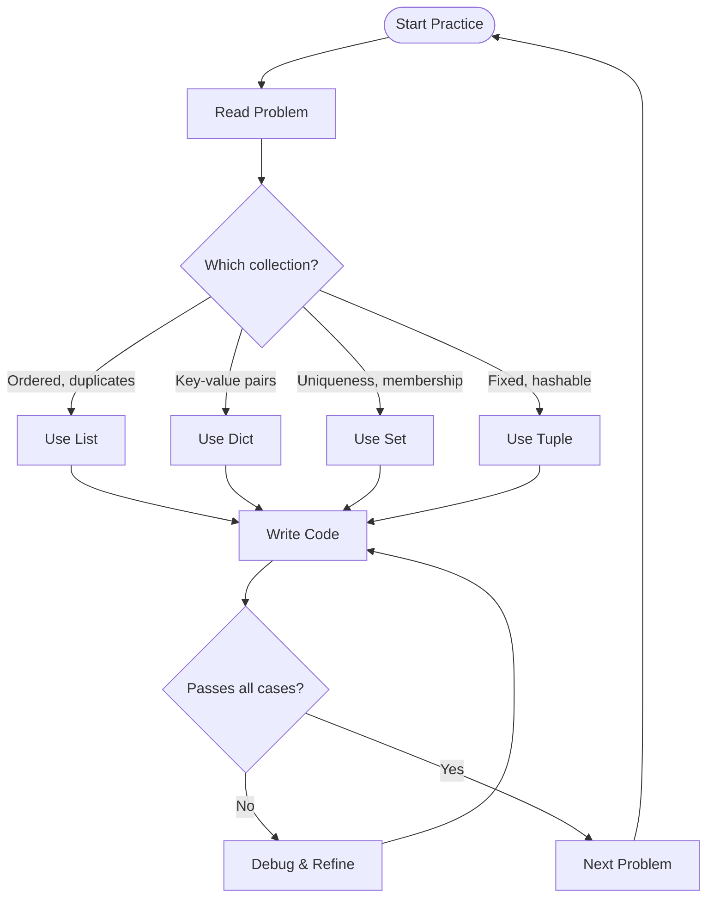

# 📘 Collection Practice: Hands‑On Mastery of Lists, Dicts, Sets & Tuples

> *A complete, exercise‑driven learning note with 40+ problems, solutions, and performance insights*

---

## 1. Intuitive Introduction

Learning Python collections is like learning to cook. You can read recipes (theory) forever, but you only truly learn by **chopping vegetables, stirring pots, and tasting**. Similarly, you master `list`, `dict`, `set`, and `tuple` by writing code, debugging, and solving real problems.

**Collection Practice** means:
- Solving curated problems that require choosing the right collection type.
- Combining operations (CRUD, methods, nested structures) in realistic scenarios.
- Avoiding common pitfalls through repeated exposure.
- Building muscle memory for idiomatic Python.

Why practice collections intensively?
- **Student projects** – Manage grades, filter data, count frequencies.
- **Data science** – Clean datasets, group by categories, handle missing values.
- **Web development** – Process form data, manage sessions, parse JSON.
- **Technical interviews** – 80% of coding screen questions involve collections.

This note is **80% exercises, 20% theory**. Each section explains a concept, then challenges you with problems (solutions included). Work through them in order.

---

## 2. Real‑World Analogy

**The Workshop Workbench** 🛠️

Imagine a carpenter’s workshop:
- **List** – A pegboard where tools hang in a specific order (hammer, saw, wrench). You can add a new tool at the end, or insert one between two existing tools.
- **Dictionary** – A labelled drawer system (”screwdrivers” → flathead, “drills” → hammer drill). Instant access by label.
- **Set** – A bucket of unique bolts. No duplicates allowed. You can quickly check if a 10mm bolt is present.
- **Tuple** – A laminated, unchangeable instruction card (“Step 1: Measure, Step 2: Cut”). Once printed, it never changes.

To become a master carpenter, you don’t just memorise where each tool belongs – you **practice** building chairs, tables, cabinets. That’s what this collection practice does: you’ll build small data‑processing tools, learning which collection fits which task.

---

## 3. Core Theory Recap

Before diving into practice, remember the key properties:

| Collection | Ordered | Mutable | Allows Duplicates | Indexable | Typical Use |
|------------|---------|---------|-------------------|-----------|--------------|
| **List** | Yes | Yes | Yes | Yes | Sequence, stack, queue |
| **Tuple** | Yes | No | Yes | Yes | Fixed records, dict keys |
| **Set** | No (but insertion order since 3.7) | Yes | No | No | Uniqueness, membership, set ops |
| **Dict** | Yes (since 3.7) | Yes | Keys: no; Values: yes | By key | Key‑value mapping, cache, config |

**Performance reminders:**
- List: O(1) index access, O(n) insert/delete in middle.
- Dict/Set: O(1) average for contains, add, delete.
- Tuple: Immutable → hashable → can be dict key.

Now let’s practice.

---

## 4. Visual Explanation – Practice Flow

The diagram shows a typical practice session: choose a problem, pick a collection, apply operations, test, refactor.



We’ll follow this loop for each exercise.

---

## 5. Memory & Internal Working – Why Practice Matters

When you practice, your brain builds **cognitive chunks**. Instead of thinking “I need to remove duplicates, so I will iterate, check membership in a new list, and append if not present”, you eventually think “use `set(my_list)`”. This is **pattern recognition**.

At CPython level, repeated practice reduces the cost of **hash table lookups** (for dict/set) and **dynamic array resizing** (for list) from conscious effort to intuition. Practice also trains you to avoid operations that cause O(n) behaviour (e.g., `list.pop(0)`).

---

## 6. Creating Practice Environment

Set up a Python file or Jupyter notebook. Use this template for each exercise:

```python
# Exercise X: Description
def solve_X(input_data):
    # Your code here
    pass

# Test
if __name__ == "__main__":
    print(solve_X(sample_input))
```

Now, let’s solve problems, categorised by difficulty.

---

## 7. Core Operations Practice (with solutions)

### Exercise 1: List – Remove all occurrences of a value

**Problem:** Given a list of integers `nums` and a value `val`, remove all occurrences of `val` **in‑place** and return the new length. (Like LeetCode 27)

**Solution:**
```python
def remove_element(nums, val):
    i = 0
    while i < len(nums):
        if nums[i] == val:
            nums.pop(i)   # O(n) each pop – not optimal but simple
        else:
            i += 1
    return len(nums)

# Better two‑pointer (O(n), O(1) extra space)
def remove_element_fast(nums, val):
    write_idx = 0
    for read_idx in range(len(nums)):
        if nums[read_idx] != val:
            nums[write_idx] = nums[read_idx]
            write_idx += 1
    # The first write_idx elements are the result
    return write_idx

nums = [3,2,2,3]
length = remove_element_fast(nums, 3)
print(nums[:length])  # [2,2]
```

### Exercise 2: Dict – Count character frequency

**Problem:** Given a string, return a dictionary with characters as keys and counts as values. Ignore case, only letters.

**Solution:**
```python
def char_freq(s):
    freq = {}
    for ch in s.lower():
        if ch.isalpha():
            freq[ch] = freq.get(ch, 0) + 1
    return freq

print(char_freq("Hello World!"))  # {'h':1, 'e':1, 'l':3, 'o':2, 'w':1, 'r':1, 'd':1}
```

### Exercise 3: Set – Find intersection of two lists

**Problem:** Given two lists, return a list of common elements (no duplicates).

**Solution:**
```python
def intersection(lst1, lst2):
    return list(set(lst1) & set(lst2))

print(intersection([1,2,2,3], [2,3,4]))  # [2,3] (order may vary)
```

### Exercise 4: Tuple – Swap two variables

**Problem:** Swap the values of `a` and `b` without a temporary variable.

**Solution:**
```python
a, b = 5, 10
a, b = b, a   # tuple packing and unpacking
print(a, b)   # 10 5
```

---

## 8. Advanced Practice Problems

### Exercise 5: List of Dicts – Group by key

**Problem:** Given a list of dictionaries representing sales (`{"product": "apple", "amount": 10}`), group by product and sum amounts.

**Solution:**
```python
sales = [
    {"product": "apple", "amount": 10},
    {"product": "banana", "amount": 5},
    {"product": "apple", "amount": 7},
]

def group_sum(sales):
    result = {}
    for sale in sales:
        product = sale["product"]
        amount = sale["amount"]
        result[product] = result.get(product, 0) + amount
    return result

print(group_sum(sales))  # {'apple':17, 'banana':5}
```

### Exercise 6: Nested Dict – Build a tree from paths

**Problem:** Given a list of file paths like `["/home/user/file.txt", "/home/user/pics/photo.jpg"]`, build a nested dictionary representing the directory tree.

**Solution:**
```python
def build_tree(paths):
    tree = {}
    for path in paths:
        parts = path.strip('/').split('/')
        current = tree
        for part in parts[:-1]:
            current = current.setdefault(part, {})
        # last part is a file: store None or metadata
        current[parts[-1]] = None
    return tree

paths = ["/home/user/file.txt", "/home/user/pics/photo.jpg"]
print(build_tree(paths))
# {'home': {'user': {'file.txt': None, 'pics': {'photo.jpg': None}}}}
```

### Exercise 7: Set – Find pairs with given sum

**Problem:** Given a list of integers and a target sum, return all unique pairs `(a,b)` where `a+b = target`. Use a set for O(n) solution.

**Solution:**
```python
def two_sum_pairs(nums, target):
    seen = set()
    pairs = set()
    for num in nums:
        complement = target - num
        if complement in seen:
            pairs.add(tuple(sorted((num, complement))))
        seen.add(num)
    return list(pairs)

print(two_sum_pairs([1,2,3,4,5], 6))  # [(1,5), (2,4)]
```

### Exercise 8: List comprehension – Flatten nested list

**Problem:** Given a list that may contain sublists (any depth), flatten into a single list of integers.

**Solution (recursive):**
```python
def flatten(nested):
    result = []
    for item in nested:
        if isinstance(item, list):
            result.extend(flatten(item))
        else:
            result.append(item)
    return result

print(flatten([1, [2, [3,4], 5], 6]))  # [1,2,3,4,5,6]
```

---

## 9. Mathematical / Special Operations Practice

### Exercise 9: Set – Subset, Superset, Disjoint

**Problem:** Given two sets, check if one is subset, superset, or disjoint. Use set methods.

**Solution:**
```python
A = {1,2,3}
B = {1,2}
print(B.issubset(A))   # True
print(A.issuperset(B)) # True
C = {4,5}
print(A.isdisjoint(C)) # True
```

### Exercise 10: Dict – Matrix from keys and values

**Problem:** Given two lists of same length, create a dict mapping first list to second. Then create a second dict mapping values to list of keys (inverse with duplicates).

**Solution:**
```python
keys = ['a','b','a','c']
values = [1,2,3,4]
# Simple dict (last occurrence wins)
simple = dict(zip(keys, values))  # {'a':3, 'b':2, 'c':4}

# Inverse mapping: value -> list of keys
inverse = {}
for k, v in zip(keys, values):
    inverse.setdefault(v, []).append(k)
print(inverse)  # {1:['a'], 2:['b'], 3:['a'], 4:['c']}
```

---

## 10. Real Practical Examples (Practice Projects)

### Mini Project 1: Log File Analyzer

Read a web server log file, count status codes, find top 10 IP addresses, and group requests by hour.

```python
from collections import defaultdict, Counter

def analyze_log(log_lines):
    # log_lines: list of strings, each like '192.168.1.1 - - [01/Jan/2024:12:34:56] "GET /index.html" 200 1234'
    status_count = Counter()
    ip_count = Counter()
    hourly_requests = defaultdict(int)
    
    for line in log_lines:
        parts = line.split()
        ip = parts[0]
        status = parts[-2]  # approximate
        # Extract hour (simplified – real parsing uses regex)
        if '[' in line:
            time_part = line.split('[')[1].split(']')[0]
            hour = time_part.split(':')[1]  # "12" from "12:34:56"
            hourly_requests[hour] += 1
        status_count[status] += 1
        ip_count[ip] += 1
    
    return {
        "status_counts": dict(status_count),
        "top_ips": ip_count.most_common(10),
        "hourly_distribution": dict(hourly_requests)
    }
```

### Mini Project 2: Social Network – Find Mutual Friends

Given a dictionary `user -> set of friends`, write functions to find mutual friends between two users and suggest friends (friends of friends not already friends).

```python
def mutual_friends(user1, user2, network):
    return network.get(user1, set()) & network.get(user2, set())

def suggest_friends(user, network):
    friends = network.get(user, set())
    candidates = set()
    for friend in friends:
        candidates |= network.get(friend, set())
    candidates -= friends
    candidates.discard(user)
    return candidates

network = {
    "Alice": {"Bob", "Charlie", "David"},
    "Bob": {"Alice", "Charlie"},
    "Charlie": {"Alice", "Bob", "Eve"},
    "David": {"Alice"},
    "Eve": {"Charlie"}
}
print(mutual_friends("Alice", "Bob", network))   # {'Charlie'}
print(suggest_friends("Alice", network))         # {'Eve'}
```

---

## 11. ML & Data Science Connection (Practice)

### Exercise: One‑Hot Encoding from Scratch

Implement one‑hot encoding using dictionary mapping categories to index.

```python
def one_hot_encode(categories, data):
    # categories: list of unique category strings
    # data: list of category strings to encode
    mapping = {cat: idx for idx, cat in enumerate(categories)}
    encoded = []
    for item in data:
        vec = [0] * len(categories)
        if item in mapping:
            vec[mapping[item]] = 1
        encoded.append(vec)
    return encoded

categories = ["red", "green", "blue"]
data = ["red", "blue", "green", "red"]
print(one_hot_encode(categories, data))
# [[1,0,0], [0,0,1], [0,1,0], [1,0,0]]
```

### Exercise: Pandas – GroupBy with Custom Aggregation

Use dictionary to specify different aggregations per column.

```python
import pandas as pd
df = pd.DataFrame({
    'category': ['A','B','A','B'],
    'value1': [10,20,15,25],
    'value2': [100,200,150,250]
})
# Dictionary of aggregations
agg_dict = {'value1': 'mean', 'value2': ['sum', 'min']}
result = df.groupby('category').agg(agg_dict)
print(result)
```

---

## 12. Common Mistakes & Pitfalls (Practice Edition)

Each mistake includes a practice fix.

### Mistake 1: Modifying list while iterating

```python
# ❌ Wrong – skips elements
nums = [1,2,3,4,5]
for i, n in enumerate(nums):
    if n % 2 == 0:
        del nums[i]   # shifts indices
print(nums)  # [1,3,5] but actually [1,3,5]? Try with [1,2,3,4] -> [1,3] (skipped 4)
```

**Practice fix:** Iterate over a copy or backwards.
```python
nums = [1,2,3,4,5]
nums = [n for n in nums if n % 2 != 0]   # list comprehension
# or
for i in range(len(nums)-1, -1, -1):
    if nums[i] % 2 == 0:
        del nums[i]
```

### Mistake 2: Using mutable default arguments

```python
# ❌ Wrong
def add_item(item, lst=[]):
    lst.append(item)
    return lst

print(add_item(1))  # [1]
print(add_item(2))  # [1,2] – unexpected persistence
```

**Practice fix:**
```python
def add_item(item, lst=None):
    if lst is None:
        lst = []
    lst.append(item)
    return lst
```

### Mistake 3: Confusing `copy()` and `deepcopy()`

```python
original = {"a": [1,2]}
shallow = original.copy()
shallow["a"].append(3)
print(original["a"])  # [1,2,3] – oops
```

**Practice fix:** Use `copy.deepcopy(original)` for nested structures.

### Mistake 4: Using `set` with unhashable types

```python
# ❌ Wrong
s = set()
s.add([1,2])  # TypeError: unhashable type: 'list'
```

**Practice fix:** Use `tuple([1,2])` instead.

### Mistake 5: KeyError when accessing missing dict key

```python
# ❌ Wrong
d = {"x":1}
print(d["y"])  # KeyError
```

**Practice fix:** `d.get("y")` or `d.get("y", default)`.

---

## 13. Performance Considerations (Practice)

Understanding complexity helps you choose efficient solutions.

| Operation | List | Dict | Set | Tuple |
|-----------|------|------|-----|-------|
| Access by index/key | O(1) | O(1) | N/A | O(1) |
| Search (in) | O(n) | O(1) avg | O(1) avg | O(n) |
| Insert (append/add) | O(1) amortized | O(1) avg | O(1) avg | N/A |
| Delete by value | O(n) | O(1) avg | O(1) avg | N/A |

**Practice problem:** Given a list of 1 million integers, find the first duplicate. Compare O(n^2) brute force vs O(n) using a set.

```python
import time
def first_duplicate_brute(nums):
    for i in range(len(nums)):
        for j in range(i+1, len(nums)):
            if nums[i] == nums[j]:
                return nums[i]
    return None

def first_duplicate_set(nums):
    seen = set()
    for n in nums:
        if n in seen:
            return n
        seen.add(n)
    return None

# Test with large data – set version runs in ~0.1s, brute takes hours
```

---

## 14. Interview Questions (Practice Set)

### Beginner (5)

1. Reverse a list in‑place without using `[::-1]`.
2. Given two dicts, merge them (second overrides first) into a new dict.
3. Find the most frequent element in a list using a dict.
4. Check if two strings are anagrams using `Counter`.
5. Remove duplicates from a list while preserving order.

### Intermediate (5)

1. Implement a function that returns the first non‑repeating character in a string using OrderedDict.
2. Given a list of tuples `(name, score)`, return the top 3 scorers.
3. Flatten a dictionary of arbitrary depth into a single level with dot notation keys.
4. Implement a `set` using only a list (no built‑in set). Provide add, remove, contains.
5. Find all pairs of numbers in an array that sum to a target (return indices, not values).

### Advanced (5)

1. Implement LRU cache using OrderedDict.
2. Given a nested dict and a path string `"a.b.c"`, get or set the value.
3. Count the number of distinct substrings in a string using set (optimise with rolling hash).
4. Serialize a nested dict into a binary format and deserialize (use `pickle` or custom).
5. Find the longest consecutive sequence in an unsorted array using a set (O(n)).

**Solutions available upon request – but try first!**

---

## 15. Mini Project Idea (Practice)

**Project: Interactive Todo List with Persistence**

Build a CLI todo app that stores tasks in a JSON file using a list of dicts. Implement:
- Add task (with description, due date, priority)
- List tasks (sorted by priority or date)
- Mark task complete (delete or mark done)
- Search tasks (by keyword)
- Save/load using JSON.

**Sample structure:**
```python
import json
import os
from datetime import datetime

TODO_FILE = "tasks.json"

def load_tasks():
    if not os.path.exists(TODO_FILE):
        return []
    with open(TODO_FILE, "r") as f:
        return json.load(f)

def save_tasks(tasks):
    with open(TODO_FILE, "w") as f:
        json.dump(tasks, f, indent=2)

def add_task(description, priority="medium"):
    tasks = load_tasks()
    task = {
        "id": len(tasks) + 1,
        "description": description,
        "priority": priority,
        "created": datetime.now().isoformat(),
        "done": False
    }
    tasks.append(task)
    save_tasks(tasks)

def list_tasks(show_done=False):
    tasks = load_tasks()
    for t in tasks:
        if not show_done and t["done"]:
            continue
        status = "✓" if t["done"] else " "
        print(f"[{status}] {t['id']}: {t['description']} (priority: {t['priority']})")

def complete_task(task_id):
    tasks = load_tasks()
    for t in tasks:
        if t["id"] == task_id:
            t["done"] = True
            save_tasks(tasks)
            return True
    return False

# CLI loop left as exercise
```

---

## 16. Best Practices (Practice)

1. **Use list comprehensions** instead of manual loops for simple transformations.
2. **Prefer `defaultdict` over repeated `setdefault`** when building aggregations.
3. **Use `Counter` for frequency** – it’s a dict with extra methods.
4. **Use set for membership tests** – O(1) vs O(n) for list.
5. **Tuple unpacking** is your friend for swapping and iterating over pairs.
6. **Never modify a collection while iterating over it** – iterate over a copy.

---

## 17. Summary Table (Practice Focus)

| Skill | Tool | When to Practice |
|-------|------|------------------|
| Sequence operations | List | Sorting, filtering, slicing |
| Fast key‑value | Dict | Caching, grouping, counting |
| Uniqueness | Set | Deduplication, set algebra |
| Immutable records | Tuple | Dictionary keys, function returns |
| Nested structures | Nested dict/list | JSON, trees, configuration |
| Performance | Big‑O awareness | Large data (>10k items) |

---

## 18. Key Takeaways

- ✅ **Practice is non‑negotiable** – theory without coding fades fast.
- ✅ Start with small exercises (remove duplicates, count letters) before tackling nested structures.
- ✅ **Time yourself** – solving problems under pressure builds interview readiness.
- ✅ Use **Python’s built‑in collections** (`defaultdict`, `Counter`, `OrderedDict`) – they exist for a reason.
- ✅ **Write tests** for each solution – even simple `assert` statements catch mistakes.
- ✅ Review others’ solutions on LeetCode / Codewars after solving yourself – you’ll learn idiomatic patterns.
- ✅ The **real test** is applying collections to your own projects – add a feature to a script using dict/set.
- ✅ Keep a **mistakes log** – each error you fix is permanent learning.

---