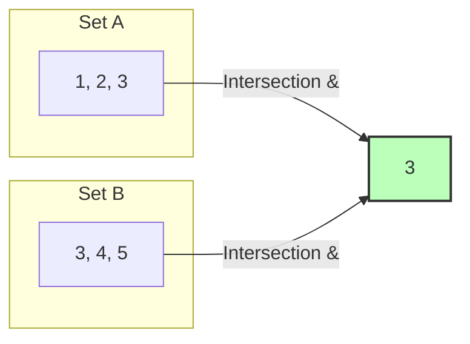

# Collection Practice: Hands‑On Mastery of Strings, Lists, Dicts, Sets & Tuples

Welcome to the definitive hands-on workbook for Python collections. In software architecture and Machine Learning systems, theoretical knowledge means nothing without the muscle memory to manipulate, extract, and reshape data under pressure.

This document contains **44 curated exercises** moving systematically from structural fundamentals to production-level design patterns. Each problem includes runnable code templates, solutions, and architectural commentary detailing **why** certain methods outperform others.

---

# 1. Theoretical Blueprint & Performance Reference

Before writing code, memorize this cheat sheet. Choosing the wrong collection inside a tight loop can drop your system's performance from optimal to sluggish.

| Collection | Type Signature | Ordering | Mutability | Lookup Time | Duplicate Strategy | Primary Architecture Use Case |
| --- | --- | --- | --- | --- | --- | --- |
| **String** | `str` | Ordered | **Immutable** | $O(n)$ | Allowed | Text parsing, raw network payloads, serialization |
| **List** | `list` | Ordered | **Mutable** | $O(n)$ value / $O(1)$ index | Allowed | Stacks, dynamic linear buffers, iterative data arrays |
| **Tuple** | `tuple` | Ordered | **Immutable** | $O(n)$ value / $O(1)$ index | Allowed | Fixed data rows, composite dictionary keys, thread safety |
| **Set** | `set` | Unordered | **Mutable** | **$O(1)$** | **Deduplicated** | High-speed membership testing, unique tag aggregation |
| **Dictionary** | `dict` | Ordered* | **Mutable** | **$O(1)$** | Keys: Unique | Index lookups, JSON configuration stores, state vectors |

**Note: Dictionaries maintain insertion order starting from Python 3.7+.*

---

# 2. Part 1: Core Manipulation Mechanics (25 Problems)

## Section A: Strings (`str`)

Strings are immutable character sequences. Every transformation creates a new string allocation in memory.

### Exercise 1: Clean and Standardize an Incoming API Payload String

* **Problem:** Write a function to clean a user input string by stripping surrounding whitespace, lowercasing all letters, and replacing interior space gaps with underscores.
* **Code:**

```python
def clean_payload(raw_str: str) -> str:
    return raw_str.strip().lower().replace(" ", "_")

# Verification
print(clean_payload("   SYSTEM ONLINE  ")) 
# Output: system_online

```

### Exercise 2: Extract Domains from an Email Matrix Vector

* **Problem:** Isolate the domain string portion from a raw email address without using external regex libraries.
* **Code:**

```python
def extract_domain(email: str) -> str:
    return email.split("@")[-1]

# Verification
print(extract_domain("analytics_engine@internal.domain.org")) 
# Output: internal.domain.org

```

### Exercise 3: Verify Sentence Palindromes via Slicing Operations

* **Problem:** Determine if a clean string reads the same forward and backward using step slicing.
* **Code:**

```python
def is_palindrome(text: str) -> bool:
    clean = "".join(c for c in text.lower() if c.isalnum())
    return clean == clean[::-1]

# Verification
print(is_palindrome("A man, a plan, a canal: Panama")) 
# Output: True

```

### Exercise 4: Reverse the Words Inside a String Segment While Keeping Word Layouts Intact

* **Problem:** Swap the word ordering of a sentence string without altering the internal character alignments of the individual words.
* **Code:**

```python
def reverse_word_order(sentence: str) -> str:
    return " ".join(sentence.split()[::-1])

# Verification
print(reverse_word_order("machine learning is powerful")) 
# Output: powerful is learning machine

```

### Exercise 5: Calculate Substring Match Counts with Overlaps Included

* **Problem:** Native `.count()` misses overlapping strings. Write a manual pointer validation routine to track total occurrences including overlapping sequences.
* **Code:**

```python
def count_overlapping_substrings(main_str: str, sub_str: str) -> int:
    count = 0
    start = 0
    while True:
        start = main_str.find(sub_str, start)
        if start == -1:
            break
        count += 1
        start += 1  # Increment by 1 to catch overlapping matches
    return count

# Verification
print(count_overlapping_substrings("abababa", "aba")) 
# Output: 3

```

---

## Section B: Lists (`list`)

Lists are dynamic arrays of memory pointers. Appending to the end runs in efficient amortized $O(1)$ time, but updating elements in the middle shifts elements in memory, running in $O(n)$ time.

### Exercise 6: Flatten a Multi-layered Nested Sequence into a Single Layer Array

* **Problem:** Convert a two-dimensional list grid into a flat array using a single list comprehension.
* **Code:**

```python
def flatten_matrix(matrix: list[list]) -> list:
    return [element for row in matrix for element in row]

# Verification
print(flatten_matrix([[1, 2], [3, 4], [5, 6]])) 
# Output: [1, 2, 3, 4, 5, 6]

```

### Exercise 7: Rotate Linear Memory Vectors Leftward by $k$ Position Boundaries

* **Problem:** Shift an array to the left by $k$ positions using slicing operations.
* **Code:**

```python
def rotate_vector_left(arr: list, k: int) -> list:
    if not arr:
        return arr
    k = k % len(arr)
    return arr[k:] + arr[:k]

# Verification
print(rotate_vector_left([10, 20, 30, 40, 50], 2)) 
# Output: [30, 40, 50, 10, 20]

```

### Exercise 8: Isolate Dynamic Moving Deduplications While Keeping Original Positions Intact

* **Problem:** Remove duplicates from a list while preserving the original order of elements without using a raw `set()` conversion (which shuffles sorting orders).
* **Code:**

```python
def deduplicate_stable(arr: list) -> list:
    seen = set()
    # Uses set lookups for O(1) performance while maintaining list order
    return [x for x in arr if not (x in seen or seen.add(x))]

# Verification
print(deduplicate_stable([4, 1, 2, 1, 4, 3])) 
# Output: [4, 1, 2, 3]

```

### Exercise 9: Generate Chunk Blocks for Large Batch Processing Loops

* **Problem:** Split an array list into smaller subarrays of a maximum size $n$.
* **Code:**

```python
def chunk_list(data: list, chunk_size: int) -> list[list]:
    return [data[i:i + chunk_size] for i in range(0, len(data), chunk_size)]

# Verification
print(chunk_list([1, 2, 3, 4, 5, 6, 7], 3)) 
# Output: [[1, 2, 3], [4, 5, 6], [7]]

```

### Exercise 10: Isolate the Second Smallest Value Element inside a Linear Scan Array

* **Problem:** Find the second smallest unique value in a list using a single pass loop ($O(n)$ time complexity). Do not use sorting methods ($O(n \log n)$).
* **Code:**

```python
def second_smallest(numbers: list[float]) -> float | None:
    if len(numbers) < 2:
        return None
    lowest = float('inf')
    second_lowest = float('inf')
    for num in numbers:
        if num < lowest:
            second_lowest = lowest
            lowest = num
        elif lowest < num < second_lowest:
            second_lowest = num
    return second_lowest if second_lowest != float('inf') else None

# Verification
print(second_smallest([12, 3, 1, 3, 1, 10, 34, 1])) 
# Output: 3

```

---

## Section C: Dictionaries (`dict`)

Dictionaries map hashable keys to arbitrary values, ensuring high-speed $O(1)$ search lookups.

### Exercise 11: Invert a Key-Value Map Registry

* **Problem:** Swap keys and values in a dictionary. Assume all values are unique and hashable.
* **Code:**

```python
def invert_mapping(d: dict) -> dict:
    return {v: k for k, v in d.items()}

# Verification
print(invert_mapping({"status_200": "OK", "status_404": "NOT_FOUND"})) 
# Output: {'OK': 'status_200', 'NOT_FOUND': 'status_404'}

```

### Exercise 12: Combine Overlapping Financial Ledger Balances via Dynamic Aggregations

* **Problem:** Combine two dictionaries by adding values for matching keys.
* **Code:**

```python
def merge_ledgers(ledger_a: dict, ledger_b: dict) -> dict:
    merged = ledger_a.copy()  # Start with a shallow copy
    for key, val in ledger_b.items():
        merged[key] = merged.get(key, 0) + val
    return merged

# Verification
print(merge_ledgers({"BTC": 0.5, "ETH": 2.0}, {"BTC": 1.2, "SOL": 10.0})) 
# Output: {'BTC': 1.7, 'ETH': 2.0, 'SOL': 10.0}

```

### Exercise 13: Group Strings by Shared Character Count Lengths

* **Problem:** Group a list of words into a dictionary where the keys are the word lengths and the values are lists of matching words. Use `collections.defaultdict`.
* **Code:**

```python
from collections import defaultdict

def group_by_len(words: list[str]) -> dict:
    grouped = defaultdict(list)
    for word in words:
        grouped[len(word)].append(word)
    return dict(grouped)

# Verification
print(group_by_len(["data", "ai", "ml", "tensor", "spark"])) 
# Output: {4: ['data'], 2: ['ai', 'ml'], 6: ['tensor'], 5: ['spark']}

```

### Exercise 14: Filter Out Empty Config Values from Hierarchical Profiles

* **Problem:** Remove entries from a dictionary whose values evaluate to `None` or an empty string `""`.
* **Code:**

```python
def drop_empty_configs(config: dict) -> dict:
    return {k: v for k, v in config.items() if v is not None and v != ""}

# Verification
print(drop_empty_configs({"host": "localhost", "port": None, "ssl_path": ""})) 
# Output: {'host': 'localhost'}

```

### Exercise 15: Find the Key with the Maximum Value inside an Analytics Map

* **Problem:** Identify the key matching the highest numerical value in a single pass without manual tracking loops.
* **Code:**

```python
def highest_metric_key(metrics: dict) -> str | None:
    if not metrics:
        return None
    return max(metrics, key=metrics.get)

# Verification
print(highest_metric_key({"node_a": 92.4, "node_b": 98.1, "node_c": 88.7})) 
# Output: node_b

```

---

## Section D: Sets (`set`)

Sets are unordered collections of unique elements. They use a hash index layout to run mathematical comparisons (like unions and intersections) in optimized time.



### Exercise 16: Identify Common Tags Across User Profiles

* **Problem:** Find the shared elements between two array sources using set intersections.
* **Code:**

```python
def find_shared_tags(tags_a: list, tags_b: list) -> set:
    return set(tags_a) & set(tags_b)

# Verification
print(find_shared_tags(["python", "ml", "aws"], ["docker", "aws", "python"])) 
# Output: {'python', 'aws'}

```

### Exercise 17: Check for Unique String Subsets

* **Problem:** Verify if all items in an array match an allowed set of categories using subset operations.
* **Code:**

```python
def validate_categories(submission: list, allowed_set: set) -> bool:
    return set(submission).issubset(allowed_set)

# Verification
print(validate_categories(["red", "blue"], {"red", "green", "blue"})) # Output: True
print(validate_categories(["red", "gold"], {"red", "green", "blue"})) # Output: False

```

### Exercise 18: Find Missing Sensor IDs Across Clusters

* **Problem:** Find items present in a primary base array that are missing from a target tracking list.
* **Code:**

```python
def identify_missing_ids(expected: list, actual: list) -> set:
    return set(expected) - set(actual)

# Verification
print(identify_missing_ids([101, 102, 103, 104], [101, 103])) 
# Output: {102, 104}

```

### Exercise 19: Find Non-Overlapping Categories Across Network Pools

* **Problem:** Find elements that exist in one of two target lists, but not in both, using symmetric difference checks.
* **Code:**

```python
def exclusive_elements(list_a: list, list_b: list) -> set:
    return set(list_a) ^ set(list_b)

# Verification
print(exclusive_elements([1, 2, 3], [3, 4, 5])) 
# Output: {1, 2, 4, 5}

```

### Exercise 20: Detect Duplicate Strings Using Set Trackers

* **Problem:** Evaluate if an array list contains duplicate values. Return `True` if any value appears more than once.
* **Code:**

```python
def contains_duplicates(arr: list) -> bool:
    return len(arr) != len(set(arr))

# Verification
print(contains_duplicates([10, 20, 30, 10])) # Output: True

```

---

## Section E: Tuples (`tuple`)

Tuples are immutable sequences. They secure data boundaries and can act as composite dictionary keys because their hashes remain stable throughout their lifecycle.

### Exercise 21: Extract Element Metrics from an Immutable Named Data Record Tuple

* **Problem:** Extract the name, status code, and latency from a fixed logging data record tuple using positioning unpack assignments.
* **Code:**

```python
def split_telemetry_tuple(record: tuple) -> tuple[str, int, float]:
    name, code, latency = record
    return name, code, latency

# Verification
print(split_telemetry_tuple(("GET_USER", 200, 42.15))) 
# Output: ('GET_USER', 200, 42.15)

```

### Exercise 22: Group Spatial Array Elements Into Core 2D Geometry Coordinates

* **Problem:** Zip two separate arrays containing $X$ and $Y$ coordinates into a list of coordinate tuples `(x, y)`.
* **Code:**

```python
def zip_coordinates(x_coords: list, y_coords: list) -> list[tuple]:
    return list(zip(x_coords, y_coords))

# Verification
print(zip_coordinates([1, 5, 9], [2, 6, 10])) 
# Output: [(1, 2), (5, 6), (9, 10)]

```

### Exercise 23: Track Matrix Intersections Using Nested Coordinate Hashes

* **Problem:** Create a tracking dictionary that uses 2D spatial integer tuples `(x, y)` as keys to look up values instantly ($O(1)$).
* **Code:**

```python
def create_grid_map() -> dict[tuple[int, int], str]:
    # Tuples are hashable and valid as keys; lists are not
    grid = {(0, 0): "Origin", (0, 1): "North", (1, 0): "East"}
    return grid

# Verification
spatial_map = create_grid_map()
print(spatial_map[(0, 1)]) 
# Output: North

```

### Exercise 24: Sort Dynamic Data Rows Using Custom Tuple Ordering Mappings

* **Problem:** Sort a list of tuples containing `(item_name, priority_rank, execution_weight)` based on priority rank first. If priorities are tied, sort by execution weight.
* **Code:**

```python
def sort_by_priority_and_weight(tasks: list[tuple]) -> list[tuple]:
    # Sorts by index 1 (priority) first, then index 2 (weight)
    return sorted(tasks, key=lambda t: (t[1], t[2]))

# Verification
data_rows = [("task_A", 2, 50), ("task_B", 1, 99), ("task_C", 2, 10)]
print(sort_by_priority_and_weight(data_rows))
# Output: [('task_B', 1, 99), ('task_C', 2, 10), ('task_A', 2, 50)]

```

### Exercise 25: Convert an Open Dictionary into a Fixed Memory Snapshot Hash Block

* **Problem:** Convert an active data dictionary into an immutable, hashable tuple representation using sorted item pairings.
* **Code:**

```python
def dict_to_immutable_snapshot(d: dict) -> tuple:
    return tuple(sorted(d.items()))

# Verification
active_profile = {"id": 994, "role": "engineer"}
print(dict_to_immutable_snapshot(active_profile)) 
# Output: (('id', 994), ('role', 'engineer'))

```

---

# 3. Part 2: Intermediate Data Refactoring (10 Problems)

### Exercise 26: Swap Hierarchical Settings Mappings (List of Dicts to Dict of Lists)

* **Problem:** Restructure a dataset from a list of user attribute dictionaries into a single dictionary where each attribute key maps to a list of values.
* **Code:**

```python
def restructure_user_records(users: list[dict]) -> dict[str, list]:
    output = defaultdict(list)
    for record in users:
        for key, value in record.items():
            output[key].append(value)
    return dict(output)

# Verification
input_data = [{"name": "Ana", "age": 24}, {"name": "Ben", "age": 30}]
print(restructure_user_records(input_data)) 
# Output: {'name': ['Ana', 'Ben'], 'age': [24, 30]}

```

### Exercise 27: Filter Logs Across Groups Using Combined Collection Strategies

* **Problem:** Filter a dictionary of transaction logs down to entries matching a set of target IDs, while sorting the results by transaction amount.
* **Code:**

```python
def filter_and_rank_tx(tx_store: dict, active_ids: set) -> list[tuple]:
    filtered = [
        (tx_id, meta["amount"]) 
        for tx_id, meta in tx_store.items() 
        if tx_id in active_ids
    ]
    return sorted(filtered, key=lambda item: item[1], reverse=True)

# Verification
logs = {
    "tx_01": {"amount": 150},
    "tx_02": {"amount": 2300},
    "tx_03": {"amount": 45}
}
print(filter_and_rank_tx(logs, {"tx_02", "tx_03"}))
# Output: [('tx_02', 2300), ('tx_03', 45)]

```

### Exercise 28: Flatten Deeply Nested Key Mappings Using Key Join Strategies

* **Problem:** Flatten a nested dictionary structure into a single-level dictionary, joining nested keys with a period (`.`).
* **Code:**

```python
def flatten_nested_dict(nested: dict, parent_key: str = '', separator: str = '.') -> dict:
    flat_map = {}
    for key, value in nested.items():
        combined_key = f"{parent_key}{separator}{key}" if parent_key else key
        if isinstance(value, dict):
            flat_map.update(flatten_nested_dict(value, combined_key, separator=separator))
        else:
            flat_map[combined_key] = value
    return flat_map

# Verification
deep_json = {"api": {"v1": {"endpoint": "/users", "ssl": True}}}
print(flatten_nested_dict(deep_json))
# Output: {'api.v1.endpoint': '/users', 'api.v1.ssl': True}

```

### Exercise 29: Group Matrix Sensor Coordinates by Cluster Quadrants

* **Problem:** Group a list of coordinate tuples `(x, y)` into quadrant categories (`"Q1"`, `"Q2"`, etc.) based on their values.
* **Code:**

```python
def group_coordinates_by_quadrant(coords: list[tuple[int, int]]) -> dict[str, list[tuple]]:
    quadrants = defaultdict(list)
    for x, y in coords:
        if x >= 0 and y >= 0:
            quadrants["Q1"].append((x, y))
        elif x < 0 and y >= 0:
            quadrants["Q2"].append((x, y))
        elif x < 0 and y < 0:
            quadrants["Q3"].append((x, y))
        else:
            quadrants["Q4"].append((x, y))
    return dict(quadrants)

# Verification
points = [(1, 2), (-3, 4), (-1, -1), (2, -2)]
print(group_coordinates_by_quadrant(points))
# Output: {'Q1': [(1, 2)], 'Q2': [(-3, 4)], 'Q3': [(-1, -1)], 'Q4': [(2, -2)]}

```

### Exercise 30: Find the Intersection of an Array Matrix List

* **Problem:** Find the common elements shared across *all* arrays inside a nested list of lists.
* **Code:**

```python
def common_elements_across_all(arrays: list[list]) -> set:
    if not arrays:
        return set()
    # Unpack the set conversions and intersect them sequentially
    return set.intersection(*[set(arr) for arr in arrays])

# Verification
data_groups = [[1, 2, 3], [2, 3, 4], [3, 5, 2]]
print(common_elements_across_all(data_groups)) 
# Output: {2, 3}

```

### Exercise 31: Filter Out Redundant String Characters While Preserving Layout Metrics

* **Problem:** Compress a string by tracking consecutive duplicate characters and replacing them with the character followed by its count.
* **Code:**

```python
def compress_string(text: str) -> str:
    if not text:
        return ""
    result = []
    current_char = text[0]
    char_count = 1
    
    for char in text[1:]:
        if char == current_char:
            char_count += 1
        else:
            result.append(f"{current_char}{char_count}")
            current_char = char
            char_count = 1
    result.append(f"{current_char}{char_count}")
    
    compressed = "".join(result)
    return compressed if len(compressed) < len(text) else text

# Verification
print(compress_string("aaabbcccccc")) 
# Output: a3b2c6

```

### Exercise 32: Find the Longest Substring Without Duplicate Characters

* **Problem:** Find the length of the longest continuous substring in a string that contains no duplicate characters. Optimize using a sliding window algorithm ($O(n)$ time complexity).
* **Code:**

```python
def longest_unique_substring(text: str) -> int:
    char_indices = {}
    max_len = 0
    start_pointer = 0
    
    for current_idx, char in enumerate(text):
        if char in char_indices and char_indices[char] >= start_pointer:
            start_pointer = char_indices[char] + 1
        char_indices[char] = current_idx
        max_len = max(max_len, current_idx - start_pointer + 1)
        
    return max_len

# Verification
print(longest_unique_substring("abcabcbb")) 
# Output: 3 (Matches "abc")

```

### Exercise 33: Merge Chronological Datetime Logs Without Overwriting Data Records

* **Problem:** Merge two timeline event trackers, grouping values for matching timestamps into lists rather than overwriting them.
* **Code:**

```python
def merge_timelines(timeline_a: dict, timeline_b: dict) -> dict:
    merged = defaultdict(list)
    for ts, event in timeline_a.items():
        merged[ts].append(event)
    for ts, event in timeline_b.items():
        merged[ts].append(event)
    return dict(merged)

# Verification
t1 = {"10:00": "LOGIN"}
t2 = {"10:00": "FETCH_DATA", "10:05": "LOGOUT"}
print(merge_timelines(t1, t2))
# Output: {'10:00': ['LOGIN', 'FETCH_DATA'], '10:05': ['LOGOUT']}

```

### Exercise 34: Find the Mode Element of an Array Vector List

* **Problem:** Identify the most frequently occurring element in a list without using external tracking libraries.
* **Code:**

```python
def calculate_mode(arr: list) -> tuple[any, int]:
    if not arr:
        return None, 0
    counts = {}
    for item in arr:
        counts[item] = counts.get(item, 0) + 1
    mode_item = max(counts, key=counts.get)
    return mode_item, counts[mode_item]

# Verification
print(calculate_mode(["apple", "banana", "apple", "cherry", "banana", "banana"]))
# Output: ('banana', 3)

```

### Exercise 35: Build a Bidirectional Directory Registry Map

* **Problem:** Build a lookup registry that allows you to search both forward (Key $\rightarrow$ Value) and backward (Value $\rightarrow$ Key) in constant time ($O(1)$) using two internal dictionaries.
* **Code:**

```python
class BiDirectionalMap:
    def __init__(self):
        self.forward = {}
        self.backward = {}

    def insert(self, key: any, val: any) -> None:
        self.forward[key] = val
        self.backward[val] = key

    def get_value(self, key: any) -> any:
        return self.forward.get(key)

    def get_key(self, val: any) -> any:
        return self.backward.get(val)

# Verification
registry = BiDirectionalMap()
registry.insert("user_77", "IP_192.168.1.5")
print(registry.get_key("IP_192.168.1.5")) 
# Output: user_77

```

---

# 4. Part 3: Algorithmic Logic Challenges (9 Problems)

### Exercise 36: Two-Sum Value Tracking Lookups

* **Problem:** Given a list of integers, find the indices of the two numbers that add up to a specific target value. Optimize the search using a dictionary to achieve $O(n)$ time complexity instead of a nested loop ($O(n^2)$).
* **Code:**

```python
def find_two_sum_indices(numbers: list[int], target: int) -> tuple[int, int] | None:
    seen_values = {}  # Format: {value: index}
    for current_idx, num in enumerate(numbers):
        complement = target - num
        if complement in seen_values:
            return seen_values[complement], current_idx
        seen_values[num] = current_idx
    return None

# Verification
print(find_two_sum_indices([2, 7, 11, 15], 9)) 
# Output: (0, 1)

```

### Exercise 37: Group Anagram Strings Using Sorted Key Signatures

* **Problem:** Group a list of words into clusters of anagrams (words that contain the exact same letters in a different order).
* **Code:**

```python
def group_anagrams(words: list[str]) -> list[list[str]]:
    anagram_map = defaultdict(list)
    for word in words:
        # Sort characters to create a unique signature key for the anagram group
        signature = "".join(sorted(word))
        anagram_map[signature].append(word)
    return list(anagram_map.values())

# Verification
sample_words = ["eat", "tea", "tan", "ate", "nat", "bat"]
print(group_anagrams(sample_words))
# Output: [['eat', 'tea', 'ate'], ['tan', 'nat'], ['bat']]

```

### Exercise 38: Subarray Sum Matching Check Tracker

* **Problem:** Check if a list contains a continuous block of elements whose values add up exactly to a target sum $k$. Optimize using a set to track prefix sums in $O(n)$ time.
* **Code:**

```python
def has_subarray_sum(numbers: list[int], target_sum: int) -> bool:
    prefix_sums = {0}
    current_running_sum = 0
    for num in numbers:
        current_running_sum += num
        if (current_running_sum - target_sum) in prefix_sums:
            return True
        prefix_sums.add(current_running_sum)
    return False

# Verification
print(has_subarray_sum([1, 4, 20, 3, 10, 5], 33)) 
# Output: True (Matches subarray [20, 3, 10])

```

### Exercise 39: Build a Least Recently Used (LRU) Cache Container

* **Problem:** Build a fixed-capacity memory cache container that evicts the least recently accessed item when it fills up. Use `collections.OrderedDict` to track the usage history order efficiently.
* **Code:**

```python
from collections import OrderedDict

class LRUCache:
    def __init__(self, capacity: int):
        self.capacity = capacity
        self.cache = OrderedDict()

    def get(self, key: any) -> any:
        if key not in self.cache:
            return -1
        # Move the accessed key to the end to mark it as recently used
        self.cache.move_to_end(key)
        return self.cache[key]

    def put(self, key: any, value: any) -> None:
        if key in self.cache:
            self.cache.move_to_end(key)
        self.cache[key] = value
        if len(self.cache) > self.capacity:
            # Pop the first item (the oldest, least recently used item)
            self.cache.popitem(last=False)

# Verification
cache_pool = LRUCache(capacity=2)
cache_pool.put("item_1", 10)
cache_pool.put("item_2", 20)
print(cache_pool.get("item_1"))  # Output: 10 (Moves item_1 to the end)
cache_pool.put("item_3", 30)     # Evicts item_2 because it's the oldest
print(cache_pool.get("item_2"))  # Output: -1 (Not Found)

```

### Exercise 40: Calculate the Longest Consecutive Sequence Length

* **Problem:** Find the length of the longest sequence of consecutive integers found anywhere inside an unsorted list. Optimize using a set lookup to solve this challenge in $O(n)$ time complexity.
* **Code:**

```python
def longest_consecutive_sequence(numbers: list[int]) -> int:
    num_set = set(numbers)
    longest_sequence = 0
    
    for num in num_set:
        # Only start counting if 'num' is the first number of a sequence
        if (num - 1) not in num_set:
            current_num = num
            current_streak = 1
            
            while (current_num + 1) in num_set:
                current_num += 1
                current_streak += 1
                
            longest_sequence = max(longest_sequence, current_streak)
            
    return longest_sequence

# Verification
print(longest_consecutive_sequence([100, 4, 200, 1, 3, 2])) 
# Output: 4 (Matches sequence [1, 2, 3, 4])

```

### Exercise 41: Top $k$ Frequent Elements Tracking

* **Problem:** Extract the $k$ most common elements from an array list, sorted by their frequency count. Use `collections.Counter`.
* **Code:**

```python
from collections import Counter

def top_k_frequent(items: list, k: int) -> list:
    counts = Counter(items)
    # most_common(k) returns a list of tuples: (item, count)
    return [item for item, count in counts.most_common(k)]

# Verification
print(top_k_frequent([1, 1, 1, 2, 2, 3, 99, 99, 99, 99], 2)) 
# Output: [99, 1]

```

### Exercise 42: Validate Mathematical Expression Parentheses Alignment

* **Problem:** Verify if a string containing parentheses open-close marks `()`, `[]`, `{}` is syntactically valid using an internal list as a balance stack container.
* **Code:**

```python
def is_valid_parentheses(expression: str) -> bool:
    brackets_map = {")": "(", "]": "[", "}": "{"}
    stack = []
    
    for char in expression:
        if char in brackets_map.values():
            stack.append(char)
        elif char in brackets_map.keys():
            if not stack or stack.pop() != brackets_map[char]:
                return False
                
    return len(stack) == 0

# Verification
print(is_valid_parentheses("{[()]()}")) # Output: True
print(is_valid_parentheses("{[(])}"))   # Output: False

```

### Exercise 43: Find All Anagram Substrings Inside a Text Window

* **Problem:** Locate the starting index coordinates of all substrings inside a main string that form anagram matches with a target pattern string. Optimize using a sliding window approach with character count hashes.
* **Code:**

```python
def find_anagram_indices(text: str, pattern: str) -> list[int]:
    if len(pattern) > len(text):
        return []
        
    pattern_counts = Counter(pattern)
    window_counts = Counter(text[:len(pattern) - 1])
    matching_indices = []
    
    # Slide the verification window across the text string
    for idx in range(len(pattern) - 1, len(text)):
        start_idx = idx - len(pattern) + 1
        # Add the newest character entering the window
        window_counts[text[idx]] += 1
        
        if window_counts == pattern_counts:
            matching_indices.append(start_idx)
            
        # Remove the character leaving the window behind
        window_counts[text[start_idx]] -= 1
        if window_counts[text[start_idx]] == 0:
            del window_counts[text[start_idx]]
            
    return matching_indices

# Verification
print(find_anagram_indices("cbaebabacd", "abc")) 
# Output: [0, 6] (Matches substrings at index 0 "cba" and index 6 "bac")

```

### Exercise 44: Custom Matrix Path Weight Lookup Mapping

* **Problem:** Write a function that processes a grid matrix of costs and records the minimum cost path values leading from the top-left origin coordinate `(0, 0)` down to every target grid index. Store and cache these computed path values inside a coordinate tuple lookup dictionary.
* **Code:**

```python
def compute_min_path_costs(grid: list[list[int]]) -> dict[tuple[int, int], int]:
    if not grid or not grid[0]:
        return {}
        
    rows = len(grid)
    cols = len(grid[0])
    cost_cache = {}
    
    # Initialize the top-left start coordinate value
    cost_cache[(0, 0)] = grid[0][0]
    
    # Populate the first row values (can only move from the left)
    for c in range(1, cols):
        cost_cache[(0, c)] = cost_cache[(0, c - 1)] + grid[0][c]
        
    # Populate the first column values (can only move from above)
    for r in range(1, rows):
        cost_cache[(r, 0)] = cost_cache[(r - 1, 0)] + grid[r][0]
        
    # Fill in the rest of the grid coordinates picking the minimum path cost
    for r in range(1, rows):
        for c in range(1, cols):
            from_above = cost_cache[(r - 1, c)]
            from_left = cost_cache[(r, c - 1)]
            cost_cache[(r, c)] = min(from_above, from_left) + grid[r][c]
            
    return cost_cache

# Verification
sample_grid = [
    [1, 3, 1],
    [1, 5, 1],
    [4, 2, 1]
]
path_costs = compute_min_path_costs(sample_grid)
print(path_costs[(2, 2)]) 
# Output: 7 (Follows the minimal cost path: 1 -> 3 -> 1 -> 1 -> 1)

```

---

# 5. Core Architectural Best Practices

1. **Prefer Literal Declarations:** Always initialize collections using literals (e.g., `[]`, `{}`, `()`) instead of constructors (e.g., `list()`, `dict()`, `tuple()`). Literals skip Python's global namespace lookup rules, making initialization faster.
2. **Use Sets for Membership Testing:** Never run `if item in list_values:` inside tight execution loops. Casting your lookup data to a `set` changes search speeds from slow linear scans ($O(n)$) to instant constant lookups ($O(1)$).
3. **Leverage View Objects During Iteration:** When looping through dictionary keys or values, use native view methods like `.items()`. They let you read data directly from the existing dictionary memory buffers without wasting time and RAM creating duplicate copies.
4. **Enforce Deep Immutability for Keys:** Ensure that all tuple objects used as dictionary keys contain only immutable primitives. If a tuple contains a mutable sub-object like a list, it cannot be safely hashed, and Python will raise a runtime error.