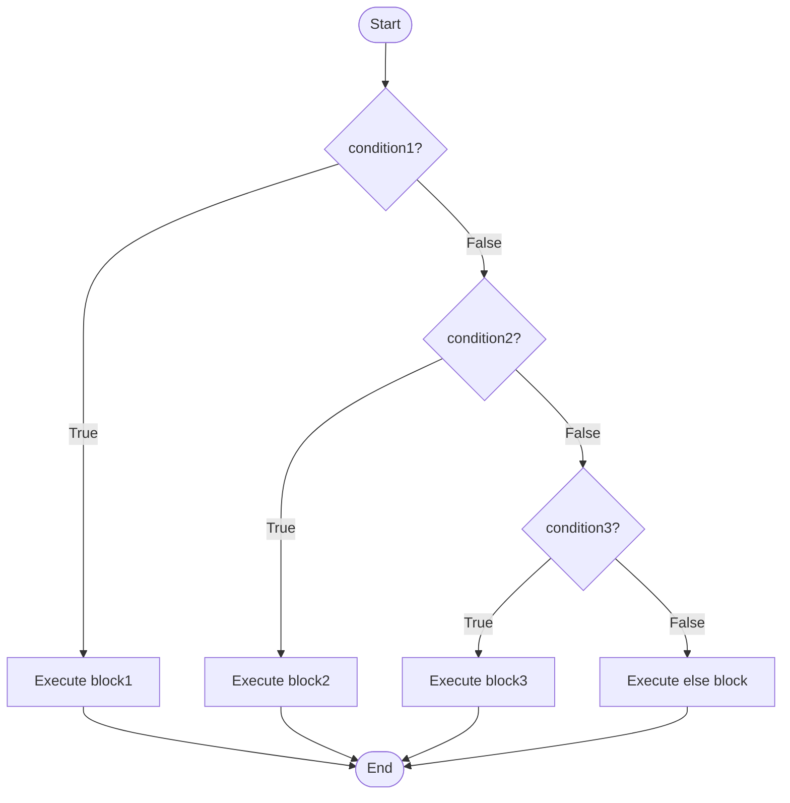
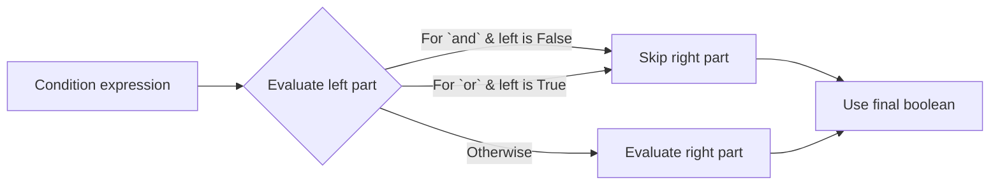

# 📘 Python If-Else: The Art of Decision Making in Code

## 1. Intuitive Introduction

Imagine you’re driving and approach a traffic light. If the light is red, you stop. Else if it’s yellow, you slow down. Else (green), you go. That’s a real‑life **conditional** – your action depends on a condition.

In Python, `if`, `elif`, and `else` let your program make decisions, respond to data, and follow different paths. Every non‑trivial program uses conditionals:

- **Student project** – Check if a user’s password is strong enough.
- **Data science** – Flag outliers in a dataset: `if value > threshold: mark as anomaly`.
- **Web development** – Control access: `if user.is_authenticated: show dashboard else: redirect to login`.
- **Machine learning** – Early stopping during training: `if loss < min_loss: break`.

Without conditionals, code would be a linear, inflexible script. With them, it becomes **intelligent**.

## 2. Real‑World Analogy: The DVD Rental Kiosk

You walk up to a DVD rental machine. It asks: *“Are you a member?”*

- **If** yes → proceed to rent.
- **Else if** you have a guest pass → allow one rental.
- **Else** → show membership sign‑up screen.

The machine evaluates conditions **in order** and executes only the first matching block. This is exactly how `if-elif-else` works – a series of gates, and only one opens.

## 3. Core Theory

A conditional statement evaluates a **boolean expression** (something that is `True` or `False`) and executes a block of code accordingly.

### Key properties

- **Conditional execution** – Code inside a block runs only if the condition is `True`.
- **`elif` chain** – Short for “else if”, allows multiple mutually exclusive checks.
- **`else` catch‑all** – Optional final branch when no previous condition is `True`.
- **Nesting** – You can place `if` inside another `if` for deeper logic.
- **Short‑circuit evaluation** – Logical `and`/`or` stop as soon as the result is known.

### Basic syntax

```python
# Simple if
temperature = 30
if temperature > 25:
    print("It's a hot day!")   # runs if True

# if-else
age = 17
if age >= 18:
    print("Adult")
else:
    print("Minor")   # runs here

# if-elif-else
score = 85
if score >= 90:
    grade = "A"
elif score >= 80:
    grade = "B"      # runs because 85 >= 80
elif score >= 70:
    grade = "C"
else:
    grade = "F"
print(f"Grade: {grade}")   # Grade: B
```

## 4. Visual Explanation

The flow of an `if-elif-else` chain is best understood with a flowchart.



Each condition is checked in order; at most one block executes.

## 5. Memory & Internal Working (CPython)

When Python compiles an `if` statement, it generates bytecode that pushes the condition’s result onto the stack and uses a **conditional jump** (`POP_JUMP_IF_FALSE`) to skip the block if the condition is `False`.

- **No special “if‑object”** – conditionals are control flow instructions, not data structures.
- **Short‑circuiting** – For `a and b`, Python evaluates `a`; if `a` is falsy, it never evaluates `b` (the bytecode jumps over `b`’s evaluation).
- **Constant folding** – The compiler may simplify conditions like `if 2 > 1:` to `if True:` and even remove dead code.

```python
# Demonstration of short‑circuiting
def expensive_check():
    print("Expensive check called!")
    return True

if False and expensive_check():
    print("Won't reach")
# expensive_check() is NEVER called – output has no "Expensive check called!"
```

### Memory diagram of evaluation



No heap allocation for the `if` itself – it’s purely control flow.

## 6. Writing Conditional Statements (All Forms)

Because “creating” isn’t a constructor like for lists, here are all syntactic ways to write conditionals in Python.

### 6.1 Simple `if`

```python
if x > 0:
    print("positive")
```

### 6.2 `if-else`

```python
result = "even" if x % 2 == 0 else "odd"
```

### 6.3 `if-elif-else`

```python
if x < 0:
    sign = "negative"
elif x == 0:
    sign = "zero"
else:
    sign = "positive"
```

### 6.4 Nested `if`

```python
if user_logged_in:
    if has_permission:
        delete_post()
    else:
        show_error("no permission")
```

### 6.5 Ternary Conditional Expression (one‑liner)

```python
# value_if_true if condition else value_if_false
status = "Adult" if age >= 18 else "Minor"
```

**Common mistake:** Forgetting that the ternary requires both `if` and `else` parts.

### 6.6 Using `match` (Python 3.10+) as an alternative to long `if-elif`

```python
# Not exactly if-else, but often cleaner for many equality checks
match status_code:
    case 200:
        print("OK")
    case 404:
        print("Not Found")
    case _:
        print("Other")
```

## 7. Core Operations / Methods

Conditionals themselves have no methods, but they heavily use **comparison operators** and **logical operators**.

### Comparison operators

| Operator | Meaning | Example |
|----------|---------|---------|
| `==` | equal | `if a == b:` |
| `!=` | not equal | `if a != b:` |
| `<`, `<=`, `>`, `>=` | less, less or equal, greater, greater or equal | `if score >= 60:` |
| `is` | object identity (same object) | `if x is None:` |
| `in` | membership | `if item in my_list:` |

### Logical operators

```python
# and – both must be True
if age >= 18 and has_license:
    print("Can drive")

# or – at least one True
if day == "Saturday" or day == "Sunday":
    print("Weekend!")

# not – invert boolean
if not is_raining:
    print("Go outside")
```

### Membership & identity examples

```python
# `in` with strings, lists, dicts
if "error" in log_message:
    alert_admin()

# `is` for singletons (None, True, False)
if result is None:
    result = default_value()
```

## 8. Advanced Concepts

### 8.1 Chained comparisons

Python allows compact chaining that reads like mathematics.

```python
x = 5
if 1 < x < 10:   # equivalent to: 1 < x and x < 10
    print("x is between 1 and 10")   # True

# Also works with equality
if x == y == z:
    print("all equal")
```

### 8.2 Walrus operator `:=` (Python 3.8+)

Assign and test in one expression – reduces redundancy.

```python
# Without walrus
data = input("Enter something: ")
if len(data) > 0:
    print(f"You typed: {data}")

# With walrus
if (data := input("Enter something: ")) != "":
    print(f"You typed: {data}")
```

### 8.3 Using `any()` and `all()` with conditions

```python
numbers = [3, 5, 7, 9]
if all(n % 2 == 1 for n in numbers):
    print("All odd")   # True

if any(n > 10 for n in numbers):
    print("At least one > 10")   # False
```

### 8.4 Conditional expressions in list comprehensions

```python
# Filtering
even_squares = [x**2 for x in range(10) if x % 2 == 0]

# Conditional value selection
labels = ["even" if n % 2 == 0 else "odd" for n in range(5)]
# labels = ['even', 'odd', 'even', 'odd', 'even']
```

## 9. Mathematical / Special Operations

### 9.1 Boolean algebra for simplifying conditions (De Morgan’s laws)

Instead of `if not (a and b):` you can write `if (not a) or (not b):`. This can improve readability.

```python
# Complex condition
if not (user_active and user_verified):
    print("Access denied")

# Equivalent using De Morgan
if (not user_active) or (not user_verified):
    print("Access denied")
```

### 9.2 Using `True`/`False` as integers (but don’t)

In Python, `True` is 1 and `False` is 0. This allows arithmetic, but it’s considered un‑Pythonic in conditionals.

```python
# Works, but unclear
x = 5
if x:          # same as if x != 0
    print("non-zero")   # runs

# Better be explicit
if x != 0:
    print("non-zero")
```

## 10. Real Practical Examples

### Example 1: User input validation with retries

```python
def get_valid_age():
    while True:
        user_input = input("Enter your age: ")
        if user_input.isdigit():
            age = int(user_input)
            if 0 <= age <= 120:
                return age
            else:
                print("Age must be between 0 and 120.")
        else:
            print("Invalid input. Please enter a number.")

age = get_valid_age()
print(f"Age saved: {age}")
```

### Example 2: Data cleaning – flagging outliers

```python
def clean_temperatures(temps, min_valid=-10, max_valid=45):
    cleaned = []
    for t in temps:
        if t is None:
            cleaned.append(20.0)      # default value
        elif t < min_valid:
            cleaned.append(min_valid) # clamp
        elif t > max_valid:
            cleaned.append(max_valid) # clamp
        else:
            cleaned.append(t)
    return cleaned

raw = [23, None, 100, -20, 18.5]
print(clean_temperatures(raw))
# Output: [23, 20.0, 45, -10, 18.5]
```

## 11. ML & Data Science Connection

Conditionals are everywhere in data pipelines, often hidden inside vectorized operations.

### 11.1 NumPy – `np.where` (vectorized if-else)

```python
import numpy as np
scores = np.array([45, 82, 67, 91, 38])
result = np.where(scores >= 60, "Pass", "Fail")
print(result)  # ['Fail' 'Pass' 'Pass' 'Pass' 'Fail']
```

### 11.2 Pandas – conditional column creation

```python
import pandas as pd
df = pd.DataFrame({"sales": [120, 45, 200, 30]})
df["category"] = df["sales"].apply(lambda x: "High" if x > 100 else "Low")
print(df)
#    sales category
# 0    120     High
# 1     45      Low
# 2    200     High
# 3     30      Low
```

### 11.3 Scikit‑learn – custom transformer with conditionals

```python
from sklearn.base import BaseEstimator, TransformerMixin

class OutlierClipper(BaseEstimator, TransformerMixin):
    def __init__(self, lower=-3, upper=3):
        self.lower = lower
        self.upper = upper
    def transform(self, X):
        X_clipped = X.copy()
        for i in range(X.shape[1]):   # for each feature
            col = X_clipped[:, i]
            col[col < self.lower] = self.lower
            col[col > self.upper] = self.upper
        return X_clipped
```

## 12. Common Mistakes & Pitfalls

| Mistake | Wrong Code | Why it fails | Correct Way |
|---------|------------|--------------|--------------|
| **Assignment instead of comparison** | `if x = 5:` | `=` is assignment, not equality; raises `SyntaxError` | `if x == 5:` |
| **Indentation errors** | `if x > 0:\nprint("positive")` | Missing indentation or mixing tabs/spaces | Use 4 spaces consistently |
| **Using `is` for value equality** | `if a is 5:` | `is` checks identity, not value; may work for small ints by accident but fails for larger ones | `if a == 5:` |
| **Empty list/dict/string as condition** | `if my_list:` when you meant `if len(my_list) > 0:` | Works (empty is falsy) but intent unclear. Explicit is better. | `if len(my_list) > 0:` or keep `if my_list:` with a comment |
| **Forgetting short‑circuit side‑effects** | `if expensive() and cheap():` | If `expensive()` is `False`, `cheap()` never runs – but you might have intended to run both | Reorder: `if cheap() and expensive():` or evaluate separately |
| **Using `elif` after `else`** | `if ... else ... elif ...` | `elif` must come before `else`; `else` must be last | Put `elif` above `else` |

## 13. Performance Considerations

For simple condition checks, the cost is negligible. But complex expressions matter.

| Operation | Time Complexity | Explanation |
|-----------|----------------|-------------|
| Simple comparison (`a < b`) | O(1) | Direct CPU operation |
| `in` on list | O(n) | Linear search |
| `in` on set/dict | O(1) average | Hash lookup |
| Chained comparisons `a < b < c` | O(1) + short‑circuit | Evaluated as `a<b and b<c`, stops early |
| Logical `and`/`or` | O(1) + short‑circuit | Stops as soon as truth is determined |
| `if` statement overhead | extremely low | Bytecode conditional jump |

**Guideline:** Put cheaper conditions first in an `and` chain, and more likely `True` conditions first in an `or` chain to maximize short‑circuit benefits.

```python
# Good order (cheap check first)
if user_exists_in_db(user_id) and expensive_validation(user_data):
    ...

# Bad order (expensive always runs even if user doesn't exist)
if expensive_validation(user_data) and user_exists_in_db(user_id):
    ...
```

## 14. Interview Questions

### Beginner

1. What’s the difference between `=` and `==` in an `if` statement?  
2. Can you write a ternary conditional that returns “even” if a number is even, else “odd”?  
3. What will `if []: print("Hello")` print? Why?  
4. How do you test if a variable is `None`?  
5. Write an `if-elif-else` that classifies a number as “negative”, “zero”, or “positive”.

### Intermediate

6. Explain short‑circuit evaluation with an example that prevents an error (e.g., checking list length before indexing).  
7. How does Python handle chained comparisons like `a < b < c` internally?  
8. What’s the output of `if 0.1 + 0.2 == 0.3: print("equal") else: print("not equal")` and why?  
9. When would you use `if x is not None` vs `if x != None`?  
10. Write a nested conditional that checks if a year is a leap year (divisible by 4, but not by 100 unless also by 400).

### Advanced

11. How does the CPython bytecode for an `if` statement look? What instructions are involved?  
12. Design a state machine using only `if-elif-else` that transitions between “start”, “running”, “paused”, and “stop”.  
13. Implement a lazy evaluation helper using conditional short‑circuiting and closures.  
14. Explain the performance difference between `if x in list` vs `if x in set` and how to decide which to use.  
15. Rewrite a deep nested `if` structure using `match` (Python 3.10+) or a dictionary mapping conditions to functions. Show trade‑offs.

## 15. Mini Project Idea

**Project: Interactive Text Adventure (Choose Your Own Adventure)**  

Create a simple game where the user makes choices, and the story changes based on `if-elif-else` chains. Include at least 3 decision points, inventory tracking, and multiple endings.

```python
# Skeleton
inventory = []
print("You are in a dark forest...")
choice = input("Go left or right? ").lower()
if choice == "left":
    # ...
elif choice == "right":
    # ...
else:
    print("Invalid. You stand still and get eaten.")
```

**What you’ll learn:**  
- Nested conditionals  
- User input sanitisation  
- State management via variables  
- Avoiding deeply nested “pyramid of doom” by using early returns or functions.

## 16. Best Practices

1. **Keep nesting shallow** – More than 3 levels becomes hard to read. Extract inner logic into functions.
2. **Use `elif` instead of multiple `if`** when conditions are mutually exclusive – saves time and clarifies intent.
3. **Prefer explicit over implicit** – `if len(items) == 0:` is clearer than `if not items:` when you truly mean “empty”, not “falsy”.
4. **Avoid `if x == True`** – just write `if x:`.
5. **Use ternaries only for simple expressions** – avoid nesting ternaries (`x if cond1 else y if cond2 else z`) – that’s a readability trap.
6. **Leverage `in` and `is`** for membership and identity – they’re faster and more Pythonic.

## 17. Summary Table

| Aspect | Details | Industry Use Case |
|--------|---------|-------------------|
| **Purpose** | Branch program execution based on boolean conditions | User authentication, data validation, feature flags |
| **Key Operators** | `==`, `!=`, `<`, `>`, `and`, `or`, `not`, `in`, `is` | E‑commerce: `if cart_total > 100: apply_discount()` |
| **Performance** | O(1) per condition, short‑circuit reduces work | Real‑time systems: cheap checks first |
| **Alternatives** | `match` (Python 3.10+), polymorphism, dict dispatch | Game development: state machines |
| **Common Pitfall** | Assignment `=` vs equality `==` | Any field – causes silent logic bugs |
| **Best Practice** | Flat over nested, explicit over implicit | Code reviews enforce max depth of 3 |

## 18. Key Takeaways

- ✅ `if`, `elif`, `else` let your program choose different paths – the core of **logic** in code.
- ✅ Conditions must evaluate to `True` or `False`; use comparison and logical operators.
- ✅ Short‑circuit evaluation (`and`/`or`) prevents unnecessary calculations and can avoid errors.
- ✅ Chain comparisons like `min < x < max` for clean, mathematical code.
- ✅ Walrus operator `:=` can combine assignment and test, but use sparingly for clarity.
- ✅ Prefer `elif` chains over multiple `if` for mutually exclusive branches.
- ✅ In data science, replace explicit loops with vectorised conditionals (`np.where`, `pandas.apply`).
- ✅ Avoid deep nesting – refactor into functions or use early `return`/`continue`.
