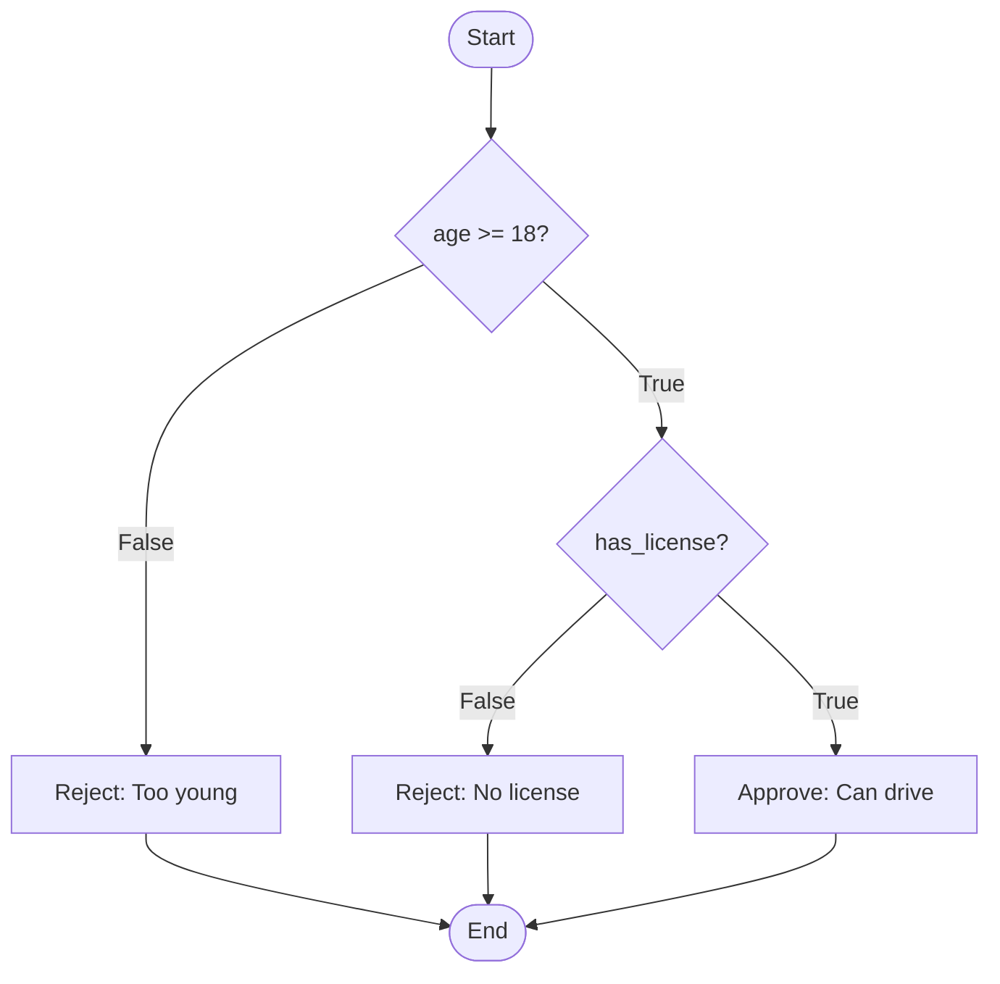
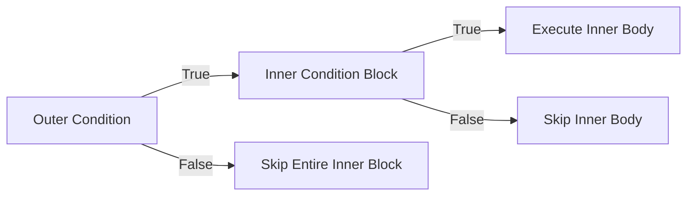

# 📘 Nested If: Layered Decision Making in Python

## 1. Intuitive Introduction

Imagine you’re boarding a flight. First, the gate agent checks: *“Do you have a valid boarding pass?”*  
**If yes**, then they ask: *“Is your passport up to date?”*  
**If yes again**, then: *“Is your luggage within weight limits?”*  

Each question only matters if the previous condition was true. That’s **nesting** – placing one conditional inside another.  

In software, nested `if` statements allow you to handle **layered logic** – situations where a second decision depends on the outcome of the first. Real uses:

- **Student grading** – First check if submitted; then check plagiarism; then assign grade.
- **Data science** – If a row is not null, then check if value > threshold; then flag outlier.
- **Web dev** – If user is logged in, then check if they are admin; then show admin panel.
- **ML model** – If model is trained, then if accuracy > 0.9, then deploy; else retrain.

Nesting gives fine‑grained control but must be used wisely to avoid the “pyramid of doom”.

## 2. Real‑World Analogy: The ATM Withdrawal Process

You walk to an ATM. It asks: *“Is your card inserted?”*  
- **If yes** → *“Is the PIN correct?”*  
  - **If yes** → *“Is the withdrawal amount ≤ balance?”*  
    - **If yes** → dispense cash.  
    - **Else** → show “insufficient funds”.  
  - **Else** → show “wrong PIN”.  
- **Else** → show “insert card first”.

Each level only runs after the previous condition passes. This is a perfect nested `if` structure – sequential gates.

## 3. Core Theory

A **nested `if`** is an `if` (or `if-else`, `elif`) statement that appears inside the body of another `if` or `else` block.

### Key properties

- **Hierarchical evaluation** – Inner conditions are evaluated **only if** outer conditions are `True`.
- **Indentation defines depth** – Python uses indentation (typically 4 spaces per level) to show nesting.
- **Works with `elif` and `else` too** – You can nest inside any branch.
- **No fixed limit** – In theory, you can nest hundreds of levels, but **practically** more than 3–4 levels becomes unreadable.
- **Can combine with logical operators** – Sometimes a nested `if` can be replaced by `and` (but nesting is clearer for sequential checks that depend on earlier results).

### Basic syntax & example

```python
# Nested if inside if
age = 20
has_license = True

if age >= 18:
    print("Age check passed.")
    if has_license:
        print("You can drive.")
    else:
        print("You need a license to drive.")
else:
    print("Too young to drive.")

# Output:
# Age check passed.
# You can drive.
```

### Nested inside `else` and `elif`

```python
temperature = 35
if temperature > 30:
    print("Hot outside.")
    if temperature > 40:
        print("Extreme heat warning!")
    else:
        print("But not extreme.")
elif temperature < 10:
    print("Cold outside.")
    if temperature < 0:
        print("Freezing! Wear a coat.")
else:
    print("Pleasant weather.")
```

## 4. Visual Explanation

The flow of nested conditionals is like a decision tree – each branch may contain further branches.



Here the second decision only appears inside the `True` branch of the first.

## 5. Memory & Internal Working (CPython)

Nested `if` statements are compiled into bytecode that simply contains **nested conditional jumps**. No special data structure is used – the bytecode reflects the nesting via the order of instructions and jump targets.

Consider this Python code:

```python
if x > 0:
    if y > 0:
        print("both positive")
```

The generated bytecode (simplified) looks like:

```
LOAD_FAST    x
LOAD_CONST   0
COMPARE_OP   >    (if x > 0)
POP_JUMP_IF_FALSE  label_outside   # skip outer block if False
LOAD_FAST    y
LOAD_CONST   0
COMPARE_OP   >                     # if y > 0
POP_JUMP_IF_FALSE  label_inside    # skip inner block if False
LOAD_GLOBAL  print
LOAD_CONST   "both positive"
CALL_FUNCTION 1
label_inside:
label_outside:
...
```

The inner condition is only reached if the outer jump wasn’t taken. This makes nested `if` **efficient** – inner checks never execute when outer fails.

### Memory diagram of decision flow



No extra memory overhead – only the bytecode and stack for expression evaluation.

## 6. Creating Nested Conditionals (All Forms)

“Creating” isn’t about constructors, but here are all syntactical patterns for nesting.

### 6.1 Simple nested `if`

```python
if condition1:
    if condition2:
        action()
```

### 6.2 Nested `if-else` inside `if`

```python
if user_logged_in:
    if user_is_admin:
        show_admin_dashboard()
    else:
        show_user_dashboard()
else:
    show_login_page()
```

### 6.3 Nested inside `else`

```python
if x > 0:
    print("positive")
else:
    if x == 0:
        print("zero")
    else:
        print("negative")
# This can be flattened with elif: if x > 0: ... elif x == 0: ... else: ...
```

### 6.4 Deep nesting (not recommended beyond 3 levels)

```python
if a:
    if b:
        if c:
            if d:
                print("All true")
```

### 6.5 Using `elif` with nesting

```python
if score >= 90:
    if attendance >= 95:
        grade = "A+"
    else:
        grade = "A"
elif score >= 80:
    if attendance >= 90:
        grade = "B+"
    else:
        grade = "B"
else:
    grade = "C"
```

### 6.6 Guard clauses (early exit) – an alternative to deep nesting

```python
# Instead of:
if user_active:
    if user_verified:
        if has_permission:
            perform_action()

# Use guard clauses:
if not user_active:
    return
if not user_verified:
    return
if not has_permission:
    return
perform_action()
```

## 7. Core Operations / Methods

Nested `if` doesn’t have methods, but the **comparison and logical operators** used inside them behave identically to normal conditionals.

However, one important pattern is using `pass` as a placeholder when you need an empty block.

```python
if outer_condition:
    if inner_condition:
        pass  # TODO: implement later
    else:
        print("Inner false")
```

### Short‑circuiting in nested vs. `and`

These two are **not** always equivalent:

```python
# Nested
if user:
    if user.is_active and user.verified:
        allow_login()
# Equivalent to:
if user and user.is_active and user.verified:
    allow_login()

# But if you need different actions per level, nesting is mandatory:
if user:
    if user.is_active:
        print("Active user")
        if user.verified:
            print("Also verified")
    else:
        print("Inactive user")
```

## 8. Advanced Concepts

### 8.1 Refactoring deep nesting with functions

Replace nested conditionals with well‑named functions:

```python
# Deeply nested
def process_order(order):
    if order.paid:
        if order.in_stock:
            if order.shipping_address:
                ship(order)
            else:
                print("No address")
        else:
            print("Out of stock")
    else:
        print("Not paid")

# Refactored
def process_order(order):
    if not order.paid:
        print("Not paid")
        return
    if not order.in_stock:
        print("Out of stock")
        return
    if not order.shipping_address:
        print("No address")
        return
    ship(order)
```

### 8.2 Using dictionaries to replace nested conditionals

For many branches, a dispatch dictionary can eliminate nesting.

```python
# Instead of nested ifs for different user types and actions
def handle_admin():
    print("Admin menu")

def handle_guest():
    print("Guest menu")

actions = {
    ("admin", "view"): handle_admin,
    ("guest", "view"): handle_guest,
}
user_type = "admin"
action = "view"
actions.get((user_type, action), lambda: print("No permission"))()
```

### 8.3 Ternary inside nested

You can nest ternary expressions, but it becomes unreadable:

```python
# Avoid this
result = "A" if score > 90 else ("B" if score > 80 else "C")
# Better with nested if-else explicitly
```

### 8.4 Using `match` (Python 3.10+) with guards as nested alternative

```python
match (user_type, action):
    case ("admin", "delete") if user.has_permission("delete"):
        delete_item()
    case ("admin", "view"):
        view_item()
    case _:
        print("Access denied")
```

## 9. Mathematical / Special Operations

No specific math operations, but you can combine nested conditionals with **boolean algebra** to flatten them.

**De Morgan’s laws for nested `if`:**  
A nested `if` like:
```python
if condition1:
    if condition2:
        do_something()
```
is logically equivalent to:
```python
if condition1 and condition2:
    do_something()
```

But if you have `else` branches, flattening is more complex:

```python
# Nested
if cond1:
    if cond2:
        a()
    else:
        b()
else:
    c()
# Equivalent to:
if cond1 and cond2:
    a()
elif cond1 and not cond2:
    b()
else:
    c()
```

## 10. Real Practical Examples

### Example 1: Loan approval system (multi‑stage)

```python
def approve_loan(credit_score, annual_income, existing_debt):
    if credit_score >= 700:
        print("Credit score: Good")
        if annual_income >= 50000:
            print("Income: Sufficient")
            if existing_debt < 20000:
                print("Debt: Low → Loan approved")
                return True
            else:
                print("Debt too high → Denied")
                return False
        else:
            print("Income too low → Denied")
            return False
    else:
        print("Credit score too low → Denied")
        return False

# Test
approve_loan(720, 60000, 15000)  # Approved
approve_loan(680, 60000, 15000)  # Denied at credit score
```

### Example 2: E‑commerce discount calculator (nested based on membership + cart value)

```python
def calculate_discount(member_tier, cart_total, first_purchase):
    discount = 0
    if member_tier == "gold":
        discount = 20
        if cart_total > 500:
            discount += 10
        if first_purchase:
            discount += 5
    elif member_tier == "silver":
        discount = 10
        if cart_total > 300:
            discount += 5
    else:  # regular
        if first_purchase:
            discount = 10
        elif cart_total > 200:
            discount = 5
    
    # Cap at 50%
    return min(discount, 50)

print(calculate_discount("gold", 600, True))   # 20+10+5 = 35%
print(calculate_discount("regular", 50, False)) # 0%
```

## 11. ML & Data Science Connection

Nested conditionals appear in **feature engineering**, **custom preprocessing**, and **rule‑based models**.

### 11.1 Pandas: Nested condition with `np.where` (vectorised nesting)

```python
import pandas as pd
import numpy as np

df = pd.DataFrame({
    "age": [25, 17, 30, 16],
    "income": [50000, 20000, 80000, 15000]
})

# Nested logic: if age >= 18, then check income
df["category"] = np.where(
    df["age"] >= 18,
    np.where(df["income"] >= 30000, "Adult earner", "Adult low income"),
    "Minor"
)
print(df)
#    age  income         category
# 0   25   50000    Adult earner
# 1   17   20000            Minor
# 2   30   80000    Adult earner
# 3   16   15000            Minor
```

### 11.2 Custom Scikit‑learn transformer with nested logic

```python
from sklearn.base import BaseEstimator, TransformerMixin

class ConditionalImputer(BaseEstimator, TransformerMixin):
    def fit(self, X, y=None):
        return self
    def transform(self, X):
        # X is a 2D array, assume first column is 'age', second is 'income'
        X_out = X.copy()
        for i in range(len(X_out)):
            if np.isnan(X_out[i, 0]):   # missing age
                if np.isnan(X_out[i, 1]):   # also missing income
                    X_out[i, 0] = 30  # default adult age
                else:
                    X_out[i, 0] = 25  # typical working age
            # further nested ifs for other columns
        return X_out
```

### 11.3 Rule‑based ML (explainable AI)

Decision trees internally are a series of nested `if-else` rules. You can emulate a simple decision tree:

```python
def predict_risk(age, income, debt):
    if age > 50:
        if debt < 10000:
            return "Low risk"
        else:
            return "Medium risk"
    else:  # age <= 50
        if income > 75000:
            return "Low risk"
        else:
            if debt < 5000:
                return "Medium risk"
            else:
                return "High risk"
```

## 12. Common Mistakes & Pitfalls

| Mistake | Wrong Code | Why it fails | Correct Way |
|---------|------------|--------------|--------------|
| **Inconsistent indentation** | `if a:\n   print("a")\n   if b:\n print("b")` | Indentation must be consistent (all spaces or all tabs) | Use 4 spaces per level, never mix |
| **Forgetting outer condition can be false** | `if condition1:\n    if condition2:\n        x = 1\n# What if condition1 false? x never set` | `x` may be uninitialised | Provide default or handle all paths |
| **Over‑nesting (pyramid of doom)** | `if a: if b: if c: if d: do()` | Hard to read, test, and maintain | Use guard clauses or helper functions |
| **Using `elif` after a nested `if` incorrectly** | `if x>0:\n    if y>0: print("both")\nelif x==0: print("zero")` | The `elif` belongs to outer `if`, not inner – this is fine but often misinterpreted | Be clear; use comments |
| **Neglecting to indent inner block** | `if a:\nif b:\n print("b")` | `if b` is at same level as `if a`, not nested – changes logic | Indent inner block |
| **Using nested `if` where `and` would suffice** | `if logged_in:\n    if is_admin:\n        delete()` | Adds extra lines and nesting without benefit | `if logged_in and is_admin:` (unless different messages per condition) |

## 13. Performance Considerations

Nested `if` is **not slower** than flattened `if` with `and` – the bytecode is nearly identical because Python short‑circuits anyway.

| Structure | Time Complexity | Notes |
|-----------|----------------|-------|
| Outer condition false | O(1) | Inner condition never evaluated – best case |
| Outer true, inner false | O(1) + cost of inner condition | Still constant time |
| Deep nesting (no early failure) | O(number of conditions) | Each condition evaluated sequentially |
| Refactored guard clauses | O(number of failing conditions until first true) | Same as nested; both short‑circuit |

**Key insight:** The performance of nested `if` depends entirely on the complexity of each condition, not on the nesting itself. However, **readability** suffers long before performance becomes an issue.

```python
# Both are O(1) with short‑circuit
# Nested
if user_exists:
    if user.is_active:
        if user.has_paid:
            grant_access()
# Equivalent flat
if user_exists and user.is_active and user.has_paid:
    grant_access()
# In bytecode, the flat version also generates sequential jumps – practically identical.
```

## 14. Interview Questions

### Beginner

1. What is a nested `if` statement? Give a real‑life example.
2. Write a nested `if` that checks if a number is positive and then if it’s even.
3. What happens if you forget to indent the inner `if` block?
4. Can you nest an `if` inside an `else` block? Show an example.
5. How many levels of nesting are recommended? Why?

### Intermediate

6. Rewrite the following nested `if` using `and` and guard clauses:
   ```python
   if logged_in:
       if not banned:
           if age >= 18:
               show_adult_content()
   ```
7. Explain the difference between nesting and using `elif` chains. When would you choose nesting?
8. What is the “pyramid of doom”? Suggest two ways to avoid it.
9. Write a function that uses nested conditionals to classify a triangle as equilateral, isosceles, or scalene based on three side lengths.
10. How does short‑circuiting work in nested `if` compared to `and`? Are there cases where they behave differently?

### Advanced

11. Describe the CPython bytecode generated for a doubly nested `if`. How does the interpreter manage jump targets?
12. Implement a finite state machine (FSM) with three states using nested `if` inside a loop. Show transition logic.
13. Refactor a deeply nested conditional (6+ levels) into a composition of small, pure functions. Demonstrate increased testability.
14. Discuss the trade‑offs between nested `if` and dictionary dispatch for handling many conditional branches. Provide benchmarks (conceptually).
15. Write a metaclass or decorator that automatically flattens nested conditionals at runtime? (Conceptual – explore feasibility)

## 15. Mini Project Idea

**Project: Smart Parking Lot System**

Build a simulation that decides if a car can enter a parking lot based on multiple nested rules:

- **Outer check:** Is there any free space?  
- **If yes:** Is the car electric?  
  - If electric, check if charging spots are available.  
- **If not electric:** Check if the car is oversized (e.g., SUV) and if oversized spots are free.  
- **If space exists, but car is a van:** Check height clearance.  

Implement with nested `if` statements, then refactor using guard clauses. Add a simple loop to simulate arriving cars.

```python
def can_park(car_type, is_electric, height, free_spaces, free_charging, free_oversized):
    if free_spaces > 0:
        if is_electric:
            if free_charging > 0:
                return True, "Charging spot"
            else:
                return False, "No charging spots left"
        else:
            if car_type == "van" and height > 2.0:
                return False, "Height too high"
            if car_type == "SUV":
                if free_oversized > 0:
                    return True, "Oversized spot"
                else:
                    return False, "No oversized spots"
            return True, "Regular spot"
    else:
        return False, "Lot full"
```

## 16. Best Practices

1. **Limit nesting depth to ≤ 3** – If you need more, refactor using guard clauses or extract logic into functions.
2. **Use guard clauses** (early `return`, `continue`, `break`) to reduce nesting.
3. **Prefer flat `and` chains** when you only need a final action, not different intermediate actions.
4. **Comment the levels** – When nesting is unavoidable, add short comments explaining each level’s purpose.
5. **Keep inner blocks short** – If an inner block exceeds 5–10 lines, move it to a function.
6. **Consider alternative control structures** – For many branches, a dictionary of handlers or a `match` statement (Python 3.10+) is often cleaner than deep nesting.

## 17. Summary Table

| Aspect | Details | Industry Use Case |
|--------|---------|-------------------|
| **Purpose** | Sequential gate‑keeping where later decisions depend on earlier ones | Multi‑factor authentication, loan approval pipelines |
| **Syntax** | `if cond1: if cond2: ...` with increasing indentation | Nested in e‑commerce checkout flow |
| **Depth Limit** | No language limit; practical limit ~3–4 levels | Code quality guidelines enforce max depth |
| **Performance** | O(1) per condition, short‑circuit prevents unnecessary work | Real‑time systems (e.g., game logic) |
| **Alternatives** | Guard clauses, `and` chaining, dictionary dispatch, `match` | State machines, rule engines |
| **Common Mistake** | Pyramid of doom, misindentation, uninitialised variables | Leads to bugs and maintenance nightmares |

## 18. Key Takeaways

- ✅ **Nested `if`** means placing an `if` (or `elif`/`else`) inside the body of another conditional.
- ✅ Use it when a decision **only makes sense** after a previous condition is true.
- ✅ Indentation is the **only thing** that defines nesting in Python – be consistent.
- ✅ Deep nesting (≥4 levels) harms readability – **refactor** with guard clauses or functions.
- ✅ Nested `if` and `and` often produce the same bytecode; choose based on clarity.
- ✅ In data science, prefer vectorised nested conditions (`np.where` nested) over row‑wise loops.
- ✅ Guard clauses (`if not condition: return`) are a powerful way to **flatten** nested logic.
- ✅ Always handle all logical paths – variables defined inside nested blocks may be uninitialised when outer conditions fail.