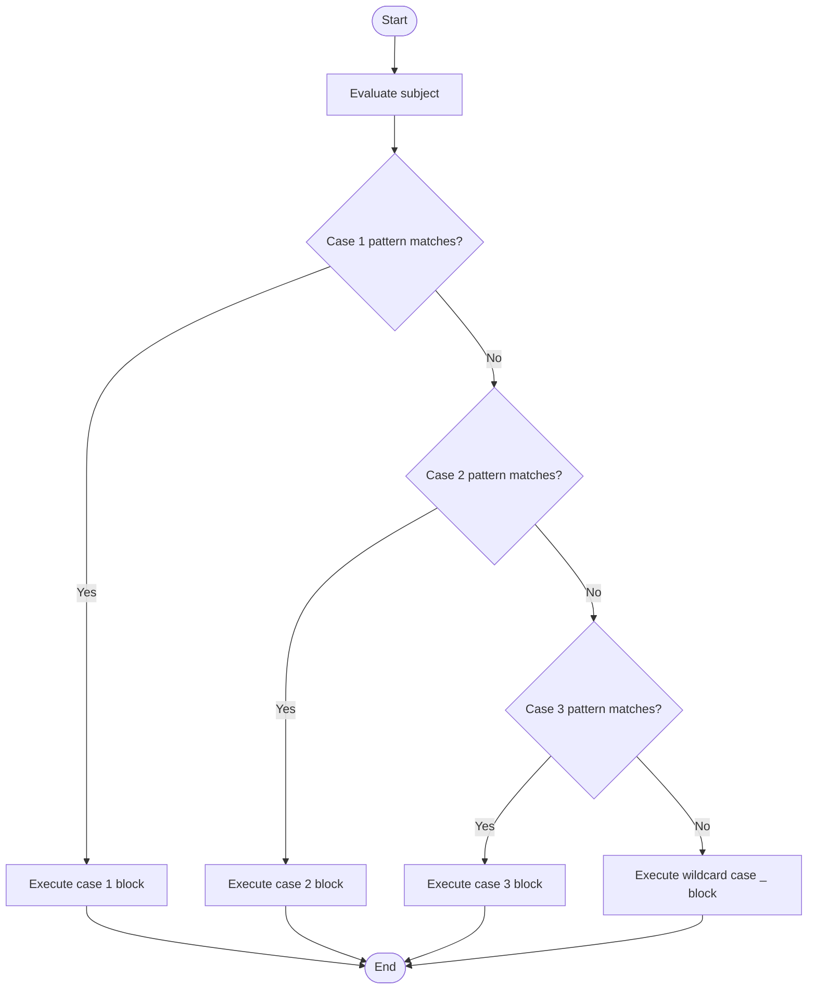
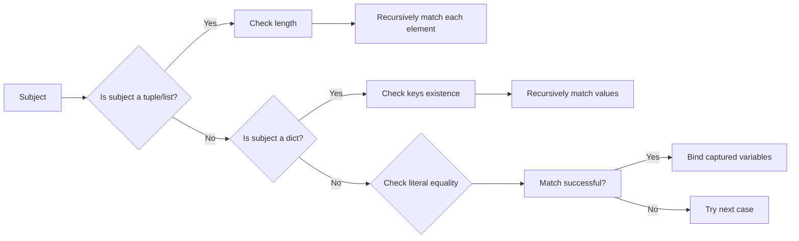

# 📘 Match Case: Structural Pattern Matching in Python

## 1. Intuitive Introduction

Imagine you work at a post office. Packages arrive in all shapes and sizes – small envelopes, large boxes, fragile items, registered mail. Instead of writing a long chain of `if-elif-else` statements to inspect each package’s attributes, you have a **sorting machine** that looks at the **structure** of each parcel and instantly routes it: “If it’s a small envelope with a stamp → regular mail. If it’s a box with a fragile sticker → handle with care.” This is exactly what Python’s `match-case` (introduced in Python 3.10) does – it matches a value’s **shape** and **content**, not just its equality.

Real‑world uses:

- **Student project** – Build a command parser: `match command.split(): case ["quit"]: exit(); case ["load", filename]: load_file(filename)`
- **Data science** – Handle mixed data types in a pipeline: `match record: case {"type": "numeric", "value": v}: process_numeric(v)`
- **Web development** – Route API requests: `match (method, path): case ("GET", "/users"): get_users(); case ("POST", "/users"): create_user()`
- **Machine Learning** – Dispatch hyperparameter configurations: `match config: case {"optimizer": "sgd", "lr": lr}: train_sgd(lr)`

`match` makes code **declarative**, **readable**, and **safe** by unpacking complex data structures in one go.

## 2. Real‑World Analogy: The Museum Reception Desk

A museum has a rule: every visitor gets a badge based on who they are.

- If a person is a **child under 12** → give a “Junior Explorer” badge.
- If a person is a **student with a valid ID** → give a “Student” badge.
- If a person is a **senior citizen (age ≥ 65)** → give a “Golden Years” badge.
- If a person is **accompanied by a guide** → give a “VIP” badge.
- Anyone else → “General Admission”.

The receptionist doesn’t check each condition separately; they look at the **visitor’s attributes** (age, student status, guide) all at once and match against a set of **patterns**. Python’s `match-case` does exactly that – it looks at the **structure** of a value and picks the first pattern that fits.

## 3. Core Theory

The `match` statement takes an expression (the **subject**) and compares it against one or more `case` patterns. When a pattern matches, the corresponding block executes. Patterns can be **literals**, **variables**, **sequences**, **mappings**, **classes**, or **combinations** with `|` (OR), `as` (alias), and `_` (wildcard).

### Syntax

```python
match subject:
    case pattern1:
        # action1
    case pattern2:
        # action2
    ...
    case _:
        # default action (wildcard)
```

### Important Properties

| Property | Explanation | Example |
|----------|-------------|---------|
| **Structural matching** | Matches the shape and values of nested data | `case [x, y]:` matches a 2‑element list |
| **No fall‑through** | Only the first matching case executes (unlike C switch) | Once matched, exits `match` |
| **Capture variables** | Patterns can extract parts into variables | `case ("add", x, y):` binds `x` and `y` |
| **Wildcard `_`** | Matches anything but does **not** bind a variable | Use as default case |
| **OR pattern `|`** | Multiple alternatives in one case | `case 1 | 2 | 3:` |
| **Guard `if`** | Additional condition after a pattern | `case [x, y] if x == y:` |
| **Order matters** | First matching pattern wins | Put specific patterns before general ones |
| **Exhaustiveness** | No automatic check, but wildcard `_` ensures coverage | Linters can warn about missing patterns |

### Basic Examples

```python
def http_status(code):
    match code:
        case 200:
            return "OK"
        case 404:
            return "Not Found"
        case 500 | 502 | 503:
            return "Server Error"
        case _:
            return "Unknown"

print(http_status(200))  # OK
print(http_status(502))  # Server Error
print(http_status(418))  # Unknown
```

## 4. Visual Explanation



The subject is evaluated **once** at the top. Then each pattern is tried in order. The first successful pattern wins; no fall‑through.

## 5. Memory & Internal Working (CPython)

Under the hood, Python compiles a `match` statement into bytecode that performs a series of **checks** based on the pattern types. For simple literal patterns (like `case 200:`), it generates a lookup table (similar to a jump table) for O(1) dispatch. For sequence or mapping patterns, it performs **structural checks** – verifying length, type, then recursively matching components.

The compiler does **not** create a new data structure; instead, it emits bytecode that pushes the subject onto the stack, then executes conditional jumps. Captured variables are stored in the local namespace just like normal assignments.

### Internal matching process (simplified)



Because pattern matching is done at runtime (not compile‑time optimisation), complex patterns have a small overhead. However, for most real‑world code, it is **faster and cleaner** than long `if-elif` chains, especially when destructuring.

## 6. Creating Match‑Case Blocks (All Forms)

Since `match` is a statement, “creating” means learning all pattern forms. Here’s a catalog.

### 6.1 Literal pattern

```python
match x:
    case 0:
        print("zero")
    case 1:
        print("one")
```

### 6.2 Capture (variable) pattern

Binds the matched value to a variable (if not already a constant).

```python
match point:
    case (0, 0):
        print("Origin")
    case (x, y):
        print(f"Point at ({x}, {y})")
```

### 6.3 Wildcard `_`

Matches anything but discards the value.

```python
match color:
    case "red":
        print("Stop")
    case _:
        print("Other color")
```

### 6.4 OR pattern `|`

```python
case 401 | 403 | 404:
    print("Client error")
```

### 6.5 AS pattern `as`

Bind the whole matched value to a variable while also destructuring.

```python
case [x, y] as point:
    print(f"Point {point} has coordinates {x}, {y}")
```

### 6.6 Guard (conditional) `if`

```python
case (x, y) if x == y:
    print("On diagonal")
```

### 6.7 Sequence pattern (list or tuple)

```python
match data:
    case [first, second]:      # matches exactly two elements
        print(f"Two: {first}, {second}")
    case [first, *rest]:       # matches one or more, rest as list
        print(f"First: {first}, rest: {rest}")
```

### 6.8 Mapping pattern (dictionary)

```python
match config:
    case {"host": host, "port": port}:
        print(f"Connect to {host}:{port}")
    case {"host": host, "port": 80}:
        print(f"HTTP to {host}")
    case {"host": host}:
        print(f"Host {host}, using default port")
```

### 6.9 Class pattern

```python
from dataclasses import dataclass

@dataclass
class Point:
    x: int
    y: int

match obj:
    case Point(x=0, y=0):
        print("Origin")
    case Point(x=x, y=y):
        print(f"Point({x},{y})")
```

### 6.10 Named constants (using dotted names)

To avoid capture, use dotted names (e.g., enum members).

```python
from enum import Enum
class Color(Enum):
    RED = 1
    GREEN = 2

match c:
    case Color.RED:
        print("Red")
    case other:   # 'other' is a capture variable, not Color.GREEN
        print("Not red")
```

## 7. Core Operations / Methods

Match‑case has no methods, but understanding pattern **combinators** is key.

| Pattern type | Syntax | Use case |
|--------------|--------|----------|
| Literal | `case 42:` | Exact value match |
| Capture | `case x:` | Bind any value to variable (caution: shadows outer) |
| Wildcard | `case _:` | Catch‑all default |
| OR | `case 1 \| 2 \| 3:` | Multiple literals |
| AS | `case [x, y] as pair:` | Destructure and keep whole |
| Guard | `case [x, y] if x > y:` | Extra runtime condition |
| Sequence | `case [a, b, *rest]:` | Lists/tuples, supports `*_` ignore rest |
| Mapping | `case {"key": value, **rest}:` | Dicts, supports `**rest` |
| Class | `case Point(x=0, y=0):` | Instance attribute matching |

## 8. Advanced Concepts

### 8.1 Nested patterns

Patterns can be arbitrarily nested.

```python
match response:
    case ["data", {"id": id, "values": [first, second]}]:
        print(f"ID {id}, first two values: {first}, {second}")
```

### 8.2 Matching against `__match_args__`

Custom classes can define `__match_args__` to enable positional matching.

```python
class Point3D:
    __match_args__ = ("x", "y", "z")
    def __init__(self, x, y, z):
        self.x, self.y, self.z = x, y, z

p = Point3D(1, 2, 3)
match p:
    case Point3D(0, 0, 0):
        print("Origin")
    case Point3D(x, y, z):
        print(f"({x},{y},{z})")
```

### 8.3 Combining with Enums

```python
from enum import Enum

class Operation(Enum):
    ADD = 1
    SUB = 2

def calculate(op, a, b):
    match (op, a, b):
        case (Operation.ADD, _, _):
            return a + b
        case (Operation.SUB, _, _):
            return a - b
```

### 8.4 Using `_` multiple times

Each `_` is independent; they don't require values to be equal.

```python
case [_, _]:   # matches any two‑element sequence
```

To require equality, use a capture variable and a guard.

### 8.5 Pattern matching on `type()`

Use class pattern with `type` or `isinstance`.

```python
match obj:
    case int():
        print("Integer")
    case str():
        print("String")
    case list():
        print("List")
```

### 8.6 Exhaustiveness checking with `typing.assert_never`

Python 3.11+ can use `assert_never` to check exhaustiveness.

```python
from typing import assert_never

def handle(value: int | str) -> None:
    match value:
        case int():
            print("int")
        case str():
            print("str")
        case _:
            assert_never(value)  # type checker ensures unreachable
```

## 9. Mathematical / Special Operations

No dedicated math operations, but guards allow mathematical conditions.

### Example: Matching quadratic equation roots

```python
def describe_roots(a, b, c):
    discriminant = b**2 - 4*a*c
    match discriminant:
        case d if d > 0:
            return "Two real roots"
        case 0:
            return "One real root (double)"
        case d if d < 0:
            return "Two complex roots"
```

## 10. Real Practical Examples

### Example 1: JSON/API response handler

```python
def handle_api_response(response):
    match response:
        case {"status": 200, "data": data}:
            print(f"Success: {data}")
        case {"status": 404}:
            print("Resource not found")
        case {"status": 400, "errors": errors}:
            print(f"Bad request: {errors}")
        case {"status": s} if 500 <= s < 600:
            print("Server error, retry later")
        case _:
            print("Unknown response format")

# Test
handle_api_response({"status": 200, "data": {"user": "Alice"}})
handle_api_response({"status": 404})
handle_api_response({"status": 503})
```

### Example 2: Recursive expression evaluator (AST)

```python
def evaluate(expr, env=None):
    if env is None:
        env = {}
    match expr:
        case int(val) | float(val):
            return val
        case str(var):
            return env[var]
        case ("+", left, right):
            return evaluate(left, env) + evaluate(right, env)
        case ("*", left, right):
            return evaluate(left, env) * evaluate(right, env)
        case ("let", [(var, val_expr), *rest], body):
            new_env = dict(env)
            new_env[var] = evaluate(val_expr, env)
            return evaluate(("let", rest, body), new_env) if rest else evaluate(body, new_env)
        case _:
            raise SyntaxError(f"Invalid expression: {expr}")

# Usage: ("+", 2, ("*", 3, 4)) -> 2 + (3*4) = 14
print(evaluate(("+", 2, ("*", 3, 4))))   # 14
```

## 11. ML & Data Science Connection

Match‑case is excellent for **config parsing**, **model dispatch**, and **data validation pipelines**.

### 11.1 Scikit‑learn hyperparameter dispatch

```python
def build_model(config):
    match config:
        case {"type": "linear", "fit_intercept": True}:
            return LinearRegression(fit_intercept=True)
        case {"type": "random_forest", "n_estimators": n, "max_depth": d}:
            return RandomForestClassifier(n_estimators=n, max_depth=d)
        case {"type": "neural", "layers": layers, "activation": act}:
            return build_mlp(layers, act)
        case _:
            raise ValueError(f"Unknown config: {config}")
```

### 11.2 Pandas pipeline step matching

```python
def apply_step(df, step):
    match step:
        case {"op": "filter", "column": col, "threshold": th}:
            return df[df[col] > th]
        case {"op": "select", "columns": cols}:
            return df[cols]
        case {"op": "group_by", "by": by, "agg": agg}:
            return df.groupby(by).agg(agg)
        case _:
            raise ValueError(f"Invalid step: {step}")
```

### 11.3 PyTorch model configuration with nested patterns

```python
def configure_optimizer(model, cfg):
    match cfg:
        case {"optimizer": "SGD", "lr": lr, "momentum": m}:
            return torch.optim.SGD(model.parameters(), lr=lr, momentum=m)
        case {"optimizer": "Adam", "lr": lr, "weight_decay": wd}:
            return torch.optim.Adam(model.parameters(), lr=lr, weight_decay=wd)
        case {"optimizer": "AdamW", **kwargs}:
            return torch.optim.AdamW(model.parameters(), **kwargs)
        case _:
            return torch.optim.SGD(model.parameters(), lr=0.01)  # default
```

## 12. Common Mistakes & Pitfalls

| Mistake | Wrong Code | Why it fails | Correct Way |
|---------|------------|--------------|--------------|
| **Capture variable shadows outer** | `x = 10; match val: case x: print(x)` | `x` becomes a new capture variable, not the outer `10` | Use dotted constant or `case 10:` |
| **Forgetting wildcard** | `match x: case 1: print("one")` | If `x != 1`, no case matches → does nothing (no error) | Add `case _: pass` or handle all cases |
| **Order of OR patterns** | `case 1 | 2: pass; case 1: pass` | Second `1` never matches | Put more specific first |
| **Using sequence pattern on non‑sequence** | `match 123: case [a, b]: pass` | `123` is not a sequence → no match, but no error | Check type first or use class pattern |
| **Guard side effects** | `case [x] if expensive_func(x):` | `expensive_func` called only after pattern matches, but may be called multiple times across cases | Move expensive checks after match or use function |
| **Mistaking `_` as variable** | `case _: print(_)` | `_` is not bound; you cannot print it (NameError) | Use a capture variable like `case other:` if you need the value |
| **Using list pattern for variable length** | `case [a, b]:` for any length 2+ | Only matches exactly 2‑element sequences | Use `case [a, b, *rest]:` |

## 13. Performance Considerations

| Operation | Time Complexity | Notes |
|-----------|----------------|-------|
| Literal pattern (`case 42:`) | O(1) | Jump table for small ints/strings? Actually linear scan but cheap |
| OR pattern `case 1 | 2 | 3:` | O(number of alternatives) | Each tested sequentially |
| Sequence pattern (fixed length) | O(length) | Must check each element |
| Sequence with `*rest` | O(n) | Copies rest (like slicing) |
| Mapping pattern | O(number of keys) | Checks key existence, then values |
| Class pattern with attributes | O(number of attributes) | Calls `__match_args__` or attribute access |
| Guard `if` | additional O(1) to O(complex) | Guard evaluated after pattern match |

**Comparison to `if-elif`:** For many simple literal checks, `match` is similar speed to a chain of `if-elif`. But when destructuring nested data, `match` can be **faster** because it combines type checks, length checks, and attribute access into one operation, whereas manual `if` would repeat them.

```python
# Manual if-elif (slower, more verbose)
if isinstance(data, list) and len(data) == 2 and isinstance(data[0], int):
    x = data[0]
    # ...

# match (concise, single pass)
match data:
    case [int(x), y]:
        ...
```

## 14. Interview Questions

### Beginner

1. What is the difference between `match` and a traditional `switch` statement in C/Java?
2. Write a `match` case that prints “Even” for an even integer and “Odd” otherwise.
3. What does the wildcard `_` do in a `match` statement?
4. How do you match multiple values in a single case (e.g., 1, 2, or 3)?
5. What happens if no case matches and there is no `case _`?

### Intermediate

6. Explain capture variables. Why does `case x:` inside a match capture `x` instead of comparing to an outer variable named `x`?
7. Write a pattern that matches a 3‑element tuple where the first and last elements are equal.
8. What is a guard? Provide an example using a guard with a sequence pattern.
9. How do you match against a dictionary that must contain specific keys, but may have extra keys?
10. Write a class `Person` with attributes `name` and `age`. Use a class pattern to match a person aged 18 or older.

### Advanced

11. Describe how CPython implements `match` for sequence patterns. What bytecode instructions are involved?
12. Explain how to use `__match_args__` to enable positional matching for a custom class. Provide an example.
13. Implement a simple Lisp‑like interpreter that uses `match` to evaluate `(if cond then else)` expressions.
14. Discuss the exhaustiveness checking in match. How can `typing.assert_never` help?
15. Compare the performance of deeply nested `if-elif` vs `match` for parsing a moderately complex JSON structure. When would `match` be slower?

## 15. Mini Project Idea

**Project: Command‑line calculator with expression parsing**

Build a REPL calculator that parses user input like `"add 5 3"` or `"multiply 2 10"` using `match`. Support:

- `add a b` → prints sum
- `subtract a b` → difference
- `multiply a b` → product
- `divide a b` → quotient (handle division by zero)
- `power a b` → a raised to b
- `sqrt a` → square root
- `exit` → quit

Use `match` on the split user input. For advanced features, handle nested expressions like `"add (multiply 2 3) 4"` by recursively parsing (hint: use sequence patterns).

```python
# Skeleton
def evaluate(tokens):
    match tokens:
        case ["add", a, b]:
            return int(a) + int(b)
        case ["multiply", a, b]:
            return int(a) * int(b)
        # ... etc
    # Recursive for nested: match tokens: case [op, left, right] if isinstance(left, list)...

while True:
    cmd = input("> ").split()
    if cmd == ["exit"]:
        break
    print(evaluate(cmd))
```

## 16. Best Practices

1. **Prefer `match` over long `if-elif` chains** when you are destructuring or dealing with multiple types.
2. **Always include a wildcard `case _:`** unless you are absolutely sure all possibilities are covered. It prevents silent no‑match bugs.
3. **Use dotted names for constants** (e.g., `Color.RED`, `MAX_SIZE`) to avoid accidental capture.
4. **Keep patterns simple** – if a pattern becomes too complex (nested more than 3 levels), refactor into smaller functions.
5. **Use guards sparingly** – if a guard is complex, consider moving the logic into a separate function or restructure the pattern.
6. **Leverage type hints** with `match` to help IDEs and type checkers understand exhaustiveness.
7. **Never rely on fall‑through** – `match` does not have it, which is a feature. Structure cases to be independent.

## 17. Summary Table

| Aspect | Details | Industry Use Case |
|--------|---------|-------------------|
| **Purpose** | Structural pattern matching for complex data | Parsing ASTs, API response handling, config dispatch |
| **Introduced** | Python 3.10 (PEP 634, 635, 636) | Modern Python codebases |
| **Key patterns** | Literal, capture, wildcard, OR, AS, guard, sequence, mapping, class | Data validation pipelines |
| **Performance** | Comparable to if‑elif; faster when destructuring | Real‑time command parsers |
| **Alternatives** | `if-elif`, dictionary dispatch, visitor pattern | Legacy Python <3.10 |
| **Common pitfall** | Capture variable shadowing constant | Use dotted names for constants |

## 18. Key Takeaways

- ✅ `match-case` is **structural pattern matching** – it looks at the shape and content of data, not just equality.
- ✅ It is **not** a simple switch; it can destructure lists, dicts, objects, and more in one step.
- ✅ Patterns are tried **in order**; the first match executes, then exit (no fall‑through).
- ✅ Use `_` as a wildcard to catch unmatched cases – always include it unless exhaustiveness is guaranteed.
- ✅ Capture variables (like `case x:`) **always match** and bind the value, which can shadow outer variables – be careful.
- ✅ Use **dotted names** (e.g., `Color.RED`) to match against constants without capturing.
- ✅ Guards (`if`) add runtime conditions after a pattern matches.
- ✅ For complex nested data (JSON, ASTs, ML configs), `match` dramatically improves readability over manual unpacking.
- ✅ Performance is excellent – often better than manual `if-elif` because it combines type, length, and attribute checks.