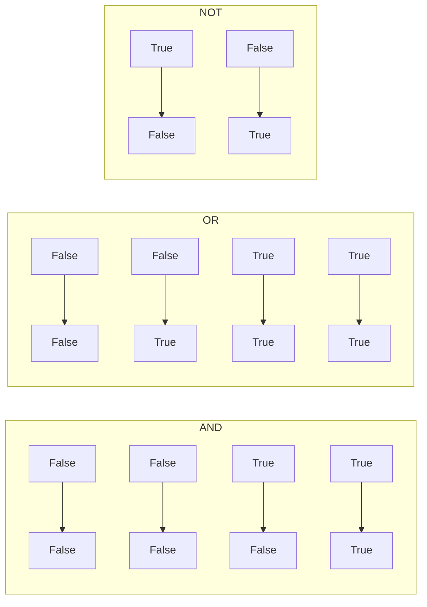
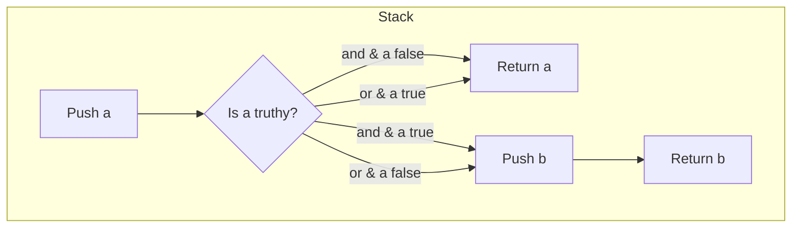

# 📘 Logical Problems in Python: Mastering Boolean Logic & Puzzle Solving

## 1. Intuitive Introduction

Imagine you’re a detective investigating a crime. You have several clues: *“The butler was in the kitchen OR the gardener was in the study.”*  
*“The lights were on AND the gate was open.”*  
*“It is NOT true that the safe was unlocked.”*  

You combine these clues using logical words – **AND, OR, NOT** – to narrow down suspects. Python does exactly the same with **logical operators** to solve **logical problems**: puzzles, decision systems, validation, and even circuit design.

Logical problems appear everywhere:

- **Student project** – Validate form input: `if email and password and age >= 13: register()`
- **Data science** – Filter data: `df[(df['age'] > 18) & (df['income'] > 50000)]`
- **Web dev** – Access control: `if user.is_authenticated and (user.is_admin or user.has_permission('edit')):`
- **Machine learning** – Combine multiple conditions for rule‑based models.

This chapter teaches you to think like a **logic engine** – simplifying complex conditions, avoiding common pitfalls, and solving classic puzzles efficiently.

## 2. Real‑World Analogy: The Airport Security Flow

At airport security, your boarding pass is checked. The rule is:

> **You may enter** if (you have a valid boarding pass AND your ID matches) AND (you are NOT on the no‑fly list) AND (your luggage has passed screening OR you have no checked bags).

This is a **logical expression**. The agent evaluates it step by step, short‑circuiting when possible: if your boarding pass is invalid, they don’t even check your ID. Python’s logical operators work the same way – they **short‑circuit** to save work.

## 3. Core Theory

Python provides three logical operators:

| Operator | Meaning | Example | Result |
|----------|---------|---------|--------|
| `and` | True if **both** operands are true | `True and False` → `False` |
| `or`  | True if **at least one** operand is true | `True or False` → `True` |
| `not` | Negation (inverts truth value) | `not True` → `False` |

### Truthiness in Python

Any object can be used in a logical context. Python treats the following as **falsey**:

- `False`, `None`, `0`, `0.0`, `0j`
- Empty sequences/collections: `""`, `[]`, `()`, `{}`, `set()`, `range(0)`

Everything else is **truthy**.

### Short‑circuit evaluation

- `x and y` evaluates `x` first. If `x` is falsey, it returns `x` (without evaluating `y`).
- `x or y` evaluates `x` first. If `x` is truthy, it returns `x` (without evaluating `y`).

This allows safe chaining:

```python
# Safe division – prevents ZeroDivisionError
if denominator != 0 and numerator / denominator > 0.5:
    print("Ratio > 0.5")

# Short‑circuit returns the first truthy value
name = user_input or "Guest"   # if user_input empty, use "Guest"
```

### Precedence (from highest to lowest)

1. `not`
2. `and`
3. `or`

Use parentheses to override: `(a or b) and c` is different from `a or (b and c)`.

```python
# Without parentheses – 'and' binds tighter
result = True or False and False   # True or (False and False) → True or False → True
# With parentheses
result = (True or False) and False # True and False → False
```

## 4. Visual Explanation

### Truth table for `and`, `or`, `not`



But better: a decision flow for short‑circuit evaluation.

```mermaid
flowchart TD
    Start([Evaluate 'A and B']) --> CheckA{Is A truthy?}
    CheckA -- Yes --> EvalB[Evaluate B] --> ReturnB[Return B's truth value]
    CheckA -- No --> ReturnA[Return A (falsey value)]
    
    Start2([Evaluate 'A or B']) --> CheckA2{Is A truthy?}
    CheckA2 -- Yes --> ReturnA2[Return A (truthy value)]
    CheckA2 -- No --> EvalB2[Evaluate B] --> ReturnB2[Return B]
```

## 5. Memory & Internal Working (CPython)

At bytecode level, `and` and `or` are implemented as **conditional jumps**. The interpreter does not treat them as function calls; they are part of the evaluation stack.

For `a and b`:
- Load `a`
- `POP_JUMP_IF_FALSE` to a label (skip `b` if `a` is falsey)
- Load `b`
- Label: continue

For `a or b`:
- Load `a`
- `POP_JUMP_IF_TRUE` to a label (skip `b` if `a` is truthy)
- Load `b`
- Label: continue

`not` is implemented as `UNARY_NOT` opcode.

This explains why short‑circuiting is **free** – the second operand is never even loaded if not needed.

### Memory diagram of logical evaluation



No extra objects are created unless you explicitly store results.

## 6. Creating Logical Expressions (All Forms)

“Creating” logical problems means constructing boolean expressions using operators, comparisons, and functions.

### 6.1 Basic logical combinations

```python
has_id = True
has_ticket = False
age = 20

# Allowed if (has_id and has_ticket) or age >= 18
allowed = (has_id and has_ticket) or age >= 18
print(allowed)  # True (because age >= 18)
```

### 6.2 Chaining comparisons (implicit `and`)

```python
x = 5
if 1 < x < 10:   # same as 1 < x and x < 10
    print("In range")
```

### 6.3 Using `any()` and `all()` for sequences

```python
conditions = [True, False, True]
print(any(conditions))   # True (at least one True)
print(all(conditions))   # False (not all True)
```

### 6.4 Combining with functions

```python
def is_valid(user):
    return user.active and (user.role in ['admin', 'editor']) and not user.banned
```

### 6.5 Boolean algebra with `&`, `|`, `~` (bitwise) – careful!

Bitwise operators work on integers, not booleans. For boolean arrays (NumPy/Pandas), they are used for element‑wise logic, but for pure Python booleans, use `and`/`or`/`not`.

```python
# Correct for booleans
if a and b: ...
# Wrong (works but not idiomatic, and has precedence surprises)
if a & b: ...   # '&' has higher precedence than comparisons!
```

## 7. Core Operations / Methods

Logical operators themselves have no methods, but you often combine them with comparisons and built‑ins.

### Common patterns

| Pattern | Code | Explanation |
|---------|------|-------------|
| **Default value** | `x = user_input or "default"` | If user_input is empty/falsey, use default |
| **Guard clause** | `if not user: return` | Early exit if condition fails |
| **Toggle boolean** | `flag = not flag` | Flip between True/False |
| **XOR (exclusive or)** | `(a and not b) or (not a and b)` | True if exactly one is True |
| **Implication** | `(not a) or b` | If a then b (a → b) |

### Example: XOR function

```python
def xor(a, b):
    return (a and not b) or (not a and b)

# Or using != (works for booleans)
def xor(a, b):
    return a != b

print(xor(True, True))   # False
print(xor(True, False))  # True
```

## 8. Advanced Concepts

### 8.1 De Morgan’s laws for simplifying negatives

- `not (A and B)`  ==  `(not A) or (not B)`
- `not (A or B)`   ==  `(not A) and (not B)`

This is extremely useful for making complex conditions readable.

```python
# Instead of:
if not (user.active and user.verified):
    deny_access()

# Use:
if not user.active or not user.verified:
    deny_access()
```

### 8.2 Using `all()` and `any()` with generator expressions

```python
numbers = [2, 4, 6, 8]
if all(n % 2 == 0 for n in numbers):
    print("All even")   # True

if any(n > 10 for n in numbers):
    print("Some > 10")  # False
```

### 8.3 Three‑way logic with `None` (trinary / three‑valued logic)

SQL uses `NULL`. In Python, you can simulate three‑valued logic using `None`:

```python
def and3(a, b):
    # Returns True, False, or None (unknown)
    if a is False or b is False:
        return False
    if a is None or b is None:
        return None
    return True

print(and3(True, None))   # None
print(and3(False, None))  # False
```

### 8.4 Lazy evaluation with `and`/`or` as control flow

```python
# Instead of if-else, use 'and' + 'or' (old style, not recommended for complex cases)
x = condition and value_if_true or value_if_false   # Danger: fails if value_if_true is falsey

# Modern: use ternary
x = value_if_true if condition else value_if_false
```

But you can still use short‑circuit for safe function calls:

```python
# Only call expensive() if needed
result = cheap() or expensive()   # expensive not called if cheap() is truthy
```

## 9. Mathematical / Special Operations

### 9.1 Boolean algebra identities

| Identity | Name |
|----------|------|
| `A and True` → `A` | Identity (and) |
| `A or False` → `A` | Identity (or) |
| `A and False` → `False` | Domination (and) |
| `A or True` → `True` | Domination (or) |
| `A and A` → `A` | Idempotent |
| `A or A` → `A` | Idempotent |
| `not not A` → `A` | Double negation |
| `A and (B or C)` → `(A and B) or (A and C)` | Distributive |
| `A or (B and C)` → `(A or B) and (A or C)` | Distributive |

These identities help **simplify logical problems** without running code.

### 9.2 Solving logic puzzles with Python

Classic puzzle: *“Alice, Bob, and Charlie are lying or telling the truth. Alice says: 'Bob is lying.' Bob says: 'Charlie is lying.' Charlie says: 'Both Alice and Bob are lying.' Who is telling the truth?”*

We can brute‑force using logical operators.

```python
# Let True = truth teller, False = liar
for A in [True, False]:
    for B in [True, False]:
        for C in [True, False]:
            # Statements
            alice_says = (B == False)   # "Bob is lying"
            bob_says = (C == False)     # "Charlie is lying"
            charlie_says = (A == False and B == False)  # "Both Alice and Bob are lying"
            
            # A truth teller must make a true statement; liar makes false statement
            if (A == alice_says) and (B == bob_says) and (C == charlie_says):
                print(f"Alice: {A}, Bob: {B}, Charlie: {C}")
# Output: Alice: False, Bob: True, Charlie: False
```

## 10. Real Practical Examples

### Example 1: Form validation with complex rules

```python
def validate_signup(username, email, password, age, agree_terms):
    errors = []
    
    # Rule 1: username not empty AND at least 3 chars
    if not (username and len(username) >= 3):
        errors.append("Username must be at least 3 characters")
    
    # Rule 2: email contains '@' AND (ends with .com OR .org)
    if not ('@' in email and (email.endswith('.com') or email.endswith('.org'))):
        errors.append("Email must be valid .com or .org address")
    
    # Rule 3: password length >= 8 AND (has digit OR has special char)
    has_digit = any(c.isdigit() for c in password)
    has_special = any(c in "!@#$%" for c in password)
    if not (len(password) >= 8 and (has_digit or has_special)):
        errors.append("Password must be 8+ chars with digit or special char")
    
    # Rule 4: age >= 13 AND agree_terms
    if not (age >= 13 and agree_terms):
        errors.append("Must be at least 13 and agree to terms")
    
    return (len(errors) == 0, errors)

valid, errs = validate_signup("alice", "alice@example.com", "pass123!", 20, True)
print(valid, errs)  # True []
```

### Example 2: Smart alarm clock (logical conditions)

```python
def should_alarm_ring(day, is_holiday, is_vacation, user_is_sick, morning_meeting):
    # Logic: ring if (weekday AND not holiday AND not vacation) OR (morning_meeting) OR (user_is_sick? No, if sick, turn off alarm)
    # More realistic: Alarm rings on weekdays unless holiday/vacation, but if morning meeting, always ring.
    # If user is sick, do NOT ring regardless.
    
    weekday = day not in ["Saturday", "Sunday"]
    
    ring = (weekday and not is_holiday and not is_vacation) or morning_meeting
    
    # Override: if sick, no alarm
    ring = ring and not user_is_sick
    
    return ring

print(should_alarm_ring("Monday", False, False, False, False))  # True
print(should_alarm_ring("Saturday", False, False, False, False)) # False
print(should_alarm_ring("Monday", True, False, False, False))    # False (holiday)
print(should_alarm_ring("Monday", False, False, True, False))    # False (sick)
print(should_alarm_ring("Monday", False, False, False, True))    # True (meeting)
```

## 11. ML & Data Science Connection

Logical problems appear in **feature engineering, rule‑based models, and query filtering**.

### 11.1 Pandas: Boolean indexing with multiple conditions

```python
import pandas as pd
df = pd.DataFrame({
    'age': [25, 17, 30, 45],
    'income': [50000, 20000, 80000, 120000],
    'member': [True, False, True, True]
})

# Complex filter: age > 18 AND (income > 60000 OR member is True)
filtered = df[(df['age'] > 18) & ((df['income'] > 60000) | (df['member'] == True))]
print(filtered)
#    age  income  member
# 0   25   50000    True
# 2   30   80000    True
# 3   45  120000    True
```

### 11.2 Scikit‑learn: Custom rule‑based classifier using logical conditions

```python
def simple_risk_classifier(age, income, debt, credit_score):
    # Logical rules
    if (age > 60 and debt > 50000) or (credit_score < 600 and income < 40000):
        return "High Risk"
    elif (age < 30 and income > 70000) or (credit_score > 750 and debt < 10000):
        return "Low Risk"
    else:
        return "Medium Risk"
```

### 11.3 NumPy: Vectorised logical operations

```python
import numpy as np
scores = np.array([85, 42, 90, 67, 55])
passed = (scores >= 60) & (scores <= 100)  # element‑wise AND
print(passed)  # [ True False  True  True False]
```

### 11.4 Expert systems / rule engines

Many early AI systems used logical production rules. Python can implement simple ones:

```python
rules = [
    (lambda f: f['temp'] > 30 and f['humidity'] < 40, "Fire risk"),
    (lambda f: f['temp'] < 0 and f['precip'] > 0, "Icy roads"),
    (lambda f: f['wind'] > 50 and f['is_coastal'], "Storm surge warning"),
]

def evaluate(facts):
    for condition, action in rules:
        if condition(facts):
            print(action)
```

## 12. Common Mistakes & Pitfalls

| Mistake | Wrong Code | Why it fails | Correct Way |
|---------|------------|--------------|--------------|
| **Using `&` instead of `and`** | `if a & b:` | `&` is bitwise, has higher precedence; `a & b` may not be boolean | `if a and b:` |
| **Chaining comparisons incorrectly** | `if a == b == c:` | This works for equality but not for `a < b < c`; still, be careful with non‑transitive operators | Fine for equality, but use parentheses if mixing |
| **Negating entire condition without De Morgan** | `if not (a and b):` → intention unclear | Works but often harder to read | `if not a or not b:` |
| **Assuming `or` returns boolean** | `result = a or b` and expecting `True`/`False` | `or` returns the first truthy value, not necessarily a boolean | Use `bool(a or b)` if boolean needed |
| **Short‑circuit side‑effect surprise** | `if check() and update():` where `update()` must run always | `update()` may not run if `check()` is false | Split into separate statements |
| **Using `any()`/`all()` on empty sequence** | `any([])` returns `False`, `all([])` returns `True` | This is by design (vacuously true for `all`). May cause logic bugs | Always consider empty case explicitly |
| **Confusing `is` with logical equality** | `if x is True:` | `is` checks identity, not truthiness; `True` is a singleton but `1 == True` but `1 is True` is `False` | `if x:` or `if x == True` (redundant) |

## 13. Performance Considerations

| Operation | Time Complexity | Notes |
|-----------|----------------|-------|
| `a and b` | O(1) + short‑circuit | No extra cost if first operand determines result |
| `a or b` | O(1) + short‑circuit | Same as `and` |
| `not a` | O(1) | Simple inversion |
| `any(iterable)` | O(n) worst‑case | Stops at first `True` |
| `all(iterable)` | O(n) worst‑case | Stops at first `False` |
| Boolean expression with many terms | O(number of terms evaluated) | Short‑circuit minimises work |

**Optimisation tip:** Place **cheaper** or **more likely to short‑circuit** conditions first.

```python
# Good: cheap check first
if user_exists(user_id) and expensive_query(user_id):
    ...

# Bad: expensive always runs even if user doesn't exist
if expensive_query(user_id) and user_exists(user_id):
    ...
```

## 14. Interview Questions

### Beginner

1. What do the operators `and`, `or`, and `not` do? Give truth tables.
2. Explain short‑circuit evaluation with an example.
3. What values are considered `False` in Python? (List at least 5)
4. Write an expression that returns `True` if `x` is between 10 and 20 (inclusive).
5. What is the difference between `&` and `and`?

### Intermediate

6. Simplify the following expression using De Morgan: `not (a and (b or c))`.
7. Write a function `xor(a, b)` that returns `True` when exactly one of `a` or `b` is `True`. Do it without using `!=`.
8. Given `x = 0`, `y = 5`, `z = 10`, what is the result of `x and y or z`? Why?
9. How does `any([])` behave? Why is `all([])` `True`? Is this useful?
10. Write a condition that checks if a year is a leap year (divisible by 4, but not by 100 unless also by 400) using logical operators.

### Advanced

11. Implement a three‑valued logic system (True, False, Unknown) using `None` as unknown. Define `and3`, `or3`, `not3` with correct truth tables for Kleene logic.
12. Explain how Python’s bytecode implements short‑circuiting. What opcodes are used?
13. Design a small rule‑based inference engine that uses forward chaining with logical operators. Represent rules as strings and evaluate them dynamically.
14. Solve the “knights and knaves” logic puzzle (where knights always tell truth, knaves always lie) for 3 people using brute‑force search with logical expressions.
15. Compare the performance of `all(generator)` vs. manually looping with early `break`. When would you choose one over the other?

## 15. Mini Project Idea

**Project: Propositional Logic Evaluator & Truth Table Generator**

Build a tool that:

- Takes a logical expression as a string (e.g., `"(A and B) or not C"`)
- Parses it (simplify by restricting to variables A, B, C...)
- Generates a truth table for all combinations of boolean inputs.
- Evaluates the expression using Python’s logical operators (but you can use `eval` safely by mapping variables).

**Extensions:**
- Support for `=>` (implication) and `<=>` (equivalence)
- Simplify expressions using boolean algebra identities
- Check if two expressions are logically equivalent.

**Sample code skeleton:**

```python
import itertools

def evaluate(expr, values):
    # Replace variables with their truth values and eval
    for var, val in values.items():
        expr = expr.replace(var, str(val))
    return eval(expr)   # safe because only True/False

def truth_table(expr, variables):
    print(" | ".join(variables) + " | Result")
    print("-" * (len(variables)*4 + 10))
    for combo in itertools.product([True, False], repeat=len(variables)):
        values = dict(zip(variables, combo))
        res = evaluate(expr, values)
        row = " | ".join(str(v) for v in combo) + f" | {res}"
        print(row)

truth_table("(A and B) or not C", ["A", "B", "C"])
```

## 16. Best Practices

1. **Use parentheses** to make precedence explicit, even if not strictly needed. `(a and b) or c` is clearer than `a and b or c`.
2. **Prefer `if x:` over `if x == True:`** and `if not x:` over `if x == False:`.
3. **Exploit short‑circuit** for safe navigation: `if user and user.is_active:` avoids `AttributeError`.
4. **Avoid complex nested logical expressions** – break them into intermediate boolean variables with descriptive names.
5. **Use `any()` and `all()`** instead of manually looping with `or`/`and` when checking a sequence.
6. **Remember De Morgan’s laws** to simplify negative conditions – your future self will thank you.
7. **Never rely on `or`/`and` returning booleans** – they return one of the operands. Convert with `bool()` if needed.

## 17. Summary Table

| Aspect | Details | Industry Use Case |
|--------|---------|-------------------|
| **Operators** | `and`, `or`, `not` (short‑circuit) | Conditional filtering, validation, access control |
| **Truthiness** | `False`, `None`, `0`, `""`, `[]`, `{}` are falsey | Default values, early exits |
| **Performance** | O(1) per operation, short‑circuit reduces work | Real‑time decision systems |
| **Key patterns** | De Morgan, guard clauses, XOR, implication | Puzzle solving, rule engines |
| **Vectorised logic** | NumPy/Pandas use `&`, `\|`, `~` for element‑wise | Data filtering, feature engineering |
| **Common pitfalls** | Bitwise vs logical, precedence, side‑effects | Code review failures |

## 18. Key Takeaways

- ✅ Logical operators `and`, `or`, `not` are the foundation of **branching** and **decision making** in Python.
- ✅ Short‑circuit evaluation saves time and prevents errors – use it for safe chaining.
- ✅ Truthiness means any object can be treated as boolean; remember the falsey values.
- ✅ De Morgan’s laws are your best friend for simplifying negated conditions.
- ✅ Use `any()` and `all()` for sequences – they short‑circuit and are more readable than manual loops.
- ✅ Avoid bitwise operators (`&`, `|`) for booleans – they have different precedence and semantics.
- ✅ Break complex logical expressions into named intermediate variables for clarity.
- ✅ Logical problems (puzzles, rule engines) can be solved elegantly by brute‑forcing all combinations with `itertools.product`.