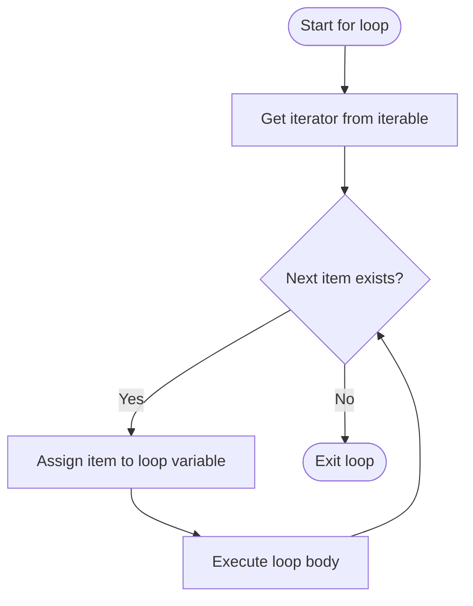

# 📘 Python For Loop: Mastering Iteration

## 1. Intuitive Introduction

Imagine you have a list of 100 customer emails, and you need to send a personalised greeting to each. Doing it manually would take hours. Instead, you write a simple instruction: *“For each email in the list, send a greeting.”* That’s exactly what a **`for` loop** does – it repeats an action for every item in a collection.

The `for` loop is Python’s primary tool for **iteration** – processing sequences, performing repetitive tasks, and implementing algorithms that need to examine or transform data element by element. Real‑world uses:

- **Student project** – Calculate the average of exam scores stored in a list.
- **Data science** – Iterate over rows of a DataFrame to clean or transform values.
- **Web development** – Loop through database query results to render HTML rows.
- **Machine Learning** – Train a model for multiple epochs: `for epoch in range(num_epochs):`.

Python’s `for` loop is **higher‑level** than C‑style loops: it works directly with iterable objects (lists, strings, dictionaries, files, generators) and hides the complexity of index management.

## 2. Real‑World Analogy: The Conveyor Belt

Picture a factory conveyor belt carrying boxes. You stand at the end and inspect each box as it arrives. You don’t need to know how many boxes there are or their exact positions – you just handle **one box at a time**, and the belt automatically brings the next. When the belt is empty, you stop.

- **Conveyor belt** = iterable (e.g., list, range, file)
- **Each box** = current item
- **You** = loop body

This is a perfect mental model: the loop “pulls” each item from the iterable, does something with it, then moves to the next until none remain.

## 3. Core Theory

A `for` loop iterates over any **iterable** – an object that can return its elements one at a time (e.g., list, tuple, string, dictionary, set, file, generator).

### Syntax

```python
for variable in iterable:
    # loop body – executes once for each item
    # variable takes the value of the current item
```

After the loop finishes, `variable` retains the value of the last item (unless the iterable was empty, in which case it remains unchanged from before the loop).

### Important properties

| Property | Explanation | Example |
|----------|-------------|---------|
| **Works with any iterable** | Lists, tuples, strings, dicts, sets, files, generators, etc. | `for ch in "hello":` iterates characters |
| **No explicit index needed** | Python automatically extracts each element | `for val in [1,2,3]:` gives `1,2,3` |
| **Can be combined with `enumerate()`** | To get both index and value | `for i, val in enumerate(data):` |
| **Can be combined with `zip()`** | Iterate over multiple iterables in parallel | `for a,b in zip(list1, list2):` |
| **Can use `break`, `continue`, `else`** | Control loop execution | `else` runs only if loop completes without `break` |
| **Modifying iterable while iterating** | Dangerous – can skip items or raise errors | Use `list.copy()` or iterate over a slice |

### Basic examples

```python
# Iterate over a list
fruits = ["apple", "banana", "cherry"]
for fruit in fruits:
    print(f"I like {fruit}")

# Output:
# I like apple
# I like banana
# I like cherry

# Iterate over a string
for char in "Python":
    print(char, end="-")   # P-y-t-h-o-n-

# Iterate over a dictionary (keys by default)
person = {"name": "Alice", "age": 30}
for key in person:
    print(f"{key}: {person[key]}")
```

## 4. Visual Explanation



Each iteration grabs the next item from the iterator. The loop automatically stops when `StopIteration` is raised.

## 5. Memory & Internal Working (CPython)

When you write `for item in iterable:`, Python:

1. Calls `iter(iterable)` to obtain an **iterator object**.
2. Repeatedly calls `next(iterator)` on that object.
3. When `next()` raises `StopIteration`, the loop terminates.

The iterator holds only a **reference** to the original iterable and a **state** (e.g., current index for lists). No copy of the data is made. This makes loops memory‑efficient even for huge iterables.

### Memory diagram for iterating a list

```mermaid
graph LR
    A[list: [10,20,30]] --> B[iterator object]
    B --> C[state: index=0]
    B --> D[__next__ method]
    D --> E[returns 10, advances index]
    D --> F[returns 20]
    D --> G[returns 30]
    D --> H[raises StopIteration]
```

For a `range()` object, no list is created – the iterator computes values on the fly using arithmetic.

## 6. Creating For Loops (All Forms)

“Creating” here means all the ways you can write a `for` loop – with different iterables and control statements.

### 6.1 Basic loop over a list

```python
colors = ["red", "green", "blue"]
for c in colors:
    print(c)
```

### 6.2 Loop over a range of numbers

```python
# range(stop): 0 to stop-1
for i in range(5):
    print(i)   # 0,1,2,3,4

# range(start, stop, step)
for i in range(2, 10, 2):
    print(i)   # 2,4,6,8
```

### 6.3 Loop with `enumerate()` – get index and value

```python
items = ["apple", "banana", "cherry"]
for idx, item in enumerate(items):
    print(f"{idx}: {item}")
# 0: apple
# 1: banana
# 2: cherry

# Start index from 1
for idx, item in enumerate(items, start=1):
    print(f"{idx}: {item}")
```

### 6.4 Loop over multiple iterables with `zip()`

```python
names = ["Alice", "Bob"]
ages = [25, 30]
for name, age in zip(names, ages):
    print(f"{name} is {age} years old")
```

### 6.5 Loop over dictionary keys, values, or items

```python
d = {"x": 1, "y": 2}
for key in d:           # keys
    print(key)
for value in d.values(): # values
    print(value)
for k, v in d.items():   # key‑value pairs
    print(k, v)
```

### 6.6 Loop with `break`, `continue`, `else`

```python
# break – exit loop early
for i in range(10):
    if i == 5:
        break
    print(i)   # 0,1,2,3,4

# continue – skip to next iteration
for i in range(5):
    if i == 2:
        continue
    print(i)   # 0,1,3,4

# else – runs only if no break occurred
for i in range(3):
    print(i)
else:
    print("Loop completed without break")   # runs
```

### 6.7 Nested for loops

```python
for i in range(3):
    for j in range(2):
        print(f"({i},{j})", end=" ")
    print()
# (0,0) (0,1)
# (1,0) (1,1)
# (2,0) (2,1)
```

### 6.8 Iterating over files

```python
with open("data.txt") as f:
    for line in f:            # iterates line by line
        print(line.strip())
```

## 7. Core Operations / Methods

The `for` loop itself has no methods, but it works closely with iterable methods and built‑ins.

### Important built‑ins used with loops

| Function | Purpose | Example |
|----------|---------|---------|
| `enumerate(iterable, start=0)` | Yield (index, value) pairs | `for i,val in enumerate(lst):` |
| `zip(*iterables)` | Aggregate elements from multiple iterables | `for a,b in zip(x,y):` |
| `range(start, stop, step)` | Generate arithmetic sequence | `for i in range(10):` |
| `reversed(sequence)` | Iterate backwards | `for x in reversed(lst):` |
| `sorted(iterable)` | Iterate in sorted order | `for x in sorted(set):` |
| `iter(iterable)` | Get iterator | rarely needed directly |

### Example: combining `zip` and `enumerate`

```python
names = ["Alice", "Bob", "Charlie"]
scores = [85, 92, 78]
for i, (name, score) in enumerate(zip(names, scores), 1):
    print(f"{i}. {name}: {score}")
# 1. Alice: 85
# 2. Bob: 92
# 3. Charlie: 78
```

## 8. Advanced Concepts

### 8.1 The `else` clause in loops (often misunderstood)

The `else` block after a loop executes **only if** the loop was not terminated by `break`. Great for search‑without‑found patterns.

```python
def find_item(lst, target):
    for item in lst:
        if item == target:
            print("Found!")
            break
    else:
        print("Not found")   # runs only if break never executed

find_item([1,2,3], 2)   # Found!
find_item([1,2,3], 5)   # Not found
```

### 8.2 Modifying a list while iterating – pitfalls

```python
# Dangerous – skipping elements
lst = [1,2,3,4]
for i in lst:
    if i % 2 == 0:
        lst.remove(i)
print(lst)   # [1,3]? Actually [1,3] works here, but more complex cases fail

# Safe ways:
# 1. Iterate over a copy
for i in lst[:]:
    if i % 2 == 0:
        lst.remove(i)

# 2. Use list comprehension
lst = [i for i in lst if i % 2 != 0]
```

### 8.3 For loop with custom iterators (generators)

```python
def fibonacci(limit):
    a, b = 0, 1
    while a < limit:
        yield a
        a, b = b, a + b

for num in fibonacci(100):
    print(num)   # 0,1,1,2,3,5,8,13,21,34,55,89
```

### 8.4 Loop over multiple iterables of different lengths with `zip_longest`

```python
from itertools import zip_longest
a = [1,2,3]
b = ['x','y']
for x,y in zip_longest(a, b, fillvalue=0):
    print(x,y)
# 1 x
# 2 y
# 3 0
```

### 8.5 Performance tip: avoid repeated attribute lookups

```python
# Slow
for i in range(len(my_list)):
    print(my_list[i])   # my_list looked up each time

# Fast
for item in my_list:
    print(item)

# Even faster for numeric loops: local variable alias
lst = my_list
for item in lst:
    print(item)
```

## 9. Mathematical / Special Operations

### 9.1 Summation and product

```python
# Sum of squares
numbers = [1,2,3,4]
sum_sq = 0
for n in numbers:
    sum_sq += n**2
print(sum_sq)   # 30

# Or use built‑in sum with generator
sum_sq = sum(n**2 for n in numbers)
```

### 9.2 Vector dot product

```python
def dot_product(v1, v2):
    result = 0
    for a, b in zip(v1, v2):
        result += a * b
    return result

print(dot_product([1,2,3], [4,5,6]))   # 1*4 + 2*5 + 3*6 = 32
```

### 9.3 Matrix multiplication (nested loops)

```python
A = [[1,2],[3,4]]
B = [[5,6],[7,8]]
result = [[0,0],[0,0]]
for i in range(len(A)):
    for j in range(len(B[0])):
        for k in range(len(B)):
            result[i][j] += A[i][k] * B[k][j]
print(result)   # [[19,22],[43,50]]
```

## 10. Real Practical Examples

### Example 1: Data cleaning – removing outliers

```python
def clean_outliers(data, threshold=3):
    """Replace values beyond threshold (in std deviations) with mean"""
    mean = sum(data) / len(data)
    variance = sum((x - mean)**2 for x in data) / len(data)
    std = variance ** 0.5
    cleaned = []
    for x in data:
        if abs(x - mean) > threshold * std:
            cleaned.append(mean)   # replace outlier with mean
        else:
            cleaned.append(x)
    return cleaned

raw = [10, 12, 11, 100, 13, 9, 105]
print(clean_outliers(raw))
# Approximately: [10,12,11,~25,13,9,~25] (mean ~22.9)
```

### Example 2: Building a frequency dictionary

```python
def word_frequencies(text):
    freq = {}
    for word in text.lower().split():
        # Remove punctuation
        word = word.strip(".,!?;:\"")
        if word:   # non‑empty
            freq[word] = freq.get(word, 0) + 1
    return freq

sample = "To be or not to be, that is the question."
print(word_frequencies(sample))
# {'to': 2, 'be': 2, 'or': 1, 'not': 1, 'that': 1, 'is': 1, 'the': 1, 'question': 1}
```

## 11. ML & Data Science Connection

### 11.1 Training loop for a simple linear regression

```python
def train_linear_regression(X, y, lr=0.01, epochs=100):
    w, b = 0.0, 0.0
    n = len(X)
    for epoch in range(epochs):
        total_loss = 0
        dw, db = 0.0, 0.0
        for xi, yi in zip(X, y):
            pred = w * xi + b
            error = pred - yi
            dw += error * xi
            db += error
            total_loss += error ** 2
        w -= lr * dw / n
        b -= lr * db / n
        if epoch % 10 == 0:
            print(f"Epoch {epoch}, loss: {total_loss/n:.4f}")
    return w, b

X = [1,2,3,4]
y = [2,4,6,8]
w, b = train_linear_regression(X, y)
print(f"Trained: w={w:.2f}, b={b:.2f}")   # w≈2, b≈0
```

### 11.2 Pandas: iterating over rows (slow – avoid for large DataFrames)

```python
import pandas as pd
df = pd.DataFrame({"A": [1,2,3], "B": [4,5,6]})

# Bad for large data (use vectorised operations)
for idx, row in df.iterrows():
    print(f"Row {idx}: A={row['A']}, B={row['B']}")

# Good – vectorised
df['C'] = df['A'] + df['B']   # no loop
```

### 11.3 NumPy: vectorised operations are loops in C, not Python

```python
import numpy as np
arr = np.array([1,2,3,4])
# Python loop – slow
squares = []
for x in arr:
    squares.append(x**2)
# NumPy vectorised – fast (C loop)
squares = arr ** 2
```

### 11.4 Mini batch loop for deep learning

```python
def train_epoch(model, dataloader, optimizer):
    total_loss = 0
    for batch_x, batch_y in dataloader:   # dataloader is iterable
        optimizer.zero_grad()
        pred = model(batch_x)
        loss = loss_fn(pred, batch_y)
        loss.backward()
        optimizer.step()
        total_loss += loss.item()
    return total_loss / len(dataloader)
```

## 12. Common Mistakes & Pitfalls

| Mistake | Wrong Code | Why it fails | Correct Way |
|---------|------------|--------------|--------------|
| **Modifying list while iterating** | `for x in lst: if x<0: lst.remove(x)` | Skips elements after removal; may raise `RuntimeError` for dicts | Iterate over copy: `for x in lst[:]:` |
| **Forgetting to convert `range` to list** | `for i in range(5):` is fine; but `for i in range(5): lst[i]` works. Misunderstanding: `range` is not a list | Not a mistake; confusion arises with indexing | `list(range(5))` if you need a list |
| **Using `else` incorrectly thinking it always runs** | Expecting `else` after `break` to run | `else` runs **only** if no `break` | Use a flag variable if you need “did we break?” |
| **Loop variable leaking** | `for i in range(3): pass; print(i)` | `i` is accessible after loop (holds 2) | Don’t rely on it; use a separate variable if needed |
| **Inefficient repeated attribute lookup** | `for i in range(len(obj.data)): x = obj.data[i]` | `obj.data` looked up each iteration | `data = obj.data; for x in data:` |
| **Using `enumerate` without unpacking** | `for item in enumerate(lst): print(item)` | Prints tuple `(index, value)` | `for i, val in enumerate(lst):` |

## 13. Performance Considerations

| Operation | Time Complexity | Notes |
|-----------|----------------|-------|
| `for item in lst:` | O(n) | Fast, direct iteration |
| `for i in range(n): x = lst[i]` | O(n) | Slightly slower due to indexing overhead |
| `for i, item in enumerate(lst):` | O(n) | Minimal overhead over plain iteration |
| `for a,b in zip(lst1, lst2):` | O(min(len1, len2)) | Creates iterator tuples |
| `for key in dict:` | O(n) | Iterates over keys |
| Nested loops (2 levels) | O(n*m) | Can become expensive; consider vectorisation |
| `for line in file:` | O(number of lines) | Buffered, memory‑efficient |

**Micro‑optimisations:**  
- Use local variable aliases inside loops for repeated global lookups.
- Avoid function calls inside the loop body if possible.
- Use list comprehensions or generator expressions for simple transformations – they run at C speed.

## 14. Interview Questions

### Beginner

1. Write a `for` loop that prints each character of a string on a new line.
2. What does `range(10)` produce? How do you use it in a loop?
3. Explain the difference between `break` and `continue`.
4. How do you loop over both the index and the value of a list?
5. What is the purpose of the `else` clause on a `for` loop?

### Intermediate

6. Given two lists of equal length, use a single `for` loop to create a new list of pairwise sums.
7. Why does modifying a dictionary while iterating over it raise a `RuntimeError`? How would you safely remove keys?
8. Write a loop that finds the first even number in a list and prints its index; if none, print `"No even numbers"` using `else`.
9. Compare performance of `for i in range(len(lst)): x = lst[i]` vs `for x in lst:`. Why one is preferred?
10. How does `zip()` handle iterables of different lengths? What is `itertools.zip_longest()`?

### Advanced

11. Explain the iterator protocol. Write a custom iterable class that yields squares of numbers up to `n`.
12. How does CPython internally convert a `for` loop into bytecode? What opcodes are involved (`GET_ITER`, `FOR_ITER`)?
13. Implement a generator function that lazily reads a large CSV file and yields rows without loading the whole file into memory.
14. What is the overhead of using `enumerate()` compared to manually incrementing an index? Show a microbenchmark.
15. Design a loop that processes a list and removes duplicates **while** iterating, using only one pass and O(1) extra space (except for a set of seen elements). Discuss why this is safe.

## 15. Mini Project Idea

**Project: Text‑based Adventure Game Engine**

Build a simple game where the player moves through rooms. Use a `for` loop to process a series of commands from a script (or user input) without needing recursion.

**Features:**
- Rooms stored as dictionaries: `{"name": "Hall", "description": "You are in a dark hall.", "exits": {"north": "kitchen"}}`
- Game loop: `for command in command_list:` (or while True with `for` after parsing)
- Process commands like `"go north"`, `"look"`, `"take key"`, `"inventory"`
- Use `for` to iterate over room items when player uses `"look"`

**Sample skeleton:**

```python
rooms = {
    "hall": {"desc": "Dark hall", "items": ["torch"]},
    "kitchen": {"desc": "Bright kitchen", "items": ["knife"]}
}
player_inventory = []
current_room = "hall"

commands = ["look", "go kitchen", "look", "take knife"]

for cmd in commands:
    if cmd == "look":
        print(rooms[current_room]["desc"])
        for item in rooms[current_room]["items"]:
            print(f"You see a {item}.")
    elif cmd.startswith("go "):
        target = cmd.split()[1]
        # check if target in exits (simplified)
        if target in rooms:
            current_room = target
            print(f"Moving to {target}...")
    elif cmd.startswith("take "):
        item = cmd.split()[1]
        if item in rooms[current_room]["items"]:
            rooms[current_room]["items"].remove(item)
            player_inventory.append(item)
            print(f"Taken {item}.")
```

## 16. Best Practices

1. **Prefer direct iteration** over indexing – `for item in list` is clearer and faster.
2. **Use `enumerate()`** when you need both index and value – never manually increment a counter.
3. **Use `zip()`** to iterate over multiple iterables in parallel.
4. **Avoid modifying the iterable** while looping – make a copy or collect changes for after the loop.
5. **Keep loop bodies short** – if a loop body exceeds 10‑15 lines, extract it into a function.
6. **Use `break` and `continue` sparingly** – too many make loops harder to follow. Consider refactoring.
7. **Leverage list comprehensions** for simple transformations – they are often faster and more readable.
8. **Be mindful of `else` on loops** – many developers are confused by it; use it only when the meaning is obvious (like search‑without‑found).

## 17. Summary Table

| Aspect | Details | Industry Use Case |
|--------|---------|-------------------|
| **Purpose** | Iterate over any iterable | Processing sequences, data pipelines, training loops |
| **Key built‑ins** | `range`, `enumerate`, `zip`, `reversed`, `sorted` | Parallel iteration, indexing |
| **Performance** | O(n) per loop; avoid nested O(n²) for large data | Batch processing, simulation |
| **Alternatives** | While loop, recursion, list comprehensions, `map` | Functional style, vectorisation |
| **Common pitfall** | Modifying list while iterating | Leads to skipped elements or exceptions |
| **Memory** | Iterators use O(1) extra memory | Streaming data, file processing |

## 18. Key Takeaways

- ✅ A `for` loop iterates over any **iterable** – list, string, dict, file, range, generator.
- ✅ No explicit index needed – Python handles the iterator protocol automatically.
- ✅ Use `enumerate()` to get both index and value; `zip()` for parallel iteration.
- ✅ `break` exits the loop, `continue` skips to the next iteration, `else` runs only if no `break` occurred.
- ✅ Never modify a list (or dict) while iterating over it directly – iterate over a copy instead.
- ✅ `range()` is memory‑efficient – it doesn’t create a list of all numbers.
- ✅ For performance, prefer direct iteration over indexing, and use local variable aliases.
- ✅ In data science, prefer vectorised operations (NumPy, Pandas) over explicit `for` loops in Python – they run C‑speed.