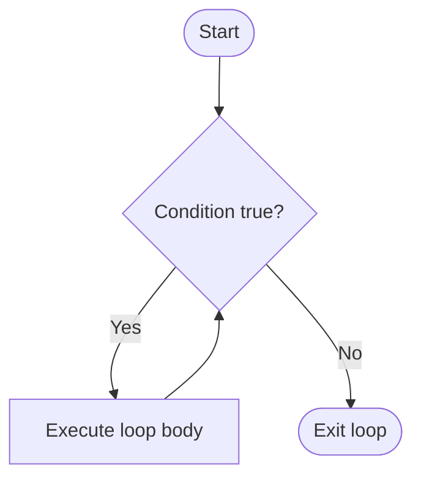
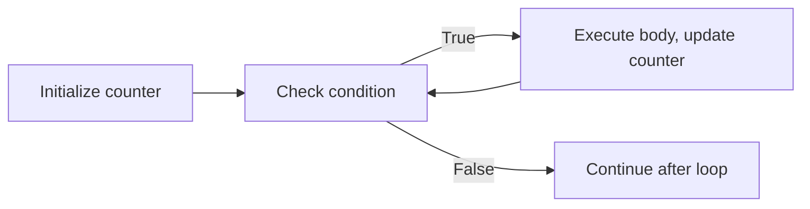

# 📘 Python While Loop: Mastering Indefinite Iteration

## 1. Intuitive Introduction

Imagine you’re filling a bathtub. You turn on the tap and **keep checking** the water level. *While* the water is below the desired level, you let it run. Once it reaches the mark, you stop. You don’t know in advance how long this will take – it depends on water pressure, drain, etc. That’s a **`while` loop**: repeat an action **as long as** a condition remains true.

Unlike a `for` loop that runs a fixed number of times (e.g., once per item in a list), a `while` loop runs **indefinitely** until a condition becomes false. It’s perfect for:

- **Student project** – Keep asking for a valid password until the user gets it right.
- **Data science** – Iteratively improve a model until convergence (loss < threshold).
- **Web development** – Poll a server until a job completes.
- **Game development** – Run the main game loop while the player hasn’t quit.

The `while` loop gives you **flexible control** – you decide when to stop based on dynamic conditions, not just sequence length.

## 2. Real‑World Analogy: The Coffee Machine

You’re at a self‑service coffee machine. The instruction says: *“While the cup is not full, keep dispensing coffee.”* You don’t know exactly how many seconds it will take – it depends on cup size, flow rate, foam, etc. You simply check the condition **before each pour** (pre‑test loop). If the cup is already full, you never dispense at all.

- **Condition** = “cup is not full”
- **Action** = dispense coffee for 0.5 seconds
- **Termination** = when cup becomes full

This captures the essence of `while` – repeat an action zero or more times, re‑evaluating the condition each time.

## 3. Core Theory

A `while` loop repeatedly executes a block of code **as long as** a boolean condition is `True`. The condition is checked **before** each iteration (pre‑test loop). If the condition is initially `False`, the loop body never executes.

### Syntax

```python
while condition:
    # loop body – runs while condition is True
    # typically modify something that affects condition
```

### Important properties

| Property | Explanation | Example |
|----------|-------------|---------|
| **Indefinite iteration** | Number of iterations not fixed in advance | `while temperature > 0:` |
| **Pre‑test** | Condition evaluated before each iteration | Body may execute 0 times |
| **Risk of infinite loop** | If condition never becomes `False`, loop runs forever | Don’t forget to update loop variable |
| **Can use `break`, `continue`, `else`** | Same as `for` loop | `else` runs if loop ends without `break` |
| **Condition can be any expression** | Anything truthy/falsy; often comparison or function call | `while processing_data():` |
| **Can be nested** | `while` inside `while`, or inside `for`, etc. | Game loops, simulation |

### Basic examples

```python
# Count from 1 to 5
i = 1
while i <= 5:
    print(i)
    i += 1   # crucial: update variable
# Output: 1 2 3 4 5

# Sum numbers until user enters 0
total = 0
num = int(input("Enter a number (0 to stop): "))
while num != 0:
    total += num
    num = int(input("Enter a number (0 to stop): "))
print(f"Sum: {total}")
```

## 4. Visual Explanation



If the condition is `False` at the start, the diamond points directly to `End` – body never runs.

## 5. Memory & Internal Working (CPython)

The `while` loop is a **control flow** construct, not a data structure. At bytecode level:

1. The condition is evaluated and pushed onto the stack.
2. `POP_JUMP_IF_FALSE` jumps to the end of the loop if condition is false.
3. The loop body executes.
4. An unconditional `JUMP_ABSOLUTE` jumps back to the condition evaluation.
5. Repeat.

No extra memory is allocated for the loop itself. However, variables used in the condition (like counters) live in the usual namespace.

### Memory diagram of iteration



The loop doesn’t create a new scope; variables inside the loop are in the same scope as outside.

## 6. Creating While Loops (All Forms)

“Creating” here means all syntactic variations and common patterns.

### 6.1 Basic counter loop

```python
i = 0
while i < 5:
    print(i)
    i += 1
```

### 6.2 Loop with `break`

```python
# Search for first even number in a list (without for)
numbers = [3, 7, 8, 12, 5]
i = 0
while i < len(numbers):
    if numbers[i] % 2 == 0:
        print(f"First even is {numbers[i]}")
        break
    i += 1
```

### 6.3 Loop with `continue`

```python
# Print odd numbers only, using continue
i = 0
while i < 10:
    i += 1
    if i % 2 == 0:
        continue
    print(i)   # 1,3,5,7,9
```

### 6.4 Loop with `else`

```python
# Search for a number in a list; if not found, report
numbers = [1, 3, 5, 7]
target = 4
i = 0
while i < len(numbers):
    if numbers[i] == target:
        print("Found!")
        break
    i += 1
else:
    print("Not found")   # runs because break never executed
```

### 6.5 Infinite loop with conditional `break`

```python
while True:
    user_input = input("Type 'quit' to exit: ")
    if user_input == "quit":
        break
    print(f"You typed: {user_input}")
```

### 6.6 Nested `while` loops

```python
# Multiplication table (1 to 3)
i = 1
while i <= 3:
    j = 1
    while j <= 3:
        print(f"{i}×{j}={i*j}", end="  ")
        j += 1
    print()   # newline
    i += 1
# Output:
# 1×1=1  1×2=2  1×3=3
# 2×1=2  2×2=4  2×3=6
# 3×1=3  3×2=6  3×3=9
```

### 6.7 `while` with complex condition

```python
import random
attempts = 0
target = random.randint(1, 100)
guess = None
while guess != target and attempts < 10:
    guess = int(input("Guess: "))
    attempts += 1
    if guess < target:
        print("Too low")
    elif guess > target:
        print("Too high")
if guess == target:
    print(f"Correct in {attempts} tries")
else:
    print("Out of attempts")
```

### 6.8 `while` with sentinel value

```python
data = []
value = input("Enter value (or 'done' to finish): ")
while value != 'done':
    data.append(value)
    value = input("Enter value (or 'done' to finish): ")
print(f"Collected: {data}")
```

## 7. Core Operations / Methods

While loop has no methods, but common patterns use built‑ins.

### 7.1 Using `iter()` with sentinel

Advanced: `iter(callable, sentinel)` creates an iterator that calls a function until it returns sentinel.

```python
# Instead of while loop with input, you can do:
for value in iter(lambda: input("Enter (or 'quit'): "), 'quit'):
    print(f"Got {value}")
# But this is less readable; while is clearer.
```

### 7.2 Emulating `do-while` (post‑test loop)

Python has no built‑in `do-while` (execute at least once). Emulate with `while True` + `break`.

```python
# Do-while: execute body at least once, then check condition
while True:
    # loop body (runs at least once)
    user_input = input("Enter a number: ")
    if user_input.isdigit():
        number = int(user_input)
        break
    print("Invalid, try again.")
# After break, continue...
```

## 8. Advanced Concepts

### 8.1 `while` with complex state machine

```python
state = "start"
while state != "exit":
    if state == "start":
        print("Starting...")
        state = "running"
    elif state == "running":
        action = input("Command (stop/exit): ")
        if action == "stop":
            state = "stopped"
        elif action == "exit":
            state = "exit"
    elif state == "stopped":
        print("Stopped. Type 'run' to restart or 'exit' to quit.")
        cmd = input()
        if cmd == "run":
            state = "running"
        elif cmd == "exit":
            state = "exit"
```

### 8.2 Using `while` for numerical algorithms (Newton‑Raphson)

```python
def sqrt_newton(x, tolerance=1e-6):
    guess = x / 2
    while abs(guess * guess - x) > tolerance:
        guess = (guess + x / guess) / 2
    return guess

print(sqrt_newton(25))   # ~5.0
```

### 8.3 Loop over a changing list (pop until empty)

```python
stack = [1,2,3,4]
while stack:
    item = stack.pop()
    print(f"Processing {item}")
# Output: 4,3,2,1 (LIFO order)
```

### 8.4 `while` with recursion alternative

Sometimes a while loop is more efficient than recursion for depth‑first search (avoids stack overflow).

```python
def factorial_iterative(n):
    result = 1
    while n > 1:
        result *= n
        n -= 1
    return result
```

### 8.5 Performance: minimise work inside condition

Avoid expensive function calls in the condition if they don’t change each iteration.

```python
# Bad – len() called each iteration (though O(1), still overhead)
i = 0
while i < len(big_list):
    # ...
    i += 1

# Better – store length once
n = len(big_list)
i = 0
while i < n:
    # ...
    i += 1
```

## 9. Mathematical / Special Operations

### 9.1 Euclid’s algorithm (GCD)

```python
def gcd(a, b):
    while b != 0:
        a, b = b, a % b
    return a

print(gcd(48, 18))   # 6
```

### 9.2 Sum of digits until single digit (digital root)

```python
def digital_root(n):
    while n >= 10:
        n = sum(int(d) for d in str(n))
    return n

print(digital_root(9875))   # 9+8+7+5=29 → 2+9=11 → 1+1=2
```

### 9.3 Collatz conjecture simulation

```python
def collatz(n):
    steps = 0
    while n != 1:
        if n % 2 == 0:
            n //= 2
        else:
            n = 3 * n + 1
        steps += 1
    return steps

print(collatz(27))   # 111 steps to reach 1
```

## 10. Real Practical Examples

### Example 1: Retry mechanism with backoff

```python
import time
import random

def fetch_data_with_retry(url, max_retries=5):
    attempt = 0
    while attempt < max_retries:
        try:
            # Simulate network request
            if random.random() < 0.7:   # 70% failure
                raise ConnectionError("Network error")
            return {"data": "success"}
        except ConnectionError as e:
            attempt += 1
            wait = 2 ** attempt   # exponential backoff: 2,4,8,16,32 sec
            print(f"Attempt {attempt} failed. Retrying in {wait}s...")
            time.sleep(wait)
    raise Exception(f"Failed after {max_retries} attempts")

# Uncomment to test (would sleep): data = fetch_data_with_retry("api")
```

### Example 2: Interactive menu system

```python
def main_menu():
    while True:
        print("\n1. Add task")
        print("2. View tasks")
        print("3. Delete task")
        print("4. Exit")
        choice = input("Choose: ")
        if choice == "1":
            task = input("Task: ")
            # add to list
        elif choice == "2":
            # view tasks
            pass
        elif choice == "3":
            # delete
            pass
        elif choice == "4":
            print("Goodbye!")
            break
        else:
            print("Invalid choice")

main_menu()
```

## 11. ML & Data Science Connection

### 11.1 Gradient descent loop

```python
def gradient_descent(f_prime, init_x, lr=0.01, tolerance=1e-6, max_iter=1000):
    x = init_x
    iter_count = 0
    while abs(f_prime(x)) > tolerance and iter_count < max_iter:
        x = x - lr * f_prime(x)
        iter_count += 1
    return x

# Minimize f(x)=x^2 (derivative 2x)
minimum = gradient_descent(lambda x: 2*x, init_x=10)
print(minimum)   # ~0.0
```

### 11.2 Early stopping in training

```python
def train_model(data, model, max_epochs=100, patience=5):
    best_loss = float('inf')
    patience_counter = 0
    epoch = 0
    while epoch < max_epochs:
        loss = train_one_epoch(data, model)   # hypothetical
        epoch += 1
        if loss < best_loss:
            best_loss = loss
            patience_counter = 0
        else:
            patience_counter += 1
        if patience_counter >= patience:
            print(f"Early stopping at epoch {epoch}")
            break
    return model
```

### 11.3 Processing streaming data (sensor readings)

```python
def monitor_sensor(get_reading, threshold=100):
    while True:
        value = get_reading()
        if value > threshold:
            print(f"Alert! Value {value} exceeds threshold")
            break   # stop after first alert
        # otherwise continue
    # outside loop: send notification
```

### 11.4 Web scraping pagination

```python
def scrape_all_pages(base_url):
    page = 1
    results = []
    while True:
        url = f"{base_url}?page={page}"
        response = fetch(url)   # hypothetical
        if not response.has_data:
            break
        results.extend(response.data)
        page += 1
    return results
```

## 12. Common Mistakes & Pitfalls

| Mistake | Wrong Code | Why it fails | Correct Way |
|---------|------------|--------------|--------------|
| **Infinite loop (forgetting update)** | `i = 0; while i < 5: print(i)` | `i` never changes → condition always true | `i += 1` inside loop |
| **Off‑by‑one due to pre‑increment** | `i = 0; while i <= 5: print(i); i += 1` | Prints 0..5 (6 numbers), often intended 0..4 | Use `<` not `<=` unless you want inclusive upper bound |
| **Using `=` instead of `==` in condition** | `while x = 5:` | SyntaxError; `=` is assignment | `while x == 5:` |
| **Using `break` inside nested loops without labels** | `while outer: while inner: if cond: break` | Only breaks inner loop | Use a flag variable or refactor into function with `return` |
| **Condition that never becomes false** | `while True: # no break` | Infinite loop | Ensure a termination path |
| **Modifying the loop variable incorrectly** | `i = 1; while i <= 10: i += 2; print(i)` | Prints 3,5,7,9,11 (off) | Understand order of operations |
| **Using `while` where `for` is better** | `i=0; while i<len(lst): process(lst[i]); i+=1` | More verbose and slower | `for x in lst: process(x)` |

## 13. Performance Considerations

| Operation | Time Complexity | Notes |
|-----------|----------------|-------|
| Single iteration body | O(complexity of body) | Same as for loop |
| Condition evaluation | O(1) for simple comparisons | Can be more if condition calls functions |
| Infinite loop (unintended) | O(∞) | Bug, not performance |
| `while` vs `for` on fixed range | `for` slightly faster (C‑level iteration) | Use `for` when number of iterations known |
| `while` with many `break`s | O(k) where k is iterations before break | Acceptable |
| Nested `while` loops | O(n*m) | Same as nested for; consider optimisation |

**Guideline:** Prefer `for` loop when you know exactly how many iterations you need (e.g., over a range or sequence). Use `while` when termination depends on a dynamic condition that may never become false (or unknown number of iterations).

## 14. Interview Questions

### Beginner

1. What is the difference between a `while` loop and a `for` loop?
2. Write a `while` loop that prints the numbers 10 down to 1.
3. What happens if the condition in a `while` loop is initially `False`?
4. How do you create an infinite loop? Why is it dangerous?
5. What is the purpose of the `else` clause on a `while` loop?

### Intermediate

6. Explain how to emulate a `do-while` loop in Python (execute at least once).
7. Write a `while` loop that reads integers from the user until they enter a negative number, then prints the sum of all positive numbers entered.
8. What is a sentinel value? Give an example with `while`.
9. Why does `while i < len(lst): i += 1` behave differently from `for i in range(len(lst)):` if you modify `i` inside the body?
10. Compare the performance of `while` vs `for` for iterating over a list of 1 million elements. Why might one be slightly faster?

### Advanced

11. Describe the bytecode instructions generated for a simple `while i < 10: i += 1`. How does it differ from `for i in range(10):`?
12. Implement a generator function that yields Fibonacci numbers indefinitely. Use a `while True` loop.
13. Write a `while` loop that safely removes all even numbers from a list while iterating over it (without making a copy). Discuss the index management strategy.
14. How would you implement a timeout mechanism for a `while` loop that might run too long (e.g., stop after 30 seconds)?
15. Explain the concept of a “loop invariant” and provide an example using a `while` loop that sums an array.

## 15. Mini Project Idea

**Project: Text‑based Adventure Game with Time‑based Events**

Build a simple game where the player must escape a haunted house. The game uses a `while` loop for the main game loop, with:

- Player health, inventory, room descriptions.
- Random encounters: while exploring, a monster might appear.
- A time limit: the loop also tracks number of moves; after 20 moves, the house collapses (game over).
- Use `break` to exit when player finds the exit, `continue` to skip invalid commands.

```python
import random

health = 100
inventory = []
rooms_visited = 0
exit_found = False

print("You are trapped in a haunted house. Find the exit!")
while health > 0 and not exit_found and rooms_visited < 20:
    print(f"\nHealth: {health} | Moves: {rooms_visited}")
    action = input("Do you want to 'search', 'run', or 'check inventory'? ").lower()
    if action == "search":
        rooms_visited += 1
        if random.random() < 0.3:
            print("A ghost attacks you!")
            health -= 20
        else:
            found = random.choice(["key", "potion", "nothing"])
            if found != "nothing":
                inventory.append(found)
                print(f"You found a {found}!")
            else:
                print("Nothing here.")
        if "key" in inventory and random.random() < 0.5:
            print("You found the exit! You escape!")
            exit_found = True
    elif action == "run":
        print("You run to another room.")
        rooms_visited += 1
    elif action == "check inventory":
        print(f"Inventory: {inventory}")
    else:
        print("Unknown command.")

if health <= 0:
    print("You died... Game over.")
elif exit_found:
    print("Congratulations, you escaped!")
else:
    print("The house collapsed. You're trapped forever.")
```

## 16. Best Practices

1. **Ensure termination** – Every `while` loop must have a way to make the condition `False` or a `break`. Test edge cases (empty input, max iterations).
2. **Use `for` when possible** – If you know the number of iterations or are iterating over a sequence, `for` is clearer and safer.
3. **Avoid busy waiting** – `while True: pass` consumes 100% CPU. Use `time.sleep()` or proper event handling.
4. **Keep condition simple** – Complex conditions are hard to reason about. Compute a boolean variable before the loop if needed.
5. **Be careful with `continue`** – Ensure loop variables are updated before `continue`, or you may create an infinite loop.
6. **Use `while True` + `break` for “loop and a half” patterns** – This is clearer than a flag variable when you need to exit in the middle.
7. **Limit nesting depth** – Deep nested `while` loops are difficult to debug. Refactor into functions.

## 17. Summary Table

| Aspect | Details | Industry Use Case |
|--------|---------|-------------------|
| **Purpose** | Indefinite iteration based on dynamic condition | Retry logic, game loops, real‑time monitoring |
| **Condition check** | Pre‑test (may execute 0 times) | Validation loops, polling |
| **Alternatives** | `for` loop, recursion, `while True` + break | Finite iteration → `for` |
| **Risk** | Infinite loop, forgotten update | Always ensure termination |
| **Performance** | Similar to `for` for same number of iterations | But `for` over `range` is slightly faster |
| **Common pattern** | `while True: ... if cond: break` | Menu systems, data streams |

## 18. Key Takeaways

- ✅ A `while` loop repeats **as long as** a condition is `True` – perfect when the number of iterations is unknown.
- ✅ Condition is checked **before** each iteration; body may never execute.
- ✅ Always ensure the condition eventually becomes `False` – update variables inside the loop.
- ✅ Use `break` to exit early, `continue` to skip to next iteration, `else` to run if no `break`.
- ✅ `while True` with `break` is the idiomatic way to emulate a `do-while` (execute at least once).
- ✅ Avoid infinite loops by double‑checking your update logic and edge cases.
- ✅ Prefer `for` over `while` when iterating over a fixed sequence – it’s more readable and less error‑prone.
- ✅ In data science, `while` loops appear in **iterative algorithms** (gradient descent, convergence checks) and **real‑time pipelines**.
- ✅ For performance, minimise work inside the condition and store invariant values (e.g., length) in local variables.

---