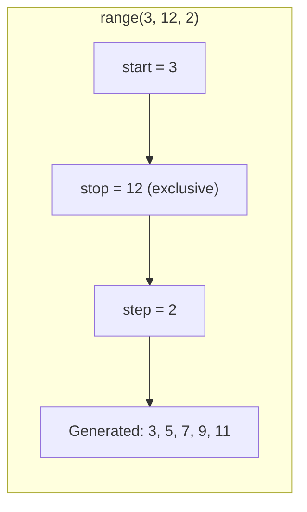
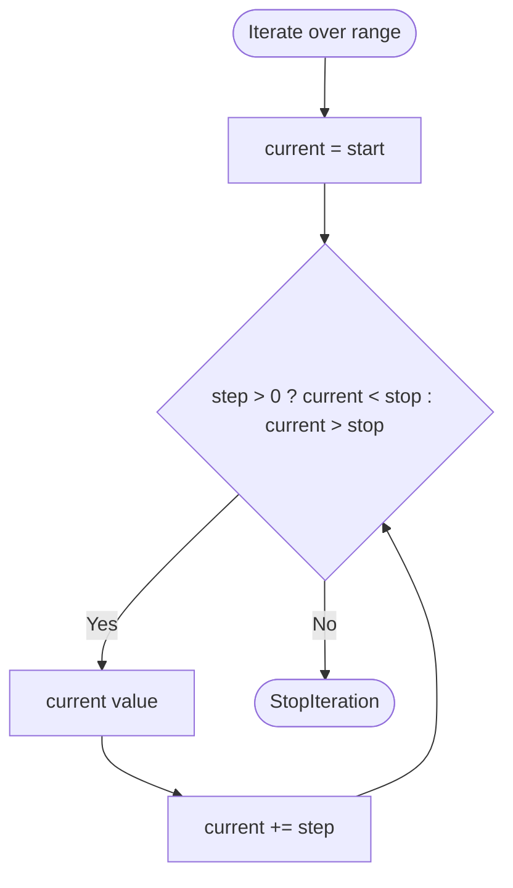
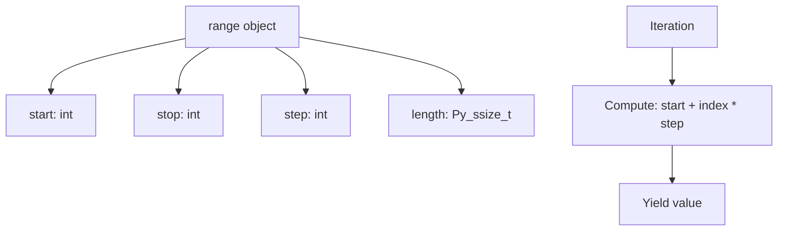

# 📘 Python Range Function: The Ultimate Sequence Generator

## 1. Intuitive Introduction

Imagine you need to number 100 seats in a row. You know the starting seat number, the last seat number, and maybe you want every second seat (odd‑numbered). Instead of writing down every single number manually, you use a simple description: *“Start at 1, go up to 100, step by 1.”* That’s exactly what Python’s `range()` does – it **describes** a sequence of numbers without storing them all in memory.

`range()` is used everywhere in real software:

- **Student project** – Loop exactly 10 times: `for i in range(10):`
- **Data science** – Generate indices for rows or columns: `for idx in range(len(df)):`
- **Web development** – Create pagination numbers: `range(1, total_pages+1)`
- **Machine Learning** – Iterate over epochs: `for epoch in range(num_epochs):`

Unlike a list, `range()` creates a **lazy sequence** – it produces numbers on‑the‑fly only when needed. This makes it memory‑efficient even for billions of numbers.

## 2. Real‑World Analogy: The Musical Metronome

A metronome ticks at a steady beat. You set it to start at 40 beats per minute, end at 208, and step by 2. The metronome doesn’t store all 85 tick times in memory; it just knows the **start**, **stop**, and **step** and produces the next tick when asked. This is exactly how `range()` works – it’s a **description of a numeric sequence**, not the sequence itself.

- **Start** = first number
- **Stop** = end point (exclusive)
- **Step** = increment between numbers

When you iterate over a `range` object, it calculates each number on demand, never storing the whole list.

## 3. Core Theory

`range()` is a built‑in type that represents an immutable sequence of numbers in arithmetic progression. It is **lazy** (values computed as needed) and **memory‑efficient**.

### Syntax

```python
range(stop)                 # 0, 1, 2, ..., stop-1
range(start, stop)          # start, start+1, ..., stop-1
range(start, stop, step)    # start, start+step, ..., last < stop
```

### Important Properties

| Property | Explanation | Example |
|----------|-------------|---------|
| **Lazy evaluation** | Values not stored; generated on iteration | `range(10**9)` uses ~48 bytes, not 8GB |
| **Immutable** | You cannot modify a range object | No item assignment |
| **Supports `len()`, indexing, slicing** | Behaves like a sequence | `r[3]`, `r[1:5]` (returns new range) |
| **Exclusive stop** | `range(5)` gives `0,1,2,3,4` (5 numbers) | `range(0,5)` same as `range(5)` |
| **Step can be negative** | Count downwards | `range(10,0,-2)` → `10,8,6,4,2` |
| **Empty range if start >= stop and step > 0** | No numbers produced | `range(5,2)` → empty |
| **`in` operator is efficient** | O(1) containment check (uses arithmetic) | `5 in range(1000000)` is fast |

### Basic examples

```python
# Basic usage
print(list(range(5)))       # [0, 1, 2, 3, 4]
print(list(range(2, 8)))    # [2, 3, 4, 5, 6, 7]
print(list(range(2, 10, 2))) # [2, 4, 6, 8]

# Negative step
print(list(range(10, 0, -2))) # [10, 8, 6, 4, 2]
print(list(range(0, -5, -1))) # [0, -1, -2, -3, -4]

# Empty range
print(list(range(5, 2)))      # []
```

## 4. Visual Explanation



A flowchart of how `range` generates values during iteration:



The `range` object itself is just a small struct storing `start`, `stop`, `step`, `length` (precomputed).

## 5. Memory & Internal Working (CPython)

Internally, `range` is defined in C (in `Objects/rangeobject.c`). It stores three `PyObject*` fields for `start`, `stop`, `step` (all Python ints) and a computed `length` as a `Py_ssize_t`. This takes about **48 bytes** on a 64‑bit CPython, regardless of the number of elements.

When you index a range (`r[i]`), it computes the value as:

```
value = start + i * step
```

No list is ever created. Slicing a range (e.g., `r[2:5]`) returns a **new range** by adjusting start, stop, and step mathematically – again O(1) memory.

### Memory diagram



This makes `range` ideal for huge sequences – `range(10**12)` uses the same 48 bytes as `range(100)`.

## 6. Creating Range Objects (All Forms)

### 6.1 One argument (stop)

```python
r1 = range(10)          # 0 to 9
print(r1)               # range(0, 10)
```

### 6.2 Two arguments (start, stop)

```python
r2 = range(5, 15)       # 5 to 14
```

### 6.3 Three arguments (start, stop, step)

```python
r3 = range(0, 50, 5)    # 0,5,10,...,45
r4 = range(20, 5, -3)   # 20,17,14,11,8
```

### 6.4 Creating from other ranges (slicing)

```python
r = range(10, 100, 3)
r_slice = r[2:10:2]     # new range: start adjusted
print(list(r_slice))    # [16, 22, 28, 34]
```

### 6.5 Using `range()` with `list()` to materialise

```python
numbers = list(range(5))   # [0,1,2,3,4]
```

### 6.6 Empty range

```python
empty1 = range(0)            # stop = 0
empty2 = range(5, 2)         # start > stop with positive step
empty3 = range(5, 2, 1)      # same
empty4 = range(2, 5, -1)     # start < stop with negative step
print(len(empty1))           # 0
```

### 6.7 Converting other sequences to range? Not directly.

You cannot create a range from a list unless you know the pattern. But you can use `range` to generate indices for any sequence.

## 7. Core Operations / Methods

`range` supports sequence operations, but no unique methods (besides inherited from `object`).

| Operation | Example | Result | Notes |
|-----------|---------|--------|-------|
| `len(r)` | `len(range(5, 10))` | `5` | O(1) using stored length |
| `r[i]` | `range(10, 20, 2)[2]` | `14` | O(1) arithmetic |
| `r[i:j]` | `range(10)[2:7]` | `range(2, 7)` | Returns new range, O(1) |
| `r[i:j:k]` | `range(10)[2:8:2]` | `range(2, 8, 2)` | O(1) slicing |
| `x in r` | `10 in range(0, 20, 3)` | `False` | O(1) uses arithmetic |
| `index(x)` | `range(10).index(7)` | `7` | O(1) also – computes |
| `count(x)` | `range(5,10).count(7)` | `1` | O(1) |
| Iteration | `for i in r:` | yields values | Lazy, memory efficient |

### Example of `in` efficiency

```python
r = range(0, 10**9, 7)
print(123456789 in r)   # Instant, no list created
# Output: True or False (calculated mathematically)
```

## 8. Advanced Concepts

### 8.1 `range` vs `xrange` (Python 2 legacy)

In Python 2, `range()` returned a list, `xrange()` returned a lazy object. Python 3’s `range` behaves like `xrange`. Never use `list(range(...))` unless you need a real list.

### 8.2 Using `range` for reverse indexing

```python
items = ['a', 'b', 'c', 'd']
for i in range(len(items)-1, -1, -1):
    print(i, items[i])
# 3 d
# 2 c
# 1 b
# 0 a
```

Better: use `reversed(range(len(items)))` or simply `reversed(items)`.

### 8.3 Nested loops with `range`

```python
for i in range(1, 4):
    for j in range(1, 4):
        print(f"{i}×{j}={i*j}", end="  ")
    print()
# Multiplication table 1-3
```

### 8.4 `range` with `zip` for parallel iteration with indices

```python
names = ["Alice", "Bob", "Charlie"]
scores = [85, 92, 78]
for i in range(len(names)):
    print(f"{i}: {names[i]} scored {scores[i]}")
```

But `enumerate(zip(names, scores))` is more Pythonic.

### 8.5 Mathematical progression with `range`

```python
# Arithmetic progression: 2, 5, 8, 11, ..., 29
prog = range(2, 30, 3)
print(list(prog))

# Sum of arithmetic series using formula (no loop)
def sum_arithmetic(start, stop, step):
    n = len(range(start, stop, step))
    if n == 0: return 0
    last = start + (n-1)*step
    return n * (start + last) // 2

print(sum_arithmetic(1, 101, 1))   # 5050
```

### 8.6 `range` with `itertools.islice` for infinite generators

`range` is finite; for infinite, use `itertools.count`.

```python
import itertools
for i in itertools.count(10, 2):   # infinite: 10,12,14,...
    if i > 30: break
    print(i)
```

## 9. Mathematical / Special Operations

### 9.1 Number of elements formula

For a range `start, stop, step` (step != 0), the number of elements is:

\[
n = \max\left(0, \left\lceil \frac{\text{stop} - \text{start}}{\text{step}} \right\rceil \right)
\]

Python computes this in O(1) for `len()`.

### 9.2 Element at index i

\[
\text{value} = \text{start} + i \times \text{step}
\]

No loop, direct arithmetic.

### 9.3 Containment test without iteration

`x in range(start, stop, step)` is true if:

1. `x` is an integer (or something that can be compared to ints).
2. If `step > 0`: `start <= x < stop` and `(x - start) % step == 0`.
3. If `step < 0`: `stop < x <= start` and `(x - start) % step == 0`.

Thus it's O(1).

### 9.4 Generating powers? Not directly.

`range` only does linear sequences. For geometric or exponential, use list comprehension or `itertools.accumulate`.

```python
# Powers of 2 up to 1000
powers = [2**i for i in range(10)]  # i from 0 to 9
```

## 10. Real Practical Examples

### Example 1: Pagination generator

```python
def paginate(total_items, items_per_page):
    total_pages = (total_items + items_per_page - 1) // items_per_page
    for page in range(1, total_pages + 1):
        start = (page - 1) * items_per_page
        end = min(start + items_per_page, total_items)
        yield page, start, end

for page, start, end in paginate(95, 10):
    print(f"Page {page}: items {start}-{end-1}")
# Page 1: items 0-9
# Page 2: items 10-19
# ...
# Page 10: items 90-94
```

### Example 2: Time‑based simulation (discrete steps)

```python
def simulate_heating(initial_temp, target_temp, step_time=1, heating_rate=2):
    temp = initial_temp
    time_points = []
    for t in range(0, 100, step_time):   # simulate up to 100s
        if temp >= target_temp:
            break
        temp += heating_rate
        time_points.append((t, temp))
    return time_points

sim = simulate_heating(20, 100)
print(sim[-1])   # (40, 100) approx
```

## 11. ML & Data Science Connection

### 11.1 Generating epoch indices for training

```python
num_epochs = 50
for epoch in range(num_epochs):
    train_model(epoch)          # pass epoch number for logging
    if epoch % 10 == 0:
        print(f"Epoch {epoch} completed")
```

### 11.2 Creating synthetic data with `range`

```python
import numpy as np
x = np.array(list(range(0, 100)))           # 0..99
y = 2 * x + 1 + np.random.normal(0, 5, 100) # linear data with noise
```

### 11.3 Cross‑validation fold indices

```python
n_samples = 1000
n_folds = 5
fold_size = n_samples // n_folds
for fold in range(n_folds):
    val_start = fold * fold_size
    val_end = val_start + fold_size
    val_indices = range(val_start, val_end)
    train_indices = list(range(0, val_start)) + list(range(val_end, n_samples))
    print(f"Fold {fold}: validation {list(val_indices)[:3]}...")
```

### 11.4 Grid search hyperparameter ranges

```python
learning_rates = [0.001 * (1.5 ** i) for i in range(10)]   # geometric
batch_sizes = list(range(16, 129, 16))                     # [16,32,...,128]
```

## 12. Common Mistakes & Pitfalls

| Mistake | Wrong Code | Why it fails | Correct Way |
|---------|------------|--------------|--------------|
| **Assuming `range(n)` includes n** | `for i in range(5): print(i)` expects 1..5 | Prints 0..4, off‑by‑one | `range(1,6)` for 1..5 |
| **Using `range` on non‑integers** | `range(1.5, 5.5, 1)` | TypeError: 'float' object cannot be interpreted as an integer | Convert to int or use `np.arange` |
| **Negative step without correct bounds** | `range(5, 1)` gives empty, not 5,4,3,2 | Step defaults to +1; need `range(5,1,-1)` | Specify negative step |
| **Modifying `range` object** | `r = range(5); r[2]=10` | TypeError: 'range' does not support item assignment | Create list if needed |
| **Large range converted to list** | `list(range(10**8))` | MemoryError (800MB) | Iterate directly, don't materialise |
| **Using `range` to generate strings or floats** | `range("a","z")` | TypeError | Use `ord` and `chr` with range |
| **Inefficient index lookup in loop** | `for i in range(len(big_list)): x = big_list[i]` | Redundant indexing | `for x in big_list:` |

## 13. Performance Considerations

| Operation | Time Complexity | Memory | Notes |
|-----------|----------------|--------|-------|
| Creation | O(1) | ~48 bytes | Constant regardless of length |
| `len(r)` | O(1) | - | Stored length |
| Index `r[i]` | O(1) | - | Arithmetic |
| Slicing `r[a:b:c]` | O(1) | new range ~48 bytes | No copy of elements |
| `x in r` | O(1) | - | Arithmetic test |
| Iteration (full) | O(n) | O(1) extra | Each value computed on fly |
| Converting to `list` | O(n) | O(n) memory | Use only when needed |

**Performance tip:** Always prefer iterating directly over `range` rather than first converting to a list. This is both faster and uses less memory, especially for large ranges.

```python
# Good – lazy, fast
for i in range(1_000_000):
    process(i)

# Bad – creates huge list, slow, memory heavy
for i in list(range(1_000_000)):
    process(i)
```

## 14. Interview Questions

### Beginner

1. What does `range(5)` produce? Write the output as a list.
2. How would you generate numbers 10, 8, 6, 4, 2 using `range`?
3. What is the difference between `range(5)` and `list(range(5))`?
4. Is `range(1000000)` memory‑efficient? Why?
5. Write a `for` loop that prints the first 10 multiples of 3 using `range`.

### Intermediate

6. Explain how `in` operator works on a `range` object without iterating.
7. Given `r = range(10, 100, 3)`, what is the value of `r[15]`? How is it computed?
8. What happens when you slice a `range` object? Does it create a new list?
9. Why does `range(5)[::-1]` produce `range(4, -1, -1)`? Explain.
10. Write a function that checks if two ranges overlap without iterating (using arithmetic).

### Advanced

11. Describe the C struct for `rangeobject` in CPython. What fields does it contain?
12. How does Python compute `len(range(start, stop, step))` for very large values without overflow? (Hint: uses floor division)
13. Implement a custom `Range` class that mimics `range` but supports floating‑point step (like `np.arange`). Include `__len__`, `__getitem__`, `__iter__`.
14. Compare the performance of `for i in range(n):` vs `i = 0; while i < n: i += 1`. Why is `range` faster in CPython?
15. Explain why `range` objects are not hashable in Python (you cannot use them as dict keys) – when did that change? (Hint: Python 3.3 vs 3.10?)

## 15. Mini Project Idea

**Project: Interactive Number Guessing Game with Range Hints**

Build a game where the computer picks a random number between 1 and 100. The player guesses. After each guess, the computer says "Too high" or "Too low". Use `range` to keep track of the possible remaining numbers as a **range object** (not a list). After each guess, you narrow the range:

- Initially: `possible = range(1, 101)`
- If guess too low, update `possible = range(guess+1, possible.stop)`
- If too high, `possible = range(possible.start, guess)`

Also show the number of remaining possibilities (`len(possible)`). This demonstrates how `range` elegantly models intervals.

```python
import random

low, high = 1, 100
secret = random.randint(low, high)
possible = range(low, high+1)
attempts = 0

print("Guess the number between 1 and 100")
while True:
    try:
        guess = int(input("Your guess: "))
        attempts += 1
        if guess < secret:
            print("Too low")
            possible = range(max(possible.start, guess+1), possible.stop)
        elif guess > secret:
            print("Too high")
            possible = range(possible.start, min(possible.stop, guess))
        else:
            print(f"Correct! It took {attempts} attempts.")
            break
        print(f"Possible numbers left: {len(possible)}")
        if len(possible) == 0:
            print("Something went wrong – restart.")
            break
    except ValueError:
        print("Enter a number.")
```

## 16. Best Practices

1. **Prefer direct iteration** over `for i in range(len(seq)):` – use `for item in seq` or `enumerate` when you need indices.
2. **Do not convert range to list unless necessary** – materialising huge ranges causes MemoryError.
3. **Use negative step for reverse iteration** – but `reversed(range(n))` is more readable.
4. **Leverage O(1) containment** – `if x in range(start, stop, step):` is fast; avoid converting to list.
5. **Remember stop is exclusive** – `range(5)` gives 0–4, not 5. Use `range(1,6)` for 1–5.
6. **Use `range` for arithmetic progressions** – it’s more memory efficient than list comprehensions for large sequences.
7. **When you need a list of numbers, use `list(range(...))`** – but only if you genuinely need a list (mutable, stored).
8. **Be careful with step = 0** – `range(1,5,0)` raises `ValueError`.

## 17. Summary Table

| Aspect | Details | Industry Use Case |
|--------|---------|-------------------|
| **Purpose** | Lazy arithmetic progression | Looping fixed times, indexing, pagination |
| **Memory** | O(1) – ~48 bytes | Generating large numeric ranges (e.g., 10^9) |
| **Performance** | O(1) indexing, O(n) iteration, O(1) containment | Fast loops, no overhead |
| **Key features** | Immutable, sliceable, efficient `in` | Simulation time steps, epoch counters |
| **Alternatives** | `list`, `numpy.arange`, `itertools.count` | NumPy for floats, `count` for infinite |
| **Common pitfall** | Off‑by‑one, converting to list unnecessarily | Memory explosion, logic errors |

## 18. Key Takeaways

- ✅ `range` generates a sequence of integers **lazily** – no list is created, saving memory.
- ✅ Use `range(stop)` for 0‑based counting, `range(start, stop, step)` for custom progressions.
- ✅ `stop` is exclusive – `range(5)` yields 0,1,2,3,4.
- ✅ Negative `step` counts downwards: `range(10,0,-1)` gives 10 down to 1.
- ✅ `len(range)` is O(1); indexing `r[i]` is O(1) arithmetic; containment `in` is O(1) using divisibility.
- ✅ Slicing a `range` returns another `range` without copying data – very efficient.
- ✅ **Do not** convert `range` to `list` unless you need mutability or storage – it wastes memory.
- ✅ In data science, `range` is perfect for loop counters, epoch indices, and grid search parameters.
- ✅ For floating‑point ranges, use `numpy.arange` or `numpy.linspace` instead.