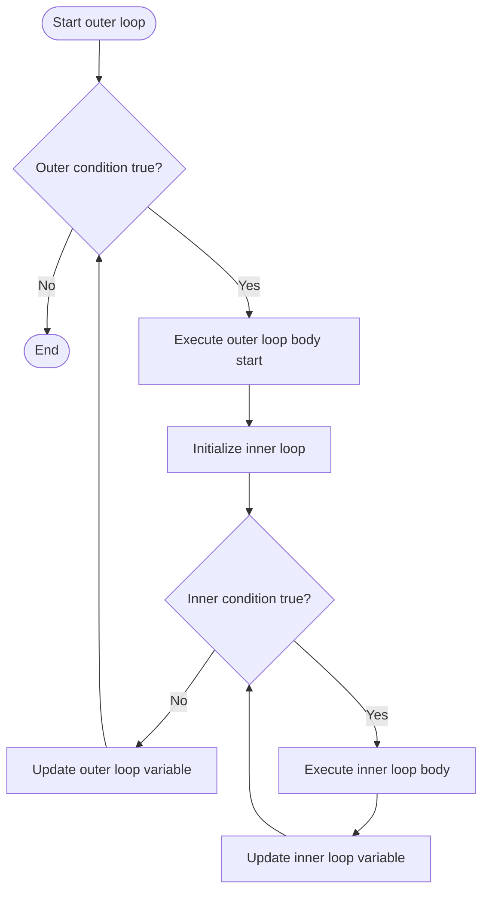
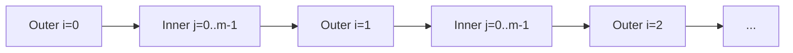

# 📘 Nested Loops: Loops Within Loops

## 1. Intuitive Introduction

Imagine you’re a teacher with 3 classes, each containing 5 students. You need to record attendance. You don’t just go through all 15 students in a single list – you first pick a class, then within that class, you go through each student. After finishing one class, you move to the next. That’s a **nested loop**: an outer loop that iterates over groups, and an inner loop that iterates over items within each group.

Nested loops are everywhere in programming:

- **Student project** – Print a multiplication table (outer loop for rows, inner for columns).
- **Data science** – Compute pairwise distances between points: `for i in range(n): for j in range(n): dist[i][j] = ...`
- **Web development** – Render a grid of products: rows and columns in an HTML table.
- **Machine Learning** – Compare every feature pair for correlation, or implement k‑means clustering (iterating over clusters and points).

Nested loops let you handle **multi‑dimensional data** and **combinatorial problems** – any situation where you need to repeat a process for each combination of two or more sequences.

## 2. Real‑World Analogy: The Clock

Consider a 12‑hour analog clock. The **hour hand** moves slowly – once around every 12 hours. The **minute hand** moves faster – once around every hour. For each hour position (outer loop), the minute hand goes through all 60 positions (inner loop). The inner loop completes fully for each step of the outer loop.

- **Outer loop** = hour hand (12 iterations)
- **Inner loop** = minute hand (60 iterations per hour)
- **Total ticks** = 12 × 60 = 720 minutes

The clock’s mechanism is a perfect nested loop: the inner loop (minutes) is completely executed inside each outer loop (hour) iteration.

## 3. Core Theory

A **nested loop** is a loop inside the body of another loop. The inner loop runs to completion for each iteration of the outer loop.

### Important properties

| Property | Explanation | Example |
|----------|-------------|---------|
| **Full inner iteration** | For each outer iteration, the inner loop runs all its iterations | Outer 3 times, inner 4 times → inner body runs 12 times |
| **Indentation defines nesting** | Each level indented further (typically 4 spaces per level) | Python’s only way to show nesting |
| **Works with `for` and `while`** | Can mix types: `for` outer, `while` inner, etc. | `while i < n: for j in range(m): ...` |
| **Break/continue affect only the innermost loop** | `break` exits only the loop it’s directly in | To exit outer, use a flag or `return` |
| **Variables from outer are accessible inside** | Inner loop can read and modify outer loop variables | `i` from outer is available in inner |
| **Can be nested arbitrarily deep** | 3, 4, 5+ levels possible, but readability suffers | Practical limit ~3 levels |
| **Time complexity multiplication** | If outer runs `n` times, inner `m` times → O(n*m) | Important for performance |

### Basic syntax

```python
# Nested for loops
for i in range(3):          # outer loop
    for j in range(2):      # inner loop
        print(f"i={i}, j={j}")
# Output:
# i=0, j=0
# i=0, j=1
# i=1, j=0
# i=1, j=1
# i=2, j=0
# i=2, j=1

# Nested while loops
i = 0
while i < 3:
    j = 0
    while j < 2:
        print(f"({i},{j})")
        j += 1
    i += 1
```

## 4. Visual Explanation



The inner loop runs completely inside one outer iteration before the outer loop advances.

## 5. Memory & Internal Working (CPython)

Nested loops do not create special data structures. They are simply sequential control flow: the outer loop’s body contains the inner loop. The bytecode for an outer loop includes a `JUMP_ABSOLUTE` to loop back. Inside its body, the inner loop’s bytecode is placed, including its own `JUMP_ABSOLUTE`.

Each level of nesting adds its own loop‑back jump. The variables for each loop reside in the same local namespace; there is no separate scope for loops in Python (unlike some languages). This means:

- Variables modified in the inner loop remain changed for the rest of the outer iteration.
- A variable like `j` used in the inner loop is **not** a new variable each time; it’s the same name, overwritten each iteration.

### Memory diagram of execution flow



The total number of inner body executions = `outer_iterations × inner_iterations`. Each inner loop restarts its counter from the initial value.

## 6. Creating Nested Loops (All Forms)

### 6.1 Basic `for` inside `for`

```python
for i in range(1, 4):
    for j in range(1, 4):
        print(f"{i}×{j}={i*j}", end="  ")
    print()   # newline after each row
# Output:
# 1×1=1  1×2=2  1×3=3
# 2×1=2  2×2=4  2×3=6
# 3×1=3  3×2=6  3×3=9
```

### 6.2 `for` inside `while`

```python
outer = 0
while outer < 3:
    for inner in range(2):
        print(f"Outer={outer}, Inner={inner}")
    outer += 1
```

### 6.3 `while` inside `for`

```python
for i in range(3):
    j = 0
    while j < 2:
        print(i, j)
        j += 1
```

### 6.4 Triple nesting (3 levels)

```python
for x in range(2):
    for y in range(2):
        for z in range(2):
            print(f"({x},{y},{z})")
# (0,0,0), (0,0,1), (0,1,0), (0,1,1), (1,0,0), ...
```

### 6.5 Nested loops over different iterables

```python
colors = ["red", "green", "blue"]
sizes = ["S", "M", "L"]
for color in colors:
    for size in sizes:
        print(f"{color} {size}")
# red S, red M, red L, green S, ...
```

### 6.6 Using `break` and `continue` in nested loops

```python
# break only exits inner loop
for i in range(3):
    for j in range(5):
        if j == 2:
            break
        print(i, j)   # prints only j=0,1 for each i
    print("Inner loop ended")

# continue in inner loop skips to next inner iteration
for i in range(2):
    for j in range(4):
        if j % 2 == 0:
            continue
        print(i, j)   # prints j=1,3 only
```

### 6.7 Exiting outer loop from inside

```python
# Use a flag
found = False
for i in range(10):
    for j in range(10):
        if i*j == 42:
            found = True
            break
    if found:
        break

# Or use for-else with break (more advanced)
for i in range(10):
    for j in range(10):
        if i*j == 42:
            print(f"Found at i={i}, j={j}")
            break
    else:
        continue   # only executed if inner loop didn't break
    break          # break outer if inner broke
```

## 7. Core Operations / Methods

Nested loops themselves have no methods, but common operations involve controlling them.

### Common patterns

| Pattern | Code | Use case |
|---------|------|----------|
| **Flatten nested loops** | `for a in A: for b in B: f(a,b)` | Cartesian product |
| **Matrix traversal** | `for i in range(rows): for j in range(cols): m[i][j]` | 2D array processing |
| **Pairwise combination (i<j)** | `for i in range(n): for j in range(i+1, n):` | Unique pairs, avoid duplication |
| **Triangle pattern generation** | `for i in range(n): for j in range(i+1):` | Lower triangular matrix |
| **Early exit with flags** | `found = False; for ...: if cond: found=True; break` | Search in 2D grid |

### Example: pairwise unique pairs

```python
items = ['a', 'b', 'c', 'd']
for i in range(len(items)):
    for j in range(i+1, len(items)):
        print(f"({items[i]},{items[j]})")
# (a,b),(a,c),(a,d),(b,c),(b,d),(c,d)
```

## 8. Advanced Concepts

### 8.1 List comprehensions with nested loops

```python
# Cartesian product as list of tuples
pairs = [(x,y) for x in range(3) for y in range(2)]
print(pairs)   # [(0,0),(0,1),(1,0),(1,1),(2,0),(2,1)]

# Flatten a 2D list
matrix = [[1,2,3],[4,5,6]]
flattened = [num for row in matrix for num in row]
print(flattened)   # [1,2,3,4,5,6]
```

### 8.2 `itertools.product` – alternative to nested loops

```python
import itertools
for i, j in itertools.product(range(3), range(2)):
    print(i,j)
# Same as nested for loops, but more compact and can handle >2 dimensions
```

### 8.3 Starmap for nested loops with function

```python
from itertools import starmap
def multiply(x, y):
    return x * y
results = list(starmap(multiply, itertools.product(range(3), range(3))))
print(results)   # [0,0,0,0,1,2,0,2,4]
```

### 8.4 Nested loops with `enumerate` for indices

```python
grid = [['a','b'],['c','d']]
for i, row in enumerate(grid):
    for j, val in enumerate(row):
        print(f"grid[{i}][{j}] = {val}")
```

### 8.5 Variable depth nesting (recursive loops)

When you don’t know the nesting depth in advance (e.g., generate all combinations of `k` elements from `n`), use recursion or `itertools.combinations`.

```python
def nested_loops(depth, max_val, current=[]):
    if depth == 0:
        print(current)
    else:
        for i in range(max_val):
            nested_loops(depth-1, max_val, current + [i])

nested_loops(3, 2)   # 2^3 = 8 combinations of [0,1]
```

### 8.6 Optimising nested loops with early pruning

```python
# Example: find triple (a,b,c) such that a+b+c == target
target = 10
found = False
for a in range(1, 11):
    if found: break
    for b in range(1, 11):
        if found: break
        c = target - a - b
        if 1 <= c <= 10:
            print(a,b,c)
            found = True
            break
```

## 9. Mathematical / Special Operations

### 9.1 Matrix multiplication (triple nested loop)

```python
A = [[1,2],[3,4]]
B = [[5,6],[7,8]]
result = [[0,0],[0,0]]
for i in range(len(A)):
    for j in range(len(B[0])):
        for k in range(len(B)):
            result[i][j] += A[i][k] * B[k][j]
print(result)   # [[19,22],[43,50]]
```

### 9.2 Sum of all elements in a 3D list

```python
arr_3d = [[[1,2],[3,4]], [[5,6],[7,8]]]
total = 0
for matrix in arr_3d:
    for row in matrix:
        for val in row:
            total += val
print(total)   # 36
```

### 9.3 Generating the multiplication table (up to 12)

```python
for i in range(1, 13):
    for j in range(1, 13):
        print(f"{i*j:4}", end="")
    print()
```

### 9.4 Triangular numbers pattern

```python
n = 5
for i in range(1, n+1):
    for j in range(1, i+1):
        print(j, end=" ")
    print()
# 1
# 1 2
# 1 2 3
# ...
```

## 10. Real Practical Examples

### Example 1: Image convolution (naive implementation)

```python
def convolve2d(image, kernel):
    h, w = len(image), len(image[0])
    kh, kw = len(kernel), len(kernel[0])
    pad_h, pad_w = kh//2, kw//2
    result = [[0] * w for _ in range(h)]
    for i in range(pad_h, h - pad_h):
        for j in range(pad_w, w - pad_w):
            total = 0
            for ki in range(kh):
                for kj in range(kw):
                    total += image[i+ki-pad_h][j+kj-pad_w] * kernel[ki][kj]
            result[i][j] = total
    return result

# Example: edge detection kernel
img = [[10,10,10,10,10],
       [10,10,10,10,10],
       [10,10,0,10,10],
       [10,10,10,10,10],
       [10,10,10,10,10]]
kernel = [[-1,-1,-1],[-1,8,-1],[-1,-1,-1]]
out = convolve2d(img, kernel)
for row in out:
    print(row)
```

### Example 2: Student grade matrix analysis

```python
# grades[class][student] = score
grades = [
    [85, 92, 78, 88],   # class A
    [65, 70, 82, 79],   # class B
    [95, 89, 91, 93]    # class C
]

# Find class with highest average
best_class = -1
best_avg = 0
for i, class_grades in enumerate(grades):
    total = 0
    for score in class_grades:
        total += score
    avg = total / len(class_grades)
    print(f"Class {i} average: {avg:.2f}")
    if avg > best_avg:
        best_avg = avg
        best_class = i
print(f"Best class index {best_class} with avg {best_avg:.2f}")
```

## 11. ML & Data Science Connection

### 11.1 Pairwise distance matrix (Euclidean)

```python
import math
points = [(1,2), (4,6), (5,2), (8,9)]
n = len(points)
dist_matrix = [[0]*n for _ in range(n)]
for i in range(n):
    for j in range(i+1, n):
        dx = points[i][0] - points[j][0]
        dy = points[i][1] - points[j][1]
        dist = math.sqrt(dx*dx + dy*dy)
        dist_matrix[i][j] = dist_matrix[j][i] = dist
```

### 11.2 K‑means initialisation (choosing random centroids)

```python
import random
data = [(random.random(), random.random()) for _ in range(100)]
k = 3
centroids = []
for _ in range(k):
    centroid = random.choice(data)
    # Ensure uniqueness (simple, not perfect)
    while centroid in centroids:
        centroid = random.choice(data)
    centroids.append(centroid)
```

### 11.3 Cross‑validation folds with nested loops

```python
from sklearn.model_selection import KFold
import numpy as np
X = np.arange(100).reshape(10,10)  # 10 samples, 10 features
y = np.arange(10)
kf = KFold(n_splits=5)
for train_idx, test_idx in kf.split(X):
    X_train, X_test = X[train_idx], X[test_idx]
    y_train, y_test = y[train_idx], y[test_idx]
    # nested loop inside for hyperparameter tuning
    for param in [0.01, 0.1, 1.0]:
        model = SomeModel(param)
        model.fit(X_train, y_train)
        # evaluate...
```

### 11.4 Feature correlation matrix

```python
import pandas as pd
df = pd.DataFrame({
    'A': [1,2,3,4],
    'B': [2,4,6,8],
    'C': [5,3,1,7]
})
corr_matrix = [[0]*3 for _ in range(3)]
cols = list(df.columns)
for i in range(3):
    for j in range(3):
        # manual correlation (simplified)
        corr_matrix[i][j] = df[cols[i]].corr(df[cols[j]])
print(pd.DataFrame(corr_matrix, index=cols, columns=cols))
```

## 12. Common Mistakes & Pitfalls

| Mistake | Wrong Code | Why it fails | Correct Way |
|---------|------------|--------------|--------------|
| **Forgetting to reset inner loop variable** | `i=1; while i<=3: j=1; while j<=3: print(i,j); j+=1` (but j defined before outer loop) | `j` never resets for each outer iteration | Move inner initialisation inside outer loop |
| **Using the same variable name for outer and inner** | `for i in range(3): for i in range(2): print(i)` | Inner `i` overwrites outer `i`; after inner finishes, outer `i` is changed | Use distinct names (e.g., `i` and `j`) |
| **Break doesn’t exit outer loop** | `for i in range(10): for j in range(10): if cond: break` | Only breaks inner loop | Use flag or `for-else` + `break` |
| **Quadratic complexity when unnecessary** | `for i in range(len(lst)): for j in range(len(lst)): if i!=j: compare(lst[i], lst[j])` | O(n²) even if only needed for i<j | Use `for i in range(n): for j in range(i+1, n):` |
| **Modifying list while iterating in nested loops** | `for row in matrix: for val in row: if val<0: matrix.remove(row)` | Alters structure, may skip rows | Collect changes separately |
| **Deep nesting (pyramid of doom)** | 5+ levels of indentation | Hard to read, debug | Refactor inner loops into functions |

## 13. Performance Considerations

| Operation | Time Complexity | Memory | Notes |
|-----------|----------------|--------|-------|
| 2 nested loops (n each) | O(n²) | O(1) extra | For n=10,000 → 100M iterations – can be slow |
| 3 nested loops (n each) | O(n³) | O(1) | For n=1000 → 1B iterations – infeasible |
| Matrix multiplication (naive) | O(n³) | O(n²) output | Use NumPy for speed (C loops) |
| Pairwise (i<j) | O(n²/2) | O(1) | Still quadratic but half the work |
| Flattened with `product` | O(n²) | O(1) iterator | Same as nested loops |
| Using `break` early | O(k) where k is iteration where break occurs | O(1) | Can dramatically improve average case |

**Optimisation tips:**
- Move invariant computations out of inner loops.
- Use local variable lookups (assign to local name).
- For large nested loops, consider NumPy vectorisation or `numba`.
- Pre‑allocate output structures (lists of lists) to avoid repeated appends.

```python
# Slow: repeated append inside nested loops
result = []
for i in range(1000):
    row = []
    for j in range(1000):
        row.append(i*j)
    result.append(row)

# Faster: pre‑allocate
result = [[0]*1000 for _ in range(1000)]
for i in range(1000):
    row = result[i]
    for j in range(1000):
        row[j] = i*j
```

## 14. Interview Questions

### Beginner

1. Write nested loops to print a 5×5 grid of asterisks.
2. What is the total number of times the inner loop body executes if outer runs 4 times and inner runs 6 times?
3. How do you break out of both an inner and outer loop in Python?
4. Write nested loops to generate the following pattern:
   ```
   *
   **
   ***
   ****
   ```
5. Given two lists `A = [1,2,3]` and `B = ['a','b']`, write nested loops to print all pairs.

### Intermediate

6. Explain the difference between `for i in range(n): for j in range(n):` and `for i in range(n): for j in range(i, n):`. When would you use the latter?
7. Write a function that takes a 2D list and returns its transpose using nested loops.
8. How would you flatten a 3D list `[[[1,2],[3,4]],[[5,6],[7,8]]]` into a 1D list using nested loops?
9. What is the time complexity of a triple‑nested loop where outer runs `n`, middle runs `i`, inner runs `j`? (i and j dependent on outer)
10. Write nested loops to find the maximum sum sub‑rectangle in a 2D matrix (naive O(n⁴) version).

### Advanced

11. Implement a function `cartesian_product(*args)` that takes any number of iterables and returns a list of tuples representing the Cartesian product using nested loops (no `itertools.product`).
12. Optimise a doubly nested loop by using Python’s `map` and `zip` – give an example.
13. Explain the concept of **loop invariant** in the context of nested loops. Provide a proof for a matrix multiplication loop.
14. Compare the performance of nested loops in CPython vs. using NumPy’s vectorised operations. Why is NumPy faster?
15. Write a generator function that yields all combinations of `k` elements from a list using recursion (simulating variable‑depth nesting). Then compare it with `itertools.combinations`.

## 15. Mini Project Idea

**Project: Sudoku Validator & Solver (Backtracking)**

Build a Sudoku board validator that uses nested loops to check rows, columns, and 3×3 sub‑grids. Then implement a simple backtracking solver that uses recursive nested loops (implicitly via recursion) to fill empty cells.

```python
def is_valid(board, row, col, num):
    # Check row
    for j in range(9):
        if board[row][j] == num:
            return False
    # Check column
    for i in range(9):
        if board[i][col] == num:
            return False
    # Check 3x3 box
    start_row, start_col = 3*(row//3), 3*(col//3)
    for i in range(start_row, start_row+3):
        for j in range(start_col, start_col+3):
            if board[i][j] == num:
                return False
    return True

def solve_sudoku(board):
    for i in range(9):
        for j in range(9):
            if board[i][j] == 0:
                for num in range(1, 10):
                    if is_valid(board, i, j, num):
                        board[i][j] = num
                        if solve_sudoku(board):
                            return True
                        board[i][j] = 0
                return False
    return True

# Test with a puzzle
puzzle = [
    [5,3,0,0,7,0,0,0,0],
    [6,0,0,1,9,5,0,0,0],
    [0,9,8,0,0,0,0,6,0],
    [8,0,0,0,6,0,0,0,3],
    [4,0,0,8,0,3,0,0,1],
    [7,0,0,0,2,0,0,0,6],
    [0,6,0,0,0,0,2,8,0],
    [0,0,0,4,1,9,0,0,5],
    [0,0,0,0,8,0,0,7,9]
]
solve_sudoku(puzzle)
for row in puzzle:
    print(row)
```

## 16. Best Practices

1. **Limit nesting depth** – 2 levels is usually fine; 3 is occasionally needed; 4+ is a code smell. Refactor into functions.
2. **Use `itertools.product`** for cartesian products – it’s clearer and reduces indentation.
3. **Prefer list comprehensions** for simple transformations of nested loops (e.g., flattening).
4. **Use early breaks** to prune loops when possible – can drastically reduce runtime.
5. **Make inner loops fast** – move expensive but invariant computations outside.
6. **Avoid modifying the outer loop variable inside the inner loop** unintentionally.
7. **Use descriptive variable names** – `for row in range(rows): for col in range(cols):` is better than `i` and `j` when dimensions have meaning.
8. **Consider space–time trade‑offs** – sometimes a precomputed lookup table can replace a nested loop.

## 17. Summary Table

| Aspect | Details | Industry Use Case |
|--------|---------|-------------------|
| **Purpose** | Handle multi‑dimensional data, all pairs, combinatorial iterations | Image processing, matrix ops, simulation |
| **Complexity** | O(product of iterations) | Usually polynomial; can be exponential |
| **Common patterns** | Row‑column traversal, pairwise (i<j), triangular, Cartesian product | Search, sorting, graphics |
| **Alternatives** | `itertools.product`, recursion, NumPy vectorisation | High‑performance computing |
| **Performance pitfall** | Deep nesting or large ranges → million/billion iterations | Optimise with early pruning, vectorisation |
| **Best practice** | Keep shallow, use `break` and `continue` wisely | Code readability and maintainability |

## 18. Key Takeaways

- ✅ A **nested loop** is a loop inside another loop – the inner loop runs completely for each outer iteration.
- ✅ Total iterations = product of loop counts. Be mindful of quadratic or cubic complexity.
- ✅ Indentation is critical – inner loop must be properly indented relative to outer.
- ✅ `break` and `continue` affect only the **innermost** loop they are placed in.
- ✅ Use distinct variable names for outer and inner counters to avoid shadowing.
- ✅ For Cartesian products, `itertools.product` is often cleaner than nested `for` loops.
- ✅ Pairwise operations can be optimised by iterating `i` from `0` to `n`, and `j` from `i+1` to `n` to avoid duplicates.
- ✅ In data science and ML, nested loops appear in distance matrices, grid search, and naive implementations of algorithms – but for performance, prefer vectorised operations (NumPy) or specialised libraries.
- ✅ Refactor deep nesting (3+ levels) into functions – it improves testability and readability.