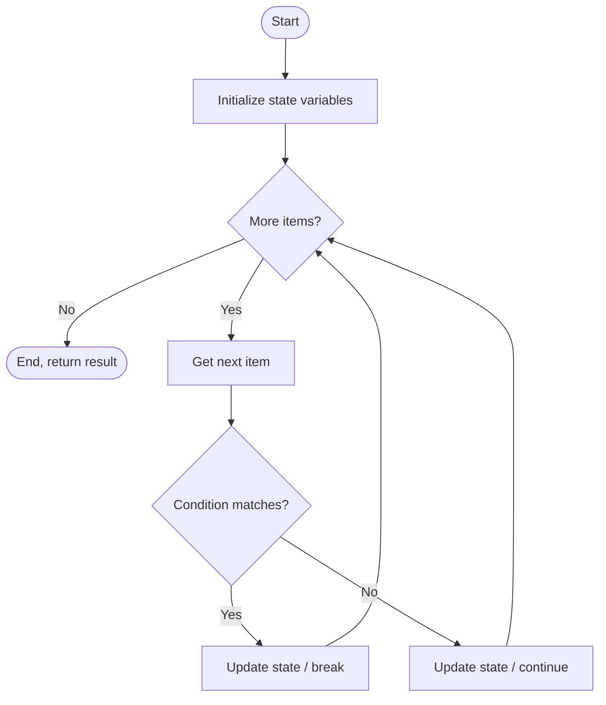
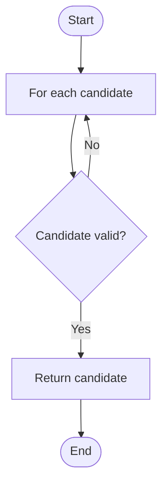

# 📘 Loop Logical Problems: Solving Puzzles with Iteration

## 1. Intuitive Introduction

Imagine you have a combination lock with a 3‑digit code. You don’t know the code, but you know it’s between 000 and 999. How do you open it? One method is **brute force**: try `000`, then `001`, then `002` … until it opens. That’s a loop – you repeat the same check (`if guess == code`) for every possible combination.

**Loop logical problems** are challenges where the solution requires systematic repetition – searching, validating, transforming, or simulating until a condition is met. They test your ability to combine loop structures (`for`, `while`, nested loops) with logical conditions to solve real‑world puzzles.

Where they appear:
- **Student project** – Write a program that finds all prime numbers up to 1000.
- **Data science** – Simulate a random walk or Monte Carlo experiment.
- **Web development** – Validate user input until correct, or paginate through API results.
- **Machine Learning** – Implement early stopping, grid search, or convergence detection.

These problems sharpen your **algorithmic thinking** – breaking a complex task into repeatable steps that a loop can execute.

## 2. Real‑World Analogy: The Lost Key Search

You’ve lost your keys somewhere in your house. You decide to search **room by room**, and inside each room you check **every possible place** (drawer, shelf, under the pillow). This is a **nested loop**: the outer loop iterates over rooms, the inner loop iterates over places. You stop when you find the key (early exit with `break`). If you finish all rooms without success, you conclude the key is not inside.

This captures the essence of loop logical problems:
- **Iteration space** – all rooms × all places.
- **Conditional check** – “is this the key?”
- **Termination** – found or exhausted.

## 3. Core Theory

A **loop logical problem** is any problem whose solution involves a loop (or nested loops) with conditional logic inside. The loop iterates over a set of possibilities, performs checks, updates state, and potentially exits early when a goal is reached.

### Key properties

| Property | Explanation |
|----------|-------------|
| **State maintenance** | Variables outside the loop track progress (e.g., found flag, running sum). |
| **Conditional branching** | Inside the loop, `if-elif-else` decides what to do with each item. |
| **Early termination** | `break` when a solution is found, or `return` from a function. |
| **Accumulation** | Build result strings, lists, or numbers incrementally. |
| **Transformation** | Modify data structures while iterating (carefully). |
| **Nesting** | Handle multi‑dimensional problems (grids, combinations). |

### Common categories of loop logical problems

1. **Search problems** – Find an element satisfying a condition.
2. **Validation problems** – Check if all / any elements meet criteria.
3. **Aggregation problems** – Sum, average, min, max, etc.
4. **Transformation problems** – Map each element to a new value.
5. **Simulation problems** – Model a process over time steps.
6. **Combinatorial generation** – Produce all combinations, permutations.

### Basic example: FizzBuzz (classic loop logic)

```python
for i in range(1, 101):
    if i % 3 == 0 and i % 5 == 0:
        print("FizzBuzz")
    elif i % 3 == 0:
        print("Fizz")
    elif i % 5 == 0:
        print("Buzz")
    else:
        print(i)
```

## 4. Visual Explanation

A generic flowchart for a loop solving a logical problem:



For search‑with‑early‑exit:



## 5. Memory & Internal Working (CPython)

Loop logical problems run entirely in Python’s interpreter; no special memory structures beyond the loop variables and accumulators. However, understanding how Python manages loop variables can prevent subtle bugs:

- Loop variables are **not scoped** to the loop – they remain in the enclosing function/global scope after the loop ends.
- Large loops that build lists via repeated `append` may cause repeated memory reallocations; pre‑allocating with `[0]*n` is faster.
- For search problems, Python’s early break reduces work – the bytecode includes `POP_JUMP_IF_TRUE` that jumps out of the loop.

### Memory diagram for a loop building a list

```mermaid
graph LR
    A[result = []] --> B[Iteration 1: append 1]
    B --> C[result = [1]]
    C --> D[Iteration 2: append 2]
    D --> E[result = [1,2]]
    E --> F[...]
```

Each `append` may cause reallocation (amortised O(1)). For known size, pre‑allocate.

## 6. Creating Loop Logical Solutions (Common Patterns)

“Creating” here means structuring the loop to solve a class of logical problem.

### 6.1 Linear search (find first occurrence)

```python
def linear_search(arr, target):
    for i, val in enumerate(arr):
        if val == target:
            return i
    return -1   # not found
```

### 6.2 Check if all elements satisfy a condition

```python
def all_positive(numbers):
    for n in numbers:
        if n <= 0:
            return False
    return True
```

Better with `all()` but this shows loop logic.

### 6.3 Accumulate until condition (running sum until threshold)

```python
def sum_until(numbers, limit):
    total = 0
    for n in numbers:
        if total + n > limit:
            break
        total += n
    return total
```

### 6.4 Nested loop for pair finding (two‑sum problem)

```python
def two_sum_brute(nums, target):
    for i in range(len(nums)):
        for j in range(i+1, len(nums)):
            if nums[i] + nums[j] == target:
                return (i, j)
    return None
```

### 6.5 Simulation: Compound interest over years

```python
def compound_interest(principal, rate, years):
    balance = principal
    for _ in range(years):
        balance += balance * rate
    return balance
```

### 6.6 While loop with sentinel (user input until stop)

```python
def collect_positive_numbers():
    numbers = []
    while True:
        user_input = input("Enter a number (or 'stop'): ")
        if user_input == 'stop':
            break
        try:
            num = float(user_input)
            if num > 0:
                numbers.append(num)
        except ValueError:
            print("Invalid number")
    return numbers
```

## 7. Core Operations / Methods

Loop logical problems use standard loop syntax; no special methods. However, these patterns are essential:

| Pattern | Code | Purpose |
|---------|------|---------|
| **Early exit** | `if condition: break` | Stop when goal reached |
| **Skip item** | `if condition: continue` | Ignore certain elements |
| **Flag variable** | `found = False; ... if found: break` | Communicate across nested loops |
| **Accumulator** | `total = 0; total += x` | Sum, product, concatenation |
| **Index tracking** | `index = 0; while index < n: index += 1` | Manual index control |
| **State machine** | `state = 'start'; while state != 'end': update state based on input` | Complex logic |

### Example: using a flag to exit nested loops

```python
found = False
for i in range(10):
    for j in range(10):
        if i * j == 42:
            print(f"Found at ({i},{j})")
            found = True
            break
    if found:
        break
```

## 8. Advanced Concepts

### 8.1 Loop invariants

A **loop invariant** is a condition that remains true before and after each iteration. It helps prove correctness.

Example: summing a list – invariant: `total` equals sum of elements seen so far.

```python
def sum_list(lst):
    total = 0
    # invariant: total == sum(lst[0:i])
    for i, val in enumerate(lst):
        total += val   # invariant holds again
    return total
```

### 8.2 Two‑pointer technique (used in many logical problems)

```python
def is_palindrome(s):
    left, right = 0, len(s)-1
    while left < right:
        if s[left] != s[right]:
            return False
        left += 1
        right -= 1
    return True
```

### 8.3 Sliding window with loops

```python
def max_sum_subarray(arr, k):
    max_sum = float('-inf')
    for i in range(len(arr)-k+1):
        window_sum = sum(arr[i:i+k])   # inner loop here is O(k)
        max_sum = max(max_sum, window_sum)
    return max_sum
```

More efficient version maintains running sum.

### 8.4 Recursion as an alternative to loops (factorial)

```python
def factorial(n):
    result = 1
    for i in range(2, n+1):
        result *= i
    return result
# vs recursion, but loops are usually faster and avoid recursion limit.
```

### 8.5 Using `enumerate` and `zip` to avoid index loops

Many logical problems become simpler with built‑ins, but understanding the loop version is key for interviews.

```python
# Loop version of dot product
dot = 0
for i in range(len(a)):
    dot += a[i] * b[i]

# Pythonic version
dot = sum(x*y for x,y in zip(a,b))
```

## 9. Mathematical / Special Operations

### 9.1 Prime number detection

```python
def is_prime(n):
    if n < 2:
        return False
    for i in range(2, int(n**0.5)+1):
        if n % i == 0:
            return False
    return True
```

### 9.2 Greatest common divisor (Euclidean algorithm with loop)

```python
def gcd(a, b):
    while b:
        a, b = b, a % b
    return a
```

### 9.3 Digits sum and reversal

```python
def sum_of_digits(n):
    total = 0
    n = abs(n)
    while n > 0:
        total += n % 10
        n //= 10
    return total
```

### 9.4 Palindrome number (without string conversion)

```python
def is_palindrome_number(x):
    if x < 0:
        return False
    original = x
    reversed_num = 0
    while x > 0:
        reversed_num = reversed_num * 10 + x % 10
        x //= 10
    return original == reversed_num
```

## 10. Real Practical Examples

### Example 1: Finding the longest consecutive sequence in a list

```python
def longest_consecutive(nums):
    if not nums:
        return 0
    num_set = set(nums)
    longest = 0
    for num in num_set:
        # only start counting if it's the beginning of a sequence
        if num - 1 not in num_set:
            current_num = num
            current_streak = 1
            while current_num + 1 in num_set:
                current_num += 1
                current_streak += 1
            longest = max(longest, current_streak)
    return longest

print(longest_consecutive([100,4,200,1,3,2]))  # 4 (1,2,3,4)
```

### Example 2: Simulation of a vending machine (stateful loop)

```python
def vending_machine():
    items = {"A1": 1.50, "B2": 2.00, "C3": 0.75}
    balance = 0.0
    print("Insert coins (0.25, 0.50, 1.00) or type 'buy <code>' or 'exit'")
    while True:
        action = input(f"Balance: ${balance:.2f} > ").strip().lower()
        if action == 'exit':
            print(f"Returning ${balance:.2f}")
            break
        elif action.startswith('buy'):
            code = action.split()[-1].upper()
            if code in items and balance >= items[code]:
                balance -= items[code]
                print(f"Dispensing {code}. Enjoy!")
            else:
                print("Invalid code or insufficient funds.")
        else:
            try:
                coin = float(action)
                if coin in [0.25, 0.50, 1.00]:
                    balance += coin
                else:
                    print("Accept only 0.25, 0.50, 1.00")
            except ValueError:
                print("Invalid command")
```

## 11. ML & Data Science Connection

### 11.1 Monte Carlo simulation (estimating π)

```python
import random
def estimate_pi(num_samples):
    inside = 0
    for _ in range(num_samples):
        x, y = random.random(), random.random()
        if x*x + y*y <= 1:
            inside += 1
    return 4 * inside / num_samples

print(estimate_pi(1_000_000))   # ~3.1416
```

### 11.2 Early stopping in training loop

```python
def train_with_early_stopping(model, data, epochs, patience):
    best_loss = float('inf')
    wait = 0
    for epoch in range(epochs):
        loss = train_one_epoch(model, data)   # hypothetical
        print(f"Epoch {epoch}, loss = {loss}")
        if loss < best_loss:
            best_loss = loss
            wait = 0
            # save model checkpoint
        else:
            wait += 1
            if wait >= patience:
                print("Early stopping triggered")
                break
    return model
```

### 11.3 Generating synthetic data for linear regression (nested loop for multiple features)

```python
import random
def generate_dataset(n_samples, n_features, noise=0.1):
    X = []
    y = []
    true_coef = [random.uniform(-5,5) for _ in range(n_features)]
    for _ in range(n_samples):
        x = [random.gauss(0,1) for _ in range(n_features)]
        target = sum(c * xi for c, xi in zip(true_coef, x)) + random.gauss(0, noise)
        X.append(x)
        y.append(target)
    return X, y, true_coef
```

## 12. Common Mistakes & Pitfalls

| Mistake | Wrong Code | Consequence | Correction |
|---------|------------|-------------|------------|
| **Infinite loop** | `i=0; while i<10: print(i)` | No increment → infinite loop | `i += 1` inside |
| **Off‑by‑one in range** | `for i in range(1, n):` when you need n inclusive | Misses last element | Use `range(1, n+1)` |
| **Modifying list while iterating** | `for x in lst: if x<0: lst.remove(x)` | Skips elements | Iterate over copy: `for x in lst[:]:` |
| **Using `==` with floats** | `while total != 1.0:` | Floating point imprecision | Use tolerance: `abs(total-1.0) > 1e-9` |
| **Not breaking outer loop** | Nested loops: `break` only exits inner | Outer continues | Use flag or `for-else` pattern |
| **Recomputing expensive values inside loop** | `for i in range(len(big_list)): x = big_list[i] + heavy_func(big_list)` | Slow | Compute once before loop |

## 13. Performance Considerations

| Problem Type | Typical Complexity | Notes |
|--------------|--------------------|-------|
| Linear search | O(n) | Can be optimised with early break |
| Nested loops (all pairs) | O(n²) | For n=10⁵ → 10¹⁰ operations (too slow) |
| Euclid’s GCD | O(log min(a,b)) | Very fast |
| Prime detection (trial division) | O(√n) per number | For many numbers, use sieve |
| Simulation (fixed steps) | O(steps) | Usually fine if steps moderate |
| Sliding window (naive) | O(n*k) | Can be reduced to O(n) with running sum |

**Optimisation guidelines:**
- Use local variable references inside loops (`lst = mylist; for x in lst:`).
- Move invariant code outside loops.
- For large data, consider NumPy vectorisation instead of Python loops.
- Use `break` and `continue` to prune impossible branches early.

## 14. Interview Questions

### Beginner

1. Write a loop to compute the factorial of a given integer.
2. How do you find the largest number in a list using a loop?
3. Write a loop that prints the Fibonacci sequence up to the 10th term.
4. Given a string, use a loop to count vowels (a, e, i, o, u).
5. Write a loop that reverses a string without using slicing.

### Intermediate

6. Implement a function that checks if a string is a palindrome using a two‑pointer loop.
7. Given a list of integers, find the first duplicate using a loop (O(n²) acceptable). Then optimise to O(n) using a set.
8. Write a loop that simulates a simple bank account with deposits and withdrawals until the user types "quit".
9. Find all pairs in an array that sum to a target (without using dictionary).
10. Write a nested loop to print a right‑angled triangle of stars of height 5.

### Advanced

11. Implement the Sieve of Eratosthenes using a loop to generate all primes up to 1,000,000.
12. Solve the "Maximum Subarray" (Kadane’s algorithm) using a single loop. Explain why it works.
13. Write a loop that traverses a binary tree in‑order without recursion (using a stack). Compare with recursive version.
14. Implement a loop that finds the longest substring without repeating characters (sliding window with two pointers).
15. Given a large sorted array and a target, implement binary search using a `while` loop. What is the invariant?

## 15. Mini Project Idea

**Project: Word Chain Solver (like "Ladder" puzzle)**

Build a program that finds the shortest chain from one word to another by changing one letter at a time (e.g., "cat" → "cot" → "cog" → "dog"). Use a loop to perform breadth‑first search (BFS) without recursion.

```python
from collections import deque

def word_ladder(start, end, word_list):
    word_set = set(word_list)
    if end not in word_set:
        return None
    queue = deque([(start, [start])])
    while queue:
        word, path = queue.popleft()
        if word == end:
            return path
        for i in range(len(word)):
            for c in 'abcdefghijklmnopqrstuvwxyz':
                next_word = word[:i] + c + word[i+1:]
                if next_word in word_set:
                    word_set.remove(next_word)
                    queue.append((next_word, path + [next_word]))
    return None

words = ["cat", "cot", "cog", "dog", "dot", "log"]
print(word_ladder("cat", "dog", words))  # ['cat', 'cot', 'cog', 'dog']
```

This project combines loops (BFS queue processing), logical checks, and nested loops (over letters).

## 16. Best Practices

1. **Prefer `for` over `while`** when iterating over a fixed range or collection – it’s less error‑prone.
2. **Use `break` and `continue` sparingly** – they make loop logic harder to follow. Consider refactoring.
3. **Avoid deep nesting** – if you need three or more levels, extract inner loops into functions.
4. **Keep loop bodies short** – a loop should do one well‑defined task. If it’s long, break it into functions.
5. **Use early returns** to avoid flag variables – instead of `found = False` and checking later, return directly from inside the loop.
6. **Be explicit with loop invariants** – comment them for complex algorithms; they help debugging.
7. **Test edge cases** – empty iterable, single element, all matching, none matching.
8. **Pre‑allocate result lists** when the final size is known to avoid repeated appends.

## 17. Summary Table

| Aspect | Details | Industry Use Case |
|--------|---------|-------------------|
| **Definition** | Problems solved using loops + conditional logic | Search, validation, simulation |
| **Key patterns** | Linear search, accumulation, early exit, nested iteration | Data cleaning, feature extraction |
| **Complexity** | O(n), O(n²), O(log n) depending on algorithm | Trade‑off between time and readability |
| **Alternatives** | Recursion, vectorisation, built‑ins (`any`, `all`, `map`) | Pythonic vs. explicit loops |
| **Common pitfall** | Off‑by‑one, infinite loop, modifying iterable | Debugging time |
| **Best practice** | Keep loops shallow, use meaningful variable names, add invariants | Maintainable code |

## 18. Key Takeaways

- ✅ Loop logical problems use **repetition** to systematically explore possibilities or accumulate results.
- ✅ The three pillars: **initialisation**, **condition**, **update** – missing any leads to bugs.
- ✅ `break` exits the innermost loop; to exit multiple levels, use a flag or refactor.
- ✅ **Linear search** is O(n); **binary search** requires sorted data and is O(log n).
- ✅ Nested loops often imply O(n²) – be cautious with large inputs; consider optimisation or different algorithms.
- ✅ Simulation problems (e.g., vending machine, bank account) are natural fits for `while True` + `break`.
- ✅ In data science, loops appear in **Monte Carlo methods**, **grid search**, and **early stopping**.
- ✅ Always test edge cases – empty input, single element, maximum values, and invalid data.
- ✅ Master the common patterns: **accumulator**, **search flag**, **two‑pointer**, **sliding window** – they reappear in many coding interviews.