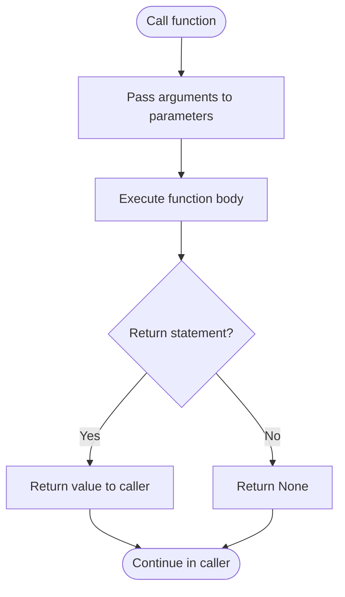
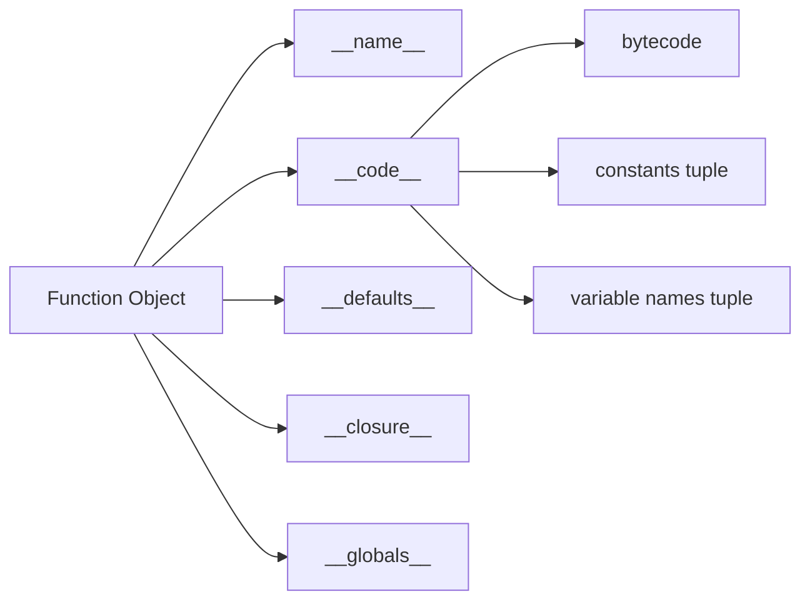

# 📘 Python Functions: The Building Blocks of Reusable Code

## 1. Intuitive Introduction

Imagine you're a chef in a busy kitchen. You don't cook every dish from scratch each time – you have **recipes**. A recipe is a set of instructions that, given certain inputs (ingredients), produces a consistent output (a dish). You can reuse the same recipe many times, with different ingredients, and even combine recipes to create more complex meals.

In Python, a **function** is exactly that: a reusable block of code that takes inputs (parameters), performs a specific task, and optionally returns an output. Functions are the fundamental building blocks of **modular, maintainable, and testable code**.

Functions are everywhere in real development:

- **Student project** – Write a `calculate_grade(score)` function to reuse for every student.
- **Data science** – Define a `clean_data(df)` function to preprocess multiple datasets.
- **Web development** – Create a `authenticate_user(request)` function called on every request.
- **Machine Learning** – Encapsulate a training loop in `train_model(model, data, epochs)`.

Without functions, code would be a monolithic, repetitive mess. With them, you build **abstractions** – you think about *what* needs to be done, not *how*, every single time.

## 2. Real‑World Analogy: The Fast‑Food Ordering System

At a fast‑food restaurant, you order a burger. You don't care how the kitchen prepares it – you just want the result. The kitchen has a **burger‑making function**: inputs (bun, patty, lettuce, sauce), process (grill, assemble), output (burger). They make hundreds of burgers using the same procedure, with variations (extra cheese, no onion). This is a function:

- **Inputs** = parameters (bun, patty, ...)
- **Process** = function body
- **Output** = return value (the burger)

Moreover, they can use other functions inside (e.g., `grill_patty()`, `chop_lettuce()`) – that's **composition**.

## 3. Core Theory

A function is a named block of code that performs a specific task. It can accept arguments (parameters) and return a value (or `None` by default).

### Syntax

```python
def function_name(param1, param2=default):
    """Docstring: explains what the function does."""
    # body: statements
    return result   # optional
```

### Key Properties

| Property | Explanation | Example |
|----------|-------------|---------|
| **Reusable** | Define once, call many times | `sum(1,2)` anywhere |
| **Parameterised** | Accept inputs to change behaviour | `def greet(name):` |
| **Encapsulated** | Variables inside are local (not visible outside) | `x` inside function doesn't affect global `x` |
| **Return value** | Produces output; `None` if no `return` | `return total` |
| **First‑class objects** | Can be assigned, passed as arguments, returned from other functions | `func = my_func; map(func, iterable)` |
| **Can have side effects** | Modify global state, print, write files | Be cautious – pure functions are preferable |

### Basic Examples

```python
# Simple function
def greet(name):
    """Return a greeting string."""
    return f"Hello, {name}!"

print(greet("Alice"))   # Hello, Alice!

# No return (implicitly returns None)
def log(message):
    print(f"[LOG] {message}")

result = log("Test")   # prints, but result is None

# Function with default parameter
def power(base, exp=2):
    return base ** exp

print(power(3))    # 9
print(power(3, 4)) # 81
```

## 4. Visual Explanation



Function call = control jumps to function, executes, then returns.

## 5. Memory & Internal Working (CPython)

When a function is defined, Python creates a **function object** (type `function`). This object contains:
- **Code object** (bytecode, constants, variable names)
- **Name** (string)
- **Defaults** for parameters (tuple)
- **Closure** (if nested, captures free variables)
- **Globals** reference (module's global namespace)

When the function is called, a new **frame** (stack frame) is created, which contains the local namespace and the execution context. Arguments are assigned to local variables. After the function returns, the frame is destroyed (unless there are closures referencing it).

### Diagram of Function Object



Each call creates a new local scope; `global` and `nonlocal` allow modifying outer scopes.

## 6. Creating Functions (All Forms)

### 6.1 Regular function with `def`

```python
def add(a, b):
    return a + b
```

### 6.2 Function with default arguments

```python
def multiply(a, b=2):
    return a * b
```

**Important:** Defaults are evaluated at definition time, not call time – avoid mutable defaults.

```python
# Bad: mutable default
def append_to_list(item, my_list=[]):
    my_list.append(item)
    return my_list
append_to_list(1)  # [1]
append_to_list(2)  # [1,2]  (surprise!)

# Good: use None
def append_to_list(item, my_list=None):
    if my_list is None:
        my_list = []
    my_list.append(item)
    return my_list
```

### 6.3 Keyword and positional arguments

```python
def describe_person(name, age, city="Unknown"):
    return f"{name}, {age}, from {city}"

# Keyword arguments can be in any order
describe_person(age=30, name="Bob", city="NYC")
```

### 6.4 `*args` and `**kwargs` (variable‑length arguments)

```python
def sum_all(*args):
    return sum(args)

def print_kwargs(**kwargs):
    for key, value in kwargs.items():
        print(f"{key} = {value}")

print(sum_all(1,2,3,4))   # 10
print_kwargs(a=1, b=2)    # a=1, b=2
```

### 6.5 Lambda functions (anonymous)

```python
square = lambda x: x ** 2
print(square(5))   # 25

# Often used inline
sorted([3,1,4,2], key=lambda x: x)   # same as default
```

### 6.6 Nested functions and closures

```python
def outer(x):
    def inner(y):
        return x + y   # captures x
    return inner

add5 = outer(5)
print(add5(3))   # 8
```

### 6.7 Function annotations (type hints)

```python
def greet(name: str, age: int) -> str:
    return f"{name} is {age} years old"
```
Annotations are not enforced; they provide hints for static checkers.

## 7. Core Operations / Methods

Functions are objects, so they have attributes and methods:

| Attribute/Method | Description | Example |
|------------------|-------------|---------|
| `func.__name__` | Function name | `add.__name__` → `'add'` |
| `func.__doc__` | Docstring | `add.__doc__` |
| `func.__defaults__` | Default argument values | `multiply.__defaults__` → `(2,)` |
| `func.__code__` | Code object (bytecode, etc.) | for introspection |
| `func.__annotations__` | Type hints dict | `greet.__annotations__` |
| `func.__call__` | Called when you use `func()` | – |
| `func.__dict__` | Can store custom attributes | `func.my_attr = 42` |

### Docstrings (PEP 257)

Use triple‑quoted strings:

```python
def add(a, b):
    """Return the sum of a and b."""
    return a + b

print(add.__doc__)   # 'Return the sum of a and b.'
```

### `help()` uses docstrings

```python
help(add)
```

## 8. Advanced Concepts

### 8.1 Decorators (wrapping functions)

```python
def timer(func):
    import time
    def wrapper(*args, **kwargs):
        start = time.time()
        result = func(*args, **kwargs)
        print(f"{func.__name__} took {time.time() - start:.4f}s")
        return result
    return wrapper

@timer
def slow_function():
    time.sleep(1)

slow_function()   # prints time
```

### 8.2 Recursion (function calling itself)

```python
def factorial(n):
    if n <= 1:
        return 1
    return n * factorial(n-1)
```

**Important:** recursion depth limited (~1000). Use iterative when possible.

### 8.3 Generators (functions that yield)

```python
def fibonacci(n):
    a, b = 0, 1
    for _ in range(n):
        yield a
        a, b = b, a + b

for num in fibonacci(5):
    print(num)   # 0,1,1,2,3
```

Generators preserve state between calls and are memory‑efficient.

### 8.4 Partial functions (functools.partial)

```python
from functools import partial
def power(base, exp):
    return base ** exp

square = partial(power, exp=2)
print(square(5))   # 25
```

### 8.5 Function composition

```python
def compose(f, g):
    return lambda x: f(g(x))

def add1(x): return x + 1
def double(x): return x * 2

add1_then_double = compose(double, add1)
print(add1_then_double(3))   # double(add1(3)) = 8
```

### 8.6 `functools.wraps` to preserve metadata in decorators

```python
from functools import wraps

def my_decorator(func):
    @wraps(func)
    def wrapper(*args, **kwargs):
        # do something
        return func(*args, **kwargs)
    return wrapper
```

### 8.7 `functools.lru_cache` for memoization

```python
from functools import lru_cache

@lru_cache(maxsize=128)
def fibonacci(n):
    if n < 2:
        return n
    return fibonacci(n-1) + fibonacci(n-2)

print(fibonacci(40))   # fast due to caching
```

## 9. Mathematical / Special Operations

Functions are fundamental to mathematical computing:

### 9.1 Mapping a function over a list

```python
nums = [1,2,3,4]
squared = list(map(lambda x: x**2, nums))  # [1,4,9,16]
```

### 9.2 Filtering with a predicate

```python
even = list(filter(lambda x: x%2==0, nums))  # [2,4]
```

### 9.3 Reducing with `functools.reduce`

```python
from functools import reduce
product = reduce(lambda a,b: a*b, nums)  # 24
```

### 9.4 Piecewise functions using lambdas or if‑else

```python
def piecewise(x):
    return x**2 if x >= 0 else -x
```

## 10. Real Practical Examples

### Example 1: Validation pipeline with functions

```python
def validate_email(email):
    return "@" in email and "." in email.split("@")[-1]

def validate_password(password):
    return len(password) >= 8 and any(c.isdigit() for c in password)

def validate_user(user):
    return validate_email(user.email) and validate_password(user.password)

# Usage in registration flow
```

### Example 2: Data processing pipeline

```python
def load_data(filepath):
    # read CSV etc.
    return data

def clean_data(df):
    # remove nulls, standardize columns
    return df

def transform_data(df):
    # create features, scale
    return df

def train_model(df):
    # train and return model
    return model

def pipeline(filepath):
    return train_model(transform_data(clean_data(load_data(filepath))))

model = pipeline("data.csv")
```

## 11. ML & Data Science Connection

Functions are the backbone of data science workflows.

### 11.1 Model training function

```python
def train_model(X_train, y_train, model_type='linear', **kwargs):
    if model_type == 'linear':
        from sklearn.linear_model import LinearRegression
        model = LinearRegression(**kwargs)
    elif model_type == 'tree':
        from sklearn.tree import DecisionTreeRegressor
        model = DecisionTreeRegressor(**kwargs)
    model.fit(X_train, y_train)
    return model
```

### 11.2 Evaluation function

```python
def evaluate_model(model, X_test, y_test, metrics=['mse', 'r2']):
    from sklearn.metrics import mean_squared_error, r2_score
    results = {}
    if 'mse' in metrics:
        results['mse'] = mean_squared_error(y_test, model.predict(X_test))
    if 'r2' in metrics:
        results['r2'] = r2_score(y_test, model.predict(X_test))
    return results
```

### 11.3 Feature engineering function

```python
def engineer_features(df):
    df['age_group'] = pd.cut(df['age'], bins=[0,18,35,65,100], labels=['child','young','adult','senior'])
    df['log_income'] = np.log1p(df['income'])
    return df
```

### 11.4 Activation functions in neural networks (as functions)

```python
def relu(x):
    return max(0, x)

def sigmoid(x):
    return 1 / (1 + math.exp(-x))

# Used in layer definitions
```

## 12. Common Mistakes & Pitfalls

| Mistake | Wrong Code | Why it fails | Correction |
|---------|------------|--------------|------------|
| **Mutable default arguments** | `def f(lst=[]): lst.append(1); return lst` | `lst` persists across calls | Use `None` default and create new list |
| **Shadowing built‑ins** | `def list():` | Overrides `list` built‑in | Use another name |
| **Forgetting to return** | `def add(a,b): a+b` | Returns `None` silently | Add `return` |
| **Using `global` unnecessarily** | `def f(): global x; x = 5` | Makes code hard to debug | Pass as argument and return |
| **Modifying mutable arguments** | `def f(lst): lst.append(1)` | Unexpected side effects | Copy inside if needed: `lst = lst[:]` |
| **Recursion without base case** | `def f(): return f()` | Infinite recursion (stack overflow) | Always have base case |
| **Incorrect order of positional/keyword args** | `def f(a,b): pass; f(b=1,2)` | SyntaxError | Use correct order |
| **Type hints not enforced** | `def f(x: int): return x + "a"` | No error at runtime | Use type checkers separately |

## 13. Performance Considerations

| Aspect | Time | Notes |
|--------|------|-------|
| Function call overhead | ~100 ns (small) | In tight loops, can be significant; use local variables or inline |
| Recursion | O(n) calls | Can hit recursion limit; iterative is often faster |
| Lambda (vs def) | same as normal | No performance difference, just syntactic |
| Closure | slight overhead | Accessing cell variables slower than locals |
| `*args`/`**kwargs` | packing/unpacking overhead | Minimal, but avoid in performance‑critical loops |
| Decorators | overhead of wrapper call | Use only when needed |

### Micro‑optimisations

- Avoid function calls inside deep loops; hoist them.
- Use `functools.lru_cache` to memoize expensive pure functions.
- Prefer built‑ins (e.g., `sum`, `map`) that loop in C.

## 14. Interview Questions

### Beginner

1. What is a function? Why are they useful?
2. How do you define a function in Python? Show syntax.
3. Explain the difference between `return` and `print`.
4. What is a default argument? Show an example.
5. What is a lambda function? When would you use one?

### Intermediate

6. Explain `*args` and `**kwargs`. When are they helpful?
7. How does variable scope work in Python? What is the `global` keyword?
8. What is a closure? Provide an example.
9. How do you write a decorator? What is its purpose?
10. What is the difference between `list.sort()` and `sorted()` in terms of function design?

### Advanced

11. Explain how Python passes arguments (pass‑by‑object‑reference). What are the implications for mutable vs immutable types?
12. Describe the function call stack and how frames are managed. What happens when recursion depth is exceeded?
13. Implement a decorator that measures the execution time and also caches results.
14. What is a generator? How does it differ from a regular function? Explain `yield` vs `return`.
15. Discuss the role of `functools.wraps` in decorators and why it's important.

## 15. Mini Project Idea

**Project: Function‑Based Calculator with History**

Build a calculator program where each operation (add, subtract, multiply, divide, power, root) is a separate function. Also implement a `memory` function that stores the last result. The program uses a loop to accept user commands, but each command maps to a function call.

**Features:**
- `add(a,b)`, `sub(a,b)`, `mul(a,b)`, `div(a,b)`
- `history()` prints the last 10 results with the operation and operands.
- `clear()` resets history.
- Functions are pure (no side effects) – history is managed by the controller, not the functions.

**Sample interaction:**
```
> add 3 5
8
> mul 2 10
20
> history
1. add(3,5) = 8
2. mul(2,10) = 20
```

**Why it’s great:** Reinforces function definition, signatures, returning values, and modular design.

## 16. Best Practices

1. **Keep functions small** – do one thing, and do it well. (Single Responsibility Principle)
2. **Use descriptive names** – `calculate_average` not `avg`.
3. **Prefer pure functions** – no side effects (no global mutation, no I/O). They are easier to test.
4. **Use docstrings** – explain what the function does, its parameters, and return value.
5. **Avoid global variables** – pass values as parameters instead.
6. **Use type hints** – they improve code clarity and enable static checking.
7. **Define default parameters carefully** – never use mutable objects as defaults.
8. **Limit the number of parameters** – if more than 3–4, consider grouping into a class or dictionary.

## 17. Summary Table

| Aspect | Details | Industry Use Case |
|--------|---------|-------------------|
| **Purpose** | Encapsulate reusable logic | Code organisation, testing, abstraction |
| **Key features** | Parameters, return, default values, `*args`, `**kwargs` | Configurable functions, generic code |
| **Advanced** | Decorators, closures, generators, recursion | Logging, memoization, lazy sequences |
| **Performance** | Call overhead (~100ns), recursion depth limit | Use for clarity, not micro‑optimisation |
| **Testing** | Functions are easy to test (input→output) | Unit testing with frameworks (pytest) |
| **Common pitfall** | Mutable defaults, side effects | Bug source; careful design needed |

## 18. Key Takeaways

- ✅ Functions let you **reuse** code, **abstract** complexity, and **organise** programs.
- ✅ A function can have parameters (inputs) and a return value (output). `None` is returned by default.
- ✅ **Local variables** are created inside the function; they don't interfere with the outer scope (unless using `global` or `nonlocal`).
- ✅ **Default arguments** are evaluated at definition time – avoid mutable defaults like lists or dicts.
- ✅ Use `*args` for variable‑length positional arguments, and `**kwargs` for keyword arguments.
- ✅ **Decorators** wrap functions to add behaviour (e.g., timing, logging, access control).
- ✅ **Lambda** functions are concise for short, simple operations (e.g., in `sorted` or `map`).
- ✅ **Generators** (with `yield`) produce values lazily, saving memory.
- ✅ Functions are **first‑class** – assign them, pass them, return them.
- ✅ Write **pure functions** when possible – they are deterministic, testable, and reusable.