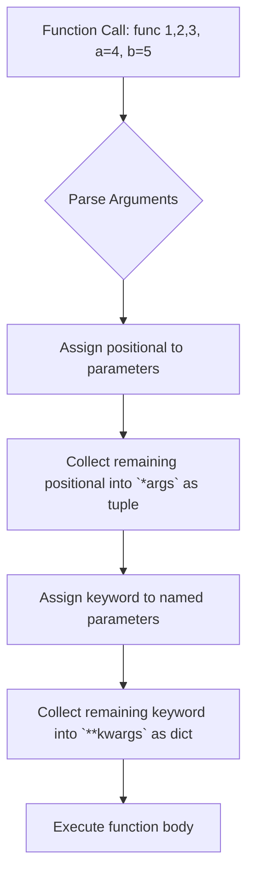
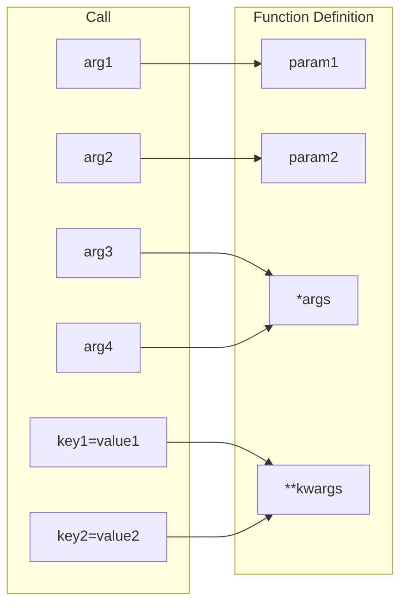

# 📘 *args and **kwargs: Flexible Function Arguments

## 1. Intuitive Introduction

Imagine you own a pizza restaurant. You have a standard pizza recipe, but customers can add **any number of extra toppings** (extra cheese, pepperoni, olives, pineapple…). You don’t want to write a separate function for each combination – you want a single ordering system that accepts **any number** of toppings. Furthermore, some customers might want a **custom base** (e.g., thin crust, gluten‑free) – those are like named options that you can handle via keyword arguments.

In Python, `*args` and `**kwargs` let you write functions that accept a **variable number of positional** and **keyword** arguments. They are essential for:

- **Student project** – Write a `sum_all(*numbers)` that adds any number of inputs.
- **Data science** – Create a `plot_data(**kwargs)` that accepts any number of matplotlib customisations (color, label, linestyle…).
- **Web development** – Build a generic API wrapper that passes through arbitrary parameters.
- **Machine Learning** – Design a model training function that accepts optional hyperparameters.

These tools give your functions **flexibility** and **future‑proofing** – you don’t have to predict every possible argument in advance.

## 2. Real‑World Analogy: The Swiss Army Knife

A Swiss Army knife has many tools, but you can **open** any number of them at once – a blade, a corkscrew, scissors, etc. You don’t say “I want exactly three tools” – you just open the ones you need.

`*args` is like the **blade** – you can have any number of them (they are positional, in order). `**kwargs` is like the **accessories** – they come with a label (e.g., “screwdriver”, “scissors”) and you can choose which ones to include. The knife itself (the function) can handle whatever combination you throw at it.

## 3. Core Theory

`*args` and `**kwargs` allow a function to accept an arbitrary number of arguments:

- `*args` collects **extra positional arguments** into a **tuple**.
- `**kwargs` collects **extra keyword arguments** into a **dictionary**.

They are not special keywords – you can use any variable name after the asterisks, e.g., `*numbers`, `**options`, but `args` and `kwargs` are conventions.

### Syntax

```python
def func(*args, **kwargs):
    # args is a tuple of all positional arguments beyond those explicitly defined
    # kwargs is a dict of all keyword arguments beyond those explicitly defined
    print("args:", args)
    print("kwargs:", kwargs)

func(1,2,3, name='Alice', age=30)
# args: (1,2,3)
# kwargs: {'name': 'Alice', 'age': 30}
```

### Important Properties

| Property | Explanation | Example |
|----------|-------------|---------|
| **Order matters** | `*args` must come before `**kwargs` in the function definition, and both after normal parameters. | `def f(a, b, *args, **kwargs):` |
| **`args` is a tuple** | Immutable and can be iterated. | `args[0]` |
| **`kwargs` is a dict** | Keys must be strings (valid identifiers) and unique. | `kwargs['key']` |
| **Can be combined with defaults** | You can set default values for some parameters before `*args` / `**kwargs`. | `def f(a, b=2, *args):` |
| **Function call unpacking** | You can use `*` and `**` to unpack sequences and dicts into arguments. | `func(*[1,2], **{'x':3})` |
| **Name is just convention** | You can use `*names` and `**options` – the behavior depends on the `*` and `**`, not the name. | `def f(*items):` |

### Examples

```python
# Basic
def print_args(*args):
    for arg in args:
        print(arg)

print_args(1, 2, 3)  # prints 1,2,3

# With `**kwargs`
def print_kwargs(**kwargs):
    for key, value in kwargs.items():
        print(f"{key}: {value}")

print_kwargs(name='Alice', age=25)  # name: Alice, age: 25

# Combining
def greet(greeting, *names, **options):
    print(greeting, *names)
    if options.get('uppercase', False):
        print(greeting.upper(), *names)

greet('Hello', 'Alice', 'Bob', uppercase=True)
# Hello Alice Bob
# HELLO Alice Bob
```

## 4. Visual Explanation



Another view for multiple arguments:



## 5. Memory & Internal Working (CPython)

When a function with `*args` and `**kwargs` is called, the interpreter collects the extra arguments into a tuple and a dict **during the call** (while building the frame). They are normal Python objects, so they are allocated on the heap.

- `*args` tuple is created from the extra positional arguments, with items in the order they appear.
- `**kwargs` dict is created from the extra keyword arguments, preserving insertion order (Python 3.7+).

The function object stores no special info about `*args`/`**kwargs`; they are handled at runtime by the `CALL_FUNCTION_EX` opcode. There's no performance penalty unless you have many arguments – the overhead is comparable to creating a tuple and a dict.

If you pass `*` and `**` in a call (unpacking), the bytecode `UNPACK_SEQUENCE` and `BUILD_MAP` are used to expand sequences and dicts.

## 6. Creating Functions with `*args` and `**kwargs` (All Forms)

### 6.1 Only `*args`

```python
def sum_all(*args):
    return sum(args)
print(sum_all(1,2,3,4))   # 10
```

### 6.2 Only `**kwargs`

```python
def print_info(**kwargs):
    for k, v in kwargs.items():
        print(f"{k}: {v}")
```

### 6.3 Both `*args` and `**kwargs`

```python
def combine(*args, **kwargs):
    return {'args': args, 'kwargs': kwargs}
```

### 6.4 With normal positional and keyword parameters

```python
def register(name, age, *hobbies, **metadata):
    print(f"Name: {name}, Age: {age}")
    print("Hobbies:", hobbies)
    print("Metadata:", metadata)
```

### 6.5 With default parameters

```python
def send_message(msg, *recipients, urgent=False, **headers):
    # `urgent` is a keyword‑only parameter (after `*recipients`)
    ...
```

Note: In the above, `urgent` can only be passed as a keyword argument (it's a **keyword‑only** parameter) because it comes after `*recipients`.

### 6.6 Using `*` to force keyword‑only arguments

```python
def f(a, b, *, c):   # c is keyword‑only
    pass
f(1,2,c=3)  # OK
f(1,2,3)    # TypeError
```

### 6.7 Unpacking in function calls (the inverse)

```python
def add(a, b, c):
    return a+b+c

numbers = [1,2,3]
print(add(*numbers))   # 6

data = {'a': 10, 'b': 20, 'c': 30}
print(add(**data))     # 60
```

### 6.8 Using `*` and `**` together in call

```python
def fun(a,b,c,d):
    print(a,b,c,d)
args = (1,2)
kwargs = {'c':3, 'd':4}
fun(*args, **kwargs)   # 1 2 3 4
```

## 7. Core Operations / Methods

`*args` and `**kwargs` are just tuples and dicts, so all their methods apply:

- `len(args)` – number of extra positional arguments.
- `args[0]`, `args[-1]` – indexing.
- `len(kwargs)` – number of extra keyword arguments.
- `kwargs.keys()`, `kwargs.values()`, `kwargs.items()`.
- `kwargs.get(key, default)` – safe access.

They can be passed to other functions using the same `*` and `**` syntax.

## 8. Advanced Concepts

### 8.1 Keyword‑only arguments

After `*args` or a bare `*`, all subsequent parameters are **keyword‑only** (must be passed by name).

```python
def f(a, b, *args, c, d=10):
    # a,b: positional; args: extra positional; c,d: keyword‑only
    pass

f(1,2, c=3, d=4)   # valid
f(1,2,3,4, c=5)    # args gets (3,4), c=5, d default 10
```

### 8.2 Positional‑only arguments (Python 3.8+)

Use `/` before parameters to force positional‑only.

```python
def f(a, b, /, c, d=5, *args, e, **kwargs):
    # a,b are positional‑only; c,d are positional or keyword; e is keyword‑only
    pass

f(1,2,3, e=7)   # valid: a=1,b=2,c=3,e=7
f(a=1,b=2,c=3)  # TypeError: a,b positional‑only
```

### 8.3 Combining with defaults and type hints

```python
def process(*args: int, **kwargs: str) -> None:
    for a in args:
        print(a)
    for k,v in kwargs.items():
        print(f"{k}: {v}")
```

### 8.4 Using `*args` and `**kwargs` in decorators

Decorators often use `*args, **kwargs` to wrap arbitrary functions.

```python
def logger(func):
    def wrapper(*args, **kwargs):
        print(f"Calling {func.__name__}")
        return func(*args, **kwargs)
    return wrapper

@logger
def greet(name):
    print(f"Hello {name}")
```

### 8.5 Forwarding arguments with `*args, **kwargs`

```python
def outer(*args, **kwargs):
    print("Outer received:", args, kwargs)
    inner(*args, **kwargs)

def inner(a, b, c=0):
    print(a,b,c)

outer(1,2,c=3)   # Outer received: (1,2) {'c':3} ; inner prints 1,2,3
```

### 8.6 `*` in tuple unpacking (Python 3.5+)

```python
a, *rest = [1,2,3,4]
print(a, rest)   # 1 [2,3,4]
```

This is not `*args` in functions but shows the same star syntax for unpacking.

### 8.7 `**` in dict unpacking (Python 3.5+)

```python
d1 = {'a':1, 'b':2}
d2 = {'c':3, 'd':4}
merged = {**d1, **d2}   # {'a':1,'b':2,'c':3,'d':4}
```

### 8.8 `functools.partial` with `*args, **kwargs`

```python
from functools import partial
def power(base, exp):
    return base ** exp
square = partial(power, exp=2)
```

## 9. Mathematical / Special Operations

`*args` and `**kwargs` are primarily for argument handling, but they support mathematical operations:

- `sum(args)` – sum of extra positional numbers.
- `math.prod(args)` – product.
- `min(args)`, `max(args)`.
- `dict` operations on `kwargs` (merging, updating).

## 10. Real Practical Examples

### Example 1: Generic data transformation pipeline

```python
def pipeline(data, *transforms, **options):
    """
    Apply a series of transforms (functions) to data, with optional config.
    transforms: any number of functions that take data and return transformed data.
    options: can specify 'verbose' to print progress.
    """
    verbose = options.get('verbose', False)
    for i, func in enumerate(transforms):
        data = func(data)
        if verbose:
            print(f"After transform {i+1}: {data}")
    return data

def square(x): return x**2
def add10(x): return x+10
def times2(x): return x*2

result = pipeline(3, square, add10, times2, verbose=True)
print(result)   # (3^2+10)*2 = 38
```

### Example 2: API client with flexible headers

```python
def api_call(endpoint, method='GET', **kwargs):
    """
    Makes an HTTP request; accepts any additional parameters as query params.
    """
    # Simulate building request
    print(f"Calling {method} {endpoint} with params: {kwargs}")
    # in real code, you'd use requests.get(endpoint, params=kwargs)

api_call('/users', page=2, limit=10, sort='name')
# Calling GET /users with params: {'page': 2, 'limit': 10, 'sort': 'name'}
```

## 11. ML & Data Science Connection

### 11.1 Flexible model trainer

```python
def train_model(X, y, model_class, **kwargs):
    """Train any model with arbitrary hyperparameters."""
    model = model_class(**kwargs)
    model.fit(X, y)
    return model

from sklearn.ensemble import RandomForestClassifier
model = train_model(X_train, y_train, RandomForestClassifier, n_estimators=100, max_depth=5)
```

### 11.2 Plotting with Matplotlib customisations

```python
import matplotlib.pyplot as plt

def plot_data(x, y, **kwargs):
    """Plot data with optional customisations (color, linestyle, label, etc.)"""
    plt.plot(x, y, **kwargs)
    plt.show()

plot_data([1,2,3], [4,5,6], color='red', linestyle='--', label='My data')
```

### 11.3 Hyperparameter grid search with `itertools.product`

```python
def grid_search(train_func, param_grid):
    # param_grid: dict of parameter name to list of values
    # Actually you'd use sklearn's GridSearchCV, but we show a custom version
    pass
```

### 11.4 Wrapping data loaders with options

```python
def load_data(source, **options):
    if source == 'csv':
        return pd.read_csv(options['path'], **options.get('read_args', {}))
    elif source == 'sql':
        return pd.read_sql(options['query'], options['conn'])
```

## 12. Common Mistakes & Pitfalls

| Mistake | Wrong Code | Why it fails | Correction |
|---------|------------|--------------|------------|
| **Wrong order of arguments** | `def f(**kwargs, *args):` | SyntaxError | `*args` must come before `**kwargs` |
| **Modifying `args` tuple (immutable)** | `args[0] = 5` | TypeError: tuple doesn't support item assignment | Convert to list: `lst = list(args)` |
| **Using `*args` and `**kwargs` in the wrong place in call** | `func(**kwargs, *args)` | SyntaxError | Use correct order: `func(*args, **kwargs)` |
| **Forgetting to unpack in call** | `func(args)` where `args` is a tuple | Passes the tuple as one argument, not unpacked | `func(*args)` |
| **Passing a dict without `**`** | `func(kwargs)` | Dict becomes one positional argument, not keyword arguments | `func(**kwargs)` |
| **Using mutable default with `**kwargs`** | `def f(**kwargs): kwargs['new'] = 1` | Modifying the dict – it's a new dict, so okay, but can cause confusion | Usually fine, but be careful |
| **Name clashes: if parameter name matches a key in `kwargs`** | `def f(name, **kwargs): ...; f(name='Alice', **{'name':'Bob'})` | Duplicate keyword argument error | Avoid using same name as an existing parameter |

## 13. Performance Considerations

| Operation | Time | Memory | Notes |
|-----------|------|--------|-------|
| Collecting `*args` into tuple | O(k) | O(k) | k = number of extra arguments |
| Collecting `**kwargs` into dict | O(m) | O(m) | m = number of extra keywords |
| Function call with many args | O(n) | O(n) | Overhead linear with number of arguments |
| Unpacking `*list` in call | O(len(list)) | O(1) extra | Creates stack arguments |
| Unpacking `**dict` in call | O(len(dict)) | O(1) extra | Similar |

**Recommendations:** For functions with many arguments (hundreds), consider passing them as a single container to reduce overhead.

## 14. Interview Questions

### Beginner

1. What do `*args` and `**kwargs` do? When would you use them?
2. Write a function that accepts any number of numbers and returns their average.
3. What is the difference between `def func(*args):` and `def func(args):`?
4. How can you pass a dictionary to a function as keyword arguments?
5. Can you call a function with both `*args` and `**kwargs` in the same call? Show an example.

### Intermediate

6. Explain why `*args` is a tuple and not a list. What are the implications?
7. How would you allow a function to accept both positional‑only and keyword‑only arguments?
8. Write a decorator that prints the arguments a function is called with, using `*args` and `**kwargs`.
9. What happens if you define `def f(*args, **kwargs): pass` and call `f(1,2, a=3, b=4)`? Describe the contents of `args` and `kwargs`.
10. How can you enforce that certain parameters are passed as keyword arguments (not positional)?

### Advanced

11. Describe the bytecode operations used to unpack `*args` and `**kwargs` in a function call. How does CPython implement them?
12. Write a function that can accept either a list of arguments or variable arguments and handles both gracefully.
13. Explain the interaction between `*args` and `**kwargs` with `functools.partial`.
14. Design a generic function that accepts a function and a list of arguments (both positional and keyword) and calls it, returning the result. Use `*args` and `**kwargs`.
15. Discuss the performance implications of using `*args` and `**kwargs` in a tight loop. How would you optimise if needed?

## 15. Mini Project Idea

**Project: Custom Logging Function**

Build a flexible logging function that accepts:

- A log message (string)
- Any number of extra positional arguments (to be formatted into the message)
- Any number of keyword arguments (to be included as additional context)

The function should format the log entry with a timestamp, the message (with positional args inserted using `%` formatting), and a JSON representation of the keyword arguments.

**Example call:**
```python
log("User %s logged in", username, ip=request.ip, user_agent=request.user_agent)
```

Output: `2025-01-15 10:30:45 User alice logged in | {"ip": "192.168.1.1", "user_agent": "Mozilla/5.0"}`

## 16. Best Practices

1. **Use `*args` and `**kwargs` sparingly** – they reduce readability. Only use when necessary (wrappers, decorators, flexible APIs).
2. **Name them descriptively** – e.g., `*items`, `**options` instead of `*args`, `**kwargs` if the context allows.
3. **Document what they are used for** in the docstring.
4. **Avoid mixing `*args` and `**kwargs` with many normal parameters** – it becomes confusing.
5. **When using decorators, pass `*args, **kwargs` through to the wrapped function** to preserve flexibility.
6. **Be cautious with `**kwargs`** – it can accept arbitrary keys, making the function’s signature less obvious.
7. **Prefer explicit parameters over `**kwargs`** when the set of options is known and small.

## 17. Summary Table

| Aspect | Details | Industry Use Case |
|--------|---------|-------------------|
| `*args` | Collects extra positional arguments as tuple | Functions with variable number of inputs (e.g., `sum`) |
| `**kwargs` | Collects extra keyword arguments as dict | Functions with optional customisation (e.g., plotting) |
| Order | `*args` before `**kwargs` in definition and call | Syntax requirement |
| Unpacking | Use `*` on sequences, `**` on dicts to pass as arguments | Wrapping functions, forwarding |
| Keyword‑only | Parameters after `*args` or `*` must be passed by name | Preventing positional ambiguity |
| Performance | O(n) overhead for large numbers of arguments | Usually negligible; avoid in hot loops |

## 18. Key Takeaways

- ✅ `*args` and `**kwargs` allow functions to accept an **arbitrary number** of positional and keyword arguments.
- ✅ `*args` is a **tuple** of the extra positional arguments; `**kwargs` is a **dict** of the extra keyword arguments.
- ✅ They are **not** special keywords – the star `*` and `**` are the operators; the names are just conventions.
- ✅ Order in function definition: normal parameters → `*args` → **keyword‑only** parameters → `**kwargs`.
- ✅ Use `*` and `**` in function **calls** to unpack sequences and dicts.
- ✅ **Decorators** and **wrappers** commonly use `*args, **kwargs` to forward arguments transparently.
- ✅ Use `*` alone to force keyword‑only arguments: `def f(a, *, b): ...` – `b` must be passed by name.
- ✅ Avoid overusing them – they make function signatures less clear. Reserve for cases where flexibility is paramount.
- ✅ Always document what `*args` and `**kwargs` are expected to contain.

---