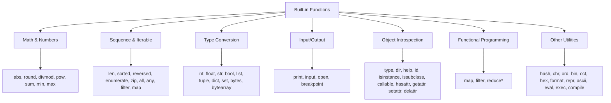
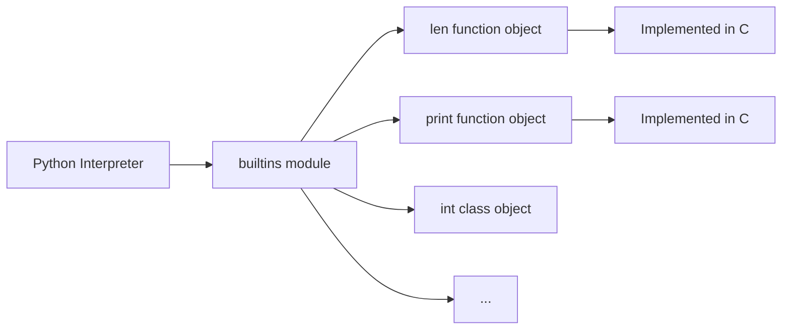

# 📘 Python Built-in Functions: The Swiss Army Knife of Python

## 1. Intuitive Introduction

Imagine you're moving into a new apartment. The landlord hands you a set of keys – one for the front door, one for the mailbox, one for the storage room. You don't need to build these locks or forge these keys; they're **already there**, ready to use. You just need to know which key opens which door.

Python's **built-in functions** are exactly that: a pre‑made toolkit that comes with every Python installation. They are always available – you never need to import them. With over 70 built-in functions, they handle everything from basic maths (`abs()`, `round()`) to data processing (`map()`, `filter()`), type conversion (`int()`, `str()`), and debugging (`breakpoint()`).

You use them constantly:
- **Student project** – `len()` to check list length, `print()` to display results.
- **Data science** – `sum()`, `min()`, `max()` for quick statistics; `zip()` to combine columns.
- **Web development** – `open()` to read files, `enumerate()` for indexed loops.
- **Machine Learning** – `any()` and `all()` for condition checks; `map()` for feature transformations.

## 2. Real‑World Analogy: The Tool Shed

Think of built-in functions as a **well‑organised tool shed**. Every tool has a specific purpose:

- **Tape measure** = `len()` – tells you how long something is.
- **Calculator** = `abs()`, `round()`, `divmod()` – does the maths for you.
- **Label maker** = `str()`, `repr()`, `ascii()` – converts objects to readable strings.
- **Sieve** = `filter()` – separates what you want from what you don't.
- **Assembly line** = `map()` – transforms every item on the line.
- **Magnifying glass** = `dir()`, `type()`, `help()` – inspects objects.

You don't build these tools yourself; they come with the shed. And you can combine them – use the tape measure, then the saw, then the sander – to build something complex from simple parts.

## 3. Core Theory

Built-in functions are functions that are **always available** in the Python interpreter's global namespace. They are implemented in C (for performance) and are part of the Python standard library.

### Key Properties

| Property | Explanation |
|----------|-------------|
| **Always available** | No `import` statement needed – they're in the `builtins` module |
| **Implemented in C** | Fast and efficient, unlike pure‑Python functions |
| **Cover many domains** | Math, sequences, type conversion, I/O, object introspection |
| **Some are actually classes** | `int`, `str`, `list`, `dict`, `tuple` are classes, not functions |
| **Can be shadowed** | You can accidentally (or deliberately) override them with your own variables |
| **Accessible via `builtins` module** | `import builtins; builtins.len([1,2,3])` |

### What Counts as a "Built-in"?

Python has **71 built-in functions** in Python 3.10. However, some are actually **classes** (types) like `int`, `str`, `list`, `dict`, `set`, `tuple`, `range`, `enumerate`. They are still listed as "built-in functions" because they can be called like functions.

### Basic Syntax

```python
# Called like any other function
result = function_name(arguments)

# Examples
print(len("hello"))           # 5
print(abs(-42))               # 42
print(max([1, 5, 3, 9, 2]))  # 9
```

## 4. Visual Explanation

Built-in functions are organised into categories. Here's a mental map:



*Note: `reduce` is in `functools`, not built-in (but often grouped with them).*

## 5. Memory & Internal Working (CPython)

Built-in functions are implemented in C and are part of the CPython interpreter itself. They are stored in the `builtins` module, which is automatically imported at startup.

### The `builtins` Module

```python
import builtins
print(dir(builtins)[:10])  # Shows the first 10 built-in names
```

When you call `len()`, Python looks for it in the local scope, then the global scope, and finally in the `builtins` module. If you define a variable named `len`, it shadows the built-in:

```python
len = 42          # Shadows the built-in len()
print(len)        # 42
# print(len([1,2,3]))  # TypeError: 'int' object is not callable

# Access the original built-in:
import builtins
print(builtins.len([1,2,3]))  # 3
```

### Memory Diagram



Each built-in function is a **C function object** that lives in memory for the entire lifetime of the interpreter. Calling them involves a small overhead (like any function call), but they are highly optimised.

## 6. Creating Built-in Functions

You **cannot** create new built-in functions (they're part of the interpreter). However, you can:

### 6.1 Use them directly

```python
print(abs(-10))  # 10
```

### 6.2 Assign them to variables (aliasing)

```python
my_len = len
print(my_len("hello"))  # 5
```

### 6.3 Pass them as arguments

```python
numbers = [1, 4, 2, 8, 5]
print(sorted(numbers, key=abs))  # [1, 2, 4, 5, 8]
```

### 6.4 Store them in data structures

```python
funcs = [len, max, min, sum]
data = [1, 2, 3, 4, 5]
for f in funcs:
    print(f.__name__, f(data))
# len 5
# max 5
# min 1
# sum 15
```

### 6.5 Override them (not recommended, but possible)

```python
# WARNING: This breaks len() for everyone in this scope!
def len(x):
    return 999

print(len([1,2,3]))  # 999 (not 3!)
```

### 6.6 Access them via the `builtins` module

```python
import builtins
print(builtins.len("hello"))  # 5
```

## 7. Core Operations / Methods (by Category)

### 7.1 Mathematical Functions

| Function | Description | Example |
|----------|-------------|---------|
| `abs(x)` | Absolute value | `abs(-5)` → `5` |
| `round(x, ndigits=0)` | Round to nearest integer or given decimal places | `round(3.14159, 2)` → `3.14` |
| `pow(x, y, z=None)` | x raised to y; if z given, modulo | `pow(2, 3)` → `8`; `pow(2, 3, 5)` → `3` |
| `divmod(a, b)` | Returns (quotient, remainder) | `divmod(17, 5)` → `(3, 2)` |
| `sum(iterable, start=0)` | Sums elements | `sum([1,2,3])` → `6` |
| `min(iterable, *args)` | Smallest item | `min(3, 1, 4)` → `1` |
| `max(iterable, *args)` | Largest item | `max([3, 1, 4])` → `4` |

```python
# Examples
print(abs(-42))           # 42
print(round(3.14159, 2))  # 3.14
print(divmod(20, 6))      # (3, 2)  because 20 = 3*6 + 2
print(sum([10, 20, 30]))  # 60
print(min(5, 2, 8, 1))    # 1
print(max([5, 2, 8, 1]))  # 8
```

### 7.2 Sequence & Iterable Functions

| Function | Description | Example |
|----------|-------------|---------|
| `len(iterable)` | Number of items | `len([1,2,3])` → `3` |
| `sorted(iterable, key=None, reverse=False)` | Returns new sorted list | `sorted([3,1,2])` → `[1,2,3]` |
| `reversed(sequence)` | Reverse iterator | `list(reversed([1,2,3]))` → `[3,2,1]` |
| `enumerate(iterable, start=0)` | Yields (index, value) pairs | `list(enumerate(['a','b']))` → `[(0,'a'),(1,'b')]` |
| `zip(*iterables)` | Aggregate elements from multiple iterables | `list(zip([1,2],['a','b']))` → `[(1,'a'),(2,'b')]` |
| `all(iterable)` | True if all elements are truthy | `all([True, True])` → `True` |
| `any(iterable)` | True if any element is truthy | `any([False, True])` → `True` |

```python
# enumerate - cleaner than range(len())
fruits = ['apple', 'banana', 'cherry']
for i, fruit in enumerate(fruits, start=1):
    print(f"{i}: {fruit}")  # 1: apple, 2: banana, 3: cherry

# zip - combine two lists
names = ['Alice', 'Bob']
scores = [85, 92]
for name, score in zip(names, scores):
    print(f"{name}: {score}")

# all and any
numbers = [2, 4, 6, 8]
print(all(n % 2 == 0 for n in numbers))  # True
print(any(n > 10 for n in numbers))      # False
```

### 7.3 Type Conversion Functions

| Function | Description | Example |
|----------|-------------|---------|
| `int(x, base=10)` | Convert to integer | `int("42")` → `42` |
| `float(x)` | Convert to floating‑point | `float("3.14")` → `3.14` |
| `str(x)` | Convert to string | `str(42)` → `"42"` |
| `bool(x)` | Convert to boolean | `bool(0)` → `False` |
| `list(iterable)` | Create a list | `list("abc")` → `['a','b','c']` |
| `tuple(iterable)` | Create a tuple | `tuple([1,2,3])` → `(1,2,3)` |
| `dict(iterable)` | Create a dictionary | `dict([('a',1),('b',2)])` → `{'a':1,'b':2}` |
| `set(iterable)` | Create a set | `set([1,2,2,3])` → `{1,2,3}` |
| `bytes(iterable)` | Create bytes object | `bytes([65,66])` → `b'AB'` |
| `bytearray(iterable)` | Create mutable bytes | `bytearray([65,66])` → `bytearray(b'AB')` |

```python
# Type conversion
print(int("1010", 2))    # 10 (binary to decimal)
print(float("3.14"))     # 3.14
print(str(100))          # "100"
print(bool([]))          # False (empty list is falsy)
print(list("hello"))     # ['h','e','l','l','o']
print(dict(a=1, b=2))    # {'a': 1, 'b': 2}
```

### 7.4 Input/Output Functions

| Function | Description | Example |
|----------|-------------|---------|
| `print(*objects, sep=' ', end='\n')` | Print to console | `print("Hello", "World")` |
| `input(prompt='')` | Read a line from stdin | `name = input("Name: ")` |
| `open(file, mode='r')` | Open a file | `f = open("data.txt", "r")` |
| `breakpoint()` | Start debugger | `breakpoint()` |

```python
# print with custom separators
print("apple", "banana", "cherry", sep=", ")  # apple, banana, cherry

# input
name = input("Enter your name: ")
print(f"Hello, {name}!")

# open - reading a file
with open("example.txt", "r") as f:
    content = f.read()
```

### 7.5 Object Introspection Functions

| Function | Description | Example |
|----------|-------------|---------|
| `type(obj)` | Returns the type of an object | `type(42)` → `<class 'int'>` |
| `dir(obj)` | Returns list of attributes | `dir([])` → list of list methods |
| `help(obj)` | Display interactive help | `help(len)` |
| `id(obj)` | Returns memory address | `id("hello")` → `139876...` |
| `isinstance(obj, classinfo)` | Checks if object is an instance | `isinstance(42, int)` → `True` |
| `issubclass(cls, classinfo)` | Checks if class is a subclass | `issubclass(bool, int)` → `True` |
| `callable(obj)` | Checks if object can be called | `callable(len)` → `True` |
| `hasattr(obj, name)` | Checks if attribute exists | `hasattr([], "append")` → `True` |
| `getattr(obj, name, default=None)` | Gets attribute | `getattr([], "append")` |
| `setattr(obj, name, value)` | Sets attribute | `setattr(obj, "x", 5)` |
| `delattr(obj, name)` | Deletes attribute | `delattr(obj, "x")` |

```python
# Inspecting objects
x = [1, 2, 3]
print(type(x))          # <class 'list'>
print(dir(x)[:5])       # ['__add__', '__class__', '__contains__', ...]
print(isinstance(x, list))  # True
print(callable(x))      # False (lists are not callable)
print(hasattr(x, "append"))  # True

# getattr and setattr
class Person:
    pass
p = Person()
setattr(p, "name", "Alice")
print(getattr(p, "name", "Unknown"))  # Alice
```

### 7.6 Functional Programming Functions

| Function | Description | Example |
|----------|-------------|---------|
| `map(function, iterable, ...)` | Apply function to every item | `list(map(str.upper, ['a','b']))` → `['A','B']` |
| `filter(function, iterable)` | Keep items where function is True | `list(filter(lambda x: x>2, [1,2,3,4]))` → `[3,4]` |

```python
# map - transform every element
numbers = [1, 2, 3, 4]
squared = list(map(lambda x: x**2, numbers))
print(squared)  # [1, 4, 9, 16]

# filter - keep only even numbers
evens = list(filter(lambda x: x % 2 == 0, numbers))
print(evens)    # [2, 4]

# map with multiple iterables
a = [1, 2, 3]
b = [10, 20, 30]
sums = list(map(lambda x, y: x + y, a, b))
print(sums)     # [11, 22, 33]
```

### 7.7 Encoding & String Functions

| Function | Description | Example |
|----------|-------------|---------|
| `chr(i)` | Unicode code point to character | `chr(65)` → `'A'` |
| `ord(c)` | Character to Unicode code point | `ord('A')` → `65` |
| `bin(x)` | Integer to binary string | `bin(10)` → `'0b1010'` |
| `oct(x)` | Integer to octal string | `oct(10)` → `'0o12'` |
| `hex(x)` | Integer to hexadecimal string | `hex(255)` → `'0xff'` |
| `format(value, format_spec)` | Formatted string | `format(3.14, '.1f')` → `'3.1'` |
| `repr(obj)` | String representation for debugging | `repr("hello\n")` → `"'hello\\n'"` |
| `ascii(obj)` | ASCII‑safe repr | `ascii("café")` → `"'caf\\xe9'"` |

```python
print(chr(8364))          # €
print(ord('€'))           # 8364
print(bin(42))            # 0b101010
print(format(42, 'b'))    # 101010 (without '0b')
print(repr("hello\n"))    # 'hello\n'
```

### 7.8 Code Execution & Dynamic Functions

| Function | Description | Warning |
|----------|-------------|---------|
| `eval(expression, globals=None, locals=None)` | Evaluate a string as Python expression | ⚠️ Security risk with untrusted input |
| `exec(code, globals=None, locals=None)` | Execute Python code | ⚠️ Security risk with untrusted input |
| `compile(source, filename, mode)` | Compile source to code object | Used with `eval`/`exec` |

```python
# eval - evaluate expressions
print(eval("2 + 3 * 4"))    # 14
x = 5
print(eval("x ** 2"))       # 25

# exec - execute statements
code = """
def hello():
    print("Hello!")
hello()
"""
exec(code)  # Hello!

# WARNING: Never use eval/exec on untrusted input!
```

## 8. Advanced Concepts

### 8.1 The `key` Parameter in `sorted()`, `min()`, `max()`

These functions accept a `key` function to customise comparison:

```python
words = ["banana", "apple", "cherry", "date"]
print(sorted(words, key=len))  # ['date', 'apple', 'banana', 'cherry']

students = [("Alice", 85), ("Bob", 92), ("Charlie", 78)]
print(max(students, key=lambda x: x[1]))  # ('Bob', 92)

# Using a built-in as key
numbers = [-5, 2, -10, 8]
print(sorted(numbers, key=abs))  # [2, -5, 8, -10]  (sorted by absolute value)
```

### 8.2 `zip` with `*` for Matrix Transposition

```python
matrix = [[1, 2, 3], [4, 5, 6], [7, 8, 9]]
transposed = list(zip(*matrix))
print(transposed)  # [(1, 4, 7), (2, 5, 8), (3, 6, 9)]
```

### 8.3 `map` with Multiple Iterables

```python
a = [1, 2, 3]
b = [10, 20, 30]
c = [100, 200, 300]
result = list(map(lambda x, y, z: x + y + z, a, b, c))
print(result)  # [111, 222, 333]
```

### 8.4 `filter` with `None` (removes falsy values)

```python
mixed = [0, 1, False, 2, "", 3, None, 4]
clean = list(filter(None, mixed))
print(clean)  # [1, 2, 3, 4]
```

### 8.5 `any` and `all` with Generator Expressions

```python
# Check if any number > 100
numbers = [10, 20, 30, 200, 50]
print(any(n > 100 for n in numbers))  # True

# Check if all numbers are even
print(all(n % 2 == 0 for n in numbers))  # False
```

### 8.6 `enumerate` with Custom Start

```python
items = ['a', 'b', 'c']
for i, item in enumerate(items, start=10):
    print(f"{i}: {item}")  # 10: a, 11: b, 12: c
```

### 8.7 `isinstance` with Multiple Types

```python
value = 42
print(isinstance(value, (int, float)))  # True
print(isinstance(value, (str, list)))   # False
```

### 8.8 The `builtins` Module for Shadowed Functions

```python
# If you accidentally shadow len
len = 5
# print(len([1,2,3]))  # TypeError!

# Access the original
import builtins
print(builtins.len([1,2,3]))  # 3
```

## 9. Mathematical / Special Operations

### 9.1 `divmod` for Quotient and Remainder

```python
quotient, remainder = divmod(17, 5)
print(f"17 ÷ 5 = {quotient} remainder {remainder}")  # 17 ÷ 5 = 3 remainder 2
```

### 9.2 `pow` with Modulo (Efficient for Cryptography)

```python
# Compute (x**y) % z efficiently (modular exponentiation)
print(pow(2, 10, 1000))  # 24  (2**10 = 1024, 1024 % 1000 = 24)
```

### 9.3 `round` with `bankers' rounding` (ties to even)

```python
print(round(2.5))  # 2 (not 3! – ties round to even)
print(round(3.5))  # 4
```

### 9.4 `sum` with `start` Parameter

```python
print(sum([1, 2, 3], 10))  # 16 (10 + 1 + 2 + 3)
```

### 9.5 `hash` for Hashing Objects

```python
print(hash("hello"))   # Some integer
print(hash(42))        # 42
# Lists are unhashable: hash([1,2])  # TypeError
```

## 10. Real Practical Examples

### Example 1: Data Validation Pipeline

```python
def validate_data(records):
    """Check if all records are valid and any contain errors."""
    valid_records = []
    for record in records:
        # Check if record has all required fields
        has_all_fields = all(key in record for key in ['name', 'age', 'email'])
        if not has_all_fields:
            continue
        
        # Check if age is valid
        is_valid_age = isinstance(record['age'], int) and 0 < record['age'] < 120
        if not is_valid_age:
            continue
        
        valid_records.append(record)
    
    return {
        'valid': valid_records,
        'total': len(records),
        'valid_count': len(valid_records),
        'has_errors': any(len(record) < 3 for record in records)
    }

data = [
    {'name': 'Alice', 'age': 25, 'email': 'alice@example.com'},
    {'name': 'Bob', 'age': -5, 'email': 'bob@example.com'},
    {'name': 'Charlie', 'age': 30},  # Missing email
]
result = validate_data(data)
print(f"Valid: {result['valid_count']}/{result['total']}")  # Valid: 1/3
```

### Example 2: Log File Analysis with `map`, `filter`, `zip`

```python
import re

def analyze_logs(log_lines):
    # Extract timestamps and messages using map
    pattern = r'\[(.*?)\] (.*)'
    matches = map(lambda line: re.match(pattern, line), log_lines)
    parsed = [(m.group(1), m.group(2)) for m in matches if m]
    
    # Separate into timestamps and messages
    timestamps, messages = zip(*parsed) if parsed else ([], [])
    
    # Filter for error messages
    errors = list(filter(lambda msg: 'ERROR' in msg, messages))
    
    # Count occurrences of each error type
    error_counts = {}
    for error in errors:
        error_type = error.split(':')[0] if ':' in error else error
        error_counts[error_type] = error_counts.get(error_type, 0) + 1
    
    return {
        'total_lines': len(log_lines),
        'parsed_entries': len(parsed),
        'error_count': len(errors),
        'error_summary': error_counts
    }

logs = [
    '[2024-01-01 10:00:00] INFO: System started',
    '[2024-01-01 10:01:00] ERROR: Database connection failed',
    '[2024-01-01 10:02:00] WARNING: High memory usage',
    '[2024-01-01 10:03:00] ERROR: Timeout occurred',
]

print(analyze_logs(logs))
# {'total_lines': 4, 'parsed_entries': 4, 'error_count': 2, ...}
```

## 11. ML & Data Science Connection

### 11.1 Feature Scaling with `map`

```python
def scale_features(data, min_val=0, max_val=1):
    """Scale features to [min_val, max_val] using min-max scaling."""
    data_min = min(data)
    data_max = max(data)
    if data_max == data_min:
        return [min_val] * len(data)
    scale = (max_val - min_val) / (data_max - data_min)
    return list(map(lambda x: min_val + (x - data_min) * scale, data))

prices = [100, 200, 300, 400, 500]
scaled = scale_features(prices)
print(scaled)  # [0.0, 0.25, 0.5, 0.75, 1.0]
```

### 11.2 Combining Columns with `zip`

```python
import pandas as pd

def create_dataframe(columns, data):
    """Create a DataFrame from column names and data rows."""
    # data is a list of rows (tuples)
    # Transpose using zip to get columns
    col_data = {name: list(col) for name, col in zip(columns, zip(*data))}
    return pd.DataFrame(col_data)

data = [
    (1, 'Alice', 25),
    (2, 'Bob', 30),
    (3, 'Charlie', 35),
]
df = create_dataframe(['id', 'name', 'age'], data)
print(df)
```

### 11.3 Hyperparameter Grid with `map` and `itertools.product`

```python
from itertools import product

def grid_search_params(param_grid):
    """Generate all combinations of hyperparameters."""
    keys = param_grid.keys()
    values = param_grid.values()
    combinations = list(product(*values))
    return list(map(lambda combo: dict(zip(keys, combo)), combinations))

param_grid = {
    'learning_rate': [0.01, 0.1, 0.5],
    'batch_size': [32, 64],
    'epochs': [10, 20]
}
params = grid_search_params(param_grid)
print(f"Total combinations: {len(params)}")  # 12
print(params[0])  # {'learning_rate': 0.01, 'batch_size': 32, 'epochs': 10}
```

### 11.4 Evaluating Model Predictions

```python
def evaluate_model(y_true, y_pred):
    """Calculate multiple metrics using built-in functions."""
    n = len(y_true)
    if n == 0:
        return {}
    
    # Accuracy (for classification)
    correct = sum(1 for t, p in zip(y_true, y_pred) if t == p)
    accuracy = correct / n
    
    # Mean squared error (for regression)
    mse = sum((t - p) ** 2 for t, p in zip(y_true, y_pred)) / n
    
    # Determine if model is good
    is_good = accuracy > 0.8 and mse < 0.1
    
    return {
        'n_samples': n,
        'accuracy': round(accuracy, 3),
        'mse': round(mse, 3),
        'is_good': is_good,
        'correct': correct,
        'incorrect': n - correct
    }

y_true = [1, 0, 1, 1, 0, 1, 0, 0]
y_pred = [1, 0, 1, 0, 0, 1, 1, 0]
print(evaluate_model(y_true, y_pred))
# {'n_samples': 8, 'accuracy': 0.75, 'mse': 0.25, 'is_good': False, ...}
```

## 12. Common Mistakes & Pitfalls

| Mistake | Wrong Code | Why it fails | Correction |
|---------|------------|--------------|------------|
| **Shadowing built-ins** | `list = [1,2,3]` | Overrides `list()` function | Use `my_list` instead |
| **Using `list` as a variable name** | `list = [1,2,3]; list(range(5))` | `list` is now a list, not a function | Use `lst` or `my_list` |
| **`map` and `filter` return iterators** | `result = map(lambda x: x*2, [1,2,3]); print(result)` | Prints `<map object at...>` | Convert to list: `list(result)` |
| **`zip` truncates to shortest iterable** | `list(zip([1,2,3], ['a','b']))` | Returns `[(1,'a'),(2,'b')]` (3 is dropped) | Use `itertools.zip_longest` |
| **`all([])` returns True** | `all([])` | Vacuously true – might cause logic errors | Handle empty case explicitly |
| **`any([])` returns False** | `any([])` | Fine, but be aware | Handle if needed |
| **Using `eval` on user input** | `eval(input("Enter expression: "))` | Security risk – code injection | Use `ast.literal_eval` for safe parsing |
| **Forgetting `key` in `sorted`** | `sorted([(1,'b'),(2,'a')])` | Sorts by first element, then second | Use `key=lambda x: x[1]` if needed |

## 13. Performance Considerations

| Operation | Time Complexity | Notes |
|-----------|----------------|-------|
| `len()` | O(1) | Stored in object |
| `min()`/`max()` | O(n) | Scans all elements |
| `sum()` | O(n) | Scans all elements |
| `sorted()` | O(n log n) | Timsort (efficient) |
| `map()` | O(n) | Lazy; O(n) when consumed |
| `filter()` | O(n) | Lazy; O(n) when consumed |
| `zip()` | O(min len) | Lazy; O(n) when consumed |
| `all()`/`any()` | O(n) worst‑case | Short‑circuits early |
| `in` (with `list`) | O(n) | Linear search |
| `in` (with `set`/`dict`) | O(1) average | Hash lookup |

### Performance Tips

```python
# Good – lazy evaluation
result = sum(x**2 for x in range(1000000))  # Generator, memory efficient

# Bad – creates full list
result = sum([x**2 for x in range(1000000)])  # Memory heavy

# Good – using built-in functions (C-optimised)
numbers = list(range(1000000))
total = sum(numbers)  # Fast (C loop)

# Bad – manual loop (Python loop)
total = 0
for n in numbers:
    total += n  # Slower
```

## 14. Interview Questions

### Beginner

1. What are built-in functions? Name five of them.
2. What is the difference between `print()` and `return`?
3. How do you find the length of a list? The maximum value?
4. What does `int("42")` do? What about `int("1010", 2)`?
5. How do you check the type of an object?

### Intermediate

6. Explain the `key` parameter in `sorted()`. Give an example.
7. What is the difference between `map()` and `filter()`?
8. How does `zip()` work? What happens if the iterables have different lengths?
9. What is the difference between `all()` and `any()`? Give examples.
10. How do you access a built-in function that has been shadowed by a local variable?

### Advanced

11. Explain how `map()` and `filter()` are implemented in CPython. Why are they faster than manual loops?
12. What is the `builtins` module? When would you use it?
13. Implement a custom `reduce` function using `map` and `filter` (or without `functools.reduce`).
14. How does `isinstance()` work with inheritance? Compare with `type()`.
15. What are the security implications of `eval()` and `exec()`? How would you safely evaluate a mathematical expression from user input?

## 15. Mini Project Idea

**Project: Interactive Data Analysis Tool**

Build a command-line tool that reads a CSV file and provides summary statistics using only built-in functions (no pandas). Features:

- `load(filename)` – uses `open()` to read a CSV.
- `describe(data)` – uses `len()`, `sum()`, `min()`, `max()`, `sum()` to compute statistics.
- `filter_by(data, column, condition)` – uses `filter()` with a lambda.
- `transform(data, column, func)` – uses `map()` to apply transformations.
- `group_by(data, column)` – uses `zip()` and `dict()` to group data.

```python
def load_csv(filename):
    with open(filename, 'r') as f:
        lines = f.readlines()
    header = lines[0].strip().split(',')
    data = []
    for line in lines[1:]:
        values = line.strip().split(',')
        data.append(dict(zip(header, values)))
    return data

def describe_numeric(data, key):
    values = [float(row[key]) for row in data if row[key]]
    if not values:
        return {}
    return {
        'count': len(values),
        'sum': sum(values),
        'mean': sum(values) / len(values),
        'min': min(values),
        'max': max(values),
    }

# Usage
data = load_csv('sample.csv')
print(describe_numeric(data, 'age'))
```

## 16. Best Practices

1. **Don't shadow built-ins** – avoid variable names like `list`, `dict`, `str`, `sum`, `max`, `min`.
2. **Use built-ins over manual loops** – they're faster and more readable (e.g., `sum()` instead of a `for` loop).
3. **Leverage lazy evaluation** – `map()`, `filter()`, and generator expressions save memory.
4. **Use `all()` and `any()` for condition checks** – cleaner than manual loops with flags.
5. **Use `enumerate()` instead of `range(len())`** – more Pythonic and less error‑prone.
6. **Use `zip()` for parallel iteration** – cleaner than indexing.
7. **Use `isinstance()` instead of `type()` for type checks** – handles inheritance.
8. **Avoid `eval()` and `exec()` on untrusted input** – security risk.

## 17. Summary Table

| Category | Key Functions | Use Case |
|----------|---------------|----------|
| **Math** | `abs`, `round`, `divmod`, `pow`, `sum`, `min`, `max` | Calculations, statistics |
| **Sequences** | `len`, `sorted`, `reversed`, `enumerate`, `zip`, `all`, `any` | Data processing, iteration |
| **Type Conversion** | `int`, `float`, `str`, `bool`, `list`, `tuple`, `dict`, `set` | Data casting |
| **I/O** | `print`, `input`, `open`, `breakpoint` | User interaction, files, debugging |
| **Introspection** | `type`, `dir`, `help`, `isinstance`, `callable`, `hasattr` | Debugging, dynamic code |
| **Functional** | `map`, `filter` | Transformations, filtering |
| **Encoding** | `chr`, `ord`, `bin`, `oct`, `hex`, `format`, `repr` | String manipulation |
| **Dynamic** | `eval`, `exec`, `compile` | Dynamic code execution (use sparingly) |

## 18. Key Takeaways

- ✅ Python has **71 built-in functions** that are always available – no imports needed.
- ✅ They are implemented in **C** for speed and cover math, sequences, types, I/O, and introspection.
- ✅ Use `len()`, `sum()`, `min()`, `max()` for basic data analysis.
- ✅ Use `enumerate()` instead of `range(len())` for indexed loops.
- ✅ Use `zip()` to iterate over multiple sequences in parallel.
- ✅ Use `map()` and `filter()` for functional transformations (they return iterators).
- ✅ Use `all()` and `any()` for concise condition checks on collections.
- ✅ The `builtins` module lets you access shadowed built-ins.
- ✅ Avoid shadowing built-ins with variable names like `list`, `dict`, `sum`.
- ✅ Never use `eval()` or `exec()` on untrusted user input – security risk.

---