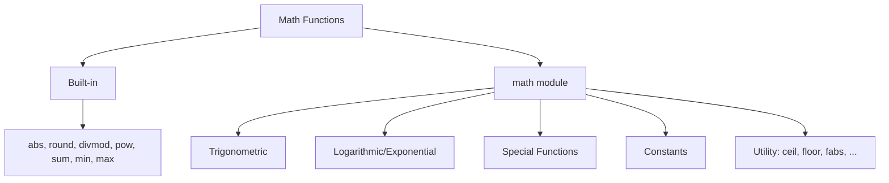
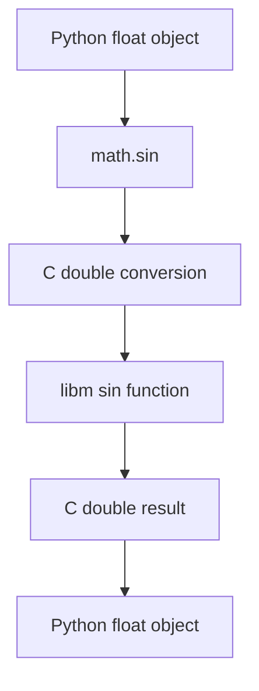

# 📘 Math Functions in Python: The Numeric Toolkit

## 1. Intuitive Introduction

Imagine you're an architect designing a bridge. You need to calculate distances, angles, loads, and materials. You don't want to implement sine, cosine, or square roots from scratch – you reach for a **scientific calculator**. Python's math functions are exactly that: a pre‑loaded, high‑precision scientific calculator built right into the language.

Math functions appear everywhere:

- **Student project** – Calculate the area of a circle: `math.pi * r ** 2`
- **Data science** – Normalise data using `math.sqrt` and `math.log`.
- **Web development** – Compute distances between coordinates for location‑based services.
- **Machine Learning** – Implement activation functions (sigmoid, ReLU), loss functions (cross‑entropy), and optimisation (gradient descent).

Python provides math functions in two flavours:

- **Built‑in** functions like `abs()`, `round()`, `pow()`, `sum()`, `min()`, `max()` – always available.
- The **`math` module** – a comprehensive library of mathematical functions and constants (trigonometric, logarithmic, exponential, special functions).

## 2. Real‑World Analogy: The Toolbox of a Mathematician

Imagine a mathematician’s desk. On it sits a **multifunction calculator** – that’s the built‑in functions: basic arithmetic, rounding, min/max. Next to it is a **scientific reference book** – that’s the `math` module: tables of constants, trigonometric formulas, logarithms, and advanced functions. You can use the calculator for quick tasks, and when you need specialised operations, you open the book.

Together, they give you everything from simple sums to complex calculus.

## 3. Core Theory

### Categories of Math Functions

| Category | Functions | Source |
|----------|-----------|--------|
| **Basic numeric** | `abs()`, `round()`, `divmod()`, `pow()` | Built‑in |
| **Aggregation** | `sum()`, `min()`, `max()` | Built‑in |
| **Trigonometric** | `sin()`, `cos()`, `tan()`, `asin()`, `acos()`, `atan()` | `math` |
| **Logarithmic & Exponential** | `exp()`, `log()`, `log10()`, `log2()`, `log1p()` | `math` |
| **Power & Root** | `sqrt()`, `pow()` (built‑in), `isqrt()` | `math` |
| **Angular conversion** | `degrees()`, `radians()` | `math` |
| **Special functions** | `gamma()`, `lgamma()`, `erf()`, `erfc()` | `math` |
| **Constants** | `pi`, `e`, `tau`, `inf`, `nan` | `math` |
| **Utility** | `ceil()`, `floor()`, `trunc()`, `fabs()`, `fmod()`, `modf()` | `math` |

### Built‑in Math Functions

These are always available, no import needed.

```python
# abs() – absolute value
print(abs(-5))          # 5

# round() – round to nearest integer or decimal places
print(round(3.14159, 2))  # 3.14
print(round(2.5))          # 2 (ties to even)

# divmod() – quotient and remainder
quot, rem = divmod(17, 5)
print(quot, rem)          # 3 2

# pow() – power (with optional modulo)
print(pow(2, 10))         # 1024
print(pow(2, 10, 100))    # 24  (2^10 % 100)

# sum(), min(), max() – aggregation
nums = [3, 1, 4, 1, 5]
print(sum(nums))          # 14
print(min(nums))          # 1
print(max(nums))          # 5
```

### The `math` Module

Import it to access advanced functions.

```python
import math

# Constants
print(math.pi)            # 3.141592653589793
print(math.e)             # 2.718281828459045
print(math.tau)           # 6.283185307179586
print(math.inf)           # inf
print(math.nan)           # nan

# Trigonometric (angles in radians)
print(math.sin(math.pi/2))  # 1.0
print(math.cos(0))          # 1.0
print(math.tan(math.pi/4))  # ~1.0

# Logarithmic
print(math.log(math.e))     # 1.0 (natural log)
print(math.log10(100))      # 2.0
print(math.log2(8))         # 3.0

# Square root
print(math.sqrt(25))        # 5.0

# Ceiling and floor
print(math.ceil(3.2))       # 4
print(math.floor(3.2))      # 3
```

## 4. Visual Explanation



A mental map: built‑in for quick numbers, `math` for heavy lifting.

## 5. Memory & Internal Working (CPython)

- **Built‑in functions** are implemented in C in the `builtins` module. They are highly optimised and call C library functions (e.g., `round()` uses C’s `round()` or `rint()`).
- **`math` module** is a thin wrapper over the C standard library’s `libm` (math library). Functions like `sin()`, `log()`, `sqrt()` are directly mapped to C functions, which are hardware‑accelerated on many platforms (e.g., using FPU or SIMD instructions).

When you call `math.sin(x)`, Python converts the Python float to a C double, calls `sin()` from `libm`, and converts the result back to a Python float. This overhead is tiny for most use cases but can be significant inside tight loops.

### Memory Diagram



Each call allocates a new Python float object for the result.

## 6. Creating Math Functions

“Creating” doesn’t apply, but you can:

- **Import the `math` module** – `import math` or `from math import sin, pi`.
- **Use `cmath` for complex numbers** – similar functions but for complex arithmetic.

### Example: Using `math` with aliases

```python
import math as m
print(m.sqrt(16))  # 4.0
```

### Example: Using `cmath`

```python
import cmath
print(cmath.sqrt(-1))  # 1j (complex unit)
```

## 7. Core Operations / Methods (Detailed)

### 7.1 Built‑in Math Functions

| Function | Description | Example | Output |
|----------|-------------|---------|--------|
| `abs(x)` | Absolute value | `abs(-3.5)` | `3.5` |
| `round(x, ndigits=0)` | Round to nearest; ties to even | `round(3.14159,2)` | `3.14` |
| `divmod(a,b)` | Quotient and remainder | `divmod(17,5)` | `(3,2)` |
| `pow(x,y,z=None)` | x**y, or (x**y)%z | `pow(2,10)` | `1024` |
| `sum(iterable, start=0)` | Sum elements | `sum([1,2,3])` | `6` |
| `min(iterable, *args)` | Minimum | `min(3,1,4)` | `1` |
| `max(iterable, *args)` | Maximum | `max([3,1,4])` | `4` |

### 7.2 `math` Module – Basic Utilities

| Function | Description | Example |
|----------|-------------|---------|
| `math.ceil(x)` | Ceiling (round up) | `math.ceil(3.2)` → `4` |
| `math.floor(x)` | Floor (round down) | `math.floor(3.2)` → `3` |
| `math.trunc(x)` | Truncate (toward zero) | `math.trunc(-3.7)` → `-3` |
| `math.fabs(x)` | Absolute value (returns float) | `math.fabs(-5)` → `5.0` |
| `math.fmod(x,y)` | Modulo (float) | `math.fmod(7,3)` → `1.0` |
| `math.modf(x)` | Returns (fractional, integer) parts | `math.modf(3.14)` → `(0.14, 3.0)` |
| `math.isclose(a,b, rel_tol, abs_tol)` | Check approximate equality | `math.isclose(0.1+0.2,0.3)` → `True` |

### 7.3 Trigonometric Functions (angles in radians)

| Function | Description | Example |
|----------|-------------|---------|
| `math.sin(x)` | Sine | `math.sin(math.pi/2)` → `1.0` |
| `math.cos(x)` | Cosine | `math.cos(0)` → `1.0` |
| `math.tan(x)` | Tangent | `math.tan(math.pi/4)` → `0.999...` |
| `math.asin(x)` | Arc sine | `math.asin(1)` → `π/2` |
| `math.acos(x)` | Arc cosine | `math.acos(0)` → `π/2` |
| `math.atan(x)` | Arc tangent | `math.atan(1)` → `π/4` |
| `math.atan2(y,x)` | Arc tangent of y/x with quadrant | `math.atan2(1,1)` → `π/4` |
| `math.hypot(x,y)` | Euclidean norm sqrt(x²+y²) | `math.hypot(3,4)` → `5.0` |
| `math.degrees(x)` | Radians to degrees | `math.degrees(math.pi)` → `180.0` |
| `math.radians(x)` | Degrees to radians | `math.radians(180)` → `π` |

### 7.4 Exponential and Logarithmic

| Function | Description | Example |
|----------|-------------|---------|
| `math.exp(x)` | eˣ | `math.exp(1)` → `2.718...` |
| `math.log(x, base)` | Natural log (base e) | `math.log(e)` → `1.0` |
| `math.log10(x)` | Base‑10 log | `math.log10(100)` → `2.0` |
| `math.log2(x)` | Base‑2 log | `math.log2(8)` → `3.0` |
| `math.log1p(x)` | log(1+x) accurate for small x | `math.log1p(1e-10)` ≈ `1e-10` |
| `math.expm1(x)` | eˣ‑1 accurate for small x | `math.expm1(1e-10)` ≈ `1e-10` |

### 7.5 Power and Root

| Function | Description | Example |
|----------|-------------|---------|
| `math.sqrt(x)` | Square root | `math.sqrt(25)` → `5.0` |
| `math.isqrt(x)` | Integer square root (floor) | `math.isqrt(25)` → `5` |
| `math.pow(x,y)` | x**y (floats) | `math.pow(2,3)` → `8.0` |

### 7.6 Special Functions

| Function | Description | Example |
|----------|-------------|---------|
| `math.gamma(x)` | Gamma function | `math.gamma(5)` → `24.0` (4!) |
| `math.lgamma(x)` | Log‑gamma | `math.lgamma(5)` → `log(24)` |
| `math.erf(x)` | Error function | `math.erf(0)` → `0.0` |
| `math.erfc(x)` | Complementary error function | `math.erfc(0)` → `1.0` |

## 8. Advanced Concepts

### 8.1 Precision and Rounding Modes

- `round()` uses **bankers' rounding** (ties to even) to avoid bias.
- `math.floor()` and `math.ceil()` handle negative numbers predictably.
- `math.trunc()` truncates toward zero (like `int()`).

```python
print(round(2.5))  # 2
print(round(3.5))  # 4
print(math.floor(-2.5))  # -3
print(math.ceil(-2.5))   # -2
print(math.trunc(-2.5))  # -2
```

### 8.2 Floating‑Point Equality with `math.isclose()`

Due to floating‑point precision, direct equality can fail:

```python
0.1 + 0.2 == 0.3  # False
math.isclose(0.1 + 0.2, 0.3)  # True
```

Parameters: `rel_tol` (relative tolerance), `abs_tol` (absolute tolerance).

### 8.3 Complex Numbers with `cmath`

```python
import cmath
z = cmath.sqrt(-1)  # 1j
print(cmath.sin(z))  # complex sine
```

### 8.4 The `fractions` and `decimal` Modules

For exact rational or decimal arithmetic, use `fractions.Fraction` and `decimal.Decimal`. They are not part of `math` but complement it.

### 8.5 Vectorised Math with NumPy

For performance on large arrays, use NumPy – it offers vectorised versions of most `math` functions, running in C.

```python
import numpy as np
arr = np.array([1, 2, 3])
print(np.sqrt(arr))   # [1. 1.414... 1.732...]
```

### 8.6 Statistics Module

For mean, median, variance, use `statistics` module – it uses `math` under the hood.

## 9. Mathematical / Special Operations

### 9.1 Gamma Function (Factorial Extension)

```python
import math
# Gamma(n) = (n-1)! for integer n
print(math.gamma(5))   # 24.0
print(math.gamma(0.5)) # sqrt(pi) ≈ 1.772...
```

### 9.2 Error Function (Gaussian Integral)

Used in probability and statistics.

```python
import math
print(math.erf(1))    # 0.8427 (area under normal curve from -1 to 1)
```

### 9.3 Angular Conversions

```python
deg = 180
rad = math.radians(deg)
print(rad)            # 3.14159
print(math.degrees(rad)) # 180.0
```

### 9.4 Euclidean Norm (Hypotenuse)

```python
dist = math.hypot(3, 4)  # 5.0
```

### 9.5 Modular Exponentiation (Efficient for Cryptography)

```python
# Compute 2^10 mod 1000
print(pow(2, 10, 1000))  # 24
```

## 10. Real Practical Examples

### Example 1: Distance Between Two GPS Coordinates (Haversine)

```python
import math

def haversine(lat1, lon1, lat2, lon2):
    """Returns distance in kilometers between two points on Earth."""
    R = 6371  # Earth radius in km
    phi1 = math.radians(lat1)
    phi2 = math.radians(lat2)
    delta_phi = math.radians(lat2 - lat1)
    delta_lambda = math.radians(lon2 - lon1)

    a = math.sin(delta_phi/2)**2 + math.cos(phi1)*math.cos(phi2)*math.sin(delta_lambda/2)**2
    c = 2 * math.atan2(math.sqrt(a), math.sqrt(1-a))
    return R * c

print(haversine(52.52, 13.40, 48.85, 2.35))  # Berlin → Paris ~877 km
```

### Example 2: Compound Interest with Monthly Contributions

```python
import math

def compound_interest(principal, rate, years, monthly_contrib=0, compounding=12):
    """Calculate future value with monthly contributions."""
    r = rate / 100
    n = compounding
    t = years
    # Future value of principal
    fv = principal * (1 + r/n) ** (n*t)
    # Future value of monthly contributions (annuity)
    if monthly_contrib:
        fv += monthly_contrib * ((1 + r/n) ** (n*t) - 1) / (r/n)
    return fv

print(compound_interest(1000, 5, 10, monthly_contrib=100))  # ~ $16,500
```

## 11. ML & Data Science Connection

### 11.1 Activation Functions (Sigmoid, ReLU)

```python
import math

def sigmoid(x):
    return 1 / (1 + math.exp(-x))

def relu(x):
    return max(0, x)

# For arrays, use NumPy for speed:
import numpy as np
def sigmoid_np(x):
    return 1 / (1 + np.exp(-x))
```

### 11.2 Log‑Likelihood and Cross‑Entropy

```python
def cross_entropy(p, q):
    return -sum(p_i * math.log(q_i) for p_i, q_i in zip(p, q))
```

### 11.3 Statistical Tests (Normal Distribution PDF)

```python
import math

def normal_pdf(x, mu=0, sigma=1):
    return (1/(sigma * math.sqrt(2*math.pi))) * math.exp(-0.5*((x-mu)/sigma)**2)
```

### 11.4 Feature Scaling (Standardisation)

```python
def standardize(data):
    mean = sum(data) / len(data)
    variance = sum((x - mean)**2 for x in data) / len(data)
    std = math.sqrt(variance)
    return [(x - mean) / std for x in data]
```

## 12. Common Mistakes & Pitfalls

| Mistake | Wrong Code | Why it fails | Correction |
|---------|------------|--------------|------------|
| **Using degrees in trig functions** | `math.sin(90)` | Expects radians | Convert: `math.sin(math.radians(90))` |
| **Floating‑point equality** | `if 0.1 + 0.2 == 0.3:` | Precision error | Use `math.isclose()` |
| **Log of non‑positive number** | `math.log(-1)` | ValueError | Check input: `if x > 0:` |
| **Square root of negative number** | `math.sqrt(-1)` | ValueError | Use `cmath.sqrt(-1)` for complex |
| **Integer division vs true division** | `math.sqrt(25) == 5` okay but `math.sqrt(4) == 2.0` | Returns float; compare with tolerance | Use `math.isclose()` |
| **Forgetting to import math** | `sqrt(16)` | NameError | `import math` or `from math import sqrt` |
| **Modulo with negative numbers** | `math.fmod(-7, 3)` vs `-7 % 3` | Different results | Understand `fmod` vs `%` behaviour |

## 13. Performance Considerations

| Operation | Time (approx) | Notes |
|-----------|---------------|-------|
| Built‑in `abs()` | ~50 ns | Very fast |
| `math.sqrt()` | ~100 ns | C call |
| `math.sin()` | ~150 ns | C call, hardware‑accelerated |
| `math.log()` | ~200 ns | C call, uses libm |
| `round()` | ~100 ns | C call |
| `sum()` over list of 1M | ~0.02 s | C loop over Python objects |
| `math.gamma()` | ~300 ns | More complex |

**Optimisation tips:**

- For large arrays, use **NumPy** – vectorised operations are 10‑100x faster.
- Avoid repeated `math` calls in tight loops – assign to local variable: `sin = math.sin`.
- Use `math.fsum()` for accurate sum of floats (avoids rounding errors).

```python
# Slow
for x in big_list:
    y = math.sin(x)

# Faster: local binding
sin = math.sin
for x in big_list:
    y = sin(x)
```

## 14. Interview Questions

### Beginner

1. What is the difference between `abs()` and `math.fabs()`?
2. How do you convert degrees to radians in Python?
3. Write a function that returns the Euclidean distance between two points.
4. What is `math.isclose()` used for?
5. How would you compute the square root of a number without importing `math`? (Hint: `**0.5`)

### Intermediate

6. Explain why `round(2.5)` returns `2` and not `3`.
7. What is the difference between `math.pow()` and `**`?
8. How does `math.hypot()` differ from `math.sqrt(x*x + y*y)`? Which is better?
9. Write a function that computes the standard deviation of a list using only built‑ins and `math`.
10. How can you safely compute `log(1+x)` for very small `x`? Why is `math.log1p()` useful?

### Advanced

11. Compare the performance of `math.sin()` for a single value vs `numpy.sin()` for an array of 1M values. Why is NumPy faster?
12. How does CPython implement `math.gamma()`? What C library does it use?
13. Describe the rounding modes available in Python and when you would use each.
14. Implement a custom `isclose` function that mimics `math.isclose` but only uses absolute tolerance.
15. Discuss the precision of `math.pi` and how it compares to `numpy.pi`. What is the machine epsilon for Python floats?

## 15. Mini Project Idea

**Project: Scientific Calculator with Memory**

Build a command‑line calculator that supports:

- Basic arithmetic: `+`, `-`, `*`, `/`, `**`
- Trigonometric functions: `sin`, `cos`, `tan` (with degree/radian toggle)
- Logarithmic: `log`, `log10`, `exp`
- Square root, factorial (using `math.gamma`)
- Memory storage: store result in variable `mem` and recall it
- History of last 10 operations

Use `math` for all functions. Parse user input with `eval()`? **No** – use a safer parser or map commands to functions. For example:

```python
import math

def calculator():
    mem = 0
    while True:
        cmd = input("> ").strip().lower()
        if cmd == 'quit': break
        if cmd.startswith('mem='):
            mem = float(cmd.split('=')[1])
            print(f"mem = {mem}")
            continue
        try:
            # Use a simple parser or eval with restricted globals
            result = eval(cmd, {'__builtins__': {}}, {'mem': mem, **math.__dict__})
            print(result)
            mem = result
        except Exception as e:
            print(f"Error: {e}")
```

**Why:** Reinforces usage of `math` functions, user input parsing, and safe execution.

## 16. Best Practices

1. **Import `math` explicitly** – don't use `from math import *` to avoid namespace pollution.
2. **Use `math.isclose()` for floating‑point comparisons** – never use `==`.
3. **Prefer `math.hypot()` over manual sqrt of squares** – it's more accurate and avoids overflow.
4. **Use `math.fsum()` for summing floats** – it’s more accurate than `sum()`.
5. **Use `math.log1p()` and `math.expm1()` for small arguments** – they preserve precision.
6. **For performance, bind math functions to local variables** inside loops.
7. **When you need complex numbers, use `cmath`** – not `math`.
8. **Always handle domain errors** (e.g., log of zero) with try/except or input validation.

## 17. Summary Table

| Function Group | Key Functions | Use Case |
|----------------|---------------|----------|
| **Built‑in** | `abs`, `round`, `divmod`, `pow`, `sum`, `min`, `max` | Everyday calculations |
| **Trigonometric** | `sin`, `cos`, `tan`, `asin`, `acos`, `atan`, `atan2`, `hypot` | Geometry, physics |
| **Log/Exp** | `exp`, `log`, `log10`, `log2`, `log1p`, `expm1` | Growth, decay, data scaling |
| **Power/Root** | `sqrt`, `isqrt`, `pow` | Algebra |
| **Rounding** | `ceil`, `floor`, `trunc`, `round` | Discretisation |
| **Special** | `gamma`, `lgamma`, `erf`, `erfc` | Statistics, physics |
| **Constants** | `pi`, `e`, `tau`, `inf`, `nan` | Mathematical formulas |

## 18. Key Takeaways

- ✅ Python provides both built‑in math functions (`abs`, `round`, etc.) and a comprehensive `math` module.
- ✅ The `math` module contains trigonometric, logarithmic, exponential, power, rounding, and special functions.
- ✅ Always use `math.radians()` when passing degrees to trig functions – they expect radians.
- ✅ Floating‑point comparisons require tolerance – use `math.isclose()`.
- ✅ For large arrays, prefer **NumPy** over looping with `math` functions – it's vectorised and faster.
- ✅ Use `math.hypot()` for Euclidean distance; it’s more robust than `sqrt(x*x + y*y)`.
- ✅ Use `math.log1p()` and `math.expm1()` for small values to avoid catastrophic cancellation.
- ✅ `math.gamma(n)` equals `(n-1)!`, useful for generalising factorials.
- ✅ Python’s `round()` uses bankers' rounding (ties to even) – be aware.
- ✅ The `cmath` module handles complex numbers if needed.

---