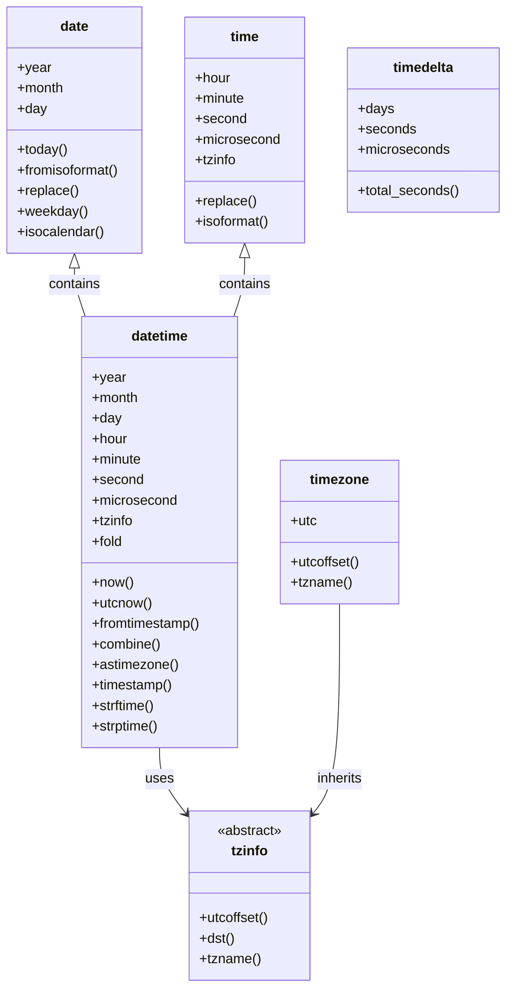
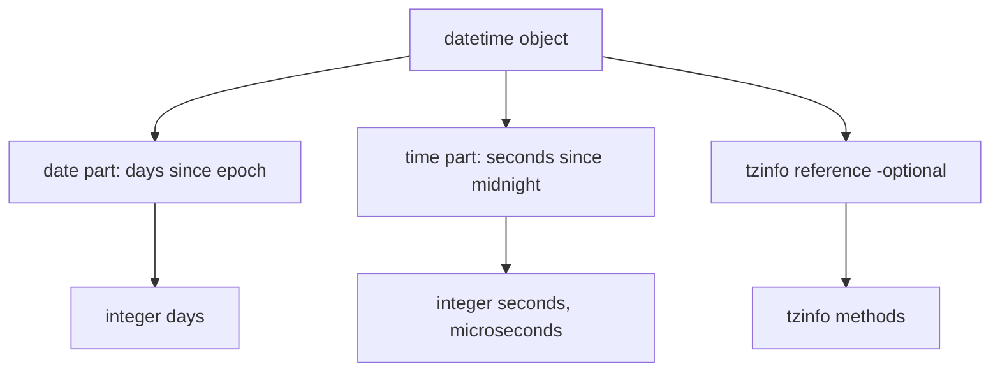

# 📘 Python DateTime: Mastering Time and Date

## 1. Intuitive Introduction

Imagine you're planning a global conference. You have speakers from Tokyo, New York, and London. You need to send them schedules in their local time, calculate how many days are left, and log when each session starts. Without a solid grasp of date and time, you'd be lost.

Python's `datetime` module is your **time wizard**. It handles:

- **Student projects** – Reminders, countdowns, assignment deadlines.
- **Data science** – Time-series analysis, converting strings to timestamps, resampling.
- **Web development** – User registration timestamps, session expiry, logging.
- **Machine Learning** – Feature engineering: day of week, hour, month, time since last event.

Dates and times are **messy**: leap years, time zones, daylight saving, cultural formats. The `datetime` module abstracts most of this complexity.

## 2. Real‑World Analogy: The Clockmaker’s Toolbox

Imagine a clockmaker’s workshop. On the wall are:

- A **calendar** – that’s the `date` class: year, month, day.
- A **clock** – that’s the `time` class: hour, minute, second, microsecond.
- A **combined device** – that’s `datetime`: both date and time.
- A **stopwatch** – that’s `timedelta`: intervals between times.
- A **world clock** – that’s `tzinfo` / `timezone`: time zone rules.

You can read the current time, add durations, convert between time zones, and format the display for any locale. The workshop keeps everything precise and consistent.

## 3. Core Theory

Python’s `datetime` module provides several classes:

| Class | Purpose | Key Attributes |
|-------|---------|---------------|
| `date` | Date (year, month, day) | `year`, `month`, `day` |
| `time` | Time (hour, minute, second, microsecond, tzinfo) | `hour`, `minute`, `second`, `microsecond`, `tzinfo` |
| `datetime` | Combination of date and time | all of above plus `fold` (for DST) |
| `timedelta` | Duration between two date/times | `days`, `seconds`, `microseconds` |
| `tzinfo` | Abstract base for time zone info | custom implementations |
| `timezone` | Concrete UTC offset implementation | `utc`, `offset` |

### Key Properties

| Property | Explanation |
|----------|-------------|
| **Immutable** | All datetime objects are immutable – you cannot change them; you create new ones. |
| **Aware vs Naive** | A `datetime` can be "naive" (no timezone) or "aware" (has a `tzinfo`). |
| **Orderable** | Dates and datetimes are comparable (`<`, `>`, `==`). |
| **Arithmetic** | You can add/subtract `timedelta`; difference returns a `timedelta`. |

### Basic Usage

```python
from datetime import date, time, datetime, timedelta, timezone

# Current date and time
now = datetime.now()          # naive, local time
utc_now = datetime.now(timezone.utc)  # aware UTC

# Create a specific datetime
d = date(2025, 12, 25)
t = time(14, 30, 0)
dt = datetime(2025, 12, 25, 14, 30, 0)

# Difference
delta = dt - datetime(2025, 12, 24, 10, 0)
print(delta.days)       # 1
print(delta.seconds)    # 16200 (4.5 hours)
```

## 4. Visual Explanation



## 5. Memory & Internal Working (CPython)

Under the hood, datetime objects are implemented in C (in `_datetime` module). Key details:

- `date` stores days since the epoch (0001-01-01) as an integer.
- `time` stores nanoseconds since midnight as a 64‑bit integer (but split into seconds and microseconds).
- `datetime` combines a `date` and a `time` object (with their internal structures).
- `timedelta` stores days, seconds, microseconds as three separate integers to handle large ranges.

Time zone handling is done via the `tzinfo` object, which is called to compute UTC offsets and DST adjustments. This happens at the time of conversion, not at creation.

### Memory Diagram



Creating a `datetime` involves allocating a Python object with three slots: date, time, and tzinfo. Timedelta has three slots for days, seconds, microseconds.

## 6. Creating DateTime Objects

### 6.1 From Components

```python
from datetime import date, time, datetime, timedelta, timezone

d = date(2025, 6, 19)               # 2025-06-19
t = time(10, 30, 45, 123456)        # 10:30:45.123456
dt = datetime(2025, 6, 19, 10, 30, 45, 123456)
```

### 6.2 Current Date/Time

```python
today = date.today()
now = datetime.now()
utc_now = datetime.now(timezone.utc)  # Python 3.11+
```

### 6.3 From Unix Timestamp

```python
ts = 1700000000
dt = datetime.fromtimestamp(ts)       # local time
dt_utc = datetime.fromtimestamp(ts, timezone.utc)  # UTC
```

### 6.4 From String (Parsing)

```python
dt = datetime.strptime("2025-06-19 10:30:45", "%Y-%m-%d %H:%M:%S")
```

### 6.5 Using `dateutil.parser` for flexible parsing

```python
from dateutil import parser
dt = parser.parse("June 19, 2025 10:30 AM")
```

### 6.6 From ISO Format

```python
dt = datetime.fromisoformat("2025-06-19T10:30:45+00:00")
```

### 6.7 Combining date and time

```python
dt = datetime.combine(date(2025,6,19), time(10,30))
```

### 6.8 Creating `timedelta`

```python
delta = timedelta(days=5, hours=3, minutes=10)
```

## 7. Core Operations / Methods

### 7.1 Accessing Components

```python
dt = datetime(2025, 6, 19, 10, 30, 45)
print(dt.year)          # 2025
print(dt.month)         # 6
print(dt.day)           # 19
print(dt.hour)          # 10
print(dt.minute)        # 30
print(dt.second)        # 45
print(dt.microsecond)   # 0
print(dt.tzinfo)        # None (naive)
```

### 7.2 Weekday and Calendar

```python
dt.weekday()            # 3 (Monday=0, Sunday=6) – for 2025-06-19 (Thursday)
dt.isoweekday()         # 4 (Monday=1, Sunday=7)
dt.isocalendar()        # (2025, 25, 4) – year, week, weekday
```

### 7.3 Replace (Create a copy with changed components)

```python
dt2 = dt.replace(year=2026, hour=12)
```

### 7.4 Arithmetic with `timedelta`

```python
dt = datetime(2025, 6, 19, 10, 0)
delta = timedelta(days=3, hours=5)
result = dt + delta          # 2025-06-22 15:00
difference = dt - datetime(2025, 6, 10)
print(difference.days)       # 9
```

### 7.5 Difference Returns `timedelta`

```python
delta = dt - datetime(2025, 6, 10, 8, 0)
print(delta.total_seconds())  # total seconds
```

### 7.6 Formatting (strftime)

```python
dt = datetime(2025, 6, 19, 10, 30)
print(dt.strftime("%Y-%m-%d"))          # 2025-06-19
print(dt.strftime("%A, %B %d, %Y"))     # Thursday, June 19, 2025
print(dt.strftime("%H:%M:%S"))          # 10:30:00
```

Common format codes:

| Code | Meaning | Example |
|------|---------|---------|
| `%Y` | Year with century | 2025 |
| `%m` | Month (zero‑padded) | 06 |
| `%d` | Day (zero‑padded) | 19 |
| `%H` | Hour (24‑hour) | 10 |
| `%I` | Hour (12‑hour) | 10 |
| `%p` | AM/PM | AM |
| `%M` | Minute | 30 |
| `%S` | Second | 45 |
| `%A` | Full weekday | Thursday |
| `%B` | Full month | June |
| `%z` | UTC offset | +0000 |
| `%Z` | Time zone name | UTC |

### 7.7 Parsing Strings (strptime)

```python
dt = datetime.strptime("19/06/2025 10:30", "%d/%m/%Y %H:%M")
```

### 7.8 Convert to Timestamp

```python
ts = dt.timestamp()   # float seconds since 1970-01-01 UTC
```

### 7.9 Convert to UTC (if aware)

```python
dt_utc = dt.astimezone(timezone.utc)
```

### 7.10 Replace with Timezone

```python
from datetime import timezone
dt_aware = dt.replace(tzinfo=timezone.utc)  # be careful: doesn't convert!
```

### 7.11 Date and Time Extraction

```python
d = dt.date()
t = dt.time()
```

## 8. Advanced Concepts

### 8.1 Naive vs Aware Datetimes

- **Naive** – no time zone info; assumes local time or context.
- **Aware** – has a `tzinfo` that knows offset from UTC and DST rules.

Always use aware datetimes for unambiguous comparison and storage, especially in distributed systems.

### 8.2 Time Zones with `zoneinfo` (Python 3.9+)

```python
from zoneinfo import ZoneInfo
tz = ZoneInfo("Europe/London")
dt = datetime(2025, 6, 19, 10, 0, tzinfo=tz)
```

### 8.3 Converting Between Time Zones

```python
dt_london = datetime(2025, 6, 19, 10, 0, tzinfo=ZoneInfo("Europe/London"))
dt_ny = dt_london.astimezone(ZoneInfo("America/New_York"))
```

### 8.4 DST Handling

When DST transitions occur, a time may be ambiguous (e.g., 2:30 AM during the fall back). Use the `fold` attribute to disambiguate:

```python
# In the autumn DST transition (e.g., 2025-10-26 in Europe)
dt = datetime(2025, 10, 26, 2, 30, 0, fold=0)   # first occurrence (before DST end)
dt2 = datetime(2025, 10, 26, 2, 30, 0, fold=1)  # second occurrence (after DST end)
```

### 8.5 Using `dateutil.relativedelta` for Relative Differences

```python
from dateutil.relativedelta import relativedelta
today = date.today()
next_month = today + relativedelta(months=+1)   # handles month boundaries
```

### 8.6 Serialization – ISO 8601

```python
dt = datetime.now().isoformat()   # "2025-06-19T10:30:45.123456"
```

### 8.7 `time` Module – Sleep and Performance

```python
import time
time.sleep(2)                     # pause 2 seconds
start = time.time()               # high‑precision timer
# ... do work ...
elapsed = time.time() - start
```

### 8.8 `calendar` Module

```python
import calendar
cal = calendar.month(2025, 6)
print(cal)
```

## 9. Mathematical / Special Operations

### 9.1 Arithmetic with `timedelta`

All operations work as expected: `+`, `-`, `*` (multiply by integer), `//`, `%`, `abs`, comparison.

```python
delta = timedelta(days=2, hours=3)
half = delta / 2                # timedelta(days=1, hours=1.5)
```

### 9.2 `total_seconds()` – convert to float

```python
td = timedelta(days=1, hours=2, minutes=3)
print(td.total_seconds())       # 93780.0
```

### 9.3 `datetime` + `timedelta` = `datetime`

Addition is commutative. Works with both positive and negative timedeltas.

## 10. Real Practical Examples

### Example 1: Age Calculator

```python
from datetime import date

def calculate_age(birth_date):
    today = date.today()
    age = today.year - birth_date.year
    # if birthday hasn't occurred yet this year, subtract 1
    if (today.month, today.day) < (birth_date.month, birth_date.day):
        age -= 1
    return age

print(calculate_age(date(1990, 6, 19)))  # 35 (if today is 2025-06-19)
```

### Example 2: Countdown Timer

```python
from datetime import datetime, timedelta

event_time = datetime(2025, 12, 25, 0, 0, 0)  # Christmas
now = datetime.now()
remaining = event_time - now
print(f"Days: {remaining.days}, Hours: {remaining.seconds//3600}")

# format nicely
total_seconds = remaining.total_seconds()
days = total_seconds // (24*3600)
hours = (total_seconds % (24*3600)) // 3600
minutes = (total_seconds % 3600) // 60
print(f"{days} days, {hours}h {minutes}m")
```

### Example 3: Business Days (Weekdays Only)

```python
from datetime import date, timedelta

def add_business_days(start_date, days):
    delta = timedelta(days=1)
    current = start_date
    added = 0
    while added < days:
        current += delta
        # Monday=0, Sunday=6
        if current.weekday() < 5:   # 0-4 = Mon-Fri
            added += 1
    return current

start = date(2025, 6, 19)  # Thursday
result = add_business_days(start, 3)
print(result)  # 2025-06-24 (if June 20-21 are weekend)
```

## 11. ML & Data Science Connection

### 11.1 Pandas Date Handling

Pandas uses `Timestamp` and `DatetimeIndex` extensively.

```python
import pandas as pd
df = pd.DataFrame({
    'timestamp': pd.date_range('2025-01-01', periods=100, freq='D'),
    'value': range(100)
})
# Extract features
df['day_of_week'] = df['timestamp'].dt.dayofweek
df['month'] = df['timestamp'].dt.month
df['hour'] = df['timestamp'].dt.hour   # if time exists
df['is_weekend'] = df['day_of_week'] >= 5
```

### 11.2 Time‑Series Resampling

```python
df.set_index('timestamp', inplace=True)
df_weekly = df.resample('W').mean()
```

### 11.3 Converting Time Series to Numeric for ML

```python
df['timestamp_numeric'] = df['timestamp'].astype(int) / 10**9  # Unix seconds
```

### 11.4 Lag Features with `shift`

```python
df['value_lag1'] = df['value'].shift(1)
```

### 11.5 Dateutil in Feature Engineering

```python
from dateutil.relativedelta import relativedelta
df['last_purchase_ago'] = df['purchase_date'].apply(
    lambda d: relativedelta(today, d).months
)
```

## 12. Common Mistakes & Pitfalls

| Mistake | Wrong Code | Why it fails | Correction |
|---------|------------|--------------|------------|
| **Mixing naive and aware** | `datetime.now() - dt_aware` | TypeError | Keep all datetimes aware (or naive) |
| **Using `replace(tzinfo=...)` to convert** | `dt.replace(tzinfo=timezone.utc)` | Does **not** convert; it just changes tzinfo | Use `dt.astimezone(timezone.utc)` |
| **Parsing format mismatch** | `strptime('2025-06-19', '%d-%m-%Y')` | ValueError | Match format: `%Y-%m-%d` |
| **Forgetting `%I` vs `%H` for 12‑hour** | `strptime('10:30 AM', '%H:%M %p')` | ValueError | Use `%I` for 12‑hour |
| **Using `datetime.utcnow()` (deprecated)** | `utcnow()` | Deprecated; returns naive UTC | Use `datetime.now(timezone.utc)` |
| **Assuming time zone in `fromtimestamp`** | `fromtimestamp(ts)` returns local time | Not UTC | Use `fromtimestamp(ts, tz=timezone.utc)` |
| **Not handling DST transition** | Arithmetic across DST boundaries | May be off by 1 hour | Use aware datetimes and avoid manual arithmetic on ambiguous times |
| **Using `date.today()` in time‑sensitive code** | `today()` changes at midnight | Can cause off‑by‑one | Use UTC or fixed reference |

## 13. Performance Considerations

| Operation | Time (approx) | Notes |
|-----------|---------------|-------|
| `datetime.now()` | ~100 ns | Fast C call |
| `datetime.strptime()` | ~1–2 µs | Parsing format strings |
| `datetime.strftime()` | ~1–2 µs | Formatting |
| `datetime` arithmetic | ~100 ns | Very fast |
| `pandas.to_datetime()` on large series | ~10 ms for 1M | Vectorised C engine |
| `dateutil.parser.parse()` | ~5–10 µs | Slower, but flexible |

**Optimisation tips:**

- For bulk parsing, use `pandas.to_datetime()`.
- Cache timezone objects (`ZoneInfo`) – creation can be expensive.
- Prefer `isoformat()` and `fromisoformat()` for serialisation – they are faster than strftime/strptime.

```python
# Fast serialization
dt = datetime.now()
s = dt.isoformat()
dt2 = datetime.fromisoformat(s)
```

## 14. Interview Questions

### Beginner

1. How do you get the current date in Python?
2. Write a function that returns the difference in days between two dates.
3. What is the difference between `datetime.now()` and `datetime.utcnow()`? (deprecated, but know)
4. How would you parse a string `"2025-06-19 15:30"` into a datetime object?
5. What is a `timedelta`? Give an example of using it.

### Intermediate

6. Explain the difference between naive and aware datetimes. When should you use each?
7. How would you convert a time from one time zone to another? Use `zoneinfo`.
8. What is the `fold` attribute in `datetime`? When is it needed?
9. How do you format a datetime as `"June 19, 2025 at 10:30 AM"`?
10. Write a function that calculates the age of a person given their birth date.

### Advanced

11. Describe how DST transitions affect datetime arithmetic and how Python handles ambiguous times.
12. Implement a custom `tzinfo` class for a time zone with no DST but a fixed offset of +5:30.
13. Compare the performance of `datetime.strptime` vs `pandas.to_datetime` on a list of 1M strings. Why does pandas win?
14. How does Python store datetime internally? What are the limitations of `datetime` (e.g., year range)?
15. Explain why `datetime.now(timezone.utc)` is preferred over `datetime.utcnow()`.

## 15. Mini Project Idea

**Project: Personal Task Scheduler with Reminders**

Build a command‑line task manager that stores tasks with due dates and times. Features:

- Add a task with a description and due datetime (e.g., "Finish report", "2025-06-25 17:00").
- List tasks sorted by due date.
- Show overdue tasks.
- Send a reminder (just print) if a task is due in the next 24 hours.
- Use `datetime` for parsing and comparisons.

```python
# Skeleton
import datetime
import json

tasks = []

def add_task(desc, due_str):
    due = datetime.datetime.strptime(due_str, "%Y-%m-%d %H:%M")
    tasks.append({"desc": desc, "due": due})

def show_tasks():
    for task in sorted(tasks, key=lambda t: t['due']):
        days = (task['due'] - datetime.datetime.now()).days
        status = "overdue" if days < 0 else f"in {days} days"
        print(f"{task['desc']} – due {task['due']} ({status})")

# Add persistence with JSON (convert to string)
def save():
    with open("tasks.json", "w") as f:
        json.dump(tasks, f, default=str)

# ... main loop
```

## 16. Best Practices

1. **Store UTC internally** – convert to local time only for display. This avoids DST and time zone issues.
2. **Use aware datetimes** – always include time zone info in production code. `zoneinfo` is the modern way.
3. **Prefer ISO 8601 for serialisation** – `isoformat()` and `fromisoformat()` are unambiguous and fast.
4. **Use `dateutil.relativedelta`** for human‑friendly date arithmetic (e.g., next month, last day of month).
5. **Avoid `datetime.utcnow()` and `datetime.utcfromtimestamp()`** – they are deprecated. Use `datetime.now(timezone.utc)`.
6. **Cache timezone objects** – creating a `ZoneInfo` repeatedly is costly; reuse.
7. **Always specify a format** when parsing strings – don't rely on `dateutil` unless you need flexibility.
8. **Test time‑zone logic** – especially around DST transitions. Use known dates like "2025-10-26 01:30" to verify.

## 17. Summary Table

| Class | Purpose | Key Methods |
|-------|---------|-------------|
| `date` | Date without time | `today()`, `fromisoformat()`, `weekday()`, `isocalendar()` |
| `time` | Time without date | `isoformat()`, `replace()` |
| `datetime` | Date and time | `now()`, `fromtimestamp()`, `astimezone()`, `strftime()`, `strptime()`, `isoformat()` |
| `timedelta` | Duration | `total_seconds()`, arithmetic (`+`, `-`, `*`) |
| `timezone` | UTC offset | `utc`, `utcoffset()` |
| `ZoneInfo` (zoneinfo) | IANA time zones | `astimezone()`, `tzname()`, `utcoffset()` |

## 18. Key Takeaways

- ✅ The `datetime` module provides `date`, `time`, `datetime`, `timedelta`, and time zone handling.
- ✅ **Naive** datetimes have no timezone; **aware** datetimes include `tzinfo`. Always prefer aware.
- ✅ Use `datetime.now(timezone.utc)` to get current UTC time.
- ✅ Use `timedelta` for arithmetic (days, seconds, microseconds). For months/years, use `relativedelta`.
- ✅ Parsing and formatting: `strptime()` / `strftime()`. Use `isoformat()` for storage.
- ✅ Time zones: `zoneinfo` (Python 3.9+) is the modern standard. Use `astimezone()` to convert.
- ✅ The `fold` attribute handles ambiguous DST times.
- ✅ In data science, **Pandas** provides powerful vectorized datetime operations.
- ✅ Always test edge cases: DST transitions, leap years, month boundaries.
- ✅ Store UTC; display local.
