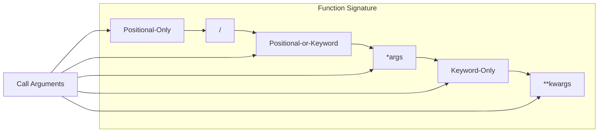
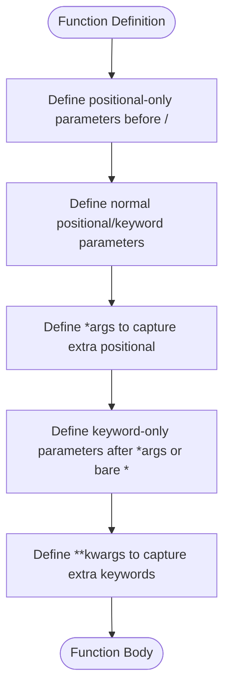
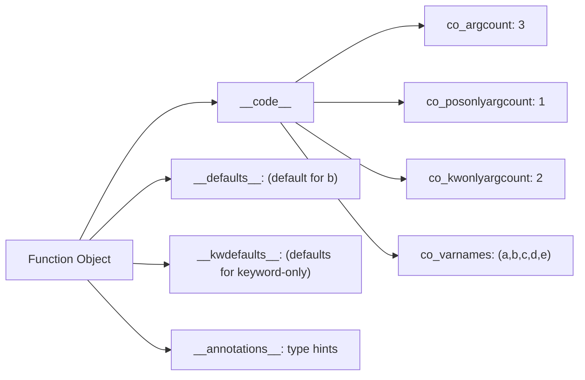

# 📘 Python Parameters: Defining Flexible and Robust Functions

## 1. Intuitive Introduction

Imagine you're a chef writing a recipe for a cake. You list the ingredients: flour, sugar, eggs, butter – but you don't specify the exact amounts because different bakers might want to adjust them. You also note that the oven temperature and baking time are optional – you can provide defaults. Your recipe is a **function definition**, and the ingredients are its **parameters**.

In Python, **parameters** are the variables listed in a function’s definition that receive values (arguments) when the function is called. They define what information a function needs to perform its task. Parameters make functions **reusable** and **customisable** – without them, every function would be hard‑coded and useless.

Understanding parameters is crucial for writing clean, flexible, and maintainable code:

- **Student projects** – Write functions that accept a variable number of inputs (e.g., `sum_all(*numbers)`).
- **Data science** – Create data processing pipelines with many optional parameters (e.g., `clean_data(df, method='mean', threshold=3)`).
- **Web development** – Build endpoints that accept query parameters and request bodies.
- **Machine Learning** – Define models with hyperparameters as keyword arguments.

Python’s parameter system is one of the most powerful and expressive in programming – it supports positional, keyword, default, variable‑length, keyword‑only, positional‑only, and even annotation‑based parameters.

## 2. Real‑World Analogy: The Hotel Reception Desk

Think of a hotel reception. The clerk asks for:

- Your name (positional parameter – required, first).
- Your passport number (also positional, but maybe second).
- The number of nights (optional, can have a default of 1).
- Any special requests (optional, like "non‑smoking room" – these are like keyword parameters).
- Your credit card for incidentals (required but you pass it separately – like `*args` for extra charges).

The clerk has a **standard script**:

```
Welcome to Hotel Python. Please provide:
  - name (required)
  - passport (required)
  - nights (optional, default 1)
  - special requests (optional, keyword)
  - extra fees (variable, *args)
```

This script is the **function signature**, and each piece of information is a **parameter**. When you check in, you supply **arguments** that match these parameters.

## 3. Core Theory

### Parameters vs Arguments

| Term | Definition | Example |
|------|------------|---------|
| **Parameter** | Variable in the function definition | `def greet(name):` – `name` is a parameter |
| **Argument** | Value passed to the function when called | `greet("Alice")` – `"Alice"` is an argument |

### Types of Parameters

Python supports five kinds of parameters (in order of definition):

1. **Positional‑only** – must be supplied by position (Python 3.8+).
2. **Positional (or keyword)** – can be supplied by position or by name.
3. **Variable‑length positional (`*args`)** – collects extra positional args as a tuple.
4. **Keyword‑only** – must be supplied by name (after `*args` or a bare `*`).
5. **Variable‑length keyword (`**kwargs`)** – collects extra keyword args as a dict.

The full parameter order is:

```
def func(pos_only1, pos_only2, /, pos_or_kwd1, pos_or_kwd2, *args, kwd_only1, kwd_only2, **kwargs):
    pass
```

### Basic Syntax

```python
# Positional (and keyword)
def greet(name, greeting="Hello"):
    return f"{greeting}, {name}!"

# Positional-only (before /)
def add(a, b, /):
    return a + b

# Keyword-only (after *)
def product(a, b, *, scale=1):
    return scale * a * b

# Variable positional and keyword
def collect(*args, **kwargs):
    print(args, kwargs)
```

## 4. Visual Explanation



A more detailed diagram of parameter categories:



## 5. Memory & Internal Working (CPython)

When a function is defined, Python stores its parameter information in the function’s `__code__` object:

- `co_argcount` – number of positional arguments (excluding `*args` and `**kwargs`).
- `co_posonlyargcount` – number of positional‑only arguments.
- `co_kwonlyargcount` – number of keyword‑only arguments.
- `co_varnames` – tuple of all local variable names (parameters first).
- `co_name` – function name.

When the function is called, Python matches arguments to parameters based on the **order** and **keywords** in the call. It does this in the following steps:

1. Bind positional arguments to positional‑only and positional‑or‑keyword parameters (in order).
2. Bind keyword arguments to parameters by name (including keyword‑only).
3. Collect any remaining positional arguments into `*args` (if present).
4. Collect any remaining keyword arguments into `**kwargs` (if present).
5. Apply default values for any unfilled parameters.

If any argument cannot be assigned (too many, too few, or unknown keyword), a `TypeError` is raised.

### Memory Diagram of a Function Object



## 6. Creating Functions with Various Parameters

### 6.1 Positional‑Only Parameters (using `/`)

```python
def divide(a, b, /):
    """a and b must be positional – no keyword names."""
    return a / b

print(divide(10, 2))   # 5.0
# print(divide(a=10, b=2))  # TypeError
```

### 6.2 Positional‑or‑Keyword (default)

```python
def greet(name, greeting="Hello"):
    print(f"{greeting}, {name}!")

greet("Alice")                # positional
greet(name="Bob")             # keyword
greet(greeting="Hi", name="Charlie")  # keyword, any order
```

### 6.3 Default Parameters

```python
def power(base, exponent=2):
    return base ** exponent

print(power(3))      # 9 (exponent=2)
print(power(3, 4))   # 81
```

### 6.4 Variable‑Length Positional (`*args`)

```python
def sum_all(*args):
    return sum(args)

print(sum_all(1,2,3,4))   # 10
```

### 6.5 Keyword‑Only Parameters (after `*` or `*args`)

```python
def greet(prefix, *names, suffix="!"):
    for name in names:
        print(f"{prefix} {name}{suffix}")

# suffix must be keyword
greet("Hello", "Alice", "Bob", suffix="?")  # Hello Alice?, Hello Bob?
greet("Hello", "Alice", "Bob", "?")         # TypeError
```

### 6.6 Variable‑Length Keyword (`**kwargs`)

```python
def print_options(**kwargs):
    for key, value in kwargs.items():
        print(f"{key}: {value}")

print_options(color="red", size="large")  # color: red, size: large
```

### 6.7 Combined Order (Full Signature)

```python
def process(a, b, /, c, d, *args, e, f, **kwargs):
    print(a,b,c,d,args,e,f,kwargs)

# a,b: positional-only; c,d: positional or keyword; e,f: keyword-only
process(1,2,3,4,5,6, e=7, f=8, extra=9)
# Output: 1 2 3 4 (5,6) 7 8 {'extra': 9}
```

### 6.8 Parameter Annotations (Type Hints)

```python
def multiply(x: int, y: int) -> int:
    return x * y
```

Annotations are stored in `__annotations__` and do not affect runtime behaviour.

## 7. Core Operations / Methods

Parameter introspection:

```python
def func(a, b=2, /, c=3, *args, d=4, **kwargs):
    pass

print(func.__code__.co_argcount)           # 4 (a,b,c,d)
print(func.__code__.co_posonlyargcount)    # 1 (a)
print(func.__code__.co_kwonlyargcount)     # 1 (d)
print(func.__defaults__)                   # (2,3) – defaults for b,c
print(func.__kwdefaults__)                 # {'d': 4}
print(func.__annotations__)                # {}
```

Use `inspect` module for advanced introspection:

```python
import inspect
sig = inspect.signature(func)
for name, param in sig.parameters.items():
    print(name, param.kind)
```

## 8. Advanced Concepts

### 8.1 Mutable Default Arguments – The Pitfall

```python
def append_to(item, my_list=[]):
    my_list.append(item)
    return my_list

print(append_to(1))   # [1]
print(append_to(2))   # [1,2]  – surprise!

# Fix:
def append_to(item, my_list=None):
    if my_list is None:
        my_list = []
    my_list.append(item)
    return my_list
```

Defaults are evaluated at **definition time**, not call time.

### 8.2 Keyword‑Only Arguments Without `*args`

```python
def f(a, *, b):   # b is keyword-only
    return a + b

f(1, b=2)   # ok
f(1, 2)     # TypeError
```

### 8.3 Positional‑Only Arguments (Python 3.8+)

Useful when you want to enforce positional order for backwards‑compatibility or when parameter names are not meaningful.

```python
def write_to_file(file, data, /):
    # 'file' and 'data' must be positional; no keyword names allowed.
```

### 8.4 Combining `*` and `**` in Function Calls (Unpacking)

```python
def greet(name, age):
    print(f"{name} is {age} years old")

args = ("Alice", 25)
kwargs = {"age": 30, "name": "Bob"}

greet(*args)      # Alice is 25 years old
greet(**kwargs)   # Bob is 30 years old
```

### 8.5 `*` and `**` in Parameter Definitions and Calls – Symmetry

- `*args` in definition collects extra positional args.
- `*iterable` in call expands iterable into positional args.
- `**kwargs` in definition collects extra keyword args.
- `**dict` in call expands dict into keyword args.

### 8.6 Using `functools.partial` to Fix Parameters

```python
from functools import partial
def power(base, exponent):
    return base ** exponent

square = partial(power, exponent=2)
print(square(5))   # 25
```

### 8.7 Parameter Passing Mechanism – Pass‑by‑Object‑Reference

In Python, arguments are passed by **object reference**. If you pass a mutable object (e.g., list), modifications inside the function affect the original.

```python
def modify(lst):
    lst.append(4)

x = [1,2,3]
modify(x)
print(x)   # [1,2,3,4]
```

But reassigning the parameter rebinds it locally; it does not affect the original.

### 8.8 Using `inspect` to Build Generic Wrappers

```python
import inspect

def wrapper(func, *args, **kwargs):
    # Validate parameters before calling
    sig = inspect.signature(func)
    bound = sig.bind(*args, **kwargs)
    bound.apply_defaults()
    # now bound.arguments has all parameters
    return func(*bound.args, **bound.kwargs)
```

## 9. Mathematical / Special Operations

Parameters themselves are not mathematical, but they are used in mathematical functions:

```python
def linear(x, m=1.0, c=0.0):
    """Linear function: y = m*x + c."""
    return m * x + c

def quadratic(x, a=1, b=0, c=0):
    return a*x**2 + b*x + c
```

Default parameters make these functions easy to specialise:

```python
f = partial(quadratic, a=2, b=3)
```

## 10. Real Practical Examples

### Example 1: Flexible Data Loader

```python
def load_data(file_path, delimiter=',', header=True, encoding='utf-8', **kwargs):
    """
    Load a file with flexible options.
    Extra kwargs passed to pandas.read_csv (if present).
    """
    import pandas as pd
    return pd.read_csv(file_path, sep=delimiter, header=0 if header else None, encoding=encoding, **kwargs)

df = load_data("data.csv", delimiter=';', index_col=0)
```

### Example 2: API Request Builder

```python
def make_request(method, endpoint, /, *args, timeout=30, **headers):
    """
    method and endpoint are positional-only.
    args are additional path parameters (e.g., for URL building).
    headers are keyword arguments for custom headers.
    """
    url = f"https://api.example.com/{endpoint}"
    for arg in args:
        url += f"/{arg}"
    print(f"{method} {url}, timeout={timeout}, headers={headers}")

make_request("GET", "users", "123", "profile", timeout=10, Authorization="Bearer token")
```

## 11. ML & Data Science Connection

### 11.1 Sklearn‑style Model with Many Hyperparameters

```python
class MyModel:
    def __init__(self, learning_rate=0.01, epochs=100, batch_size=32, **kwargs):
        self.lr = learning_rate
        self.epochs = epochs
        self.batch_size = batch_size
        # store any extra hyperparameters for experiment tracking
        self.extra = kwargs

    def fit(self, X, y, **fit_kwargs):
        # fit_kwargs could include validation_split, verbose, etc.
        pass
```

### 11.2 Feature Transformation Function

```python
def transform_features(df, drop_columns=None, scale=True, log_transform=None, **kwargs):
    """Apply a series of transformations based on parameters."""
    if drop_columns:
        df = df.drop(columns=drop_columns)
    if scale:
        from sklearn.preprocessing import StandardScaler
        scaler = StandardScaler(**kwargs)
        df_scaled = scaler.fit_transform(df)
        return df_scaled
    # ...
```

### 11.3 Callback Function with Flexible Signatures

```python
def train_with_callback(model, X, y, callback=None, **callback_kwargs):
    for epoch in range(epochs):
        loss = model.train_step(X, y)
        if callback:
            callback(loss, epoch, **callback_kwargs)
```

## 12. Common Mistakes & Pitfalls

| Mistake | Wrong Code | Why it fails | Correction |
|---------|------------|--------------|------------|
| **Mutable default** | `def f(lst=[]): lst.append(1); return lst` | List persists across calls | Use `None` and create new list |
| **Order of parameters** | `def f(**kwargs, *args):` | SyntaxError | Put `*args` before `**kwargs` |
| **Positional-only vs keyword** | `def f(a,/): f(a=1)` | TypeError: a is positional‑only | Call as `f(1)` |
| **Keyword-only called positionally** | `def f(*, a): f(1)` | TypeError | Call as `f(a=1)` |
| **Forgetting to unpack** | `args=(1,2); f(args)` | Passes tuple as one arg | `f(*args)` |
| **Using `*` and `**` both in definition and call confusion** | Mixing up the roles | Often leads to unexpected argument counts | Remember: `*` collects in def, expands in call |
| **Annotations not enforced** | `def f(x:int): return x+"a"` | No error at runtime | Use type checkers separately |

## 13. Performance Considerations

Parameter handling overhead is minimal for most functions. However:

- Using `*args` and `**kwargs` adds a small overhead for creating the tuple/dict.
- Default parameters are evaluated at definition time, which can be expensive if the default is a large object (e.g., a huge list).
- Function call overhead includes argument binding; for performance‑critical loops, consider binding functions locally or using built‑ins.

| Operation | Time (approx) |
|-----------|---------------|
| Function call (no params) | ~100 ns |
| Binding a few positional args | ~120 ns |
| Binding keyword args | ~150 ns |
| Using `*args` (extra tuple) | ~200 ns (plus tuple allocation) |

**Optimisation:** If you need a function to accept many arguments but performance is critical, pass them as a single object (e.g., dict or dataclass) to reduce overhead.

## 14. Interview Questions

### Beginner

1. What is the difference between a parameter and an argument?
2. How do you define a function with a default parameter? Show an example.
3. Can you call a function with keyword arguments in any order?
4. What is the purpose of `*args` in a function definition?
5. How do you make a parameter keyword‑only?

### Intermediate

6. Explain the difference between positional‑only and keyword‑only parameters. When would you use each?
7. What is the problem with mutable default arguments? How would you fix it?
8. Write a function that accepts a variable number of keyword arguments and prints them.
9. How does Python bind arguments to parameters? What happens if there are extra arguments?
10. What is the role of `/` and `*` in a function definition?

### Advanced

11. How does CPython store parameter information in a function object? How can you inspect it?
12. Describe the argument‑binding algorithm step‑by‑step. What does `inspect.BoundArguments` do?
13. Implement a decorator that validates that certain parameters are of specific types using annotations.
14. Explain the pass‑by‑object‑reference model. How does it affect mutable and immutable objects?
15. Design a function that can accept both a variable number of positional arguments and keyword arguments, and forward them to another function without losing any information.

## 15. Mini Project Idea

**Project: Command‑Parser with Flexible Parameters**

Build a system that parses user commands and calls appropriate functions. Use function parameters to define command signatures. Implement:

- `add(a, b)` – adds two numbers.
- `multiply(*args)` – multiplies any number of numbers.
- `repeat(msg, times=1)` – repeats a message.
- `config(**kwargs)` – sets configuration options.

The parser should split user input, match the command name, and call the corresponding function with the correct arguments (positional or keyword). Use parameter introspection (`inspect` module) to determine how to pass arguments.

```python
import inspect

COMMANDS = {}

def command(func):
    COMMANDS[func.__name__] = func
    return func

@command
def add(a,b):
    return a+b

@command
def multiply(*args):
    return __import__('functools').reduce(lambda x,y: x*y, args)

# In main loop:
cmd, *args = input("> ").split()
if cmd in COMMANDS:
    func = COMMANDS[cmd]
    sig = inspect.signature(func)
    # Convert args to correct types and bind
    # ...
```

## 16. Best Practices

1. **Use clear and descriptive parameter names** – they are part of your API.
2. **Prefer keyword‑only arguments for optional configuration** – they improve readability and prevent order mistakes.
3. **Use positional‑only arguments sparingly** – usually only for compatibility or when parameter names are irrelevant.
4. **Avoid mutable default arguments** – use `None` and create a new mutable inside.
5. **Do not use `*args` and `**kwargs` without a clear reason** – they make signatures less explicit. Reserve for wrappers, decorators, and cases where the number of arguments is truly variable.
6. **Document your parameters** – especially `*args` and `**kwargs` – in the docstring.
7. **Use type hints** to convey expected types (but remember they aren't enforced).
8. **Order parameters from most required to least required** (positional, default, `*args`, keyword‑only, `**kwargs`).

## 17. Summary Table

| Parameter Type | Syntax | Example | Must be passed as |
|----------------|--------|---------|--------------------|
| Positional‑only | before `/` | `def f(a,b,/):` | Position only |
| Positional‑or‑Keyword | default | `def f(a,b=1):` | Position or keyword |
| Variable positional | `*args` | `def f(*args):` | Any extra positional |
| Keyword‑only | after `*` or `*args` | `def f(*,c):` or `def f(*args,c):` | Keyword only |
| Variable keyword | `**kwargs` | `def f(**kwargs):` | Any extra keyword |

## 18. Key Takeaways

- ✅ **Parameters** are the variables in a function definition; **arguments** are the values passed.
- ✅ Python supports five kinds of parameters: positional‑only, positional‑or‑keyword, variable positional (`*args`), keyword‑only, and variable keyword (`**kwargs`).
- ✅ Order in definition: positional‑only (`/`), normal, `*args`, keyword‑only, `**kwargs`.
- ✅ Default parameters are evaluated at definition time – avoid mutable defaults.
- ✅ Use `*` in the parameter list to force following parameters to be keyword‑only.
- ✅ Use `/` to force preceding parameters to be positional‑only (Python 3.8+).
- ✅ `*args` collects extra positional args as a tuple; `**kwargs` collects extra keyword args as a dict.
- ✅ Arguments are passed by object reference – mutable objects can be modified inside the function.
- ✅ Type hints are informative but not enforced at runtime.
- ✅ For wrapper functions (decorators), use `*args, **kwargs` to pass through arguments transparently.

---